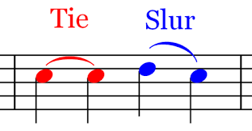
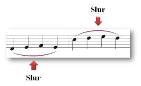
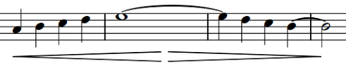
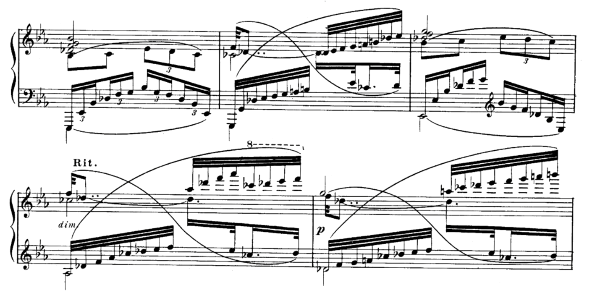
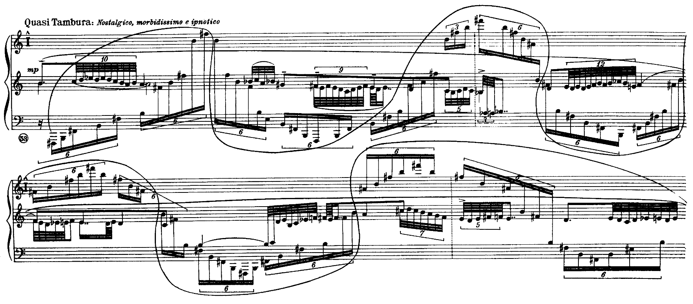

# ADR: Shared Structure

## Status: Accepted

## Related ADRs

This ADR builds on the pure tree structure described in [ADR-0010 Pure Tree Structure](/ADRs/0010-Pure-Trees.md).

## Context

Ooloi's representation of a musical structure – a Piece - is a pure tree. However, certain elements require references to other parts of the score, such as Slurs, Ties, Glissandos, and Dynamic Hairpins that span across the musical piece tree structure. These connecting elements sometimes require searching forward to collect intermediate elements for further processing.

Key considerations:
1. Performance: The solution must be efficient for musical scores of varying sizes.
2. Concurrency: Utilize multi-threading when beneficial, particularly for wider searches.
3. Memory usage: Minimize memory allocation, especially for large pieces.
4. Flexibility: Must accommodate different types of connecting elements with varying rules.
5. Maintainability: The solution should be clear and extensible for future modifications.
6. Simplicity: Core code contributors should be shielded from the complexities of the underlying mechanism.
7. Lazy Evaluation: Ensure that Measure objects and other potentially lazy structures are not unnecessarily realized during searches.

Additional context:
- Connecting elements can vary greatly in length and complexity, from simple [ties and short slurs](#image-1) to [longer slurs inside measures](#image-2).
- In complex musical pieces, slurs can span [across multiple staves and voices](#image-3).
- Dynamic hairpins and ties can [span across multiple measures](#image-5), requiring efficient handling of measure boundaries.
- Extreme cases exist where slurs can span [entire systems or pages](#image-4), as seen in Sorabji's "Opus Clavicembalisticum IX".
- Ties always connect to the next identical pitch, making them a special case for optimization.
- Formatting slurs and dynamic hairpins requires special consideration: When these elements are encountered, all relevant musical elements under them must be collected to calculate the required presentation data.
- Measure objects may be lazily implemented, and empty measures should not be searched or realized during the processing of connecting elements.

## Decision

We will implement an efficient approach for processing and rendering musical elements in Ooloi, using:

1. A pure tree structure for representing the musical piece.
2. Integer IDs for referencing elements across the tree.
3. An adaptive search strategy for traversing the musical structure.
4. Lazy sequences and transducers for efficient point collection and processing.
5. A position provider abstraction for accurate pitch positioning.
6. Specialized algorithms for processing specific musical elements (e.g., slurs, ties).

## Detailed Design

### 1. Pure Tree Structure

The Ooloi Piece is organized as a pure tree:

- Pieces contain Musicians and Layouts
- Musicians have Instruments
- Instruments have Staves
- Staves have Voices
- Voices have Measures
- Measures contain musical items (Rests, Pitches, Chords, Tuplets, Tremolandos, etc.)

### 2. Integer ID References

Elements that need to reference other parts of the score (e.g., slurs, ties) use integer IDs:

- Each Instrument maintains its own ID counter.
- IDs are generated sequentially for each new reference needed within an Instrument.
- Elements that can be referenced (e.g., Pitches, Chords) implement the TakesAttachment trait and have an `end-id` field.
- Elements that reference others (e.g., Slurs) store the ID of their endpoint in an `end` field.

### 3. Adaptive Search Strategy

Implement an adaptive search approach that efficiently traverses the musical structure:

```clojure
(defn adaptive-search [piece start-element]
  ;; Implementation to be defined based on the specific requirements of Ooloi
  ;; Include logic to resolve integer ID references
  )
```

This function will:
- Start with a local search within the current measure.
- Expand to nearby measures within the same voice/staff if necessary.
- Further expand to other voices/staves if required.
- Handle extreme cases with a global search mechanism that can skip empty measures.
- Resolve integer ID references when encountered.

### 4. Efficient Point Collection

We'll use lazy sequences and transducers for efficient, lazy processing of points:

```clojure
(defn extract-pitches
  "Recursively extracts pitches from musical elements, maintaining order and structure."
  [elem]
  (cond
    (instance? Pitch elem) [elem]
    (instance? Chord elem) (:pitches elem)
    (instance? Tuplet elem) (mapcat extract-pitches (:contents elem))
    (instance? Tremolando elem) (mapcat extract-pitches (:pitches elem))
    :else []))

(defn collect-points-xf [end-id position-provider]
  (comp
    (take-while #(not= (:end-id %) end-id))
    (mapcat extract-pitches)
    (map (fn [pitch]
           {:x (get-x-position position-provider pitch)
            :y (get-y-position position-provider pitch)
            :highest (when (instance? Chord (:parent pitch))
                       (= pitch (apply max-key #(get-y-position position-provider %) (:pitches (:parent pitch)))))
            :lowest (when (instance? Chord (:parent pitch))
                      (= pitch (apply min-key #(get-y-position position-provider %) (:pitches (:parent pitch)))))}))))

(defn collect-points [piece start-element end-id position-provider]
  (->> (adaptive-search piece start-element)
       (sequence (collect-points-xf end-id position-provider))))
```

For scenarios requiring parallel processing, we can introduce parallelism using reducers:

```clojure
(require '[clojure.core.reducers :as r])

(defn collect-points-parallel [piece start-element end-id position-provider]
  (->> (adaptive-search piece start-element)
       (into [] (take-while #(not= (:end-id %) end-id)))
       (r/fold
         (r/monoid into vector)
         (r/map (fn [elem]
                  (map (fn [pitch]
                         {:x (get-x-position position-provider pitch)
                          :y (get-y-position position-provider pitch)
                          :highest (when (instance? Chord (:parent pitch))
                                     (= pitch (apply max-key #(get-y-position position-provider %) (:pitches (:parent pitch)))))
                          :lowest (when (instance? Chord (:parent pitch))
                                    (= pitch (apply min-key #(get-y-position position-provider %) (:pitches (:parent pitch)))))})
                       (extract-pitches elem)))))))
```

### 5. Position Provider Abstraction

Implement a position provider abstraction for accurate pitch positioning:

```clojure
(defprotocol PositionProvider
  (get-x-position [this pitch])
  (get-y-position [this pitch]))

(defrecord ScorePositionProvider []
  PositionProvider
  (get-x-position [this pitch]
    ;; Implementation to calculate real X position
    )
  (get-y-position [this pitch]
    ;; Implementation to calculate real Y position
    ))
```

### 6. Specialized Processing for Musical Elements

Implement specialized processing functions for specific musical elements. For example, for slurs:

```clojure
(defn process-slur [piece slur position-provider]
  (let [points (collect-points piece (:start slur) (:end slur) position-provider)]
    ;; Process points to generate slur curve
    ;; Return processed slur data
    ))
```

Similar functions would be implemented for other musical elements like ties, glissandos, and dynamic hairpins.

## Rationale

1. The pure tree structure simplifies many operations and allows for straightforward serialization and deserialization.
2. Integer ID references provide a clean way to represent relationships between elements across the tree.
3. The adaptive search strategy provides efficient traversal for both short-range and long-range musical elements.
4. Lazy sequences and transducers enable efficient, lazy processing of points, crucial for handling large musical pieces.
5. The option for parallel processing using reducers allows for performance optimization in scenarios with very large datasets.
6. The position provider abstraction allows for accurate representation of pitch positions in complex musical contexts.
7. Specialized processing functions for each musical element type allow for optimized handling of their unique requirements.

## Consequences

### Positive

- Maintains a pure tree structure, simplifying many operations and allowing straightforward serialization/deserialization.
- Efficient handling of musical elements in large pieces.
- Accurate positioning and rendering of musical elements.
- Flexibility to handle various types of musical elements.
- Memory efficiency through lazy evaluation.
- Simpler code structure.
- Easy integration with existing Clojure sequence functions.

### Negative

- Requires careful management of integer IDs to maintain consistency.
- Special handling is needed when copying or deleting measures to maintain ID integrity.
- Increased complexity in the overall system due to specialized handling for different element types.
- Potential performance overhead for very complex musical structures.

### Neutral

- Requires careful tuning and optimization based on real-world usage patterns.
- May need periodic reviews and updates as new musical element types are added to the system.
- The choice between lazy and parallel processing needs to be made based on the specific use case and dataset size.
- Necessitates specialized algorithms for efficient searching and processing of elements that reference others.

## Implementation Notes

1. Implement the pure tree structure using Clojure's immutable data structures.
2. Develop a system for generating and managing integer IDs within each Instrument.
3. Implement and thoroughly test the adaptive search strategy for various musical scenarios.
4. Optimize the point collection process for efficiency with large datasets, using profiling to determine when to use the parallel version.
5. Develop comprehensive unit tests for each component, ensuring correct behavior in edge cases.
6. Implement the position provider with consideration for various musical notations and contexts.
7. Develop specialized processing functions for each type of musical element, ensuring consistency in approach.
8. Implement logging and profiling to monitor performance and identify potential bottlenecks.
9. Develop procedures for safely copying and deleting measures, including ID regeneration and reference updates.
10. Implement efficient lookup mechanisms for resolving ID references during rendering and other operations.

## Future Considerations

1. Optimize performance for extremely large musical scores.
2. Explore potential for parallel processing of independent sections of the score.
3. Investigate machine learning techniques for enhancing musical element rendering (e.g., slur shapes).
4. Consider implementing a plugin system for extending Ooloi's capabilities.
5. Explore real-time collaborative editing features leveraging the pure tree structure and ID reference system.
6. Investigate integration with audio playback and MIDI systems.
7. Consider developing a visual debugger for inspecting the structure and rendered elements.
8. Explore potential optimizations for scenarios with a high density of musical elements.
9. Consider implementing caching mechanisms for frequently accessed or computed values.
10. Develop profiling tools to identify performance bottlenecks in real-world usage and guide the choice between lazy and parallel processing.

## Images

These images illustrate the wide range of scenarios our solution needs to handle, from simple ties and short slurs to extremely long and complex slurs spanning multiple measures, systems, or even pages, as well as other connecting elements like dynamic hairpins that can extend across measures.

### Image 1



*Simple illustration of a tie and a slur. The tie connects two identical pitches, while the slur connects different pitches.*

### Image 2



*Slurs local to a measure.*

### Image 3



*A tie spanning multiple measures and dynamic hairpins (crescendo and diminuendo) extending across measure boundaries, demonstrating the need for efficient handling of measure boundaries in processing various connecting elements.*

### Image 4



*Complex use of slurs in a piano score, showing how slurs can span across multiple staves and interact with other musical elements.*

### Image 5



*An extreme example of a slur from Sorabji's "Opus Clavicembalisticum IX", spanning an entire system and encompassing multiple complex musical phrases.*
