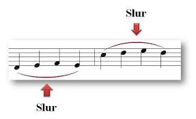

# ADR: Slur Formatting with Convex Hull and Bézier Curves

## Status: Accepted (Revised 21 July 2025)

## Context

Ooloi needs to render slurs as smooth curves with variable thickness connecting musical elements across temporal spans. This requires solving the specific algorithmic challenge of converting a collection of discrete musical element positions into natural-looking slur curves that follow musical engraving conventions.

The core challenges are:

1. **Point Collection**: Gathering x,y coordinates for all musical elements under a slur's span using temporal coordination
2. **Shape Determination**: Converting scattered coordinate points into a natural slur shape that preserves note ordering
3. **Variable Thickness Rendering**: Creating slur shapes that are thin at the endpoints and thick in the middle, requiring dual curves and fill
4. **Visual Integration**: Storing the resulting curves in the appropriate MeasureView visual hierarchy structures

## Musical Slur Characteristics (Based on Traditional Engraving)

Analysis of professional musical scores reveals these key slur formatting principles:

### Visual Examples


*Figure 1: Basic slur vs. tie comparison showing thickness and curvature differences*



*Figure 2: Professional slur placement examples showing proper curvature and positioning*


*Figure 3: Overlapping slurs in professional piano score showing nested curves and collision avoidance*

## Decision

We will implement slur formatting through:

1. **General extent point collection** using `collect-extent-items` function that works for any spanning attachment
2. **Convex half-hull calculation** to determine natural slur shape from collected points
3. **Dual Bézier curve generation** using hull-derived control points to create variable thickness
4. **Layout-aware coordinate retrieval** using composable transducers for x,y position calculation
5. **MeasureView integration** storing top and bottom edge curves in the visual hierarchy

## Detailed Design

### 1. General Extent Point Collection

```clojure
(defn collect-extent-items
  "Collect all musical items under any spanning attachment using timewalker.
   Works for any spanner attachment."
  [piece attachment start-vpd layout]
  (let [canonical-start-vpd (vpd/canonicalize start-vpd)
        instrument-boundary-vpd (vec (take 4 canonical-start-vpd))
        current-measure (or (get canonical-start-vpd 9) 0)
        ;; Find endpoint using existing attachment resolution
        [end-item end-vpd end-position] (endpoint-item piece attachment start-vpd)
        end-measure (if end-vpd (or (get end-vpd 9) current-measure) 
                                (+ current-measure MAX_LOOKAHEAD_MEASURES -1))]
    (if end-item
      (sequence (comp 
                 (timewalk {:boundary-vpd instrument-boundary-vpd 
                           :start-measure current-measure
                           :end-measure end-measure})
                 (filter takes-attachment?)  ; Only items that can have attachments
                 (obtain-xy layout))  ; Transform to x,y coordinates
                [piece])
      [])))
```

**Key Features**:
- **General purpose**: Works for slurs, hairpins, ottavas, pedal markings - any `spanner?` attachment
- **Temporal coordination**: Uses timewalker to ensure proper musical time ordering
- **Layout awareness**: Uses `(obtain-xy layout)` transducer to get coordinates from specific layout
- **Boundary scoping**: Limits search to relevant instrument for performance

### 2. Layout Coordinate Transformation

```clojure
(defn obtain-xy 
  "Composable transducer that transforms timewalker results to x,y coordinates.
   Takes a layout and returns a transducer for use in timewalker pipelines."
  [layout]
  (map (fn [result]
         (let [item (item result)
               vpd (vpd result)
               position (position result)]
           {:x (calculate-x-coordinate item vpd layout)
            :y (calculate-y-coordinate item vpd layout)
            :item item
            :vpd vpd
            :position position}))))
```

**Design Principles**:
- **Composable transducer**: Integrates seamlessly with timewalker pipelines
- **Layout-specific**: Each layout may have different x,y positions due to transposition, spacing, etc.
- **Complete information**: Preserves original timewalker result data alongside coordinates

### 3. Slur-Specific Hull Calculation

```clojure
(defn calculate-slur-hull [points above?]
  "Calculate upper or lower convex hull for slur shape, preserving left-to-right order.
   Points are already in temporal order from timewalker - no sorting required."
  (let [comparator (if above? <= >=)]
    (reduce (fn [hull point]
              (loop [hull hull]
                (if (and (>= (count hull) 2)
                         (comparator (cross-product (peek (pop hull)) (peek hull) point) 0))
                  (recur (pop hull))
                  (conj hull point))))
            [] points)))

(defn cross-product [p1 p2 p3]
  "Calculate cross product for hull computation."
  (- (* (- (:x p2) (:x p1)) (- (:y p3) (:y p1)))
     (* (- (:y p2) (:y p1)) (- (:x p3) (:x p1)))))
```

**Why Convex Hull for Slurs**:
- **Preserves note order**: Timewalker provides temporal order, maintaining left-to-right musical sequence without sorting
- **Natural shape**: Upper/lower hull matches traditional slur placement
- **Collision avoidance**: Hull naturally avoids note heads and stems
- **Mathematical stability**: O(n) algorithm, numerically stable

### 4. Bézier Curve Generation with Variable Thickness

#### Traditional Engraving Standards

Based on analysis of professional musical scores, these parameters guide the implementation:

**Slur Height Guidelines:**
- **Short slurs** (2-4 notes): 1.5-2 staff spaces above note heads
- **Medium slurs** (5-8 notes): 2-3 staff spaces above note heads  
- **Long slurs** (9+ notes or cross-barline): 3-4 staff spaces above note heads
- **Clearance**: Minimum 0.5 staff space between slur and note heads/stems

**Thickness Standards:**
- **Endpoint thickness**: 0.08-0.1 staff spaces (very fine)
- **Midpoint thickness**: 0.12-0.15 staff spaces (subtly thicker)
- **Ratio**: Midpoint should be 1.2-1.5× thicker than endpoints

**Curvature Characteristics:**
- **Control point placement**: 30% and 70% along horizontal span
- **Natural arc**: Follows mathematical curves, not manual sketching
- **Consistency**: Similar spans should produce similar curvature
- **Cross-barline**: Maintains smooth arc across measure boundaries

**Placement Rules:**
- **Single-voice passages**: Slurs always go on the side where the noteheads are, not the stems
- **Multi-voice contexts**: Different voices use opposite slur directions when possible
- **Collision avoidance**: Must clear note heads, stems, beams, and accidentals
- **Voice separation**: Upper voice slurs typically above, lower voice slurs below

#### Implementation Note: User-Configurable Parameters

All formatting parameters (thickness values, height scaling, clearance distances, control point ratios) will be user-accessible through Ooloi's settings system. The code examples below use representative values for clarity, but the production implementation will reference configurable settings rather than hardcoded constants. This enables users to match different publishing houses' style guidelines or personal preferences.

```clojure
(defn generate-slur-curves [hull above?]
  "Generate top and bottom Bézier curves for slur with variable thickness."
  (let [start (first hull)
        end (last hull)
        extreme-point (apply (if above? max-key min-key) :y hull)
        slur-span (- (:x end) (:x start))
        ;; Height scales with span: 1.5 staff spaces for short slurs, up to 4 for very long spans
        base-height (+ 1.5 (* 0.1 (min 25 (/ slur-span 4))))
        curve-height (if above? base-height (- base-height))
        ;; Variable thickness in staff space units (typical: 0.1-0.15 staff spaces)
        thickness-start 0.08  ; Very thin at endpoints 
        thickness-middle 0.12  ; Slightly thicker in middle
        ;; Clearance above/below notes (0.5 staff spaces minimum)
        note-clearance (if above? 0.5 -0.5)
        
        ;; Control points for natural slur curvature
        ;; Horizontal position: 30% and 70% along the span (creates pleasing curve)
        ;; Vertical position: based on extreme point plus curve height plus clearance
        top-control1 {:x (+ (:x start) (* 0.3 slur-span))
                      :y (+ (:y extreme-point) curve-height note-clearance)}
        top-control2 {:x (+ (:x start) (* 0.7 slur-span))
                      :y (+ (:y extreme-point) curve-height note-clearance)}
        
        ;; Bottom curve control points (offset for thickness)
        bottom-start {:x (:x start) 
                      :y (+ (:y start) (if above? (- thickness-start) thickness-start))}
        bottom-end {:x (:x end)
                    :y (+ (:y end) (if above? (- thickness-start) thickness-start))}
        bottom-control1 {:x (:x top-control1)
                         :y (+ (:y top-control1) (if above? (- thickness-middle) thickness-middle))}
        bottom-control2 {:x (:x top-control2)
                         :y (+ (:y top-control2) (if above? (- thickness-middle) thickness-middle))}]
    
    {:top-curve {:start start
                 :control1 top-control1
                 :control2 top-control2
                 :end end}
     :bottom-curve {:start bottom-start
                    :control1 bottom-control1
                    :control2 bottom-control2
                    :end bottom-end}}))
```

**Variable Thickness Design**:
- **Two curves**: Top edge and bottom edge of the slur shape
- **Thin at ends**: Minimal thickness at start/end points (0.08 staff spaces)
- **Thick in middle**: Maximum thickness at control points (0.12 staff spaces) 
- **Adaptive height**: Scales from 1.5 staff spaces (short slurs) to ~4 staff spaces (long spans)
- **Note clearance**: Maintains 0.5 staff space minimum clearance from note heads
- **Fill between**: Graphics system fills the area between the two curves

### 5. Complete Slur Formatting Pipeline

```clojure
(defn format-slur [piece slur start-vpd layout above?]
  "Complete slur formatting: point collection → hull calculation → dual Bézier generation."
  (let [points (collect-extent-items piece slur start-vpd layout)]
    (if (>= (count points) 2)  ; Need at least start and end points
      (let [hull (calculate-slur-hull points above?)
            curves (generate-slur-curves hull above?)]
        {:type :slur
         :points points
         :hull hull
         :top-curve (:top-curve curves)      ; Top edge Bézier curve
         :bottom-curve (:bottom-curve curves) ; Bottom edge Bézier curve
         :above? above?})
      nil)))  ; Not enough points to form a slur

(defn add-slur-to-measure-view [measure-view slur-data]
  "Add formatted slur curves to MeasureView curves vector."
  (-> measure-view
      (add-curve (:top-curve slur-data))
      (add-curve (:bottom-curve slur-data))))

;; Usage example
(defn render-slur-in-layout [piece slur start-vpd layout measure-view]
  "Render slur using layout-specific coordinates and add to MeasureView."
  (when-let [slur-data (format-slur piece slur start-vpd layout true)]
    (add-slur-to-measure-view measure-view slur-data)))
```

**Visual Hierarchy Integration**:
- **Destination**: Slur curves are added to the `curves` vector in `MeasureView` records
- **Two curves per slur**: Top edge and bottom edge curves enable variable thickness rendering
- **Fill rendering**: Graphics system fills the area between the two curves to create the slur shape

### Edge Cases and Special Handling

Based on analysis of professional scores, the algorithm must handle:

1. **Overlapping slurs**: Multiple simultaneous slurs on same staff (see Image 3)
   - Inner slurs should have slightly less curvature
   - Outer slurs should arc higher to avoid collision
   - Maintain consistent thickness regardless of nesting

2. **Very short slurs**: Two-note slurs require special treatment
   - Minimum arc height of 1.5 staff spaces even for adjacent notes
   - Avoid overly flat curves that look like ties

3. **Cross-system slurs**: Slurs spanning line breaks
   - Break into two curves: end-of-line and start-of-next-line
   - Maintain visual continuation across the break
   - Consistent styling between segments

4. **Stem direction conflicts**: Slurs interacting with beam groups
   - Above-staff slurs when stems point down
   - Below-staff slurs when stems point up  
   - Dynamic adjustment based on beam height

5. **Accidental collisions**: Sharps, flats, naturals affecting slur placement
   - Additional clearance for accidentals (0.25 staff spaces)
   - Slur may need to arc higher to clear tall accidentals

## Rationale

### Algorithm Choices

1. **General extent collection**: `collect-extent-items` works for any spanning attachment, enabling code reuse across slurs, hairpins, ottavas, etc.

2. **Timewalker integration**: Ensures proper temporal coordination and handles nested musical structures automatically.

3. **Layout abstraction**: `(obtain-xy layout)` transducer allows same algorithm to work with different layout contexts (transposed parts, different spacing, etc.).

4. **Convex hull approach**: Superior to polynomial fitting or manual control points for musical applications - preserves note ordering and avoids collisions naturally.

5. **Dual Bézier curves**: Creates filled slur shape with variable thickness (thin at ends, thick in middle) using two edge curves stored in MeasureView.

6. **Single-staff focus**: Simplifies implementation while covering the majority of slur cases. Multi-staff spanning can be addressed in future iterations.

### Performance Characteristics

- **Time Complexity**: O(n) for hull calculation where n = points under slur. Dual Bézier curve generation is O(1).
- **Memory**: Linear in number of points under slur, plus constant storage for 8 control points (2 curves × 4 points each)
- **Scalability**: Boundary scoping limits processing to single instrument
- **Composability**: All operations use transducers for efficient pipeline composition

## Consequences

### Positive

- **Natural slur shapes**: Hull algorithm produces curves matching traditional engraving
- **Code reuse**: `collect-extent-items` works for all spanning attachments
- **Layout flexibility**: Same algorithm works with different layout contexts
- **Mathematical stability**: Convex hull and Bézier algorithms are numerically robust
- **Performance**: Efficient algorithms suitable for interactive editing
- **Rendering compatibility**: Dual Bézier curves with variable thickness integrate with MeasureView visual hierarchy
- **Professional appearance**: Variable thickness (thin at ends, thick in middle) matches traditional music engraving

### Negative

- **Complexity**: More sophisticated than simple straight-line connections
- **Single-staff limitation**: Multi-staff slurs require additional complexity
- **Hull limitations**: May not handle all complex slur shape requirements

### Neutral

- **Domain-specific**: Optimized for musical applications rather than general curve fitting
- **Layout dependency**: Requires coordinate calculation from layout system

## Implementation Notes

1. **Test with real musical examples**: Validate hull algorithm produces acceptable slur shapes
2. **Coordinate system calibration**: Ensure staff space unit = 1.0 corresponds to actual staff line spacing
3. **Visual validation targets**:
   - Simple 2-4 note slurs should match Image 1 characteristics
   - Cross-barline slurs should maintain smooth arcs like Image 2
   - Complex multi-slur passages should handle overlaps like Image 3
4. **Optimize coordinate calculation**: Ensure `(obtain-xy layout)` performs efficiently in timewalker pipelines  
5. **Validate curve smoothness**: Adjust Bézier control point algorithm for optimal visual results

## Related Decisions

- [ADR-0014: Timewalk](0014-Timewalk.md) - Timewalking provides the point collection algorithm for slur formatting
- [ADR-0011: Shared Structure](0011-Shared-Structure.md) - Establishes the shared structure concepts that slur formatting builds upon
- [ADR-0008: VPDs](0008-VPDs.md) - VPD addressing system used for navigation in the slur algorithm
- [ADR-0010: Pure Trees](0010-Pure-Trees.md) - Tree structure that the slur formatting algorithm traverses

## Implementation Timeline

6. **Performance benchmarking**: Measure algorithm performance with large musical spans
7. **Multi-staff preparation**: Design allows future extension to cross-staff slurs
8. **Typography compatibility**: Ensure slur thickness works well with different staff sizes and music fonts

## Future Considerations

1. **Multi-staff slurs**: Extend hull algorithm to handle slurs spanning multiple staves
2. **Adaptive control points**: Adjust Bézier curves based on musical context
3. **Collision detection**: Enhance hull to explicitly avoid other musical elements
4. **Alternative curves**: Investigate other curve types for special musical contexts
5. **Interactive editing**: Users should be able to manually adjust slurs and ties onscreen through direct manipulation - dragging control points, adding control points, modifying thickness. When dragging control points, the system will move the upper and lower arc control points together as a unified pair rather than separately.
