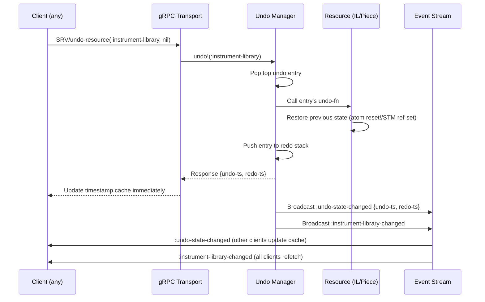
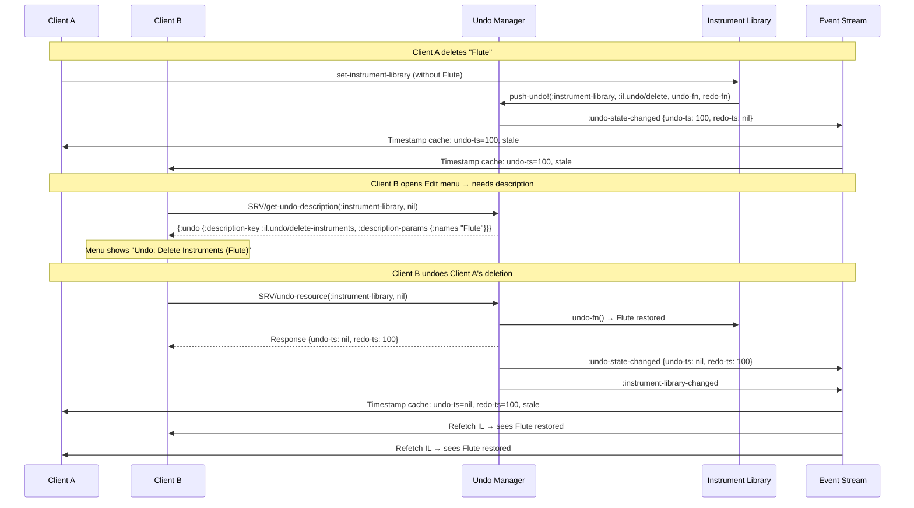
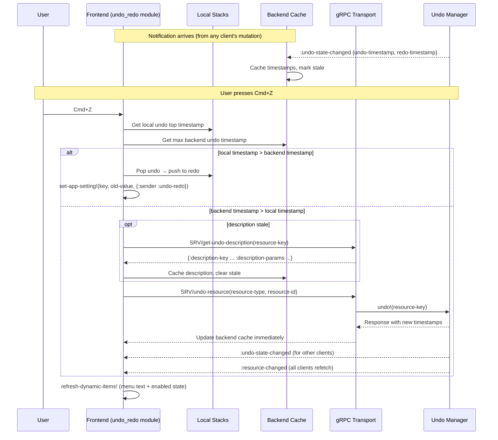

# ADR-0015: Undo and Redo Architecture in Collaborative Environment

## Table of Contents

- [Status](#status)
- [Context](#context)
  - [Key Architectural Realities](#key-architectural-realities)
- [Decision](#decision)
  - [Tier 1: Backend Undo/Redo (Coordinated)](#tier-1-backend-undoredo-coordinated)
  - [Tier 2: Frontend UI Undo/Redo (Local)](#tier-2-frontend-ui-undoredo-local)
  - [Tier 3: No Backend Application Settings Component](#tier-3-no-backend-application-settings-component)
  - [Unified User Experience](#unified-user-experience)
- [Rationale](#rationale)
- [Implementation Approach](#implementation-approach)
  - [Tier 2: Frontend Implementation](#tier-2-frontend-implementation)
  - [Tier 1: Backend Implementation — The Undo Manager](#tier-1-backend-implementation--the-undo-manager)
    - [Design Principle: Closures Over Immutable State](#design-principle-closures-over-immutable-state)
    - [The Undo Manager API](#the-undo-manager-api)
    - [Stack Semantics](#stack-semantics)
    - [Mutation Sites — How Resources Register Undo Steps](#mutation-sites--how-resources-register-undo-steps)
    - [IL Description Inference](#il-description-inference)
    - [Push-Based State Notification](#push-based-state-notification)
    - [Undo Operation — Sequence Diagram](#undo-operation--sequence-diagram)
    - [Collaborative Undo — Multi-Client Sequence](#collaborative-undo--multi-client-sequence)
  - [gRPC Extensions](#grpc-extensions)
  - [Unified Frontend Routing — Tier 1 and Tier 2 Merge](#unified-frontend-routing--tier-1-and-tier-2-merge)
    - [Frontend Undo State — Separate Stacks](#frontend-undo-state--separate-stacks)
    - [Routing Algorithm](#routing-algorithm)
    - [Single-User Guarantee](#single-user-guarantee)
    - [Multi-User Properties](#multi-user-properties)
    - [Undo Routing — Sequence Diagram](#undo-routing--sequence-diagram)
    - [Description Localisation](#description-localisation)
    - [Ownership Awareness](#ownership-awareness)
    - [Clock Skew Mitigation](#clock-skew-mitigation)
- [Future Extensions](#future-extensions)
  - [Ownership-Aware UX (client-side, no backend change)](#ownership-aware-ux-client-side-no-backend-change)
  - [Gating Foreign Operations (client-side, no backend change)](#gating-foreign-operations-client-side-no-backend-change)
  - [Server-Side Enforcement (minor backend change)](#server-side-enforcement-minor-backend-change)
  - [Policy as a Piece Setting](#policy-as-a-piece-setting)
  - [Originator Naming](#originator-naming)
  - [Why All of This Is Cheap](#why-all-of-this-is-cheap)
  - [Permanent Non-Goal: Operational Transformation](#permanent-non-goal-operational-transformation)
- [Consequences](#consequences)
- [Alternatives Considered](#alternatives-considered)
- [References](#references)
- [Notes](#notes)
  - [Why This Model Works](#why-this-model-works)
  - [Resource Types Under the Undo Manager](#resource-types-under-the-undo-manager)

---

## Status

Accepted

## Context

Ooloi's architecture presents unique challenges for implementing undo/redo functionality across a collaborative, distributed system. The system must coordinate undo/redo operations across multiple concerns:

1. **Musical content changes** (notes, rhythms, attachments) stored on the backend
2. **UI state changes** (themes, layouts, zoom levels) on individual frontend clients  
3. **Application settings** (server configuration, user preferences) with unclear scope and location

The architectural constraints established by previous ADRs create specific requirements:

- **ADR-0001**: Frontend-backend separation with two deployment models (combined desktop application, backend-only server)
- **ADR-0002**: gRPC streaming for real-time collaboration between frontend clients and backend server
- **ADR-0004**: STM-based concurrency for coordinated updates to musical structures
- **ADR-0009**: Multi-user collaborative editing with conflict resolution

### Key Architectural Realities

**Backend (Server):**
- Stores authoritative piece data using STM refs (single authority — ADR-0040)
- Handles all piece modifications with automatic conflict resolution
- Broadcasts lightweight staleness notifications via gRPC event streaming
- Does NOT store UI preferences or client-specific state

**Frontend (Clients):**
- Receives staleness notifications via gRPC streaming
- Fetches piece data on demand and maintains local non-authoritative caches
- Manages local UI state (themes, panel layouts, zoom levels)
- Handles UI interactions and forwards piece modifications to backend

**Collaborative Context:**
- Multiple frontend clients can edit the same piece simultaneously
- Backend coordinates all piece changes using STM transactions
- Frontend clients see real-time updates via the invalidate→fetch cycle
- Piece modifications must be coordinated; UI changes are client-local

## Decision

We will implement a **three-tier undo/redo architecture** that separates concerns according to the system's architectural boundaries:

### Tier 1: Backend Undo/Redo (Coordinated)
- **Scope**: All backend-managed resources — pieces (musical content), Instrument Library, future catalogues
- **Implementation**: Resource-agnostic Undo Manager component; closures over immutable state
- **Coordination**: One undo/redo stack per resource (per piece, one for IL), shared across all clients subscribed to that resource
- **Storage**: Backend server maintains per-resource undo/redo history in the Undo Manager component
- **Distribution**: Lightweight `:undo-state-changed` notifications (timestamps only) broadcast to subscribed clients via gRPC streaming; descriptions fetched lazily on demand

### Tier 2: Frontend UI Undo/Redo (Local)
- **Scope**: Client-specific UI state (themes, panel arrangements, zoom levels)
- **Implementation**: Simple local undo/redo stack per frontend client
- **Coordination**: No coordination needed - purely local to each client
- **Storage**: Frontend client memory (not persisted)
- **Distribution**: Not distributed - each client manages its own UI history

### Tier 3: No Backend Application Settings Component
- **Decision**: Backend will NOT implement an application settings component
- **Rationale**: Analysis reveals no legitimate backend application settings that require undo/redo
- **Configuration**: Server deployment configuration handled via environment variables and config files
- **User Preferences**: Stored and managed entirely by frontend clients

### Unified User Experience
- **Single Undo/Redo Interface**: Frontend presents one undo/redo button to users
- **Timestamp-Based Routing**: Frontend compares local stack timestamps with backend notification timestamps; the most recent action wins
- **Consistent Menu**: The undo/redo menu item always reflects what Cmd+Z will actually do at the moment it is pressed — the menu and the action use the same cached state, so they always agree
- **Descriptive Messages**: Undo/redo operations display clear descriptions like "Undo Add Note", "Redo Change Key Signature" rather than generic "Undo"/"Redo"

## Rationale

### STM Provides Natural Collaborative Undo/Redo
Clojure's STM system already provides the foundation for coordinated undo/redo:
- **Atomic Operations**: All piece modifications occur within `dosync` transactions
- **Conflict Resolution**: Automatic retry mechanism handles concurrent modifications
- **Consistency**: Either all changes in a transaction apply, or none do
- **Scalability**: Designed for high-performance concurrent operations (100,000+ transactions/second)

### Clear Separation Prevents Architectural Complexity
Attempting to unify undo/redo across different architectural tiers would require:
- Complex event coordination systems layered on top of STM
- Artificial coupling between UI state and musical content
- Global state management breaking STM paradigm
- Synchronization complexity across network boundaries

### Backend Settings Analysis Reveals Minimal Needs
Examination of potential backend application settings shows:
- **Server configuration** (ports, TLS, capacity limits) → Environment variables/config files
- **User session preferences** → Frontend client storage
- **Piece-specific settings** → Part of piece data, not separate settings
- **Musical algorithm parameters** (like `MAX_LOOKAHEAD_MEASURES`) → Code constants, not user settings

### Frontend-Backend Boundary Alignment
The three-tier approach aligns perfectly with existing architectural boundaries:
- **Backend responsibility**: Musical data integrity and coordination
- **Frontend responsibility**: User interface and local preferences  
- **gRPC boundary**: Clean separation maintained without artificial unification

## Implementation Approach

### Tier 2: Frontend Implementation

The Tier 2 undo/redo module (`ooloi.frontend.undo_redo`) owns two module-level atoms — an
undo stack and a redo stack — each holding a vector of stack entries. Stack entries mirror
the `:setting-changed` event payload: `{:key, :old-value, :new-value, :timestamp}`. The stack is
capped at 50 entries; oldest entries are dropped when the cap is reached.

The module subscribes to the `:app-settings` event bus category via `wire-undo-redo!`. On
each `:setting-changed` event, it calls `record-setting-change!` — unless the event carries
`:sender :undo-redo`, which marks an undo/redo-triggered replay and must not push to the
stack (feedback loop prevention).

`undo!` pops the top entry from the undo stack, calls `set-app-setting!` with the
`:old-value` and `{:sender :undo-redo}`, and pushes the entry onto the redo stack. `redo!`
does the inverse. Both are no-ops on an empty stack.

The undo and redo menu items use `text-key` functions that derive the setting name from the
top stack entry: `:ui/theme` → `:setting.ui.theme` via the convention
`(keyword (str "setting." (namespace k) "." (name k)))`. When the stack is empty, the item
falls back to the static `:menu.edit.undo` / `:menu.edit.redo` key. Both items are enabled
only when their respective stacks are non-empty.

The menu bar is built imperatively once via `build-menu-item!`. Each menu item stores its
`enabled?` predicate in the item's JavaFX `::dynamic-enabled?` property at build time.
`refresh-dynamic-items!` in `menus.clj` then updates both text (via `::dynamic-text-key`)
and enabled state (via `::dynamic-enabled?`) on every refresh call. The `enabled?` predicates
for undo and redo read directly from the atoms — `(fn [_] (undo-redo/can-undo?))` and
`(fn [_] (undo-redo/can-redo?))` — ignoring the state parameter, exactly as `text-key` does.
This means the correct enabled state is produced on every refresh regardless of which caller
triggered it (undo/redo stack change, locale change, theme change).

`wire-undo-redo!` accepts an optional `on-change` callback. In `start-app!` this is wired
as `(fn [] (fx/run-later! #(um/refresh-menu-text! mgr)))`. After every stack mutation,
`undo!`, `redo!`, and `record-setting-change!` call this callback, which queues a menu
refresh on the JavaFX Application Thread.

Action handlers `:ui/undo` and `:ui/redo` are registered in `system.clj` and delegate to
`undo-redo/undo!` and `undo-redo/redo!`. The stacks are not persisted — they reset on
application restart.

The Tier 2 stacks stand on their own — they require no knowledge of Tier 1. The
[Unified Frontend Routing](#unified-frontend-routing--tier-1-and-tier-2-merge) layer reads
the Tier 2 stacks and the backend timestamp cache in parallel and decides which one Cmd+Z
acts on. Tier 2 exposes `can-undo?`, `can-redo?`, `top-undo-key`, `top-redo-key`, `undo!`,
`redo!`, and `record-setting-change!`; the routing layer consumes them without further
coupling.

The following is the reference implementation. The normative specification is the prose
above; the code shows one realisation of those requirements.

```clojure
;; ooloi.frontend.undo_redo — reference implementation

(def ^:private max-stack-depth 50)
(def ^:private undo-stack (atom []))
(def ^:private redo-stack (atom []))
(def ^:private on-change-callback (atom nil))

(defn can-undo? [] (boolean (seq @undo-stack)))
(defn can-redo? [] (boolean (seq @redo-stack)))
(defn top-undo-key [] (:key (peek @undo-stack)))
(defn top-redo-key [] (:key (peek @redo-stack)))

(defn record-setting-change! [{:keys [key old-value new-value timestamp]}]
  (swap! undo-stack #(vec (take-last max-stack-depth (conj % {:key key :old-value old-value :new-value new-value :timestamp timestamp}))))
  (reset! redo-stack [])
  (when-let [cb @on-change-callback] (cb)))

(defn undo! []
  (when-let [entry (peek @undo-stack)]
    (swap! undo-stack pop)
    (swap! redo-stack conj entry)
    (settings/set-app-setting! (:key entry) (:old-value entry) {:sender :undo-redo})
    (when-let [cb @on-change-callback] (cb))))

(defn redo! []
  (when-let [entry (peek @redo-stack)]
    (swap! redo-stack pop)
    (swap! undo-stack conj entry)
    (settings/set-app-setting! (:key entry) (:new-value entry) {:sender :undo-redo})
    (when-let [cb @on-change-callback] (cb))))

(defn wire-undo-redo!
  ([event-bus] (wire-undo-redo! event-bus nil))
  ([event-bus on-change]
   (reset! on-change-callback on-change)
   (eb/subscribe! event-bus :app-settings
     (fn [events]
       (doseq [{:keys [type sender] :as event} events]
         (when (and (= type :setting-changed)
                    (not= sender :undo-redo))
           (record-setting-change! event)))))))
```

### Tier 1: Backend Implementation — The Undo Manager

Tier 1 covers all backend-managed resources: pieces (STM-based), the Instrument Library
(atom-based), and any future singleton catalogues. A single backend Integrant component —
the **Undo Manager** — provides undo/redo for all of them through a uniform, resource-agnostic
API.

#### Design Principle: Closures Over Immutable State

The undo manager stores pairs of zero-argument closures alongside descriptive metadata.
It knows nothing about what it is undoing. Each closure captures immutable references to the
resource state before and after the mutation. Clojure's persistent data structures mean both
snapshots share structure — holding both is cheap, with no copying, no cloning, no delta
computation.

This is the core elegance of the model: the undo manager is pure infrastructure. After it
is implemented, making any mutation undoable requires a single function call at the mutation
site. The undo-fn and redo-fn are closures that restore immutable state snapshots.

**Closures own every side effect of a state change for their resource.** The undo manager
does not distinguish between resource types — the closure abstracts the storage mechanism
*and* every other side effect that a state change implies for that resource. For the
Instrument Library, a state change is three coupled side effects: `reset!` the atom,
persist the new state to disk via the writer agent, and broadcast
`:instrument-library-changed` to subscribed clients. The mutation path and the undo path
both invoke the same canonical write helper inside the IL component — typically a single
`(apply-state! component new-state)` function — so the closure is one call, not three.
For STM-based resources (pieces), the closure performs `ref-set` inside `dosync` and
broadcasts the resource's invalidation event. Each resource defines what "apply a state"
means for it; the closure captures a snapshot and invokes that helper.

**Anti-pattern: a closure that does only `reset!` (or only `ref-set`).** Any resource
whose successful mutation triggers additional side effects (persistence, broadcast,
auditing) must wire those same side effects into the undo/redo closures. A closure that
restores in-memory state but skips persistence makes undo visible in-session and
invisible across restart. The simplest defense is a single canonical write helper per
resource — invoked by both the mutation site and the undo/redo closures — so the side
effects cannot drift apart.

**Monotonic version invariant (when the resource has optimistic locking).** Some
resources — the Instrument Library is the first — track a version counter for optimistic
locking. The counter is monotonically increasing across every state transition, including
undo and redo, regardless of how it looks conceptually. Undo and redo are no exception to
the monotonicity, even though they look like time travel — restoring earlier instruments
does not restore the earlier version. The instruments revert; the counter still ticks
forward. The canonical write helper enforces this by reading the live counter and
incrementing it on every call. A closure that captures both old-instruments and an
old-version and tries to "restore" them as a pair would break the invariant; the closure
must capture only the snapshot fields the user perceives (instruments, excluded set,
etc.) and let the helper assign the next version at execution time. See
[ADR-0045 §Optimistic Locking](0045-Instrument-Library.md#optimistic-locking).

**ADR-0040 boundary**: Snapshot restoration is an implementation detail of the undo
manager's accepted `undo!` and `redo!` operations. It is not a second authority path and
not an implicit `set-piece`. The undo manager is a backend component operating within the
single-authority boundary — the backend remains the sole authority over resource state.
No client can supply a snapshot or trigger a restoration outside the undo manager's API.

#### The Undo Manager API

The functions below are **component methods on the undo manager** — plain Clojure
functions on the Integrant component. They are **not** declared `^{:api true}` in
`interfaces.clj` and are **not** exposed in the `api`/`SRV` namespace. They are called
only from backend code: mutation sites, the Piece Manager, and the gRPC handlers for
the public operations described in [gRPC Extensions](#grpc-extensions) below.

```clojure
;; backend/components/undo_manager.clj — Integrant component
;;
;; Internal state: atom holding
;;   {resource-key → {:undo-stack [entry ...] :redo-stack [entry ...]}}
;;
;; Each entry:
;;   {:id              (UUID)
;;    :description-key :il.undo/delete-instruments   ;; translation key
;;    :description-params {:names "Flute, Oboe"}     ;; interpolation params
;;    :timestamp       1711023456789012               ;; epoch microseconds
;;    :originator-id   "client-42"                    ;; gRPC client-id at push time, or nil
;;    :undo-fn         (fn [] ...)                    ;; restores previous state
;;    :redo-fn         (fn [] ...)}                   ;; re-applies mutation

(push-undo! undo-mgr resource-key description-key description-params undo-fn redo-fn)
;; Pushes an undo entry. Clears the redo stack for this resource (standard undo semantics:
;; a new forward mutation invalidates any redo history). Broadcasts :undo-state-changed.

(undo! undo-mgr resource-key)
;; Pops the top undo entry, calls its undo-fn, pushes the entry to the redo stack.
;; Broadcasts :undo-state-changed. Returns the entry, or nil if the stack was empty.

(redo! undo-mgr resource-key)
;; Pops the top redo entry, calls its redo-fn, pushes the entry to the undo stack.
;; Broadcasts :undo-state-changed. Returns the entry, or nil if the stack was empty.

(current-state undo-mgr resource-key)
;; Returns {:undo {:description-key ... :description-params ... :timestamp ...}
;;          :redo {:description-key ... :description-params ... :timestamp ...}}
;; Either or both may be nil when the respective stack is empty.

(remove-resource! undo-mgr resource-key)
;; Clears both stacks for a resource. Called by the Piece Manager when
;; no clients have the piece open anymore. The IL stack persists for the
;; session (the IL is always available).
```

`push-undo!` reads the originator from the gRPC Context via
`(ooloi.shared.grpc.headers/get-client-id-from-context)`. The authentication interceptor
in `backend/grpc/server.clj` validates the `x-ooloi-client-id` header against the
connection registry on every `ExecuteMethod` call and stores the validated client-id in
`CLIENT_ID_CONTEXT_KEY` for the call's duration (gRPC's native context-propagation
mechanism — not a Clojure dynamic var). Any code reached from the gRPC handler —
including the mutation site and `push-undo!` — can read the client-id by calling
`get-client-id-from-context`. No new dynamic var, no new binding wrapper, and no
duplication of authentication logic. The signature of `push-undo!` is unchanged —
mutation sites do not pass the originator explicitly.

For mutations not initiated by a client call (server-side housekeeping, scheduled
tasks), `get-client-id-from-context` returns `nil` and the entry's `:originator-id` is
`nil`.

The `resource-key` is `:instrument-library` for the IL, a piece UUID for pieces, and
any future keyword or UUID for other resources. The undo manager imposes no constraints
on the key type.

**Call sites.** `push-undo!` runs at mutation sites (e.g. `set-instrument!`,
piece-mutation operations). `undo!` and `redo!` run inside the gRPC handlers for
`undo-resource` and `redo-resource`. `current-state` runs inside the gRPC handler
for `get-undo-description`. `remove-resource!` runs in the Piece Manager when no
clients have a piece open. None of these names appear in the client-facing API
surface — the frontend reaches undo functionality only through `SRV/undo-resource`,
`SRV/redo-resource`, and `SRV/get-undo-description`.

#### Stack Semantics

- **Depth cap**: 50 entries per resource (matching Tier 2). Oldest entries are silently
  dropped when the cap is exceeded.
- **Redo invalidation**: `push-undo!` clears the redo stack for that resource. If the user
  undoes A→B→C back to state A, then performs a new mutation D, the redo history (B, C) is
  gone. This is standard undo/redo behaviour in every editor.
- **Session-scoped**: Undo history lives in memory. Closures cannot survive application
  restart. All stacks are empty on startup. This is not a limitation — it matches user
  expectations for undo (nobody expects to undo across application restarts) and avoids
  the complexity of serialising arbitrary closures.
- **Resource removal**: `remove-resource!` clears stacks for a resource. Called by the
  Piece Manager when no clients have the piece open anymore — not when an individual
  client disconnects. The undo stack belongs to the resource, not to any client. The IL
  stack persists for the session because the IL is always available.

#### Mutation Sites — How Resources Register Undo Steps

Each mutation site calls `push-undo!` after a successful mutation. The pattern is identical
regardless of the resource type:

```clojure
;; Instrument Library — atom-based, optimistic locking
;; Inside set-instrument-library, after successful version-checked write.
;; The description-key and description-params are computed server-side from
;; the diff of old-instruments vs. new-instruments — see "IL Description
;; Inference" below.
;;
;; apply-state! is the canonical IL write helper. It reads the live version,
;; increments it, then resets the atom (instruments + excluded + new version),
;; persists to disk via the writer agent, and broadcasts
;; :instrument-library-changed. set-instrument-library and the undo/redo
;; closures both call it — so persistence, broadcast, and forward-version-
;; monotonicity all happen on every state change regardless of which path
;; triggered it. Note the closures capture only instruments and excluded;
;; they do NOT capture or pass version. The helper assigns the next version
;; freshly at execution time, so undo/redo move the counter forward even
;; though they restore earlier instruments.
(let [old-instruments        (:instruments @il-atom)
      old-excluded           (:excluded    @il-atom)
      new-excluded           (next-excluded old-excluded new-instruments)
      [desc-key desc-params] (il-diff/describe old-instruments new-instruments)]
  (apply-state! il-component new-instruments new-excluded)
  ;; push-undo! reads the originator from the gRPC Context internally — see note above.
  (undo/push-undo! undo-mgr :instrument-library
    desc-key desc-params
    (fn [] (apply-state! il-component old-instruments old-excluded))   ;; undo
    (fn [] (apply-state! il-component new-instruments new-excluded)))) ;; redo

;; Piece — STM-based, dosync transactions
;; Capture before inside dosync (in-transaction read is consistent with alter).
;; push-undo! is called outside dosync to avoid side effects in a retrying transaction.
;; The piece equivalent of apply-state! handles ref-set + invalidation broadcast
;; (and any piece-specific persistence the future piece undo design requires) —
;; the closure is one call, not several.
(let [[before after]
      (dosync
        (let [before @piece-ref]
          (alter piece-ref apply-mutation args)
          [before @piece-ref]))]
  (undo/push-undo! undo-mgr piece-id
    description-key description-params            ;; e.g. :piece.undo/add-note {:pitch "C4" :measure 3}
    (fn [] (apply-piece-state! piece-component before))
    (fn [] (apply-piece-state! piece-component after))))
```

The `description-key` and `description-params` are translation keys for the menu display.
`(tr description-key description-params)` produces the user-facing string — e.g.
`(tr :piece.undo/add-note {:pitch "C4" :measure 3})` → `"Add Note (C4, m. 3)"`.
The undo manager stores these alongside the closures but never interprets them.

In both cases, `before` and `after` are immutable Clojure values captured by the closure.
They share structure via persistent data structures. The undo manager never inspects them,
never serialises them, never knows what they contain. It calls the closure; the closure
restores the state.

#### IL Description Inference

The IL has a single mutation entry point — `set-instrument-library(expected-version,
new-instruments)` — which replaces the entire instrument list atomically with optimistic
locking. The frontend always sends the complete new list, even when only one field of one
instrument has changed. This is a deliberate property of the IL protocol: there is no
finer-grained mutation API and there is no batching of independent user actions into one
call.

Given this protocol, the description for each IL undo entry is derived **server-side**
from the diff between `old-instruments` and `new-instruments`. The frontend supplies no
description metadata. The protocol invariant — one logical user action per call — means
the diff is unambiguous in nearly every case. The few legitimate multi-element changes
(drag-copy duplicating several instruments at once, multi-drag reordering a group) are
also trivially detectable from the diff because the set difference or order permutation
expresses them naturally.

The diff helper `il-diff/describe` returns a `[description-key description-params]` tuple
covering the cases below. Each row is independent — no case overlaps with another given
the single-logical-action invariant:

| Diff signature | description-key | description-params |
|---|---|---|
| `(new-ids \ old-ids)` has size 1 | `:il.undo/add-instrument` | `{:name <added-name>}` |
| `(new-ids \ old-ids)` has size N>1 (drag-copy) | `:il.undo/add-instruments` | `{:names "A, B, C" :count N}` |
| `(old-ids \ new-ids)` has size 1 | `:il.undo/delete-instrument` | `{:name <deleted-name>}` |
| `(old-ids \ new-ids)` has size N>1 | `:il.undo/delete-instruments` | `{:names "A, B" :count N}` |
| Same id-set, different order (multi-drag also lands here) | `:il.undo/reorder-instruments` | `{}` |
| Same set + order, exactly one instrument differs at top level | `:il.undo/edit-instrument` | `{:name <name> :field <field>}` |
| Same set + order, exactly one instrument's staves differ | `:il.undo/add-staff` / `:il.undo/delete-staff` / `:il.undo/edit-staff` | `{:instrument <name> ...}` |
| (defensive fallback — should not occur) | `:il.undo/changed` | `{}` |

The diff is computable in time linear to the IL size, runs once per mutation, and
produces a translation key + params that the standard `tr` machinery renders for the
menu. The frontend remains entirely oblivious to undo descriptions: it sends the new
instrument list, the server decides what the user just did, the description flows back
through `get-undo-description` when the menu needs it.

The same approach does **not** apply to pieces. Piece mutations have granular APIs
(`add-note`, `delete-measure`, etc.), so each piece mutation site already knows its
intent and passes a hardcoded description-key directly to `push-undo!` — no diff
needed.

**Phased implementation.** `il-diff/describe` is the architectural commitment — the IL
mutation site always calls it, and the function's signature `(old, new) → [key params]`
is fixed. The diff *sophistication* is incremental. The initial implementation returns
`[:il.undo/changed {}]` for every input — equivalent to "Instrument Library changed" in
the menu. The specific cases in the table above are added in follow-up work, each adding
a branch to `il-diff/describe` and its own translation keys. The mutation site, the
gRPC contract, the undo manager, the cache, and the routing all remain unchanged as
descriptions get more specific. This is the payoff of putting the inference in one
place: every refinement is a localised change inside `il-diff/describe` with no ripple
effects.

#### Push-Based State Notification

Every `push-undo!`, `undo!`, and `redo!` operation broadcasts an `:undo-state-changed`
notification through the existing gRPC event streaming infrastructure. This follows the
standard Ooloi invalidation pattern: a lightweight notification tells the client that its
cached state is stale; the client fetches details on demand.

The notification carries only timestamps — no descriptions, no params:

```clojure
{:type            :undo-state-changed
 :resource-key    :instrument-library    ;; or piece UUID
 :undo-timestamp  1711023456789012       ;; epoch microseconds, or nil
 :redo-timestamp  nil}                   ;; nil = redo unavailable
```

The client caches these timestamps per subscribed resource and marks the description as
stale. Descriptions are fetched lazily via `SRV/get-undo-description` only when the menu
needs to display them — see [Unified Frontend Routing](#unified-frontend-routing--tier-1-and-tier-2-merge).

The notification is routed via `derive-category` to a new `:undo` bus category.
Notifications are scoped by audience: IL notifications go to all connected clients (the IL
is a shared global resource); piece notifications go only to clients subscribed to that
piece. This follows the same scoping as other piece events (`:piece-structure-invalidated`).

After `undo!` or `redo!`, the undo manager broadcasts **two** events:
1. `:undo-state-changed` — so subscribed clients update their undo/redo menu state
2. The resource-specific event (`:instrument-library-changed` or
   `:piece-structure-invalidated`) — so all clients see the state change through
   the normal invalidate→fetch→replace pipeline

This dual broadcast means the undo operation is transparent to all existing event handlers.
A client that refetches on `:instrument-library-changed` will see the restored state without
knowing it was caused by an undo.

```
  Mutation (any client)
    │
    ▼
  ┌──────────────────────────────────────────────────────┐
  │  Mutation site                                        │
  │  1. Apply mutation to resource (atom/STM)             │
  │  2. push-undo!(undo-mgr, key, desc, undo-fn, redo-fn)│
  └──────────────────────┬───────────────────────────────┘
                         │
                         ▼
  ┌──────────────────────────────────────────────────────┐
  │  Undo Manager                                         │
  │  1. Push entry to undo stack                          │
  │  2. Clear redo stack for this resource                │
  │  3. Broadcast :undo-state-changed notification        │
  └──────────────────────┬───────────────────────────────┘
                         │ gRPC event stream
                         ▼
  ┌─────────────┐  ┌─────────────┐  ┌─────────────┐
  │  Client A   │  │  Client B   │  │  Client C   │
  │  (mutator)  │  │  (observer) │  │  (observer) │
  │             │  │             │  │             │
  │  Timestamp  │  │  Timestamp  │  │  Timestamp  │
  │  cache      │  │  cache      │  │  cache      │
  │  updated    │  │  updated    │  │  updated    │
  └─────────────┘  └─────────────┘  └─────────────┘
```

#### Undo Operation — Sequence Diagram



#### Collaborative Undo — Multi-Client Sequence

In a multi-user session, the undo stack is shared. Any client can undo the most recent
operation on a resource, regardless of which client performed it. This is deliberate: the
shared undo stack models a single shared editing context, not per-user history.



### gRPC Extensions

Three new public API operations, declared `^{:api true}` in `interfaces.clj` and
therefore exported through the `api` namespace and callable by clients as
`SRV/undo-resource`, `SRV/redo-resource`, and `SRV/get-undo-description`. These are
the **only** undo-related entry points exposed to the frontend. Their handlers
delegate to the undo manager's component methods described in
[The Undo Manager API](#the-undo-manager-api) above.

```clojure
(undo-resource resource-type resource-id)
;; Undoes the most recent mutation on the specified resource.
;; Returns: {:ok true
;;           :undo-timestamp ...   ;; new top of undo stack (or nil)
;;           :redo-timestamp ...}  ;; new top of redo stack
;;      or: {:empty true}          ;; nothing to undo

(redo-resource resource-type resource-id)
;; Re-applies the most recently undone mutation on the specified resource.
;; Returns: {:ok true
;;           :undo-timestamp ...
;;           :redo-timestamp ...}
;;      or: {:empty true}          ;; nothing to redo

(get-undo-description resource-type resource-id)
;; Returns the descriptions for the current top undo and redo entries.
;; :own? is resolved on the server by comparing the entry's :originator-id
;; to the calling client's id. Clients never see other clients' raw ids.
;; Returns: {:undo {:description-key ... :description-params ... :own? true/false}  ;; or nil
;;           :redo {:description-key ... :description-params ... :own? true/false}} ;; or nil
```

These are **resource-scoped**, not "undo the latest across everything." The client
knows from its cached `:undo-state-changed` timestamps which resource has the most recent
step. It sends `SRV/undo-resource(:instrument-library, nil)` or
`SRV/undo-resource(:piece, piece-id)`.

The internal mapping: when `resource-id` is nil (singleton resources such as the
Instrument Library), the undo manager's `resource-key` equals `resource-type`. When
`resource-id` is non-nil (pieces, future per-instance resources), the `resource-key`
equals `resource-id`. The manager itself never inspects the pair — it receives the
single resource-key it was pushed under.

The `undo-resource` and `redo-resource` responses include the new undo/redo timestamps,
allowing the calling client to update its cache immediately without waiting for the push
notification. The push notification is for other clients.

`get-undo-description` is the lazy fetch call: the client calls it only when the menu
needs to display a backend undo/redo entry whose description has not yet been fetched.
This follows the standard Ooloi invalidate→fetch pattern — the notification says *what
changed*; the fetch says *what it looks like*.

### Unified Frontend Routing — Tier 1 and Tier 2 Merge

The frontend presents a single Undo/Redo interface to the user. Routing uses **timestamp
comparison** across separate data structures — the local undo/redo stacks and a per-resource
backend timestamp cache — to determine whether to undo locally or via the backend. The
entry with the most recent timestamp is what Cmd+Z will undo. The menu and the routing
use the same cached state, so they always agree — the menu reflects what Cmd+Z will
actually do at the moment it is pressed.

#### Frontend Undo State — Separate Stacks

The frontend maintains three data structures:

- **Local undo stack** — Tier 2 entries only (UI settings changes). Identical to the
  existing implementation: `{:key, :old-value, :new-value, :timestamp}`.
- **Local redo stack** — entries popped from the local undo stack during local undo.
- **Backend timestamp cache** — per subscribed resource, stores timestamps from the most
  recent `:undo-state-changed` notification and a stale flag for lazy description fetching:

```clojure
;; Backend timestamp cache — updated by :undo-state-changed notifications
{:instrument-library {:undo-timestamp   1711023456789012
                      :redo-timestamp   nil
                      :undo-description nil     ;; fetched lazily
                      :undo-own?        nil     ;; filled by description fetch
                      :redo-description nil
                      :redo-own?        nil
                      :stale            true}

 #uuid "piece-1..."  {:undo-timestamp   1711023400000000
                      :redo-timestamp   1711023350000000
                      :undo-description nil
                      :undo-own?        nil
                      :redo-description nil
                      :redo-own?        nil
                      :stale            true}}
```

The local stacks are always complete and current — they record the user's own local
actions. The backend cache is updated every time an `:undo-state-changed` notification
arrives (setting `:stale true` and clearing cached descriptions). Descriptions are fetched
via `SRV/get-undo-description` only when the menu needs to display a backend entry.

#### Routing Algorithm

**Undo (Cmd+Z):** Compare the local undo stack's top timestamp with the highest
`:undo-timestamp` across all entries in the backend cache. The most recent timestamp wins:

```
  Cmd+Z pressed
    │
    ▼
  ┌──────────────────────────────────────────────────────────────┐
  │  Compare timestamps:                                          │
  │    local undo top:  :ui/zoom, timestamp 300                   │
  │    backend cache:   :instrument-library, undo-timestamp 250   │
  │                     #uuid "piece-1", undo-timestamp 180       │
  │                                                               │
  │  max(300, 250, 180) = 300 → local wins                        │
  └──────────────────────────────┬───────────────────────────────┘
                                 │
                            local wins
                                 │
                                 ▼
                  set-app-setting!(:ui/zoom, old-value, {:sender :undo-redo})
                  Pop local undo → push to local redo
                  refresh-dynamic-items!
```

When a backend resource wins:

```
  Cmd+Z pressed
    │
    ▼
  ┌──────────────────────────────────────────────────────────────┐
  │  Compare timestamps:                                          │
  │    local undo top:  :ui/theme, timestamp 100                  │
  │    backend cache:   :instrument-library, undo-timestamp 250   │
  │                     #uuid "piece-1", undo-timestamp nil       │
  │                                                               │
  │  max(100, 250) = 250 → backend (:instrument-library) wins     │
  └──────────────────────────────┬───────────────────────────────┘
                                 │
                            backend wins
                                 │
                                 ▼
                  SRV/undo-resource(:instrument-library, nil)
                                 │
                                 ▼
                  Response: {:ok true
                             :undo-timestamp 1711023400000000
                             :redo-timestamp 1711023456789012}
                  → update backend cache immediately
                                 │
                                 ▼
                  :undo-state-changed notification → other clients
                  :instrument-library-changed → all clients refetch
```

**Redo (Cmd+Shift+Z):** Compare the local redo stack's top timestamp with the lowest
`:redo-timestamp` across all entries in the backend cache. The **oldest** timestamp wins —
this reverses the undo order exactly:

```
Undo order:  300 (local), 250 (backend), 100 (local)  — highest first
Redo order:  100 (local), 250 (backend), 300 (local)  — lowest first
```

**Menu text:** The menu always displays the description of the winning entry — the one
that Cmd+Z (or Cmd+Shift+Z) would act on. For local entries, the description is derived
from the setting key (existing convention). For backend entries, the description is fetched
lazily via `SRV/get-undo-description` and cached until the next `:undo-state-changed`
notification marks it stale. When no undo is available (local stack empty and all backend
undo timestamps are nil), the item shows the static `:menu.edit.undo` key and is disabled.

#### Single-User Guarantee

In combined desktop mode (one frontend, one backend, in-process), there is exactly one
client. Every `:undo-state-changed` notification corresponds to the user's own action. The
backend timestamps and local timestamps interleave perfectly. Undo/redo behaves identically
to any desktop application:

- Every action is undoable in reverse chronological order
- Redo is always available after undo (until a new forward mutation)
- Description fetches are in-process (zero network latency)
- No limitations, no surprises

This is guaranteed by the architecture. No special-case code is needed.

#### Multi-User Properties

In collaborative mode, the shared per-resource backend stacks introduce inherent
limitations. These are properties of shared undo stacks — the price of determinism and
consistency:

1. **The menu and the action always agree.** When the `:undo-state-changed` notification
   arrives (whether from the user's own action or another client's), the backend cache
   updates and the menu refreshes. Between notifications, the menu may not reflect the
   absolute latest server state — but the routing algorithm reads from the same cache, so
   pressing Cmd+Z always does what the menu says it will do. The user is never surprised
   by the *action*; the menu may briefly lag behind remote mutations.

2. **Other clients' actions appear in the undo chain.** When Client B mutates a resource,
   Client A receives the notification with a timestamp that may be higher than Client A's
   local top. If so, Client B's action becomes what Cmd+Z would undo. The menu shows Client
   B's action description (fetched lazily). Client A sees this before pressing Cmd+Z.

3. **Redo is fragile in collaborative mode.** Any mutation by any client on a shared
   resource calls `push-undo!`, which clears the redo stack for that resource. The
   notification arrives with `:redo-timestamp nil`. The menu reflects this immediately. In
   practice, redo is only reliable when the user is the sole active editor of a resource.

4. **Buried actions are unreachable.** The user cannot skip past other clients' actions to
   undo their own earlier action on the same resource. They must undo from the top of the
   shared stack downward. The menu makes this transparent — it always shows what the next
   undo will actually do.

5. **Ownership is visible to the frontend.** Each entry's originating client is captured at
   push time and exposed to clients as a boolean (`:own?`). The frontend knows, for every
   entry, whether the local client created it. The specific UX treatment — visual
   differentiation, confirmation prompts, dispatch refusal — is a separate decision; see
   [Future Extensions](#future-extensions).

#### Undo Routing — Sequence Diagram



#### Frontend Wiring Invariants

Two design constraints govern how the Tier 1 cache integrates with the existing Tier 2
menu refresh path. Both must hold for the menu to reflect Tier 1 state changes in real
life — they describe the architectural contract, not implementation detail.

1. **Single on-change callback shared by both tiers.** `wire-undo-redo!` accepts an
   `on-change` callback that fires after any stack mutation, queuing `refresh-menu-text!`
   on the JAT. The Tier 1 cache subscriber (the `:undo` bus handler that calls
   `record-backend-state!`) must invoke the *same* callback after every cache update —
   including after a lazy `SRV/get-undo-description` fetch returns. A cache update that
   does not trigger the callback leaves the menu showing stale text even though the
   cache is correct: a class of bug that passes internal-state tests while failing in
   practice. The single callback is the contract; tier-specific menu refresh paths are
   an anti-pattern.

2. **Menu `text-key` and `enabled?` functions consult the routing layer, not Tier 2
   alone.** The undo and redo `MenuItem`s store their `text-key` and `enabled?`
   predicates at build time. Those predicates must call the unified routing layer
   (which considers both Tier 2 stacks and the backend cache to pick the winning entry).
   Predicates that read only Tier 2 (`can-undo?` from the local stack alone) silently
   hide backend-only state from the user — Cmd+Z would dispatch via the routing layer
   correctly, but the menu would show "Undo" disabled until a local action occurred.

#### Description Localisation

Undo description keys are translation keys stored in the undo manager alongside the
closures. The push notification does not carry them — descriptions are fetched lazily via
`SRV/get-undo-description` when the menu needs to display a backend entry. The
`:description-params` map allows interpolation via the `%{param}` convention established
in ADR-0039.

**Menu text during fetch.** While the description fetch is in flight, the menu shows
the generic `:menu.edit.undo` / `:menu.edit.redo` key (e.g. "Undo" / "Redo" without a
specific action description). The item remains enabled — the routing knows the backend
entry wins, even if the description is not yet available. When the fetch completes, the
menu refreshes to show the specific description (e.g. "Undo: Delete Instruments"). This
brief generic-to-specific transition is the only visible effect of lazy fetching.

**Threading rule**: The `SRV/get-undo-description` call is a gRPC operation and must not
run on the JavaFX Application Thread. The menu refresh dispatches the fetch on a pool
thread; the result is delivered back to the JAT via `fx/run-later!` for cache update and
menu text assignment. This follows the standard UI architecture invariant: no blocking
or network calls on the JAT.

```clojure
;; Client fetches description for the winning backend resource:
(SRV/get-undo-description :instrument-library nil)
;; → {:undo {:description-key    :il.undo/delete-instruments
;;           :description-params {:names "Flute, Oboe"}}
;;    :redo nil}

;; Client resolves via tr:
(tr :il.undo/delete-instruments {:names "Flute, Oboe"})
;; → "Delete Instruments"  (or locale-specific equivalent)

;; Menu item displays:
"Undo: Delete Instruments"
```

The fetched description is cached in the backend timestamp cache until the next
`:undo-state-changed` notification for that resource marks it stale. For local entries,
the existing setting-name convention applies (`:ui/theme` → `:setting.ui.theme`). When no
undo is available, the item falls back to the static `:menu.edit.undo` key.

#### Ownership Awareness

Every backend undo entry stores an `:originator-id` — the gRPC client-id of the call that
pushed it. The `get-undo-description` response exposes an `:own?` boolean, resolved on the
server by comparing the entry's originator to the calling client. Clients never see raw
client-ids of other clients.

Ownership is **architectural data exposure, not a prescribed UX**. The frontend has full
information about whether each entry was made by the local client or another client. What
the frontend *does* with that information — visual treatment, confirmation prompts,
dispatch gating — is decided separately and may evolve over time without architectural
change.

The point is that all such treatments — from a subtle visual cue, to a confirmation
dialog, to outright refusal to apply foreign undos — are trivially additive over this
architecture. The data is already there. No backend change, no protocol change, no schema
change is required to add or modify ownership-aware behaviour. A client-side policy
decision is sufficient. See [Future Extensions](#future-extensions) for the design space.

In single-user mode, every entry is local or `:own? true`, so ownership-aware UX is
invisible by construction.

#### Clock Skew Mitigation

The routing algorithm compares timestamps from two different clocks: the client's local
clock (Tier 2 entries stamped with `time/epoch-usec` on the client machine) and the server's
clock (Tier 1 entries stamped with `time/epoch-usec` on the server machine). If these clocks
disagree, the comparison is biased — a server clock that runs ahead makes backend actions
appear more recent than they are, and vice versa.

The mitigation computes a per-connection clock offset at registration time and applies it
to all subsequent timestamp comparisons, normalising backend timestamps to the client's
clock frame. This eliminates clock skew as a routing factor, reducing the residual error
to the one-way network delay — which is negligible for all practical deployments.

**Offset computation.** The server includes its current `epoch-usec` timestamp in the
`:client-registration-confirmed` event as a `:server-timestamp` field. The client records
its own `epoch-usec` at the moment it receives the confirmation and computes:

```
offset = server-timestamp - client-timestamp
```

This offset is stored as an immutable per-connection value on the gRPC client component.
It is computed once and never updated — clock drift during a single editing session is
negligible.

**Offset application.** The routing algorithm adjusts all backend timestamps before
comparing them with local timestamps:

```
adjusted-backend-ts = backend-ts - offset
```

This converts server time to the client's clock frame. The comparison then uses
`adjusted-backend-ts` in place of the raw `backend-ts` everywhere: undo routing (highest
timestamp wins), redo routing (lowest timestamp wins), and menu display (which entry is
the winning candidate).

**Residual error.** The offset includes the one-way network delay: `offset = skew - delay`.
This means the adjustment slightly under-corrects by the one-way delay. The residual error
by transport type:

| Transport | One-way delay | Residual error |
|---|---|---|
| In-process (combined desktop app) | ~0 | ~0 |
| LAN / same machine | < 1ms | < 1ms |
| WAN (remote server) | 5–50ms | 5–50ms |

Human actions are separated by hundreds of milliseconds to seconds. A 50ms residual error
in the worst case (WAN with high latency) cannot cause a wrong routing decision in practice.
For the combined desktop application — the primary deployment model — the offset and
residual are both effectively zero.

**Absent timestamp.** If `:server-timestamp` is not present in the confirmation event,
the offset defaults to zero and no adjustment is applied. Routing correctness in this
path depends on the two clocks agreeing within the gap between consecutive actions.

**Confirmation event extension:**

```clojure
;; Extended confirmation event (server side)
{:type             :client-registration-confirmed
 :client-id        "client-42"
 :message          "Registration successful"
 :server-timestamp 1711023456789012}    ;; epoch microseconds — NEW

;; Client side (on receiving confirmation):
(let [offset (if-let [server-ts (:server-timestamp event)]
               (- server-ts (time/epoch-usec))
               0)]                       ;; default: no adjustment
  (reset! clock-offset-atom offset))
```

**Why not rely on NTP?** NTP synchronisation is helpful but neither guaranteed nor
sufficient. Ooloi cannot assume or enforce NTP configuration on user machines — VMs,
containers, and misconfigured desktops can be minutes or even hours off. Without the
offset, a 5-minute clock skew means every Cmd+Z for 5 minutes routes to the wrong tier
(whichever clock is ahead always "wins"). This is not an edge case to tolerate — it is a
correctness failure that breaks the user experience silently. The connection-time offset
handles any skew magnitude, from 10ms residual after NTP to 5 minutes on an unsynchronised
machine, with no dependency on external infrastructure.

## Future Extensions

The ownership-awareness architecture (`:originator-id` on each entry, `:own?` resolved per
call) is deliberately minimal. It exposes the data needed for ownership-aware behaviour
without committing to any specific policy. This makes a range of future extensions
trivially additive.

### Ownership-Aware UX (client-side, no backend change)

The frontend can use `:own?` to render foreign entries differently — visual styling,
prefix labels, originator names in parentheses (if a client-display-name lookup is added
later), distinct icons, or any combination. All of these are pure client decisions with
no backend or protocol impact.

### Gating Foreign Operations (client-side, no backend change)

The same `:own?` data lets the frontend gate undo dispatch:

- **Warn**: render with a visual marker
- **Confirm**: pop a confirmation dialog before sending `SRV/undo-resource` for a foreign
  entry
- **Block**: refuse to dispatch `SRV/undo-resource` for foreign entries entirely; the menu
  item is rendered but disabled

These are conditional branches in the client routing logic. No backend changes required.

### Server-Side Enforcement (minor backend change)

For deployments that cannot trust client-side enforcement, the server can refuse foreign
undos in the gRPC handler — one conditional comparing the call's client-id to the entry's
`:originator-id` before invoking `undo!` on the undo manager. The undo manager itself is
unchanged. This makes server-side policy a small additive change, not an architectural
retrofit.

### Policy as a Piece Setting

The natural place to make ownership policy configurable is per-piece, via the
piece-setting mechanism described in [ADR-0016](0016-Settings.md). A piece setting
`:undo/foreign-policy` with values `:allow | :warn | :confirm | :block` lets each piece
declare how foreign undos behave. The setting is stored only when non-default, so the
storage cost is zero for the common case. A server-level default — declared in deployment
configuration — covers pieces that do not override.

The Instrument Library uses a server-level setting only (no per-instance axis applies).

The frontend reads the active policy at subscription time, caches it alongside the
timestamp data for that resource, and applies it during routing and rendering. Changing
the policy for a piece is an ordinary setting change — the same invalidate-and-refresh
cycle that handles every other piece setting.

### Originator Naming

Currently `:own?` is exposed as a boolean and the originator's raw client-id is not shared
with other clients. A future client-display-name registry (set at client registration)
could be queried by the server when resolving `get-undo-description`, allowing the
response to include a human-friendly originator string (e.g. `"Anna"`) when the entry is
foreign. This is purely additive — no change to the undo manager, only the
description-resolution function on the server.

### Why All of This Is Cheap

The architectural commitment in this ADR is small: capture the originator at push time,
resolve `:own?` per call, expose it to clients. That is enough to make ownership-aware
UX, ownership-based gating, and configurable per-piece policy all small additive changes
rather than architectural retrofits. The data is already there; future tickets choose
what to do with it.

### Permanent Non-Goal: Operational Transformation

**Operational Transformation (OT) is permanently out of scope for Ooloi. Here be dragons.**

OT is the family of algorithms used by Google Docs, Etherpad, Apache Wave, and similar
real-time collaborative editors to rebase concurrent operations against each other so that
all clients converge to the same state regardless of message ordering. It is the canonical
solution to the "per-user undo of shared state" problem in collaborative editing: each
user's inverse operation is transformed against intervening operations from other clients
before being applied, so the undo affects only what that user originally changed.

OT is not adopted in Ooloi, and never will be. The reasons are deliberate and final:

1. **Combinatorial complexity.** OT requires a transformation function for every pair of
   operation types in the domain. For music notation (insert-note, delete-measure,
   change-time-signature, add-slur, transpose, …) this is a combinatorial nightmare with
   subtle semantic interactions that are difficult to specify, test, or prove correct.

2. **Decades of edge cases.** Even Google's Wave team — who invented modern OT — could not
   ship a correct implementation in reasonable time. ShareJS, Etherpad, and every other
   serious OT implementation has a history of convergence bugs, transformation function
   errors, and document divergence in production. The problem space is genuinely hard.

3. **Architectural pollution.** OT cannot be isolated to one component. The transformation
   functions touch every operation type, every undo entry, every mutation path. Adopting
   OT is a project-wide commitment that reshapes the entire system around its constraints.

4. **The simple alternative is sufficient.** Shared per-resource stacks with ownership
   awareness (`:own?`) and configurable policy (`:undo/foreign-policy`) cover the
   collaborative use cases Ooloi targets. Real-time multi-user co-editing of the same
   musical phrase is not a primary use case. Asymmetric and turn-based collaboration —
   which are the realistic patterns for music notation — work well under the shared-stack
   model with ownership-aware gating.

Any future feature request that would require OT to implement correctly is to be answered
with a redesign of the feature rather than the adoption of OT. The architectural commitment
to shared-stack-with-ownership stands. OT, CRDT-with-operation-replay, and any other
machinery that requires operation rebasing are permanently off the table.

## Consequences

### Positive

1. **Resource-agnostic**: One undo manager handles all backend resources through a uniform four-function API. Adding undo to a new resource requires one `push-undo!` call at the mutation site — no infrastructure changes.
2. **Closures over immutable state**: Persistent data structures make before/after snapshots cheap. No serialisation, no delta computation, no deep copy.
3. **Invalidate→fetch pattern**: `:undo-state-changed` notifications follow the standard Ooloi pattern — lightweight timestamps via the existing gRPC event streaming pipeline; descriptions fetched lazily on demand. No polling, no new transport mechanism.
4. **Timestamp-based routing**: The frontend compares timestamps across local stacks and the backend cache. The highest timestamp wins for undo, the lowest for redo. No interleaved data structure to maintain — the correct ordering falls out of timestamp arithmetic.
5. **Clean architectural separation**: Backend owns all backend undo stacks and descriptions; frontend owns local undo entries and the routing logic. The backend cache is a frontend-side timestamp cache, not a violation of the frontend-backend boundary.
6. **Collaborative by default**: Shared per-resource stacks mean any client can undo the most recent operation. No per-user history complexity.
7. **Honest user experience**: Single Cmd+Z with descriptive labels. The menu and the routing use the same cached state, so pressing Cmd+Z always does what the menu says it will do. In single-user mode, this is identical to any desktop application.
8. **Clock skew resilience**: Per-connection clock offset computed at registration time normalises server timestamps to the client's clock frame. Handles arbitrary clock differences (even minutes) with residual error bounded by one-way network delay. No dependency on NTP or external time synchronisation.

### Negative

1. **Collaborative undo limitations**: In multi-user sessions, the menu may show another client's action as the next undo target. The frontend has full ownership information (`:own?`) for every entry and can render or gate foreign entries as the chosen UX dictates — this is policy, not architecture (see [Future Extensions](#future-extensions)). Redo is frequently invalidated by other clients' mutations.
2. **Network dependency**: Backend undo/redo requires connectivity. When the backend is unreachable, only local undo entries are available.
3. **Session-scoped only**: Undo history is lost on application restart. Closures cannot be serialised.
4. **Lazy fetch latency**: The first time a backend undo entry needs to be displayed, a `get-undo-description` round trip is required. Subsequent displays use the cached description until marked stale.

### Mitigations

1. **Collaborative limitations are transparent**: The menu reflects the cached state — after each `:undo-state-changed` notification, the user sees the current undo target (which may be another client's action) before pressing Cmd+Z and can choose not to. The frontend knows the originator of every entry (`:own?` boolean) and can apply any chosen ownership-aware UX — visual differentiation, confirmation prompts, dispatch refusal. Redo unavailability is immediately visible (menu item disabled). These are inherent properties of shared undo stacks, not bugs — the price of determinism and consistency.
2. **Offline**: Local entries are undoable offline. When the backend is unreachable and the backend cache has the highest timestamp, the undo item can show the backend entry as disabled (greyed) while local entries remain available.
3. **Session scope**: Matches user expectations — no editor provides cross-restart undo. The depth cap (50 entries per resource) bounds memory usage.
4. **Fetch latency**: The `get-undo-description` call returns only two small maps (description key + params). In combined mode, this is in-process with zero network latency. Over gRPC, it is sub-millisecond. The fetched description is cached until the next notification, so repeated menu displays do not re-fetch.

## Alternatives Considered

### Alternative 1: Unified Global Undo/Redo
**Approach**: Single undo/redo stack handling all changes (UI + piece content)
**Rejection Reasons**:
- Requires complex event coordination on top of STM
- Breaks architectural separation established by ADR-0001
- Introduces artificial coupling between UI state and musical content
- Performance overhead of coordinating UI changes across network

### Alternative 2: Piece-Only Settings (Everything in Piece Data)
**Approach**: Store all "settings" within individual pieces
**Rejection Reasons**:
- Confuses piece content with application configuration
- No settings actually belong to pieces vs UI preferences vs deployment config
- Would duplicate UI preferences across all pieces unnecessarily

### Alternative 3: Event Sourcing on Top of STM
**Approach**: Add event sourcing layer for unified undo/redo
**Rejection Reasons**:
- Adds complexity without benefits (STM already provides event coordination)
- Duplicates STM's built-in transaction and retry mechanisms
- Performance overhead of additional abstraction layer

### Alternative 4: Backend Application Settings Component
**Approach**: Implement settings component for backend configuration
**Rejection Reasons**:
- Analysis reveals no legitimate backend settings requiring undo/redo
- Server configuration belongs in deployment config, not application state
- User preferences belong in frontend, not backend
- Would create artificial coordination complexity

## References

### Related ADRs
- [ADR-0000: Clojure](0000-Clojure.md) - Persistent data structures enabling immutable state references in undo closures
- [ADR-0001: Frontend-Backend Separation](0001-Frontend-Backend-Separation.md) - Architectural boundaries defining undo/redo scope separation
- [ADR-0002: gRPC Communication](0002-gRPC.md) - Event streaming for `:undo-state-changed` push notifications
- [ADR-0004: STM for Concurrency](0004-STM-for-concurrency.md) - Concurrency model for piece undo/redo closures
- [ADR-0009: Collaboration](0009-Collaboration.md) - Collaborative editing context requiring shared undo stacks
- [ADR-0016: Settings](0016-Settings.md) - Settings architecture implementing piece-specific configuration identified in this analysis
- [ADR-0031: Frontend Event-Driven Architecture](0031-Frontend-Event-Driven-Architecture.md) - Event bus routing `:undo-state-changed` to frontend cache; `:app-settings` category for Tier 2
- [ADR-0039: Localisation Architecture](0039-Localisation-Architecture.md) - Translation key resolution for undo description display
- [ADR-0043: Frontend Settings](0043-Frontend-Settings.md) - `set-app-setting!` and the `:setting-changed` event that Tier 2 accumulates
- [ADR-0045: Instrument Library](0045-Instrument-Library.md) - First consumer of Tier 1 undo manager

## Notes

This architecture decision removes the "Application Settings" component from the backend
development queue. The analysis demonstrates that no legitimate backend application settings
exist that would require the complexity of a dedicated component.

However, the analysis identified that **piece-specific settings** (configuration attributes
that travel with piece data) do have legitimate use cases. The implementation of this
piece-specific settings architecture is detailed in [ADR-0016: Settings](0016-Settings.md),
which provides a comprehensive solution for configuration attributes across all musical and
visual entities within pieces.

### Why This Model Works

The elegance of this distributed undo model rests on three properties of Clojure:

1. **Persistent data structures**: The "before" and "after" states of any mutation are both
   immutable values that share structure. Storing both in a closure costs almost nothing.
   There is no serialisation, no deep copy, no diff/patch — just two references to values
   that already exist in memory.

2. **Closures as first-class values**: The undo-fn and redo-fn capture everything needed to
   reverse or re-apply a mutation. The undo manager stores and invokes them without knowing
   what they do. This makes the manager truly resource-agnostic — it works for atoms, STM
   refs, or any future storage mechanism.

3. **Event-driven architecture**: The invalidate→fetch notification model follows the
   standard Ooloi pattern. Lightweight `:undo-state-changed` notifications (timestamps
   only) flow through the existing gRPC event streaming pipeline. Descriptions are fetched
   lazily when the menu needs them. No polling, no new transport mechanism.

The result is a distributed, collaborative, multi-resource undo/redo system implemented as
a single small component with a four-function API.

### Resource Types Under the Undo Manager

The undo manager is resource-agnostic — it stores closures and metadata without knowing what
kind of resource it manages. The distinction between atom-based and STM-based resources is
hidden inside the closures:

| Resource | Concurrency model | Undo-fn mechanism | Resource key |
|---|---|---|---|
| Instrument Library | Atom + optimistic locking | `reset!` on IL atom | `:instrument-library` |
| Pieces | STM refs | `ref-set` inside `dosync` | Piece UUID |
| Future catalogues (clefs, articulations) | Atom + optimistic locking | `reset!` on catalogue atom | Catalogue keyword |

This is not multiple variants of Tier 1 — it is one mechanism. The undo manager provides the
same API, the same event broadcasting, the same frontend routing regardless of the underlying
concurrency model. The closure abstraction makes the storage mechanism invisible.