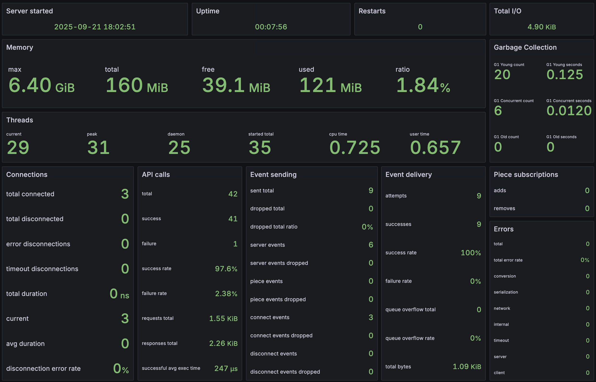

# ADR-0025: Server Statistics Architecture



## Table of Contents

- [Status](#status)
- [Context](#context)
  - [Critical Need for Comprehensive Introspection](#critical-need-for-comprehensive-introspection)
  - [Operational Requirements](#operational-requirements)
- [Decision](#decision)
- [Architecture](#architecture)
- [Complete Statistics Field Specification](#complete-statistics-field-specification)
  - [Server-Wide Statistics Structure](#server-wide-statistics-structure)
  - [Per-Client Statistics Structure](#per-client-statistics-structure)
  - [Raw vs. Derived Statistics Architecture](#raw-vs-derived-statistics-architecture)
  - [Statistics Collection Points](#statistics-collection-points)
  - [Statistics Collection Implementation](#statistics-collection-implementation)
    - [Helper Function Architecture](#helper-function-architecture)
    - [Performance Characteristics](#performance-characteristics)
    - [Zero-Cost Collection Principle](#zero-cost-collection-principle)
- [Health Monitoring Integration](#health-monitoring-integration)
  - [Dual Health System Architecture](#dual-health-system-architecture)
  - [HTTP Statistics Endpoints - Content Negotiation Architecture](#http-statistics-endpoints---content-negotiation-architecture)
    - [Content Negotiation Contract](#content-negotiation-contract)
    - [JSON Response Format (Default)](#json-response-format-default)
    - [Prometheus Text Format](#prometheus-text-format)
    - [Enterprise Operational Requirements](#enterprise-operational-requirements)
  - [External Monitoring Tool Integration](#external-monitoring-tool-integration)
    - [Standard Production Monitoring Stack](#standard-production-monitoring-stack)
    - [Enterprise Monitoring Solutions](#enterprise-monitoring-solutions)
    - [Cloud-Native Monitoring](#cloud-native-monitoring)
    - [Load Balancer Health Checking](#load-balancer-health-checking)
    - [Content Negotiation Examples](#content-negotiation-examples)
    - [Observability Platforms](#observability-platforms)
- [Consequences](#consequences)
  - [Positive Outcomes](#positive-outcomes)
  - [Trade-offs and Considerations](#trade-offs-and-considerations)
  - [Mitigation Strategies](#mitigation-strategies)
- [Related ADRs](#related-adrs)

## Status

Accepted 2025-08-24

## Context

Ooloi's gRPC architecture ([ADR-0002](0002-gRPC.md), [ADR-0024](0024-gRPC-Concurrency-and-Flow-Control-Architecture.md)) represents a **novel server architecture** combining:

1. **Client-to-server API requests**: STM-wrapped method calls for piece manipulation, queries, and mutations
2. **Server-to-client event streaming**: Queue-based real-time notifications for collaborative editing and system events

This is a **new, experimental server design** with unique characteristics:
- STM-gRPC transaction integration
- Per-client event queues with drop-oldest overflow handling  
- Real-time collaborative editing coordination
- Complex client lifecycle management with subscription tracking

### Critical Need for Comprehensive Introspection

The architecture's unique characteristics require operational insight:
- How do queue-based event streams behave under load?
- What are the performance characteristics of STM-gRPC integration?
- How do concurrent collaborative sessions scale?
- Which client usage patterns cause performance issues?

Statistics enable detailed test validation:
```clojure  
;; Basic statistics access helpers (implemented in ooloi.backend.grpc.stats)
(get-server-stat server-component :server-events-sent) => 2
(get-client-stat server-component client-id :server-events-received) => 2  
(get-client-stat server-component client-id :queue-overflow-count) => 0

;; Statistics mutation helpers with fail-fast validation
(inc-server-stat! server-component :api-calls-total)     ; default increment by 1
(inc-server-stat! server-component :api-calls-total 5)   ; increment by 5
(inc-client-stat! server-component client-id :events-sent)      ; default increment by 1  
(inc-client-stat! server-component client-id :events-sent 3)    ; increment by 3
```

With detailed statistics collection, operational issues, performance bottlenecks, and capacity planning are easy to detect and do.

### Operational Requirements

Production operations require metrics for:
- **Performance monitoring**: API response times, event delivery latency
- **Capacity planning**: Peak client connections, memory usage patterns
- **Error analysis**: Failure rates, error categorization, debugging context
- **Resource utilization**: Queue sizes, thread pool usage, network throughput
- **Health monitoring**: System status, client health, service availability

## Decision

Implement comprehensive two-level statistics collection:

1. **Server-wide statistics**: Aggregate metrics that survive client connection churn
2. **Per-client statistics**: Operational metrics specific to individual client connections

Statistics are collected in real-time during operation with minimal performance impact, accessible via both programmatic APIs and health monitoring endpoints.

## Architecture

## Complete Statistics Field Specification

### Server-Wide Statistics Structure

Add new `server-statistics` component field containing a map of thread-safe LongAdder counters:

```clojure
{ ;; ==========================================
 ;; CONNECTION LIFECYCLE COUNTERS
 ;; ==========================================
 :clients-connected-total (LongAdder.)         ; Total connections since server start
 :clients-disconnected-total (LongAdder.)      ; Total disconnections
 :clients-disconnected-error (LongAdder.)      ; Error-based disconnections
 :clients-disconnected-timeout (LongAdder.)    ; Timeout-based disconnections
 :connection-duration-nanos-total (LongAdder.)   ; Aggregate connection time in nanoseconds

 ;; ==========================================
 ;; API CALL COUNTERS
 ;; ==========================================
 :api-calls-total (LongAdder.)                 ; Total API calls processed
 :api-calls-success (LongAdder.)               ; Successful API calls
 :api-calls-failure (LongAdder.)               ; Failed API calls
 :api-calls-success-duration-nanos-total (LongAdder.) ; Total nanoseconds spent in successful API calls

 ;; ==========================================
 ;; EVENT STREAMING COUNTERS
 ;; ==========================================
 :server-events-sent (LongAdder.)              ; Total server events broadcast
 :piece-events-sent (LongAdder.)               ; Total piece events sent  
 :connect-events-sent (LongAdder.)             ; Client connect notifications
 :disconnect-events-sent (LongAdder.)          ; Client disconnect notifications
 :events-sent-total (LongAdder.)               ; All event types combined
 :events-dropped-total (LongAdder.)            ; Total events dropped (all clients)
 :server-events-dropped-total (LongAdder.)     ; Server events dropped
 :piece-events-dropped-total (LongAdder.)      ; Piece events dropped
 :connect-events-dropped-total (LongAdder.)    ; Connect events dropped
 :disconnect-events-dropped-total (LongAdder.) ; Disconnect events dropped
 :event-queues-overflow-total (LongAdder.)     ; Total queue overflow incidents
 :event-delivery-attempts (LongAdder.)         ; Total event delivery attempts
 :event-delivery-successes (LongAdder.)        ; Successful event deliveries

 ;; ==========================================
 ;; NETWORK TRAFFIC COUNTERS
 ;; ==========================================  
 :bytes-api-requests-total (LongAdder.)        ; Bytes from API calls
 :bytes-api-responses-total (LongAdder.)       ; Bytes in API responses  
 :bytes-events-total (LongAdder.)              ; Bytes in event messages

 ;; ==========================================
 ;; ERROR TRACKING COUNTERS
 ;; ==========================================
 :conversion-errors-total (LongAdder.)         ; Protobuf conversion failures
 :serialization-errors-total (LongAdder.)     ; Data serialization failures
 :network-errors-total (LongAdder.)           ; Network-level errors
 :internal-errors-total (LongAdder.)          ; Unexpected server errors
 :timeout-errors-total (LongAdder.)           ; Request timeout failures
 :client-errors-total (LongAdder.)            ; Client-side error responses
 :server-errors-total (LongAdder.)            ; Server-side error responses

 ;; DUAL-TRACKING ARCHITECTURE: Most statistics have BOTH server total
 ;; counters AND individual client counters. Server totals (suffix -total)
 ;; aggregate across all clients, while client counters track per-connection
 ;; metrics. This applies to API calls, byte counts, event delivery, and
 ;; all technical error types. Server totals persist across client connections;
 ;; client counters reset when clients disconnect.
 ;;
 ;; ERROR CATEGORY DEFINITIONS:
 ;; :conversion - Logical data transformation failures (type mismatches, unsupported types, schema violations)
 ;; :serialization - Physical encoding/decoding failures (malformed binary, wire format corruption)
 ;; :network - Network transport failures (connection drops, timeouts, protocol errors)
 ;; :internal - Unexpected server failures (bugs, resource exhaustion, system errors)
 ;; :timeout - Request timeout failures (deadline exceeded, processing too slow)

 ;; ==========================================
 ;; COLLABORATIVE EDITING COUNTERS
 ;; ==========================================
 :subscription-adds-total (LongAdder.)        ; Total piece subscriptions across all clients
 :subscription-removes-total (LongAdder.)     ; Total piece unsubscriptions across all clients

 ;; ==========================================  
 ;; SYSTEM COUNTERS
 ;; ==========================================
 :server-restart-count (LongAdder.)           ; Number of restarts
 }
```

### Per-Client Statistics Structure

Extend existing connection registry with separate top-level `:client-statistics` key for operational visibility:

```clojure
{:client-id "client-uuid"
 :observer stream-observer-ref
 :event-queue bounded-queue-ref  
 :piece-subscriptions #{set-of-piece-ids}
 :metadata {
           ;; ==========================================
           ;; CONNECTION METADATA FIELDS (Preserved)
           ;; ==========================================
           :connected-at timestamp                   ; Connection establishment time
           :client-ip "127.0.0.1"                  ; Client IP address  
           :client-port 54321                        ; Client port number
           :connection-id "conn-uuid"               ; Transport connection identifier
           }
 :client-statistics {
   ;; ==========================================
   ;; API CALL COUNTERS
   ;; ==========================================
   :api-calls-total (LongAdder.)             ; Total API calls made
   :api-calls-success (LongAdder.)           ; Successful API calls
   :api-calls-failure (LongAdder.)           ; Failed API calls

   ;; ==========================================
   ;; EVENT STREAMING COUNTERS
   ;; ==========================================
   :events-sent (LongAdder.)                 ; Total events delivered to client
   :events-dropped (LongAdder.)              ; Events lost due to queue overflow
   :server-events-received (LongAdder.)      ; Server-wide events received
   :piece-events-received (LongAdder.)       ; Piece-specific events received
   :connect-events-received (LongAdder.)     ; Client connect notifications  
   :disconnect-events-received (LongAdder.)  ; Client disconnect notifications

   ;; ==========================================
   ;; QUEUE HEALTH COUNTERS
   ;; ==========================================
   :queue-overflow-count (LongAdder.)        ; Number of overflow incidents  
   :queue-overflow-total-events-dropped (LongAdder.) ; Events lost across all overflows
   :queue-offer-attempts (LongAdder.)        ; Total queue insertions attempted
   :queue-offer-successes (LongAdder.)       ; Successful queue insertions

   ;; ==========================================
   ;; NETWORK TRAFFIC COUNTERS
   ;; ==========================================
   :bytes-events (LongAdder.)                ; Bytes consumed by event messages
   :bytes-api-requests (LongAdder.)          ; Bytes from API calls
   :bytes-api-responses (LongAdder.)         ; Bytes in API responses

   ;; ==========================================
   ;; ERROR TRACKING COUNTERS
   ;; ==========================================
   :network-errors (LongAdder.)              ; Network-level failures
   :serialization-errors (LongAdder.)        ; Protobuf conversion failures
   :conversion-errors (LongAdder.)           ; Clojure<->Protobuf failures
   :timeout-errors (LongAdder.)              ; Request timeout failures
   :internal-errors (LongAdder.)             ; Unexpected server errors affecting this client

   ;; ==========================================
   ;; SUBSCRIPTION COUNTERS
   ;; ==========================================
   :subscription-add-count (LongAdder.)      ; Total pieces subscribed to
   :subscription-remove-count (LongAdder.)   ; Total pieces unsubscribed from  
}}
```

### Raw vs. Derived Statistics Architecture

#### Design Principle: Store Raw Data, Compute Analytics On-Demand

**The server component holds only raw LongAdder counters** (zero/minimal collection cost):
```clojure
;; Raw LongAdder counters - minimal overhead to collect
:api-calls-total (LongAdder.)           ; Current sum: (.sum this) => 15
:api-calls-success (LongAdder.)         ; Current sum: (.sum this) => 14
:events-dropped (LongAdder.)            ; Current sum: (.sum this) => 2
:bytes-sent (LongAdder.)                ; Current sum: (.sum this) => 4096
:connection-duration-nanos-total (LongAdder.) ; Internal: nanoseconds for precision
```

**Timing Precision Strategy**: Duration counters store nanoseconds internally (LongAdder) but expose seconds externally:
```clojure
;; Internal storage (nanoseconds)
(inc-server-stat! server-component :connection-duration-nanos-total duration-nanos)

;; External rendering (seconds)
(let [nanos (get-server-stat server-component :connection-duration-nanos-total)
      seconds-total (/ (double nanos) 1.0e9)]
  ;; JSON: "connection_duration_seconds_total": seconds-total
  ;; Prometheus: ooloi_connection_duration_seconds_total seconds-total
  )
```

**Health endpoints compute derived metrics** when requested:
```clojure
;; GET /health/clients/{id} - calculated on-demand from LongAdder sums
(defn compute-client-analytics [client-stats]
  (let [succ (.sum (:api-calls-success client-stats))
        tot  (.sum (:api-calls-total client-stats))
        sent (.sum (:events-sent client-stats))
        drop (.sum (:events-dropped client-stats))]
    {:api-success-rate (when (pos? tot) (/ succ tot))
     :event-delivery-reliability (when (pos? sent) (- 1.0 (/ drop sent)))
     :client-health-score (composite-health-calculation client-stats)}))
```

#### Benefits of This Architecture:

**Runtime Performance**:
- **Zero calculation overhead** during normal operation
- **No expensive aggregations** in hot paths  
- **Raw data collection** has minimal performance impact

**Data Freshness**:  
- **Always current**: Derived metrics computed from latest raw data
- **No stale calculations**: No cached derived values to become outdated
- **Lock-free reads**: Derived metrics are computed by summing counters; slight skew is acceptable for ops

**Flexibility**:
- **Add new analytics** without changing storage schema
- **Experiment with calculations** without affecting production data collection  
- **Different views** can compute different derived metrics from same raw data

**Memory Efficiency**:
- **No redundant storage** of calculated values
- **Compact raw data**
- **On-demand computation** uses temporary memory only during health requests

### Statistics Collection Points

**Implementation Pattern**: All statistics collection uses helper functions at integration points. Statistics helper functions extract raw operational data and increment the appropriate LongAdder counters using direct `.add()` calls internally.

**🔑 Key Architectural Benefit**: These integration point functions remain **completely stable** when adding or removing statistics. All statistics complexity is abstracted into helper functions, so integration points never need to change when the statistics requirements evolve.

#### API Request Processing
```clojure
;; Clean integration point - statistics complexity abstracted into helper function

(defn execute-unified-method [method-name protobuf-request client-id]
  (let [start-time (System/currentTimeMillis)]
    (try
      ;; Normal business logic
      (let [result (execute-api-method method-name protobuf-request)
            end-time (System/currentTimeMillis)]
            
        ;; Clean abstraction - helper functions handle LongAdder increments
        (increment-api-stats server-component client-id 
                           {:start-time start-time
                            :end-time end-time
                            :result result
                            :request protobuf-request
                            :method-name method-name
                            :success? true})
        result)
        
      ;; Error path - same clean pattern
      (catch Exception e
        (let [end-time (System/currentTimeMillis)]
              
          ;; API failure and error statistics
          (increment-api-stats server-component client-id 
                             {:start-time start-time :end-time end-time
                              :request protobuf-request :method-name method-name
                              :success? false :exception e})
                          
          (increment-error-stats server-component client-id 
                               {:error-type (categorize-exception e)
                                :exception e})
          (throw e))))))
```

#### Event Delivery Processing
```clojure  
;; Clean integration point - statistics complexity abstracted into helper function

(defn create-and-queue-event [client-id event-message]
  (let [;; Normal event delivery logic
        event-bytes (.size (serialize-event event-message))
        queue (get-client-queue client-id)
        offer-success (.offer queue event-message)]
        
    ;; Clean abstraction - helper functions handle LongAdder increments
    (increment-event-stats server-component client-id
                         {:event-type (:type event-message)
                          :event-bytes event-bytes
                          :offer-success offer-success})
    offer-success))
```

#### Connection Lifecycle
```clojure
;; Clean integration point - statistics complexity abstracted into helper function

;; On client connection
(defn handle-client-connect [stream-observer]
  (let [connect-time-ns (System/nanoTime)
        client-id (UUID/randomUUID)]
          
    ;; Register client in system with connection timestamp
    (register-client client-id stream-observer
      {:metadata {:connected-ns connect-time-ns
                  :connected-at (/ (System/currentTimeMillis) 1000.0)}})
    
    ;; Clean abstraction - helper functions handle LongAdder increments
    (increment-connection-stats server-component client-id
                              {:event-type :connect})
    client-id))

;; On client disconnection  
(defn handle-client-disconnect [client-id disconnect-reason]
  (let [disconnect-time-ns (System/nanoTime)
        client-entry (get @connection-registry client-id)
        connect-time-ns (get-in client-entry [:metadata :connected-ns])]
          
    ;; Remove client from system
    (unregister-client client-id)
    
    ;; Clean abstraction - helper functions handle LongAdder increments
    (increment-connection-stats server-component client-id
                              {:event-type :disconnect
                               :connect-time connect-time-ns
                               :disconnect-time disconnect-time-ns
                               :disconnect-reason disconnect-reason}))
```

### Statistics Collection Implementation

#### Helper Function Architecture

Statistics collection uses helper functions at integration points for maximum performance, with direct LongAdder increments handled internally:

**Architectural Layers**:
- **Integration Points**: Use high-level helper functions (`increment-api-stats`, `increment-event-stats`)
- **Helper Functions**: Use basic statistics API (`inc-server-stat!`, `inc-client-stat!`)
- **Basic API**: Uses direct LongAdder `.add()` calls for maximum performance

**Note**: The increment functions below will be implemented in `backend/src/main/clojure/ooloi/backend/grpc/stats.clj` to separate statistics concerns from gRPC business logic.

```clojure
;; Integration helper functions using basic statistics API
(defn increment-api-stats 
  "Increment API call statistics for both server and client.
   
   Args:
     sc: Server component with statistics
     client-id: String identifying the client
     options: Map with :success? (boolean), :bytes-sent (long), :bytes-received (long)"
  [sc client-id {:keys [success? bytes-sent bytes-received]}]
  ;; Server statistics - shared counters
  (inc-server-stat! sc :api-calls-total)
  (if success?
    (inc-server-stat! sc :api-calls-success)
    (inc-server-stat! sc :api-calls-failure))
  (when bytes-sent
    (inc-server-stat! sc :bytes-api-responses-total bytes-sent))
  (when bytes-received  
    (inc-server-stat! sc :bytes-api-requests-total bytes-received))
  
  ;; Client statistics - individual counters  
  (inc-client-stat! sc client-id :api-calls-total)
  (if success?
    (inc-client-stat! sc client-id :api-calls-success)
    (inc-client-stat! sc client-id :api-calls-failure))
  (when bytes-sent (inc-client-stat! sc client-id :bytes-api-responses bytes-sent))
  (when bytes-received (inc-client-stat! sc client-id :bytes-api-requests bytes-received)))

(defn increment-event-stats
  "Increment event delivery statistics for both server and client.
   
   Args:
     sc: Server component with statistics  
     client-id: String identifying the client
     options: Map with :event-type (:server/:piece/:server-client-connected/:server-client-disconnected/:client-registration-confirmed),
              :offer-success (boolean), :event-bytes (long)"
  [sc client-id {:keys [event-type offer-success event-bytes]}]
  ;; Server statistics - shared counters
  (inc-server-stat! sc :event-delivery-attempts)
  (if offer-success
    (do (inc-server-stat! sc :events-sent-total)
        (inc-server-stat! sc :event-delivery-successes)
        (inc-server-stat! sc :bytes-events-total event-bytes)
        ;; Event type specific sent counters
        (case event-type
          :server (inc-server-stat! sc :server-events-sent)
          :piece (inc-server-stat! sc :piece-events-sent)
          :server-client-connected (inc-server-stat! sc :connect-events-sent)
          :server-client-disconnected (inc-server-stat! sc :disconnect-events-sent)
          :client-registration-confirmed (inc-server-stat! sc :connect-events-sent)
          nil))
    (do (inc-server-stat! sc :events-dropped-total)
        (inc-server-stat! sc :event-queues-overflow-total)
        ;; Event type specific dropped counters
        (case event-type
          :server (inc-server-stat! sc :server-events-dropped-total)
          :piece (inc-server-stat! sc :piece-events-dropped-total)
          :server-client-connected (inc-server-stat! sc :connect-events-dropped-total)
          :server-client-disconnected (inc-server-stat! sc :disconnect-events-dropped-total)
          :client-registration-confirmed (inc-server-stat! sc :connect-events-dropped-total)
          nil)))
  
  ;; Client statistics - individual counters
  ;; Queue offer tracking
  (inc-client-stat! sc client-id :queue-offer-attempts)
  (if offer-success
    (do (inc-client-stat! sc client-id :events-sent)
        (inc-client-stat! sc client-id :queue-offer-successes)
        (inc-client-stat! sc client-id :bytes-events event-bytes))
    (do (inc-client-stat! sc client-id :events-dropped)
        (inc-client-stat! sc client-id :queue-overflow-count)
        (inc-client-stat! sc client-id :queue-overflow-total-events-dropped)))
  
  ;; Event type specific client counters - only on successful delivery
  (when offer-success
    (case event-type
      :server (inc-client-stat! sc client-id :server-events-received)
      :piece (inc-client-stat! sc client-id :piece-events-received)
      :client-connected (inc-client-stat! sc client-id :connect-events-received)
      :client-disconnected (inc-client-stat! sc client-id :disconnect-events-received)
      nil)))

(defn increment-connection-stats
  "Increment connection lifecycle statistics for server.
   
   Args:
     sc: Server component with statistics
     client-id: String identifying the client  
     options: Map with :event-type (:connect/:disconnect), :disconnect-reason (:graceful/:error/:timeout),
              :connect-time (nanoseconds), :disconnect-time (nanoseconds)"
  [sc client-id {:keys [event-type disconnect-reason connect-time disconnect-time]}]
  (case event-type
    :connect (inc-server-stat! sc :clients-connected-total)
    :disconnect (do
                  (inc-server-stat! sc :clients-disconnected-total)
                  (when (and connect-time disconnect-time)
                    (let [duration-nanos (max 0 (- disconnect-time connect-time))]
                      (inc-server-stat! sc :connection-duration-nanos-total duration-nanos)))
                  (case disconnect-reason
                    :error (inc-server-stat! sc :clients-disconnected-error)
                    :timeout (inc-server-stat! sc :clients-disconnected-timeout)
                    nil))
    nil))

(defn increment-error-stats
  "Increment error statistics for both server and client.
   
   Args:
     sc: Server component with statistics
     client-id: String identifying the client
     options: Map with :error-type (:conversion/:serialization/:network/:internal/:timeout/:client/:server)"
  [sc client-id {:keys [error-type]}]
  ;; Server error counters
  (case error-type
    :conversion (inc-server-stat! sc :conversion-errors-total)
    :serialization (inc-server-stat! sc :serialization-errors-total)
    :network (inc-server-stat! sc :network-errors-total)
    :internal (inc-server-stat! sc :internal-errors-total)
    :timeout (inc-server-stat! sc :timeout-errors-total)
    :client (inc-server-stat! sc :client-errors-total)
    :server (inc-server-stat! sc :server-errors-total)
    nil)
  
  ;; Client error counters
  (case error-type
    :network (inc-client-stat! sc client-id :network-errors)
    :serialization (inc-client-stat! sc client-id :serialization-errors)
    :conversion (inc-client-stat! sc client-id :conversion-errors)
    :timeout (inc-client-stat! sc client-id :timeout-errors)
    nil))
```

### Performance Characteristics

**Near-linear scalability under load**: LongAdder uses per-CPU buckets for minimal contention
- 1 thread × 100 ops/sec: ~0.001ms overhead per operation
- 1000 threads × 1000 ops/sec: Still ~0.001ms overhead per operation  
- Near-linear scaling with minimal degradation at high contention

**Memory Efficiency**: ~40 bytes overhead per LongAdder
- A few KB for server-wide statistics
- ~1 KB per connected client (implementation-dependent)
- Total memory footprint negligible even at scale

**Architecture Benefits**:
- **Server statistics**: LongAdders eliminate all contention between operations
- **Client statistics**: Individual LongAdders within connection registry, zero inter-client contention
- **No queues needed**: Helper functions use direct `.add()` calls internally, scaling near-linearly without blocking

#### Zero-Cost Collection Principle

**Capture Available Data**: If data is already computed during normal operation, collect it at zero additional cost using simple counter increments.

**Simple Counter Collection Examples**:
```clojure
;; Zero-cost principle: Increment counters based on data already computed
(let [result (execute-api-method ...)]
  ;; Simple success/failure tracking - data already known
  (increment-api-stats server-component client-id 
                     {:success? (boolean result)
                      :bytes-sent (.size response)      ; Already serialized
                      :bytes-received (.size request)}) ; Already deserialized
  result)

;; Event delivery - track outcomes already determined
(let [offer-success (.offer queue event)]
  ;; Simple success/drop tracking - outcome already known
  (increment-event-stats server-component client-id
                       {:event-type (:type event)      ; Already extracted
                        :offer-success offer-success   ; Already determined
                        :event-bytes (.size event)})   ; Already serialized
  offer-success)
```

**Collection Overhead**: 
- **LongAdder increment**: ~0.001ms per `.add()` call
- **No complex calculations**: Only simple counter increments
- **No aggregations**: All analytics computed on-demand by health endpoints

**Design Principle**: Collect only simple counters that require zero additional computation beyond what's already available in the operation flow.


## Health Monitoring Integration

### Dual Health System Architecture

Ooloi implements two complementary health monitoring systems:

#### 1. gRPC Health Service (Standard Protocol)
- **Protocol**: Standard gRPC health checking (`grpc.health.v1.Health`)
- **Port**: Same as gRPC server (10700 by default)
- **Usage**: gRPC clients call `Check()` method
- **Response**: `HealthCheckResponse.ServingStatus.SERVING/NOT_SERVING`
- **Purpose**: Internal service-to-service health checking

#### 2. HTTP Health Endpoints (External Monitoring)
- **Protocol**: Lightweight HTTP server on dedicated port
- **Port**: Separate from gRPC (10701 by default - `:health-port`)
- **Usage**: Standard HTTP GET requests
- **Response**: JSON formatted metrics and status
- **Purpose**: External monitoring tool integration

#### System Relationship
The HTTP endpoint **builds on** the gRPC health service:
```clojure
;; HTTP endpoint queries same HealthStatusManager as gRPC service
(let [health-service (.getHealthService health-manager)]
  (if health-service "SERVING" "NOT_SERVING"))
```

This ensures **consistent health status** across both protocols while providing different access patterns for different use cases.

### Foundational Computed Statistics Implementation

**Status**: ✅ **Implemented** - Basic computed statistics with proper time unit conversions

The foundational layer provides essential computed statistics that support comprehensive server monitoring. This provides the architectural foundation for startup time tracking, time unit standardization, and content negotiation patterns.

#### Current Basic Health Endpoint (`/health`)

**Implementation**: `backend/src/main/clojure/ooloi/backend/components/http_server.clj`

**Content Negotiation**: Full ADR-0025 architecture implemented
- **Default JSON format**: `GET /health` returns JSON with underscored field names
- **Prometheus text format**: `Accept: text/plain` or `User-Agent: Prometheus/*` triggers Prometheus exposition format
- **Query parameter override**: `?format=prom` forces Prometheus text, `?format=json` forces JSON

#### Response Structure

**JSON Format** (`curl localhost:10701/health`):
- **Root level**: `status`, `timestamp_unix_seconds`
- **Security section**: `security.tls` - TLS configuration and certificate details (see TLS Security Section below)
- **Server section**: `uptime_seconds`, `started_at_unix_seconds`, `clients_connected_current`
- **Computed statistics**: Memory usage, garbage collection, thread metrics
- **Field naming**: Underscored format following JSON conventions

**Prometheus Format** (`curl -H "Accept: text/plain" localhost:10701/health`):
- **Server metrics**: `ooloi_server_*` (serving status, uptime, start_time, clients_connected, timestamp)
- **JVM metrics**: `ooloi_jvm_*` (memory usage, garbage collection, thread statistics)
- **Metric types**: Gauges for current state, counters for cumulative values
- **Labels**: GC collector names, thread types (where applicable)
- **Naming**: Underscored format following Prometheus conventions

#### Time Unit Conversion Architecture

**Design Principle**: Nanoseconds internal precision, seconds external exposure

1. **Server Startup Tracking**:
   - **Internal**: `(System/nanoTime)` stored as `:started-at-ns` in gRPC server component
   - **External**: `uptime_seconds = (current-nanos - started-at-ns) / 1.0e9`

2. **UNIX Timestamps**:
   - **Internal**: `(System/currentTimeMillis)` stored as `:started-at-ms` in gRPC server component
   - **External**: `started_at_unix_seconds = started-at-ms / 1000.0`

3. **Current Timestamps**:
   - **Internal**: `(System/currentTimeMillis)` - milliseconds from JVM API
   - **External**: `timestamp_unix_seconds = timestamp-ms / 1000.0`

4. **Garbage Collection Time**:
   - **Internal**: `.getCollectionTime()` returns milliseconds from JVM
   - **External**: `collection_time_seconds = collection-time-ms / 1000.0`

#### Computed Statistics Architecture

**Design Principle**: Derive operational insights from existing LongAdder counters without additional overhead

**Current Client Connections**:
- **Source**: LongAdder counters `:clients-connected-total` and `:clients-disconnected-total`
- **Computation**: `current-clients = max(0, connected-total - disconnected-total)`
- **JSON Field**: `clients_connected_current`
- **Prometheus Metric**: `ooloi_server_clients_connected`
- **Type**: Gauge (current state, can go up or down)

**Average API Call Duration**:
- **Source**: LongAdder counters `:api-calls-success-duration-nanos-total` and `:api-calls-success`
- **Computation**: `avg-duration = success > 0 ? total-duration-nanos / success : 0.0`
- **JSON Field**: `api_success_duration_avg_nanos`
- **Prometheus Metric**: `ooloi_server_api_success_duration_avg_nanos`
- **Type**: Gauge (computed average performance metric)

**Benefits**:
- **Zero additional cost**: Uses existing counters, no new tracking required
- **Real-time accuracy**: Computed fresh on each request
- **Monitoring friendly**: Direct gauge metric for alerting and dashboards
- **Consistent calculation**: Same computation logic for both JSON and Prometheus formats

#### Field Naming Convention

**HTTP Boundary Transformation**: Internal hyphenated names → External underscored names
- **Purpose**: Universal compatibility with monitoring tools and JSON consumers
- **Implementation**: Direct field naming at serialization boundary
- **Examples**:
  - Internal: `:started-at-ns`, `:uptime-seconds` (planned)
  - External: `"timestamp_unix_seconds"`, `"uptime_seconds"`, `"collection_time_seconds"`

#### Integration with gRPC Server Component

**Dependency Architecture**: HTTP server depends on gRPC server component for startup timing
```clojure
;; gRPC server component initialization
(let [started-at-ns (System/nanoTime)]
  {:started-at-ns started-at-ns
   ;; ... other component data
   })

;; HTTP server accesses startup time for uptime calculation
(let [started-at-ns (:started-at-ns grpc-server)
      current-ns (System/nanoTime)
      uptime-seconds (/ (- current-ns started-at-ns) 1.0e9)]
  ;; Use in both JSON and Prometheus responses
  )
```

#### TLS Security Section

**Status**: ✅ **Implemented** - TLS configuration visibility and certificate monitoring

Health endpoints include a `security` section exposing TLS configuration and certificate details for enterprise operations monitoring.

**Structure:**
```json
{
  "security": {
    "tls": {
      "enabled": boolean,
      "warning": string (optional),
      "certificate": {
        "path": string,
        "subject": string,
        "issuer": string,
        "serial": string,
        "valid_from": string (ISO 8601),
        "valid_until": string (ISO 8601),
        "days_until_expiry": integer
      }
    }
  }
}
```

**Fields:**
- `enabled`: Boolean indicating TLS configuration status
- `warning`: Optional string when certificate expires within 30 days (format: "Certificate expires in N days")
- `certificate`: X.509 certificate details (only present when TLS enabled and certificate parseable)
  - `path`: Absolute path to certificate file
  - `subject`: Certificate subject Distinguished Name
  - `issuer`: Certificate issuer Distinguished Name
  - `serial`: Certificate serial number (hexadecimal)
  - `valid_from`: Start of validity period (ISO 8601 format)
  - `valid_until`: End of validity period (ISO 8601 format)
  - `days_until_expiry`: Days remaining until expiration

**Example Responses:**

TLS Disabled:
```json
{
  "status": "SERVING",
  "security": {
    "tls": {
      "enabled": false
    }
  }
}
```

TLS Enabled (Normal):
```json
{
  "status": "SERVING",
  "security": {
    "tls": {
      "enabled": true,
      "certificate": {
        "path": "/Users/user/.ooloi/certs/server.crt",
        "subject": "C=US,ST=Auto,L=Auto,O=Ooloi,OU=AutoGenerated,CN=localhost",
        "issuer": "C=US,ST=Auto,L=Auto,O=Ooloi,OU=AutoGenerated,CN=localhost",
        "serial": "17A2B3C4D5E6F",
        "valid_from": "2025-10-01T12:00:00Z",
        "valid_until": "2045-10-01T12:00:00Z",
        "days_until_expiry": 7299
      }
    }
  }
}
```

TLS Enabled (Expiring Soon):
```json
{
  "status": "SERVING",
  "security": {
    "tls": {
      "enabled": true,
      "warning": "Certificate expires in 15 days",
      "certificate": {
        "path": "/etc/ssl/ooloi.crt",
        "days_until_expiry": 15,
        "valid_until": "2025-10-16T12:00:00Z",
        ...
      }
    }
  }
}
```

**Implementation:**
- **Certificate Parsing**: `parse-certificate-info` in `shared/src/main/clojure/ooloi/shared/grpc/tls.clj`
- **Health Integration**: `build-tls-security-info` in `backend/src/main/clojure/ooloi/backend/grpc/stats.clj`
- **Expiry Logic**: Warning automatically added when `days_until_expiry < 30`
- **Error Handling**: Parse failures return `{:tls {:enabled true}}` without certificate details

**Operational Use:**
- **Monitoring**: Prometheus alerts on certificate expiry
- **Compliance**: Verify TLS enabled and certificates from approved CAs
- **Automation**: Trigger certificate rotation based on expiry threshold
- **Debugging**: Verify correct certificates loaded at startup

**See Also:** [ADR-0020: TLS Infrastructure](0020-TLS-Infrastructure-and-Deployment-Architecture.md) for complete TLS implementation details, deployment scenarios, and certificate management.

#### Foundation for Comprehensive Statistics Extension

This foundational layer establishes:
- ✅ **Content negotiation architecture** - JSON/Prometheus format detection
- ✅ **Time unit conversion patterns** - Internal precision, external seconds
- ✅ **Field naming conventions** - Underscored HTTP boundary naming
- ✅ **Component integration** - gRPC server ↔ HTTP server dependency injection
- ✅ **Startup time tracking** - Real uptime vs epoch timestamp calculation
- ✅ **TLS security visibility** - Certificate monitoring and expiry warnings

**Comprehensive Statistics Architecture**: The production monitoring system provides 57 LongAdder-based statistics fields built upon this foundational computed statistics architecture.

### HTTP Statistics Endpoints - Content Negotiation Architecture

**Enterprise-grade content negotiation** serving multiple formats from single URLs:

```http
GET /health                    # Standard health check + operational context (uptime, memory, GC)
GET /health/server             # Comprehensive server statistics + thread info + client IDs
GET /health/clients            # All client statistics with queue information
GET /health/clients/{id}       # Individual client detailed metrics
```

**Endpoint Purpose & Design:**

- **`/health`**: Industry-standard health endpoint providing immediate operational context
  - **Primary**: Health status for load balancers, Kubernetes probes, service discovery
  - **Secondary**: Essential operational metrics (uptime, memory, GC) for development and basic monitoring
  - **Performance**: Lightweight, < 1ms response time
  - **Content**: Status + computed statistics only (no LongAdder-based metrics)

- **`/health/server`**: Complete server operational dashboard
  - **Primary**: Production monitoring with full 57-field LongAdder statistics
  - **Content**: All server metrics + thread information + client ID references
  - **Use Case**: Prometheus scraping, operational dashboards, capacity planning

- **`/health/clients`**: Client operational overview
  - **Content**: All client data structures keyed by client-id (JSON format only)
  - **Prometheus Protection**: Returns HTTP 400 for Prometheus format requests to prevent TSDB cardinality explosion
  - **Use Case**: Client monitoring dashboards, performance analysis

- **`/health/clients/{id}`**: Individual client detailed metrics
  - **Content**: Complete client statistics (22 LongAdder fields + 4 computed metrics)
  - **Prometheus Protection**: Returns HTTP 400 for Prometheus format requests due to unbounded client_id cardinality
  - **Error Handling**: Returns structured 404 response for non-existent clients
  - **Use Case**: Per-client debugging, detailed performance analysis

#### Content Negotiation Contract

**Field Naming Convention**: All HTTP responses use underscored field names (`clients_connected_current`) for universal compatibility. Internal ADR-0025 statistics maintain hyphenated names (`:clients-connected-current`) with transformation only at serialization boundary.

**Format Selection Rules**:
1. **Accept Header Priority**:
   - `Accept: text/plain` or `Accept: application/openmetrics-text` → Prometheus text format
   - Default → JSON format
2. **Query Parameter Override**: `?format=prom` or `?format=json` overrides Accept header
3. **User-Agent Detection**: `User-Agent: Prometheus/*` → Prometheus text format

**OpenMetrics Evolution**: Ooloi may emit OpenMetrics headers when Prometheus defaults to OpenMetrics format, but the text exposition format remains stable for backward compatibility.

**Versioning and Compatibility**:
- **Schema Version Header**: `X-Ooloi-Metrics-Schema: 1` in all responses
- **Stable URLs**: Endpoints never change, only representations evolve
- **Backward Compatibility**: Add new metrics, never rename existing ones in Prometheus view

**Content Differentiation**: JSON may include **ratios and totals derived from counters** (e.g., success rates, `bytes_sent = bytes_api_responses + bytes_events`, `clients_connected_current = clients_connected_total - clients_disconnected_total`); Prometheus exposes **raw counters only** for time-series analysis. If a denominator is 0, JSON ratios are `null`.

**Process Lifetime**: All counters are process-lifetime unless exported to an external TSDB; values reset on process restart. Prometheus/TSDBs preserve time series across restarts; in-process counters reset.

#### JSON Response Format (Default)

**Content-Type**: `application/json; charset=utf-8`  
**Cache-Control**: `no-store`

#### Prometheus Text Format

**Content-Type**: `text/plain; version=0.0.4`  
**Cache-Control**: `no-store`

**Prometheus Metadata Completeness**: All metrics in Prometheus text format include `# HELP` and `# TYPE` lines following Prometheus best practices for metric discoverability and tool compatibility.

#### Enterprise Operational Requirements

**Cardinality Management**:
- **Bounded Labels Only**: No unbounded `client_id` labels in Prometheus format by default
- **HTTP 400 Protection**: Per-client endpoints (`/health/clients/{id}` and `/health/clients`) return HTTP 400 for Prometheus format requests to prevent TSDB cardinality explosion
- **JSON-Only Client Data**: Per-client details available exclusively in JSON format
- **Bounded Series Count**: Server-wide metrics only use bounded label sets (no per-client labels)
- **TTL Policy**: Client-specific metrics expire after disconnection
- **Error Response**: Prometheus requests to client endpoints receive descriptive 400 error explaining cardinality constraints and suggesting JSON alternatives

**Performance Constraints**:
- **Serialization Budget**: < 1ms typical response time for all formats
- **Memory Footprint**: Stateless serialization, no cached representations
- **Rate Limiting**: Per-IP token bucket with Prometheus scrape interval awareness

**Cross-Representation Consistency**: JSON and Prometheus views are always generated from the same point-in-time read of counter sums (non-atomic, lock-free), ensuring near-identical data across formats at request time.

**Security Integration**:
- **Authentication**: Support `Authorization: Bearer` for JSON endpoints
- **Prometheus Access**: Allow unauthenticated scrape via IP allowlist/ingress policy  
- **TLS**: HTTPS required in production; mTLS optional for scrape networks

### External Monitoring Tool Integration

The content negotiation architecture provides universal compatibility with monitoring ecosystems through standard HTTP interfaces.

#### Standard Production Monitoring Stack

**Prometheus + Grafana + AlertManager** - Zero configuration required:

```yaml
# prometheus.yml - works immediately with content negotiation
scrape_configs:
  - job_name: 'ooloi'
    static_configs:
      - targets: ['ooloi-server:10701']
    metrics_path: /health/server
    scrape_interval: 15s
    # Prometheus User-Agent automatically triggers text format response
```

**Grafana Development Integration**:
```bash
# JSON Datasource configuration (manual setup)
# URL: http://localhost:10701
# All /health/* endpoints return JSON by default - no Accept header needed
```

**Integration Benefits**:
- **Zero Custom Code**: Standard HTTP content negotiation, no exporters required
- **Single URL Strategy**: Same endpoints serve both JSON (dev) and Prometheus (prod)  
- **Automatic Format Detection**: Prometheus scraper gets text format, browsers get JSON
- **Enterprise Ready**: Follows HTTP standards for multi-representation resources

#### Enterprise Monitoring Solutions

**DataDog** - JSON ingestion via HTTP checks:
```yaml
# datadog.yaml - automatically gets JSON format
instances:
  - url: http://ooloi-server:10701/health/server
    tags:
      - service:ooloi
      - environment:production
```

**New Relic** - Direct JSON API integration:
```bash
# Custom integration script - JSON format by default
curl -H "Authorization: Bearer $NR_API_KEY" \
     "http://ooloi-server:10701/health/server" | \
     newrelic-cli events post --data @-
```

**Enterprise Benefits**:
- **Universal JSON Support**: All enterprise tools consume JSON by default
- **No Format Translation**: Direct API ingestion without middleware
- **Standard HTTP**: Works with existing enterprise HTTP monitoring infrastructure

#### Cloud-Native Monitoring

**Kubernetes + Prometheus Operator** - Native Prometheus text format:
```yaml
# ServiceMonitor - Prometheus Operator automatically configures scraping
apiVersion: monitoring.coreos.com/v1
kind: ServiceMonitor
metadata:
  name: ooloi-server
spec:
  selector:
    matchLabels:
      app: ooloi-server
  endpoints:
  - port: health-port
    path: /health/server
    interval: 15s
    # Prometheus scraper User-Agent triggers text format automatically
```

**Service Mesh Integration** - Works with any proxy:
```yaml
# Istio VirtualService example - standard HTTP health checks
apiVersion: networking.istio.io/v1beta1
kind: VirtualService
spec:
  http:
  - match:
    - uri:
        prefix: /health
    route:
    - destination:
        host: ooloi-server
        port:
          number: 10701
```

#### Load Balancer Health Checking

**NGINX/HAProxy** - Standard HTTP health endpoint:
```nginx
upstream ooloi_servers {
    server ooloi1:10701 max_fails=3 fail_timeout=30s;
    server ooloi2:10701 max_fails=3 fail_timeout=30s;
}

# Health check - gets JSON format by default
location /health {
    proxy_pass http://ooloi_servers/health;
    proxy_connect_timeout 1s;
    proxy_read_timeout 1s;
    # Load balancer doesn't need to parse JSON, just checks HTTP 200
}
```

**Cloud Load Balancers** - Universal HTTP support:
```bash
# AWS ALB health check configuration
# Target: /health (returns JSON with HTTP 200/503)
# All cloud providers support standard HTTP health checks

# GCP Load Balancer
# Health check path: /health/server
# Success criteria: HTTP 200 + JSON response

# Azure Application Gateway  
# Health probe: /health
# Content negotiation transparent to load balancer
```

#### Content Negotiation Examples

**Manual Testing and Discovery**:
```bash
# JSON format (default) - for development and API exploration
curl http://localhost:10701/health/server | jq .

# Prometheus text format - explicit Accept header
curl -H 'Accept: text/plain; version=0.0.4' http://localhost:10701/health/server

# Query parameter override - forces format regardless of headers
curl http://localhost:10701/health/server?format=prom

# Browser access - automatically gets JSON due to Accept: text/html
open http://localhost:10701/health/server
```

**Production Integration Patterns**:
```yaml
# Prometheus scrape config - zero configuration required
scrape_configs:
  - job_name: 'ooloi'
    static_configs: [{ targets: ['host:10701'] }]
    metrics_path: /health/server
    scrape_interval: 15s
    # User-Agent: Prometheus/* automatically triggers text format

# Grafana JSON datasource - points to same URLs
# URL: http://host:10701
# Paths: /health/server, /health/clients, /health/performance
# Format: Automatic JSON (default response)
```

**Format Verification**:
```bash
# Verify Prometheus format is valid
curl -H 'Accept: text/plain' http://localhost:10701/health/server | promtool check metrics

# Verify JSON schema version
curl -I http://localhost:10701/health/server | grep X-Ooloi-Metrics-Schema

# Test query parameter override priority
curl -H 'Accept: application/json' http://localhost:10701/health/server?format=prom
# Should return Prometheus text despite JSON Accept header
```

#### Observability Platforms

**Jaeger (Distributed Tracing)**:
- gRPC tracing via OpenTracing support
- Custom spans for API call and event delivery tracing
- Setup complexity: Medium - Requires tracing instrumentation

**ELK Stack (Elasticsearch + Logstash + Kibana)**:
- Structured logging with JSON metrics as log entries
- Query-based operational analysis
- Setup complexity: Low - Standard JSON log ingestion

#### Comparative Completeness Assessment

**Ooloi's Statistics vs. Server Metrics**:

#### Coverage Areas
- **Connection Lifecycle**: Detailed per-client connection tracking
- **Request/Response Metrics**: Success rates, timing percentiles, method-level analytics  
- **Resource Utilization**: Queue usage, memory consumption, thread pool metrics
- **Error Categorization**: gRPC status codes, error type classification
- **Network Performance**: Bytes transferred, serialization performance

#### Implementation Features
- **Per-Client Granularity**: Individual client behavior patterns and health
- **Queue-Based Architecture**: Event delivery pipeline visibility
- **Real-Time Streaming**: Live event delivery performance metrics
- **Collaborative Metrics**: Multi-client interaction patterns

#### Operational Support
- **Capacity Planning**: Peak usage patterns, growth trend analysis
- **Performance Baselines**: Historical comparison and regression detection  
- **Health Scoring**: Composite health metrics for automated decision making
- **Debugging Context**: Rich error context for rapid troubleshooting

## Consequences

### Positive Outcomes

**Operational Visibility**:
- Complete insight into system performance and client behavior
- Proactive identification of performance bottlenecks  
- Data-driven capacity planning and resource allocation
- Comprehensive error tracking and debugging context

**Production Reliability**:
- Early detection of system degradation
- Client health monitoring prevents service disruption
- Performance trending enables proactive scaling  
- Error categorization improves troubleshooting efficiency

**Development Benefits**:
- Performance regression testing with concrete metrics
- Client usage pattern analysis informs feature development  
- Load testing validation with detailed performance data
- Architecture optimization guided by real operational data

### Trade-offs and Considerations

**Memory Overhead**:
- Per-client statistics consume additional memory per connection
- Aggregate metrics require ongoing memory allocation  
- Statistics persistence across server restarts requires additional storage

**Performance Impact**:
- Statistics updates add minimal latency to request processing

**Implementation Complexity**:
- Two-level statistics tracking adds code complexity
- Health endpoint security and access control needs consideration

### Mitigation Strategies

**Operational Safety**:
- Statistics collection failure never impacts core functionality
- Health endpoint rate limiting and authentication

## Related ADRs

- [ADR-0002: gRPC](0002-gRPC.md) - Base communication architecture
- [ADR-0024: gRPC Concurrency and Flow Control](0024-gRPC-Concurrency-and-Flow-Control-Architecture.md) - Event streaming and queue management  
- [ADR-0022: Lazy Frontend-Backend Architecture](0022-Lazy-Frontend-Backend-Architecture.md) - Event-driven collaboration patterns
- [ADR-0004: STM for Concurrency](0004-STM-for-concurrency.md) - Concurrent transaction processing
