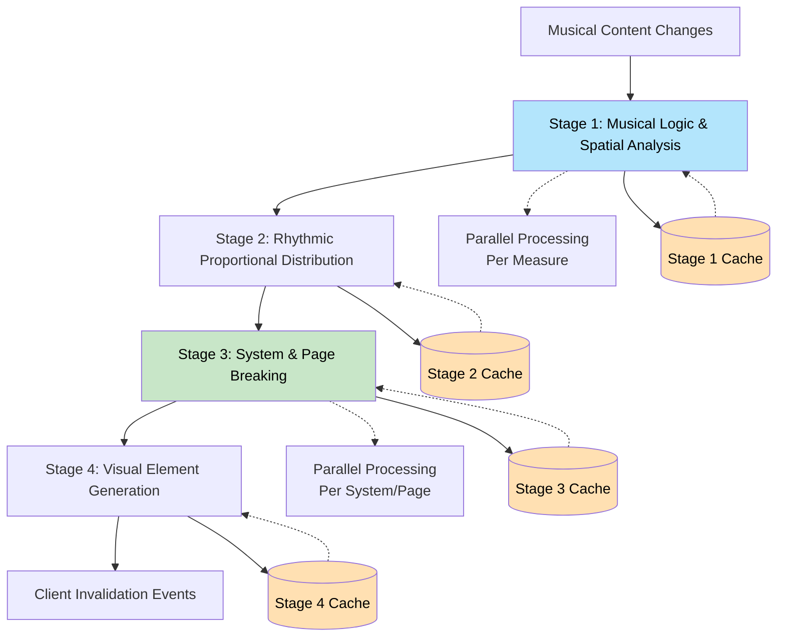
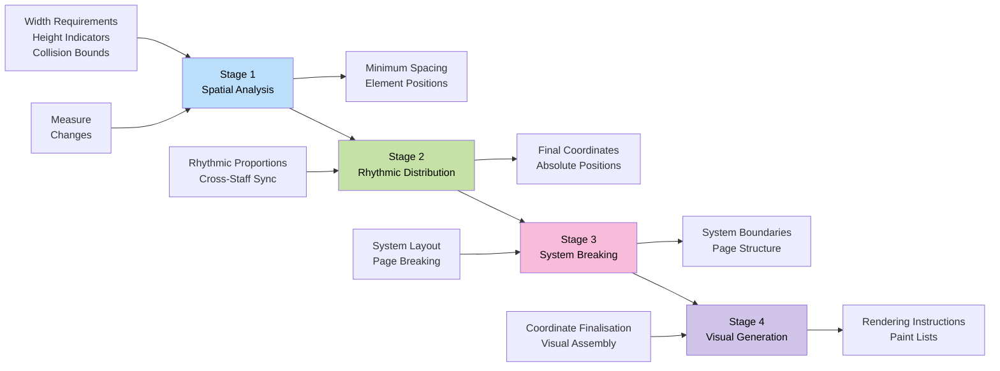
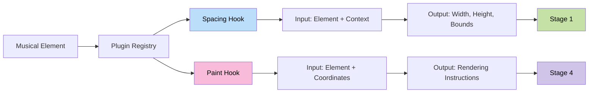
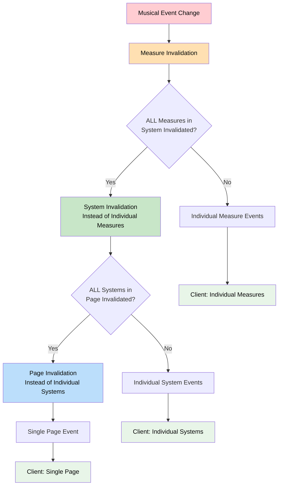

# ADR-0028: Hierarchical Rendering Pipeline with Plugin-Based Formatters

**Status**: Accepted  
**Date**: 2024-09-14

## Context

Musical notation software faces computational challenges when handling large orchestral scores containing hundreds of thousands of individual musical elements. The fundamental problem involves coordinating distinct concerns: musical logic resolution, spatial arrangement calculations, and visual rendering - each with different computational characteristics and parallelisation opportunities.

Additionally, notation software requires extensibility for contemporary notational techniques and experimental approaches. The challenge lies in providing a unified architecture that supports both traditional notation and innovative extensions without compromising performance or architectural consistency.

Ooloi requires an architecture that maintains responsive editing performance with large symphonic works whilst enabling comprehensive notational extensibility through a plugin system.

## Decision

Ooloi implements a **four-stage hierarchical rendering pipeline** with comprehensive plugin integration and intelligent client-server coordination:

```mermaid
flowchart TD
    A[Musical Content Changes] --> B[Stage 1: Musical Logic & Spatial Analysis]
    B --> C[Stage 2: Rhythmic Proportional Distribution]
    C --> D[Stage 3: System & Page Breaking]
    D --> E[Stage 4: Visual Element Generation]
    E --> F[Client Invalidation Events]
    
    B -.-> B1[Parallel Processing<br/>Per Measure]
    D -.-> D1[Parallel Processing<br/>Per System/Page]
    
    B --> Cache1[(Stage 1 Cache)]
    C --> Cache2[(Stage 2 Cache)]
    D --> Cache3[(Stage 3 Cache)]
    E --> Cache4[(Stage 4 Cache)]
    
    Cache1 -.-> B
    Cache2 -.-> C
    Cache3 -.-> D
    Cache4 -.-> E
    
    style B fill:#b3e5fc,color:#000
    style D fill:#c8e6c8,color:#000
    style Cache1 fill:#ffe0b2,color:#000
    style Cache2 fill:#ffe0b2,color:#000
    style Cache3 fill:#ffe0b2,color:#000
    style Cache4 fill:#ffe0b2,color:#000
```

### Pipeline Stage Overview

```mermaid
flowchart LR
    A[Measure<br/>Changes] --> B[Stage 1<br/>Spatial Analysis]
    B --> C[Stage 2<br/>Rhythmic Distribution]
    C --> D[Stage 3<br/>System Breaking]
    D --> E[Stage 4<br/>Visual Generation]
    
    B1[Width Requirements<br/>Height Indicators<br/>Collision Bounds] --> B
    B --> B2[Minimum Spacing<br/>Element Positions]
    
    C1[Rhythmic Proportions<br/>Cross-Staff Sync] --> C
    C --> C2[Final Coordinates<br/>Absolute Positions]
    
    D1[System Layout<br/>Page Breaking] --> D
    D --> D2[System Boundaries<br/>Page Structure]
    
    E1[Coordinate Finalisation<br/>Visual Assembly] --> E
    E --> E2[Rendering Instructions<br/>Paint Lists]
    
    style B fill:#bbdefb,color:#000
    style C fill:#c5e1a5,color:#000
    style D fill:#f8bbd9,color:#000
    style E fill:#d1c4e9,color:#000
```

### Pipeline Stage 1: Musical Logic Resolution and Spatial Analysis
Individual measures process their internal musical content independently:
- Note transpositions and pitch calculations
- Effective accidental determination based on key signatures and measure context  
- Tie, slur, and beam resolution
- Key signature and time signature propagation
- **Element spatial analysis**: Each notational element determines its spatial requirements, outputting both width and indicative height measurements
- **Minimum spacing calculation**: Determines absolute minimum space required for each measure's content

### Pipeline Stage 2: Rhythmic Proportional Distribution
Measures coordinate optimal spacing using collected spatial requirements:
- **Rhythmic proportion calculation**: Distributes space according to rhythmic relationships - longer note values receive proportionally more horizontal space
- **Spatial requirement integration**: Considers the spacing needs calculated in Stage 1 for each rhythmic event
- **Cross-staff synchronisation**: Ensures consistent rhythmic spacing across all staves within each measure number
- **Final positioning determination**: Calculates definitive coordinates for each rhythmic event

### Pipeline Stage 3: System and Page Breaking
Measure streams are organised into visual layouts:
- **System break determination**: Groups measures into horizontal systems based on available width
- **Page layout calculation**: Arranges systems vertically within page boundaries
- **Cross-system element coordination**: Manages ties, slurs, and other elements spanning system breaks
- **Vertical refinement**: SystemView adjusts vertical spacing using indicative heights from Stage 1

### Pipeline Stage 4: Visual Element Generation
With final positioning established, measures generate their visual output:
- **Coordinate finalisation**: Combines positioning data with spatial measurements from earlier stages
- **Visual element assembly**: Creates rendering instructions for glyphs, curves, and text elements
- **Layout-specific adjustments**: Applies zoom levels, display preferences, and viewport optimisations

### Plugin Architecture Integration

Every notational element participates through a unified plugin interface with **mandatory two-stage compliance**:

```mermaid
flowchart LR
    A[Musical Element] --> B[Plugin Registry]
    B --> C[Spacing Hook]
    B --> D[Paint Hook]
    
    C --> C1[Input: Element + Context]
    C1 --> C2[Output: Width, Height, Bounds]
    
    D --> D1[Input: Element + Coordinates]
    D1 --> D2[Output: Rendering Instructions]
    
    C2 --> E[Stage 1]
    D2 --> F[Stage 4]
    
    style C fill:#bbdefb,color:#000
    style D fill:#f8bbd9,color:#000
    style E fill:#c5e1a5,color:#000
    style F fill:#d1c4e9,color:#000
```

#### Spacing Hook
Plugins declare the spatial requirements of their elements:
- **Input**: Musical element data and contextual information
- **Output**: Width requirements, indicative height, and collision boundaries

#### Paint Hook  
Plugins generate visual rendering instructions:
- **Input**: Musical element data with finalised positioning coordinates
- **Output**: Rendering instructions (glyphs, curves, text) with precise coordinates

**Registry-Based Discovery**: The plugin registry maintains mappings between musical elements and their formatters, enabling runtime composition and replacement of notational elements.

## Computational Scaling Characteristics

Independent measure analysis can run in parallel during Stage 1. System chunks can also be parallelised during Stage 3 processing. Pipeline stages naturally separate concerns, enabling different parallelisation strategies for each computational phase.

Memory access patterns prove favourable as each processing unit operates on distinct memory regions during parallel operations, minimising cache conflicts and false sharing between processors.

The 100-millisecond batching interval amplifies computational efficiency by amortising processing costs across multiple edits, accumulating changes and processing them in optimally-sized batches.

## Parallelism Implementation Options

### `pmap`
**Pros**: Trivial to use; ideal for coarse, independent tasks (e.g. per-measure analysis).
**Cons**: Spawns one future per element; lazy evaluation can clash with batching/STM; limited tuning.

### Reducers `fold`
**Pros**: Good for associative reductions, controlled chunking.
**Cons**: Less natural for per-item heavy computations.

### Custom Executor / ForkJoin
**Pros**: Full control (thread count, queueing, chunk size).
**Cons**: Requires explicit setup.

### core.async pipelines
**Pros**: Explicit backpressure and pipeline stages.
**Cons**: More moving parts, not as throughput-oriented by default.

### Sequential baseline
**Pros**: Simplest, deterministic, lowest overhead.
**Cons**: Leaves parallelism potential unused.

## Caching and Incremental Processing

Pipeline results are cached until local edits change them. Invalidation works hierarchically: musical events trigger measure recalculation, which may trigger system recalculation, which may trigger page recalculation.

```mermaid
flowchart TD
    A[Musical Event Change] --> B[Measure Invalidation]
    B --> C{ALL Measures in<br/>System Invalidated?}
    C -->|Yes| D[System Invalidation<br/>Instead of Individual Measures]
    C -->|No| E[Individual Measure Events]
    D --> F{ALL Systems in<br/>Page Invalidated?}
    F -->|Yes| G[Page Invalidation<br/>Instead of Individual Systems]
    F -->|No| H[Individual System Events]
    G --> I[Single Page Event]
    
    E --> J[Client: Individual Measures]
    H --> K[Client: Individual Systems]
    I --> L[Client: Single Page]
    
    style A fill:#ffcdd2,color:#000
    style B fill:#ffe0b2,color:#000
    style D fill:#c8e6c8,color:#000
    style G fill:#bbdefb,color:#000
    style J fill:#e8f5e8,color:#000
    style K fill:#e8f5e8,color:#000
    style L fill:#e8f5e8,color:#000
```

**Stage 1 Caching**: Spatial analysis results persist until any element affecting measure content changes. Measures that remain completely unchanged never require recalculation.

**Conditional Processing**: Later pipeline stages process only measures that underwent earlier stage recalculation. Unchanged measures retain their cached results unless positioning changes affect their coordinates.

**Cache Granularity**: Invalidation operates at measure-level precision, ensuring that unrelated changes don't trigger unnecessary recalculations across the composition.

### Client-Server Event Coordination

#### Batched Reformatting (100ms Intervals)
The backend accumulates formatting requests and processes them in 100-millisecond intervals, providing perceived real-time response whilst avoiding computational waste on rapid input sequences.

#### Hierarchical Invalidation Events
Clients receive optimised invalidation notifications that respect the visual hierarchy. Deduplication logic eliminates redundant updates - if an entire page requires recalculation, individual measure invalidations within that page are automatically eliminated.

#### Lazy Visual Realisation
Clients implement demand-driven rendering data fetching. Open layouts immediately request updated rendering instructions, whilst closed layouts mark invalidated elements for cleanup and fetch data only when subsequently opened.

## Rationale

### Positive Aspects

1. **Performance Scalability**: The four-stage pipeline enables parallelisation across different computational characteristics, with each stage optimised for its specific processing requirements.

2. **Plugin Architectural Uniformity**: Core notation elements use the same plugin machinery available to external developers, ensuring genuine extensibility without architectural compromises.

3. **Intelligent Resource Management**: Client-server coordination minimises computational waste whilst maintaining responsive user experience through demand-driven visual realisation.

4. **Musical Accuracy**: Pipeline separation ensures that musical logic resolution occurs independently of spatial concerns, preventing layout constraints from corrupting musical meaning.

5. **Incremental Processing**: Comprehensive caching with hierarchical invalidation provides dramatic performance improvements for typical editing scenarios.

### Negative Aspects

1. **Implementation Complexity**: The four-stage pipeline requires sophisticated coordination mechanisms and careful state management across stage boundaries.

2. **Plugin Development Overhead**: External developers must understand and implement both spacing and paint hooks, increasing the barrier to entry for simple extensions.

3. **Memory Usage During Transitions**: Intermediate state between stages requires temporary storage, particularly significant for large scores.

4. **Debugging Complexity**: Issues may arise from interactions between stages, requiring debugging tools that can trace problems across the entire pipeline.

5. **Network Dependency for Collaboration**: Real-time collaborative features require reliable network connectivity; offline scenarios may experience degraded functionality.

### Mitigations

1. **Comprehensive Testing Framework**: Automated testing covers cross-stage interactions and performance characteristics under realistic load conditions.

2. **Plugin Development Tools**: Scaffolding tools and examples reduce the complexity of implementing compliant plugins.

3. **Memory Monitoring**: Profiling tools track memory usage across stage transitions, enabling optimisation of large score handling.

4. **Debugging Infrastructure**: Specialised debugging tools provide visibility into stage transitions and plugin interactions.

5. **Offline Resilience**: Local formatting capabilities maintain basic functionality during network interruptions.

## Alternatives Considered

### Alternative 1: Hardcoded Core Notation Elements
**Approach**: Implement basic notation elements (staff lines, clefs, notes) directly in core system without plugin architecture.
**Rejection Reasons**:
- Creates architectural inconsistency between core and extended elements
- Prevents experimentation with alternative approaches to basic notation
- Violates "eating our own soup" principle
- Limits future extensibility options

## References

### Related ADRs
- [ADR-0000: Clojure](0000-Clojure.md) - Language providing parallel processing capabilities essential for pipeline stages
- [ADR-0001: Frontend-Backend Separation](0001-Frontend-Backend-Separation.md) - Architectural boundaries enabling client-server event coordination
- [ADR-0002: gRPC Communication](0002-gRPC.md) - Communication protocol supporting efficient invalidation event transmission
- [ADR-0003: Plugins](0003-Plugins.md) - Plugin architecture foundation extended by mandatory two-stage compliance
- [ADR-0004: STM for Concurrency](0004-STM-for-concurrency.md) - Concurrency model supporting coordinated multi-stage updates
- [ADR-0005: JavaFX and Skija](0005-JavaFX-and-Skija.md) - Client rendering technology consuming generated rendering instructions
- [ADR-0006: SMuFL](0006-SMuFL.md) - Standardised music font providing glyph metadata for spatial calculations
- [ADR-0008: VPDs](0008-VPDs.md) - Vector Path Descriptors enabling hierarchical element addressing in invalidation events

### Technical Dependencies
- **Clojure STM**: Transaction system coordinating multi-stage updates
- **gRPC Streaming**: Bi-directional communication for real-time invalidation events
- **SMuFL Font Metadata**: Glyph dimension data essential for spatial requirement calculations
- **JavaFX Canvas**: Client rendering surface for visual element realisation
- **Skija Graphics**: High-performance graphics rendering for complex musical elements

### Performance Characteristics
- **Batching Interval**: 100ms provides optimal balance between responsiveness and computational efficiency
- **Memory Efficiency**: Lazy rendering data generation reduces memory footprint for large scores
- **Parallel Scaling**: Linear performance improvement with available CPU cores during formatting stages

## Notes

This architectural decision establishes Ooloi's rendering pipeline as a scalable system capable of handling professional-scale musical compositions whilst maintaining the extensibility essential for contemporary notational innovation.

The mandatory plugin compliance ensures that no artificial barriers exist between core and extended notation elements, providing a foundation for comprehensive musical expression within a unified architectural framework.

The four-stage approach recognises that musical logic, spatial arrangement, layout organisation, and visual rendering represent distinct computational problems that benefit from separation and targeted optimisation.
