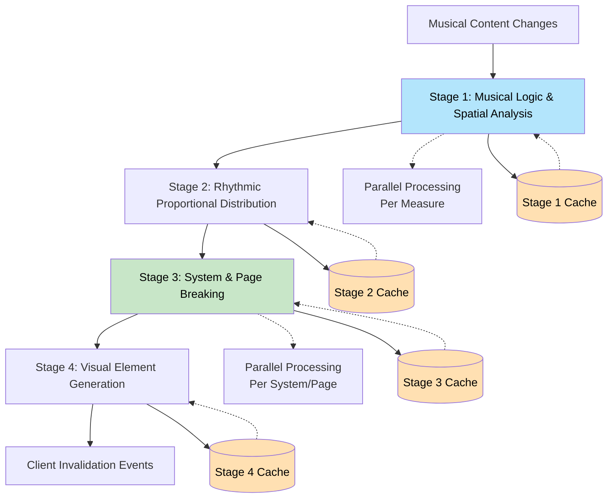
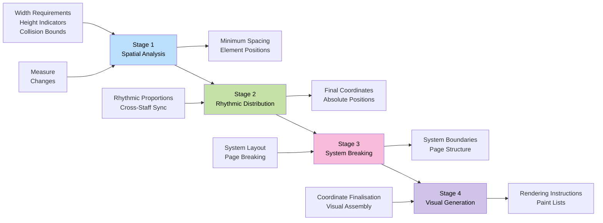
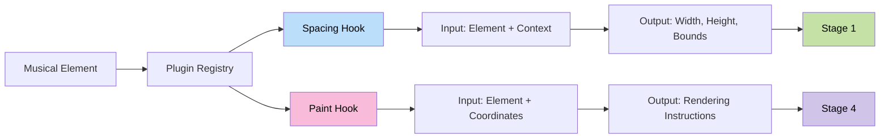
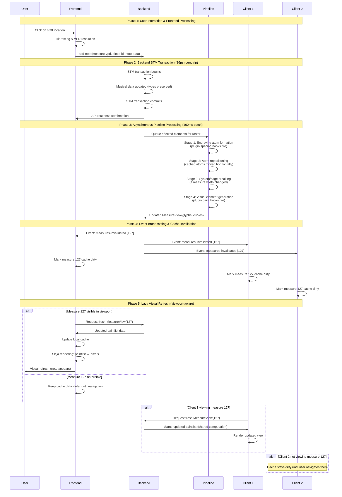
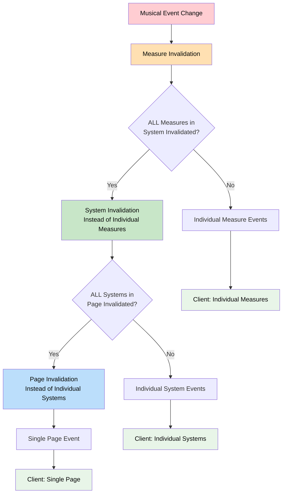

# ADR-0028: Hierarchical Rendering Pipeline with Plugin-Based Formatters

**Status**: Accepted  
**Date**: 2024-09-14

## Context

Musical notation software faces computational challenges when handling large orchestral scores containing hundreds of thousands of individual musical elements. The fundamental problem involves coordinating distinct concerns: musical logic resolution, spatial arrangement calculations, and visual rendering - each with different computational characteristics and parallelisation opportunities.

**Real-World Scalability Challenge**: Traditional notation software famously struggles with large complex scores such as Strauss's Elektra recognition scene - dense orchestral passages with intricate notation that cause performance degradation, memory exhaustion, and unresponsive editing. These scenarios expose the limitations of eager computation approaches that attempt to process entire scores regardless of user viewport or editing context.

The challenge lies in providing a unified architecture that handles both fundamental notation formatting (chord layouts, articulation placement, beam positioning) and contemporary notational extensions without architectural distinction or performance compromise.

Ooloi requires an architecture that maintains responsive editing performance with the most demanding symphonic works whilst implementing all notation formatting through a unified plugin system where canonical plugins handle standard notation alongside custom extensions.

### Architectural Foundation: Frontend-Backend Separation

Ooloi's [frontend-backend separation](0001-Frontend-Backend-Separation.md) provides multiple architectural advantages that directly inform the rendering pipeline design:

**Separation of Concerns**: Frontend remains pure UI/rendering while backend handles musical logic and computation, preventing architectural conflation and maintaining clean cognitive boundaries.

**Collaboration as Consequence**: Standalone applications operate as "collaboration groups of 1" - the same architectural patterns scale naturally to multi-user scenarios without special collaborative features.

**Performance Without Compromise**: In-process gRPC transport eliminates 99% of network overhead (36μs roundtrip measured on 2017 MacBook Pro), proving separation costs nothing performance-wise whilst enabling optimal lazy evaluation patterns.

**Type Fidelity Preservation**: Clojure defrecord instances (`Tuplet`, `Pitch`, etc.) maintain identical structure across gRPC boundaries, eliminating serialization impedance mismatch and enabling plugins to operate identically in local or distributed modes.

## Decision

Ooloi implements a **four-stage hierarchical rendering pipeline** with comprehensive plugin integration and intelligent client-server coordination:

## Table of Contents

- [Context](#context)
  - [Architectural Foundation: Frontend-Backend Separation](#architectural-foundation-frontend-backend-separation)
- [Decision](#decision)
- [Four-Stage Pipeline Architecture](#four-stage-pipeline-architecture)
  - [Stage 1: Spatial Analysis](#stage-1-spatial-analysis)
  - [Stage 2: Rhythmic Distribution](#stage-2-rhythmic-distribution)
  - [Stage 3: System Breaking](#stage-3-system-breaking)
  - [Stage 4: Visual Generation](#stage-4-visual-generation)
- [Plugin Integration Architecture](#plugin-integration-architecture)
  - [Spacing Hooks](#spacing-hooks)
  - [Paint Hooks](#paint-hooks)
- [Client-Server Coordination](#client-server-coordination)
  - [Lazy Rendering Strategy](#lazy-rendering-strategy)
  - [Hierarchical Invalidation](#hierarchical-invalidation)
- [Claypoole Integration Architecture](#claypoole-integration-architecture)
  - [Dependencies](#dependencies)
  - [Parallel Processing Approach Selection](#parallel-processing-approach-selection)
  - [Core Architecture Principles](#core-architecture-principles)
  - [Resource Lifecycle Management](#resource-lifecycle-management)
  - [Threadpool Component Integration](#threadpool-component-integration)
  - [Cross-Thread Context Management](#cross-thread-context-management)
  - [STM Integration with Cooperative Cancellation](#stm-integration-with-cooperative-cancellation)
  - [Four-Stage Pipeline Implementation](#four-stage-pipeline-implementation)
  - [Musical Priority Scheduling](#musical-priority-scheduling)
  - [Architectural Benefits Summary](#architectural-benefits-summary)
  - [Performance Characteristics](#performance-characteristics)
- [Caching and Incremental Processing](#caching-and-incremental-processing)
- [Benefits](#benefits)
- [Trade-offs](#trade-offs)
- [References](#references)


```mermaid
flowchart TD
    A[Musical Content Changes] --> B[Stage 1: Musical Logic & Spatial Analysis]
    B --> C[Stage 2: Rhythmic Proportional Distribution]
    C --> D[Stage 3: System & Page Breaking]
    D --> E[Stage 4: Visual Element Generation]
    E --> F[Client Invalidation Events]
    
    B -.-> B1[Parallel Processing<br/>Per Measure]
    D -.-> D1[Parallel Processing<br/>Per System/Page]
    
    B --> Cache1[(Stage 1 Cache)]
    C --> Cache2[(Stage 2 Cache)]
    D --> Cache3[(Stage 3 Cache)]
    E --> Cache4[(Stage 4 Cache)]
    
    Cache1 -.-> B
    Cache2 -.-> C
    Cache3 -.-> D
    Cache4 -.-> E
    
    style B fill:#b3e5fc,color:#000
    style D fill:#c8e6c8,color:#000
    style Cache1 fill:#ffe0b2,color:#000
    style Cache2 fill:#ffe0b2,color:#000
    style Cache3 fill:#ffe0b2,color:#000
    style Cache4 fill:#ffe0b2,color:#000
```

### Pipeline Stage Overview


```mermaid
flowchart LR
    A[Measure<br/>Changes] --> B[Stage 1<br/>Spatial Analysis]
    B --> C[Stage 2<br/>Rhythmic Distribution]
    C --> D[Stage 3<br/>System Breaking]
    D --> E[Stage 4<br/>Visual Generation]
    
    B1[Width Requirements<br/>Height Indicators<br/>Collision Bounds] --> B
    B --> B2[Minimum Spacing<br/>Element Positions]
    
    C1[Rhythmic Proportions<br/>Cross-Staff Sync] --> C
    C --> C2[Final Coordinates<br/>Absolute Positions]
    
    D1[System Layout<br/>Page Breaking] --> D
    D --> D2[System Boundaries<br/>Page Structure]
    
    E1[Coordinate Finalisation<br/>Visual Assembly] --> E
    E --> E2[Rendering Instructions<br/>Paint Lists]
    
    style B fill:#bbdefb,color:#000
    style C fill:#c5e1a5,color:#000
    style D fill:#f8bbd9,color:#000
    style E fill:#d1c4e9,color:#000
```

### Pipeline Stage 1: Musical Logic Resolution and Spatial Analysis
Individual measures process their internal musical content independently:
- Note transpositions and pitch calculations
- Effective accidental determination based on key signatures and measure context
- Tie, slur, and beam resolution
- Key signature and time signature propagation
- **Engraving Atom Formation**: Each rhythmic position calculates its complete spatial unit - noteheads, stems, accidentals, articulations positioned relative to each other as an indivisible "engraving atom"
- **Plugin Hook Integration**: Spacing hooks fire for each notational element, contributing spatial requirements to atom formation
- **Atom Dimension Caching**: Once calculated for a rhythmic configuration, engraving atoms remain **immutable** until measure content changes, enabling efficient repositioning without recomputation

### Pipeline Stage 2: Rhythmic Proportional Distribution
Measures coordinate optimal spacing using pre-computed engraving atoms:
- **Atom Repositioning**: Pre-computed engraving atoms moved horizontally for optimal rhythmic alignment - no internal atom recalculation required
- **Rhythmic proportion calculation**: Distributes space according to rhythmic relationships - longer note values receive proportionally more horizontal space
- **Cross-staff synchronisation**: Ensures consistent rhythmic spacing across all staves within each measure number
- **Computational Efficiency**: Much faster than Stage 1 since atom dimensions are cached - only atom positioning changes

### Pipeline Stage 3: System and Page Breaking
Measure streams are organised into visual layouts:
- **System break determination**: Groups measures into horizontal systems based on available width
- **Page layout calculation**: Arranges systems vertically within page boundaries
- **Cross-system element coordination**: Manages ties, slurs, and other elements spanning system breaks
- **Vertical refinement**: SystemView adjusts vertical spacing using indicative heights from Stage 1

### Pipeline Stage 4: Visual Element Generation
With final positioning established, measures generate their visual output:
- **Coordinate finalisation**: Combines positioning data with spatial measurements from earlier stages
- **Visual element assembly**: Creates rendering instructions for glyphs, curves, and text elements
- **Layout-specific adjustments**: Applies zoom levels, display preferences, and viewport optimisations

### Plugin Architecture Integration

Every notational element participates through a unified plugin interface with **mandatory two-stage compliance**:


```mermaid
flowchart LR
    A[Musical Element] --> B[Plugin Registry]
    B --> C[Spacing Hook]
    B --> D[Paint Hook]
    
    C --> C1[Input: Element + Context]
    C1 --> C2[Output: Width, Height, Bounds]
    
    D --> D1[Input: Element + Coordinates]
    D1 --> D2[Output: Rendering Instructions]
    
    C2 --> E[Stage 1]
    D2 --> F[Stage 4]
    
    style C fill:#bbdefb,color:#000
    style D fill:#f8bbd9,color:#000
    style E fill:#c5e1a5,color:#000
    style F fill:#d1c4e9,color:#000
```

#### Spacing Hook
Plugins declare the spatial requirements of their elements:
- **Input**: Musical element data and contextual information
- **Output**: Width requirements, indicative height, and collision boundaries

#### Paint Hook  
Plugins generate visual rendering instructions:
- **Input**: Musical element data with finalised positioning coordinates
- **Output**: Rendering instructions (glyphs, curves, text) with precise coordinates

**Registry-Based Discovery**: The plugin registry maintains mappings between musical elements and their formatters, enabling runtime composition and replacement of notational elements.

## User Interaction Flow


```mermaid
sequenceDiagram
    participant U as User
    participant F as Frontend
    participant B as Backend
    participant P as Pipeline
    participant C1 as Client 1
    participant C2 as Client 2

    Note over U,C2: Phase 1: User Interaction & Frontend Processing
    U->>F: Click on staff location
    F->>F: Hit-testing & VPD resolution
    F->>B: add-note(measure-vpd, piece-id, note-data)

    Note over U,C2: Phase 2: Backend STM Transaction (36μs roundtrip)
    B->>B: STM transaction begins
    B->>B: Musical data updated (types preserved)
    B->>B: STM transaction commits
    B->>F: API response confirmation

    Note over U,C2: Phase 3: Asynchronous Pipeline Processing (100ms batch)
    B->>P: Queue affected elements for raster
    P->>P: Stage 1: Engraving atom formation<br/>(plugin spacing hooks fire)
    P->>P: Stage 2: Atom repositioning<br/>(cached atoms moved horizontally)
    P->>P: Stage 3: System/page breaking<br/>(if measure width changed)
    P->>P: Stage 4: Visual element generation<br/>(plugin paint hooks fire)
    P->>B: Updated MeasureView{glyphs, curves}

    Note over U,C2: Phase 4: Event Broadcasting & Cache Invalidation
    B->>F: Event: measures-invalidated [127]
    B->>C1: Event: measures-invalidated [127]
    B->>C2: Event: measures-invalidated [127]

    F->>F: Mark measure 127 cache dirty
    C1->>C1: Mark measure 127 cache dirty
    C2->>C2: Mark measure 127 cache dirty

    Note over U,C2: Phase 5: Lazy Visual Refresh (viewport-aware)
    alt Measure 127 visible in viewport
        F->>B: Request fresh MeasureView(127)
        B->>F: Updated paintlist data
        F->>F: Update local cache
        F->>F: Skija rendering: paintlist → pixels
        F->>U: Visual refresh (note appears)
    else Measure 127 not visible
        F->>F: Keep cache dirty, defer until navigation
    end

    alt Client 1 viewing measure 127
        C1->>B: Request fresh MeasureView(127)
        B->>C1: Same updated paintlist (shared computation)
        C1->>C1: Render updated view
    end

    alt Client 2 not viewing measure 127
        Note over C2: Cache stays dirty until user navigates there
    end
```

This sequence illustrates the complete system flow when a user adds a note, demonstrating the pipeline's lazy evaluation characteristics, asynchronous batching, collaborative event distribution, and viewport-aware client responses.

## Computational Scaling Characteristics

Independent measure analysis can run in parallel during Stage 1. System chunks can also be parallelised during Stage 3 processing. Pipeline stages naturally separate concerns, enabling different parallelisation strategies for each computational phase.

**Engraving Atom Efficiency**: The two-phase spatial computation (atom formation + positioning) provides intelligent caching granularity:
- Adding notes to existing rhythmic positions → atom recalculation + positioning
- Changing note spacing → positioning only (atoms unchanged)
- Adding accidentals → atom recalculation + positioning
- Changing time signatures → positioning only (atoms unchanged)

Memory access patterns prove favourable as each processing unit operates on distinct memory regions during parallel operations, minimising cache conflicts and false sharing between processors.

The 100-millisecond **asynchronous** batching interval amplifies computational efficiency by amortising processing costs across multiple edits, accumulating changes and processing them in optimally-sized batches. Crucially, mutating API calls return immediately without waiting for batch processing.

## Claypoole Integration Architecture

After comprehensive evaluation of parallel processing options, **Claypoole** has been selected as the optimal solution for Ooloi's CPU-intensive layout calculations, providing 16x performance improvement over pmap with superior resource control.

### Dependencies

```clojure
;; Add to backend/project.clj
[org.clj-commons/claypoole "1.2.2"]
```

### Parallel Processing Approach Selection

**Claypoole Selection Rationale:**

After comprehensive evaluation of parallel processing options, Claypoole provides the optimal combination of performance, control, and integration characteristics for musical notation rendering:

**Performance Advantages:**
- **16x performance improvement** over built-in `pmap` for CPU-intensive layout calculations
- **Near-linear scaling** up to available CPU cores (3.5-3.8x speedup on 4-core systems)
- **Superior CPU utilization** through configurable thread pools vs pmap's fixed threading

**Compared to Alternatives:**
- **`pmap`**: Unpredictable performance due to lazy evaluation and fixed `(ncpus + 2)` threading - avoided for production
- **`reducers/fold`**: Better for pure mathematical operations but limited by associative function requirements - doesn't fit measure-level processing
- **`core.async` pipelines**: Higher overhead with fixed 8-thread default, suboptimal for CPU-bound work
- **Custom `ForkJoinPool`**: Maximum performance potential but requires complex implementation and lacks Clojure integration

**`cp/pmap` Selection within Claypoole:**

Within Claypoole's API, `cp/pmap` provides the best fit for musical notation processing:

**Ordered Processing Requirement:**
- Musical measures must maintain sequence relationships for cross-measure elements (ties, slurs, spacing)
- `cp/pmap` preserves input order, unlike `cp/upmap` which returns results unordered
- Stage-to-stage data flow requires predictable result positioning

**API Simplicity:**
- `cp/pmap` provides direct replacement for `pmap` with controllable threadpool
- Simpler than manual `cp/future` coordination for batch processing
- More natural than `cp/pfor` for functional processing patterns

**Resource Control:**
- Explicit threadpool specification enables priority scheduling based on musical structure dependencies
- Controlled memory overhead through threadpool sizing
- Clean integration with Integrant component lifecycle

### Core Architecture Principles

The Claypoole integration follows a strict separation of concerns that prevents architectural conflation:

* **Claypoole handles execution substrate**: threadpool management, bounded parallelism, resource lifecycle, and backpressure control
* **Domain scheduler handles musical coordination**: operation tracking, STM transactions, and cooperative cancellation
* **Clean separation prevents complexity explosion**: execution primitives never mix with musical business logic

This separation is critical because musical notation rendering has sophisticated coordination requirements (operation-based cancellation, STM transaction management, hierarchical invalidation) that generic parallel processing libraries cannot and should not address. Claypoole provides the execution foundation while Ooloi's domain logic maintains complete control over coordination semantics.

### Resource Lifecycle Management

Musical notation software requires deterministic resource management because layout calculations run continuously in response to user edits. Unlike batch processing scenarios, notation editors must manage threadpools as long-lived resources with predictable cleanup behavior.

### Threadpool Component Integration

```clojure
(defmethod ig/init-key ::renderer [_ {:keys [cpu-cores]}]
  (let [cores (or cpu-cores (.availableProcessors (Runtime/getRuntime)))]
    {:cpu-pool (cp/threadpool cores)
     :priority-pool (cp/priority-threadpool cores)  ; For visible measures
     :metrics (atom {})}))

(defmethod ig/halt-key! ::renderer [_ renderer]
  (when-let [cpu (:cpu-pool renderer)]
    (cp/shutdown cpu))
  (when-let [prio (:priority-pool renderer)]
    (cp/shutdown prio)))
```

**Integrant Integration**: The component system manages threadpool lifecycle deterministically. Manual resource management is essential because threadpools maintain daemon threads that prevent JVM shutdown if not explicitly cleaned up.

**Dual Pool Strategy**: Standard and priority threadpools enable responsive editing behavior. Priority pools process high-priority measures first, ensuring critical musical structure updates receive immediate attention during complex score processing.

**Thread Count Configuration**: Pool sizing defaults to physical CPU cores, optimizing for CPU-bound layout calculations. This prevents thread oversubscription and context switching overhead.

### Cross-Thread Context Management

Claypoole executes tasks on threadpool threads that don't inherit dynamic variable bindings from the calling thread. Musical notation rendering requires consistent context (operation tracking, musical settings) across all parallel tasks.

**Binding Conveyance with `cp/pmap`**: Claypoole automatically handles binding conveyance for dynamic variables, ensuring that `*current-operation*` is available to all parallel tasks without explicit capture.

**Exception Context Preservation**: Task failures need to maintain debugging information across thread boundaries. This is critical for diagnosing layout calculation failures in complex musical scenarios:

```clojure
(cp/pmap cpu-pool
  (fn [measure-id]
    (try
      (with-cancellation
        (analyze-measure piece measure-id))
      (catch Exception e
        (throw (ex-info "Layout calculation failed"
                        {:measure-id measure-id
                         :operation-id *current-operation*}
                        e)))))
  measure-ids)
```

### STM Integration with Cooperative Cancellation

The rendering pipeline coordinates Claypoole parallel processing within STM transactions. Since only one formatting operation runs at a time, cancellation uses simple global state coordination.

### Single-Operation Architecture

**Key Constraint**: Only one formatting operation runs at any given time, eliminating complex concurrency coordination requirements.

**Cancellation Strategy**: Global operation tracking with dynamic variable binding enables responsive cancellation of parallel tasks within STM transactions.

```clojure
;; Global formatting coordination
(defonce ^:private current-formatting-operation (atom nil))

(def ^:dynamic *current-operation* nil)

(defn cancelled? []
  "Check if current parallel task should abort"
  (not= *current-operation* @current-formatting-operation))

(defmacro with-cancellation [& body]
  "Execute body with cancellation checking"
  `(if (cancelled?) ::cancelled (do ~@body)))
```

### Integrated STM and Claypoole Implementation

```clojure
(defn run-formatting-pipeline! [renderer piece-ref measure-ids]
  "Complete formatting pipeline with Claypoole and STM integration"
  (let [operation-id (java.util.UUID/randomUUID)
        {:keys [cpu-pool]} renderer]

    ;; Set current operation (outside STM)
    (reset! current-formatting-operation operation-id)

    ;; Execute pipeline within STM transaction
    (dosync
      (alter piece-ref
        (fn [piece]
          (binding [*current-operation* operation-id]
            ;; Stage 1: Parallel spatial analysis
            (let [stage1-results (cp/pmap cpu-pool
                                          (fn [measure-id]
                                            (with-cancellation
                                              (analyze-measure piece measure-id)))
                                          measure-ids)]

              (if (some #{::cancelled} stage1-results)
                piece  ; Return unchanged if cancelled
                ;; Continue with remaining stages
                (-> piece
                    (apply-rhythmic-distribution stage1-results)
                    (apply-system-breaking)
                    (generate-visual-elements)
                    (generate-invalidation-events))))))))))
```

### Cancellation Flow

**Responsive Editing**: When user makes new edits during active formatting:

1. **New operation starts**: `(reset! current-formatting-operation new-id)`
2. **Old tasks detect cancellation**: `(cancelled?)` returns `true`
3. **Tasks abort cleanly**: Return `::cancelled` without corrupting state
4. **STM handles consistency**: Transaction proceeds with partial results or unchanged piece

**Benefits**:
- **Simple cancellation**: Global operation tracking enables clean task abortion
- **STM compatibility**: No side effects within transactions
- **Responsive editing**: Long-running calculations abort quickly when new edits arrive
- **Clean state**: Cancelled operations leave no partial modifications

### Four-Stage Pipeline Implementation

Each pipeline stage uses Claypoole for parallel processing within the STM transaction:

```clojure
(defn run-complete-pipeline! [renderer piece-ref measure-ids]
  "Four-stage rendering pipeline with integrated cancellation"
  (let [operation-id (java.util.UUID/randomUUID)
        {:keys [cpu-pool]} renderer]

    ;; Set current operation
    (reset! current-formatting-operation operation-id)

    (dosync
      (alter piece-ref
        (fn [piece]
          (binding [*current-operation* operation-id]

            ;; Stage 1: Spatial Analysis (parallel per measure)
            (let [spatial-results (cp/pmap cpu-pool
                                          (fn [measure-id]
                                            (with-cancellation
                                              (analyze-spatial-requirements piece measure-id)))
                                          measure-ids)]

              (if (some #{::cancelled} spatial-results)
                piece

                ;; Stage 2: Rhythmic Distribution (parallel per measure)
                (let [rhythmic-results (cp/pmap cpu-pool
                                               (fn [[measure-id spatial-data]]
                                                 (with-cancellation
                                                   (calculate-rhythmic-distribution piece measure-id spatial-data)))
                                               (map vector measure-ids spatial-results))]

                  (if (some #{::cancelled} rhythmic-results)
                    piece

                    ;; Stage 3: System Breaking (parallel per system)
                    (let [system-results (cp/pmap cpu-pool
                                                  (fn [system-data]
                                                    (with-cancellation
                                                      (calculate-system-breaks piece system-data)))
                                                  (group-into-systems rhythmic-results))]

                      (if (some #{::cancelled} system-results)
                        piece

                        ;; Stage 4: Visual Generation (parallel per measure)
                        (let [visual-results (cp/pmap cpu-pool
                                                     (fn [measure-layout]
                                                       (with-cancellation
                                                         (generate-visual-elements piece measure-layout)))
                                                     (flatten-system-layouts system-results))]

                          (if (some #{::cancelled} visual-results)
                            piece
                            ;; All stages completed successfully
                            (-> piece
                                (apply-all-updates spatial-results rhythmic-results
                                                  system-results visual-results)
                                (generate-invalidation-events))))))))))))))))
```

**Pipeline Characteristics:**
- **Single STM transaction**: All stages execute within one `dosync` block
- **Cancellation at each stage**: Any stage can abort cleanly if new edits arrive
- **Claypoole parallelism**: Each stage uses `cp/pmap` for parallel processing
- **Progressive computation**: Each stage builds on results from previous stages
- **Atomic updates**: Either entire pipeline succeeds or piece remains unchanged

### Musical Priority Scheduling

Layout changes propagate through musical structure in predictable patterns. Priority scheduling leverages these patterns to maintain musical consistency while minimizing unnecessary recalculation.

### Measure-Stack Priority Strategy

When layout changes occur, musical consistency requires processing related measures in priority order:

```clojure
(defn calculate-measure-stack-priority [changed-measure-positions]
  "Calculate priority based on musical structure dependencies"
  (let [measure-numbers (map :measure-number changed-measure-positions)]
    {:immediate    ;; Changed measure stacks - vertical consistency critical
     (find-all-measures-with-numbers measure-numbers)

     :dependent    ;; Adjacent measures that might need width adjustments
     (find-adjacent-measures-requiring-reflow measure-numbers)

     :cascading    ;; Systems/pages that might need restructuring
     (find-systems-requiring-rebreak measure-numbers)

     :deferred     ;; Unaffected measures
     (find-unaffected-measures measure-numbers)}))

(defn execute-musical-priority-waves! [renderer piece-ref priority-sets operation-id]
  "Execute musical priority waves based on structural dependencies"
  (let [cpu  (:cpu-pool renderer)
        prio (or (:priority-pool renderer) cpu)]

    (binding [*current-operation* operation-id]
      ;; Wave 1: Immediate - same measure number across all staves
      (let [immediate-results
            (when (seq (:immediate priority-sets))
              (cp/pmap prio
                       (fn [measure-stack]
                         (with-cancellation
                           (format-measure-stack-for-vertical-alignment measure-stack)))
                       (:immediate priority-sets)))]

        (if (some #{::cancelled} immediate-results)
          ::cancelled
          ;; Wave 2: Dependent - measures requiring width/spacing adjustments
          (let [dependent-results
                (when (seq (:dependent priority-sets))
                  (cp/pmap cpu
                           (fn [measure]
                             (with-cancellation
                               (recalculate-measure-with-new-spacing measure immediate-results)))
                           (:dependent priority-sets)))]
            ;; Continue with cascading and deferred waves...
            ))))))
```

**Measure-Stack Consistency**: When a measure changes, all measures with the same measure number across all staves receive immediate priority to maintain vertical alignment - a fundamental musical layout requirement.

**Width Ripple Management**: Measures whose width requirements change due to the initial formatting receive secondary priority, as their spacing adjustments may affect neighboring measures.

**Hierarchical Invalidation**: Changes propagate up the musical hierarchy (measures → systems → pages → full layout) with processing priority reflecting the scope of required recalculation.

**Structural Dependency Tracking**: Priority calculation considers musical structure dependencies rather than UI visibility, as the backend has no knowledge of client display state.

**Discomfort-Based Recalculation Priorities**: For each measure stack, system, and page, we track a "discomfort" value measuring the absolute deviation from its ideal width. When discomfort exceeds architectural thresholds, hierarchical recalculation cascades upward: uncomfortable measure stacks trigger system-level rebreaking, uncomfortable systems trigger page-level restructuring. This architectural pattern ensures that layout quality degrades gracefully under constraint pressure while triggering comprehensive recalculation only when musically necessary.

### Architectural Benefits Summary

The Claypoole integration with single-operation coordination provides several critical advantages:

**Responsive Musical Processing**: Priority scheduling ensures that musical structure changes receive appropriate processing attention based on their structural impact, maintaining musical consistency during complex score manipulation.

**Resource Predictability**: Explicit threadpool management provides deterministic resource usage patterns, essential for professional audio workstation integration where resource conflicts must be avoided.

**Simple Cancellation**: Global operation tracking with dynamic binding provides clean cancellation semantics without complex coordination machinery.

**STM Integration**: Parallel processing within STM transactions leverages automatic conflict resolution while maintaining transactional consistency across the entire pipeline.

**Computational Scalability**: Near-linear scaling with CPU cores provides predictable performance improvements on professional workstations with high core counts, enabling complex orchestral score processing.

**Architectural Simplicity**: Single-operation constraint eliminates complex concurrency coordination, enabling straightforward implementation and maintenance.

### Performance Characteristics

- **16x performance improvement** over pmap for CPU-intensive layout calculations
- **Near-linear scaling** up to available CPU cores (3.5-3.8x speedup on 4-core systems)
- **Controlled memory overhead**: Buffer size scales as `2 × pool_size` (eager) or `1 × pool_size` (lazy)
- **STM automatic conflict handling**: Transactions retry with fresh data when conflicts occur
- **Cooperative cancellation** with responsive abort behavior through operation tracking

## Caching and Incremental Processing

Pipeline results are cached until local edits change them. Invalidation works hierarchically: musical events trigger measure recalculation, which may trigger system recalculation, which may trigger page recalculation.


```mermaid
flowchart TD
    A[Musical Event Change] --> B[Measure Invalidation]
    B --> C{ALL Measures in<br/>System Invalidated?}
    C -->|Yes| D[System Invalidation<br/>Instead of Individual Measures]
    C -->|No| E[Individual Measure Events]
    D --> F{ALL Systems in<br/>Page Invalidated?}
    F -->|Yes| G[Page Invalidation<br/>Instead of Individual Systems]
    F -->|No| H[Individual System Events]
    G --> I[Single Page Event]
    
    E --> J[Client: Individual Measures]
    H --> K[Client: Individual Systems]
    I --> L[Client: Single Page]
    
    style A fill:#ffcdd2,color:#000
    style B fill:#ffe0b2,color:#000
    style D fill:#c8e6c8,color:#000
    style G fill:#bbdefb,color:#000
    style J fill:#e8f5e8,color:#000
    style K fill:#e8f5e8,color:#000
    style L fill:#e8f5e8,color:#000
```

**Stage 1 Caching**: Spatial analysis results persist until any element affecting measure content changes. Measures that remain completely unchanged never require recalculation.

**Conditional Processing**: Later pipeline stages process only measures that underwent earlier stage recalculation. Unchanged measures retain their cached results unless positioning changes affect their coordinates.

**Cache Granularity**: Invalidation operates at measure-level precision, ensuring that unrelated changes don't trigger unnecessary recalculations across the composition.

### Client-Server Event Coordination

#### Batched Reformatting (100ms Intervals)
The backend accumulates formatting requests and processes them in 100-millisecond intervals, providing perceived real-time response whilst avoiding computational waste on rapid input sequences.

#### Hierarchical Invalidation Events
Clients receive optimised invalidation notifications that respect the visual hierarchy. Deduplication logic eliminates redundant updates - if an entire page requires recalculation, individual measure invalidations within that page are automatically eliminated.

#### Lazy Visual Realisation
Clients implement demand-driven rendering data fetching. Open layouts immediately request updated rendering instructions, whilst closed layouts mark invalidated elements for cleanup and fetch data only when subsequently opened.

**Collaborative Data Sharing**: Multiple clients requesting identical updated data receive shared computation results without triggering redundant backend processing, as all clients typically fetch identical MeasureView paintlists.

## Rationale

### Positive Aspects

1. **Performance Scalability**: The four-stage pipeline enables parallelisation across different computational characteristics, with each stage optimised for its specific processing requirements.

2. **Plugin-Based Fundamental Architecture**: All notation formatting - from basic chord layouts and articulation placement to custom extensions - operates through the same unified plugin system, eliminating distinction between "core" and "extended" functionality.

3. **Intelligent Resource Management**: Client-server coordination minimises computational waste whilst maintaining responsive user experience through demand-driven visual realisation.

4. **Musical Accuracy**: Pipeline separation ensures that musical logic resolution occurs independently of spatial concerns, preventing layout constraints from corrupting musical meaning.

5. **Incremental Processing**: Comprehensive caching with hierarchical invalidation provides dramatic performance improvements for typical editing scenarios.

6. **Transparent Distribution**: Type fidelity across gRPC boundaries eliminates serialization impedance, enabling plugins and musical logic to operate identically in local or distributed modes.

7. **Efficient Spatial Computation**: Engraving atom caching prevents unnecessary recomputation - most changes only require fast atom repositioning rather than expensive dimension recalculation.

### Negative Aspects

1. **Implementation Complexity**: The four-stage pipeline requires sophisticated coordination mechanisms and careful state management across stage boundaries.

2. **Plugin Development Requirements**: All formatting logic must implement both spacing and paint hooks, creating consistent architectural requirements across canonical and custom plugins.

3. **Memory Usage During Transitions**: Intermediate state between stages requires temporary storage, particularly significant for large scores.

4. **Debugging Complexity**: Issues may arise from interactions between stages, requiring debugging tools that can trace problems across the entire pipeline.

5. **Network Dependency for Collaboration**: Real-time collaborative features require reliable network connectivity; offline scenarios may experience degraded functionality.

### Mitigations

1. **Comprehensive Testing Framework**: Automated testing covers cross-stage interactions and performance characteristics under realistic load conditions.

2. **Plugin Development Tools**: Scaffolding tools and examples reduce the complexity of implementing compliant plugins.

3. **Memory Monitoring**: Profiling tools track memory usage across stage transitions, enabling optimisation of large score handling.

4. **Debugging Infrastructure**: Specialised debugging tools provide visibility into stage transitions and plugin interactions.

5. **Offline Resilience**: Local formatting capabilities maintain basic functionality during network interruptions.

## Alternatives Considered

### Alternative 1: Hardcoded Core Notation Elements
**Approach**: Implement fundamental notation formatting (chord layouts, articulation placement, beam positioning) directly in core system with plugin architecture only for extensions.
**Rejection Reasons**:
- Creates artificial architectural distinction between fundamental and extended formatting logic
- Prevents unified optimization and caching strategies across all notation elements
- Violates architectural uniformity principle where all formatting logic follows identical patterns
- Complicates maintenance by requiring separate code paths for equivalent functionality
- Limits ability to customize or replace fundamental formatting behaviors when needed

## References

### Implementation Research
- **research/CLAYPOOLE_FOR_OOLOI_RESEARCH.md** - Comprehensive technical assessment and suitability analysis
- **research/LAYOUT_COMPUTATION_WITH_CLAYPOOLE.md** - Complete production-ready implementation guide

### Related ADRs
- [ADR-0000: Clojure](0000-Clojure.md) - Language providing parallel processing capabilities essential for pipeline stages
- [ADR-0001: Frontend-Backend Separation](0001-Frontend-Backend-Separation.md) - Architectural foundation enabling clean separation with transparent distribution
- [ADR-0002: gRPC Communication](0002-gRPC.md) - Communication protocol supporting efficient invalidation event transmission with type fidelity
- [ADR-0003: Plugins](0003-Plugins.md) - Plugin architecture foundation extended by mandatory two-stage compliance
- [ADR-0004: STM for Concurrency](0004-STM-for-concurrency.md) - Concurrency model supporting coordinated multi-stage updates
- [ADR-0005: JavaFX and Skija](0005-JavaFX-and-Skija.md) - Client rendering technology consuming generated rendering instructions
- [ADR-0006: SMuFL](0006-SMuFL.md) - Standardised music font providing glyph metadata for spatial calculations
- [ADR-0008: VPDs](0008-VPDs.md) - Vector Path Descriptors enabling hierarchical element addressing in invalidation events
- [ADR-0022: Lazy Frontend-Backend Architecture](0022-Lazy-Frontend-Backend-Architecture.md) - Event-driven client synchronization patterns underlying the rendering pipeline

### Technical Dependencies
- **Claypoole**: Threadpool-based parallel processing library providing controlled CPU-intensive task execution
- **Clojure STM**: Transaction system coordinating multi-stage updates
- **gRPC Streaming**: Bi-directional communication for real-time invalidation events
- **SMuFL Font Metadata**: Glyph dimension data essential for spatial requirement calculations
- **JavaFX Canvas**: Client rendering surface for visual element realisation
- **Skija Graphics**: High-performance graphics rendering for complex musical elements

### Performance Characteristics
- **Batching Interval**: 100ms asynchronous processing provides optimal balance between responsiveness and computational efficiency
- **API Responsiveness**: 36μs roundtrip measured on 2017 MacBook Pro proves gRPC separation adds negligible latency
- **Memory Efficiency**: Lazy rendering data generation reduces memory footprint for large scores
- **Parallel Scaling**: Linear performance improvement with available CPU cores during formatting stages
- **Engraving Atom Efficiency**: Two-phase spatial computation minimizes redundant calculations through intelligent caching

## Notes

This architectural decision establishes Ooloi's rendering pipeline as a scalable system capable of handling professional-scale musical compositions through unified plugin-based formatting for all notation elements.

The mandatory plugin compliance ensures that fundamental notation formatting (chords, articulations, beams) and custom extensions operate through identical architectural patterns, providing a foundation for comprehensive musical expression without artificial distinctions between "core" and "extended" functionality.

The four-stage approach recognises that musical logic, spatial arrangement, layout organisation, and visual rendering represent distinct computational problems that benefit from separation and targeted optimisation, with all formatting logic implemented through canonical and custom plugins as first-class citizens.
