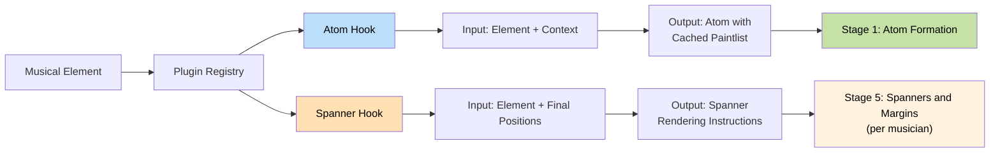

# ADR-0028: Hierarchical Rendering Pipeline with Plugin-Based Formatters

**Status**: Accepted
**Date**: 2024-09-14
**Updated**: 2026-02-07 (shared thread pool — single pool replaces dual cpu/priority pools)

## Table of Contents

- [Context](#context)
  - [Architectural Foundation: Frontend-Backend Separation](#architectural-foundation-frontend-backend-separation)
- [Decision](#decision)
- [Six-Stage Pipeline Architecture](#six-stage-pipeline-architecture)
  - [Stage 1: Atom Formation and Extent Calculation (Fan-Out per Measure)](#pipeline-stage-1-atom-formation-and-extent-calculation-fan-out-per-measure)
  - [Stage 2: Raster Creation (Fan-In across Measure Stack)](#pipeline-stage-2-raster-creation-fan-in-across-measure-stack)
  - [Stage 3: System Breaking (Single)](#pipeline-stage-3-system-breaking-single)
  - [Stage 4: Atom Positioning (Fan-Out per Measure)](#pipeline-stage-4-atom-positioning-fan-out-per-measure)
  - [Stage 5: Spanners and Margins (Fan-Out per Musician)](#pipeline-stage-5-spanners-and-margins-fan-out-per-musician)
  - [Stage 6: Page Breaking (Single)](#pipeline-stage-6-page-breaking-single)
- [Atom-Relative Geometry Invariant](#atom-relative-geometry-invariant)
  - [Plugin Architecture Integration](#plugin-architecture-integration)
  - [Cross-Tree Caching Architecture: Layout Integration](#cross-tree-caching-architecture-layout-integration)
- [User Interaction Flow](#user-interaction-flow)
- [Computational Scaling Characteristics](#computational-scaling-characteristics)
- [Claypoole Integration Architecture](#claypoole-integration-architecture)
  - [Shared Threadpool](#shared-threadpool)
  - [Cancellation Contract](#cancellation-contract)
- [Caching and Incremental Processing](#caching-and-incremental-processing)
  - [Client-Server Event Coordination](#client-server-event-coordination)
- [Rationale](#rationale)
  - [Positive Aspects](#positive-aspects)
- [Trade-offs](#trade-offs)
- [Alternatives Considered](#alternatives-considered)
  - [Alternative 1: Hardcoded Core Notation Elements](#alternative-1-hardcoded-core-notation-elements)
  - [Alternative 2: Second-Pass Modification for System-Start Elements](#alternative-2-second-pass-modification-for-system-start-elements)
  - [Alternative 3: Dual Computation (Two Complete Measure Layouts)](#alternative-3-dual-computation-two-complete-measure-layouts)
  - [Alternative 4: Post-Hoc Spacing Adjustment](#alternative-4-post-hoc-spacing-adjustment)
- [References](#references)
  - [Related ADRs](#related-adrs)
  - [Technical Dependencies](#technical-dependencies)
  - [Performance Characteristics](#performance-characteristics)
- [Notes](#notes)

## Context

Musical notation software faces computational challenges when handling large orchestral scores containing hundreds of thousands of individual musical elements. The fundamental problem involves coordinating distinct concerns: musical logic resolution, spatial arrangement calculations, and visual rendering - each with different computational characteristics and parallelisation opportunities.

**Real-World Scalability Challenge**: Traditional notation software famously struggles with large complex scores such as Strauss's Elektra recognition scene - dense orchestral passages with intricate notation that cause performance degradation, memory exhaustion, and unresponsive editing. These scenarios expose the limitations of eager computation approaches that attempt to process entire scores regardless of user viewport or editing context.

**Architectural Purpose**: This specification addresses the scalability limitations of existing notation software when processing large orchestral scores. The 6-stage hierarchical rendering pipeline with plugin integration provides the foundation for handling complex notation efficiently across multiple CPU cores.

**Scalability Approach**: The fan-out/fan-in architecture enables parallel processing during computationally intensive stages, providing linear scaling characteristics with available CPU cores for both simple and complex musical scores.

The challenge lies in providing a unified architecture that handles both fundamental notation formatting (chord layouts, articulation placement, beam positioning) and contemporary notational extensions without architectural distinction or performance compromise.

Ooloi requires an architecture that maintains responsive editing performance with the most demanding symphonic works whilst implementing all notation formatting through a unified plugin system where canonical plugins handle standard notation alongside custom extensions.

### Architectural Foundation: Frontend-Backend Separation

Ooloi's [frontend-backend separation](0001-Frontend-Backend-Separation.md) provides multiple architectural advantages that directly inform the rendering pipeline design:

**Separation of Concerns**: Frontend remains pure UI/rendering while backend handles musical logic and computation, preventing architectural conflation and maintaining clean cognitive boundaries.

**Collaboration as Consequence**: Standalone applications operate as "collaboration groups of 1" - the same architectural patterns scale naturally to multi-user scenarios without special collaborative features.

**Performance Without Compromise**: In-process gRPC transport eliminates 99% of network overhead (36μs roundtrip measured on 2017 MacBook Pro), proving separation costs nothing performance-wise whilst enabling optimal lazy evaluation patterns.

**Type Fidelity Preservation**: Clojure defrecord instances (`Tuplet`, `Pitch`, etc.) maintain identical structure across gRPC boundaries, eliminating serialization impedance mismatch and enabling plugins to operate identically in local or distributed modes.

## Decision

Ooloi implements a **six-stage hierarchical rendering pipeline** with comprehensive plugin integration and intelligent client-server coordination:

## Six-Stage Pipeline Architecture


### Pipeline Stage 1: Atom Formation and Extent Calculation (Fan-Out per Measure)

Stage 1 processes individual measures in parallel (fan-out per measure), with each measure independently calculating its rhythmic content, spatial extents, and cached visual representations. Each rhythmic position forms an "engraving atom" - noteheads, stems, accidentals, articulations positioned relative to each other as an indivisible unit. All glyph positions within an atom are relative to the atom's origin point (see [Atom-Relative Geometry Invariant](#atom-relative-geometry-invariant)), enabling atoms to be repositioned without internal recomputation.

Each atom calculates four-directional extents from its center (left, right, up, down), establishing both minimum spacing (where adjacent extents touch) and ideal spacing (proportional rhythmic values). Plugin atom hooks fire for each notational element, producing atoms with extents and cached paintlists. Each measure also computes a `gutter_width` delta - additional space needed when appearing first on a system for graphical decorations (typically 0N, see [ADR-0037](0037-Measure-Distribution-Optimization.md#the-gutter-system-start-width-delta) for detailed algorithm). Once calculated, atoms remain immutable until measure content changes.

**Stage 1 is width-complete**: It computes all horizontal space requirements including spanner anchors, ensuring Stage 3 has complete information for optimal distribution.

### Pipeline Stage 2: Raster Creation (Fan-In across Measure Stack)

Stage 2 creates a unified rhythmic raster across the vertical measure stack (fan-in), collecting minimum, ideal, and gutter widths from all measures at this temporal position. When measures have different rhythmic content, reconciliation produces synchronized vertical alignment with rational rhythmic positions (including tuplet divisions like 1/3, 2/3). The resulting MeasureStackFormatter stores all three width components (min, ideal, gutter), establishing the solution space between physical feasibility (minimum) and musical intent (ideal). This unified raster with complete width metrics becomes the input for Stage 3 system breaking.

### Pipeline Stage 3: System Breaking (Single)

Stage 3 uses Knuth-Plass dynamic programming to determine optimal system break points (single pass, not parallelizable). With complete information from Stage 2 (exact min/ideal/gutter widths for every measure stack), the algorithm evaluates candidate systems by subtracting the preamble width (clef + key signature, computed on-demand) and gutter width from available system width, then computing scale factors. The objective function uses proportional scaling with quadratic cost on deviation from ideal spacing, producing globally optimal breaks while preserving rhythmic proportionality. Output: system break decisions and scale factors per system - no atom positioning yet. After this stage, horizontal distribution is determined but atoms remain unpositioned. See [ADR-0037](0037-Measure-Distribution-Optimization.md) for complete algorithm including preamble computation and distribution mathematics.

### Pipeline Stage 4: Atom Positioning (Fan-Out per Measure)

Stage 4 applies scale factors from Stage 3 to position atoms at their actual coordinates (fan-out per measure, parallel processing). Each measure uses its system's scale factor and the unified raster from Stage 2 to compute actual widths (`actual[i] = ideal[i] × scale_factor`) and assign final x,y coordinates. Cached paintlists from Stage 1 are positioned at absolute coordinates. Atoms are repositioned, not recreated - their internal geometry remains immutable. Output: positioned atoms ready for Stage 5 spanners.

### Pipeline Stage 5: Spanners and Margins (Fan-Out per Musician)

Stage 5 renders connecting elements using finalized atom positions from Stage 4 (fan-out per musician, parallel processing). Each musician independently generates their spanners (ties, slurs, beams, hairpins, pedal markings, ottava lines) - no cross-musician coordination required. Spanners are musician-local: ties connect notes played by the same musician, beams within the same part. Left margins are created (instrument names, clefs, brackets, braces, key signatures). For measures at system start, graphical decorations are added within gutter space (courtesy accidentals, tie continuation arcs). Each musician determines their vertical space requirements - spanners may push staves apart. Output: system heights (maximum vertical extent across all musicians in each system).

**Stage 5 is height-complete**: System heights are definitive, providing Stage 6 with complete information for optimal page breaking.

### Pipeline Stage 6: Page Breaking (Single)

Stage 6 uses Knuth-Plass dynamic programming to determine optimal page break points (single pass, not parallelizable). With complete information from Stage 5 (actual system heights including all spanner vertical extent), the algorithm arranges systems vertically within page boundaries, adding or removing pages as needed. Output: final page breaks, completing the layout. After this stage, all positions (horizontal and vertical) are locked.

**Why Stage 6 is separate from Stage 3**: Horizontal distribution (system breaking) cannot know vertical space requirements until Stage 5 computes spanner extent. Separating system and page breaking enables complete information at each stage.

**Closed semantic model and algorithmic optimality:** For comprehensive discussion of how the complete-information architecture protects the closed semantic model and enables deterministic optimal distribution, see [ADR-0037: Protecting the Closed Semantic Model](0037-Measure-Distribution-Optimization.md#protecting-the-closed-semantic-model).

## Atom-Relative Geometry Invariant

**Fundamental Property**: All glyph positions within an atom are expressed relative to the atom's origin point, never as absolute coordinates. This invariant is foundational to the pipeline's efficiency.

**Atom contents (all relative to origin):**
- Notehead positions
- Accidental positions
- Stem geometry
- Articulation positions
- Flag/beam attachment points
- Collision boundaries
- Attachment points for connecting elements

**Architectural consequences:**

1. **Translation without recomputation**: Moving an atom horizontally or vertically requires only updating its origin coordinate. No internal geometry recalculation occurs.

2. **Trivial cache invalidation**: Stage 1 reruns only when measure content changes. Layout changes (system width, page height, style spacing adjustments) never trigger Stage 1 recomputation.

3. **Rendering becomes pure projection**: At paintlist generation time, atoms are translated to their final positions. No structural decisions remain - only coordinate transformation.

| Change Type | Stage 1 | Stage 2 | Stage 3 | Stage 4 | Stage 5 | Stage 6 |
|-------------|---------|---------|---------|---------|---------|---------|
| Edit measure M | Recompute M only | Reconcile M's stack | Redistribute systems | Position atoms | Reconnect spans | May rebreak pages |
| System width change | Nothing | Nothing | Redistribute systems | Position atoms | Reconnect + gutter | Nothing |
| Page height change | Nothing | Nothing | Nothing | Nothing | Nothing | Rebreak pages |
| Style change (spacing) | Nothing | Reconcile | Redistribute systems | Position atoms | Reconnect + gutter | May rebreak pages |
| Add/remove instrument | Recompute affected | Reconcile all | Redistribute systems | Position atoms | Reconnect | Rebreak pages |

**Invariant enforcement**: Atoms are immutable data structures. Once Stage 1 produces an atom, its internal geometry cannot be modified. Stages 4 and 5 consume atoms; they do not mutate them.

### Plugin Architecture Integration

Every notational element participates through a unified plugin interface with **two-stage participation**:



#### Atom Hook (Stage 1)
Plugins produce atoms with cached paintlists for non-connecting elements:
- **Input**: Musical element data and contextual information
- **Output**: Atom containing extent (width/height/bounds) and cached paintlist (rendering instructions)
- **Participation**: Required for all elements with visual representation
- **Purpose**: Single-pass atom formation - extent calculation and paintlist generation happen together
- **Caching**: Paintlists are immutable and cached with the atom, positioned later by Stage 4

#### Spanner Hook (Stage 5)
Plugins generate connecting elements using finalized atom positions:
- **Input**: Musical element data with absolute final atom positions (from Stage 4)
- **Output**: Rendering instructions for elements that connect atoms (ties, slurs, beams, hairpins, etc.)
- **Participation**: Required only for elements that connect across atoms
- **Purpose**: Generate spanners that adapt to final layout using complete position information

**Plugin Examples**:
```clojure
;; Non-connecting element plugin
(defrecord ArticulationPlugin []
  (atom-hook [_ art ctx]
    ;; Stage 1: Produce atom with extent and cached paintlist
    (let [bounds (calculate-bounds art ctx)
          paintlist (render-glyph art)]
      (create-atom bounds paintlist)))
  (spanner-hook [_ _ _] nil))

;; Connecting element plugin
(defrecord TiePlugin []
  (atom-hook [_ tie ctx]
    ;; Stage 1: Calculate clearance space needed
    (let [clearance (calculate-clearance tie ctx)]
      (create-atom clearance nil)))
  (spanner-hook [_ tie positions]
    ;; Stage 5: Generate tie curve using final positions
    (generate-tie-curve tie positions)))

;; Hybrid plugin - both atom and spanner
(defrecord BeamPlugin []
  (atom-hook [_ beam ctx]
    ;; Stage 1: Spacing requirements and stem paintlists
    (let [spacing (calculate-spacing beam ctx)
          stems (render-stems beam)]
      (create-atom spacing stems)))
  (spanner-hook [_ beam positions]
    ;; Stage 5: Generate beam line connecting stems
    (generate-beam-line beam positions)))
```

**Registry-Based Discovery**: The plugin registry maintains mappings between musical elements and their formatters, enabling runtime composition and replacement of notational elements with flexible stage participation.

### Cross-Tree Caching Architecture: Layout Integration

The MeasureStackFormatter provides vertical coordination across all staves at each measure position. This architecture is implemented through the Layout model's `stack-formatters` vector, where each formatter manages the vertical alignment and spacing of one measure position across every staff in the score.

#### Layout Model Integration

```clojure
(defrecord Layout [page-views stack-formatters])

;; stack-formatters is a vector of MeasureStackFormatter records
;; indexed by measure position: [formatter-measure-1, formatter-measure-2, ...]
;; Each formatter coordinates the vertical stack of simultaneous measures
```

**Vertical Coordination Architecture:**

- **Stack Definition**: Each "stack" is the vertical collection of measures at the same time position across all staves (measure 1 on violin + measure 1 on viola + measure 1 on cello + etc.)

- **One Formatter Per Stack**: `stack-formatters[17]` manages measure 17 across ALL staves - ensuring consistent rhythmic spacing and width optimization for that vertical slice of the score

- **Simultaneous Content**: All measures in a stack contain simultaneous musical content that must be vertically aligned and rhythmically coordinated

**Example - String Quartet Measure 5:**
```
Violin I:    [measure 5 content]  ←
Violin II:   [measure 5 content]  ← stack-formatters[5] coordinates
Viola:       [measure 5 content]  ← all of these vertically
Cello:       [measure 5 content]  ←
```

- **Internal-Only Scope**: The stack-formatters vector is intentionally excluded from the public API - it serves purely as an internal optimization mechanism for the rendering pipeline.

**Caching Strategy:**

- Measure minimum/ideal/gutter width measurements are cached and only recomputed when measure content changes
- Result rasters are cached and reused until invalidated
- MeasureStackFormatter data persists across optimization iterations in Stage 3

#### Cross-Tree Consistency Guarantees

**Timewalker Coordination**: All measures within a stack are processed with identical rhythmic raster data, ensuring perfect cross-staff alignment even when measures exist in different visual tree branches.

**STM Transaction Safety**: Width updates and cache invalidation occur within STM transactions, maintaining consistency across the entire layout during concurrent access.

This architecture enables the pipeline to achieve both tree structure benefits (encapsulation, modularity) and cross-tree optimization benefits (efficient constraint solving, temporal coordination) simultaneously.

## User Interaction Flow


This sequence illustrates the complete system flow when a user adds a note, demonstrating the pipeline's lazy evaluation characteristics, asynchronous batching, collaborative event distribution, and viewport-aware client responses.

## Computational Scaling Characteristics

Independent measure analysis can run in parallel during Stage 1. Stage 4 atom positioning can run in parallel per measure, and Stage 5 spanners can run in parallel per musician. Pipeline stages naturally separate concerns, enabling different parallelisation strategies for each computational phase.

**Engraving Atom Efficiency**: The atom-relative geometry invariant provides optimal caching granularity:
- Adding notes to existing rhythmic positions → atom recalculation + positioning
- Changing note spacing → positioning only (atoms unchanged)
- Adding accidentals → atom recalculation + positioning
- Changing time signatures → positioning only (atoms unchanged)
- Changing system/page layout → positioning only (atoms unchanged) + gutter decorations
- All width/height/spacing style changes → positioning only (atoms unchanged)

Memory access patterns prove favourable as each processing unit operates on distinct memory regions during parallel operations, minimising cache conflicts and false sharing between processors.

The 100-millisecond **asynchronous** batching interval amplifies computational efficiency by amortising processing costs across multiple edits, accumulating changes and processing them in optimally-sized batches. Crucially, mutating API calls return immediately without waiting for batch processing.

## Claypoole Integration Architecture

**Claypoole** provides bounded parallelism with explicit resource control for CPU-intensive layout calculations.

**Why Claypoole:** Built-in `pmap` has unpredictable performance (lazy evaluation, uncontrolled threading). Claypoole provides explicit threadpool management with deterministic lifecycle.

**Primitive choice: cp/pmap**
- Preserves input order (required for measure sequences and cross-measure elements)
- Alternatives rejected: `cp/upmap` loses ordering, `cp/pfor`/`cp/future` require manual coordination

### Shared Threadpool

The rendering pipeline uses the shared Claypoole thread pool (see Issue #142), injected via Integrant dependency. One pool serves all parallel workloads — rendering pipeline, event bus subscriber dispatch, and future consumers. This prevents thread proliferation: separate pools would create 2×cores threads competing for the same hardware.

**Priority via task ordering, not pool separation:** Visible measures are processed first in each batch by ordering the work queue. The 100ms batching interval already provides the priority mechanism — just order correctly within each batch. A separate priority pool would sit idle while the CPU pool is saturated (or vice versa), waste resources, and introduce priority inversion failure modes.

```clojure
;; Renderer receives shared pool via Integrant dependency injection
(defmethod ig/init-key ::renderer [_ {:keys [thread-pool]}]
  {:pool thread-pool   ; Shared Claypoole pool from :ooloi.shared.components/thread-pool
   :metrics (atom {})})

;; No halt-key! pool shutdown — the shared pool component manages its own lifecycle

;; Priority through task ordering within each batch
(let [visible-measures (filter viewport-visible? dirty-measures)
      background-measures (remove viewport-visible? dirty-measures)]
  (cp/pmap shared-pool format-measure
           (concat visible-measures background-measures)))
```

### Cancellation Contract

Only one formatting operation runs at a time. Cancellation uses global operation tracking:

```clojure
;; Global formatting coordination
(defonce ^:private current-formatting-operation (atom nil))

(def ^:dynamic *current-operation* nil)

(defn cancelled? []
  "Check if current parallel task should abort"
  (not= *current-operation* @current-formatting-operation))

(defmacro with-cancellation [& body]
  "Execute body with cancellation checking"
  `(if (cancelled?) ::cancelled (do ~@body)))
```

## Caching and Incremental Processing

Pipeline results are cached until local edits change them. The atom-relative geometry invariant ensures that Stage 1 (the most expensive computation) runs only when measure content changes - never for layout adjustments.

Invalidation works hierarchically: musical events trigger measure recalculation, which may trigger system recalculation, which may trigger page recalculation.


**Stage 1 Caching**: Spatial analysis results persist until any element affecting measure content changes. Measures that remain completely unchanged never require recalculation. Layout changes (system width, page dimensions, spacing styles) do not invalidate Stage 1 results because atom geometry is relative to origin.

**Conditional Processing**: Later pipeline stages process only measures that underwent earlier stage recalculation. Unchanged measures retain their cached results unless positioning changes affect their coordinates.

**Cache Granularity**: Invalidation operates at measure-level precision, ensuring that unrelated changes don't trigger unnecessary recalculations across the composition.

### Client-Server Event Coordination

#### Batched Reformatting
The backend accumulates formatting requests and processes them at regular intervals, providing perceived real-time response whilst avoiding computational waste on rapid input sequences. The batching interval (e.g., 100ms) is a tunable policy parameter, not an architectural invariant.

#### Hierarchical Invalidation Events
Clients receive optimised invalidation notifications that respect the visual hierarchy. Deduplication logic eliminates redundant updates - if an entire page requires recalculation, individual measure invalidations within that page are automatically eliminated.

#### Lazy Visual Realisation
Clients implement demand-driven rendering data fetching. Open layouts immediately request updated rendering instructions, whilst closed layouts mark invalidated elements for cleanup and fetch data only when subsequently opened.

**Collaborative Data Sharing**: Multiple clients requesting identical updated data receive shared computation results without triggering redundant backend processing, as all clients typically fetch identical MeasureView paintlists.

## Rationale

### Positive Aspects

1. **Scalability Architecture**: The six-stage pipeline addresses computational scalability challenges in notation software through structured parallel processing and efficient resource utilization.

2. **Parallel Processing**: Fan-out/fan-in architecture enables near-linear performance scaling with available CPU cores through independent measure processing and coordinated integration points.

3. **Unified Plugin System**: All notation formatting operates through the same plugin interface, eliminating architectural distinctions between basic and extended notation elements.

4. **Complex Score Handling**: The dependency boundaries and connecting element architecture manage the computational complexity of dense orchestral notation through proper stage separation.

5. **Multi-Core Utilization**: The architecture leverages modern multi-core hardware through parallelizable stages and efficient coordination mechanisms.

6. **Incremental Processing**: Comprehensive caching with hierarchical invalidation provides performance improvements for typical editing scenarios while maintaining scalability for complex scores.

7. **Transparent Distribution**: Type fidelity across gRPC boundaries eliminates serialization impedance, enabling plugins and musical logic to operate identically in local or distributed modes.

8. **Efficient Spatial Computation**: The atom-relative geometry invariant ensures Stage 1 runs only for content changes. Layout adjustments (system breaking, page breaking, spacing changes) never trigger atom recomputation - only repositioning.

9. **Layout-Independent Atoms**: Atoms are self-contained geometric units. All internal coordinates are relative to origin, enabling translation without recomputation.

10. **Closed Semantic Model**: Rendering cannot affect musical semantics. Complete information enables optimal distribution without feedback loops or heuristics.

11. **Mathematically Optimal Distribution**: Stage 3 has complete knowledge (measure widths + system-start deltas for preamble and gutter) enabling globally optimal system breaking in one pass, and Stage 6 has complete system heights for optimal page breaking.

## Trade-offs

This architecture breaks the circular dependencies that collapse traditional notation software (spanners ↔ spacing ↔ system breaking ↔ measure widths) by establishing strict dependency order. The trade-offs are inherent to that solution:

**Complexity concentration in Stages 3 and 6**: Global optimization decisions (system breaking in Stage 3, page breaking in Stage 6) use Knuth-Plass dynamic programming. This is intentional but requires sophisticated algorithms.

**Strict dependency ordering**: Spanners cannot influence spacing. System breaking cannot feed back to atom formation. This constraint is the architecture's strength, but it means certain edge cases must be resolved within stage boundaries rather than through iteration.

**Gutter width accounting**: Stage 1 computes `gutter_width` for every measure, even though only system-start measures will use it. This is minimal overhead (typically only tied-to notes at position 0) but represents computation that may not be used.

**Cancellation semantics required**: Responsive editing under long-running calculations demands cooperative cancellation throughout the pipeline. This is additional coordination surface that must remain disciplined.

**Plugin surface area**: All formatting logic must implement atom and spanner hooks. This architectural uniformity is powerful but mandatory—there is no privileged code path for "simple" elements.

**Increased invalidation surface**: Hierarchical caching requires precise invalidation logic across stage boundaries. The benefit is incremental performance; the cost is architectural discipline.

These are not accidental costs. They are the necessary consequences of solving the fundamental problem: deterministic, parallelizable notation layout without circular dependencies.

## Alternatives Considered

### Alternative 1: Hardcoded Core Notation Elements
**Approach**: Implement fundamental notation formatting (chord layouts, articulation placement, beam positioning) directly in core system with plugin architecture only for extensions.
**Rejection Reasons**:
- Creates artificial architectural distinction between fundamental and extended formatting logic
- Prevents unified optimization and caching strategies across all notation elements
- Violates architectural uniformity principle where all formatting logic follows identical patterns
- Complicates maintenance by requiring separate code paths for equivalent functionality
- Limits ability to customize or replace fundamental formatting behaviors when needed

### Alternative 2: Second-Pass Modification for System-Start Elements
**Approach**: Run accidental algorithm once, then add a second pass after Stage 3 system breaking to insert semantic accidentals at system breaks.
**Rejection Reasons**:
- Introduces feedback from layout to semantic decisions
- Violates closed semantic model principle
- Creates potential for non-deterministic results
- Would require "squashing" existing content to fit additional accidentals
- Heuristic-driven rather than optimal

### Alternative 3: Dual Computation (Two Complete Measure Layouts)
**Approach**: Compute each measure twice - once for mid-system positioning, once for system-start positioning.
**Rejection Reasons**:
- Doubles Stage 1 computation for every measure
- Wasteful when only a small delta (gutter) differs between scenarios
- The gutter model captures exactly the difference needed without full recomputation
- Memory overhead from storing two complete layouts per measure

### Alternative 4: Post-Hoc Spacing Adjustment
**Approach**: After discovering system breaks, compress existing spacing to accommodate courtesy accidentals.
**Rejection Reasons**:
- Would work in 99% of cases but breaks the optimality guarantee
- Introduces feedback loop: adjustment might change system breaks
- Requires iteration or "good enough" heuristics
- Non-deterministic results possible
- The gutter model achieves the same visual result with complete information upfront

## References

### Related ADRs
- [ADR-0000: Clojure](0000-Clojure.md) - Language providing parallel processing capabilities essential for pipeline stages
- [ADR-0001: Frontend-Backend Separation](0001-Frontend-Backend-Separation.md) - Architectural foundation enabling clean separation with transparent distribution
- [ADR-0002: gRPC Communication](0002-gRPC.md) - Communication protocol supporting efficient invalidation event transmission with type fidelity
- [ADR-0003: Plugins](0003-Plugins.md) - Plugin architecture foundation extended by mandatory two-stage compliance
- [ADR-0004: STM for Concurrency](0004-STM-for-concurrency.md) - Concurrency model supporting coordinated multi-stage updates
- [ADR-0005: JavaFX and Skija](0005-JavaFX-and-Skija.md) - Client rendering technology consuming generated rendering instructions
- [ADR-0006: SMuFL](0006-SMuFL.md) - Standardised music font providing glyph metadata for spatial calculations
- [ADR-0008: VPDs](0008-VPDs.md) - Vector Path Descriptors enabling hierarchical element addressing in invalidation events
- [ADR-0022: Lazy Frontend-Backend Architecture](0022-Lazy-Frontend-Backend-Architecture.md) - Event-driven client synchronization patterns underlying the rendering pipeline
- [ADR-0031: Frontend Event-Driven Architecture](0031-Frontend-Event-Driven-Architecture.md) - Frontend event routing consuming paintlists generated by this rendering pipeline
- [ADR-0035: Remembered Alterations](0035-Remembered-Alterations.md) - Accidental decision algorithm; semantic model that is closed before rendering
- [ADR-0038: Backend-Authoritative Rendering and Terminal Frontend Execution](0038-Backend-Authoritative-Rendering-and-Terminal-Frontend-Execution.md) - GPU-accelerated terminal frontend execution of paintlists produced by this rendering pipeline
- [ADR-0037: Measure Distribution Optimization](0037-Measure-Distribution-Optimization.md) - Stage 3 algorithm computing preamble on-demand and consuming gutter_width values for system breaking

### Technical Dependencies
- **Claypoole**: Threadpool-based parallel processing library providing controlled CPU-intensive task execution, consumed via shared thread pool Integrant component (`ooloi.shared.components.thread-pool`)
- **Clojure STM**: Transaction system coordinating multi-stage updates
- **gRPC Streaming**: Bi-directional communication for real-time invalidation events
- **SMuFL Font Metadata**: Glyph dimension data essential for spatial requirement calculations
- **JavaFX Canvas**: Client rendering surface for visual element realisation
- **Skija Graphics**: High-performance graphics rendering for complex musical elements

### Performance Characteristics
- **Batching Interval**: 100ms asynchronous processing provides optimal balance between responsiveness and computational efficiency
- **API Responsiveness**: 36μs roundtrip measured on 2017 MacBook Pro proves gRPC separation adds negligible latency
- **Memory Efficiency**: Lazy rendering data generation reduces memory footprint for large scores
- **Parallel Scaling**: Linear performance improvement with available CPU cores during formatting stages
- **Engraving Atom Efficiency**: Atom-relative geometry ensures Stage 1 recomputation only for content changes, never for layout changes

## Notes

This architectural decision establishes Ooloi's rendering pipeline as a scalable system capable of handling professional-scale musical compositions through unified plugin-based formatting for all notation elements.

The mandatory plugin compliance ensures that fundamental notation formatting (chords, articulations, beams) and custom extensions operate through identical architectural patterns, providing a foundation for comprehensive musical expression without artificial distinctions between "core" and "extended" functionality.

The six-stage approach recognises that atom formation with extent calculation, vertical reconciliation, system breaking, atom positioning, connecting element generation, and page breaking represent distinct computational problems that benefit from separation and targeted optimisation, with all formatting logic implemented through canonical and custom plugins as first-class citizens.

The atom-relative geometry invariant ensures that the expensive Stage 1 computation runs only when musical content changes. Layout adjustments - however dramatic - require only repositioning of pre-computed atoms, enabling responsive editing even during extensive reformatting operations.

The gutter model ensures that system-start decorations (courtesy accidentals, tie continuations) are accommodated with complete information, enabling mathematically optimal distribution without feedback loops, heuristics, or iteration. The semantic model remains closed after ADR-0035; Stage 5 adds only graphical decorations that do not affect musical meaning.