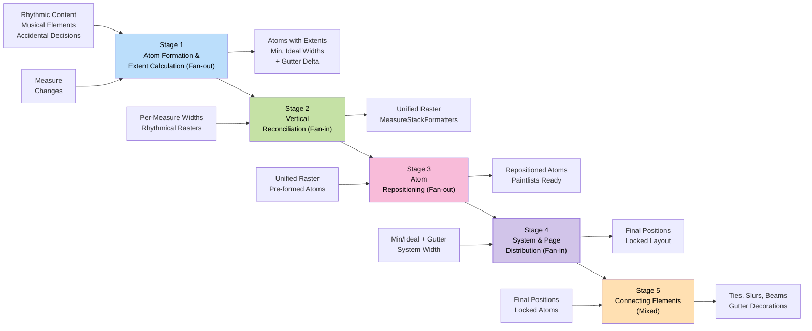
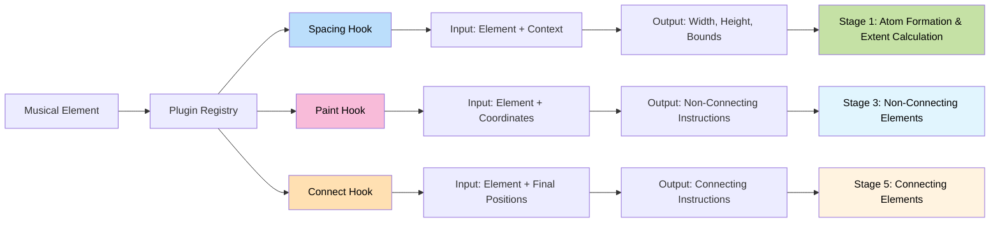
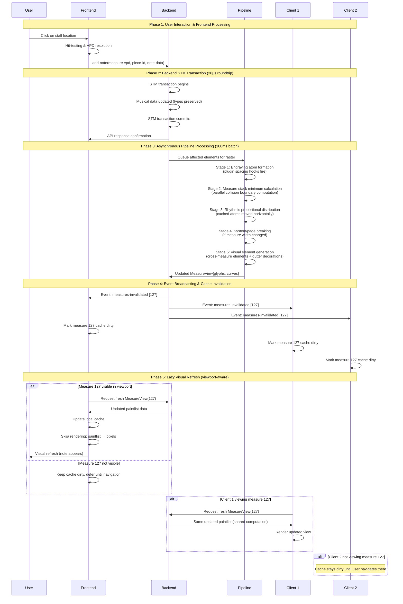

# ADR-0028: Hierarchical Rendering Pipeline with Plugin-Based Formatters

**Status**: Accepted  
**Date**: 2024-09-14  
**Updated**: 2026-01-05

## Context

Musical notation software faces computational challenges when handling large orchestral scores containing hundreds of thousands of individual musical elements. The fundamental problem involves coordinating distinct concerns: musical logic resolution, spatial arrangement calculations, and visual rendering - each with different computational characteristics and parallelisation opportunities.

**Real-World Scalability Challenge**: Traditional notation software famously struggles with large complex scores such as Strauss's Elektra recognition scene - dense orchestral passages with intricate notation that cause performance degradation, memory exhaustion, and unresponsive editing. These scenarios expose the limitations of eager computation approaches that attempt to process entire scores regardless of user viewport or editing context.

**Architectural Purpose**: This specification addresses the scalability limitations of existing notation software when processing large orchestral scores. The 5-stage hierarchical rendering pipeline with plugin integration provides the foundation for handling complex notation efficiently across multiple CPU cores.

**Scalability Approach**: The fan-out/fan-in architecture enables parallel processing during computationally intensive stages, providing linear scaling characteristics with available CPU cores for both simple and complex musical scores.

The challenge lies in providing a unified architecture that handles both fundamental notation formatting (chord layouts, articulation placement, beam positioning) and contemporary notational extensions without architectural distinction or performance compromise.

Ooloi requires an architecture that maintains responsive editing performance with the most demanding symphonic works whilst implementing all notation formatting through a unified plugin system where canonical plugins handle standard notation alongside custom extensions.

### Architectural Foundation: Frontend-Backend Separation

Ooloi's [frontend-backend separation](0001-Frontend-Backend-Separation.md) provides multiple architectural advantages that directly inform the rendering pipeline design:

**Separation of Concerns**: Frontend remains pure UI/rendering while backend handles musical logic and computation, preventing architectural conflation and maintaining clean cognitive boundaries.

**Collaboration as Consequence**: Standalone applications operate as "collaboration groups of 1" - the same architectural patterns scale naturally to multi-user scenarios without special collaborative features.

**Performance Without Compromise**: In-process gRPC transport eliminates 99% of network overhead (36μs roundtrip measured on 2017 MacBook Pro), proving separation costs nothing performance-wise whilst enabling optimal lazy evaluation patterns.

**Type Fidelity Preservation**: Clojure defrecord instances (`Tuplet`, `Pitch`, etc.) maintain identical structure across gRPC boundaries, eliminating serialization impedance mismatch and enabling plugins to operate identically in local or distributed modes.

## Decision

Ooloi implements a **five-stage hierarchical rendering pipeline** with comprehensive plugin integration and intelligent client-server coordination:

## Table of Contents

- [Context](#context)
  - [Architectural Foundation: Frontend-Backend Separation](#architectural-foundation-frontend-backend-separation)
- [Decision](#decision)
- [Five-Stage Pipeline Architecture](#five-stage-pipeline-architecture)
  - [Stage 1: Atom Formation and Extent Calculation (Fan-Out)](#pipeline-stage-1-atom-formation-and-extent-calculation-fan-out)
  - [Stage 2: Vertical Reconciliation (Fan-In)](#pipeline-stage-2-vertical-reconciliation-fan-in)
  - [Stage 3: Atom Repositioning (Fan-Out)](#pipeline-stage-3-atom-repositioning-fan-out)
  - [Stage 4: System and Page Distribution (Fan-In)](#pipeline-stage-4-system-and-page-distribution-fan-in)
  - [Stage 5: Connecting Elements Generation (Mixed Parallelization)](#pipeline-stage-5-connecting-elements-generation-mixed-parallelization)
- [Protecting the Closed Semantic Model](#protecting-the-closed-semantic-model)
  - [User-Controllable System-Start Behavior](#user-controllable-system-start-behavior)
- [Atom-Relative Geometry Invariant](#atom-relative-geometry-invariant)
- [Plugin Integration Architecture](#plugin-integration-architecture)
  - [Spacing Hooks](#spacing-hooks)
  - [Paint Hooks](#paint-hooks)
- [Client-Server Coordination](#client-server-coordination)
  - [Lazy Rendering Strategy](#lazy-rendering-strategy)
  - [Hierarchical Invalidation](#hierarchical-invalidation)
- [Claypoole Integration Architecture](#claypoole-integration-architecture)
  - [Threadpool Lifecycle Contract](#threadpool-lifecycle-contract)
  - [Cancellation Contract](#cancellation-contract)
- [Caching and Incremental Processing](#caching-and-incremental-processing)
- [Benefits](#benefits)
- [Trade-offs](#trade-offs)
- [Alternatives Considered](#alternatives-considered)
- [References](#references)

## Five-Stage Pipeline Architecture



### Pipeline Stage 1: Atom Formation and Extent Calculation (Fan-Out)
Individual measures calculate both minimum and ideal spacing for their rhythmic content in parallel:
- **Fan out**: Each measure in the stack processes independently with no cross-measure dependencies
- **Proportional values**: Applies absolute spacing values from Gould/Ross (quarter note: 3.5 staff-spaces, half note: 5.0, eighth: 2.5, etc.)
- **Engraving Atom Formation**: Each rhythmic position forms a complete spatial unit - noteheads, stems, accidentals, articulations positioned relative to each other as an indivisible "engraving atom"
- **Atom-Relative Coordinates**: All glyph positions within an atom are relative to the atom's origin point (see [Atom-Relative Geometry Invariant](#atom-relative-geometry-invariant)). This fundamental property enables atoms to be repositioned without any internal recomputation.
- **Four-Directional Extents**: Each atom calculates its full extent in all directions from its center:
  - Left extent (negative horizontal): how far left the atom extends
  - Right extent (positive horizontal): how far right the atom extends
  - Up extent (positive vertical): how far up the atom extends
  - Down extent (negative vertical): how far down the atom extends
- **Spacing Bounds Determination**:
  - **Ideal spacing**: The absolute proportional value for this rhythmic position (3.5, 5.0, etc.)
  - **Minimum spacing**: Where adjacent atom extents just touch without overlap
- **Gutter Width Calculation**: Each measure computes additional space needed when appearing first on a system:
  - **`gutter_width`**: Width delta for graphical decorations at system start (default 0N)
  - This is *additional* space beyond the measure's semantic content
  - Computed from tied-to notes that received bypass treatment per [ADR-0035](0035-Remembered-Alterations.md)
  - The gutter accommodates courtesy accidentals as non-semantic graphical decorations
- **Natural Accidental Handling**: Accidentals increase an atom's left extent, automatically affecting minimum spacing to the previous atom
- **Collision Guarantee**: As long as atoms are not positioned closer than their combined extents, collisions mathematically cannot occur
- **Plugin Hook Integration**: Spacing hooks fire for each notational element, contributing spatial requirements to atom formation
- **Atom Dimension Caching**: Once calculated for a rhythmic configuration, engraving atoms remain **immutable** until measure content changes, enabling efficient repositioning without recomputation

#### The Gutter: System-Start Width Delta

When a measure appears first on a system, it may require additional space for graphical decorations that are not part of the measure's semantic content. This additional space is the **gutter**.

**What the gutter accommodates:**
- Courtesy accidentals for tied-to notes at position 0 (graphical decorations, not semantic accidentals)
- Tie continuation arcs (the visible portion of ties broken at system boundaries)

**Critical architectural property:** The gutter width is computed in Stage 1 from complete information. Stage 4 knows exactly how much additional space each measure requires *before* making any distribution decisions. This enables mathematically optimal distribution without heuristics or iteration.

**What is NOT in the gutter:** All semantic accidentals are already computed and positioned within atoms by ADR-0035. The gutter contains only graphical decorations added for visual clarity at system boundaries.

**User control over courtesy accidentals:**

Because Ooloi has complete information before distribution, users can control courtesy accidental behavior without causing layout instability:

```clojure
;; User setting controlling when courtesy accidentals appear
:courtesy-accidentals-at-breaks :system  ;; :system | :page | :none
```

| Setting | Behavior |
|---------|----------|
| `:system` | Show courtesy accidentals at all system breaks (default) |
| `:page` | Show courtesy accidentals only at page breaks |
| `:none` | Never show courtesy accidentals at breaks |

This setting affects Stage 5 rendering decisions, not Stage 4 distribution. The gutter space is always reserved based on the most permissive setting that might apply; Stage 5 simply chooses whether to render decorations into that space.

**Architectural capability:** The complete-information architecture makes user-controllable courtesy accidental settings straightforward to implement. This control requires deterministic distribution to work without manual adjustment or layout jitter. Traditional architectures that lack complete information at distribution time cannot offer such settings without risking non-deterministic behavior or requiring iterative correction.

### Pipeline Stage 2: Vertical Reconciliation (Fan-In)
Reconciles per-measure calculations across the vertical stack to ensure rhythmic synchronization:
- **Fan in**: Collects minimum, ideal, and gutter widths from all measures in the stack (Stage 1 outputs)
- **Width propagation**: All three width components (min, ideal, gutter) are propagated through reconciliation
- **Rhythmical raster integration**: Uses all rhythmical rasters generated for each measure in the stack, many cached from previous computations
- **Vertical synchronization**: Reconciles differences when measures have different rhythmic content, producing unified vertical alignment
- **Result raster creation**: Generates positioning data with synchronized rhythmic positions across the measure stack
- **MeasureStackFormatter storage**: Stores minimum, ideal, AND gutter widths for this measure stack
- **Rational rhythmic positions**: Creates raster with rational positions (including tuplets like 1/3, 2/3)
- **Solution space establishment**: Defines boundaries between physical feasibility (minimum) and musical intent (ideal), with gutter as additional fixed delta
- **Distribution**: Makes unified Result Raster available to measures for Stage 3 processing

### Pipeline Stage 3: Atom Repositioning (Fan-Out)
Parallel phase where measures reposition their pre-formed atoms to common vertical alignments:
- **Fan out**: Each measure processes independently with no cross-measure dependencies
- **Result Raster application**: Each measure receives the unified Result Raster with synchronized vertical positions from Stage 2
- **Pure horizontal repositioning**: Pre-formed engraving atoms from Stage 1 are moved horizontally to align with common vertical points - no recomputation of atom geometry or extents
- **Non-connecting elements only**: Handles notes, accidentals, articulations, dynamics - NOT ties, slurs, glissandos, hairpins
- **Paint list preparation**: Measures prepare paintlists for everything that does NOT connect atoms
- **Cross-staff synchronization**: All measures in stack achieve consistent rhythmic alignment using the same vertical raster
- **Parallel execution**: All measures process simultaneously - no interdependencies once raster is available

### Pipeline Stage 4: System and Page Distribution (Fan-In)
Global optimization that distributes measures across systems and pages:
- **Fan in**: Requires global view of all measures to make system-breaking and page-breaking decisions
- **Complete information**: Stage 4 receives exact widths for every measure *and* exact gutter deltas - no guessing, no heuristics
- **Gutter subtraction**: For each candidate system, the first stack's `gutter_width` is subtracted from available width before scaling:
  ```
  available_for_scaling = system_width - gutter[s]
  ```
- **Scale factor computation**: `scale_factor = available_for_scaling / Σ ideal_i`
- **Width allocation**: All measures scale identically:
  ```
  actual[i] = ideal[i] × scale_factor
  ```
- **System breaking**: Groups measures into horizontal systems based on optimized widths
- **Page breaking**: Arranges systems vertically within page boundaries, adding/removing pages as needed
- **Position finalization**: Determines final absolute x,y coordinates for all measures
- **Hierarchical cascade detection**: Automatically determines when system changes require page recalculation
- **Final layout lock**: Once this stage completes, all positions are locked - no further movement occurs

**Objective Function Selection**: Four fundamentally different objective functions are possible for Stage 4:

1. **Smooth global minimization** distributes surplus evenly across all columns. Produces stable spacing but suppresses visual hierarchy.

2. **Minimax optimization** protects the worst-looking region but produces uneven results.

3. **Duration-weighted distribution** allocates surplus in proportion to perceptual weight. Longer values act as anchors; shorter values compress first.

4. **Regime-based switching** changes behavior under extreme compression.

**Ooloi uses duration-weighted distribution (#3).** This preserves visual hierarchy under compression and extends traditional engraving logic.

### Pipeline Stage 5: Connecting Elements Generation (Mixed Parallelization)
With final positioning established, generate elements that connect atoms:
- **Dependency on final positions**: Can only execute after Stage 4 provides final absolute measure positions
- **Mixed parallelization**: Typically one task per page or system that changed, with coordination for cross-boundary elements
- **Connecting elements**: Generates ties, slurs, glissandos, hairpins, beams - everything that connects musical atoms across their final positions
- **System-start decorations**: For measures at system start positions, adds graphical decorations within the gutter space:
  - Courtesy accidentals for tied-to notes (non-semantic visual aids)
  - Tie continuation arcs
- **Cross-boundary handling**: Coordinates connections across measure, system, and page boundaries
- **Timewalker coordination**: Uses timewalker for cross-measure element coordination when elements span measures
- **Absolute positioning**: Uses finalized coordinates to determine exact start/end points for connecting elements
- **Spanner adjustments**: Any final adjustments needed for optimal spanner appearance given locked atom positions

**Critical Dependencies**: This stage requires complete layout finalization because connecting elements need to know exact atom positions that only exist after discomfort optimization completes.

**Gutter decoration rendering**: The courtesy accidentals added in Stage 5 are graphical decorations, not semantic accidentals. They provide visual clarity at system boundaries but do not affect the underlying musical model. The space for them was pre-computed in Stage 1 and reserved in Stage 4.

## Protecting the Closed Semantic Model

A fundamental architectural principle of Ooloi is that **rendering may never affect the semantic meaning of the internal model**. Once [ADR-0035](0035-Remembered-Alterations.md) computes accidental decisions, those decisions are final. The semantic model is closed.

### The Problem This Solves

Traditional notation software suffers from feedback loops between layout and semantics:

1. Compute layout
2. Discover system breaks
3. "We need courtesy accidentals here" - modify accidental decisions
4. Squash spacing to fit them
5. Maybe that changes system breaks
6. Iterate until "good enough" or give up

This approach has fundamental problems:
- **Non-deterministic**: Different runs may produce different results
- **Heuristic-driven**: "Good enough" is not optimal
- **Jitter-prone**: Small edits can cause cascading layout changes
- **Performance-limited**: Iteration caps are necessary to prevent infinite loops

### How the Pipeline Protects the Model

The five-stage pipeline eliminates feedback through **complete information**:

1. **Stage 1** computes exact measure content + exact gutter delta
2. **Stage 4** has *complete knowledge* of both scenarios (mid-system and system-start) for every measure
3. **Stage 4** computes *mathematically optimal* distribution - not heuristic, not iterative
4. **Stage 5** adds graphical decorations based on actual positions

The gutter width is not "we might need space" - it's "this is exactly how much space the graphical decoration requires." Stage 4 doesn't guess. It has full information to make the globally optimal decision in one pass.

### Semantic vs Graphical Content

The distinction is critical:

**Semantic content** (determined by ADR-0035, immutable after Stage 1):
- Accidentals required by alteration rules
- Accidentals required by remembered alterations
- Accidentals explicitly requested (French ties)
- Bypass decisions for tied-to notes

**Graphical decorations** (added by Stage 5 based on layout):
- Courtesy accidentals at system start for bypassed tied-to notes
- Tie continuation arcs
- Visual aids that don't affect musical meaning

The semantic model remains closed. Stage 5 only adds visual decoration.

### Why This Matters

With complete information and no feedback:
- **Deterministic**: Same input always produces same output
- **Optimal**: Not "good enough" but mathematically best
- **Stable**: No jitter from iteration or heuristics
- **Fast**: One pass through the pipeline, no convergence loops

### User-Controllable System-Start Behavior

Because gutter width is computed with complete information in Stage 1, users can control system-start courtesy accidental behavior through settings:

```clojure
:system-break-cautionary-accidentals
  :none   ;; Never show courtesy accidentals at system breaks
  :page   ;; Show only at page breaks (first system of each page)
  :system ;; Show at all system breaks
```

This setting affects Stage 1's gutter computation. When set to `:none`, tied-to notes contribute zero gutter width. When set to `:page` or `:system`, the gutter includes space for courtesy accidentals as appropriate.

Changing this setting triggers Stage 1 recomputation of affected measures' gutter values, then Stage 4 recomputes optimal distribution with the new values. No iteration, no manual adjustment. The user changes a preference; the system produces the mathematically optimal layout for that preference.

**Architectural enablement:** This level of control is possible only because the architecture provides complete information before distribution decisions. Without knowing gutter requirements upfront, traditional systems must either guess and require manual correction, iterate until convergence, or defer the feature entirely. The gutter model makes user-controllable settings straightforward: different settings produce different gutter values, Stage 4 optimizes accordingly, deterministically.

## Atom-Relative Geometry Invariant

**Fundamental Property**: All glyph positions within an atom are expressed relative to the atom's origin point, never as absolute coordinates. This invariant is foundational to the pipeline's efficiency.

**Atom contents (all relative to origin):**
- Notehead positions
- Accidental positions
- Stem geometry
- Articulation positions
- Flag/beam attachment points
- Collision boundaries
- Attachment points for connecting elements

**Architectural consequences:**

1. **Translation without recomputation**: Moving an atom horizontally or vertically requires only updating its origin coordinate. No internal geometry recalculation occurs.

2. **Trivial cache invalidation**: Stage 1 reruns only when measure content changes. Layout changes (system width, page height, style spacing adjustments) never trigger Stage 1 recomputation.

3. **Rendering becomes pure projection**: At paintlist generation time, atoms are translated to their final positions. No structural decisions remain - only coordinate transformation.

| Change Type | Stage 1 | Stage 2-3 | Stage 4 | Stage 5 |
|-------------|---------|-----------|---------|---------|
| Edit measure M | Recompute M only | Reconcile M's stack | May redistribute | Reconnect affected spans |
| System width change | Nothing | Nothing | Redistribute | Reconnect + gutter decorations |
| Page height change | Nothing | Nothing | Redistribute | Reconnect + gutter decorations |
| Style change (spacing) | Nothing | Reconcile | Redistribute | Reconnect + gutter decorations |
| Add/remove instrument | Recompute affected | Reconcile all | Redistribute | Reconnect |

**Invariant enforcement**: Atoms are immutable data structures. Once Stage 1 produces an atom, its internal geometry cannot be modified. Stage 3 and Stage 5 consume atoms; they do not mutate them.

### Plugin Architecture Integration

Every notational element participates through a unified plugin interface with **flexible multi-stage participation**:



#### Spacing Hook (Stage 1)
Plugins declare the spatial requirements of their elements:
- **Input**: Musical element data and contextual information
- **Output**: Width requirements, indicative height, and collision boundaries
- **Participation**: All plugins must implement (may return null for purely connecting elements)

#### Paint Hook (Stage 3)
Plugins generate visual rendering instructions for non-connecting elements:
- **Input**: Musical element data with raster positioning coordinates
- **Output**: Rendering instructions for elements that don't connect atoms
- **Participation**: Optional - only for elements with non-connecting visual components

#### Connect Hook (Stage 5)
Plugins generate connecting elements using finalized positions:
- **Input**: Musical element data with absolute final atom positions
- **Output**: Rendering instructions for elements that connect atoms (ties, slurs, beams, etc.)
- **Participation**: Optional - only for elements that connect across atoms

**Plugin Flexibility Examples**:
```clojure
;; Simple plugin - non-connecting only
(defrecord ArticulationPlugin []
  (spacing-hook [_ art ctx] (calculate-bounds art ctx))
  (paint-hook [_ art coords] (render-glyph art coords))
  (connect-hook [_ _ _] nil))

;; Connecting-only plugin
(defrecord TiePlugin []
  (spacing-hook [_ tie ctx] (calculate-clearance tie ctx))
  (paint-hook [_ _ _] nil)
  (connect-hook [_ tie positions] (generate-tie-curve tie positions)))

;; Hybrid plugin - both stages
(defrecord BeamPlugin []
  (spacing-hook [_ beam ctx] (calculate-spacing beam ctx))
  (paint-hook [_ beam coords] (render-stems beam coords))
  (connect-hook [_ beam positions] (generate-beam-line beam positions)))
```

**Registry-Based Discovery**: The plugin registry maintains mappings between musical elements and their formatters, enabling runtime composition and replacement of notational elements with flexible stage participation.

### Cross-Tree Caching Architecture: Layout Integration

The MeasureStackFormatter provides vertical coordination across all staves at each measure position. This architecture is implemented through the Layout model's `stack-formatters` vector, where each formatter manages the vertical alignment and spacing of one measure position across every staff in the score.

#### Layout Model Integration

```clojure
(defrecord Layout [page-views stack-formatters])

;; stack-formatters is a vector of MeasureStackFormatter records
;; indexed by measure position: [formatter-measure-1, formatter-measure-2, ...]
;; Each formatter coordinates the vertical stack of simultaneous measures
```

**Vertical Coordination Architecture:**

- **Stack Definition**: Each "stack" is the vertical collection of measures at the same time position across all staves (measure 1 on violin + measure 1 on viola + measure 1 on cello + etc.)

- **One Formatter Per Stack**: `stack-formatters[17]` manages measure 17 across ALL staves - ensuring consistent rhythmic spacing and width optimization for that vertical slice of the score

- **Simultaneous Content**: All measures in a stack contain simultaneous musical content that must be vertically aligned and rhythmically coordinated

**Example - String Quartet Measure 5:**
```
Violin I:    [measure 5 content]  ←
Violin II:   [measure 5 content]  ← stack-formatters[5] coordinates
Viola:       [measure 5 content]  ← all of these vertically
Cello:       [measure 5 content]  ←
```

- **Internal-Only Scope**: The stack-formatters vector is intentionally excluded from the public API - it serves purely as an internal optimization mechanism for the rendering pipeline.

**Caching Strategy:**

- Measure minimum/ideal/gutter width measurements are cached and only recomputed when measure content changes
- Result rasters are cached and reused until invalidated
- MeasureStackFormatter data persists across optimization iterations in Stage 4

#### Cross-Tree Consistency Guarantees

**Timewalker Coordination**: All measures within a stack are processed with identical rhythmic raster data, ensuring perfect cross-staff alignment even when measures exist in different visual tree branches.

**STM Transaction Safety**: Width updates and cache invalidation occur within STM transactions, maintaining consistency across the entire layout during concurrent access.

This architecture enables the pipeline to achieve both tree structure benefits (encapsulation, modularity) and cross-tree optimization benefits (efficient constraint solving, temporal coordination) simultaneously.

## User Interaction Flow



This sequence illustrates the complete system flow when a user adds a note, demonstrating the pipeline's lazy evaluation characteristics, asynchronous batching, collaborative event distribution, and viewport-aware client responses.

## Computational Scaling Characteristics

Independent measure analysis can run in parallel during Stage 1. System chunks can also be parallelised during Stage 3 processing. Pipeline stages naturally separate concerns, enabling different parallelisation strategies for each computational phase.

**Engraving Atom Efficiency**: The atom-relative geometry invariant provides optimal caching granularity:
- Adding notes to existing rhythmic positions → atom recalculation + positioning
- Changing note spacing → positioning only (atoms unchanged)
- Adding accidentals → atom recalculation + positioning
- Changing time signatures → positioning only (atoms unchanged)
- Changing system/page layout → positioning only (atoms unchanged) + gutter decorations
- All width/height/spacing style changes → positioning only (atoms unchanged)

Memory access patterns prove favourable as each processing unit operates on distinct memory regions during parallel operations, minimising cache conflicts and false sharing between processors.

The 100-millisecond **asynchronous** batching interval amplifies computational efficiency by amortising processing costs across multiple edits, accumulating changes and processing them in optimally-sized batches. Crucially, mutating API calls return immediately without waiting for batch processing.

## Claypoole Integration Architecture

**Claypoole** provides bounded parallelism with explicit resource control for CPU-intensive layout calculations.

**Why Claypoole:** Built-in `pmap` has unpredictable performance (lazy evaluation, uncontrolled threading). Claypoole provides explicit threadpool management with deterministic lifecycle.

**Primitive choice: cp/pmap**
- Preserves input order (required for measure sequences and cross-measure elements)
- Alternatives rejected: `cp/upmap` loses ordering, `cp/pfor`/`cp/future` require manual coordination

### Threadpool Lifecycle Contract

```clojure
(defmethod ig/init-key ::renderer [_ {:keys [cpu-cores]}]
  (let [cores (or cpu-cores (.availableProcessors (Runtime/getRuntime)))]
    {:cpu-pool (cp/threadpool cores)
     :priority-pool (cp/priority-threadpool cores)  ; For visible measures
     :metrics (atom {})}))

(defmethod ig/halt-key! ::renderer [_ renderer]
  (when-let [cpu (:cpu-pool renderer)]
    (cp/shutdown cpu))
  (when-let [prio (:priority-pool renderer)]
    (cp/shutdown prio)))
```

Threadpools require explicit shutdown (daemon threads prevent JVM exit). Integrant manages lifecycle deterministically.

### Cancellation Contract

Only one formatting operation runs at a time. Cancellation uses global operation tracking:

```clojure
;; Global formatting coordination
(defonce ^:private current-formatting-operation (atom nil))

(def ^:dynamic *current-operation* nil)

(defn cancelled? []
  "Check if current parallel task should abort"
  (not= *current-operation* @current-formatting-operation))

(defmacro with-cancellation [& body]
  "Execute body with cancellation checking"
  `(if (cancelled?) ::cancelled (do ~@body)))
```

Stage 4 uses duration-weighted distribution to determine final layout. Each measure stack provides minimum, ideal, and gutter widths (from Stages 1-2). Stage 4 subtracts gutter for system-start stacks, allocates surplus in proportion to perceptual weight—longer values act as anchors; shorter values compress first—and distributes measures across systems and pages.

## Caching and Incremental Processing

Pipeline results are cached until local edits change them. The atom-relative geometry invariant ensures that Stage 1 (the most expensive computation) runs only when measure content changes - never for layout adjustments.

Invalidation works hierarchically: musical events trigger measure recalculation, which may trigger system recalculation, which may trigger page recalculation.


**Stage 1 Caching**: Spatial analysis results persist until any element affecting measure content changes. Measures that remain completely unchanged never require recalculation. Layout changes (system width, page dimensions, spacing styles) do not invalidate Stage 1 results because atom geometry is relative to origin.

**Conditional Processing**: Later pipeline stages process only measures that underwent earlier stage recalculation. Unchanged measures retain their cached results unless positioning changes affect their coordinates.

**Cache Granularity**: Invalidation operates at measure-level precision, ensuring that unrelated changes don't trigger unnecessary recalculations across the composition.

### Client-Server Event Coordination

#### Batched Reformatting
The backend accumulates formatting requests and processes them at regular intervals, providing perceived real-time response whilst avoiding computational waste on rapid input sequences. The batching interval (e.g., 100ms) is a tunable policy parameter, not an architectural invariant.

#### Hierarchical Invalidation Events
Clients receive optimised invalidation notifications that respect the visual hierarchy. Deduplication logic eliminates redundant updates - if an entire page requires recalculation, individual measure invalidations within that page are automatically eliminated.

#### Lazy Visual Realisation
Clients implement demand-driven rendering data fetching. Open layouts immediately request updated rendering instructions, whilst closed layouts mark invalidated elements for cleanup and fetch data only when subsequently opened.

**Collaborative Data Sharing**: Multiple clients requesting identical updated data receive shared computation results without triggering redundant backend processing, as all clients typically fetch identical MeasureView paintlists.

## Rationale

### Positive Aspects

1. **Scalability Architecture**: The five-stage pipeline addresses computational scalability challenges in notation software through structured parallel processing and efficient resource utilization.

2. **Parallel Processing**: Fan-out/fan-in architecture enables near-linear performance scaling with available CPU cores through independent measure processing and coordinated integration points.

3. **Unified Plugin System**: All notation formatting operates through the same plugin interface, eliminating architectural distinctions between basic and extended notation elements.

4. **Complex Score Handling**: The dependency boundaries and connecting element architecture manage the computational complexity of dense orchestral notation through proper stage separation.

5. **Multi-Core Utilization**: The architecture leverages modern multi-core hardware through parallelizable stages and efficient coordination mechanisms.

6. **Incremental Processing**: Comprehensive caching with hierarchical invalidation provides performance improvements for typical editing scenarios while maintaining scalability for complex scores.

7. **Transparent Distribution**: Type fidelity across gRPC boundaries eliminates serialization impedance, enabling plugins and musical logic to operate identically in local or distributed modes.

8. **Efficient Spatial Computation**: The atom-relative geometry invariant ensures Stage 1 runs only for content changes. Layout adjustments (system breaking, page breaking, spacing changes) never trigger atom recomputation - only repositioning.

9. **Layout-Independent Atoms**: Atoms are self-contained geometric units. All internal coordinates are relative to origin, enabling translation without recomputation.

10. **Closed Semantic Model**: Rendering cannot affect musical semantics. Complete information enables optimal distribution without feedback loops or heuristics.

11. **Mathematically Optimal Distribution**: Stage 4 has complete knowledge (measure widths + gutter deltas) enabling globally optimal system breaking in one pass.

## Trade-offs

This architecture breaks the circular dependencies that collapse traditional notation software (spanners ↔ spacing ↔ system breaking ↔ measure widths) by establishing strict dependency order. The trade-offs are inherent to that solution:

**Complexity concentration in Stage 4**: All global optimization decisions (system breaking, page distribution, duration-weighted distribution) concentrate in a single stage. This is intentional but requires sophisticated algorithms.

**Strict dependency ordering**: Spanners cannot influence spacing. System breaking cannot feed back to atom formation. This constraint is the architecture's strength, but it means certain edge cases must be resolved within stage boundaries rather than through iteration.

**Gutter width accounting**: Stage 1 computes `gutter_width` for every measure, even though only system-start measures will use it. This is minimal overhead (typically only tied-to notes at position 0) but represents computation that may not be used.

**Cancellation semantics required**: Responsive editing under long-running calculations demands cooperative cancellation throughout the pipeline. This is additional coordination surface that must remain disciplined.

**Plugin surface area**: All formatting logic must implement spacing/paint/connect hooks. This architectural uniformity is powerful but mandatory—there is no privileged code path for "simple" elements.

**Increased invalidation surface**: Hierarchical caching requires precise invalidation logic across stage boundaries. The benefit is incremental performance; the cost is architectural discipline.

These are not accidental costs. They are the necessary consequences of solving the fundamental problem: deterministic, parallelizable notation layout without circular dependencies.

## Alternatives Considered

### Alternative 1: Hardcoded Core Notation Elements
**Approach**: Implement fundamental notation formatting (chord layouts, articulation placement, beam positioning) directly in core system with plugin architecture only for extensions.
**Rejection Reasons**:
- Creates artificial architectural distinction between fundamental and extended formatting logic
- Prevents unified optimization and caching strategies across all notation elements
- Violates architectural uniformity principle where all formatting logic follows identical patterns
- Complicates maintenance by requiring separate code paths for equivalent functionality
- Limits ability to customize or replace fundamental formatting behaviors when needed

### Alternative 2: Second-Pass Modification for System-Start Elements
**Approach**: Run accidental algorithm once, then add a second pass after Stage 4 to insert semantic accidentals at system breaks.
**Rejection Reasons**:
- Introduces feedback from layout to semantic decisions
- Violates closed semantic model principle
- Creates potential for non-deterministic results
- Would require "squashing" existing content to fit additional accidentals
- Heuristic-driven rather than optimal

### Alternative 3: Dual Computation (Two Complete Measure Layouts)
**Approach**: Compute each measure twice - once for mid-system positioning, once for system-start positioning.
**Rejection Reasons**:
- Doubles Stage 1 computation for every measure
- Wasteful when only a small delta (gutter) differs between scenarios
- The gutter model captures exactly the difference needed without full recomputation
- Memory overhead from storing two complete layouts per measure

### Alternative 4: Post-Hoc Spacing Adjustment
**Approach**: After discovering system breaks, compress existing spacing to accommodate courtesy accidentals.
**Rejection Reasons**:
- Would work in 99% of cases but breaks the optimality guarantee
- Introduces feedback loop: adjustment might change system breaks
- Requires iteration or "good enough" heuristics
- Non-deterministic results possible
- The gutter model achieves the same visual result with complete information upfront

## References

### Related ADRs
- [ADR-0000: Clojure](0000-Clojure.md) - Language providing parallel processing capabilities essential for pipeline stages
- [ADR-0001: Frontend-Backend Separation](0001-Frontend-Backend-Separation.md) - Architectural foundation enabling clean separation with transparent distribution
- [ADR-0002: gRPC Communication](0002-gRPC.md) - Communication protocol supporting efficient invalidation event transmission with type fidelity
- [ADR-0003: Plugins](0003-Plugins.md) - Plugin architecture foundation extended by mandatory two-stage compliance
- [ADR-0004: STM for Concurrency](0004-STM-for-concurrency.md) - Concurrency model supporting coordinated multi-stage updates
- [ADR-0005: JavaFX and Skija](0005-JavaFX-and-Skija.md) - Client rendering technology consuming generated rendering instructions
- [ADR-0006: SMuFL](0006-SMuFL.md) - Standardised music font providing glyph metadata for spatial calculations
- [ADR-0008: VPDs](0008-VPDs.md) - Vector Path Descriptors enabling hierarchical element addressing in invalidation events
- [ADR-0022: Lazy Frontend-Backend Architecture](0022-Lazy-Frontend-Backend-Architecture.md) - Event-driven client synchronization patterns underlying the rendering pipeline
- [ADR-0031: Frontend Event-Driven Architecture](0031-Frontend-Event-Driven-Architecture.md) - Frontend event routing consuming paintlists generated by this rendering pipeline
- [ADR-0035: Remembered Alterations](0035-Remembered-Alterations.md) - Accidental decision algorithm; semantic model that is closed before rendering
- [ADR-0037: Measure Distribution Optimization](0037-Measure-Distribution-Optimization.md) - Stage 4 algorithm consuming gutter_width values

### Technical Dependencies
- **Claypoole**: Threadpool-based parallel processing library providing controlled CPU-intensive task execution
- **Clojure STM**: Transaction system coordinating multi-stage updates
- **gRPC Streaming**: Bi-directional communication for real-time invalidation events
- **SMuFL Font Metadata**: Glyph dimension data essential for spatial requirement calculations
- **JavaFX Canvas**: Client rendering surface for visual element realisation
- **Skija Graphics**: High-performance graphics rendering for complex musical elements

### Performance Characteristics
- **Batching Interval**: 100ms asynchronous processing provides optimal balance between responsiveness and computational efficiency
- **API Responsiveness**: 36μs roundtrip measured on 2017 MacBook Pro proves gRPC separation adds negligible latency
- **Memory Efficiency**: Lazy rendering data generation reduces memory footprint for large scores
- **Parallel Scaling**: Linear performance improvement with available CPU cores during formatting stages
- **Engraving Atom Efficiency**: Atom-relative geometry ensures Stage 1 recomputation only for content changes, never for layout changes

## Notes

This architectural decision establishes Ooloi's rendering pipeline as a scalable system capable of handling professional-scale musical compositions through unified plugin-based formatting for all notation elements.

The mandatory plugin compliance ensures that fundamental notation formatting (chords, articulations, beams) and custom extensions operate through identical architectural patterns, providing a foundation for comprehensive musical expression without artificial distinctions between "core" and "extended" functionality.

The five-stage approach recognises that atom formation with extent calculation, vertical reconciliation, atom repositioning, system/page distribution, and connecting element generation represent distinct computational problems that benefit from separation and targeted optimisation, with all formatting logic implemented through canonical and custom plugins as first-class citizens.

The atom-relative geometry invariant ensures that the expensive Stage 1 computation runs only when musical content changes. Layout adjustments - however dramatic - require only repositioning of pre-computed atoms, enabling responsive editing even during extensive reformatting operations.

The gutter model ensures that system-start decorations (courtesy accidentals, tie continuations) are accommodated with complete information, enabling mathematically optimal distribution without feedback loops, heuristics, or iteration. The semantic model remains closed after ADR-0035; Stage 5 adds only graphical decorations that do not affect musical meaning.