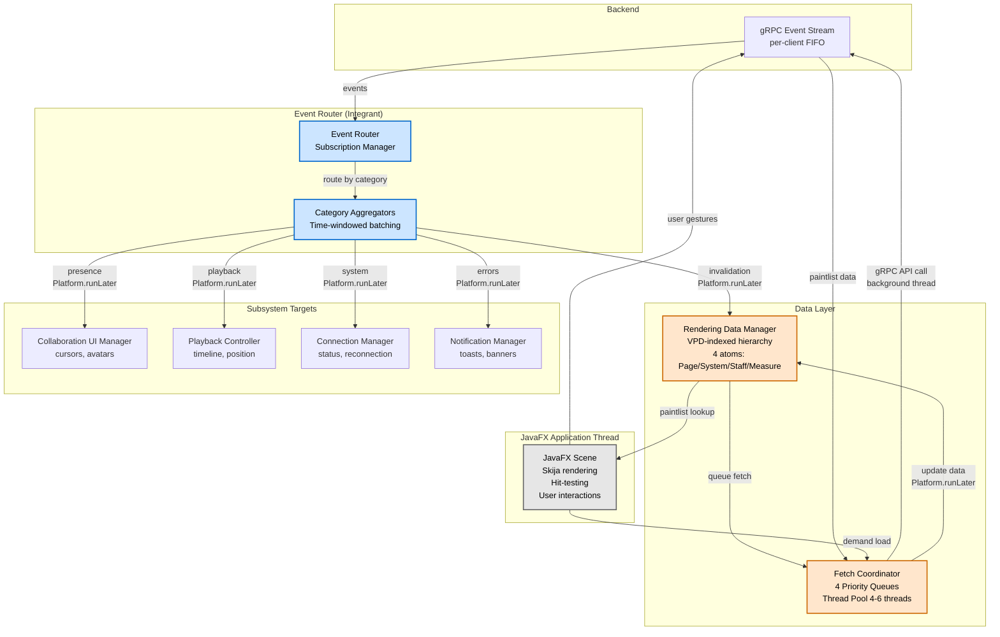
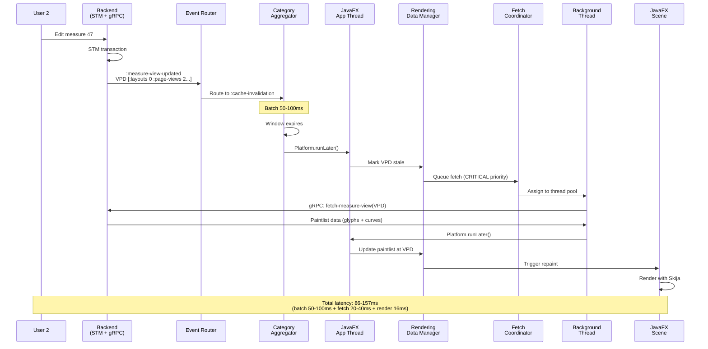
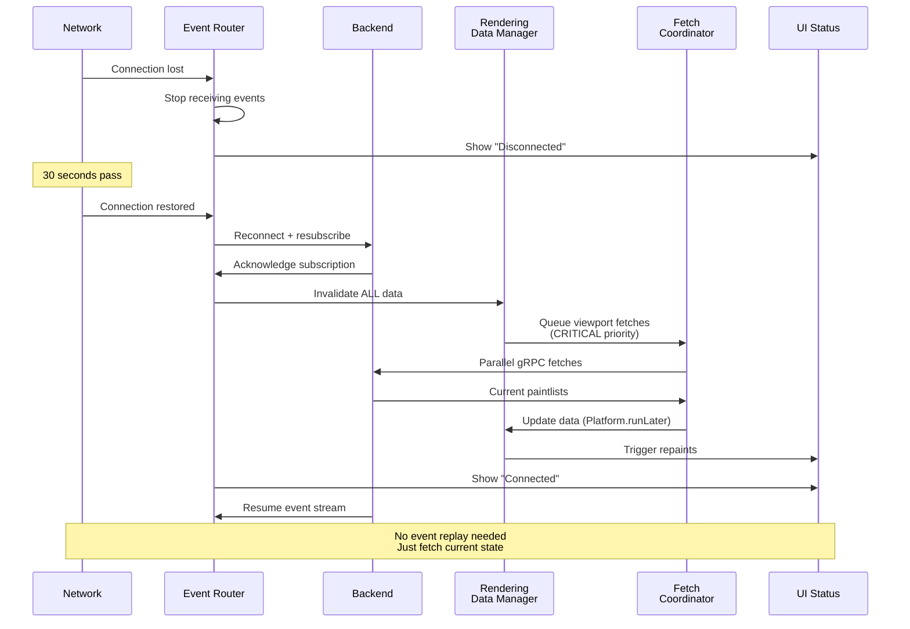
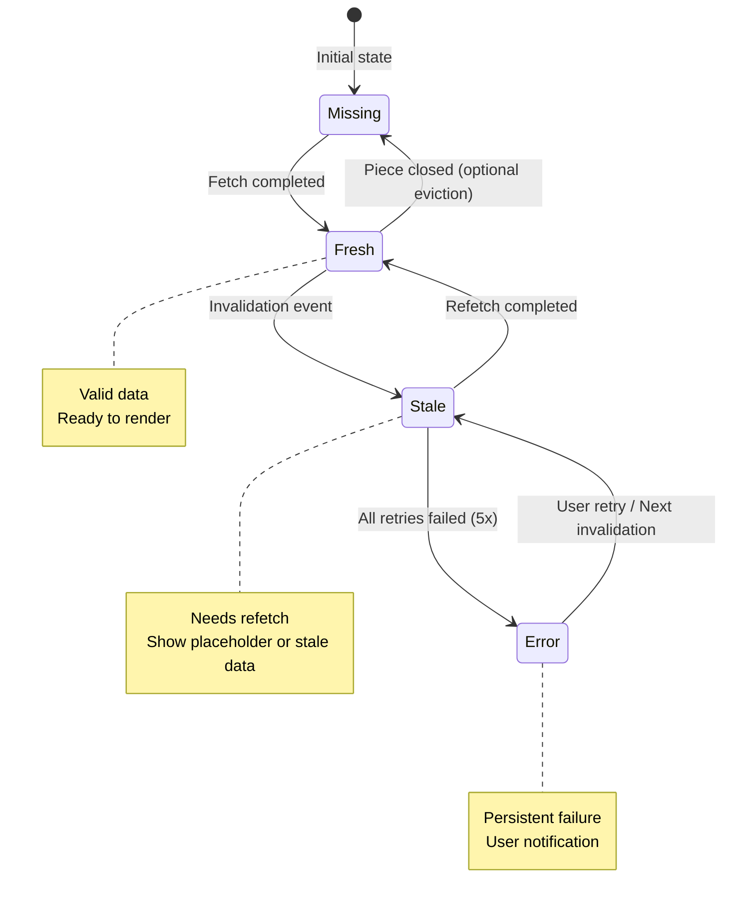
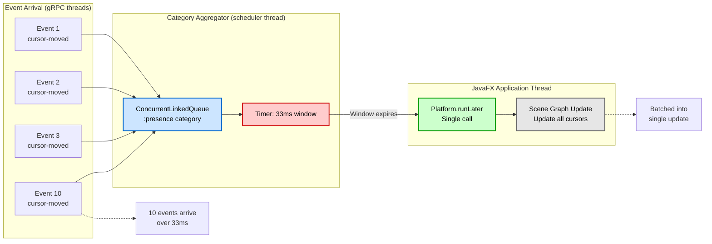

# ADR-0031: Frontend Event-Driven Architecture

**Status:** ACCEPTED
**Date:** 2025-10-15

---

## Table of Contents

- [Context](#context)
  - [Frontend-Local Events](#frontend-local-events)
  - [Backend Events (via gRPC)](#backend-events-via-grpc)
- [Decision](#decision)
  - [Why This Decision](#why-this-decision)
  - [Alternatives Considered](#alternatives-considered)
- [Consequences](#consequences)
  - [Core Pattern](#core-pattern)
  - [Component Architecture](#component-architecture)
  - [Visual Architecture](#visual-architecture)
  - [Event Envelope Structure](#event-envelope-structure)
  - [Event Type Taxonomy and Category Derivation](#event-type-taxonomy-and-category-derivation)
  - [Event Categories and Routing](#event-categories-and-routing)
  - [Event Flow Examples](#event-flow-examples)
  - [Key Architectural Properties](#key-architectural-properties)
  - [Connection Management](#connection-management)
  - [Subscription Lifecycle](#subscription-lifecycle)
  - [Performance Considerations](#performance-considerations)
  - [Frontend State Model (ADR-0022 Architecture)](#frontend-state-model-adr-0022-architecture)
  - [Tradeoffs and Limitations](#tradeoffs-and-limitations)
- [Implementation Questions](#implementation-questions)
  - [Resolved](#resolved)
  - [Outstanding](#outstanding)
- [Related ADRs](#related-adrs)
- [References](#references)

---

## Context

The frontend must handle two fundamentally different event sources with incompatible timing and failure characteristics:

### Frontend-Local Events
- **Origin:** JavaFX event system, UI interactions, application state changes
- **Timing:** Synchronous, immediate, deterministic
- **Scope:** Local to the frontend process
- **Examples:** Mouse clicks, keyboard input, canvas repaints, window focus, drag operations, timer events
- **Error mode:** Local exceptions, handled immediately

### Backend Events (via gRPC)
- **Origin:** Server event streams over network
- **Timing:** Asynchronous, network-delayed, per-connection FIFO (ADR-0024)
- **Scope:** Distributed across all connected clients
- **Examples:** Piece modifications, collaborative edits, layout invalidations, presence updates, system notifications
- **Error mode:** Network failures, disconnections, reconnection

**Problem:** These event sources have irreconcilable differences. Synchronous UI events require immediate processing without blocking. Asynchronous network events require batching, backpressure, and failure isolation. A unified event system would compromise both.

**Research Context:**

**Figma's LiveGraph** demonstrated that invalidation-based caching works well without database overload - most query results never change after initial load. Stateless invalidators aware of topology deliver targeted invalidations. Figma's multiplayer uses client/server architecture with WebSocket communication, server-side ordering, and 33ms client update batching.

**JavaFX Concurrency Model:** Scene graph is not thread-safe and accessible only from JavaFX Application Thread. Background threads use Platform.runLater() to schedule updates, typically processed within 0.1ms. Long-running tasks must execute on background threads to maintain UI responsiveness.

---

## Decision

**Separate Event Systems with Event Router:** Backend events handled by dedicated Event Router component; local events remain in JavaFX event system.

### Why This Decision

**Performance Isolation:** Network I/O and backend event processing cannot block JavaFX Application Thread under any circumstances. A unified event bus would risk slow network operations delaying UI responsiveness. Separate systems provide hard isolation - backend event failures, latency spikes, or processing delays never propagate to local UI events.

**Respect for Timing Characteristics:** JavaFX events are synchronous, immediate, and deterministic. Backend events are asynchronous, network-delayed, and distributed. These are fundamentally different event models that should not be conflated. JavaFX's native event infrastructure is optimized for local interactions (mouse clicks, repaints, timers) and forcing it to handle large-scale pub/sub over the network fights its design assumptions.

**Clear Failure Boundaries:** gRPC stream failures, reconnection logic, and backpressure handling are protocol concerns that belong in a dedicated component, not mixed into JavaFX event handling. When the network fails, the Event Router handles it; the UI continues processing local events normally.

**Architectural Alignment:** ADR-0024 already provides per-client FIFO event delivery via backend drainer threads. The Event Router simply receives ordered events and routes them - no complex synchronization needed. ADR-0022 specifies invalidation-based data synchronization with pull-based fetching, which requires protocol adaptation (events → invalidations → fetches) rather than event translation. Backend computes all layout via ADR-0028 - all clients must see those results.

**Natural Priorities:** JavaFX gives UI events (clicks, drags) immediate processing. Backend events naturally queue behind UI work via Platform.runLater(). System events can preempt by posting immediately. This priority scheme emerges naturally from separate systems; a unified bus would require explicit priority queues.

### Alternatives Considered

**Unified Event Bus (Rejected):** Single pub/sub component handling all events regardless of source would provide simpler mental model and natural event chaining, but conflates synchronous UI events with asynchronous network events. Unacceptable performance risk - slow async processing blocking fast local events. Loss of JavaFX event system optimizations that assume local, deterministic event sources. Backend failures would propagate to local event processing.

**Backend→JavaFX Translation (Rejected):** Transforming server events into JavaFX platform events would let frontend code treat all events uniformly, but JavaFX event system is not designed for large-scale distributed pub/sub. Async network characteristics remain despite local injection. Would require fighting JavaFX assumptions about event origins (scene graph thread, local dispatch) and lose natural backpressure handling that gRPC streaming provides.

---

## Consequences

### Core Pattern

Backend events are notifications of staleness, not data carriers. When rendering data is invalid, client fetches current rendering data (PageView, SystemView, StaffView, or MeasureView depending on VPD granularity) via normal gRPC API calls (ADR-0018 generated methods). This implements the architecture specified in ADR-0022.

**Key Properties:**
- Category aggregation: One Platform.runLater() per event category batch
- Pull-based fetching: Client requests rendering data at appropriate hierarchy level when needed
- Simple reconnection: Just invalidate stale data and refetch
- Precise batching: Invalidations 50-100ms, cursors 33ms, playback ≤16ms

**What This Architecture Does NOT Include:**
- Event sequence numbers (unnecessary - ADR-0024 per-client queues guarantee FIFO delivery)
- Event replay on reconnection (client just fetches current state)
- Complex sync barriers or catchup protocols
- Out-of-order handling (events arrive in exact STM transaction order via per-client drainer threads)
- Duplicate detection beyond connection boundaries (each connection is fresh)

### Component Architecture

The Event Router acts as a protocol adapter that transforms server events into frontend subsystem operations. It's not an event bus - it's a synchronization protocol.

#### 1. Backend Event Router (Integrant Component)
- Subscribes to gRPC event streams via backend API (subscribe-to-piece-events, unsubscribe-from-piece-events)
- Routes events to appropriate subsystems based on event category
- Category aggregators: Batch events per category, one Platform.runLater() per flush
- Manages lifecycle with Integrant
- Subscription management: Exposes subscribe/unsubscribe API to Windowing System, proxies to backend
- On disconnect: Stops receiving events
- On reconnect: Resumes receiving events, no special protocol needed

#### 2. Rendering Data Manager
- Maintains VPD-indexed hierarchy mirroring backend visual structure:
  - Layout → PageViews → SystemViews → StaffViews → MeasureViews
- Stores paintlists at each level (independent, not nested):
  - PageViews: Headers, footers, page numbers
  - SystemViews: System-level elements, interconnecting elements (slurs/beams spanning measures)
  - StaffViews: Staff-level elements
  - MeasureViews: Glyphs (note heads, accidentals, rests) and curves (slurs, beams, ties)
- Each paintlist includes its VPD - all glyphs/curves within that paintlist belong to that VPD (no per-element annotation needed)
- Paintlists support both semantic elements (font glyphs, computed musical curves) and user-edited graphics (arbitrary bezier paths with control points, detached from musical semantics)
- Paintlists include spatial information: bounding boxes for glyphs, paths for curves (enables hit-testing)
- Tracks staleness at each hierarchy level (implementation may use explicit flags, sentinel values like nil, or data presence/absence)
- Paintlists converted to JavaFX/Skija-efficient representations for rendering
- Handles lookup via VPD, invalidation at any hierarchy level
- Not an Integrant component - data structure with operations
- Complete piece rendering data stored locally - no eviction
- Structure specified in ADR-0022

#### 3. Fetch Coordinator
- Prioritizes and batches refetch requests for any visual hierarchy level
- Uses normal gRPC API calls (ADR-0018 generated methods) to fetch rendering data
- Fetch granularity determined by event VPD (PageView, SystemView, StaffView, or MeasureView)
- Four priority queues:
  - Critical: Viewport + stale (visible invalidations - user sees wrong data)
  - High: Viewport + missing (visible demand loads - placeholders showing)
  - Normal: Prefetch (scrolling toward, buffered viewport)
  - Low: Background (opportunistic)
- When fetch completes, posts Platform.runLater() to update local rendering data and trigger repaint
- Fetching is pull-based: Client requests specific hierarchy level when needed
- Backend returns complete paintlist data for requested level
- Fixed thread pool (4-6 threads) services queues, CRITICAL drains before others

#### 4. Subsystem Targets
Components that receive routed events:
- Rendering Data Manager: Invalidation events
- Collaboration UI Manager: Presence, cursors, selections
- Playback Controller: Playback position, start/stop
- Connection Manager: System events, reconnection
- Notification Manager: User-facing messages, errors

#### 5. JavaFX Scene
- Render pass checks data staleness at hierarchy elements (detects whether paintlist is current or needs refetch)
- Standard JavaFX event handlers for user input (clicks, drags, keyboard)
- Hit-testing: Spatial queries on visible paintlists (bounding box intersection for glyphs, path proximity for curves) return paintlist VPDs. Uses timewalk (ADR-0014) to resolve VPDs to musical elements. Enables all graphical interactions: selection, editing, dragging, deletion.
- Skija rendering from local paintlist data (glyphs and curves)
- No knowledge of backend event routing
- Pattern specified in ADR-0022

### Visual Architecture

#### Component Architecture Diagram



#### Sequence Diagram: Collaborative Edit Flow



#### Sequence Diagram: Reconnection Flow



#### State Diagram: Paintlist Lifecycle



#### Category Aggregation Flow



### Event Envelope Structure

Backend events arrive with the following structure (per ADR-0018):

```clojure
{:type :piece-invalidation        ; Required keyword, validated by backend
 :timestamp 1729800000000000000   ; Required nanosecond timestamp (auto-added)
 :piece-id "symphony-123"         ; Required for piece-* events (validated)
 :vpd [:layouts 0 :page-views 2 :system-views 1 :staff-views 0 :measure-views 47]
 :message "Human readable text"   ; Optional string
 :client-id "client-uuid"         ; Optional string
 ...additional-fields...}
```

**Backend Validation Guarantees** (per ADR-0018 `validate-event-structure`):

Events received by frontend are **pre-validated** and guaranteed to have:
- `:type` field exists and is a keyword
- `:type` matches pattern: `server-*`, `client-*`, `piece-*`, `collaboration-*`, or contains `/`
- `:timestamp` field exists and is a number (nanoseconds, added by `send-*-event`)
- `:piece-id` field exists and is a string (for piece-* and collaboration-* events)
- All field names are keywords (kebab-case)
- `:message` is a string if present
- `:client-id` is a string if present

**Frontend Event Router does NOT need to re-validate** - backend guarantees correctness.

### Event Type Taxonomy and Category Derivation

The Event Router derives routing categories from backend event types. This mapping is deterministic and based on the `:type` field prefix.

#### Backend Event Types → Frontend Categories

**Cache Invalidation** (`:cache-invalidation` category):
```clojure
:piece-invalidation  ; Visual hierarchy invalidation at any level
```

**Required fields**: `:piece-id` (string), `:timestamp` (number)
**Scope fields** (one of): `:vpd` (single VPD vector), `:vpds` (multiple VPD vectors), `:measures` (measure numbers)
**VPD depth indicates level**: `[:layouts 0]` = layout, `[:layouts 0 :page-views 2]` = page, etc.

---

**Presence/Collaboration** (`:presence` category):
```clojure
:collaboration-user-joined
:collaboration-user-left
:collaboration-cursor-moved
:collaboration-selection-changed
```

**Required fields**: `:piece-id` (string), `:timestamp` (number)
**Context fields**: `:vpd` (for cursor position), `:vpds` (for selections), `:user-id`, `:user-name`

---

**Playback** (`:playback` category):
```clojure
:piece-playback-position
:piece-playback-started
:piece-playback-stopped
```

**Required fields**: `:piece-id` (string), `:timestamp` (number)
**Context fields**: `:vpd` (current playback position), `:tempo`, `:time-signature`

---

**System** (`:system` category):
```clojure
:server-maintenance
:server-shutdown
:server-status
:server-client-connected
:server-client-disconnected
```

**Required fields**: `:type` (keyword), `:timestamp` (number)
**Context fields**: `:message` (human-readable), `:client-count`, `:affected-services`

---

**Notification** (`:notification` category):
```clojure
:piece-validation-error
:piece-operation-failed
:server-warning
:server-info
:client-registration-confirmed
```

**Required fields**: `:type` (keyword), `:timestamp` (number)
**Context fields**: `:message` (human-readable), `:severity`, `:piece-id` (if piece-related)

---

#### Category Derivation Logic

```clojure
(defn derive-category
  "Derives routing category from validated backend event type.
   Frontend can trust event structure - backend validation guarantees correctness."
  [event]
  (case (:type event)
    ;; Cache invalidation
    :piece-invalidation :cache-invalidation

    ;; Presence/Collaboration
    (:collaboration-user-joined
     :collaboration-user-left
     :collaboration-cursor-moved
     :collaboration-selection-changed) :presence

    ;; Playback
    (:piece-playback-position
     :piece-playback-started
     :piece-playback-stopped) :playback

    ;; System
    (:server-maintenance
     :server-shutdown
     :server-status
     :server-client-connected
     :server-client-disconnected) :system

    ;; Everything else defaults to notification
    :notification))
```

#### Scope Extraction for Invalidation Events

```clojure
(defn extract-invalidation-scope
  "Extracts VPDs from various scope field formats.
   Returns vector of VPD vectors for uniform processing."
  [event]
  (cond
    ;; Single VPD
    (:vpd event)
    [(:vpd event)]

    ;; Multiple VPDs
    (:vpds event)
    (:vpds event)

    ;; Measure numbers (expand to VPDs using piece context)
    (:measures event)
    (map #(measure-number->vpd (:piece-id event) %) (:measures event))

    ;; Layout-level invalidation
    (:layout-id event)
    [[:layouts (layout-id->index (:layout-id event))]]

    ;; No scope specified (shouldn't happen with valid events)
    :else []))
```

### Event Categories and Routing

#### 1. Cache Invalidation Events

**Event Type:** `:piece-invalidation`

**Route to:** Rendering Data Manager → Fetch Coordinator

**Batching:** 50-100ms time windows to coalesce rapid updates

**Processing:**

Event arrives → VPD lookup in rendering data → Mark element at that VPD level as stale → Add to batch aggregator → After 50-100ms window: flush batch → Single Platform.runLater() for all invalidations → Fetch Coordinator: prioritize by viewport → Background thread: gRPC fetch for paintlist at VPD level → Platform.runLater() updates local rendering data → Trigger repaint with fresh paintlist

#### 2. Presence/Collaboration Events

**Event Types:** `:collaboration-user-joined`, `:collaboration-user-left`, `:collaboration-cursor-moved`, `:collaboration-selection-changed`

**Route to:** Collaboration UI Manager

**Batching:** 33ms windows (30fps) for cursor movements, join/leave immediate

**Processing:**

Event arrives → Add to category aggregator → After 33ms window: flush batch → Single Platform.runLater() for all presence updates → Update avatar positions → Update collaborative cursors → Update selection highlights

#### 3. Playback Events

**Event Types:** `:piece-playback-position`, `:piece-playback-started`, `:piece-playback-stopped`

**Route to:** Playback UI Controller

**Batching:** ≤16ms windows (60fps) for position, start/stop immediate

**Processing:**

Event arrives → Add to category aggregator → After ≤16ms window: flush batch → Single Platform.runLater() for all playback updates → Update timeline cursor → Highlight active measures → Update playback controls

#### 4. System Events

**Event Types:** `:server-maintenance`, `:server-shutdown`, `:server-status`, `:server-client-connected`, `:server-client-disconnected`

**Route to:** Connection Manager + Notification Manager

**Batching:** None - immediate processing

**Processing:**

Event arrives → Update connection state immediately → Single Platform.runLater() → Show system notification → May trigger reconnection logic

#### 5. Error/Notification Events

**Event Types:** `:piece-validation-error`, `:piece-operation-failed`, `:server-warning`, `:server-info`, `:client-registration-confirmed`

**Route to:** Notification Manager

**Batching:** None - immediate user feedback

**Processing:**

Event arrives → Single Platform.runLater() → Format message (i18n) → Show toast/banner/status bar → Auto-dismiss or sticky based on severity

### Event Flow Examples

#### Example 1: Collaborative Edit (Measure-Level Change)

1. Another user edits measure 47
2. Backend broadcasts `:piece-invalidation` event with `:piece-id` "symphony-123", `:vpd` [:layouts 0 :page-views 2 :staff-views 0 :measure-views 47]
3. Event Router receives via gRPC stream
4. Derives category `:cache-invalidation` from event type
5. Routes to category aggregator for :cache-invalidation
5. Aggregator batches for 50-100ms
6. Window expires → flush batch
7. Single Platform.runLater() with all invalidations
8. Rendering Data Manager marks MeasureView at VPD as stale
9. Fetch Coordinator receives batch, checks viewport
10. Measure 47 is visible → CRITICAL priority fetch (stale data visible to user)
11. Background thread makes gRPC API call for MeasureView paintlist at that VPD
12. Fetch completes → Platform.runLater()
13. Updates local rendering data with fresh paintlist containing glyphs and curves
14. Invalidates canvas region
15. JavaFX repaint event renders with new data via Skija

**Latency:** ~86-157ms (batch 50-100ms + fetch 20-40ms + render 16ms)

#### Example 2: User Scrolls Viewport (Demand Loading)

1. User scrolls (native JavaFX scroll event on JAT)
2. Viewport Manager updates visible region
3. Checks rendering data for newly-visible hierarchy elements
4. Finds MeasureViews 50-55 not loaded (stale or missing)
5. Fetch Coordinator queues HIGH priority requests for those MeasureView paintlists (visible placeholders)
6. Renders placeholders while fetching
7. Background threads make gRPC API calls for each MeasureView paintlist
8. Fetches complete → Platform.runLater()
9. Updates local rendering data with glyphs and curves, triggers repaint
10. Real content replaces placeholders

**Note:** No backend events involved - pure frontend demand loading

#### Example 3: Reconnection After Network Failure

1. Network drops, Event Router detects
2. Stops receiving events
3. Rendering data remains as-is
4. UI shows "Disconnected" status
5. Network restored after 30 seconds
6. Event Router reconnects, resubscribes to pieces
7. Resumes receiving invalidation events
8. Invalidate all rendering data on reconnect
9. Fetch Coordinator queues CRITICAL priority for viewport elements (stale data visible)
10. Background threads make gRPC API calls for current paintlists
11. Fetches complete → Platform.runLater()
12. Updates local rendering data with fresh paintlists, triggers repaint
13. UI shows "Connected" status
14. Normal event flow resumes

**Result:** Simple reconnection - invalidate everything, refetch viewport

### Key Architectural Properties

**Performance Isolation:** Network I/O never blocks JavaFX Application Thread. Invalidation is cheap (atomic flag swap). Fetch happens asynchronously in background threads via normal gRPC API calls. JavaFX only touched from JAT via Platform.runLater().

**Category Aggregation Pattern:** One Platform.runLater() per category batch, not per event. Multiple events in same category coalesce into single JAT pass. Dramatically reduces scene graph update overhead. Example: 10 cursor movements → 1 scene graph update.

**Pull-Based Data Model:** Events are notifications of staleness, not data carriers. Actual paintlist data comes from fetch requests (normal gRPC API calls). Client requests what it needs, when it needs it. No complex synchronization protocol required. **Lazy fetching at layout window level:** Opening a piece subscribes to events but downloads no graphical data. Only when a layout window opens does the frontend fetch paintlists for that layout's viewport. Events may mark paintlists stale at various hierarchy levels, but fetching remains lazy - triggered by viewport visibility or explicit user navigation.

**Guaranteed Event Ordering:** ADR-0024 per-client drainer threads ensure FIFO delivery. Events arrive in exact STM transaction order. Each client has dedicated queue with strict ordering. gRPC streaming provides reliable, ordered transport. No sequence numbers or ordering logic needed in Event Router.

**Natural Priorities:** UI events process immediately (JavaFX native priority). Backend events queue behind UI work. Fetch priorities: Critical (viewport stale) > High (viewport missing) > Normal (prefetch) > Low (background). System events preempt via immediate Platform.runLater().

**Precise Batching Timings:** Invalidations: 50-100ms (balances latency vs throughput). Cursors: 33ms (30fps, smooth without overwhelming UI). Playback: ≤16ms (60fps for fluid playback cursor). System/Errors: Immediate (no batching).

**Automatic Coalescence:** Time-windowed batching in Event Router. Category-specific batching strategies. Viewport-aware fetch batching. Reduces event storms from rapid edits.

**Parallelism Control:** Different pieces can fetch in parallel. Same piece fetches can run concurrently (reads are idempotent; last fetch wins). gRPC streaming naturally handles backpressure. Fetch Coordinator manages thread pool.

**Simple Reconnection:** No event replay, no sync barriers, no sequence tracking. On reconnect: invalidate stale data, fetch what's needed. Normal fetch mechanism handles reconnection transparently. Connection-oriented streams - each connection is fresh.

**Clear Failure Boundaries:** gRPC failures contained in Event Router. Paintlist fetches can fail independently (retry logic in Fetch Coordinator). UI remains responsive during network issues. Reconnection is just "resume receiving events + refetch stale data".

**Phase Separation:** Event Architecture: Routes events to subsystems. (Windowing System): Implements notification UI, collaboration UI, etc. Event Router doesn't know about toasts, banners, or window layout. Clean separation of concerns.

**Vector Graphics Editing:** The architecture must support Illustrator-level manipulation of graphical elements. Any semantic element (glyphs, curves) can be converted to pure graphics with editable bezier paths and control points. Paintlists support both computed semantic elements (font glyphs, musical curves) and user-edited graphics (arbitrary bezier paths detached from musical semantics). Conversion flow: User converts element → backend resolves glyph/curve to paths → creates graphic element → stores as user data → recomputes paintlist → invalidation event → frontend refetches paintlist with editable graphic. Subsequent edits (drag control points, adjust curves, add/remove points) send commands to backend → stored → invalidation → refetch → render. This enables professional-grade graphic design capabilities within the event-driven architecture. Examples: Convert clef glyph to paths and distort, convert slur to graphic and reshape arbitrarily, add custom vector art overlays.

**Bidirectional VPD Mapping:** The architecture supports user interaction via bidirectional mapping between screen rendering and VPDs. Forward direction (VPD → screen): Lookup VPD in hierarchy atoms → retrieve paintlist → render glyphs/curves at computed positions. Reverse direction (screen → VPD): User clicks/selects/drags at (x, y) → spatial query on visible paintlists → return paintlist VPD(s) → timewalk (ADR-0014) resolves to musical elements. Each paintlist includes its VPD and spatial information (glyph bounds, curve paths). All elements in a paintlist belong to that paintlist's VPD. Multiple VPDs may be returned for overlapping elements (e.g., measure glyph under system slur). This enables all graphical interactions: clicks, drags, drops, selections, deletions - users interact with what they see, system maps to underlying structure.

**Concrete Interaction Examples:**

*Note: Specific key bindings (Alt+click, Ctrl+click, etc.) are illustrative only. The architecture supports rich context-sensitive interactions; actual bindings are UI design decisions outside ADR scope.*

- **Click slur to select:** Hit-test at (x, y) → SystemView paintlist VPD → timewalk to Slur element → frontend highlights, shows selection handles
- **Double-click slur to edit:** Same hit-test → detect double-click → enter edit mode → request control points from backend (if not in paintlist) → display control point handles
- **Modifier+click slur to modify:** Hit-test → detect modifier → identify control point near click or add new point → send command to backend → backend recomputes → invalidation event → refetch → render updated slur
- **Convert element to graphic:** Hit-test → user triggers conversion action → send convert-to-graphic command → backend detaches from musical semantics → invalidation → refetch → render as pure graphic
- **Drag note head:** Hit-test during mouse-down → MeasureView VPD → timewalk to Note → track drag delta → send pitch/position change to backend → backend recomputes layout → cascading invalidations (measure, staff, possibly system/page) → refetch affected paintlists → render with new positions
- **Rectangle selection:** Accumulate all paintlist VPDs whose bounds intersect selection rectangle → timewalk each to musical elements → multi-select
- **Convert clef to editable graphic:** User action on clef → convert-to-graphic command → backend resolves font glyph to bezier paths → creates graphic element → paintlist updated → refetch → render with editable control points → user drags point to distort shape → command to backend → stored → invalidation → refetch → render distorted clef
- **Reshape converted graphic:** Click converted graphic → enter edit mode → display bezier control points → drag point/handle → send path update to backend → stored → invalidation → refetch → render updated shape

The architecture's paintlist spatial data + VPD mapping enables these rich, context-sensitive interactions. Backend computes all layout changes; frontend's role is mapping user gestures to commands and rendering backend-computed results.

### Connection Management

**Normal Operation:** Client connects → Subscribes to piece event streams → Receives invalidation events → Marks rendering data entries invalid → Fetches what's needed via gRPC API calls → Updates local data, renders

**Disconnection:** Connection lost → Event Router detects → Stops receiving events → Rendering data remains as-is → UI shows connection status

**Reconnection:** Connection restored → Event Router resubscribes to pieces → Resumes receiving invalidation events → Invalidate all rendering data on reconnect → Fetch Coordinator queues HIGH priority for viewport → Normal fetch mechanism requests fresh paintlists

**Key insight:** Clients don't need to "catch up" on missed events. They just fetch current state when they need it.

### Subscription Lifecycle

**Opening a Piece:**
1. User opens piece (File → Open, or connects to existing piece)
2. Windowing System  calls Event Router: subscribe-to-piece(piece-id)
3. Event Router calls backend API: subscribe-to-piece-events(piece-id)
4. Backend acknowledges subscription, starts streaming events for that piece
5. **No paintlist data downloaded yet** - piece subscription only enables event reception

**Opening a Layout Window:**
1. User opens layout window (within an already-opened piece)
2. UI component begins loading viewport (triggers initial fetches via Fetch Coordinator)
3. Fetch Coordinator queues HIGH priority requests for visible paintlists
4. Background threads fetch paintlists at appropriate hierarchy levels (Page/System/Staff/Measure)
5. Paintlists arrive → Platform.runLater() → Rendering Data Manager → trigger repaint

**Closing a Piece:**
1. User closes piece window
2. Windowing System calls Event Router: unsubscribe-from-piece(piece-id)
3. Event Router calls backend API: unsubscribe-from-piece-events(piece-id)
4. Backend stops streaming events for that piece to this client
5. Cache Manager may evict cached data for that piece (or retain for quick reopen)

**Combined App Scenario:**
- User creates new piece or opens local file
- Backend piece manager already has it (same process)
- Subscription still happens through Event Router for consistency
- No network involved but protocol is identical

### Performance Considerations

**Target Latencies:**

- **In-viewport collaborative edit:** ≤150ms p95 from event receipt to painted frame
  - Batch window: 50-100ms
  - Fetch (if needed): 20-40ms  
  - Platform.runLater() + render: <20ms

- **Scroll-triggered fetch:** ≤100ms p95 from scroll to painted frame
  - No batching (immediate)
  - Fetch: 20-40ms
  - Platform.runLater() + render: <20ms
  - Placeholders shown during fetch

- **Cursor updates:** 33ms batching → 30fps collaborative cursor movement

- **Playback position:** ≤16ms batching → 60fps playback cursor

**Monitoring Points:**

*Event Router:*
- Events received per second (per category)
- Batch flush intervals (actual vs target)
- Category aggregator queue depths

*Fetch Coordinator:*
- Fetch queue depths (per priority)
- Fetch latency percentiles (p50, p95, p99)
- Hit rate (already loaded vs needs fetch)
- Concurrent fetch count

*Rendering Data Manager:*
- Total data size (memory usage)
- Invalidation rate
- Fetch-triggered invalidations vs event-triggered

**Reconnection Performance:** Simple approach (invalidate all on reconnect):
- Reconnect time: <1s (exponential backoff)
- Viewport refetch: 20-40ms per hierarchy element
- Full viewport load: 200-400ms (10 measures)
- User sees placeholders → content appears quickly

### Frontend State Model (ADR-0022 Architecture)

**What Frontend Stores:**

*Local Piece Rendering Data (complete, persistent):*
- Frontend hierarchy mirrors backend visual hierarchy:
  - Backend: Layout → PageView → SystemView → StaffView → MeasureView
  - Frontend: Same structure with staleness tracking at each level
- Paintlists at each hierarchy level (independent, not nested):
  - PageViews: Headers, footers, page numbers
  - SystemViews: System-level elements, interconnecting elements (slurs/beams spanning measures)
  - StaffViews: Staff-level elements
  - MeasureViews: Glyphs (note heads, accidentals, rests, dynamics with bounds) and curves (slurs, beams, ties, hairpins as Bézier curves)
- Paintlist contents: Each paintlist includes its VPD, spatial information (bounding boxes for glyphs, paths for curves), and rendering data. Supports both semantic elements (computed from musical data, linked to notation semantics) and user-edited graphics (arbitrary bezier paths with control points, detached from musical semantics - enables Illustrator-level editing). All elements within a paintlist belong to that paintlist's VPD. This enables bidirectional mapping: VPD → rendering (forward) and screen coordinates → VPD (reverse via hit-testing).
- Staleness tracking: Each hierarchy element tracks whether its paintlist data is current or stale. Implementation may use explicit validity flags, sentinel values (nil), or data presence/absence - the architecture requires only that staleness is detectable during rendering.
- Backend-computed via ADR-0028 rendering pipeline
- Paintlists converted to JavaFX/Skija-efficient representations
- Addressed via VPD (same system as musical hierarchy)
- Event VPD determines which paintlist to invalidate/fetch
- Complete piece data stored locally - no eviction policy needed

*UI State:*
- Window positions, sizes
- Tool palettes, selections
- Zoom levels, scroll positions
- Collaboration UI (cursors, avatars)

*Connection State:*
- gRPC connection status
- Subscribed pieces
- Event stream health

**What Frontend Does NOT Store:**
- Full piece musical semantics (backend is authoritative via STM)
- Musical logic or calculations (backend computes all glyph shapes and curve paths)
- User preferences (managed by frontend, but separate concern from rendering data)

**Data Loading Strategies (Policy Decisions):**

The architecture supports multiple strategies:
- Lazy: Load only when scrolled to
- Prefetch: Load viewport + N pages ahead/behind
- Eager: Load entire piece on open (small pieces)
- Progressive: Viewport immediate, rest in background
- Collaborative-aware: Prefetch around other users' positions

Event Router is agnostic to loading policy.

**Steady-State Behavior (Efficiency Over Time):**

The system naturally converges to high efficiency through gradual accumulation:
- **Complete paintlist coverage**: Over time, frontend builds complete piece representation with all paintlists fetched and stored locally
- **Perfect cache stability**: Paintlists remain valid indefinitely unless piece changes - 100% of paintlists stay fresh between edits
- **Zero fetch on reopen**: Once fully loaded, reopening a layout window requires no network fetches (all data already local)
- **Targeted refreshes only**: When piece changes, only affected VPD hierarchy levels marked stale and refetched
- **No download onslaught**: Opening a piece triggers no downloads; opening a layout triggers only viewport fetches
- **Minimal network traffic**: After initial viewport load, network activity limited to sparse invalidation events and targeted refetches

This creates a **write-once, read-many** pattern where paintlist data is fetched lazily as needed, cached permanently, and only refreshed when explicitly invalidated by piece modifications. Between edits, the cache is perfectly stable - no spontaneous invalidations, no cache thrashing, no unnecessary refetches. The architecture optimizes for the common case: viewing existing notation requires zero network activity after initial load.

**Source of Truth:** The backend piece (via STM) is always authoritative and contains complete graphical information down to every line, dot, and glyph. Backend rendering pipeline (ADR-0028) precomputes all paintlists - the frontend never computes layout. Frontend simply downloads what it needs through **idempotent reads** via normal gRPC API calls (ADR-0018 generated methods), **lazily** fetching only visible viewport paintlists as required. Same fetch request always returns identical paintlist data unless piece changed. This functional purity enables perfect cache stability and eliminates cache coherence complexity.

### Tradeoffs and Limitations

**Complexity:** Two event models require bridge/adapter code (Event Router). Developers must understand which events flow through which system. Testing requires two strategies - JavaFX event simulation for local events, mock gRPC streams for backend events.

**Coordination:** Cross-system coordination (invalidating rendering data after backend event) requires explicit routing through Event Router to Rendering Data Manager, rather than implicit event chaining in a unified bus.

**Benefits Realized:**
- Backend event batching (50-100ms windows) never delays local UI responsiveness
- Category-specific aggregation reduces Platform.runLater() calls from 60+/sec to ~30/sec
- gRPC streaming failures contained - UI shows "disconnected" but remains interactive
- All clients see backend-computed layout results consistently

---

## Implementation Questions

### Resolved

1. **Architecture Pattern:** Separate Event Systems with Event Router (Option 2)
2. **Event Envelope:** piece-id, server-ts-ns, vpd, category, data (no source-client-id needed)
3. **Batching Timings:** Invalidations 50-100ms, cursors 33ms, playback ≤16ms, system immediate
4. **Category Aggregation:** One Platform.runLater() per category batch, not per event
5. **Data Model:** Pull-based - events notify staleness, fetches are normal gRPC API calls
6. **Reconnection:** No replay, no sequence numbers - just invalidate and refetch
7. **Connection Model:** Connection-oriented - each gRPC stream connection is fresh
8. **Echo Suppression:** Not used - all clients must see backend-computed layout results
9. **VPD Granularity:** Fetch at exact level specified by event VPD. Paintlists are independent at each hierarchy level, not nested. API supports fetching any specific paintlist.
10. **Data Storage:** Complete piece rendering data stored locally, converted to JavaFX/Skija-efficient representations. Staleness tracked at each hierarchy level (implementation may use explicit flags, sentinel values, or data presence). No eviction - memory is cheap.
11. **Data Structure:** Four atoms, one per hierarchy level (PageViews, SystemViews, StaffViews, MeasureViews). Each atom contains `{vpd-key → paintlist-data}` for O(1) lookup/update. All mutations happen on JavaFX Application Thread via Platform.runLater() - no complex synchronization needed. JAT FIFO queue provides serialization. Atoms are for functional updates, not thread safety. Different hierarchy levels don't contend since each has separate atom.
12. **Platform.runLater() Ordering:** Accept potential 16ms one-frame discrepancy between category batches. JavaFX guarantees FIFO within category, but not deterministic interleaving across categories. Imperceptible to users. Stricter sequencing would require coalescing all categories into single Platform.runLater(), losing parallelism benefits. Not worth the complexity.
13. **Viewport Definition:** Buffered viewport (visible + N measures ahead/behind). Updates discretely when scroll settles (~100ms debounce), not continuously. Strict viewport causes fetch thrashing during scroll, risking visible blanks. Buffered costs minimal memory (few MB per piece) but maintains latency targets and smooth scrolling. Discrete updates prevent flooding prefetch queue.
14. **Category Aggregator Implementation:** Single ScheduledExecutorService (1 thread) manages all category flushes. Per-category ConcurrentLinkedQueue<VPD> accumulates events from Event Router threads. AtomicBoolean per category prevents concurrent flushes. Schedule flush at fixed delay per category (50-100ms invalidations, 33ms cursors, 16ms playback). On flush: drain queue → single Platform.runLater() → clear queue. Rationale: No core.async dependency. Thread-safe queue accepts events from multiple Event Router threads. Single scheduler thread prevents overhead. Predictable timing via fixed delays. Alternative considered: core.async channels with alts! timeout - more elegant but adds dependency and scheduler complexity. Atoms + scheduled executor is simpler, sufficient for event rates (tens/sec), and fits Integrant lifecycle cleanly.
15. **Fetch Batching Semantics:** Start unbatched - one VPD → one gRPC call. No range coalescing initially. Rationale: gRPC call overhead is negligible compared to network latency (20-40ms). Single-VPD fetches are simpler to implement, instrument, and debug. Easier to track per-VPD latency and hit rates. Batching adds complexity (how to group? timeout vs count threshold? error handling for partial batches?). If profiling later shows network overhead is significant, add contiguous-range coalescing behind feature flag without changing API. Start simple - optimize when data proves necessary.
16. **Fetch Priorities Within Viewport:** Four priority levels: CRITICAL (in-viewport stale from invalidations), HIGH (in-viewport missing from demand loads), NORMAL (buffered prefetch), LOW (background opportunistic). Implementation: 4 priority queues feeding fixed thread pool (4-6 threads). CRITICAL always drains before others. Rationale for 4 levels vs 3: Implementation cost trivial (one additional queue). Distinction matters under load: when fetch pool saturated + viewport invalidation + viewport demand load occur together, stale data (shows wrong notes) is more perceptually confusing than missing data (shows understood placeholder). Users interpret stale as "broken", placeholder as "loading". With 4-6 threads at 20-40ms latency, capacity is 100-150 fetches/sec. Typical load 10-50/sec means conflict is rare, but when it occurs CRITICAL preemption provides better UX. If profiling shows CRITICAL/HIGH distinction unused, can collapse to 3 levels later. Considerations: Monitor queue depth metrics per priority. If CRITICAL queue never has >1 item, may be overengineered. If HIGH queue regularly blocks CRITICAL, distinction is valuable.

17. **Testing Strategy:** Multiple test levels for comprehensive coverage. **Deterministic (unit tests):** Mock gRPC streams using test doubles, verify event routing logic, category aggregation, and Platform.runLater() invocations without network. **Integration tests:** Replay recorded event streams to test realistic event sequences and timing patterns. **End-to-end tests:** Real backend with gRPC transport, measure p95 latencies against targets (≤150ms collaborative edits, ≤100ms scroll-triggered fetches). **Soak testing:** Synthetic edit workloads at 30-60 events/sec for 10-15 minutes to verify batch aggregation, memory stability, and fetch queue behavior under sustained load. Rationale: Unit tests provide fast feedback on logic correctness. Integration tests catch timing bugs and event cascade issues. End-to-end tests validate performance targets. Soak tests expose resource leaks and queue saturation. Multi-level approach balances speed, realism, and confidence.

18. **Monitoring Implementation:** Lightweight HTTP server on localhost serving JSON metrics, disabled by default (enabled via config flag for debugging). Port configurable to avoid conflicts with multiple clients. Metrics exposed at `http://localhost:PORT/metrics` with JSON structure:
```json
{
  "event_router": {
    "events_received": {"cache_invalidation": N, "presence": N, ...},
    "batch_flushes_total": N,
    "avg_batch_size": N.N
  },
  "fetch_coordinator": {
    "queue_depths": {"critical": N, "high": N, "normal": N, "low": N},
    "fetch_latency_p95_ms": N,
    "hit_rate": 0.NN
  },
  "rendering_data": {
    "memory_mb": N.N,
    "invalidations_total": N
  }
}
```
Can be consumed directly by Grafana (native JSON data source support) for unified backend/frontend dashboards in development. Piece-id and client-id labels enable correlation with backend server statistics (ADR-0026). Rationale: JSON simpler than Prometheus client libraries, works with any tool (curl, jq, Grafana), appropriate for desktop app context. No centralized metrics collection in production - purely for development debugging.

19. **Fetch Failure Handling:** Per-VPD exponential backoff with jitter to handle transient network failures gracefully. **Retry strategy:** Initial retry after 200ms, then 500ms, 1s, 2s, capped at 5s between retries. Jitter (±20%) prevents thundering herd if many fetches fail simultaneously. **Max retries:** 5 attempts, then mark VPD as stale+error state and stop retrying. **Recovery:** Next invalidation event for that VPD or explicit user action (refresh/retry) triggers fresh fetch attempt with reset backoff. **User notification:** Route fetch-failure events to Notification Manager (Windowing System). UI implementation deferred to - may show toast notification, status bar indicator, or inline error marker depending on failure severity and duration. Temporary failures (1-2 retries succeed) silent to user. Persistent failures (all retries exhausted) trigger user-visible notification. Rationale: Exponential backoff handles temporary network hiccups without user awareness. Jitter prevents synchronized retry storms. Capped backoff ensures reasonable retry latency. separation keeps Event Router focused on protocol, not UI concerns.

### Outstanding

None - all implementation questions resolved.

---

## Related ADRs

**Foundational:**
- **ADR-0001: Frontend-Backend Separation** - Backend authoritative for piece data via STM; frontend manages UI state and rendering cache. Clear boundary maintained.
- **ADR-0002: gRPC Communication** - Event Router uses gRPC server streaming. Bidirectional: API calls + event streams on same connection. WebSocket equivalent for real-time updates.
- **ADR-0004: STM for Concurrency** - Backend STM transactions create events. Frontend may use STM for local viewport coordination but backend events don't require frontend STM.

**Core Integration:**
- **ADR-0022: Event-Driven Data Synchronization** - Core architecture this implements. Describes interaction patterns. Event Router implements the architecture. Cache invalidation → fetch → update flow.
- **ADR-0024: gRPC Flow Control** - Per-client drainer pattern guarantees FIFO event delivery. Event Router benefits from backpressure handling. Drop-oldest queue prevents memory exhaustion.
- **ADR-0028: Hierarchical Rendering Pipeline** - Backend computes MeasureView structures with glyphs and curves. Computed by 5-stage rendering pipeline with fan-out/fan-in pattern.

**Supporting:**
- **ADR-0014: Timewalk** - Temporal traversal for hit-testing and element discovery. Frontend uses timewalk to resolve clicks to VPDs for backend operations.
- **ADR-0017: Integrant Component Lifecycle** - Event Router is Integrant component. Depends on gRPC client component. Manages subscription lifecycle. Proper cleanup on shutdown.
- **ADR-0018: API-gRPC Interface Generation** - Event streams defined in ADR-0018. Two event categories: Server events, Piece events. Event Router subscribes to both streams.
- **ADR-0032: Flow Mode** - Modal keyboard input integrates with JavaFX event system. Keyboard events processed immediately, modal state changes trigger backend updates via gRPC, invalidation events refresh display.

---

## References

**Research:**
- Figma LiveGraph: Invalidation-based caching at scale
- Google Docs: WebSocket streaming with server-side ordering
- JavaFX Concurrency: Platform.runLater() patterns
- Event-Driven Architecture: Pub/sub patterns and routing

**Technical Documentation:**
- JavaFX Platform.runLater() documentation
- gRPC streaming patterns
- Clojure core.async for event batching
