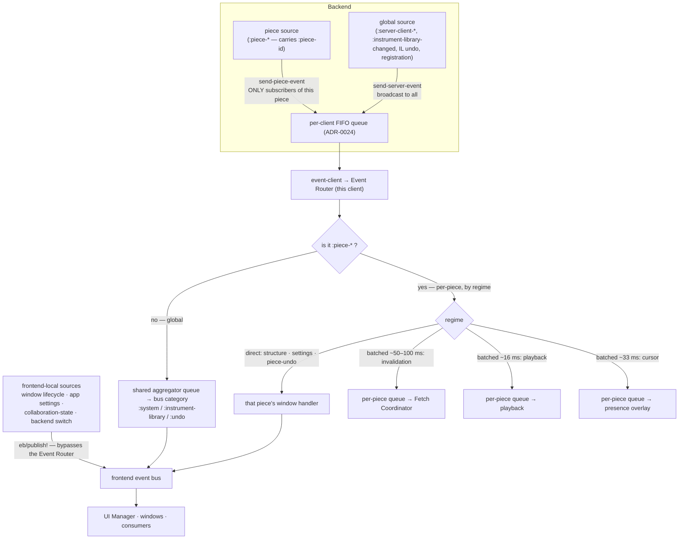
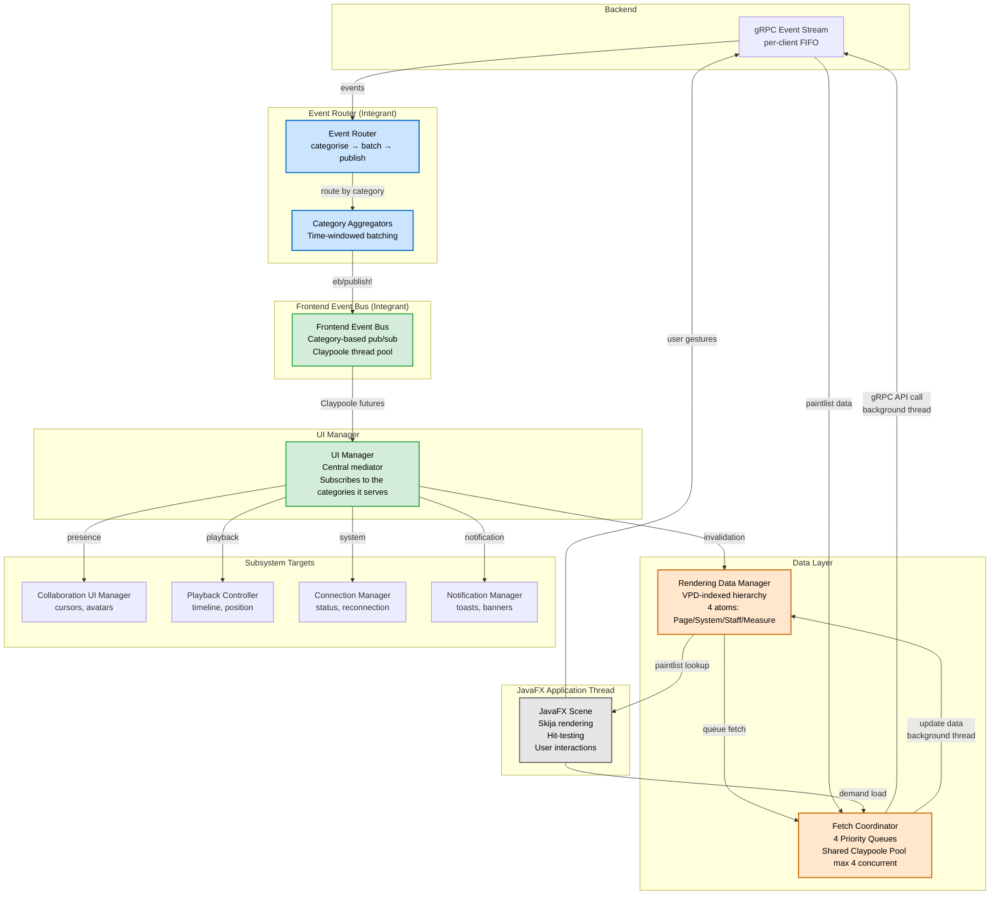
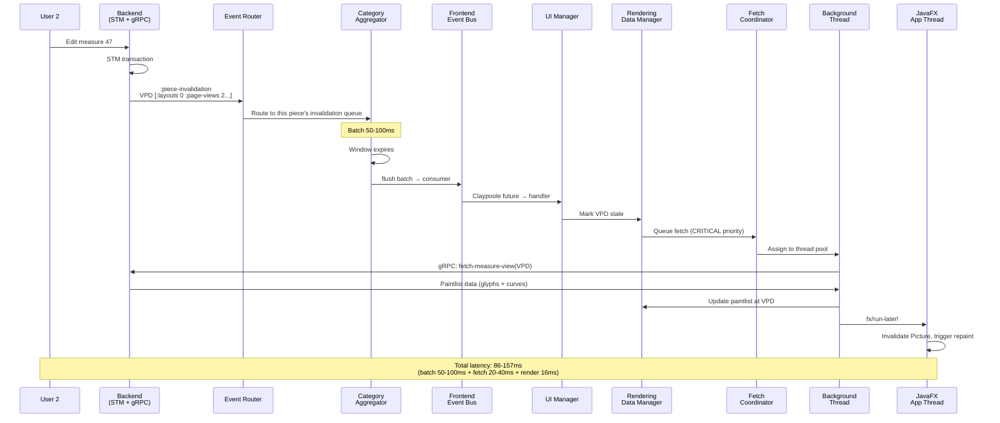
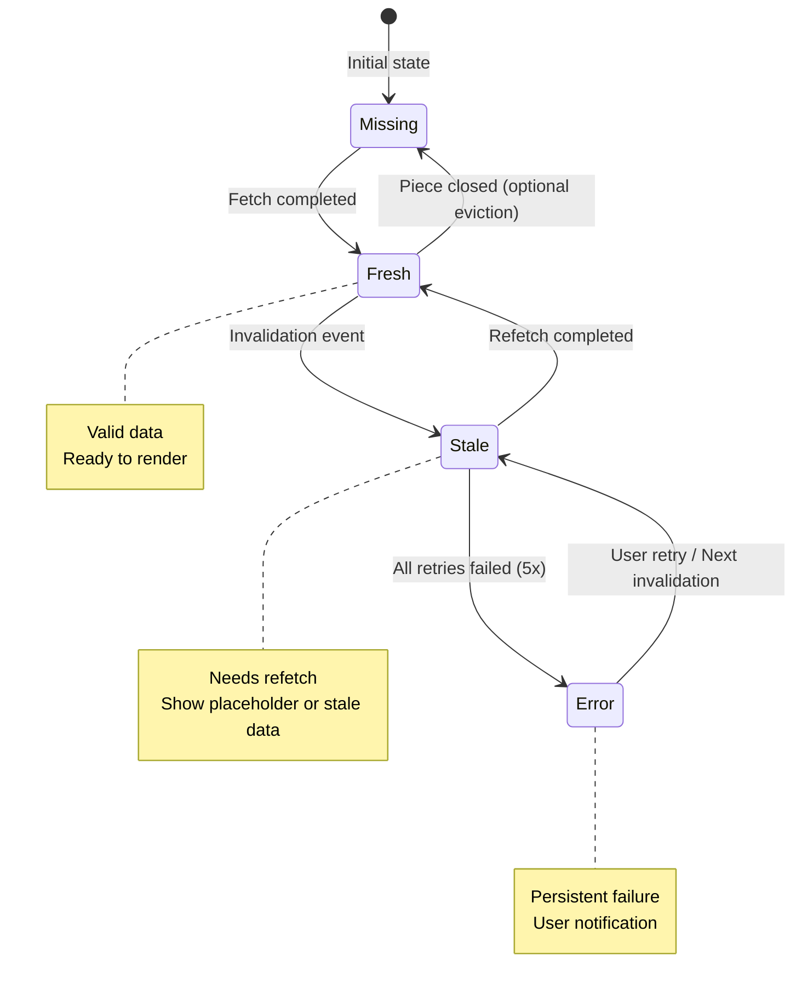
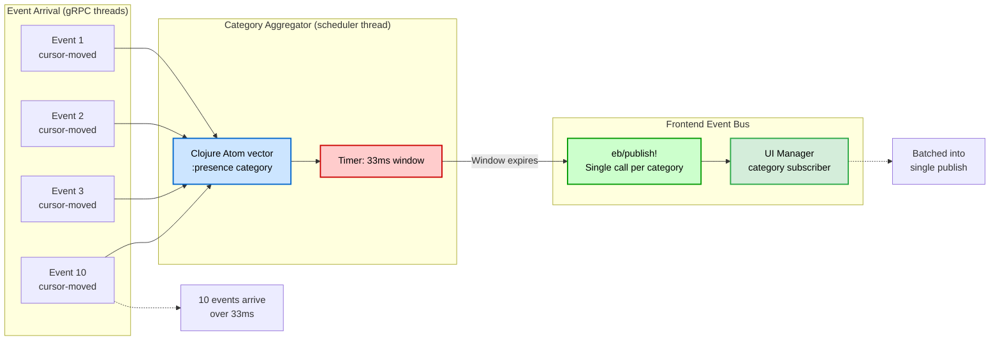

# ADR-0031: Frontend Event-Driven Architecture

## Status

Implemented

## Table of Contents

- [Context](#context)
  - [Frontend-Local Events](#frontend-local-events)
  - [Backend Events (via gRPC)](#backend-events-via-grpc)
- [Decision](#decision)
  - [Why This Decision](#why-this-decision)
  - [Alternatives Considered](#alternatives-considered)
- [Per-Piece Event Routing](#per-piece-event-routing)
  - [Two kinds of subscription, and why the word is dangerous](#two-kinds-of-subscription-and-why-the-word-is-dangerous)
  - [Two orthogonal axes for a piece event](#two-orthogonal-axes-for-a-piece-event)
  - [Routing diagram](#routing-diagram)
- [Consequences](#consequences)
  - [Core Pattern](#core-pattern)
  - [Component Architecture](#component-architecture)
  - [Visual Architecture](#visual-architecture)
  - [Event Envelope Structure](#event-envelope-structure)
  - [Event Type Taxonomy](#event-type-taxonomy)
  - [What Reacts to What](#what-reacts-to-what)
  - [Event Flow Examples](#event-flow-examples)
  - [Key Architectural Properties](#key-architectural-properties)
  - [Connection Management](#connection-management)
  - [Subscription Lifecycle](#subscription-lifecycle)
  - [Performance Considerations](#performance-considerations)
  - [Frontend State Model (ADR-0022 Architecture)](#frontend-state-model-adr-0022-architecture)
  - [Tradeoffs and Limitations](#tradeoffs-and-limitations)
- [Implementation Questions](#implementation-questions)
  - [Resolved](#resolved)
  - [Outstanding](#outstanding)
- [Related ADRs](#related-adrs)
- [Related Guides](#related-guides)
- [References](#references)

---

## Context

The frontend must handle two fundamentally different event sources with incompatible timing and failure characteristics:

### Frontend-Local Events
- **Origin:** JavaFX event system, UI interactions, application state changes
- **Timing:** Synchronous, immediate, deterministic
- **Scope:** Local to the frontend process
- **Examples:** Mouse clicks, keyboard input, canvas repaints, window focus, drag operations, timer events
- **Error mode:** Local exceptions, handled immediately

### Backend Events (via gRPC)
- **Origin:** Server event streams over network
- **Timing:** Asynchronous, network-delayed, per-connection FIFO (ADR-0024)
- **Scope:** Distributed across all connected clients
- **Examples:** Piece modifications, collaborative edits, layout invalidations, presence updates, system notifications
- **Error mode:** Network failures, disconnections, reconnection

**Problem:** These event sources have irreconcilable differences. Synchronous UI events require immediate processing without blocking. Asynchronous network events require batching, backpressure, and failure isolation. A single mechanism handling both source models would compromise both — JavaFX's synchronous dispatch assumptions conflict with network-scale pub/sub requirements.

**Research Context:**

**Figma's LiveGraph** demonstrated that invalidation-based caching works well without database overload - most query results never change after initial load. Stateless invalidators aware of topology deliver targeted invalidations. Figma's multiplayer uses client/server architecture with WebSocket communication, server-side ordering, and 33ms client update batching.

**JavaFX Concurrency Model:** Scene graph is not thread-safe and accessible only from JavaFX Application Thread. Background threads use Platform.runLater() to schedule updates, typically processed within 0.1ms. Long-running tasks must execute on background threads to maintain UI responsiveness.

---

## Decision

**Three-Layer Event Architecture:** Backend events handled by dedicated Event Router component that categorises, batches, and publishes to the frontend event bus; frontend component communication handled by the same frontend event bus (a category-based pub/sub Integrant component backed by a Claypoole thread pool); UI input events remain in the JavaFX event system.

### Why This Decision

**Performance Isolation:** Network I/O and backend event processing cannot block JavaFX Application Thread under any circumstances. A unified event bus would risk slow network operations delaying UI responsiveness. Separate systems provide hard isolation - backend event failures, latency spikes, or processing delays never propagate to local UI events.

**Respect for Timing Characteristics:** JavaFX events are synchronous, immediate, and deterministic. Backend events are asynchronous, network-delayed, and distributed. These are fundamentally different event models that should not be conflated. JavaFX's native event infrastructure is optimized for local interactions (mouse clicks, repaints, timers) and forcing it to handle large-scale pub/sub over the network fights its design assumptions.

**Clear Failure Boundaries:** gRPC stream failures, connection lifecycle, and backpressure handling are protocol concerns that belong in a dedicated component, not mixed into JavaFX event handling. When the network fails, the Event Router handles it; the UI continues processing local events normally.

**Architectural Alignment:** ADR-0024 already provides per-client FIFO event delivery via backend drainer threads. The Event Router simply receives ordered events and routes them - no complex synchronization needed. ADR-0022 specifies invalidation-based data synchronization with pull-based fetching, which requires protocol adaptation (events → invalidations → fetches) rather than event translation. Backend computes all layout via ADR-0028 - all clients must see those results.

**Natural Priorities:** JavaFX gives UI events (clicks, drags) immediate processing. Backend events flow through the Event Router and frontend event bus on Claypoole futures, naturally behind UI work. System events are published immediately (no batching). This priority scheme emerges naturally from separate systems; a unified bus would require explicit priority queues.

### Alternatives Considered

**Unified Source Handling (Rejected):** A single mechanism processing both JavaFX input events and network events would provide a simpler mental model and natural event chaining, but conflates synchronous UI events with asynchronous network events. Unacceptable performance risk — slow async processing blocking fast local events. Loss of JavaFX event system optimizations that assume local, deterministic event sources. Backend failures would propagate to local event processing. (Note: the accepted architecture does use a single *delivery surface* — the frontend event bus — for all frontend component communication. What is rejected is a single *source handler* that processes both JavaFX input dispatch and network protocol adaptation in one mechanism.)

**Backend→JavaFX Translation (Rejected):** Transforming server events into JavaFX platform events would let frontend code treat all events uniformly, but JavaFX event system is not designed for large-scale distributed pub/sub. Async network characteristics remain despite local injection. Would require fighting JavaFX assumptions about event origins (scene graph thread, local dispatch) and lose natural backpressure handling that gRPC streaming provides.

---

## Per-Piece Event Routing

Events reach the frontend through **three lanes**, and every routing decision follows from which lane an event is in. Keeping the three straight is the one thing this section exists to keep from going wrong.

1. **Global backend events** — tied to no piece; they concern every client. The backend **broadcasts** them (`send-server-event`), and the frontend routes them through a **shared bus category** any component may subscribe to. Correct, because the event genuinely is everyone's: `:server-client-connected` / `:server-client-disconnected` → `:system` (carrying guest-vs-owner identity, so a named "X has connected" notification is possible); `:instrument-library-changed` → `:instrument-library`; `:undo-state-changed` **for the Instrument Library resource** → `:undo`; `:client-registration-confirmed` (the per-client registration handshake).

2. **Frontend-local events** — raised inside the frontend, never from the gRPC stream. They are published **straight to the bus** (`eb/publish!`) and **never pass through the Event Router, `derive-category`, or the aggregator**. A category is correct — these are this client's own UI/state signals: `:app-lifecycle`, `:window-lifecycle`, `:window-requests`, `:app-settings`, `:collaboration` (`:collaboration-state-changed` — *this* client's transport/host state), `:backend`.

3. **Piece events** — tied to exactly one piece, always carrying `:piece-id`, and marked by the **`:piece-` prefix**. The backend sends each **only to the clients subscribed to that piece** (`send-piece-event`), and the frontend routes each **to that piece's own handler or queue** — never a shared category.

**The invariant, and why the prefix carries it.** A `:piece-*` event is **never** broadcast to all clients and filtered locally, and **never** placed on a shared frontend category that other pieces' windows also receive. It is delivered per-piece at the source and handled per-piece at the destination. The **`:piece-` prefix is the scope marker**: the router's rule is simply *"`:piece-*` → per-piece; everything else → its category."* A scope lookup table — deciding per event type whether it is piece-scoped — would drift, because a new event could be added on the wrong side. The prefix makes scope structural, so it cannot. This is why a piece-scoped collaboration cursor is `:piece-collaboration-cursor-moved`, not `:collaboration-cursor-moved`: the former routes per-piece by rule; the latter would be a scope lookup waiting to go wrong.

### Two kinds of subscription, and why the word is dangerous

**"Subscription" names two unrelated things in this system.** They have different owners, different
rules and different costs, and the only thing they share is the word. Conflating them produces
confident, wrong conclusions — most reliably the belief that a component wanting a piece's events
must somehow compete for the one subscription the client already has.

> **The test, and it is mechanical: a piece subscription goes over the wire. A local subscription
> never touches the wire.** Everything else below follows from that one fact. If the act involves a
> gRPC call, it is a piece subscription and it is limited to one per client and piece. If it does
> not leave the process, it is a local subscription and there may be as many as you like.

**A piece subscription** is between a **client and the backend**. It is established by
`subscribe-to-piece-events` and held server-side in that client's `:piece-subscriptions`, a set.
There is exactly **one per client and piece**: subscribing again is idempotent, and unsubscribing
revokes the piece for that client outright — which, under close-on-last-release
([ADR-0022](0022-Lazy-Frontend-Backend-Architecture.md)), may close the piece on the backend if no
other client holds it. It decides **whether an event reaches this client at all**, and its lifecycle
belongs to the windowing system, which subscribes when a piece is opened and unsubscribes when it is
closed (see *Event Router* below).

**A local subscription** is **inside one client**. It is a handler registered on the frontend event
bus for a category (`eb/subscribe!`), or registered with the Event Router against a piece id. There
may be **any number** of them, they cost nothing, and adding or removing one is invisible to the
backend and to every other component. It decides **which components see an event that has already
arrived**.

The two map onto the axes below: a piece subscription governs *scope*, a local subscription governs
who consumes the result of a *regime*. Neither constrains the other. In particular, **the single
piece subscription places no limit whatever on how many components within the client may consume
that piece's events** — that fan-out is what the frontend event machinery is for.

**A worked example, in the running system.** `notify-all-events!` (the UI Manager) takes a *wildcard*
local subscription across every category and renders each event it sees as a notification toast — a
development aid that makes all bus traffic visible. It observes events that other components are
consuming at the same moment, adds nothing to the wire, requires no coordination with any existing
subscriber, and can be switched on or off without the backend ever knowing it existed. That is the
whole property in one function: local subscriptions are additive, free, and unlimited. Nothing about
a piece's single subscription over the wire is implicated by it, and a component wanting to visualise,
audit, log or debug a piece's events adds itself the same way.

**The trap is a call site that does both.** The Event Router's `subscribe-to-piece` registers a local
handler *and* issues the piece subscription, under one name that reveals neither. A reader of that
call site sees "subscribe to piece" and cannot tell which of the two sets of rules applies — so when
in doubt, ask which side of the wire the subscription lives on.

The rule that follows: a component that wants a piece's events **never issues its own piece
subscription, and above all never its own unsubscribe** — that would revoke delivery for every other
consumer in the client and can close the piece on the backend. It takes a local subscription, or
reads state that another component already maintains from those events.

### Two orthogonal axes for a piece event

A piece event is fixed by two **independent** choices; separating them is what dissolves the confusion.

1. **Scope — always the one piece.** `send-piece-event` reaches only the clients whose `:piece-subscriptions` contain the `:piece-id`, over the per-client FIFO queues of [ADR-0024](0024-gRPC-Concurrency-and-Flow-Control-Architecture.md). Identical for every piece event. A client with several shared pieces open is subscribed to each; each piece's events arrive tagged with their `:piece-id` and dispatch to the right window — the subscription model carries multi-piece with no extra machinery.

2. **Regime — by event type.** How a receiving client handles it: dispatched straight to the window, or coalesced in a per-piece queue at a set cadence and flushed to a consumer. `derive-category` is the **regime classifier** and the aggregator holds the cadences. **The classifications for streams not yet emitted are deliberate forward-preparation, not dead code** — each future stream's regime is established ahead of the events that will use it. What a stream adds when it is built is per-piece *delivery* and a per-piece *queue* at its already-prepared cadence; it changes neither the classification nor the prefix.

| Piece event | Regime | Cadence | Consumer | Status |
|---|---|---|---|---|
| `:piece-structure-changed` | direct → window | — | window refetches the structure snapshot | live |
| `:piece-dirty-changed` | direct → window | — | window refetches; drives the `●` dirty title + Save enablement | live |
| `:piece-invalidation` | per-piece batched | ~50–100 ms | **Fetch Coordinator** fetches stale paintlists | prepared |
| `:piece-playback-*` | per-piece batched | ~16 ms | playback | prepared |
| `:piece-collaboration-cursor-moved` | per-piece batched | ~33 ms | presence overlay | prepared |
| `:undo-state-changed` for a piece resource | direct → window | — | undo-menu state | prepared |

"Direct" regimes carry no queue; "batched" regimes use their prepared cadence in a **per-piece** queue. Only `:piece-structure-changed` and `:piece-dirty-changed` are built; the rest are prepared. `:undo-state-changed` is the one event split by `:resource-key`: a **piece** resource routes per-piece like the rest of this table; the **Instrument Library** resource is global and goes to every connected client (Lane 1).

**There is no separate settings event, and that is deliberate.** A piece's `:settings` is a structural slot of the Piece ([ADR-0052](0052-Change-Detection-and-Event-Generation.md) §3a), so a settings write emits `:piece-structure-changed` like any other structural write, and the projection the window refetches in answer carries every declared setting at its effective value. A dedicated per-setting event would deliver, more precisely, what that refetch has already brought — see [ADR-0053](0053-Piece-Window-and-Piece-Preferences.md) §6 for the reasoning and the over-signalling cost accepted in exchange.

Two points that have misled before:

- **Only `:piece-invalidation` touches the Fetch Coordinator.** Its sole job is fetching stale *paintlists*, and only an invalidation names stale paintlist VPDs. `:piece-structure-changed` refetches the *structure snapshot* (`get-piece-structure`) itself; `:piece-playback-*` and the collaboration cursor move overlays over already-rendered content and fetch nothing; a setting change's *visual* consequence is a **separate** `:piece-invalidation`, and *that* reaches the Fetch Coordinator (the channel split of [ADR-0053](0053-Piece-Window-and-Piece-Preferences.md) §6 — a setting write also emits `:piece-structure-changed`, since `:settings` is a structural slot).
- **Each batched stream has its own cadence and its own per-piece queue** — invalidation ~50–100 ms, playback ~16 ms, cursor ~33 ms. Structure does not batch, and needs no cadence: it is already one event per outermost transaction ([ADR-0052](0052-Change-Detection-and-Event-Generation.md) §4), and settings writes — which travel on it — are rare.

### Routing diagram


```mermaid
flowchart TD
    subgraph BE["Backend"]
      PSRC["piece source<br/>(:piece-* — carries :piece-id)"]
      GSRC["global source<br/>(:server-client-*, :instrument-library-changed, IL undo, registration)"]
      PSRC -->|"send-piece-event<br/>ONLY subscribers of this piece"| Q["per-client FIFO queue (ADR-0024)"]
      GSRC -->|"send-server-event<br/>broadcast to all"| Q
    end
    Q --> ER["event-client → Event Router (this client)"]
    FL["frontend-local sources<br/>window lifecycle · app settings ·<br/>collaboration-state · backend switch"] -->|"eb/publish! — bypasses the Event Router"| BUS
    ER --> SC{"is it :piece-* ?"}
    SC -->|"no — global"| CAT["shared aggregator queue → bus category<br/>:system / :instrument-library / :undo"]
    SC -->|"yes — per-piece, by regime"| RG{"regime"}
    RG -->|"direct: structure · settings · piece-undo"| WH["that piece's window handler"]
    RG -->|"batched ~50–100 ms: invalidation"| FC["per-piece queue → Fetch Coordinator"]
    RG -->|"batched ~16 ms: playback"| PB["per-piece queue → playback"]
    RG -->|"batched ~33 ms: cursor"| PR["per-piece queue → presence overlay"]
    CAT --> BUS["frontend event bus"]
    WH --> BUS
    BUS --> CONS["UI Manager · windows · consumers"]
```

The detailed mechanisms follow below: `send-piece-event` and the per-client queues in the backend event sections, the per-piece dispatch and `derive-category` under *Event Router*, and the per-event specifics under *Piece Structure*, *Piece Settings*, and *Cache Invalidation*.

---

## Consequences

### Core Pattern

Backend events are notifications of staleness, not data carriers. When rendering data is invalid, client fetches current rendering data (PageView, SystemView, StaffView, or MeasureView depending on VPD granularity) via normal gRPC API calls (ADR-0018 generated methods). This implements the architecture specified in ADR-0022.

**Key Properties:**
- Category aggregation: One `eb/publish!` per event category batch
- Pull-based fetching: Client requests rendering data at appropriate hierarchy level when needed
- Simple recovery: invalidate stale data and refetch; no replay, no catchup
- Precise batching: Invalidations 50-100ms, cursors 33ms, playback ≤16ms

**What This Architecture Does NOT Include:**
- Event sequence numbers (unnecessary - ADR-0024 per-client queues guarantee FIFO delivery)
- Event replay on reconnection (client just fetches current state)
- Complex sync barriers or catchup protocols
- Out-of-order handling (events arrive in exact STM transaction order via per-client drainer threads)
- Duplicate detection beyond connection boundaries (each connection is fresh)

### Component Architecture

Three event layers serve distinct purposes: the frontend event bus (Integrant component) handles all frontend event delivery, the backend event router acts as a protocol adapter that categorises, batches, and publishes backend events to the frontend event bus, and the JavaFX event system handles UI input.

#### 1. Frontend Event Bus (`ooloi.frontend.event-bus`)

Category-based pub/sub for category-routed frontend event delivery, backed by a shared Claypoole thread pool. Both frontend components and the backend Event Router publish to this bus — it is the delivery mechanism for all *category-routed* frontend events. (Per-piece events such as `:piece-structure-changed` are an exception: the Event Router dispatches them per-piece to the subscribing window, not through a shared category — see *Piece Structure* below.) The UI Manager subscribes to event categories and dispatches reactions; windows subscribe to `:window-lifecycle` for their own lifecycle management (registering and unmounting their reactive renderer).

**Interface:**

```clojure
(create-event-bus pool)          ; Factory — takes a Claypoole thread pool
                                 ; Returns {:pool pool :subscribers (atom {})}

(subscribe! bus category handler-fn)   ; Register handler for a category
                                       ; Handler receives vector of events

(unsubscribe! bus category handler-fn) ; Remove handler from a category

(publish! bus category events)         ; Dispatch events to category subscribers
                                       ; Each handler invoked via cp/future — non-blocking
```

**Properties:**
- Category isolation: subscribers only receive events for their subscribed categories
- Non-blocking delivery: each handler invoked as a Claypoole future on the shared thread pool, never on the caller's thread — a slow subscriber cannot block the publisher or other subscribers
- Exception isolation: one handler's failure does not affect other handlers or the publisher
- No ordering guarantees across categories; within a category, all handlers receive the same event vector

**Frontend Event Categories:**

| Category | Events | Publisher |
|----------|--------|-----------|
| `:app-lifecycle` | `:app-ready`, `:app-shutting-down` | `start-app!`, shutdown handler |
| `:window-lifecycle` | `:window-opened`, `:window-closed`, `:window-hidden`, `:window-state-persisted` | `show-window!`, `close-window!`, `persist-stage-geometry!` |
| `:app-settings` | `:setting-changed` | `set-app-setting!` (ADR-0043) |
| `:instrument-library` | `:instrument-library-changed` | Event Router (routed from backend; ADR-0045); also `switch-to!` on a backend switch, invalidating the cache so the previous backend's library is never carried across (ADR-0036). What follows the invalidation is the invariant's, not the switch's: fetched now if the window is open, on next open if it is not |
| `:undo` | `:undo-state-changed` | Event Router (routed from backend; ADR-0015) |
| `:collaboration` | `:collaboration-state-changed` | `switch-to!` (transport changes), host-session / terminate handlers (network-server presence) — see [ADR-0036](0036-Collaborative-Sessions-and-Hybrid-Transport.md) §Collaboration Menu Enablement |
| `:backend` | `:backend-changed` | `switch-to!` on a completed transport switch (ADR-0036 §Frontend Reconnection) — signals that backend-scoped frontend caches are now invalid |

The `:app-lifecycle` category carries an **ordering guarantee** on `:app-ready`: `start-app!` publishes it only after the initial startup window-set has opened and registered — it fires **last**, once every window in the set is present, never partway through startup. The window-set is whatever startup opens: at minimum one New untitled piece (the *untitled fallback*, opened when no piece window would otherwise be on-screen), plus any windows a future session restore reopens. A consumer waiting on `:app-ready` — a readiness signal, or an integration test that needs the startup windows present — can therefore rely on those windows being registered. The guarantee holds even if a restore opens nothing or fails partway: readiness tracks the set that actually opened, so it is never starved by a missing or corrupt window.

The `:collaboration` category is frontend-originated and carries *this client's own* collaboration involvement — its transport, and whether it is hosting. It is distinct from the backend-routed `:presence` / `:collaboration-user-*` events listed below, which describe *other participants* in a session and reach the bus through the Event Router.

The `:backend` category is the orthogonal "I switched backends" signal: `switch-to!` publishes `:backend-changed` on every completed switch, and `undo-redo` subscribes to clear its backend-scoped Tier 1 undo cache (ADR-0015 Tier 1) — the cached timestamps and descriptions belonged to the previous backend. It is distinct from `:instrument-library-changed` (which also fires on backend-side IL edits) and `:collaboration-state-changed` (which also fires on host/terminate, when the frontend's backend has *not* changed).

Categories are arbitrary keywords — any component can define new ones. Backend-originated
categories (`:cache-invalidation`, `:presence`, `:playback`, `:system`, `:notification`,
`:instrument-library`, `:undo`) appear on the same
bus as the frontend-originated ones above — the bus is the delivery mechanism for all
category-routed frontend events. (The window-refetch events — `:piece-structure-changed` and
`:piece-dirty-changed` — are **not** categories: they are per-piece events the Event Router
dispatches to the subscribing window; see *Piece Structure* and *Piece Dirty State* below.)
See [Event Type Taxonomy](#event-type-taxonomy) for every event's own facts, and
[Per-Piece Event Routing](#per-piece-event-routing) for how each is delivered and dispatched.

**Backend Events on the Bus:**

The Event Router (Layer 3) publishes backend event batches directly to the frontend event bus as part of its flush cycle. No separate bridge function is needed — the bridge is structural. When a time-windowed batch flushes, the Event Router calls `eb/publish!` with the batch's category keyword and the vector of events. This makes all category-routed backend events available to any frontend event bus subscriber under their original category keywords. (Per-piece events such as `:piece-structure-changed` bypass this batch-flush path — the Event Router dispatches them directly to the subscribing window; see *Piece Structure*.) A development aid (`notify-all-events!`) subscribes to all event bus categories via wildcard and generates an AtlantaFX UI notification for every event (both frontend-originated and backend-routed). Event bus dispatches on Claypoole pool threads, so `notify-all-events!` bridges to the JAT via `fx/run-later!`. Notification messages include event type and `:window/id` when present. This can be removed without affecting production event flow.

**Coordination Pattern:**

The UI Manager subscribes to event categories and dispatches appropriately. Windows subscribe to `:window-lifecycle` for their own lifecycle management — the `:window-opened` branch calls `register-renderer!` on the UI Manager; the `:window-closed` branch unmounts the renderer. Settings-driven reactivity (theme, locale) is mediated entirely by the UI Manager through `:app-settings` subscriptions and the renderer registry.

**Threading Model for Reactions:**

UI Manager event handlers execute on Claypoole future threads (background), not on the JAT. Within a handler, two kinds of work occur:
- **Background-safe work** (atom updates, stale marking, queueing fetches) — executes directly on the Claypoole thread. No `fx/run-later!` needed.
- **Scene graph mutations** (theme application, notification display, cursor overlay updates) — dispatched to the JAT via `fx/run-later!`.

This separation is critical: the Rendering Data Manager is a pure data cache (atoms) and does not require JAT affinity. Only the subsequent scene graph repaint uses `fx/run-later!`.

Integrant component (`:ooloi.frontend.components/event-bus`), depending only on the thread pool. The UI Manager and Event Router both receive it as an Integrant dependency.

#### 2. Backend Event Router (Integrant Component)
- Subscribes to gRPC event streams via backend API (subscribe-to-piece-events, unsubscribe-from-piece-events)
- Pure pipeline for category-routed events: categorise → batch → `eb/publish!` to frontend event bus (per-piece events such as `:piece-structure-changed` are dispatched directly to the subscribing window instead — see *Piece Structure*)
- Category aggregators: Batch events per category, one `eb/publish!` per flush
- No direct category handlers — category processing happens through frontend event bus subscribers mediated by the UI Manager
- Dependencies: **grpc-clients** (for the event stream) and **event-bus** (for publishing batched events)
- Manages lifecycle with Integrant
- Subscription management: The **Windowing System is authoritative** — it initiates subscribe/unsubscribe calls when pieces are opened or closed. The Event Router is a service that executes these requests, proxies them to the backend, and remembers the active subscription set. The remembered set is never replayed onto a new connection: `switch-to!` clears it, because piece-ids are issued by, and meaningful only against, the backend that issued them.
- On disconnect: Stops receiving events, publishes `:system` disconnect to bus
- On involuntary loss: operation reverts to the in-process backend ([ADR-0040](0040-Single-Authority-State-Model.md) §Deployment Model, [ADR-0036](0036-Collaborative-Sessions-and-Hybrid-Transport.md) §Involuntary Reversion). Reconnecting is the user's decision; nothing is resubscribed automatically

#### 3. Rendering Data Manager
- Maintains VPD-indexed hierarchy mirroring backend visual structure:
  - Layout → PageViews → SystemViews → StaffViews → MeasureViews
- Stores paintlists at each level (independent, not nested):
  - PageViews: Headers, footers, page numbers
  - SystemViews: System-level elements, interconnecting elements (slurs/beams spanning measures)
  - StaffViews: Staff-level elements
  - MeasureViews: Glyphs (note heads, accidentals, rests) and curves (slurs, beams, ties)
- Each paintlist includes its VPD - all glyphs/curves within that paintlist belong to that VPD (no per-element annotation needed)
- Paintlists support both semantic elements (font glyphs, computed musical curves) and user-edited graphics (arbitrary bezier paths with control points, detached from musical semantics)
- Paintlists include spatial information: bounding boxes for glyphs, paths for curves (enables hit-testing)
- Tracks staleness at each hierarchy level (implementation may use explicit flags, sentinel values like nil, or data presence/absence)
- Paintlists converted to JavaFX/Skija-efficient representations for rendering
- Handles lookup via VPD, invalidation at any hierarchy level
- Not an Integrant component - data structure with operations
- Complete rendering cache stored locally - no eviction
- Structure specified in ADR-0022

#### 4. Fetch Coordinator
- Prioritizes and batches refetch requests for any visual hierarchy level
- Uses normal gRPC API calls (ADR-0018 generated methods) to fetch rendering data
- Fetch granularity determined by event VPD (PageView, SystemView, StaffView, or MeasureView)
- Four priority queues:
  - Critical: Viewport + stale (visible invalidations - user sees wrong data)
  - High: Viewport + missing (visible demand loads - placeholders showing)
  - Normal: Prefetch (scrolling toward, buffered viewport)
  - Low: Background (opportunistic)
- When fetch completes, updates Rendering Data Manager on background thread, then schedules scene graph repaint via `fx/run-later!`
- Fetching is pull-based: Client requests specific hierarchy level when needed
- Backend returns complete paintlist data for requested level
- Shared Claypoole pool (max 4 concurrent fetches) services queues, CRITICAL drains before others

#### 5. Subsystem Targets
Components that react to events via frontend event bus subscriptions mediated by the UI Manager:
- Rendering Data Manager: Invalidation events → mark stale, trigger Fetch Coordinator
- Collaboration UI Manager: Presence, cursors, selections
- Playback Controller: Playback position, start/stop
- Connection Manager: System events, reconnection
- Notification Manager: User-facing messages, errors

The UI Manager subscribes to the categories whose reactions it mediates, and dispatches to these subsystems. It is not a wildcard subscriber, and it is not the only one: windows take their own local subscriptions through `:window/subscriptions` (ADR-0042), `undo-redo` subscribes to `:backend` for its own cache, and the `notify-all-events!` development aid subscribes to every category at once. What the mediation rule means is narrower — a *rendering* subsystem (Rendering Data Manager, Fetch Coordinator, playback, presence) does not subscribe on its own behalf; the UI Manager receives and dispatches to it.

#### 6. JavaFX Scene
- Render pass checks data staleness at hierarchy elements (detects whether paintlist is current or needs refetch)
- Standard JavaFX event handlers for user input (clicks, drags, keyboard)
- Hit-testing: Spatial queries on visible paintlists (bounding box intersection for glyphs, path proximity for curves) return paintlist VPDs. Uses timewalk (ADR-0014) to resolve VPDs to musical elements. Enables all graphical interactions: selection, editing, dragging, deletion.
- Skija rendering from local paintlist data (glyphs and curves)
- No knowledge of backend event routing
- Pattern specified in ADR-0022

### Visual Architecture

#### Event Flow Overview

```
┌──────────────────────────────────────┐
│          Backend Server              │
│  piece changes · presence · playback │
└───────────────┬──────────────────────┘
                │ gRPC event stream
                ▼
┌─────────────────────────────────────┐
│          Event Client               │
│  protobuf → Clojure map             │
│  process-received-event             │
└───────────────┬─────────────────────┘
                │ individual events
                ▼
┌─────────────────────────────────────┐
│    Event Router — Layer 3           │
│  categorise → batch → publish       │
│  time windows: 16ms – 100ms         │
└───────────────┬─────────────────────┘
                │ eb/publish!
                │ (category, [events])
                ▼
┌─────────────────────────────────────┐    Frontend publishers
│    Frontend Event Bus — Layer 2     │◄── start-app!
│  category-based pub/sub             │◄── show-window!
│  Claypoole thread pool delivery     │◄── set-app-setting!
└───────────────┬─────────────────────┘
                │ Claypoole futures
                ▼
┌─────────────────────────────────────┐
│    UI Manager (central mediator)    │
│  subscribes to the categories it    │
│  serves; dispatches reactions       │
└───────┬─────────────────┬───────────┘
        │                 │
        │ fx/run-later!   │ background work
        ▼                 ▼
┌────────────────┐  ┌────────────────┐
│  JAT — Layer 1 │  │ Fetch Coord.,  │
│  UI updates,   │  │ atom updates,  │
│  theme, notifs │  │ stale marking  │
└────────────────┘  └────────────────┘
```

Backend events flow top-to-bottom through the full pipeline. Frontend-originated events enter at the bus level. The UI Manager dispatches reactions on background threads — only reactions that mutate the scene graph use `fx/run-later!` to reach the JAT. JavaFX user input events (clicks, keyboard, drag) are handled synchronously on the JAT by node handlers and never pass through the event bus.

#### Component Architecture Diagram


```mermaid
graph TB
    subgraph Backend
        gRPC[gRPC Event Stream<br/>per-client FIFO]
    end

    subgraph "Event Router (Integrant)"
        ER[Event Router<br/>categorise → batch → publish]
        CA[Category Aggregators<br/>Time-windowed batching]
    end

    subgraph "Frontend Event Bus (Integrant)"
        BUS[Frontend Event Bus<br/>Category-based pub/sub<br/>Claypoole thread pool]
    end

    subgraph "UI Manager"
        UM[UI Manager<br/>Central mediator<br/>Subscribes to the categories it serves]
    end

    subgraph "Data Layer"
        RDM[Rendering Data Manager<br/>VPD-indexed hierarchy<br/>4 atoms: Page/System/Staff/Measure]
        FC[Fetch Coordinator<br/>4 Priority Queues<br/>Shared Claypoole Pool max 4 concurrent]
    end

    subgraph "Subsystem Targets"
        COLLAB[Collaboration UI Manager<br/>cursors, avatars]
        PLAYBACK[Playback Controller<br/>timeline, position]
        CONN[Connection Manager<br/>status, reconnection]
        NOTIFY[Notification Manager<br/>toasts, banners]
    end

    subgraph "JavaFX Application Thread"
        SCENE[JavaFX Scene<br/>Skija rendering<br/>Hit-testing<br/>User interactions]
    end

    gRPC -->|events| ER
    ER -->|route by category| CA
    CA -->|eb/publish!| BUS
    BUS -->|Claypoole futures| UM
    UM -->|invalidation| RDM
    UM -->|presence| COLLAB
    UM -->|playback| PLAYBACK
    UM -->|system| CONN
    UM -->|notification| NOTIFY

    RDM -->|queue fetch| FC
    FC -->|gRPC API call<br/>background thread| gRPC
    gRPC -->|paintlist data| FC
    FC -->|update data<br/>background thread| RDM

    RDM -->|paintlist lookup| SCENE
    SCENE -->|demand load| FC
    SCENE -->|user gestures| gRPC

    style ER fill:#cce5ff,stroke:#0066cc,stroke-width:2px,color:#000
    style CA fill:#cce5ff,stroke:#0066cc,stroke-width:2px,color:#000
    style BUS fill:#d4edda,stroke:#28a745,stroke-width:2px,color:#000
    style UM fill:#d4edda,stroke:#28a745,stroke-width:2px,color:#000
    style RDM fill:#ffe6cc,stroke:#cc6600,stroke-width:2px,color:#000
    style FC fill:#ffe6cc,stroke:#cc6600,stroke-width:2px,color:#000
    style SCENE fill:#e6e6e6,stroke:#666,stroke-width:2px,color:#000
```

#### Sequence Diagram: Collaborative Edit Flow


```mermaid
sequenceDiagram
    participant U2 as User 2
    participant BE as Backend<br/>(STM + gRPC)
    participant ER as Event Router
    participant CA as Category<br/>Aggregator
    participant BUS as Frontend<br/>Event Bus
    participant UM as UI Manager
    participant RDM as Rendering<br/>Data Manager
    participant FC as Fetch<br/>Coordinator
    participant BG as Background<br/>Thread
    participant JAT as JavaFX<br/>App Thread

    U2->>BE: Edit measure 47
    BE->>BE: STM transaction
    BE->>ER: :piece-invalidation<br/>VPD [:layouts 0 :page-views 2...]
    ER->>CA: Route to this piece's invalidation queue
    Note over CA: Batch 50-100ms
    CA->>CA: Window expires
    CA->>BUS: flush batch → consumer
    BUS->>UM: Claypoole future → handler
    UM->>RDM: Mark VPD stale
    RDM->>FC: Queue fetch (CRITICAL priority)
    FC->>BG: Assign to thread pool
    BG->>BE: gRPC: fetch-measure-view(VPD)
    BE->>BG: Paintlist data (glyphs + curves)
    BG->>RDM: Update paintlist at VPD
    BG->>JAT: fx/run-later!
    JAT->>JAT: Invalidate Picture, trigger repaint

    Note over U2,JAT: Total latency: 86-157ms<br/>(batch 50-100ms + fetch 20-40ms + render 16ms)
```

#### State Diagram: Paintlist Lifecycle


```mermaid
stateDiagram-v2
    [*] --> Missing: Initial state
    Missing --> Fresh: Fetch completed
    Fresh --> Stale: Invalidation event
    Stale --> Fresh: Refetch completed
    Stale --> Error: All retries failed (5x)
    Error --> Stale: User retry / Next invalidation
    Fresh --> Missing: Piece closed (optional eviction)

    note right of Fresh
        Valid data
        Ready to render
    end note

    note right of Stale
        Needs refetch
        Show placeholder or stale data
    end note

    note right of Error
        Persistent failure
        User notification
    end note
```

#### Category Aggregation Flow


```mermaid
graph LR
    subgraph "Event Arrival (gRPC threads)"
        E1[Event 1<br/>cursor-moved]
        E2[Event 2<br/>cursor-moved]
        E3[Event 3<br/>cursor-moved]
        E10[Event 10<br/>cursor-moved]
    end

    subgraph "Category Aggregator (scheduler thread)"
        Q[Clojure Atom vector<br/>:presence category]
        T[Timer: 33ms window]
    end

    subgraph "Frontend Event Bus"
        PUB[eb/publish!<br/>Single call per category]
        UM[UI Manager<br/>category subscriber]
    end

    E1 --> Q
    E2 --> Q
    E3 --> Q
    E10 --> Q

    Q --> T
    T -->|Window expires| PUB
    PUB --> UM

    style Q fill:#cce5ff,stroke:#0066cc,stroke-width:2px,color:#000
    style T fill:#ffcccc,stroke:#cc0000,stroke-width:2px,color:#000
    style PUB fill:#ccffcc,stroke:#009900,stroke-width:2px,color:#000
    style UM fill:#d4edda,stroke:#28a745,stroke-width:2px,color:#000

    note1[10 events arrive<br/>over 33ms]
    note2[Batched into<br/>single publish]

    E10 -.-> note1
    UM -.-> note2
```

### Event Envelope Structure

The frontend event bus carries heterogeneous event shapes — each category defines its own format. There is no universal envelope contract across all categories. Backend events and frontend-originated events have different structures:

**Backend events** arrive with the following structure (per ADR-0018). Subscribers for backend categories (`:system`, `:notification`, `:instrument-library`, `:undo`) receive events in this format, as do the per-piece consumers of piece events:

```clojure
{:type :piece-invalidation        ; Required keyword, validated by backend
 :timestamp 1729800000000000      ; Required epoch-µs timestamp (auto-added)
 :piece-id "symphony-123"         ; Required for piece-* events (validated)
 :vpd [:layouts 0 :page-views 2 :system-views 1 :staff-views 0 :measure-views 47]
 :message "Human readable text"   ; Optional string
 :client-id "client-uuid"         ; Optional string
 ...additional-fields...}
```

**Backend Validation Guarantees** (per ADR-0018 `validate-event-structure`):

Events received by frontend are **pre-validated** and guaranteed to have:
- `:type` field exists and is a keyword
- `:type` matches pattern: `server-*`, `client-*`, `piece-*`, `collaboration-*`, `instrument-library-*`, `undo-*`, or contains `/`
- `:timestamp` field exists and is a number (epoch µs, added by `send-*-event`)
- `:piece-id` field exists and is a string (for piece-* and collaboration-* events)
- All field names are keywords (kebab-case)
- `:message` is a string if present
- `:client-id` is a string if present

**Frontend Event Router does NOT need to re-validate** - backend guarantees correctness.

**Frontend-originated events** (`:app-lifecycle`, `:window-lifecycle`, `:app-settings`) are maps with at minimum `:type` and `:timestamp`. Subscribers for these categories know their specific event shapes. The `:type` and `:timestamp` fields are a convention for frontend events, not a bus-wide contract — backend events happen to share these fields because the backend validation guarantees them, but this is coincidence of design rather than a universal bus requirement.

### Event Type Taxonomy

**Routing is specified once, in [§Per-Piece Event Routing](#per-piece-event-routing), and is not
restated here.** This section catalogues each event's *own* facts — its required fields, its scope
or context fields, and what a consumer does with it. Where an entry names a regime or a cadence it
is quoting the axes table in that section, not defining anything.

The short form, so an entry below can be read alone: a **piece event** (`:piece-` prefix) is
delivered by `send-piece-event` to the clients subscribed to that piece, and handled per-piece on
arrival — either dispatched straight to that piece's window, or coalesced in a queue belonging to
that piece and that stream. A **global event** is delivered by `send-server-event` to every
connected client and handled through a shared bus category. No piece event is ever placed on a
shared category, and no global event is ever piece-scoped.

#### Piece events

**Cache Invalidation** — `:piece-invalidation`, visual hierarchy invalidation at any level.

**Required fields**: `:piece-id` (string), `:timestamp` (number)
**Scope fields** (one of): `:vpd` (single VPD vector), `:vpds` (multiple VPD vectors), `:measures` (measure numbers)
**VPD depth indicates level**: `[:layouts 0]` = layout, `[:layouts 0 :page-views 2]` = page, etc. There is deliberately **one** invalidation event rather than one per hierarchy level; the depth of the VPD carries the level.
**Regime**: per-piece batched, ~50–100 ms. **Consumer**: the Fetch Coordinator, which fetches the stale paintlists. This is the only event that reaches it.

---

**Presence / Collaboration** — piece-scoped, and named accordingly:
```clojure
:piece-collaboration-user-joined
:piece-collaboration-user-left
:piece-collaboration-cursor-moved
:piece-collaboration-selection-changed
```

**Required fields**: `:piece-id` (string), `:timestamp` (number)
**Context fields**: `:vpd` (for cursor position), `:vpds` (for selections), `:user-id`, `:user-name`
**Regime**: per-piece batched, ~33 ms (30 fps — smooth cursors without overwhelming the UI). **Consumer**: the presence overlay, which moves avatars, cursors and selection highlights over already-rendered content and fetches nothing.
**On the names.** Collaboration in Ooloi is always *about a piece* — a cursor is somewhere in a score, a selection is of something in one — so these carry the `:piece-` prefix like every other piece event, and the prefix means here exactly what it means everywhere: delivered only to that piece's subscribers. A bare `collaboration-` prefix would put the scope in a lookup table instead of in the name. (`:collaboration-state-changed` is unrelated and keeps its name: it is frontend-local, this client's own transport state, and never crosses the wire — see the lane list in §Per-Piece Event Routing.)

---

**Playback** —
```clojure
:piece-playback-position
:piece-playback-started
:piece-playback-stopped
```

**Required fields**: `:piece-id` (string), `:timestamp` (number)
**Context fields**: `:vpd` (current playback position), `:tempo`, `:time-signature`
**Regime**: per-piece batched, ~16 ms (60 fps — a fluid playback cursor). **Consumer**: the playback controller, which moves the timeline cursor and highlights active measures over already-rendered content and fetches nothing.

---

**Piece Structure** (`:piece-structure-changed` — a **per-piece event, not a bus category**):
```clojure
:piece-structure-changed  ; Structural metadata changed: musicians, instruments,
                          ; layouts, staff participation, piece title
```

**Required fields**: `:piece-id` (string), `:timestamp` (number)
**Payload fields**: none — clients fetch current structure via `get-piece-structure`
**Routing — per-piece, not categorised.** `send-piece-event` delivers this only to clients
subscribed to the piece. On the client, the piece window has subscribed to *its* piece through
the Event Router's `subscribe-to-piece` (proxying `subscribe-to-piece-events`), registering its
handler against that `piece-id`; the Event Router dispatches the event to that piece's handler.
It does **not** pass through `derive-category` or a shared `:piece-structure` category — there is
no fan-out to other pieces' windows and no client-side `:piece-id` filter.
**Subscriber reaction**: the piece window's handler calls `(SRV/get-piece-structure [] piece-id)`
and applies the result to `*piece-state` via `swap!`. The cljfx renderer repopulates the Musicians
and Layouts panes reactively. No paintlist impact; no Fetch Coordinator involvement.
**Refetches are latest-wins**: the window also reads the structure once on open, and both that
initial read and every event-driven refetch run off the JAT and can land out of order. Each
carries a timestamp — the event's `:timestamp`, or `0` for the initial read — and is applied only
if newer than the last applied (`:structure-timestamp`), so a stale refetch landing late is
dropped and the window settles on the freshest structure.

---

**Piece Dirty State** (`:piece-dirty-changed` — a **per-piece event, not a bus category**):
```clojure
:piece-dirty-changed  ; The piece's dirty flag flipped — clean→dirty on the first edit
                      ; after a save, dirty→clean on a save (ADR-0052 §5)
```

**Required fields**: `:piece-id` (string), `:timestamp` (number)
**Payload fields**: none — the flag rides the projection; clients read it from `get-piece-structure`'s virtual `:dirty` field.
**Emitted on the flip only.** The Piece Manager holds the flag (ADR-0052 §5). `mark-piece-dirty!` emits on the `false→true` transition (from the change-detection funnel, deferred to commit like `:piece-structure-changed`); `clear-piece-dirty!` emits on the `true→false` transition (from `save-piece`, a direct emit outside any transaction). A no-op mark on an already-dirty piece, or a clear of an already-clean one, is silent — ~two events per save cycle, not one per keystroke. Both go through the shared `PieceChangeNotifier` seam (`notify-piece-change! [piece-id event-type]`) — the *same* seam `:piece-structure-changed` uses, parameterised by the event type, since the two payload-free per-piece change events differ only in the keyword.
**Routing — per-piece, not categorised.** Exactly like `:piece-structure-changed`: `send-piece-event` delivers it only to clients subscribed to the piece, and the Event Router dispatches it to that piece's registered handler — one of the two window-refetch events routed direct-to-window (never `derive-category` / a shared category).
**Subscriber reaction**: the piece window's handler refetches `(SRV/get-piece-structure [] piece-id)` — the same handler as `:piece-structure-changed` — so the projected `:dirty` updates in `*piece-state`, toggling the window title's `●` (ADR-0053 §5). The menu also re-evaluates Save enablement (active-piece **and** dirty) on this event. Latest-wins by `:timestamp`.

---

**Piece Settings — no event of their own.** A `defsetting` value changing on the backend emits
**`:piece-structure-changed`**, exactly as above and for the same reason: a piece's `:settings` is a
structural slot of the Piece ([ADR-0052](0052-Change-Detection-and-Event-Generation.md) §3a), so a
settings write is a structural write. The projection the window refetches in answer carries every
declared setting at its effective value, so every consumer of a setting's value — the piece window's
own labels, and any Piece Preferences window watching that window's state — is served by the one
event. There is deliberately **no** per-setting event carrying `:setting-key` and a new value: it
would deliver, more precisely, what the refetch has already brought. [ADR-0053](0053-Piece-Window-and-Piece-Preferences.md)
§6 states the reasoning and the over-signalling cost accepted in exchange.

**The graphical consequence is a separate channel, and this separation is load-bearing.** A settings
write announces *that the piece changed*; what it looks like afterwards is not carried by that
announcement. Any repaint the change entails travels independently as `:piece-invalidation` (→
`:cache-invalidation`) and reaches the Fetch Coordinator by the ordinary route. The structural
announcement itself **never triggers paintlist fetching**, and the two must never be conflated: a
music-font change and a musician rename produce the same structural event and entirely different
invalidations.

---

**Piece notifications** — a failure concerning one piece:
```clojure
:piece-validation-error
:piece-operation-failed
```

**Required fields**: `:piece-id` (string), `:timestamp` (number)
**Context fields**: `:message` (human-readable), `:severity`
**Regime**: batched, ~75 ms. **Consumer**: the notification manager, which formats the message through `tr` and raises a toast or banner.
**Note the two axes at work.** Delivery is per-piece — a validation failure on a piece concerns the clients editing *that* piece and no one else — while the consumer is client-scoped, one notification manager serving every piece this client has open. Piece-scoped delivery, shared consumer: the general case, and the reason the prefix cannot be read as naming a consumer.

---

#### Global events

Delivered by `send-server-event` to every connected client, and dispatched through a shared bus
category. None is piece-scoped; none carries a `:piece-id`.

**System** (`:system` category):
```clojure
:server-maintenance
:server-shutdown
:server-status
:server-client-connected
:server-client-disconnected
```

**Required fields**: `:type` (keyword), `:timestamp` (number)
**Context fields**: `:message` (human-readable), `:client-count`, `:affected-services`
**Regime**: batched, ~75 ms. **Consumer**: the connection manager, and the notification manager for anything the user should see.

---

**Server messages and registration** (`:notification` category):
```clojure
:server-warning
:server-info
:client-registration-confirmed
```

**Required fields**: `:type` (keyword), `:timestamp` (number)
**Context fields**: `:message` (human-readable), `:severity`
**Regime**: batched, ~75 ms. **Consumer**: the notification manager. `:client-registration-confirmed` is the exception that never reaches it — it is the registration handshake, consumed by the event client to complete the connection and to compute this client's clock offset from the server's `:server-timestamp`.

---

**Instrument Library** (`:instrument-library` category):
```clojure
:instrument-library-changed  ; The global instrument library was modified
```

**Required fields**: `:timestamp` (number)
**Payload fields**: none — clients fetch current library via `(SRV/get-instrument-library)`
**Note**: This event is global (not scoped to a piece). It carries no payload; the
invalidate-only design keeps event payload size fixed and avoids partial-state delivery.
**Subscriber reaction**: If the Instrument Library window is open, the frontend calls
`get-instrument-library` immediately and resets `*instrument-library`. If the window is
closed, `*instrument-library` is set to `nil` (staleness marker); the fetch is deferred
until the window next opens. See [ADR-0045](0045-Instrument-Library.md) for the full lazy
caching model.

**Undo State** (`:undo` category):
```clojure
:undo-state-changed  ; The undo/redo state changed for a backend resource
```

**Required fields**: `:resource-key` (keyword or UUID), `:undo-timestamp` (number or nil),
`:redo-timestamp` (number or nil)
**Payload fields**: none — timestamps indicate current undo/redo availability; descriptions
are fetched lazily via `SRV/get-undo-description` when the menu needs to display them.
**Scoping**: IL notifications go to all connected clients (global resource). Piece
notifications go only to clients subscribed to that piece, following the same audience
scoping as `:piece-structure-changed`.
**Subscriber reaction**: The frontend caches the timestamps per resource in its backend
timestamp cache and marks any cached description as stale. The undo/redo menu item
compares the highest cached backend timestamp with the local undo stack's top timestamp
to determine what Cmd+Z will do. See [ADR-0015](0015-Undo-and-Redo.md) for the full
invalidate→fetch model and timestamp-based routing.

---

#### Category Derivation Logic

`derive-category` classifies an arriving event. Below is the function **as it stands today** —
quoted, not paraphrased, so it can be checked against the source
(`frontend/…/event_router/core.clj`):

```clojure
(defn derive-category
  "Derives routing category from validated backend event type.
  Frontend can trust event structure - backend validation guarantees correctness."
  [event]
  (case (:type event)
    ;; Cache invalidation
    :piece-invalidation :cache-invalidation

    ;; Presence/Collaboration
    (:collaboration-user-joined
     :collaboration-user-left
     :collaboration-cursor-moved
     :collaboration-selection-changed) :presence

    ;; Playback
    (:piece-playback-position
     :piece-playback-started
     :piece-playback-stopped) :playback

    ;; System
    (:server-maintenance
     :server-shutdown
     :server-status
     :server-client-connected
     :server-client-disconnected) :system

    ;; Instrument Library
    :instrument-library-changed :instrument-library

    ;; Undo/Redo state
    :undo-state-changed :undo

    ;; Everything else defaults to notification
    :notification))
```

**Three things to read carefully here, because the function is ahead of some streams and behind
others.**

**The window-refetch events are absent, and that is correct.** `:piece-structure-changed` and
`:piece-dirty-changed` never reach `derive-category` at all — the Event Router dispatches them
straight to the piece's window before classification. A settings change travels on
`:piece-structure-changed` and so needs no entry either.

**The first three entries are placeholders for streams not yet built.** Invalidation, presence and
playback are specified as **per-piece** regimes with per-piece queues (§Per-Piece Event Routing);
the shared-category mappings above are what the classifier does in the meantime, while nothing emits
those events. When each stream is built it acquires per-piece delivery and a per-piece queue at its
already-prepared cadence. Do not read these three lines as the design.

**The collaboration entries also lag the naming.** The events are specified as
`:piece-collaboration-*`; the unprefixed forms above predate that and will change with the same
work. Nothing emits them today, so nothing depends on the current spelling.

The last three entries — `:system`, `:instrument-library`, `:undo` — are live and correct as written.

#### Scope Extraction for Invalidation Events

**Specified, not yet implemented.** Unlike `derive-category` above, this function and the two
helpers it calls (`measure-number->vpd`, `layout-id->index`) do not exist in the source — they
arrive with the invalidation stream. The shape is specified here so the scope-field variants of
`:piece-invalidation` have one agreed reading:

```clojure
(defn extract-invalidation-scope
  "Extracts VPDs from various scope field formats.
   Returns vector of VPD vectors for uniform processing."
  [event]
  (cond
    ;; Single VPD
    (:vpd event)
    [(:vpd event)]

    ;; Multiple VPDs
    (:vpds event)
    (:vpds event)

    ;; Measure numbers (expand to VPDs using piece context)
    (:measures event)
    (map #(measure-number->vpd (:piece-id event) %) (:measures event))

    ;; Layout-level invalidation
    (:layout-id event)
    [[:layouts (layout-id->index (:layout-id event))]]

    ;; No scope specified (shouldn't happen with valid events)
    :else []))
```

### What Reacts to What

One table, for the question "who consumes this, and what do they do with it?". Fields and regimes
are in [§Event Type Taxonomy](#event-type-taxonomy); end-to-end walkthroughs are in
[§Event Flow Examples](#event-flow-examples) below; routing is in
[§Per-Piece Event Routing](#per-piece-event-routing). Nothing here restates any of them.

**Piece events** — delivered only to that piece's subscribers:

| Event | Consumer | Reaction |
|---|---|---|
| `:piece-structure-changed` · `:piece-dirty-changed` | that piece's **window** | refetch the structural projection, apply latest-wins, re-render the panes, recompose the title |
| `:piece-invalidation` | **Fetch Coordinator**, via the Rendering Data Manager | mark the named VPDs stale, fetch fresh paintlists by viewport priority, invalidate Pictures, repaint |
| `:piece-collaboration-*` | **presence overlay** | move avatars, collaborative cursors and selection highlights over already-rendered content |
| `:piece-playback-*` | **playback controller** | move the timeline cursor, highlight active measures, update transport controls |
| `:piece-validation-error` · `:piece-operation-failed` | **notification manager** | localise through `tr`, raise a toast or banner |

**Global events** — delivered to every connected client:

| Event | Consumer | Reaction |
|---|---|---|
| `:server-*` (maintenance, shutdown, status, client connected/disconnected) | **connection manager**, and the notification manager for anything user-visible | update connection state |
| `:server-warning` · `:server-info` | **notification manager** | localise, raise a toast or banner |
| `:client-registration-confirmed` | **event client** | complete the handshake and compute this client's clock offset from `:server-timestamp` |
| `:instrument-library-changed` | **Instrument Library cache** | refetch if the window is open, else mark stale and defer |
| `:undo-state-changed` | **undo/redo menu state** | cache the timestamps for that `:resource-key`, mark any cached description stale |

**The threading rule is the same for every row**, so it is stated once rather than repeated: the
consumer runs on a Claypoole pool thread, and only the part that mutates the JavaFX scene graph is
handed to the JAT via `fx/run-later!`. Atom updates — the Rendering Data Manager included — stay off
the JAT.

### Event Flow Examples

#### Example 1: Collaborative Edit (Measure-Level Change)

1. Another user edits measure 47
2. Backend broadcasts `:piece-invalidation` event with `:piece-id` "symphony-123", `:vpd` [:layouts 0 :page-views 2 :staff-views 0 :measure-views 47]
3. Event Router receives via gRPC stream
4. Derives category `:cache-invalidation` from event type
5. Routes to category aggregator for :cache-invalidation
6. Aggregator batches for 50-100ms
7. Window expires → flush batch → `eb/publish!` to frontend event bus
8. UI Manager's `:cache-invalidation` handler marks MeasureView at VPD as stale in Rendering Data Manager
9. Fetch Coordinator receives request, checks viewport
10. Measure 47 is visible → CRITICAL priority fetch (stale data visible to user)
11. Background thread makes gRPC API call for MeasureView paintlist at that VPD
12. Fetch completes → updates rendering data on background thread
13. `fx/run-later!` invalidates Picture, triggers canvas region repaint
14. JavaFX repaint event renders with new data via Skija

**Latency:** ~86-157ms (batch 50-100ms + fetch 20-40ms + render 16ms)

#### Example 2: User Scrolls Viewport (Demand Loading)

1. User scrolls (native JavaFX scroll event on JAT)
2. Viewport Manager updates visible region
3. Checks rendering data for newly-visible hierarchy elements
4. Finds MeasureViews 50-55 not loaded (stale or missing)
5. Fetch Coordinator queues HIGH priority requests for those MeasureView paintlists (visible placeholders)
6. Renders placeholders while fetching
7. Background threads make gRPC API calls for each MeasureView paintlist
8. Fetches complete → update rendering data with glyphs and curves on background thread
9. `fx/run-later!` invalidates Pictures, triggers repaint
10. Real content replaces placeholders

**Note:** No backend events involved - pure frontend demand loading

#### Example 3: Losing a Remote Connection

1. Network drops, Event Router detects
2. Stops receiving events
3. Event Router publishes `:system` disconnect event to bus → UI Manager shows "Disconnected"
4. Rendering data remains as-is
5. Operation reverts to the in-process backend, with a persistent notification ([ADR-0036](0036-Collaborative-Sessions-and-Hybrid-Transport.md) §Involuntary Reversion)
6. The remembered subscription set is cleared — its piece-ids belonged to the backend that is gone
7. Nothing is resubscribed and no events are replayed; the user reconnects when they choose

**Result:** reversion, not recovery. There is no catchup protocol because there is nothing to catch up on.

### Key Architectural Properties

**Performance Isolation:** Network I/O never blocks JavaFX Application Thread. The Event Router publishes to the bus on its own thread; the UI Manager's handlers run as Claypoole futures. Invalidation is cheap (atomic flag swap). Fetch happens asynchronously in background threads via normal gRPC API calls. JavaFX only touched from JAT via `fx/run-later!`.

**Category Aggregation Pattern:** One `eb/publish!` per category batch, not per event. Multiple events in same category coalesce into a single publish to the frontend event bus. The UI Manager's handler then dispatches the batch — only scene graph mutations use `fx/run-later!`. Dramatically reduces overhead. Example: 10 cursor movements → 1 bus publish → 1 scene graph update.

**Pull-Based Data Model:** Events are notifications of staleness, not data carriers. Actual paintlist data comes from fetch requests (normal gRPC API calls). Client requests what it needs, when it needs it. No complex synchronization protocol required. **Lazy fetching at layout window level:** Opening a piece subscribes to events but downloads no graphical data. Only when a layout window opens does the frontend fetch paintlists for that layout's viewport. Events may mark paintlists stale at various hierarchy levels, but fetching remains lazy - triggered by viewport visibility or explicit user navigation.

**Guaranteed Event Ordering:** ADR-0024 per-client drainer threads ensure FIFO delivery. Events arrive in exact STM transaction order. Each client has dedicated queue with strict ordering. gRPC streaming provides reliable, ordered transport. No sequence numbers or ordering logic needed in Event Router.

**Natural Priorities:** UI events process immediately (JavaFX native priority). Backend events flow through the bus on Claypoole futures, naturally behind UI work. Fetch priorities: Critical (viewport stale) > High (viewport missing) > Normal (prefetch) > Low (background).

**Precise Batching Timings:** Every category is batched; the window differs by how time-sensitive the stream is. Playback 16 ms (60 fps, fluid playback cursor); presence 33 ms (30 fps, smooth cursors without overwhelming the UI); invalidation, system, notification, instrument-library and undo 75 ms (the midpoint of the 50–100 ms band that balances latency against throughput). A batch that finds its queue empty publishes nothing, so an idle category costs only its scheduled tick. The one exception is not a shorter window but no queue at all: the two window-refetch events are dispatched straight to the piece's window (§Per-Piece Event Routing).

**Automatic Coalescence:** Time-windowed batching in Event Router. Category-specific batching strategies. Viewport-aware fetch batching. Reduces event storms from rapid edits.

**Parallelism Control:** Different pieces can fetch in parallel. Same piece fetches can run concurrently (reads are idempotent; last fetch wins). gRPC streaming naturally handles backpressure. Fetch Coordinator manages thread pool.

**No Catchup Protocol:** No event replay, no sync barriers, no sequence tracking. A connection that is lost is not restored — operation reverts to the in-process backend and the user reconnects when they choose. Connection-oriented streams: each connection is fresh, and a fresh connection needs nothing from the one before it.

**Clear Failure Boundaries:** gRPC failures contained in Event Router. Paintlist fetches can fail independently (retry logic in Fetch Coordinator). UI remains responsive during network issues.

**Phase Separation:** Event Architecture: delivers events via the bus. UI Manager: dispatches reactions to subsystems. Windowing System: implements notification UI, collaboration UI, etc. Event Router doesn't know about toasts, banners, or window layout. Clean separation of concerns.

**Vector Graphics Editing:** The architecture must support Illustrator-level manipulation of graphical elements. Any semantic element (glyphs, curves) can be converted to pure graphics with editable bezier paths and control points. Paintlists support both computed semantic elements (font glyphs, musical curves) and user-edited graphics (arbitrary bezier paths detached from musical semantics). Conversion flow: User converts element → backend resolves glyph/curve to paths → creates graphic element → stores as user data → recomputes paintlist → invalidation event → frontend refetches paintlist with editable graphic. Subsequent edits (drag control points, adjust curves, add/remove points) send commands to backend → stored → invalidation → refetch → render. This enables professional-grade graphic design capabilities within the event-driven architecture. Examples: Convert clef glyph to paths and distort, convert slur to graphic and reshape arbitrarily, add custom vector art overlays.

**Bidirectional VPD Mapping:** The architecture supports user interaction via bidirectional mapping between screen rendering and VPDs. Forward direction (VPD → screen): Lookup VPD in hierarchy atoms → retrieve paintlist → render glyphs/curves at computed positions. Reverse direction (screen → VPD): User clicks/selects/drags at (x, y) → spatial query on visible paintlists → return paintlist VPD(s) → timewalk (ADR-0014) resolves to musical elements. Each paintlist includes its VPD and spatial information (glyph bounds, curve paths). All elements in a paintlist belong to that paintlist's VPD. Multiple VPDs may be returned for overlapping elements (e.g., measure glyph under system slur). This enables all graphical interactions: clicks, drags, drops, selections, deletions - users interact with what they see, system maps to underlying structure.

**Concrete Interaction Examples:**

*Note: Specific key bindings (Alt+click, Ctrl+click, etc.) are illustrative only. The architecture supports rich context-sensitive interactions; actual bindings are UI design decisions outside ADR scope.*

- **Click slur to select:** Hit-test at (x, y) → SystemView paintlist VPD → timewalk to Slur element → frontend highlights, shows selection handles
- **Double-click slur to edit:** Same hit-test → detect double-click → enter edit mode → request control points from backend (if not in paintlist) → display control point handles
- **Modifier+click slur to modify:** Hit-test → detect modifier → identify control point near click or add new point → send command to backend → backend recomputes → invalidation event → refetch → render updated slur
- **Convert element to graphic:** Hit-test → user triggers conversion action → send convert-to-graphic command → backend detaches from musical semantics → invalidation → refetch → render as pure graphic
- **Drag note head:** Hit-test during mouse-down → MeasureView VPD → timewalk to Note → track drag delta → send pitch/position change to backend → backend recomputes layout → cascading invalidations (measure, staff, possibly system/page) → refetch affected paintlists → render with new positions
- **Rectangle selection:** Accumulate all paintlist VPDs whose bounds intersect selection rectangle → timewalk each to musical elements → multi-select
- **Convert clef to editable graphic:** User action on clef → convert-to-graphic command → backend resolves font glyph to bezier paths → creates graphic element → paintlist updated → refetch → render with editable control points → user drags point to distort shape → command to backend → stored → invalidation → refetch → render distorted clef
- **Reshape converted graphic:** Click converted graphic → enter edit mode → display bezier control points → drag point/handle → send path update to backend → stored → invalidation → refetch → render updated shape

The architecture's paintlist spatial data + VPD mapping enables these rich, context-sensitive interactions. Backend computes all layout changes; frontend's role is mapping user gestures to commands and rendering backend-computed results.

### Connection Management

**Normal Operation:** Client connects → Subscribes to piece event streams → Receives invalidation events → Event Router batches and publishes to bus → UI Manager marks rendering data stale → Fetches what's needed via gRPC API calls → Updates local data, renders

**Disconnection:** Connection lost → Event Router detects → Stops receiving events → Publishes `:system` disconnect to bus → UI Manager shows connection status → Rendering data remains as-is

**Involuntary loss:** Operation reverts to the in-process backend ([ADR-0040](0040-Single-Authority-State-Model.md) §Deployment Model). The remembered subscription set is cleared, since its piece-ids were issued by the backend that is gone. No automatic reconnection, no queue replay, no reconciliation — the user decides when to reconnect, and does so through the same "Connect to other Ooloi…" flow as any other connection.

**Key insight:** Clients never need to "catch up" on missed events. A new connection fetches current state when it needs it.

### Subscription Lifecycle

**Opening a Piece:**
1. User opens piece (File → Open, or connects to existing piece)
2. Windowing System  calls Event Router: subscribe-to-piece(piece-id, handler) — registering the window's per-piece event handler
3. Event Router calls backend API: subscribe-to-piece-events(piece-id)
4. Backend acknowledges subscription, starts streaming events for that piece
5. **No paintlist data downloaded yet** - piece subscription only enables event reception

**Opening a Layout Window:**
1. User opens layout window (within an already-opened piece)
2. UI component begins loading viewport (triggers initial fetches via Fetch Coordinator)
3. Fetch Coordinator queues HIGH priority requests for visible paintlists
4. Background threads fetch paintlists at appropriate hierarchy levels (Page/System/Staff/Measure)
5. Paintlists arrive → update Rendering Data Manager on background thread → `fx/run-later!` triggers repaint

**Closing a Piece:**
1. User closes piece window
2. Windowing System calls Event Router: unsubscribe-from-piece(piece-id)
3. Event Router calls backend API: unsubscribe-from-piece-events(piece-id)
4. Backend stops streaming events for that piece to this client — and, if this was the piece's *last* subscriber, removes it from the Piece Manager (close-on-last-release, [ADR-0022 §Piece Lifetime](0022-Lazy-Frontend-Backend-Architecture.md))
5. Cache Manager may evict cached data for that piece (or retain for quick reopen)

**Combined App Scenario:**
- User creates new piece or opens local file
- Backend piece manager already has it (same process)
- Subscription still happens through Event Router for consistency
- No network involved but protocol is identical

### Performance Considerations

**Target Latencies:**

- **In-viewport collaborative edit:** ≤150ms p95 from event receipt to painted frame
  - Batch window: 50-100ms
  - Fetch (if needed): 20-40ms  
  - fx/run-later! + render: <20ms

- **Scroll-triggered fetch:** ≤100ms p95 from scroll to painted frame
  - No batching (immediate)
  - Fetch: 20-40ms
  - fx/run-later! + render: <20ms
  - Placeholders shown during fetch

- **Cursor updates:** 33ms batching → 30fps collaborative cursor movement

- **Playback position:** ≤16ms batching → 60fps playback cursor

**Monitoring Points:**

*Event Router:*
- Events received per second (per category)
- Batch flush intervals (actual vs target)
- Category aggregator queue depths

*Fetch Coordinator:*
- Fetch queue depths (per priority)
- Fetch latency percentiles (p50, p95, p99)
- Hit rate (already loaded vs needs fetch)
- Concurrent fetch count

*Rendering Data Manager:*
- Total data size (memory usage)
- Invalidation rate
- Fetch-triggered invalidations vs event-triggered

**Connect Performance:** connecting to a backend loads the viewport like any other first fetch:
- Viewport fetch: 20-40ms per hierarchy element
- Full viewport load: 200-400ms (10 measures)
- User sees placeholders → content appears quickly

### Frontend State Model (ADR-0022 Architecture)

**What Frontend Stores:**

*Local Rendering Cache (paintlists, not semantics — complete, persistent):*
- Frontend hierarchy mirrors backend visual hierarchy:
  - Backend: Layout → PageView → SystemView → StaffView → MeasureView
  - Frontend: Same structure with staleness tracking at each level
- Paintlists at each hierarchy level (independent, not nested):
  - PageViews: Headers, footers, page numbers
  - SystemViews: System-level elements, interconnecting elements (slurs/beams spanning measures)
  - StaffViews: Staff-level elements
  - MeasureViews: Glyphs (note heads, accidentals, rests, dynamics with bounds) and curves (slurs, beams, ties, hairpins as Bézier curves)
- Paintlist contents: Each paintlist includes its VPD, spatial information (bounding boxes for glyphs, paths for curves), and rendering data. Supports both semantic elements (computed from musical data, linked to notation semantics) and user-edited graphics (arbitrary bezier paths with control points, detached from musical semantics - enables Illustrator-level editing). All elements within a paintlist belong to that paintlist's VPD. This enables bidirectional mapping: VPD → rendering (forward) and screen coordinates → VPD (reverse via hit-testing).
- Staleness tracking: Each hierarchy element tracks whether its paintlist data is current or stale. Implementation may use explicit validity flags, sentinel values (nil), or data presence/absence - the architecture requires only that staleness is detectable during rendering.
- Backend-computed via ADR-0028 rendering pipeline
- Paintlists converted to JavaFX/Skija-efficient representations
- Addressed via VPD (same system as musical hierarchy)
- Event VPD determines which paintlist to invalidate/fetch
- Complete rendering cache stored locally - no eviction policy needed

*UI State:*
- Window positions, sizes
- Tool palettes, selections
- Zoom levels, scroll positions
- Collaboration UI (cursors, avatars)

*Connection State:*
- gRPC connection status
- Subscribed pieces
- Event stream health

**What Frontend Does NOT Store:**
- Full piece musical semantics (backend is authoritative via STM)
- Musical logic or calculations (backend computes all glyph shapes and curve paths)
- User preferences (managed by frontend, but separate concern from rendering data)

**Data Loading Strategies (Policy Decisions):**

The architecture supports multiple strategies:
- Lazy: Load only when scrolled to
- Prefetch: Load viewport + N pages ahead/behind
- Eager: Load entire piece on open (small pieces)
- Progressive: Viewport immediate, rest in background
- Collaborative-aware: Prefetch around other users' positions

Event Router is agnostic to loading policy.

**Steady-State Behavior (Efficiency Over Time):**

The system naturally converges to high efficiency through gradual accumulation:
- **Complete paintlist coverage**: Over time, frontend builds a complete rendering cache with all paintlists fetched and stored locally
- **Perfect cache stability**: Paintlists remain valid indefinitely unless piece changes - 100% of paintlists stay fresh between edits
- **Zero fetch on reopen**: Once fully loaded, reopening a layout window requires no network fetches (all data already local)
- **Targeted refreshes only**: When piece changes, only affected VPD hierarchy levels marked stale and refetched
- **No download onslaught**: Opening a piece triggers no downloads; opening a layout triggers only viewport fetches
- **Minimal network traffic**: After initial viewport load, network activity limited to sparse invalidation events and targeted refetches

This creates a **write-once, read-many** pattern where paintlist data is fetched lazily as needed, cached permanently, and only refreshed when explicitly invalidated by piece modifications. Between edits, the cache is perfectly stable - no spontaneous invalidations, no cache thrashing, no unnecessary refetches. The architecture optimizes for the common case: viewing existing notation requires zero network activity after initial load.

**Source of Truth:** The backend piece (via STM) is always authoritative and contains complete graphical information down to every line, dot, and glyph. Backend rendering pipeline (ADR-0028) precomputes all paintlists - the frontend never computes layout. Frontend simply downloads what it needs through **idempotent reads** via normal gRPC API calls (ADR-0018 generated methods), **lazily** fetching only visible viewport paintlists as required. Same fetch request always returns identical paintlist data unless piece changed. This functional purity enables perfect cache stability and eliminates cache coherence complexity.

### Tradeoffs and Limitations

**Complexity:** Two event models require an adapter component (Event Router). The Event Router's publish-to-bus architecture mitigates this by exposing backend events on the frontend event bus, giving frontend code a single subscription point. Developers must understand the origin distinction (frontend-originated vs backend-routed) but interact with both through the same pub/sub interface. Testing requires two strategies — JavaFX event simulation for local events, mock gRPC streams for backend events.

**Coordination:** Cross-system coordination (invalidating rendering data after backend event) requires explicit routing through Event Router → frontend event bus → UI Manager → Rendering Data Manager, rather than implicit event chaining in a unified bus.

**Benefits Realized:**
- Backend event batching (50-100ms windows) never delays local UI responsiveness
- Category-specific aggregation reduces bus publishes from 60+/sec to ~30/sec
- gRPC streaming failures contained - UI shows "disconnected" but remains interactive
- All clients see backend-computed layout results consistently

---

## Implementation Questions

### Resolved

1. **Architecture Pattern:** Separate Event Systems with Event Router (Option 2)
2. **Event Envelope:** piece-id, server-ts-ns, vpd, category, data (no source-client-id needed)
3. **Batching Timings:** Invalidations 50-100ms, cursors 33ms, playback ≤16ms, system immediate
4. **Category Aggregation:** One `eb/publish!` per category batch, not per event
5. **Data Model:** Pull-based - events notify staleness, fetches are normal gRPC API calls
6. **Connection loss:** revert to the in-process backend; no automatic reconnection, no replay, no sequence numbers — the user reconnects when they choose
7. **Connection Model:** Connection-oriented - each gRPC stream connection is fresh
8. **Echo Suppression:** Not used - all clients must see backend-computed layout results
9. **VPD Granularity:** Fetch at exact level specified by event VPD. Paintlists are independent at each hierarchy level, not nested. API supports fetching any specific paintlist.
10. **Data Storage:** Complete rendering cache (paintlists, not semantic data) stored locally, converted to JavaFX/Skija-efficient representations. Staleness tracked at each hierarchy level (implementation may use explicit flags, sentinel values, or data presence). No eviction — memory is cheap. The frontend stores renderable views, not piece semantics — the backend remains the sole authority for musical content.
11. **Data Structure:** Four atoms, one per hierarchy level (PageViews, SystemViews, StaffViews, MeasureViews). Each atom contains `{vpd-key → paintlist-data}` for O(1) lookup/update. The RDM is a pure data cache — atom updates happen on background threads (stale marking from UI Manager handler, paintlist updates from Fetch Coordinator). Only the subsequent scene graph repaint uses `fx/run-later!`. Atoms provide thread-safe functional updates via `swap!`. Different hierarchy levels don't contend since each has separate atom.
12. **Cross-Category Ordering:** Accept that events from the same STM transaction may arrive in different categories at different times. A single backend transaction can produce events in multiple categories (e.g. `:cache-invalidation` + `:notification`). These enter separate category aggregators with independent time windows and flush independently. Intra-transaction events in different categories are **not** ordered relative to each other. The frontend event bus delivers each category's batch independently via Claypoole futures. This is imperceptible to users — a notification arriving one batch window before or after its associated invalidation has no observable effect. Stricter cross-category sequencing would require coalescing all categories into a single publish, losing parallelism benefits. Not worth the complexity.
13. **Viewport Definition:** Buffered viewport (visible + N measures ahead/behind). Updates discretely when scroll settles (~100ms debounce), not continuously. Strict viewport causes fetch thrashing during scroll, risking visible blanks. Buffered costs minimal memory (few MB per piece) but maintains latency targets and smooth scrolling. Discrete updates prevent flooding prefetch queue.
14. **Category Aggregator Implementation:** Single ScheduledExecutorService (1 thread) manages all category flushes. Per-category Clojure atom (vector) accumulates events from Event Router threads. Atomic drain via `reset-vals!` ensures no events are lost between read and clear. Schedule flush at fixed delay per category (50-100ms invalidations, 33ms cursors, 16ms playback). On flush: atomic drain → single `eb/publish!` with drained events to frontend event bus. Rationale: No core.async dependency. Atoms accept concurrent `swap!` from multiple Event Router threads. Single scheduler thread means no concurrent flushes per category (no AtomicBoolean guard needed). Predictable timing via fixed delays. Alternative considered: core.async channels with alts! timeout - more elegant but adds dependency and scheduler complexity. Atoms + scheduled executor is simpler, sufficient for event rates (tens/sec), and fits Integrant lifecycle cleanly.
15. **Fetch Batching Semantics:** Start unbatched - one VPD → one gRPC call. No range coalescing initially. Rationale: gRPC call overhead is negligible compared to network latency (20-40ms). Single-VPD fetches are simpler to implement, instrument, and debug. Easier to track per-VPD latency and hit rates. Batching adds complexity (how to group? timeout vs count threshold? error handling for partial batches?). If profiling later shows network overhead is significant, add contiguous-range coalescing behind feature flag without changing API. Start simple - optimize when data proves necessary.
16. **Fetch Priorities Within Viewport:** Four priority levels: CRITICAL (in-viewport stale from invalidations), HIGH (in-viewport missing from demand loads), NORMAL (buffered prefetch), LOW (background opportunistic). Implementation: 4 priority queues with event-driven dispatch on shared Claypoole pool (max 4 concurrent fetches). CRITICAL always drains before others. Rationale for 4 levels vs 3: Implementation cost trivial (one additional queue). Distinction matters under load: when fetch pool saturated + viewport invalidation + viewport demand load occur together, stale data (shows wrong notes) is more perceptually confusing than missing data (shows understood placeholder). Users interpret stale as "broken", placeholder as "loading". With 4-6 threads at 20-40ms latency, capacity is 100-150 fetches/sec. Typical load 10-50/sec means conflict is rare, but when it occurs CRITICAL preemption provides better UX. If profiling shows CRITICAL/HIGH distinction unused, can collapse to 3 levels later. Considerations: Monitor queue depth metrics per priority. If CRITICAL queue never has >1 item, may be overengineered. If HIGH queue regularly blocks CRITICAL, distinction is valuable.

17. **Testing Strategy:** Multiple test levels for comprehensive coverage. **Deterministic (unit tests):** Mock gRPC streams using test doubles, verify event routing logic, category aggregation, and `fx/run-later!` invocations without network. **Integration tests:** Replay recorded event streams to test realistic event sequences and timing patterns. **End-to-end tests:** Real backend with gRPC transport, measure p95 latencies against targets (≤150ms collaborative edits, ≤100ms scroll-triggered fetches). **Soak testing:** Synthetic edit workloads at 30-60 events/sec for 10-15 minutes to verify batch aggregation, memory stability, and fetch queue behavior under sustained load. Rationale: Unit tests provide fast feedback on logic correctness. Integration tests catch timing bugs and event cascade issues. End-to-end tests validate performance targets. Soak tests expose resource leaks and queue saturation. Multi-level approach balances speed, realism, and confidence.

18. **Monitoring Implementation:** Lightweight HTTP server on localhost serving JSON metrics, disabled by default (enabled via config flag for debugging). Port configurable to avoid conflicts with multiple clients. Metrics exposed at `http://localhost:PORT/metrics` with JSON structure:
```json
{
  "event_router": {
    "events_received": {"cache_invalidation": N, "presence": N, ...},
    "batch_flushes_total": N,
    "avg_batch_size": N.N
  },
  "fetch_coordinator": {
    "queue_depths": {"critical": N, "high": N, "normal": N, "low": N},
    "fetch_latency_p95_ms": N,
    "hit_rate": 0.NN
  },
  "rendering_data": {
    "memory_mb": N.N,
    "invalidations_total": N
  }
}
```
Can be consumed directly by Grafana (native JSON data source support) for unified backend/frontend dashboards in development. Piece-id and client-id labels enable correlation with backend server statistics (ADR-0026). Rationale: JSON simpler than Prometheus client libraries, works with any tool (curl, jq, Grafana), appropriate for desktop app context. No centralized metrics collection in production - purely for development debugging.

19. **Fetch Failure Handling:** Per-VPD exponential backoff with jitter to handle transient network failures gracefully. **Retry strategy:** Initial retry after 200ms, then 500ms, 1s, 2s, capped at 5s between retries. Jitter (±20%) prevents thundering herd if many fetches fail simultaneously. **Max retries:** 5 attempts, then mark VPD as stale+error state and stop retrying. **Recovery:** Next invalidation event for that VPD or explicit user action (refresh/retry) triggers fresh fetch attempt with reset backoff. **User notification:** Route fetch-failure events to Notification Manager (Windowing System). UI implementation deferred to - may show toast notification, status bar indicator, or inline error marker depending on failure severity and duration. Temporary failures (1-2 retries succeed) silent to user. Persistent failures (all retries exhausted) trigger user-visible notification. Rationale: Exponential backoff handles temporary network hiccups without user awareness. Jitter prevents synchronized retry storms. Capped backoff ensures reasonable retry latency. separation keeps Event Router focused on protocol, not UI concerns.

20. **Component Integration and Dependency Injection:** Components wire together via Integrant dependency injection with clear boundaries. **Frontend Event Bus (Integrant Component):** Depends on `thread-pool` (Integrant ref). Pure data structure `{:pool pool :subscribers (atom {})}` created during `init-key`. Both the UI Manager and Event Router receive it as an Integrant dependency. **Event Router (Integrant Component):** Depends on `grpc-clients` (Integrant ref) and `event-bus` (Integrant ref). Pure pipeline for category-routed events: categorise → batch → `eb/publish!` to frontend event bus; per-piece events (`:piece-structure-changed`) are dispatched directly to the subscribing window. No direct category handlers — category processing happens through bus subscribers mediated by the UI Manager. Manages the subscription state atom internally. **Rendering Data Manager (NOT Integrant Component):** Pure data structure: 4 atoms + pure functions. Created via simple factory function `(create-rendering-data-manager)`. Owned by the Fetch Coordinator. Rationale for NOT being component: No lifecycle needed (atoms don't require cleanup), no stateful resources (no connections, threads, files), purely functional interface. **Fetch Coordinator (Integrant Component):** Depends on `grpc-clients` (Integrant ref), `thread-pool` (Integrant ref to shared Claypoole pool). Creates and owns the Rendering Data Manager. Uses shared pool for concurrent fetches (max 4 via CAS-based slot claiming). Requires component status because it holds mutable dispatch state (in-flight counter, priority queues) requiring cleanup on halt. **Integrant Configuration:** `{:ooloi.shared.components/thread-pool {:size 4}, :ooloi.frontend.components/event-bus {:thread-pool (ig/ref :ooloi.shared.components/thread-pool)}, :ooloi.frontend.components/grpc-clients {}, :ooloi.frontend.components/fetch-coordinator {:grpc-clients (ig/ref :ooloi.frontend.components/grpc-clients) :thread-pool (ig/ref :ooloi.shared.components/thread-pool)}, :ooloi.frontend.components/event-router {:grpc-clients (ig/ref :ooloi.frontend.components/grpc-clients) :event-bus (ig/ref :ooloi.frontend.components/event-bus)}, :ooloi.frontend.components/ui-manager {:event-bus (ig/ref :ooloi.frontend.components/event-bus)}}`. Rationale: The Event Router publishes to the bus and the UI Manager subscribes. Neither needs direct references to downstream subsystems (RDM, FC, etc.) — bus-mediated delivery decouples them. This provides clean dependency management without global state, enables testing with mock dependencies, and follows Integrant lifecycle patterns.

21. **Subscription State Management:** Event Router maintains an internal record of the pieces this client is subscribed to. **State Structure:** `{:subscription-state (atom #{piece-id-1 piece-id-2 ...})}`. **Subscribe Operation:** Proxy subscription request to backend via gRPC, on success add piece-id to subscription-state atom, return result to caller. **Unsubscribe Operation:** Proxy unsubscription request to backend via gRPC, on success remove piece-id from subscription-state atom, return result to caller. **API Surface:** `(subscribe-to-piece event-router piece-id handler)` subscribes to a piece's events: it proxies the subscription to the backend, records the piece-id, and registers `handler` against that piece-id so the Event Router dispatches that piece's per-piece events (currently `:piece-structure-changed`) directly to it — not via a shared category. `(unsubscribe-from-piece event-router piece-id)` unsubscribes from piece events, proxies to backend, removes the handler, and updates the record. Both implemented in `ooloi.frontend.components.event-router` namespace. **Rationale:** the record exists for transport switching, not for recovery. `switch-to!` consults it as an outbound precondition — a switch from the in-process backend to a remote one is refused while local pieces remain open, since local pieces are save-state-bearing and must be closed deliberately ([ADR-0036](0036-Collaborative-Sessions-and-Hybrid-Transport.md) §Frontend Reconnection) — and clears it on every completed switch, because piece-ids are issued by, and meaningful only against, the backend that issued them. The state is simple (a set of piece-ids) and requires no persistence: subscriptions are session-scoped and do not survive a change of backend. **The two operations are deliberately asymmetric across teardown, and it is not an oversight.** `unsubscribe-from-piece` makes its backend call only when the client's API pool is still connected, and simply skips it otherwise: the subscription is reclaimed anyway by the server's identity-aware cancel-handler backstop ([ADR-0024](0024-gRPC-Concurrency-and-Flow-Control-Architecture.md) §Connection Lifecycle), so a skipped unsubscribe leaks nothing. `subscribe-to-piece` carries no such guard, and must not acquire one by symmetry: a skipped *subscribe* leaves a piece window permanently without events, silently and for the rest of the session, which is strictly worse than the exception a guard would suppress. Guard the operation whose failure is harmless; let the one whose failure is not be loud.

22. **Component API Surfaces:** Clear API boundaries between components enable testing and future evolution. **Frontend Event Bus API:** `(create-event-bus pool)` returns `{:pool pool :subscribers (atom {})}`. `(subscribe! bus category handler-fn)` registers handler for a category. `(unsubscribe! bus category handler-fn)` removes handler. `(publish! bus category events)` dispatches events to all category subscribers via Claypoole futures. **Rendering Data Manager API:** `(create-rendering-data-manager)` returns `{:page-views (atom {}) :system-views (atom {}) :staff-views (atom {}) :measure-views (atom {})}`. `(mark-stale! rdm vpd)` marks paintlist at VPD as stale, returns nil. `(update-paintlist! rdm vpd paintlist)` updates paintlist at VPD, returns nil. `(get-paintlist rdm vpd)` gets paintlist at VPD, returns paintlist or nil if missing/stale. `(is-stale? rdm vpd)` checks if paintlist at VPD is stale, returns boolean. RDM is a pure data cache (atoms) — updates happen on background threads; only the subsequent scene graph repaint uses `fx/run-later!`. **Fetch Coordinator API:** `(queue-fetch! fc vpd priority)` queues paintlist fetch at priority level (`:critical`, `:high`, `:normal`, `:low`), returns nil immediately, fetch happens asynchronously on background thread, completion updates RDM on background thread and schedules repaint via `fx/run-later!`. **Event Router API:** `(subscribe-to-piece event-router piece-id handler)` subscribes to a piece's events — proxies to backend, records the piece-id, and registers `handler` for per-piece dispatch of that piece's events to the subscribing window. `(unsubscribe-from-piece event-router piece-id)` unsubscribes — proxies to backend, removes the handler, updates tracking. Rationale: Explicit API surfaces enable component testing in isolation with mocks, clear contracts for future maintainers, API evolution without implementation coupling. These APIs are minimal — only operations needed by collaborating components. Internal operations (aggregator flushing, thread pool management) remain encapsulated.

### Outstanding

None - all implementation questions resolved.

---

## Related ADRs

**Foundational:**
- **ADR-0001: Frontend-Backend Separation** - Backend authoritative for piece data via STM; frontend manages UI state and rendering cache. Clear boundary maintained.
- **ADR-0002: gRPC Communication** - Event Router uses gRPC server streaming. Bidirectional: API calls + event streams on same connection. WebSocket equivalent for real-time updates.
- **ADR-0004: STM for Concurrency** - Backend STM transactions create events. Frontend may use STM for local viewport coordination but backend events don't require frontend STM.

**Core Integration:**
- **ADR-0022: Event-Driven Data Synchronization** - Core architecture this implements. Describes interaction patterns. Event Router implements the architecture. Cache invalidation → fetch → update flow.
- **ADR-0052: Change Detection and Event Generation** - The backend side: how a piece mutation becomes the `:piece-structure-changed` event the Event Router routes — detected at the VPD write funnel and coalesced to one event per transaction.
- **ADR-0024: gRPC Flow Control** - Per-client drainer pattern guarantees FIFO event delivery. Event Router benefits from backpressure handling. Drop-oldest queue prevents memory exhaustion.
- **ADR-0028: Hierarchical Rendering Pipeline** - Backend computes MeasureView structures with glyphs and curves. Computed by 6-stage rendering pipeline with fan-out/fan-in pattern.
- **ADR-0038: Backend-Authoritative Rendering and Terminal Frontend Execution** - Rendering Data Manager stores backend paintlists. GPU-accelerated Skija execution implements terminal frontend principle. Event Router → bus → UI Manager → RDM → Fetch Coordinator → Skija rendering flow.

**Supporting:**
- **ADR-0014: Timewalk** - Temporal traversal for hit-testing and element discovery. Frontend uses timewalk to resolve clicks to VPDs for backend operations.
- **ADR-0017: Integrant Component Lifecycle** - Event Router and event bus are Integrant components. Event Router depends on gRPC clients and event bus. Manages subscription lifecycle. Proper cleanup on shutdown.
- **ADR-0018: API-gRPC Interface Generation** - Event streams defined in ADR-0018. Two event categories: Server events, Piece events. Event Router subscribes to both streams.
- **ADR-0032: Flow Mode** - Modal keyboard input integrates with JavaFX event system. Keyboard events processed immediately, modal state changes trigger backend updates via gRPC, invalidation events refresh display.
- **ADR-0043: Frontend Settings** - Frontend app settings publish `:setting-changed` events on the frontend event bus via the `:app-settings` category. Theme and locale changes flow through the event bus to the UI Manager.
- **ADR-0045: Instrument Library** - Introduces the `:instrument-library` event category and `:instrument-library-changed` backend event type. First global (non-piece-scoped) event in the system; establishes the invalidate-only pattern for singleton shared state.

## Related Guides

- [ADR-0044: MIDI Input Library and Boundary Architecture](0044-MIDI-Input-Library-and-Boundary-Architecture.md) - The MIDI `Receiver` that publishes to this event bus: `javax.sound.midi` API, CoreMidi4J SPI, and the hard input boundary filter
- [MIDI in Ooloi](../guides/MIDI_IN_OOLOI.md) - MIDI input events are published to the frontend event bus under the `:midi` category. Describes the Receiver implementation, event shapes (`{:type :midi/note ...}`, `{:type :midi/sustain ...}`), and the threading discipline that keeps the MIDI callback thread away from the JavaFX scene graph.
- [Guide: INTEGRANT_COMPONENTS.md](../guides/INTEGRANT_COMPONENTS.md) - The event bus and event router are Integrant components. This guide covers the full component lifecycle, dependency graph, and testing macros used to set up and tear down these components in tests.

---

## References

**Research:**
- Figma LiveGraph: Invalidation-based caching at scale
- Google Docs: WebSocket streaming with server-side ordering
- JavaFX Concurrency: Platform.runLater() patterns
- Event-Driven Architecture: Pub/sub patterns and routing

**Technical Documentation:**
- JavaFX Platform.runLater() documentation
- gRPC streaming patterns
- Clojure core.async for event batching
