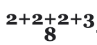
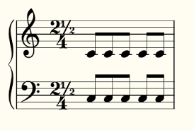

# ADR-0033: Time Signature Architecture

## Table of Contents
- [Status](#status)
- [Context](#context)
  - [Time Signature Complexity in Professional Notation](#time-signature-complexity-in-professional-notation)
  - [String-Based Entry Paradigm](#string-based-entry-paradigm)
- [Decision](#decision)
- [Supported Time Signature Types](#supported-time-signature-types)
  - [Basic Signatures](#basic-signatures)
  - [Additive metres](#additive-metres)
  - [Multiple Groups (Cross-Unit Additive)](#multiple-groups-cross-unit-additive)
  - [Breve and Longa Units](#breve-and-longa-units)
  - [Dotted Units](#dotted-units)
  - [Fractional Beat Counts (Halves)](#fractional-beat-counts-halves)
  - [Irrational metres](#irrational-metres)
  - [Alternate Descriptors](#alternate-descriptors)
- [Architecture](#architecture)
  - [String Notation Format](#string-notation-format)
  - [Internal Representation](#internal-representation)
  - [Duration Computation](#duration-computation)
  - [Presentation Modes](#presentation-modes)
- [Integration with Musical System](#integration-with-musical-system)
  - [RhythmicItem Trait](#rhythmicitem-trait)
  - [Piece-Level vs Measure-Level](#piece-level-vs-measure-level)
  - [Accessor/Mutator Methods](#accessormutator-methods)
- [Design Rationale](#design-rationale)
  - [Why String-Based Entry](#why-string-based-entry)
- [Future Extensions](#future-extensions)
- [References](#references)

## Status
Accepted and implemented - November 8, 2025

## Context

### Time Signature Complexity in Professional Notation

Modern music notation requires sophisticated time signature support spanning from common metres (4/4, 3/4) to highly specialized notations used in contemporary classical music. Professional engraving software must handle:

1. **Standard metres**: Common time, cut time, numeric time signatures (4/4, 3/4, 6/8)
2. **Additive metres**: Bulgarian and Balkan music (7/8 as 2+2+3, 5/4 as 3+2)
3. **Historical notation**: Breve (B) and longa (L) as time units from early music
4. **Contemporary notation**: Fractional beat counts (Grainger, Chávez: 2½/4)
5. **Pedagogical notation**: Orff-style note symbols as denominators
6. **Irrational metres**: Boulez, Ferneyhough, Finnissy (4/3, 5/7)

The challenge is providing a unified architecture that handles all these cases consistently while maintaining simplicity for common use cases.

### String-Based Entry Paradigm

Following Ooloi's architectural principle of human-readable string representations (established in ADR-0026 for pitches), time signatures use simple string notation for all input and storage. This provides:

- **Intuitive entry**: Users type exactly what they see in the score
- **Consistent syntax**: Same pattern handles simple and complex metres
- **Parseable structure**: Unambiguous grammar enables robust parsing
- **Readable persistence**: Stored files remain human-inspectable

## Decision

We implement a **comprehensive string-based time signature system** that:

1. **Accepts string descriptors** for all time signature types with consistent syntax
2. **Parses to structured representation** preserving all notation details
3. **Computes duration automatically** from parsed structure using rational arithmetic
4. **Supports fractional counts** starting with halves (n.5, n½), extensible to quarters
5. **Provides alternate descriptors** for 6/8 ↔ 3/4 equivalencies
6. **Integrates with RhythmicItem** trait for polymorphic duration operations
7. **Maintains immutability** with computed, non-settable duration fields

## Supported Time Signature Types

### Basic Signatures

**Common/simple metres** with single numerator and denominator:


```clojure
"4/4"   ; Common time (quarter note = 1 beat, 4 beats per measure)
"3/4"   ; Waltz time
"6/8"   ; Compound metre (eighth note = 1 beat, 6 beats per measure)
"2/2"   ; Cut time / alla breve
```

**Special notation shortcuts** (case-insensitive):

```clojure
"C"     ; Common time symbol (equivalent to 4/4)
"c"     ; Lowercase also accepted
"cut"   ; Cut time / alla breve (equivalent to 2/2)
"CUT"   ; Any casing accepted
```

**Internal representation:**
```clojure
{:descriptor "4/4"
 :groups [{:count [4] :duration 1/4}]
 :duration 1
 :unit-form :default}

{:descriptor "C"        ; Original notation preserved for display
 :groups [{:count [4] :duration 1/4}]  ; Parsed as 4/4
 :duration 1
 :unit-form :none}

{:descriptor "cut"      ; Original notation preserved
 :groups [{:count [2] :duration 1/2}]  ; Parsed as 2/2
 :duration 1
 :unit-form :none}
```

### Additive metres

    

**Grouped counts within single unit** showing metric subdivision:

```clojure
"2+3/4"     ; 5/4 grouped as 2+3 (Bulgarian folk rhythms)
"3+2+2/8"   ; 7/8 in three groups
"2+2+3/8"   ; 7/8 alternative grouping
```

**Internal representation:**
```clojure
{:descriptor "2+3/4"
 :groups [{:count [2 3] :duration 1/4}]
 :duration 5/4}
```

### Multiple Groups (Cross-Unit Additive)

    

**Multiple groups with different denominators** for complex additive metres:

```clojure
"2/4+3/8"       ; Two quarter notes + three eighths = 7/8
"1/4+1/4+3/8+1/4"  ; Complex cross-unit grouping
"3+2/8+6/16"    ; Combining grouped counts with multiple groups
```

**Internal representation:**
```clojure
{:descriptor "2/4+3/8"
 :groups [{:count [2] :duration 1/4}
          {:count [3] :duration 1/8}]
 :duration 7/8}
```

### Breve and Longa Units

**Historical time units** from early music notation:

```clojure
"2/B"   ; Breve (B = double whole note, duration 2)
"1/L"   ; Longa (L = quadruple whole note, duration 4)
"2/B+3/4"  ; Mixed breve and modern notation
```

**Internal representation:**
```clojure
{:descriptor "2/B"
 :groups [{:count [2] :duration 2}]
 :duration 4
 :unit-form :note}
```

### Dotted Units

**Orff notation** with optional dotted denominators for pedagogical clarity:

    

```clojure
"3/4"    ; Quarter note as beat unit (no dot)
"2/4."   ; Dotted quarter as beat unit (with dot)
"3/8"    ; Eighth note as beat unit (no dot)
"4/4."   ; Dotted quarter as beat unit (with dot)
```

**Internal representation:**
```clojure
{:descriptor "3/4"
 :groups [{:count [3] :duration 1/4}]  ; Simple duration
 :duration 3/4
 :unit-form :note}

{:descriptor "2/4."
 :groups [{:count [2] :duration [1/4 1]}]  ; [base-duration dots]
 :duration 3/4
 :unit-form :note}
```

**Note**: Dotted duration `[1/4 1]` computes as `1/4 * (2 - 1/2^1) = 3/8` per dot. The dot is optional in Orff notation - both dotted and non-dotted forms are valid.

### Fractional Beat Counts (Halves)

**Fractional numerators** appearing in Grainger, Chávez, and other 20th-century composers:



```clojure
"2.5/4"     ; Decimal notation (easy to type)
"2½/4"      ; Unicode half (U+00BD) (visual fidelity)
".5/4"      ; Bare half (decimal)
"½/4"       ; Bare half (Unicode)
"1.5+2½+3/4"  ; Mixed fractional and integer counts
```

**Internal representation** preserves exact notation:
```clojure
{:descriptor "2.5/4"
 :groups [{:count [[5/2 "2.5"]] :duration 1/4}]
 :duration 5/8}

{:descriptor "2½/4"
 :groups [{:count [[5/2 "2½"]] :duration 1/4}]
 :duration 5/8}
```

**Heterogeneous count vectors** support mixed notation:
```clojure
{:descriptor "2.5+3/8"
 :groups [{:count [[5/2 "2.5"] 3] :duration 1/8}]
 :duration 11/16}
```

**Restrictions (Phase 1)**:
- **Supported**: Halves only (`.5`, `½`)
- **Rejected**: Quarters (`.25`, `¼`), three-quarters (`.75`, `¾`), arbitrary decimals (`.3`, `.7`)
- **Rationale**: Halves appear in published repertoire (Grainger, Chávez); quarters are theoretical

### Irrational metres

**Fully supported** - irrational denominators (non-power-of-2):


```clojure
"4/3"    ; 4 beats, each 1/3 of whole note
"5/7"    ; 5 beats, each 1/7 of whole note
"3/5"    ; 3 beats, each 1/5 of whole note
"2/3+1/5" ; Multiple groups with irrational units
```

**Internal representation:**
```clojure
{:descriptor "4/3"
 :groups [{:count [4] :duration 1/3}]
 :duration 4/3}

{:descriptor "5/7"
 :groups [{:count [5] :duration 1/7}]
 :duration 5/7}
```

These appear in Boulez, Ferneyhough, and Finnissy scores. The implementation accepts any positive integer denominator, making all mathematical time signatures representable.

### Alternate Descriptors

**Support for displaying alternate metric interpretations** shown in parentheses to the right of the primary time signature.


**Two primary use cases:**

**1. Metric stress relationships** - Same duration, different grouping:
```clojure
{:descriptor "6/8"
 :alternate-descriptor "3/4"
 :alternate-groups [{:count [3] :duration 1/4}]}
```
Display: **6/8** with **(3/4)** in parentheses to the right of the main metre. Indicates compound metre (6/8) can be felt as simple metre (3/4) with different stress pattern.

**2. Triplet relationships** - Metric transformation indication:
```clojure
{:descriptor "3/8"
 :alternate-descriptor "9/16"
 :alternate-groups [{:count [9] :duration 1/16}]}
```
Display: **3/8** with **(9/16)** in parentheses to the right. Indicates metric relationship where the 3/8 measure may have an implicit triplet relationship to the preceding metre (3 eighth notes containing 9 sixteenth-note subdivisions).

**Common scenarios:**
- **6/8 ↔ 3/4**: Compound vs simple metre interpretation
- **3/4 ↔ 6/8**: Simple metre felt in compound grouping
- **3/8 ↔ 9/16**: Triplet subdivision relationship
- **2/4 ↔ 6/8**: Duple vs compound duple relationships

**Important note:**
The alternate descriptor and its parsed `:alternate-groups` are **purely presentational**. The duration computed from the alternate descriptor is never used for any musical calculations. Only the primary `:descriptor` and its `:duration` field determine measure length and temporal behavior. The alternate descriptor provides visual indication of metric relationships (stress patterns, implied tuplet subdivisions) but does not affect tempo or duration calculations.

## Architecture

### String Notation Format

**Grammar** (EBNF-style):
```
time-signature ::= special-symbol | standard-notation
special-symbol ::= ('C' | 'c') | ('CUT' | 'cut' | 'Cut' | ...)  ; case-insensitive
standard-notation ::= group ('+' group)*
group          ::= counts '/' unit dotted?
counts         ::= count ('+' count)*
count          ::= integer | fractional-decimal | fractional-unicode
integer        ::= [1-9][0-9]*
fractional-decimal ::= ([0-9]+)? '.' '5'
fractional-unicode ::= ([0-9]+)? '½'
unit           ::= integer | 'B' | 'L'
dotted         ::= '.'
```

**Special symbols**:
- `C` or `c` (case-insensitive) - Common time, equivalent to 4/4
- `cut` (case-insensitive) - Cut time / alla breve, equivalent to 2/2
- **Must appear standalone** - cannot be combined with other notation

**Whitespace**: Ignored around operators (`+`, `/`, `.`)

**Examples**:
- `"C"` or `"c"` - common time (special symbol)
- `"cut"` or `"CUT"` - cut time (special symbol)
- `"4/4"` - basic
- `"2+3/4"` - additive
- `"2/4+3/8"` - multiple groups
- `"2.5/4"` - fractional
- `"2½/4"` - fractional Unicode
- `"4/4."` - dotted
- `"2/B"` - breve

### Internal Representation

**TimeSignature record structure:**
```clojure
(defrecord TimeSignature
  [descriptor              ; String: original notation
   groups                  ; Vector of group maps
   duration                ; Ratio: total measure duration
   unit-form               ; Keyword: :default | :note | :none
   alternate-descriptor    ; String (nilable): alternate notation
   alternate-groups])      ; Vector (nilable): parsed alternate groups
```

**Group map structure:**
```clojure
{:count [2 3]        ; Vector of count values (integers or [ratio string] pairs)
 :duration 1/4}      ; Rational or [base dots] for dotted units
```

**Count value types:**
```clojure
;; Integer count (backward compatible)
2

;; Fractional count (preserves notation)
[5/2 "2.5"]   ; Decimal notation
[5/2 "2½"]    ; Unicode notation
```

**Heterogeneous count vectors:**
The count vector supports both integers and `[ratio string]` pairs in the same vector. This design enables:
- **Backward compatibility**: Existing integer-only code unchanged
- **Notation preservation**: `2.5` and `2½` both compute to `5/2` but render differently
- **Minimal overhead**: Type check with `(if (vector? c) (first c) c)` extracts rational value

**Example heterogeneous vector:**
```clojure
{:descriptor "1.5+2½+3/4"
 :groups [{:count [[3/2 "1.5"] [5/2 "2½"] 3] :duration 1/4}]}
```

**Display extraction:**
```clojure
(defn display-count [c]
  (if (vector? c)
    (second c)  ; Return notation string for fractional
    (str c)))   ; Convert integer to string
```

**Important: `:groups` is an internal implementation detail.** The structure of group maps may evolve to support additional features such as automatic beam breaking based on metric subdivision patterns. Client code should not depend on the specific structure of this field. Access time signature properties through the public API (`api/get-descriptor`, `api/get-duration`, `api/get-unit-form`, `api/get-alternate-descriptor`, `api/set-descriptor`, etc.) rather than directly inspecting `:groups`.

### Duration Computation

**Automatic computation** from parsed groups structure:

```clojure
(defn compute-group-duration
  [{:keys [count duration]}]
  (let [count-values (map #(if (vector? %) (first %) %) count)
        count-sum (reduce + count-values)
        rational-duration (rationalize-duration duration)]
    (* count-sum rational-duration)))
```

**Examples:**
- `"4/4"` → `4 * 1/4 = 1`
- `"2.5/4"` → `5/2 * 1/4 = 5/8`
- `"2+3/4"` → `(2+3) * 1/4 = 5/4`
- `"2/4+3/8"` → `2*1/4 + 3*1/8 = 7/8`
- `"4/4."` → `4 * 3/8 = 3/2` (dotted duration)

### Presentation Modes

**:unit-form field** controls denominator presentation:

- **:default** - Standard numeric notation (`"4/4"`)
- **:note** - Orff-style note symbol as denominator
- **:none** - No unit shown (unconventional, supported for completeness)

## Integration with Musical System

### RhythmicItem Trait

TimeSignature implements RhythmicItem trait from ADR-0023 (Shared Model Contracts):

```clojure
;; Duration accessors use computed field
(m/defmethod i/get-duration TimeSignature [ts]
  (:duration ts))

(m/defmethod i/get-rationalized-duration TimeSignature [ts]
  (:duration ts))  ; Already rationalized

;; Duration is NOT settable - derived from signature string
(m/defmethod i/set-duration TimeSignature [ts _]
  (throw (ex-info "Cannot set duration - derived from signature")))
```

**Rationale**: Duration is **computed property**, not independent field. Modifying duration without updating descriptor would create inconsistency.

### Piece-Level vs Measure-Level

**Two application contexts:**

1. **Piece level** (`:time-signatures` field, plural):
   - ChangeSet of time signatures across piece
   - Applied at measure boundaries
   - Example: M1=4/4, M17=3/4, M33=6/8

2. **Measure level** (`:time-signature` field, singular):
   - Optional override for single measure
   - Rare: only for pickup measures or local metric changes
   - Overrides piece-level signature if present

### Accessor/Mutator Methods

**Polymorphic methods** following ADR-0023 patterns:

```clojure
;; Attribute accessors
(get-descriptor ts)              ; Returns "4/4"
(get-unit-form ts)               ; Returns :default
(get-alternate-descriptor ts)    ; Returns "3/4" or nil

;; Attribute mutators (immutable - returns new instance)
(set-descriptor ts "3/4")        ; Validates, reparses, recomputes duration
(set-unit-form ts :note)         ; Changes presentation mode
(set-alternate-descriptor ts "2+2/4")  ; Validates, parses alternate groups
```

**:around methods** ensure validation and recalculation:

```clojure
(m/defmethod i/set-descriptor :around TimeSignature
  [ts new-descriptor]
  (validate-descriptor! new-descriptor)
  (let [result (next-method ts new-descriptor)
        {:keys [groups duration]} (parse-time-signature new-descriptor)]
    (assoc result :groups groups :duration duration)))
```

## Design Rationale

### Why String-Based Entry

**Alternatives considered:**
1. **Structured GUI inputs** (separate fields for numerator, denominator, groupings)
2. **Compound objects** (Igor Engraver style: explicit count/unit objects)
3. **String notation** (Ooloi choice)

**String advantages:**
- **Direct transcription**: Type exactly what appears in score
- **Universal syntax**: Same pattern for simple and complex metres
- **Copy-paste friendly**: Can paste from text documents
- **Human readable**: No object serialization abstraction
- **Consistent with Ooloi philosophy**: Follows pitch string pattern (ADR-0026)

## Future Extensions

### Arbitrary Numerator Fractions

**Potential future extension** if demand materializes:

```clojure
"2.25/4"   ; Quarters
"2¼/4"     ; Unicode quarter
"2.75/4"   ; Three-quarters
"2¾/4"     ; Unicode three-quarters
```

**Implementation straightforward:**
- Update `parse-count` regex patterns
- Add quarter/three-quarter cases to parser
- No architecture changes required

**Current status**: Not implemented - no documented repertoire usage found.

## References

- [ADR-0023: Shared Model Contracts](0023-Shared-Model-Contracts.md) - RhythmicItem trait integration
- [ADR-0026: Pitch Representation and Operations](0026-Pitch-Representation-and-Operations.md) - String-based representation pattern
- Grainger, Percy: "Lincolnshire Posy" (1937) - Fractional metres
- Chávez, Carlos: Symphony No. 2 "Sinfonía India" (1935) - Fractional metres
- Boulez, Pierre: Theoretical writings on fractional metres
- Orff, Carl & Keetman, Gunild: "Music for Children" (Orff-Schulwerk) - Note-symbol time signatures
- Jaques-Dalcroze, Émile: "Le Rythme, la musique et l'éducation" (1920) - Pedagogical note-based time signatures
