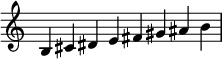
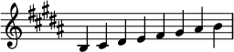
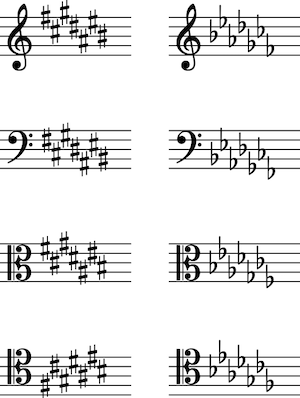
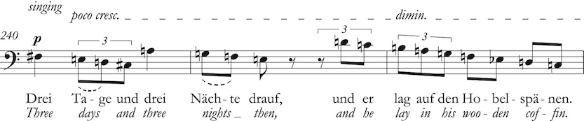
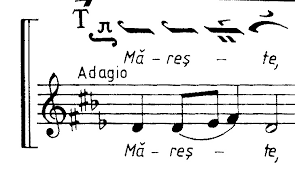
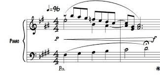
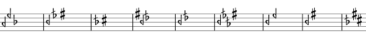

# ADR-0034: Key Signature Architecture

## Table of Contents
- [Status](#status)
- [Context](#context)
- [Decision](#decision)
  - [Core Architecture](#core-architecture)
  - [Standard Modes](#standard-modes)
  - [Keyless Mode](#keyless-mode)
  - [Custom Key Signatures](#custom-key-signatures)
  - [Per-Octave Custom Key Signatures](#per-octave-custom-key-signatures)
  - [Microtonal Key Signatures](#microtonal-key-signatures)
  - [Custom Metadata](#custom-metadata)
  - [Accidentals Structure Summary](#accidentals-structure-summary)
- [Integration with Engraving](#integration-with-engraving)
- [Storage in Piece](#storage-in-piece)
- [Validation](#validation)
- [Consequences](#consequences)
- [References](#references)

## Status
Accepted

## Context

Key signatures in music notation serve as engraving instructions that define which notes are considered "normal" (without printed accidentals) within a given musical context. In Ooloi, all pitches are stored as sounding pitches ([ADR-0026](0026-Pitch-Representation-and-Operations.md)), so key signatures are purely presentational constructs that guide the engraving engine in deciding when to print accidentals.

  -->  

The system must support:
- Traditional Western key signatures (major, minor, modal)
- Keyless notation (no tonal center, all accidentals explicit)
- Mixed accidentals (sharps and flats in the same signature)
- Per-octave variations (Bartók-style octave-shifting signatures)
- Microtonal systems (quarter-tones, sixth-tones, arbitrary EDO systems)

## Decision

### Core Architecture

**Note on Internal vs. User-Facing Interface:**
This ADR describes the **internal representation** of key signatures within Ooloi's data model. This is not what end users encounter in dialog boxes or the UI. Like time signatures ([ADR-0033](0033-Time-Signature-Architecture.md)), which use an intuitive descriptor string (e.g., `"4/4"`, `"3+2+3/8"`), key signatures may also support a `:descriptor` field for standard cases, enabling simple user input like `"Eb major"` or `"D Dorian"`. However, key signatures are considerably more complex than time signatures when custom key signatures, per-octave variations, and microtonal systems are considered. Therefore, the full internal representation described here is necessary to support all use cases, while the user interface can provide simplified input methods for common scenarios.

Key signatures are represented by the `KeySignature` record:

```clojure
(defrecord KeySignature [mode tonic accidentals custom])
```

**Fields:**
- `:mode` — Keyword identifying the mode type (`:ionian`, `:aeolian`, `:dorian`, etc., or `:custom`)
- `:tonic` — String representing the tonic pitch (e.g., `"G"`, `"F#"`, `"Bb"`), octave ignored
- `:accidentals` — Map specifying which accidentals are "normal" for this key
- `:custom` — Optional metadata map (only for custom mode)

### Standard Modes

Standard modes use the traditional Western diatonic system based on the circle of fifths. The mode determines the intervallic pattern, and the tonic determines which pitch classes are altered.

 

**Supported modes:**

| Mode | Aliases | Mode Offset | Natural Mode of C |
|------|---------|-------------|-------------------|
| `:ionian` | `:major` | 0 | C |
| `:dorian` | — | -2 | D |
| `:phrygian` | — | -4 | E |
| `:lydian` | — | +1 | F |
| `:mixolydian` | — | -1 | G |
| `:aeolian` | `:minor` | -3 | A |
| `:locrian` | — | -5 | B |

**Accidentals derivation:**
For standard modes, accidentals are computed using the circle-of-fifths algorithm:

1. Calculate the tonic's position on the circle of fifths relative to C
2. Apply the mode's offset (to ensure natural modes of C have zero accidentals)
3. Generate the accidental map by taking the appropriate number of sharps or flats from the circle

**Common key signature examples:**

| Tonic | Mode | Accidentals | Notes |
|-------|------|-------------|-------|
| C | ionian/major | `{}` | No sharps or flats |
| G | ionian/major | `{"F" :sharp}` | 1 sharp |
| D | ionian/major | `{"F" :sharp, "C" :sharp}` | 2 sharps |
| F | ionian/major | `{"B" :flat}` | 1 flat |
| Bb | ionian/major | `{"B" :flat, "E" :flat}` | 2 flats |
| D | dorian | `{}` | Natural mode of C |
| A | aeolian/minor | `{}` | Natural mode of C |
| D | aeolian/minor | `{"B" :flat}` | Same as F major |
| E | phrygian | `{}` | Natural mode of C |
| F | lydian | `{}` | Natural mode of C |




### Keyless Mode

Keyless notation represents music without a tonal center, where every accidental must be explicitly notated. 



In the above example from Alban Berg's *Wozzeck* (1914-1922), each note has an accidental. This can further be controlled through settings on the piece, instrument, or staff to show accidentals (a) only where necessary, (b) for all notes except repeated notes, or (c) for all notes _including_ repeated notes. The *Wozzeck* example uses (b), which was typical for the 2nd Vienna School during this period.

**Specification:**
- `:mode` = `:keyless`
- `:tonic` must be `nil`
- `:accidentals` = `{}` (empty map)

**Example:**
```clojure
(create-key-signature :mode :keyless)
;; => :accidentals {}
```

**Rationale:**
Keyless notation is essential for music where traditional key signatures are meaningless or misleading. By setting accidentals to an empty map, the engraving engine treats all notes as requiring explicit accidentals when they differ from natural (according to a, b, and c above).

### Custom Key Signatures

Custom key signatures allow users to specify accidentals explicitly, supporting non-standard systems that cannot be represented by traditional modes.

  

**Architecture:**
For custom mode, the user provides the `:accidentals` map directly rather than having it computed. This enables arbitrary combinations of sharps, flats, and microtonal accidentals.

**Tonic specification:**
Custom key signatures can optionally specify a `:tonic` (e.g., `"C"`, `"F#"`), or the tonic can be `nil` for atonal or non-tonal systems. The tonic serves as metadata for display or theoretical analysis but does not affect the accidentals.

**Simple custom (same for all octaves):**
```clojure
;; With tonic
(create-key-signature
  :mode :custom
  :tonic "C"
  :accidentals {"F" :sharp, "B" :flat})

;; Without tonic (atonal)
(create-key-signature
  :mode :custom
  :accidentals {"F" :sharp, "B" :flat})
```

The accidentals map uses string keys (letter names) and keyword values (accidental types). All octaves follow the same specification.

**Rationale:**
Mixed sharp/flat signatures appear in some 20th-century works and are necessary for certain non-Western systems. By accepting explicit accidental specifications, the system supports any arbitrary combination. The optional tonic (or `nil`) allows theoretical labeling without constraining the accidental structure.

### Per-Octave Custom Key Signatures

Some contemporary notation systems require different accidentals in different octaves (e.g., Bartók's octave-shifting key signatures).

**Architecture:**
Per-octave accidentals use a nested map structure:

```clojure
{"default" {letter accidental}
 octave {letter accidental}}
```

The structure **must** include a `"default"` key that specifies the baseline accidentals for all octaves. Specific octave numbers (0-9) override the default for those octaves only.

**Example:**
```clojure
(create-key-signature
  :mode :custom
  :accidentals {"default" {"F" :sharp}        ; F# in all octaves by default
                3 {"F" :natural}              ; Override: F natural in octave 3
                5 {"F" :double-sharp}})       ; Override: F## in octave 5
```

**Octave specification:**
- The `"default"` key is **required** and defines the baseline for all octaves
- Octave keys (integers 0-9) override the default for specific octaves
- Each octave can have independent accidental specifications
- Missing octave keys inherit the default specification

**Rationale:**
Per-octave specifications enable Bartók-style notation where the same letter name has different default accidentals in different registers. This is essential for certain 20th-century compositional techniques.

### Microtonal Key Signatures

Microtonal systems require accidentals beyond the standard sharp/flat system. The architecture supports arbitrary accidental types within the constraints of staff-based notation.



**Notational Constraint:**
Key signatures assume staff-based notation with 7 letter names (A-G). The `:edo` field describes the tuning system, but all pitches must still be spelled using letter names with appropriate accidentals. Systems that require fundamentally different spelling systems (e.g., 19-EDO, 22-EDO with native spelling) are outside the scope of this architecture.

**12-EDO vs Other Systems:**
The `:edo` field in the custom metadata specifies the equal divisions of the octave:
- `:edo 12` — Standard 12-tone equal temperament (default)
- `:edo 24` — Quarter-tone system (uses letter names + quarter-tone accidentals)
- `:edo 48` — Eighth-tone system (uses letter names + eighth-tone accidentals)

Other EDO systems (e.g., 31-EDO) can be documented via the `:edo` field, but the key signature still uses 7-letter spelling with microtonal accidentals.

**Accidental types:**
The system accepts arbitrary accidental keywords:
- Standard: `:sharp`, `:flat`, `:natural`, `:double-sharp`, `:double-flat`
- Quarter-tones: `:quarter-sharp`, `:quarter-flat`, `:three-quarter-sharp`, `:three-quarter-flat`
- Microtonal: Any keyword representing a microtonal alteration

**Glyph mapping:**
Microtonal accidentals used in custom key signatures require the `:accidentals` structure to be extended with glyph specifications. This maps cent ranges or specific cent values to SMuFL glyph codepoints, enabling the engraving engine to render arbitrary microtonal accidentals. The details of this extension are implementation-dependent and may involve:
- Cent-to-glyph mappings for each accidental keyword
- Range-based glyph selection for continuous microtonal systems
- Explicit glyph overrides for specific EDO systems

**Example (quarter-tone system):**
```clojure
(create-key-signature
  :mode :custom
  :accidentals {"D" :quarter-sharp, "E" :quarter-flat}
  :custom {:name "Quarter-tone System", :edo 24})
```

**Rationale:**
By accepting arbitrary accidental keywords and EDO specifications within the 7-letter staff framework, the system remains extensible to microtonal systems that can be represented on traditional staves. The engraving engine is responsible for mapping these keywords to appropriate glyphs, with glyph specifications provided as extensions to the accidentals structure.

### Custom Metadata

Custom key signatures can include optional metadata:

```clojure
{:name "Display Name"
 :edo 24}
```

**Fields:**
- `:name` — Display name for the key signature (defaults to `"Custom"`)
- `:edo` — Equal divisions of octave (defaults to `12`)

**Rationale:**
Metadata enables proper labeling and documentation of custom systems without affecting the core accidental logic. The `:edo` field provides context for interpreting accidental specifications in non-12-tone systems.

### Accidentals Structure Summary

Custom key signatures support two accidentals structures:

| Feature | Simple Structure | Per-Octave Structure |
|---------|------------------|----------------------|
| **Structure** | `{letter accidental}` | `{"default" {letter accidental}, octave {letter accidental}}` |
| **Example** | `{"F" :sharp, "C" :sharp}` | `{"default" {"F" :sharp}, 3 {"F" :natural}}` |
| **Keys** | Strings (letter names A-G) | `"default"` (required) + integers 0-9 (optional) |
| **Values** | Keywords (accidental types) | Maps of letter→accidental |
| **Behavior** | Same accidentals in all octaves | Default baseline + octave-specific overrides |
| **Use case** | Standard custom signatures | Bartók-style octave-shifting |
| **Detection** | No `"default"` key present | Contains `"default"` key |

**Automatic detection:**
The `baseline-from-key` function detects the structure by examining map keys:
- If contains `"default"` key → per-octave structure
- Otherwise → simple structure (expand to all octaves)

## Integration with Engraving

Key signatures provide the baseline for accidental display decisions. The key signature's `:accidentals` field defines which notes are considered "normal" (without printed accidentals) in a given musical context.

The engraving engine uses this baseline in combination with temporal tracking of alterations within measures to determine when accidentals must be printed. The complete algorithm for accidental display, including remembered alterations and measure-crossing behavior, is described in [ADR-0035](0035-Remembered-Alterations.md) (Remembered Alterations).

Key signatures interact with the engraving system through two primary functions:

**1. baseline-from-key**
Converts the key signature into a `{octave {letter accidental}}` structure that the engraver can query. For simple structures, expands to all octaves. For per-octave structures, returns as-is.

**2. requires-accidental?**
Determines whether a note needs a printed accidental by comparing:
- The note's accidental
- The key signature baseline
- The "remembered alterations" from earlier in the measure (see [ADR-0035](0035-Remembered-Alterations.md))

## Storage in Piece

Key signatures are stored in the `Piece` record as a `ChangeSet` on the `:key-signatures` field. This allows key signatures to change at any rhythmic position in the piece.

Key signature changes can occur:
- At any beat position within a measure
- Multiple times within the same measure
- At any `[measure beat]` position supported by the ChangeSet system

```clojure
;; Set G major at the beginning
(set-key-signature piece [0 0] (create-key-signature :mode :major :tonic "G"))

;; Change to E minor at measure 16, beat 0
(set-key-signature piece [16 0] (create-key-signature :mode :minor :tonic "E"))

;; Change to D major at measure 16, beat 3 (mid-measure change)
(set-key-signature piece [16 3] (create-key-signature :mode :major :tonic "D"))
```

**Rationale:**
Mid-measure key signature changes appear in contemporary music, polytonal passages, and modulating sequences where the key change must align with specific rhythmic events rather than barlines.

## Validation

Validation rules vary by mode type:

| Field | Standard Modes | Keyless Mode | Custom Mode |
|-------|----------------|--------------|-------------|
| `:mode` | ionian, dorian, phrygian, lydian, mixolydian, aeolian, locrian (or major/minor) | `:keyless` | `:custom` |
| `:tonic` | **Required** (valid pitch letter) | **Must be** `nil` | **Optional** (pitch letter or `nil`) |
| `:accidentals` param | **Forbidden** (computed) | **Forbidden** (computed to `{}`) | **Required** (user-provided) |
| `:custom` param | **Forbidden** | **Forbidden** | **Optional** (metadata) |
| Accidentals source | Computed via circle of fifths | Empty map `{}` | User-provided simple or per-octave map |

## Consequences

1. **Unified representation** — Standard and custom key signatures use the same `:accidentals` field, simplifying engraving logic
2. **Extensible microtonal support** — Arbitrary accidental keywords enable any microtonal system without code changes
3. **Per-octave flexibility** — Bartók-style and other octave-dependent systems are first-class citizens
4. **Clear separation of concerns** — Key signatures are purely presentational; all pitches remain sounding pitches
5. **Automatic structure detection** — Simple vs per-octave maps detected automatically, no explicit flags needed
6. **Composability** — Key signatures work seamlessly with ChangeSet system for mid-piece key changes

## References

- [ADR-0026: Pitch Representation](0026-Pitch-Representation-and-Operations.md) (establishes sounding pitch principle)
- [ADR-0033: Time Signature Architecture](0033-Time-Signature-Architecture.md) (similar ChangeSet usage pattern)
- [ADR-0035: Remembered Alterations](0035-Remembered-Alterations.md) (accidental display algorithm and temporal tracking)
