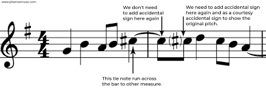
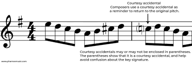
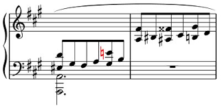
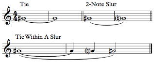

# ADR-0035: Remembered Alterations

## Table of Contents
- [Status](#status)
- [Context](#context)
  - [Problem Statement](#problem-statement)
- [Decision](#decision)
  - [Core Algorithm](#core-algorithm)
  - [Correctness Invariants](#correctness-invariants)
  - [Data Structure](#data-structure)
  - [Measure Boundary Behavior](#measure-boundary-behavior)
  - [Courtesy Accidentals](#courtesy-accidentals)
  - [Keyless Mode Behavior](#keyless-mode-behavior)
  - [Grace Notes](#grace-notes)
    - [Grace Notes at Measure Boundaries](#grace-notes-at-measure-boundaries)
  - [Accidental Settings](#accidental-settings)
  - [Performance Architecture](#performance-architecture)
- [Integration with Key Signatures](#integration-with-key-signatures)
- [Instrument-Level Scope](#instrument-level-scope)
- [Architectural Implications](#architectural-implications)
- [Consequences](#consequences)
- [References](#references)

## Status
Accepted

## Context

  
  

The decision of when to print an accidental in music notation is not simply "show an accidental when the note differs from the key signature." Accidentals have **temporal memory** within measures—once an accidental is used, it affects subsequent notes on the same staff position until the barline. This memory system, called "remembered alterations," is fundamental to readable music notation and has historically been one of the most complex aspects of notation software.

A correct accidental-memory model must evaluate pitches in musical time rather than in visual order. Multi-staff and multi-voice instruments require a representation in which temporal sequence is explicit and independent of staff structure or layout, so that remembered alterations follow the musical timeline.

Since Ooloi's internal representation is semantic, Ooloi can solve this problem algorithmically. The solution is deterministic: given the same musical input, the algorithm produces the same accidental decisions regardless of layout, staff assignment, number of staves in the instrument, or rendering order. The approach guarantees correctness for the domain of Western staff notation without relying on heuristics or special-case logic.

### Problem Statement

Accidental rendering depends on the state of previously encountered pitches. The rules for remembered alterations apply to the musical timeline, not to visual layout. In an instrument with multiple staves and voices, the sequence in which pitches appear rhythmically is not the same as the sequence implied by staff order or voice structure: it's still strictly left-to-right across all voices and staves.

The core problem is therefore:

* to define a representation of "remembered accidental state" at each temporal point,
* to determine how that state evolves when a new pitch is encountered, and
* to apply these rules consistently across all staves and voices of an instrument, independent of layout.

This requires a model in which the musical time-order of pitches is explicit, and in which all pitches belonging to the same instrument contribute to a single accidental-memory state across the entire instrument.

The domain's complexity arises from established practices and modern extensions:

Historical engraving practice:
- Accidentals apply within the measure in which they appear
- Memory resets at barlines (with exceptions for tied notes)
- Courtesy (cautionary) accidentals clarify ambiguous situations
- House styles vary in how strictly these rules are applied

Modern notation adds complexity:
- Mid-measure key signature changes
- Polytonal and atonal music
- Contemporary notation with non-standard accidentals
- Cross-octave interactions
- Grace notes and their participation in the memory system

Ooloi's key signature system ([ADR-0034](0034-Key-Signature-Architecture.md)) provides the **baseline** of which accidentals are "normal" for a given context. The remembered alterations system determines when that baseline has been **overridden** by explicit accidentals in the music, and when those overrides should be made explicit in the notation.

## Decision

### Core Algorithm

The remembered alterations system uses a **wave pattern** where accidental memory flows left-to-right through the music in temporal order:

1. **Start of measure**: Initialize remembered state to baseline (always)
2. **Check tied bypass**: If pitch is tied-to, apply bypass rules (see Measure Boundary Behavior)
3. **Process each note**: Compare against current remembered state
4. **Update after each note**: Accidental becomes new remembered state (except tied bypass)
5. **Measure boundary**: Always reset to baseline; prev-final and tied-ids available for next measure

**The central decision**: A note requires a printed accidental when its accidental differs from the **current remembered state** for that letter/octave combination.

**Exception - Tied note bypass**: Tied-to notes are continuations, not new attacks. They bypass accidental printing unless the notation changes:
- **Intra-measure ties** (position > 0): Always bypass (no print, no remembered update) - applies to all tie styles
- **Cross-measure ties at boundary** (position 0): Bypass in standard ties, print in French ties
- **Enharmonic respelling**: NEVER bypass - when tied notes change notation (F# → Gb), bypass is prevented and normal decision logic applies
- **No state matching required**: The tie itself guarantees pitch identity (Hz equivalence), but notation changes require explicit accidentals

**Key insight**: This single rule (with the tied bypass exception) handles both required accidentals (contradicting key signature) and courtesy accidentals (restating key signature after alteration). The bypass is unconditional - tied notes are continuations by definition. Position determines intra-measure vs cross-measure for French tie distinction.

**Architectural summary**: Remembered alterations are modeled as sparse per-octave deviations from a key-signature baseline, updated in strict temporal order across all voices and staves of an instrument. Each measure starts from baseline. Tied-to notes receive unconditional bypass (except French ties at cross-measure boundaries and enharmonic respelling). Enharmonic detection compares stored note strings to detect notation changes (F# → Gb), preventing bypass when notation changes. A single comparison rule determines all printed accidentals—required, courtesy, or cautionary—in a layout-independent, house-style-configurable way. Return format `[remembered decisions tied-target-endpoint-ids]` supports measure-to-measure state threading.

### Correctness Invariants

The remembered-alterations system maintains the following invariants:

1. **Deterministic evaluation**
   For a given piece state, key-signature baseline, and measure-initial remembered state, the algorithm produces the same accidental decisions regardless of layout, staff assignment, or rendering order.

2. **Position-based ordering**
   All pitches belonging to an instrument are evaluated in strictly increasing temporal order determined by their rhythmic position, independent of voice or staff structure.

3. **Single comparison rule**
   A printed accidental is required exactly when the pitch's accidental differs from the current remembered state for its letter and octave.

4. **Instrument-level memory**
   Remembered state is shared across all staves and voices of an instrument. Alterations from any staff or voice contribute to a single state threaded through the instrument's timeline.

5. **Baseline + deviation model**
   The remembered state at any point is the combination of the key-signature baseline and any per-octave deviations accumulated earlier in the measure. Deviations always override baseline; removal of deviation reverts to baseline.

6. **Measure-boundary rules**
   At measure boundaries, the initial remembered state is always the key-signature baseline. The previous measure's final state and tied-target-endpoint-ids are available for: (a) tied note bypass detection (unconditional for all tied-to notes, with French tie exception at position 0), and (b) courtesy-accidental detection (all modes). The tied bypass is unconditional—tied notes are continuations by definition—requiring no state matching. Bypassed notes produce no print and no remembered state update, requiring subsequent non-tied occurrences to restate vs baseline.

These six invariants, combined with the single comparison rule, constitute a complete solution to accidental rendering for Western staff notation. The algorithm handles all scenarios—single-staff, multi-staff, multi-voice, cross-staff, atonal, mid-measure key changes—through the same mechanism. No heuristics are required beyond configurable house-style settings.

### Data Structure

Remembered alterations use an optimized structure that minimizes memory usage while enabling efficient cross-octave operations:

```clojure
{:default {letter-string accidental-keyword}  ; Baseline from key signature (non-naturals only)
 letter-string {octave accidental-keyword}}   ; Per-letter octave deviations from default

;; Example: G major baseline (F# in key)
{:default {"F" :sharp}}  ; Only store non-natural from key signature

;; After F2 (natural) appears - F2 now contradicts the sharp default
{:default {"F" :sharp}
 "F" {2 :natural}}  ; F's octave 2 explicitly naturalized

;; After B4 (flat) appears - B is natural in key, now altered
{:default {"F" :sharp}
 "F" {2 :natural}
 "B" {4 :flat}}  ; B's octave 4 altered to flat

;; Multiple octaves of same letter grouped together
{:default {"C" :sharp}
 "C" {3 :natural, 4 :natural, 5 :flat}}  ; All C deviations grouped
 ```

**Structure properties:**

- **`:default` key** (keyword): Only stores non-`:natural` accidentals from key signature (maximally compact)
- **Letter keys** (strings): "A" through "G" - groups all octave deviations for that letter
- **Octave keys** (integers): Per-letter maps store deviations from default (including `:natural` when overriding a sharp/flat)
- **Accidental values** (keywords): `:natural`, `:sharp`, `:flat`, `:double-sharp`, `:double-flat`
- **Absence means natural**: If letter not found in default or letter-octave map, assume `:natural`
- **Lookup order**: Check letter-specific octave first, then `:default`, then assume `:natural`
- **Memory efficient**: ~7 entries for key signature + deviations only (vs 70 entries for full structure)
- **Performance**: Cross-octave checks are O(m) where m = octaves for this letter (not O(k) for all octaves)

**Operations provided by `ooloi.shared.ops.accidental-maps`:**

The structure is manipulated through a dedicated namespace that encapsulates lookup, update, conversion, and comparison operations:

```clojure
(require '[ooloi.shared.ops.accidental-maps :as acc-maps])

;; Lookup: check octave-specific first, fall back to default, then :natural
(acc-maps/lookup remembered octave letter)

;; Update: store deviation or remove if matches default (automatic cleanup)
(acc-maps/assoc-accidental remembered octave letter accidental)

;; Convert KeySignature to baseline structure
(acc-maps/from-key-signature key-sig)

;; Check if letter has different accidental in other octaves
(acc-maps/differs-in-other-octaves? remembered current-octave letter accidental)
```

**Letter-first grouping rationale:**
- Cross-octave courtesy accidentals are a common operation (triggered for every accidental)
- Grouping octaves by letter enables O(1) lookup followed by checking only relevant octaves
- Previous structure required iterating through all octaves to find if letter appears
- New structure: `(get acc-map "C")` returns `{3 :natural, 5 :flat}` directly
- Performance improvement: O(m) where m = octaves for this letter vs O(k) where k = all octaves
- Some house styles apply accidentals across all octaves, others treat each independently
- The structure supports both without code changes

### Measure Boundary Behavior

**Foundation**: Every measure starts with `initial-remembered = baseline` (from key signature). The previous measure's final state (`prev-final`) is available for:
1. Tied note bypass detection (tie targets must be tracked)
2. Courtesy accidental detection (all modes)

**Return format**: Functions return three values `[remembered decisions tied-target-endpoint-ids]` to support measure-to-measure state threading and tie tracking.

#### Tied Note Bypass Specification

**Core principle**: Tied-to notes are **continuations of the same note**, not new attacks. Therefore, they do not print accidentals. This bypass behavior is **unconditional** - the tie itself guarantees pitch identity (Hz equivalence). However, when notation changes enharmonically (F# → Gb), the visual representation differs and requires an explicit accidental.

**Bypass rules**:

1. **Intra-measure tied-to notes** (position > 0):
   - ALWAYS bypass (no print, no remembered update)
   - Applies to ALL tie styles (standard and French)
   - Musical rationale: Within a measure, tied notes are unambiguous continuations
   - **Exception**: Enharmonic respelling (see rule 4)

2. **Cross-measure tied-to notes at boundary** (position 0):
   - **Standard ties**: Bypass (no print, no remembered update)
   - **French ties**: Do NOT bypass (print accidental, update remembered)
   - Musical rationale: French style requires restating accidentals at barlines for visual clarity
   - **Exception**: Enharmonic respelling (see rule 4)

3. **Detection mechanism**:
   - Use `TakesAttachment` protocol: `get-endpoint-id`, `get-attachments`
   - Check if pitch's endpoint-id is in tracked tied-target-endpoint-ids
   - Position determines intra-measure vs cross-measure
   - No state matching required for Hz equivalence - tie guarantees pitch identity
   - Notation comparison required for enharmonic detection

4. **Enharmonic respelling** (NEW):
   - When tied notes change notation (F# → Gb, C# → Db, etc.), bypass is PREVENTED
   - Detection: Compare stored note string from tie source with current pitch note string
   - Implementation: tied-target-endpoint-ids is a map `{endpoint-id note-string}` (not a set)
   - When enharmonic change detected, normal decision logic applies (may print if differs from baseline)
   - Musical rationale: Different notation requires explicit accidental for visual clarity
   - Example: F#4 tied to Gb4 - same Hz, different letters, must show accidental

**Examples** (vertical bars = barlines, underscores = ties):

| Tie Style | Music                      | Result                    | Explanation |
|-----------|----------------------------|---------------------------|-------------|
| Standard  | `F# │ F# F#`              | First two print           | Baseline reset; first differs; second remembered |
| Standard  | `F#_ │ F# F#`             | First and third print     | m1[0] bypassed; m1[1] restates vs baseline |
| Standard  | `F#_ F#_ F# F#`           | m0[0], m0[2], m0[3] print | m0[1] bypassed (intra); m1[0] bypassed (cross, pos 0); m1[1] restates |
| French    | `F#_ │ F# F#`             | First two print           | m1[0] prints (French, pos 0); m1[1] remembered |
| French    | `F#_ F#_ F# F#`           | m0[0], m0[2], m0[3], m1[0] print | m0[1] bypassed (intra); m1[0] prints (French, pos 0); m1[1] bypassed (intra) |
| Standard  | C major, `F# │ F`         | Sharp, courtesy natural   | F matches baseline, differs from prev-final (courtesy) |
| Standard  | C major, `F#_ Gb Gb`      | Sharp, flat               | m0[1] enharmonic change (F# → Gb) prevents bypass |
| Standard  | C major, `F#_ Gb Gb Gb_ │ F#_` | Sharp, flat, flat, sharp | m0[1] enharmonic (F# → Gb); m1[0] enharmonic (Gb → F#) |

**Complex sequence validation** (m0: `F#_ F# F# F#_`, m1: `F#_ F# F# F#`):

| Position | Note   | Tied? | Standard Result | French Result | Explanation |
|----------|--------|-------|-----------------|---------------|-------------|
| m0[0]    | F#4    | →m0[1] | Print          | Print         | First attack |
| m0[1]    | F#4    | from m0[0] | Bypass     | Bypass        | Intra-measure (always bypass) |
| m0[2]    | F#4    | -     | Print          | Print         | New attack |
| m0[3]    | F#4    | →m1[0] | Print          | Print         | New attack |
| m1[0]    | F#4    | from m0[3], →m1[1] | Bypass | Print | Cross at pos 0 (French prints) |
| m1[1]    | F#4    | from m1[0] | Bypass     | Bypass        | Intra-measure (always bypass) |
| m1[2]    | F#4    | -     | Print          | Print         | New attack |
| m1[3]    | F#4    | -     | Print          | Print         | New attack |

**Architectural rationale**:

The unconditional bypass correctly models the musical reality that **tied notes are the same note continuing** (Hz equivalence). The tie itself guarantees pitch identity - there is no need to verify this by checking remembered state. State matching would be defensive programming that solves the wrong problem: the right place to validate tied note consistency is at tie creation (data model layer), not during rendering (formatting layer).

**Enharmonic detection** extends this principle: while Hz equivalence is guaranteed by the tie, **notation changes require explicit accidentals**. Comparing note strings (F# vs Gb) is the minimal check needed to detect this visual change. When notation differs, bypass is prevented and normal decision logic applies - the accidental prints if it differs from the current remembered state (baseline).

Position-based distinction for French ties is the simplest logic that correctly implements the engraving convention: French ties require restating accidentals at **measure boundaries only**, not within measures. Position determines the boundary condition naturally.

This approach is the **most stringent without overengineering**: it correctly implements the musical rule using the simplest logic that works universally across all modes (standard key signatures, keyless `:standard`, keyless `:all-except-repeated`, keyless `:all`), with enharmonic detection as a natural extension.

#### Empty Measures and Rest-Only Measures

**Architecture finding**: Measures with no pitched content break the cross-measure courtesy chain by causing baseline reset.

**Two scenarios**:
1. **Empty measures**: Measures with no items at all (not even rests)
2. **Rest-only measures**: Measures containing only rests (duration but no pitch)

**Behavior**: Both scenarios break cross-measure courtesy accidentals because there is no pitch content to maintain the remembered state.

**Example** (C major):
```
M0: F#4 whole note (prints sharp)
M1: Empty or rest-only
M2: F4 whole note (no courtesy natural - M1 reset the context)
```

**Musical rationale**: Visual gaps in notation reset performers' memory of alterations. Standard engraving practice treats measures without pitched content as natural breakpoints where accidental memory resets to baseline.

### Courtesy Accidentals

Courtesy (cautionary) accidentals occur when a note matches the key signature baseline but differs from what was recently altered. The single comparison rule handles these cases uniformly:

- **Within-measure**: A note matching the key signature but differing from the current remembered state prints an accidental
- **Cross-measure**: Dependent on house style settings and previous measure's final state
- **Cross-octave**: Dependent on house style settings; alterations in one octave may trigger courtesy accidentals in other octaves, optionally parenthesized

**Implementation: Preventing Repeated Courtesy Accidentals**

Courtesy accidentals should appear only once per letter/octave within a measure. Since courtesy accidentals match the key signature baseline, they don't update the `:remembered` state (no deviation to store). Without additional tracking, the algorithm would print courtesy accidentals on every subsequent occurrence.

The solution uses **ephemeral tracking** during measure processing:

```clojure
{:remembered {...}          ; Carries forward to next measure
 :decisions [...]           ; Accumulates accidental decisions
 :courtesy-shown {}}        ; Ephemeral: discarded at measure boundary
```

**Structure**: `{octave #{letters}}` tracks which courtesy accidentals have been shown in the current measure.

**Lifecycle**:
1. Initialize to `{}` at measure start
2. Update when courtesy accidental is shown
3. Check before showing courtesy accidental
4. Discard at measure boundary (only `:remembered` carries forward)

**Rationale**: Courtesy tracking is measure-scoped by nature. It prevents visual clutter from repeated courtesy accidentals while keeping the state lightweight. The structure uses sets for efficient membership testing and minimal memory overhead.

### Keyless Mode Behavior

Keyless key signatures (`:mode :keyless` in [ADR-0034](0034-Key-Signature-Architecture.md)) represent music without a tonal center—12-tone serial music, free atonal music, or chromatic passages. The `:keyless-accidentals` setting determines how accidentals are handled in keyless contexts:

**`:standard` mode** (default):
- Behaves like C major without a tonic
- Normal remembered alterations apply: accidental shown when it differs from remembered state
- Courtesy accidentals work traditionally (cross-octave warnings when enabled)
- Suitable for chromatic passages that still follow traditional accidental memory rules

**`:all-except-repeated` mode**:
- Show accidental on every pitch except immediate repetitions
- Repetition = same letter/octave/accidental as explicitly remembered
- Uses outlandish baseline trick: `{:default {"A" :unset, "B" :unset, ...}}` forces all pitches to be stored as deviations
- No courtesy accidentals (by design—atonal music doesn't need cross-octave warnings)
- Suitable for atonal music where every pitch change should be explicit

**`:all` mode**:
- Show accidental on every single pitch, including repetitions
- No state tracking needed—always print
- No courtesy accidentals (by design)
- Suitable for extreme clarity requirements or pedagogical contexts

The three modes provide a spectrum from traditional (`:standard`) to explicit (`:all-except-repeated`) to exhaustive (`:all`), enabling correct rendering of music from late-Romantic chromaticism through mid-20th-century atonality.

### Grace Notes

Grace notes are ornamental containers with zero metric duration that appear before main notes. They contain one or more pitches or chords and share the same rhythmic position as the following item in timewalk.

**Architectural decision**: Grace notes **participate fully in remembered alterations**. They read from the current remembered state and update it for subsequent notes (including the main note they precede).

**Behavior:**
- Grace notes are processed in temporal order at the position they share with the following note
- Grace items (pitches/chords within the grace container) process sequentially
- Each grace item compares against current remembered state (may print if differs)
- Each grace item updates remembered state (affects subsequent grace items and main note)
- All existing features apply: multi-voice state sharing, cross-staff integration, courtesy accidentals, simultaneity handling

**Example** (C major):
```
F#4 grace → F4 quarter → F4 quarter
Result: Grace prints sharp, first F prints natural, second F prints nothing (remembered)
```

**Rationale:**
- Follows traditional engraving practice (Gould's "Behind Bars", Gardner Read)
- Aligns with how performers mentally process grace notes as part of the temporal flow
- Consistent with Ooloi's position-based temporal model

**No configuration settings initially** Grace notes use standard behavior only. A boolean setting can be added later if real use cases emerge requiring grace notes to read state without updating it (conservative behavior for complex contemporary music).

**Implementation**: Grace detection via timewalk (zero duration containers with `:items` field). Grace items are processed as regular pitches within the position-based ordering, requiring no special-case logic beyond container detection.

#### Grace Note Positioning and Duration

While grace notes have zero metric duration and share the same rhythmic position as their target note, they must be assigned exact positions for correct temporal processing in the accidental pipeline.

**Problem**: Grace notes at metric position 1/2 must process AFTER notes at position 1/4 and BEFORE the target note at position 1/2. This requires position adjustment.

**Solution**: The `position-grace-notes-rhythmically` transducer transforms grace note positions from metric to exact positions based on typical performance timing.

**Duration Calculation**:

Grace note performance duration is tempo-dependent, using a standard speed per grace note of 85ms, given by the piece setting `:grace-note-base-duration-ms`, and adjusted for length depending on the tempo of the piece at the point where the grace note appears. A grace note's length in milliseconds (ms) is not fixed and depends on the musical context, but can range from approximately 30 ms to over 100 ms, with some examples showing durations around 50 ms to 350 ms. It is typically played very quickly to lead into a principal note, stealing a small amount of time from the notes around it, not from a fixed value. 

It is to be noted that grace note duration does not scale 1:1 with the tempo. If we assume a basic speed of 85ms in 120 BPM, increasing the tempo to 240 BPM will not halve grace note durations, nor will decreasing the tempo to 60 BMP result in twice as long grace notes. 

**Rationale for 85ms base**:
- Research indicates 50-125ms typical range at 120 BPM
- 85ms is middle-to-lower end: quick but not rushed
- Scales naturally: higher or lower BPM values do not scale grace note duration 1:1, but to a much lesser extent. There will be a function to determine the grace note value for tempos.

**Position Adjustment Algorithm**:

1. Convert duration to rational offset: `ms → fraction of measure` (tempo and time signature dependent)
2. Work backward from target using standard speed per grace note
3. Check if first grace note >= previous non-grace position
4. If collision detected, compress evenly to fit available space

**Example** (4/4 at 120 BPM, 3 grace notes):
```
Previous position: 1/4
Target position: 1/2
Standard speed: 85ms = 17/400 measure

Working backward:
  grace-3: 1/2 - 17/400 = 183/400
  grace-2: 183/400 - 17/400 = 166/400
  grace-1: 166/400 - 17/400 = 149/400

Check: 149/400 >= 1/4 (100/400)? YES → Use these positions
```

**Compression** (if collision):
```
Previous: 1/8, Target: 3/16, 5 grace notes
Grace-1 would be: 3/16 - 5×(17/400) = -10/400 < 1/8 → COLLISION

Available space: 3/16 - 1/8 = 25/400
Compressed speed: 25/400 / 5 = 5/400
Distribute evenly starting from 1/8
```

**Filter Helper**:

```clojure
(defn grace-pipeline-item?
  "Optional filter predicate for grace positioning pipeline (for performance optimization).

   Passes: pitches, grace containers, voice/measure/instrument markers, and grace end markers.
   Blocks: all other end markers and containers that position-grace-notes-rhythmically
   would pass through unchanged anyway.

   Note: position-grace-notes-rhythmically is fully composable and works correctly
   without this filter. This filter is purely an optimization to reduce processing
   of tuples that will pass through unchanged."
  [tuple]
  (or (pitch?? tuple)
      (grace?? tuple)
      (voice?? tuple)
      (measure?? tuple)
      (instrument?? tuple)
      (= tuple [:end :Grace nil])))
```

**Pipeline Integration** (see Performance Architecture section for complete implementation).

**Voice delimiters**: Timewalk emits Voice records in the stream. When `position-grace-notes-rhythmically` sees a Voice record, it resets its "previous position" state (voice boundary detected), then consumes the record (doesn't emit). This ensures grace positioning uses correct previous position per voice, not globally across concatenated stream.

**Container End Markers**: Timewalk emits `[:end <container> position]` markers after grace container contents. The position field (rational) ensures markers survive sorting in multi-voice scenarios.

**Critical placement**: `position-grace-notes-rhythmically` must run BEFORE sorting in multi-voice path to adjust positions and remove markers before `group-simultaneities` sees the stream.

**Key properties**:
- Primary goal: Grace notes as close to target as possible (musical realism)
- Constraint: Never overlap previous notes (correctness)
- Compression: Even distribution when crowded (fairness)
- Notated durations ignored: Grace note durations within container are purely notational

#### Grace Notes at Measure Boundaries

Grace note containers can appear both first and last in any measure, creating a critical edge case: grace notes at position 0 of measure M (where M > 0) are **displayed** at the beginning of M but **sound** at the end of M-1.

**Semantic Processing Principle**: Accidental decisions are made in the measure where grace notes SOUND, not where they are visually displayed. This ensures correct remembered alterations state for all temporal edge cases.

**Target Position Determination**:

Grace notes emit 4-element tuples `[pitch vpd adjusted-pos semantic-target-pos]` to enable flexible key signature reading:
- `adjusted-pos`: Where grace note sounds (rhythmic positioning from `position-grace-notes-rhythmically`)
- `semantic-target-pos`: Where grace note belongs structurally (grace container's position from timewalk)
- Regular notes: `semantic-target-pos` is `nil` (remain 3-element tuples for zero overhead)

This enables the `:grace-notes-use-target-key?` setting to control whether grace notes read key signatures at their temporal position (where they sound) or semantic position (where they belong).

**Target Position Algorithm:**

| Scenario | grace-measure | target-pos | pos (adjusted) | Target Measure | Target Pos |
|----------|---------------|------------|----------------|----------------|------------|
| Regular note | N/A | nil | any | measure-index | pos |
| Grace last in M | M | duration | ≥0 | M+1 | 0 |
| Grace first M=0 | 0 | 0 | <0 (negative) | 0 | 0 |
| Grace mid-measure | M | rational | varies | M | target-pos |
| Grace first M>0 (lookahead) | M+1 | 0 | end of M | M+1 | 0 |

**Key insight**: When `target-pos` equals the measure duration, grace notes target the next measure `[M+1, 0]` semantically. This correctly models grace notes appearing last in measure M as semantically belonging to the start of measure M+1.

**Lookahead Algorithm**:

When processing measure M:
1. Timewalk includes M+1's position-0 grace notes via lookahead (`:end-position 0`)
2. `position-grace-notes-rhythmically` receives M+1's grace notes in M's stream
3. Grace notes are repositioned to end of M using time signature duration as target
4. Accidental decisions process in M's context (correct remembered state)
5. Grace notes update M's remembered state, affecting M's subsequent notes

When processing measure M+1:
6. `position-grace-notes-rhythmically` skips M+1's position-0 grace notes (already processed by M)
7. M+1 continues with its remaining content using state updated by M's lookahead

**Example** (C major, measure 0 ends with F♮):
```
Measure 0: ... F4 quarter
Measure 1: [F#4 grace] G4 quarter (grace at position 0)

Processing M0 with lookahead:
  - F4 quarter updates state: F→♮
  - F#4 grace reads state (F→♮), prints sharp, updates state: F→#
  - Result: Grace rendered at end of M0, accidental correct

Processing M1:
  - Skip F#4 grace (already processed)
  - G4 quarter reads state: F→# (inherited from M0's lookahead)
```

**Measure 0 Exception**: Grace notes at position 0 of measure 0 cannot be processed via lookahead from a previous measure (no measure -1 exists to look ahead from). As an exceptional case, they process with negative positions (anacrusis behavior), reading from baseline state. This is the only scenario where grace notes receive negative positions—the standard approach is lookahead processing from the previous measure.

### Accidental Settings

The remembered alterations system is configured through five piece-level settings. Four settings control **decision logic** (which accidentals to print), while one controls **presentation** (how to render them):

**Decision Logic Settings:**

**`:courtesy-accidental-for-other-octaves?`** (boolean, default `true`)
- Controls whether cross-octave courtesy accidentals are printed
- `true`: Print courtesy accidental when same letter has different accidental in another octave (e.g., F# in octave 4, F natural in octave 5 triggers courtesy natural)
- `false`: Octaves are independent—no cross-octave courtesy accidentals
- **Used by**: Decision logic (affects which pitches receive `:courtesy-other-octave` type)

**`:french-ties?`** (boolean, default `false`)
- Controls whether tied-to notes at the start of a measure print an accidental (French style)
- `false` (standard): Tied-to notes at position 0 are bypassed unconditionally—no accidental is printed and remembered state is not updated (same as intra-measure ties)
- `true` (French style): Bypass is disabled only at measure boundaries—a tied-to note at position 0 is treated like a normal note (compares to baseline, prints if needed, updates remembered state)
- **Used by**: Decision logic (affects which notes print accidentals)

**`:keyless-accidentals`** (keyword, default `:standard`)
- Controls accidental behavior in keyless key signatures
- `:standard`: Normal remembered alterations, like C major without tonic
- `:all-except-repeated`: Show accidentals except immediate repeats (atonal music)
- `:all`: Show accidentals on every pitch including repeats (maximum clarity)
- **Used by**: Decision logic (affects baseline and memory behavior)

**`:grace-notes-use-target-key?`** (boolean, default `true`)
- Controls whether grace notes at key signature changes read the target key or temporal key
- `true` (default): Grace notes read key signature at their semantic target position (notational semantics—grace notes belong to the beat they precede)
- `false`: Grace notes read key signature at their temporal position (temporal semantics—grace notes sound before the beat)
- Applies when key change occurs at grace note target position
- **Used by**: Decision logic (affects which key signature grace notes use for baseline)

**Presentation Setting:**

**`:parenthesized-courtesy-accidental-for-other-octaves?`** (boolean, default `true`)
- Controls visual presentation of cross-octave courtesy accidentals
- `true`: Cross-octave courtesy accidentals rendered with parentheses (e.g., "(♮)" for visual distinction)
- `false`: Cross-octave courtesy accidentals use normal appearance
- **Used by**: Rendering layer only (decision logic returns `:courtesy-other-octave` type; renderer applies parentheses based on this setting)
- **Note**: This setting does NOT affect which accidentals are printed—only how they appear visually

These settings are accessed via the `ooloi.shared.api` namespace and configured per-piece, with future extensions possible for other levels.

### Performance Architecture

The algorithm uses a unified transducer pipeline that transparently handles both single-voice and multi-voice measures. The pipeline maintains zero-consing performance for measures with 0-1 voices while automatically consolidating voices across staves when necessary.

**Core implementation:**

```clojure
(defn accidental-decisions-for-measure
  [piece measure-index instrument-vpd key-sig prev-final prev-tied-ids]
  (let [baseline (acc-maps/from-key-signature key-sig)
        initial-remembered baseline
        initial-state {:remembered initial-remembered
                       :decisions []
                       :courtesy-shown {}
                       :tied-target-endpoint-ids (or prev-tied-ids {})}
        reducer (process-pitch-tuple piece key-sig prev-final measure-index)

        final-state (transduce
                     (comp
                      (timewalk {:boundary-vpd instrument-vpd
                                 :start-measure measure-index
                                 :end-measure (inc measure-index)
                                 :end-position 0
                                 :grace-end-markers? true})
                      (filter grace-pipeline-item?)
                      (position-grace-notes-rhythmically piece measure-index)
                      (merge-voices)
                      (filter pitch??)
                      (group-simultaneities)
                      (detect-simultaneity-conflicts))
                     (completing reducer)
                     initial-state
                     [piece])]
    final-state))
```

**Key architectural elements:**

1. **Grace note realisation** - The `position-grace-notes-rhythmically` transducer repositions grace note
  pitches from metric to exact positions. Grace notes are positioned using tempo-based duration calculation
  (85ms by default) working backward from the target note. Collision detection ensures grace notes never
   overlap the previous note, redistributing with shortened duration if necessary.

2. **Voice consolidation** - The `merge-voices` transducer consolidates multiple voices across staves into temporal order:
   - **0-1 voices**: Tuples pass through unchanged (zero-consing preserved)
   - **2+ voices**: Tuples accumulated per measure number and sorted by position before emission
   - Strategy determined per-measure-number based on voice count across all staves in scope
   - Receives structural markers (Instrument, Measure, Voice) from timewalk for strategy determination

3. **Simultaneity grouping** - The `group-simultaneities` transducer groups tuples by rhythmic position:
   - Singles pass through unchanged (zero allocation via volatiles)
   - Multiple tuples at same position emitted as `[:simultaneity [tuple1 tuple2 ...]]`
   - Keyword marker `:simultaneity` distinguishes groups from singles

4. **Pitch processing** - The `process-pitch-tuple` reducer handles both singles and groups:
   - Single tuple: `[item vpd position]` → processed directly via `make-accidental-decision`
   - Simultaneity: `[:simultaneity [tuples]]` → three-phase processing:
     1. Detect conflicts (O(n) pre-scan by letter)
     2. Process sequentially with `:simultaneity-conflicts` state
     3. Clean up conflict tracking

**Pipeline architecture:**

The pipeline consists of two distinct phases separated by explicit filters:

**Phase 1: Structural Processing** (operates on all tuple types including structural markers)
1. **`timewalk`** - Yields `[item vpd position]` tuples including structural markers (Instrument, Measure, Voice)
2. **`filter grace-pipeline-item?`** - Passes grace notes, pitches, and structural markers needed for positioning
3. **`position-grace-notes-rhythmically`** - Assigns real temporal positions to grace notes
4. **`merge-voices`** - Consolidates voices per measure number when necessary (passes through for 0-1 voices)

**Phase 2: Pitch Processing** (operates only on pitch tuples)
5. **`filter pitch??`** - Explicit boundary between structural and pitch processing phases
6. **`group-simultaneities`** - Groups tuples by rhythmic position
7. **`detect-simultaneity-conflicts`** - Detects conflicting accidentals in simultaneities
8. **`process-pitch-tuple`** - Makes accidental decisions, handling both singles and groups

**Zero-consing optimization:**

The pipeline preserves zero-consing performance for measures with 0-1 voices:
- `merge-voices` detects voice count per measure number across all staves in scope
- When 0-1 voices detected, tuples flow through without intermediate collection or sorting
- Only measures with 2+ voices incur the allocation cost of consolidation
- This optimization is transparent to the rest of the pipeline

**Simultaneity grouping benefits:**

- **Zero allocation for singles**: Tuples at unique positions pass through unchanged
- **Clean extension point**: Enables simultaneity-specific logic without complicating core algorithm
- **Unison deduplication**: Identical pitches (same Hz) deduplicate during processing
- **Conflict detection**: Letters with different accidentals in same simultaneity trigger courtesy
- **Sequential processing**: Each pitch in simultaneity sees accumulated state changes

**Simultaneity conflict detection:**

When multiple pitches occur at the same position with the same letter but different accidentals (e.g., C4 and C#5 in a chord), a two-phase process handles them:

1. **Detect conflicts** (O(n) pre-scan): Group pitches by letter, detect conflicting accidentals in the `group-simultaneities` transducer
2. **Process sequentially**: Each pitch sees accumulated remembered state changes in the reducer

The `:simultaneity-conflicts` set (format: `#{letter}`) is threaded through state only during simultaneity processing. Courtesy logic checks both temporal cross-octave changes AND simultaneity conflicts, ensuring visual clarity when the same letter has different accidentals at the same moment.

**Order independence:** The conflict detection ensures C4+C#5 produces identical results to C#4+C5, despite chord auto-sorting by frequency. The letter "C" with conflicting accidentals triggers courtesy for the matching pitch regardless of octave order.

## Integration with Key Signatures

Key signatures ([ADR-0034](0034-Key-Signature-Architecture.md)) provide the **baseline** for remembered alterations:

```clojure
(acc-maps/from-key-signature key-sig)
;; Converts key signature to {:default {letter accidental}} structure
;; Only stores non-natural accidentals for memory efficiency
;; For per-octave key signatures: preserves octave structure as-is
```

**Key signature changes mid-measure:**

When a key signature changes at position `[measure beat]`:
1. The remembered state up to the change point is discarded.
2. The new key signature becomes the baseline immediately.
3. All octave-specific deviations are cleared (fresh state).
4. Subsequent notes compare against the new baseline exactly as if a new measure had begun.
5. Courtesy accidentals are not applied across the key-change boundary (the key signature itself serves as the visual notification).

**Example** (G major → E minor mid-measure):
- Initial: `{:default {"F" :sharp}}`
- F natural appears in octave 4 before change → updates remembered to `{:default {"F" :sharp}, "F" {4 :natural}}`
- Key changes to E minor (same signature: F#) → baseline remains `{:default {"F" :sharp}}`
- F# appears in octave 4 after change → compares against remembered (:natural) → prints sharp
- After F# processed: `{:default {"F" :sharp}}` (deviation removed, matches default again)

## Instrument-Level Scope

Remembered alterations operate at the **instrument level**, encompassing all staves and voices of that instrument. All pitches contribute to the shared remembered state based on **rhythmic position** (horizontal placement).

**Rationale**: A performer reading an instrument's notation sees all staves and voices simultaneously. If the piano's right hand has F# at position 1/4 and the left hand has F natural at position 1/2 (on a different staff), the F natural affects the visual memory for subsequent F notes in either staff.

**Multi-staff instruments**: For piano, harp, organ, and choir (SATB on grand staff), all staves share accidental memory. Cross-staff notation works naturally because the entire instrument is scanned together.

**System-level separation**: Instruments in the same system do NOT share accidental memory. An oboe's F# does not affect a flute's F natural, even though they appear visually proximate on the page. The boundary is strictly at instrument level - accidental memory is an instrument property, not a system property or score property.

**Example** (piano cross-staff, G major):
```clojure
;; Piano (two staves):
;; Right hand (treble staff): F# at position 0
;; Left hand (bass staff): F natural at position 1/4
;; Right hand: F at position 1/2

;; After sorting by position: F#(0), F-natural(1/4), F(1/2)

;; Result:
;; Position 0: F# (treble) matches key → no print
;; Position 1/4: F natural (bass) contradicts remembered → print natural
;; Position 1/2: F (treble) contradicts remembered (:natural) → print natural (courtesy)
```

The bass F natural at position 1/4 forces a courtesy natural on the treble F at position 1/2, demonstrating cross-staff memory sharing.


## Architectural Implications

The remembered alterations decisions represent the **musical requirement** for accidentals based on key signature and temporal context. They apply universally to all layouts of this piece. Individual layouts may override these decisions for visual reasons, but the remembered alterations algorithm provides the semantic baseline.

### Decision Output Format

Each decision is a map containing:
```clojure
{:tuple [pitch vpd position]   ; Which pitch and where
 :type keyword}                 ; Semantic type (see below)
```

### Semantic Accidental Types

The system returns one of three **semantic types** that describe the musical function of the accidental, independent of visual presentation:

**`:normal`** - Required accidental
- The pitch's accidental differs from the current remembered state
- Includes both accidentals that contradict the key signature AND accidentals that contradict previous alterations within the measure
- Example: F# in C major, or F♮ after F# appeared earlier in the measure

**`:courtesy`** - Same-octave courtesy accidental
- The pitch matches the key signature baseline but differs from what was recently altered in the same octave
- Printed for clarity after a deviation has been introduced
- Example: F♮ in C major after F# appeared in the same measure (both in octave 4)

**`:courtesy-other-octave`** - Cross-octave courtesy accidental
- The pitch matches the key signature baseline but the same letter has a different accidental in another octave
- Only printed when `:courtesy-accidental-for-other-octaves?` setting is enabled
- Example: F♮ in octave 5 when F# exists in octave 4 within the same measure

### Separation of Concerns

This semantic type system enables clean separation between decision logic and presentation:

- **Decision logic** (this ADR): Returns semantic types describing *why* an accidental prints
- **Rendering layer**: Applies presentation settings to determine *how* to display it (parentheses, color, size, etc.)

For example, the `:parenthesized-courtesy-accidental-for-other-octaves?` setting is consulted by the rendering layer when displaying a pitch with type `:courtesy-other-octave`. The decision logic itself does not check this setting—it simply identifies the pitch as a cross-octave courtesy accidental.

This architecture ensures consistent musical interpretation across all visual representations while allowing flexible presentation styles.

## Consequences

**Positive:**

1. **Unified algorithm** - Single decision rule handles required and courtesy accidentals
2. **House style flexibility** - Settings control behavior without code changes
3. **Multi-voice temporal ordering** - Explicit sorting ensures correct left-to-right processing across all voices
4. **Tuple preservation** - Complete `[item vpd position]` tuples identify each pitch decision
5. **Performance optimized** - O(n log n) complexity acceptable for typical measure sizes
6. **Key signature integration** - Seamless interaction with standard, keyless, custom, per-octave, and microtonal key signatures
7. **French style supported** - Tie behavior configurable
8. **Cross-octave awareness** - Structure enables octave-specific house styles
9. **Musical semantics** - Decisions represent musical requirements, independent of layout choices
10. **State threading** - Pure functional approach with explicit data flow

**Neutral:**

1. **Settings complexity** - Multiple settings needed for different engraving traditions
2. **Sequential dependency** - Each measure depends on previous measure's final state (inherent in the problem domain)
3. **Instrument-level scope** - Scanning all staves of multi-staff instruments (e.g., piano, organ, choir) increases the number of pitches to sort, though still negligible for typical measures

## References

- [ADR-0026: Pitch Representation and Operations](0026-Pitch-Representation-and-Operations.md) (string-based pitch format, memoized `convert` function for parsing)
- [ADR-0034: Key Signature Architecture](0034-Key-Signature-Architecture.md) (provides baseline)
- [ADR-0029: Global Hash-Consing](0029-Global-Hash-Consing.md) (transduce pattern)
- [ADR-0014: Timewalk](0014-Timewalk.md) (temporal traversal)
