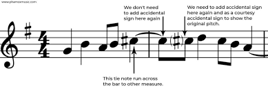
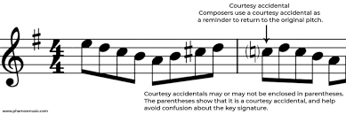
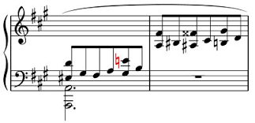
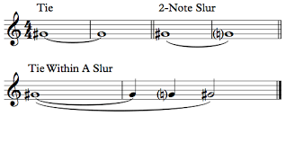

# ADR-0035: Remembered Alterations

## Table of Contents
- [Status](#status)
- [Context](#context)
  - [Problem Statement](#problem-statement)
- [Decision](#decision)
  - [Core Algorithm](#core-algorithm)
  - [Correctness Invariants](#correctness-invariants)
  - [Data Structure](#data-structure)
  - [Measure Boundary Behavior](#measure-boundary-behavior)
  - [Courtesy Accidentals](#courtesy-accidentals)
  - [Keyless Mode Behavior](#keyless-mode-behavior)
  - [Accidental Settings](#accidental-settings)
  - [Performance Architecture](#performance-architecture)
- [Integration with Key Signatures](#integration-with-key-signatures)
- [Instrument-Level Scope](#instrument-level-scope)
- [Architectural Implications](#architectural-implications)
- [Consequences](#consequences)
- [References](#references)

## Status
Accepted

## Context

  
  

The decision of when to print an accidental in music notation is not simply "show an accidental when the note differs from the key signature." Accidentals have **temporal memory** within measures—once an accidental is used, it affects subsequent notes on the same staff position until the barline. This memory system, called "remembered alterations," is fundamental to readable music notation and has historically been one of the most complex aspects of notation software.

A correct accidental-memory model must evaluate pitches in musical time rather than in visual order. Multi-staff and multi-voice instruments require a representation in which temporal sequence is explicit and independent of staff structure or layout, so that remembered alterations follow the musical timeline.

Since Ooloi's internal representation is semantic, Ooloi can solve this problem algorithmically. The solution is deterministic: given the same musical input, the algorithm produces the same accidental decisions regardless of layout, staff assignment, number of staves in the instrument, or rendering order. The approach guarantees correctness for the domain of Western staff notation without relying on heuristics or special-case logic.

### Problem Statement

Accidental rendering depends on the state of previously encountered pitches. The rules for remembered alterations apply to the musical timeline, not to visual layout. In an instrument with multiple staves and voices, the sequence in which pitches appear rhythmically is not the same as the sequence implied by staff order or voice structure: it's still strictly left-to-right across all voices and staves.

The core problem is therefore:

* to define a representation of "remembered accidental state" at each temporal point,
* to determine how that state evolves when a new pitch is encountered, and
* to apply these rules consistently across all staves and voices of an instrument, independent of layout.

This requires a model in which the musical time-order of pitches is explicit, and in which all pitches belonging to the same instrument contribute to a single accidental-memory state across the entire instrument.

The domain's complexity arises from established practices and modern extensions:

Historical engraving practice:
- Accidentals apply within the measure in which they appear
- Memory resets at barlines (with exceptions for tied notes)
- Courtesy (cautionary) accidentals clarify ambiguous situations
- House styles vary in how strictly these rules are applied

Modern notation adds complexity:
- Mid-measure key signature changes
- Polytonal and atonal music
- Contemporary notation with non-standard accidentals
- Cross-octave interactions
- Grace notes and their participation in the memory system

Ooloi's key signature system ([ADR-0034](0034-Key-Signature-Architecture.md)) provides the **baseline** of which accidentals are "normal" for a given context. The remembered alterations system determines when that baseline has been **overridden** by explicit accidentals in the music, and when those overrides should be made explicit in the notation.

## Decision

### Core Algorithm

The remembered alterations system uses a **wave pattern** where accidental memory flows left-to-right through the music in temporal order:

1. **Start of measure**: Initialize remembered state (setting-dependent)
2. **Process each note**: Compare against current remembered state
3. **Update after each note**: Accidental becomes new remembered state
4. **Measure boundary**: Reset or carry forward (setting-dependent)

**The central decision**: A note requires a printed accidental when its accidental differs from the **current remembered state** for that letter/octave combination.

**Key insight**: This single rule handles both required accidentals (contradicting key signature) and courtesy accidentals (restating key signature after alteration). The complexity lies in what constitutes the "current remembered state."

**Architectural summary**: Remembered alterations are modeled as sparse per-octave deviations from a key-signature baseline, updated in strict temporal order across all voices and staves of an instrument, with a single comparison rule determining all printed accidentals—required, courtesy, or cautionary—in a layout-independent, house-style-configurable way.

### Correctness Invariants

The remembered-alterations system maintains the following invariants:

1. **Deterministic evaluation**
   For a given piece state, key-signature baseline, and measure-initial remembered state, the algorithm produces the same accidental decisions regardless of layout, staff assignment, or rendering order.

2. **Position-based ordering**
   All pitches belonging to an instrument are evaluated in strictly increasing temporal order determined by their rhythmic position, independent of voice or staff structure.

3. **Single comparison rule**
   A printed accidental is required exactly when the pitch's accidental differs from the current remembered state for its letter and octave.

4. **Instrument-level memory**
   Remembered state is shared across all staves and voices of an instrument. Alterations from any staff or voice contribute to a single state threaded through the instrument's timeline.

5. **Baseline + deviation model**
   The remembered state at any point is the combination of the key-signature baseline and any per-octave deviations accumulated earlier in the measure. Deviations always override baseline; removal of deviation reverts to baseline.

6. **Measure-boundary rules**
   At measure boundaries, the initial remembered state is either the previous measure's final state or the key-signature baseline, depending on house-style settings. Courtesy-accidental detection always has access to the previous measure's final state.

These six invariants, combined with the single comparison rule, constitute a complete solution to accidental rendering for Western staff notation. The algorithm handles all scenarios—single-staff, multi-staff, multi-voice, cross-staff, atonal, mid-measure key changes—through the same mechanism. No heuristics are required beyond configurable house-style settings.

### Data Structure

Remembered alterations use an optimized structure that minimizes memory usage while enabling efficient lookups:

```clojure
{:default {letter accidental}  ; Baseline from key signature (non-naturals only)
 octave {letter accidental}}   ; Per-octave deviations from default
```

**Example** (C# major with 7 sharps, initially):
```clojure
{:default {"C" :sharp, "D" :sharp, "E" :sharp, "F" :sharp,
           "G" :sharp, "A" :sharp, "B" :sharp}}
```

**After C natural appears in octave 4** (deviation from default):
```clojure
{:default {"C" :sharp, "D" :sharp, "E" :sharp, "F" :sharp,
           "G" :sharp, "A" :sharp, "B" :sharp}
 4 {"C" :natural}}  ; Only the deviation stored
```

**Why this structure:**

1. **Memory efficient**: Default stores 7 entries for key signature; octave deviations only store differences (vs 70 entries for all octaves × all letters)
2. **Starts from key signature baseline**: `:default` key contains non-natural accidentals from key signature
3. **Updates incrementally**: Deviations stored per octave, matching default removes deviation
4. **Octave separation**: Enables different house styles for octave-specific behavior
5. **Absence means natural**: If letter not found in octave or default, assume `:natural`

**Operations provided by `ooloi.shared.ops.accidental-maps`:**

The structure is manipulated through a dedicated namespace that encapsulates lookup, update, conversion, and comparison operations:

```clojure
(require '[ooloi.shared.ops.accidental-maps :as acc-maps])

;; Lookup: check octave-specific first, fall back to default, then :natural
(acc-maps/lookup remembered octave letter)

;; Update: store deviation or remove if matches default (automatic cleanup)
(acc-maps/assoc-accidental remembered octave letter accidental)

;; Convert KeySignature to baseline structure
(acc-maps/from-key-signature key-sig)

;; Check if letter has different accidental in other octaves
(acc-maps/differs-in-other-octaves? remembered current-octave letter accidental)
```

**Octave separation rationale:**
- Some house styles apply accidentals across all octaves
- Others treat each octave independently
- The structure supports both without code changes
- Helper predicates (`altered-in-other-octaves?`) can efficiently check only octaves with explicit deviations
- Cross-octave searches are faster: only check keys present in map, not all octaves

### Measure Boundary Behavior

At measure boundaries, the system must decide what state to carry forward. Two primary behaviors exist:

**Standard (most traditions):**
```clojure
initial-remembered = prev-measure-final
```
The complete final state from the previous measure (baseline + all alterations) becomes the starting point for the new measure. Tied notes naturally carry their accidentals forward.

**French style:**
```clojure
initial-remembered = baseline-from-key
```
Reset completely to the key signature baseline. Tied notes must have their accidental restated at the barline.

**Implementation:**
```clojure
(let [baseline (acc-maps/from-key-signature key-sig)
      initial-remembered (if (french-ties? piece)
                           baseline
                           (or prev-final baseline))]
  ...)
```

**Critical insight**: Regardless of tie style, the **previous measure's final state** must always be available for courtesy accidental detection. In French style, we reset the remembered state but still compare against the previous measure when deciding whether to show courtesy accidentals.

### Courtesy Accidentals

Courtesy (cautionary) accidentals occur when a note matches the key signature baseline but differs from what was recently altered. The single comparison rule handles these cases uniformly:

- **Within-measure**: A note matching the key signature but differing from the current remembered state prints an accidental
- **Cross-measure**: Dependent on house style settings and previous measure's final state
- **Cross-octave**: Dependent on house style settings; alterations in one octave may trigger courtesy accidentals in other octaves, optionally parenthesized

**Implementation: Preventing Repeated Courtesy Accidentals**

Courtesy accidentals should appear only once per letter/octave within a measure. Since courtesy accidentals match the key signature baseline, they don't update the `:remembered` state (no deviation to store). Without additional tracking, the algorithm would print courtesy accidentals on every subsequent occurrence.

The solution uses **ephemeral tracking** during measure processing:

```clojure
{:remembered {...}          ; Carries forward to next measure
 :decisions [...]           ; Accumulates accidental decisions
 :courtesy-shown {}}        ; Ephemeral: discarded at measure boundary
```

**Structure**: `{octave #{letters}}` tracks which courtesy accidentals have been shown in the current measure.

**Lifecycle**:
1. Initialize to `{}` at measure start
2. Update when courtesy accidental is shown
3. Check before showing courtesy accidental
4. Discard at measure boundary (only `:remembered` carries forward)

**Rationale**: Courtesy tracking is measure-scoped by nature. It prevents visual clutter from repeated courtesy accidentals while keeping the state lightweight. The structure uses sets for efficient membership testing and minimal memory overhead.

### Keyless Mode Behavior

Keyless key signatures (`:mode :keyless` in [ADR-0034](0034-Key-Signature-Architecture.md)) represent music without a tonal center—12-tone serial music, free atonal music, or chromatic passages. The `:keyless-accidentals` setting determines how accidentals are handled in keyless contexts:

**`:standard` mode** (default):
- Behaves like C major without a tonic
- Normal remembered alterations apply: accidental shown when it differs from remembered state
- Courtesy accidentals work traditionally (cross-octave warnings when enabled)
- Suitable for chromatic passages that still follow traditional accidental memory rules

**`:all-except-repeated` mode**:
- Show accidental on every pitch except immediate repetitions
- Repetition = same letter/octave/accidental as explicitly remembered
- Uses outlandish baseline trick: `{:default {"A" :unset, "B" :unset, ...}}` forces all pitches to be stored as deviations
- No courtesy accidentals (by design—atonal music doesn't need cross-octave warnings)
- Suitable for atonal music where every pitch change should be explicit

**`:all` mode**:
- Show accidental on every single pitch, including repetitions
- No state tracking needed—always print
- No courtesy accidentals (by design)
- Suitable for extreme clarity requirements or pedagogical contexts

The three modes provide a spectrum from traditional (`:standard`) to explicit (`:all-except-repeated`) to exhaustive (`:all`), enabling correct rendering of music from late-Romantic chromaticism through mid-20th-century atonality.

### Accidental Settings

The remembered alterations system is configured through four piece-level settings:

**`:french-ties?`** (boolean, default `false`)
- Controls measure boundary behavior for tied notes
- `false`: Standard behavior—remembered state carries across barlines (tied notes don't restate accidentals)
- `true`: French style—reset to key signature baseline at barlines (tied notes must restate accidentals)

**`:keyless-accidentals`** (keyword, default `:standard`)
- Controls accidental behavior in keyless key signatures
- `:standard`: Normal remembered alterations, like C major without tonic
- `:all-except-repeated`: Show accidentals except immediate repeats (atonal music)
- `:all`: Show accidentals on every pitch including repeats (maximum clarity)

**`:courtesy-accidental-for-other-octaves?`** (boolean, default `true`)
- Controls cross-octave courtesy accidentals
- `true`: Show courtesy when same letter has different accidental in another octave
- `false`: Octaves are independent—no cross-octave courtesy

**`:parenthesized-courtesy-accidental-for-other-octaves?`** (boolean, default `true`)
- Controls parenthesization of cross-octave courtesy accidentals
- `true`: Courtesy accidentals are parenthesized (visual distinction from required accidentals)
- `false`: Courtesy accidentals use normal appearance
- Only applies when `:courtesy-accidental-for-other-octaves?` is `true`

These settings are accessed via the `ooloi.shared.api` namespace and configured per-piece, with future extensions possible for other levels.

### Performance Architecture

The algorithm uses two code paths based on voice count:

```clojure
(defn- process-pitch-tuple
  "Reducing function that processes a single pitch tuple.
   Updates remembered state, courtesy-shown tracking, and accumulates decisions."
  [piece key-sig]
  (fn [state tuple]
    (make-accidental-decision state tuple piece key-sig)))

(defn- can-transduce?
  "Check if we can use transduce path (0 or 1 voice total) vs collect/sort/reduce (2+ voices).
   Directly counts voices in the specific measure across all staves of the instrument.

   Returns: true for 0-1 voices (transduce path), false for 2+ voices (reduce path)"
  [piece instrument-vpd measure-index]
  (let [instrument (vpd/retrieve instrument-vpd piece)
        voice-count (reduce
                      (fn [count staff]
                        (if-let [measure (get (:measures staff) measure-index)]
                          (let [new-count (+ count (count (:voices measure)))]
                            (if (>= new-count 2)
                              (reduced new-count)
                              new-count))
                          count))
                      0
                      (:staves instrument))]
    (<= voice-count 1)))

(defn accidental-decisions-for-measure
  [piece measure-index instrument-vpd key-sig prev-final]
  (let [baseline (acc-maps/from-key-signature key-sig)
        initial-remembered (if (french-ties? piece)
                            baseline
                            (or prev-final baseline))
        initial-state {:remembered initial-remembered
                       :decisions []
                       :courtesy-shown {}}
        reducer (process-pitch-tuple piece key-sig)
        final-state
        (if (can-transduce? piece instrument-vpd measure-index)
          ;; Single voice: transduce directly (zero allocation)
          (transduce
            (comp
              (timewalk {:boundary-vpd instrument-vpd
                         :start-measure measure-index
                         :end-measure measure-index})
              (filter pitch??))
            (completing reducer)
            initial-state
            [piece])

          ;; Multiple voices: collect, sort, reduce
          (let [all-pitch-tuples (sequence
                                   (comp
                                     (timewalk {:boundary-vpd instrument-vpd
                                                :start-measure measure-index
                                                :end-measure measure-index})
                                     (filter pitch??))
                                   [piece])
                sorted-tuples (sort-by position all-pitch-tuples)]
            (reduce reducer initial-state sorted-tuples)))]

    ;; Return only remembered and decisions, discarding courtesy-shown
    ;; Clean up any outlandish defaults before returning
    [(acc-maps/remove-outlandish-defaults (:remembered final-state))
     (:decisions final-state)]))
```

**Tuple preservation:**

Each decision preserves the complete `[item vpd position]` tuple from timewalk:
- Item reference provides the actual pitch object
- VPD uniquely identifies each pitch in the piece hierarchy
- Position enables sorting for temporal ordering

**State threading:**

State flows naturally through sequential measure processing. Each measure receives the previous measure's final `:remembered` state, processes it with ephemeral `:courtesy-shown` tracking, and returns only the `:remembered` and `:decisions` for the next measure. The `:courtesy-shown` tracking is created fresh for each measure and discarded at the boundary.

Pattern for processing multiple measures:

```clojure
;; Thread remembered state through sequential measures
(reduce
  (fn [prev-final measure-index]
    (let [[final-remembered decisions]
          (accidental-decisions-for-measure
            piece measure-index instrument-vpd key-sig prev-final)]
      ;; Use decisions for rendering
      ;; Return remembered state for next measure (courtesy-shown discarded)
      final-remembered))
  (acc-maps/from-key-signature key-sig)  ; Initial baseline
  (range start-measure end-measure))
```

## Integration with Key Signatures

Key signatures ([ADR-0034](0034-Key-Signature-Architecture.md)) provide the **baseline** for remembered alterations:

```clojure
(acc-maps/from-key-signature key-sig)
;; Converts key signature to {:default {letter accidental}} structure
;; Only stores non-natural accidentals for memory efficiency
;; For per-octave key signatures: preserves octave structure as-is
```

**Key signature changes mid-measure:**

When a key signature changes at position `[measure beat]`:
1. Current remembered state continues until the change point
2. At change point, new baseline takes effect
3. Remembered state merges: new baseline + current alterations
4. Subsequent notes compare against merged state

**Example** (G major → E minor mid-measure):
- Initial: `{:default {"F" :sharp}}`
- F natural appears in octave 4 before change → updates remembered to `{:default {"F" :sharp}, 4 {"F" :natural}}`
- Key changes to E minor (same signature: F#) → baseline remains `{:default {"F" :sharp}}`
- F# appears in octave 4 after change → compares against remembered (:natural) → prints sharp
- After F# processed: `{:default {"F" :sharp}}` (deviation removed, matches default again)

## Instrument-Level Scope

Remembered alterations operate at the **instrument level**, encompassing all staves and voices of that instrument. All pitches contribute to the shared remembered state based on **rhythmic position** (horizontal placement).

**Rationale**: A performer reading an instrument's notation sees all staves and voices simultaneously. If the piano's right hand has F# at position 1/4 and the left hand has F natural at position 1/2 (on a different staff), the F natural affects the visual memory for subsequent F notes in either staff.

**Multi-staff instruments**: For piano, harp, organ, and choir (SATB on grand staff), all staves share accidental memory. Cross-staff notation works naturally because the entire instrument is scanned together.

**System-level separation**: Instruments in the same system do NOT share accidental memory. An oboe's F# does not affect a flute's F natural, even though they appear visually proximate on the page. The boundary is strictly at instrument level - accidental memory is an instrument property, not a system property or score property.

**Example** (piano cross-staff, G major):
```clojure
;; Piano (two staves):
;; Right hand (treble staff): F# at position 0
;; Left hand (bass staff): F natural at position 1/4
;; Right hand: F at position 1/2

;; After sorting by position: F#(0), F-natural(1/4), F(1/2)

;; Result:
;; Position 0: F# (treble) matches key → no print
;; Position 1/4: F natural (bass) contradicts remembered → print natural
;; Position 1/2: F (treble) contradicts remembered (:natural) → print natural (courtesy)
```

The bass F natural at position 1/4 forces a courtesy natural on the treble F at position 1/2, demonstrating cross-staff memory sharing.


## Architectural Implications

The remembered alterations decisions represent the **musical requirement** for accidentals based on key signature and temporal context. They apply universally to all layouts of this piece. Individual layouts may override these decisions for visual reasons, but the remembered alterations algorithm provides the semantic baseline.

The system produces decisions containing:
- Which pitch requires consideration
- Whether an accidental should be printed
- Whether it's a courtesy accidental
- Whether it should be parenthesized

This separation of semantic decisions from visual presentation enables consistent musical interpretation across all visual representations.

## Consequences

**Positive:**

1. **Unified algorithm** - Single decision rule handles required and courtesy accidentals
2. **House style flexibility** - Settings control behavior without code changes
3. **Multi-voice temporal ordering** - Explicit sorting ensures correct left-to-right processing across all voices
4. **Tuple preservation** - Complete `[item vpd position]` tuples identify each pitch decision
5. **Performance optimized** - O(n log n) complexity acceptable for typical measure sizes
6. **Key signature integration** - Seamless interaction with standard, keyless, custom, per-octave, and microtonal key signatures
7. **French style supported** - Tie behavior configurable
8. **Cross-octave awareness** - Structure enables octave-specific house styles
9. **Musical semantics** - Decisions represent musical requirements, independent of layout choices
10. **State threading** - Pure functional approach with explicit data flow

**Neutral:**

1. **Settings complexity** - Multiple settings needed for different engraving traditions
2. **Sequential dependency** - Each measure depends on previous measure's final state (inherent in the problem domain)
3. **Instrument-level scope** - Scanning all staves of multi-staff instruments (e.g., piano, organ, choir) increases the number of pitches to sort, though still negligible for typical measures

## References

- [ADR-0026: Pitch Representation and Operations](0026-Pitch-Representation-and-Operations.md) (string-based pitch format, memoized `convert` function for parsing)
- [ADR-0034: Key Signature Architecture](0034-Key-Signature-Architecture.md) (provides baseline)
- [ADR-0029: Global Hash-Consing](0029-Global-Hash-Consing.md) (transduce pattern)
- [ADR-0014: Timewalk](0014-Timewalk.md) (temporal traversal)
