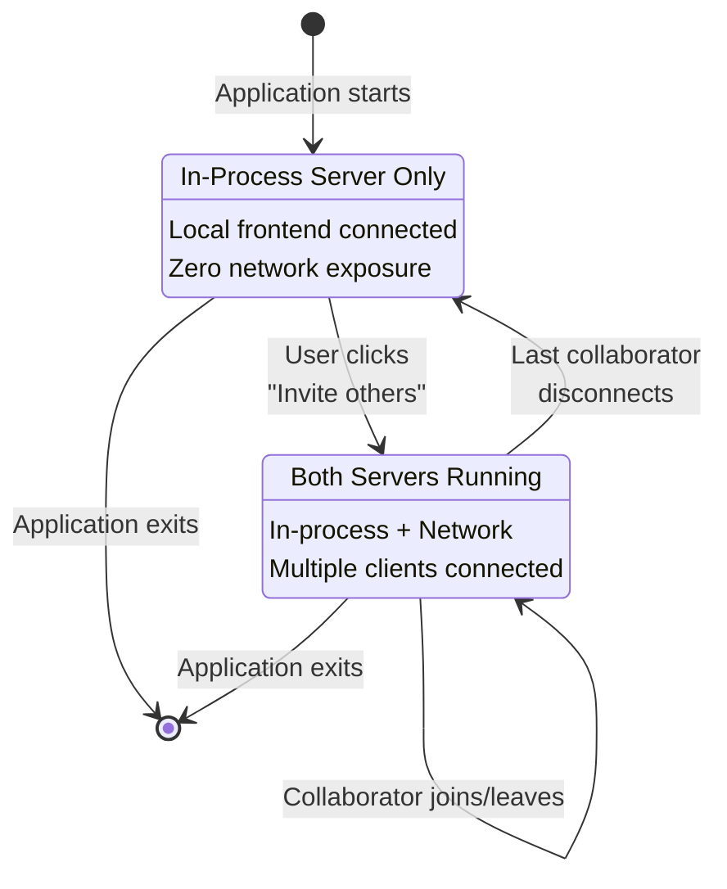
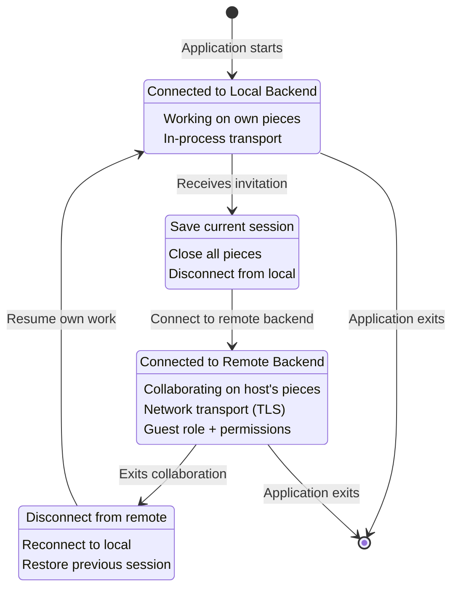

# ADR-0036: Collaborative Sessions and Hybrid Transport Architecture

## Status

Accepted

## Table of Contents

- [Context](#context)
- [Decision](#decision)
  - [Core Architectural Decisions](#core-architectural-decisions)
  - [Hybrid Transport Architecture](#hybrid-transport-architecture)
  - [Role-Based Permission System](#role-based-permission-system)
  - [Email-Based Invitation System](#email-based-invitation-system)
  - [Frontend Context Switching](#frontend-context-switching)
  - [Collaboration API](#collaboration-api)
  - [Deployment Scenarios](#deployment-scenarios)
- [Rationale](#rationale)
  - [Google Docs-Style Collaboration Model](#google-docs-style-collaboration-model)
  - [Why Hybrid Transport Architecture](#why-hybrid-transport-architecture)
  - [Why Role-Based Permissions](#why-role-based-permissions)
  - [Why Email-Based Invitations](#why-email-based-invitations)
  - [Why Frontend Context Switching](#why-frontend-context-switching)
  - [Integration with Existing Architecture](#integration-with-existing-architecture)
- [Consequences](#consequences)
  - [Positive](#positive)
  - [Negative](#negative)
  - [Mitigations](#mitigations)
  - [Security Considerations](#security-considerations)
  - [Performance Considerations](#performance-considerations)
  - [Network Configuration and NAT Traversal](#network-configuration-and-nat-traversal)
- [Alternatives Considered](#alternatives-considered)
  - [1. Static Deployment Modes Only](#1-static-deployment-modes-only)
  - [2. Always-On Network Server](#2-always-on-network-server)
  - [3. Peer-to-Peer Transport](#3-peer-to-peer-transport)
  - [4. Cloud-Only Collaboration](#4-cloud-only-collaboration)
  - [5. Uniform Permissions for All Clients](#5-uniform-permissions-for-all-clients)
- [References](#references)
  - [Related ADRs](#related-adrs)
  - [Technical References](#technical-references)
  - [Collaboration Patterns](#collaboration-patterns)
- [Notes](#notes)

## Context

Ooloi's frontend-backend separation (ADR-0001) supports multiple deployment modes: combined (in-process transport), distributed (network transport), and backend-only (server mode). While these modes serve their intended purposes, they present an inflexible boundary: users must choose either local standalone work OR remote collaboration, but not both dynamically.

Real-world collaboration scenarios require more fluid transitions:

- **Student working alone**: Uses combined app with in-process transport (maximum performance)
- **Student needs assistance**: Wants to invite teacher without closing application or losing work
- **Teacher helping student**: Connects to student's session, works on student's pieces, then disconnects to resume own work
- **Multiple collaborators**: String quartet working on bowing annotations, classroom instruction, composer-engraver workflows, film composer with orchestrator(s)
- **Institutional deployment**: Dedicated servers for 24/7 service with full authentication

Existing architectural foundations:

- **Authentication and Authorization** (ADR-0021): Established JWT-based authentication with user identity, role-based permissions, and authorization framework
- **Secure Transport** (ADR-0020): TLS infrastructure for network security
- **Multi-Client Concurrency** (ADR-0004): STM architecture supporting multiple simultaneous clients

Current architecture limitations:

1. **Static deployment mode**: Applications start as either combined or distributed, cannot switch
2. **No invitation mechanism**: No established pattern for initiating collaboration sessions
3. **Frontend backend binding**: Frontend connects to single backend for entire application lifetime

These limitations force users to plan collaboration in advance and restart applications to change modes.

## Decision

We will implement **hybrid transport architecture** enabling dynamic collaboration sessions where applications start in standalone mode (in-process transport) and dynamically accept external collaborators (network transport) without restart or mode switching.

**Design Philosophy**: The authentication and authorization model follows the **Google Docs pattern** - email-based identity, invitation-driven access, host-controlled permissions, and role-based collaboration. This provides a familiar, intuitive user experience that requires no special training or technical knowledge.

### Core Architectural Decisions

1. **Dual Server Architecture**: Applications can run both in-process and network gRPC servers simultaneously
2. **Dynamic Server Lifecycle**: Network server starts on-demand when hosting collaboration, stops when last collaborator disconnects
3. **Role-Based Permissions**: Clear distinction between host (session owner) and guests (invited collaborators)
4. **Email-Based Invitations**: Invitation system integrated with authentication architecture (ADR-0021)
5. **Frontend Context Switching**: Frontend clients can disconnect from local backend and reconnect to remote backend
6. **Shared Backend Services**: Multiple server instances share same piece manager, event manager, and backend components

### Hybrid Transport Architecture

**Component Architecture**:
- Single piece manager and event manager shared by both servers
- In-process server: Always active, serves local frontend
- Network server: Disabled by default, starts on-demand with TLS and authentication
- Both servers reference the same backend components, ensuring consistent state

**Server Lifecycle**:
- User initiates collaboration → network server component starts via `ig/init-key`
- Last external collaborator disconnects → network server stops via `ig/halt-key!`
- Automatic lifecycle management through client registry monitoring

**Server Lifecycle State Diagram**:

### Role-Based Permission System

**Permission Model**:
- **Host permissions**: Full control including read, write, save, print, delete, invite, and permission management
- **Guest permissions**: Default read-only access; invitations can specify additional permissions (write, save, print, etc.) if the invitation token is encrypted in transit. Host can also grant or revoke permissions after connection.
- **Client registry**: Tracks email identity, role, granted permissions, connection timestamps, and session identifiers
- **Collaboration history**: The host instance persists a local log of invitations, logins, and (optionally) modifications made by each collaborator. Previous permission assignments are remembered per collaborator email, so re-inviting the same person defaults to their last-used permissions rather than read-only.
- **Authorization enforcement**: gRPC interceptor validates permissions for each operation before execution

### Email-Based Invitation System

**Invitation Flow**:
1. Host creates invitation with guest email and configurable expiration (1 hour for quick help, 24 hours default, 1 week for extended collaboration)
2. Email sent with clickable link (`ooloi://join?token=...`) and connection details
3. Guest accepts invitation → validates token → receives JWT with guest role and permissions from invitation
4. Guest connects to host's network server using JWT authentication

**Authentication Integration** (ADR-0021):
- Invitation tokens are single-use, time-limited credentials
- Invitation tokens carry permission grants; these are encrypted in transit to prevent tampering
- Upon acceptance, system generates JWT token with guest claims: email identity, guest role, session ID, and granted permissions (read-only by default; invitation may specify additional permissions)
- JWT enables authorized access to collaboration session

### Frontend Context Switching

**Entering Collaboration** (guest accepting invitation):
1. Save local session state (open pieces, UI state)
2. Disconnect from local backend (remains running)
3. Connect to remote backend with network transport and JWT authentication
4. UI shows collaboration mode with host name and guest role

**Exiting Collaboration**:
1. Disconnect from remote backend
2. Reconnect to local backend with in-process transport
3. Optionally restore previous local session
4. UI returns to standalone mode

**Frontend Context Switching State Diagram**:

### Collaboration API

New gRPC methods enable collaboration management:
- **InviteUser**: Send email invitation to collaborator
- **GrantPermission / RevokePermission**: Host controls guest permissions
- **ListConnectedUsers**: View active collaborators with roles and permissions

### Deployment Scenarios

**Standalone Mode (Default)**:
- Combined app starts with in-process server only
- Zero network exposure, maximum performance
- No authentication required
- Default mode for 99% of users

**Ad-Hoc Collaboration**:
- User initiates collaboration from UI
- Network server starts dynamically on user's machine
- Invitation sent via email to collaborators
- Collaborators connect with authentication
- Network server stops when last collaborator disconnects

**Dedicated Server**:
- Backend-only deployment with network server always active
- No in-process server component
- Full authentication and TLS required
- Supports institutional deployment, 24/7 availability

## Rationale

### Google Docs-Style Collaboration Model

The entire authentication and authorization architecture follows the proven **Google Docs pattern**, chosen for its simplicity and universal familiarity:

**Core Principles**:
1. **Email as Identity**: Users identified by email addresses, no separate username/password to remember
2. **Invitation-Driven Access**: Share access by sending invitation to email address
3. **Owner-Controlled Permissions**: Document owner (host) grants specific permissions to collaborators
4. **Role-Based Collaboration**: Clear distinction between owner and collaborators (editor/viewer)
5. **No Technical Complexity**: Non-technical users can invite and manage collaborators without understanding servers, ports, or network configuration

**User Experience Benefits**:
- **Zero Learning Curve**: Everyone already understands how Google Docs sharing works
- **Intuitive Workflow**: "Click Invite → Enter email → Choose permissions" requires no documentation
- **Familiar Mental Model**: Musicians expect collaboration software to work like Google Docs, Figma, or Notion
- **No IT Knowledge Required**: Music teachers can host collaboration sessions without technical training

This design prioritizes **ease of use over technical sophistication** - the right choice for music notation software where users are musicians, not system administrators.

### Why Hybrid Transport Architecture

1. **Seamless Mode Switching**: Users don't think about "deployment modes" - they work locally and invite others when needed
2. **Performance Preservation**: Local work uses in-process transport (37.5-75x faster per ADR-0019) until collaboration needed
3. **Security Flexibility**: Network exposure only when actively hosting collaboration, not by default
4. **Resource Efficiency**: Network server overhead only when actually collaborating
5. **Architecture Reuse**: Same component infrastructure supports both transports simultaneously

### Why Role-Based Permissions

1. **Security Model**: Clear distinction between session owner (host) and participants (guests)
2. **Control Preservation**: Host retains authority over save/print operations and piece integrity
3. **Collaboration Safety**: Guests are read-only by default; write and save permissions require explicit grant
4. **Education Scenarios**: Teacher helps student without overwriting student's work
5. **Professional Workflows**: Engraver reviews composer's work without file system access

### Why Email-Based Invitations

1. **Identity Foundation**: Email as universal identifier integrates with ADR-0021 authentication
2. **Standard Pattern**: Familiar model from Google Docs, Figma, and other collaboration tools
3. **Out-of-Band Security**: Invitation delivery via separate channel (email) adds security layer
4. **Audit Trail**: Email records provide natural audit trail for compliance
5. **Cross-Organization**: Email works across organizational boundaries

### Why Frontend Context Switching

1. **Flexible Participation**: Users can help others without dedicated "client" vs "host" applications
2. **Session Preservation**: Save and restore local work when entering/exiting collaboration
3. **Clear Mental Model**: "I'm working on my pieces" vs "I'm helping Alice with her piece"
4. **Work Protection**: Requires explicit save/close before switching prevents accidental data loss
5. **Architecture Consistency**: Same frontend code works in both standalone and collaboration modes

### Integration with Existing Architecture

**gRPC Transport**: Leverages ADR-0002's gRPC infrastructure and ADR-0019's in-process optimization without modification.

**TLS Security**: Integrates with ADR-0020's TLS implementation; network server uses TLS while in-process server bypasses network layer entirely.

**Authentication**: Builds on ADR-0021's JWT architecture; invitation tokens generate JWT tokens with appropriate guest claims.

**Component Lifecycle**: Follows ADR-0017's Integrant patterns; both servers are managed components with proper initialization and cleanup.

**STM Concurrency**: ADR-0004's STM architecture already supports multiple clients; no changes required for hybrid transport.

## Consequences

### Positive

- **Seamless Collaboration**: Users invite others without application restart or mode switching
- **Performance Optimization**: In-process transport for solo work, network transport only when collaborating
- **Security Boundaries**: Clear host/guest distinction with granular permission control
- **Familiar Patterns**: Email-based invitations match existing collaboration tools
- **Flexible Participation**: Any user can host or join sessions dynamically
- **Architecture Reuse**: Leverages existing gRPC, authentication, and component infrastructure
- **Educational Scenarios**: Perfect for teacher-student, workshop, and classroom workflows
- **Professional Workflows**: Supports composer-engraver, conductor-orchestral librarian, film composer-orchestrator scenarios

### Negative

- **Complexity Increase**: More complex lifecycle management with two servers
- **State Management**: Frontend context switching requires careful state preservation
- **Testing Scope**: Additional test scenarios for dual server, permissions, invitations
- **NAT Traversal Limitation**: Most users cannot host peer-to-peer sessions due to NAT (firewalls, routers); only works for local networks, users with UPnP, or manual configuration capability (~20% of general users)
- **Email Dependency**: Invitation system requires email infrastructure
- **Permission Complexity**: Users must understand host/guest model and permission implications

### Mitigations

- **Intelligent Defaults**: Network server remains disabled by default; explicit user action required
- **Clear UI Feedback**: Collaboration mode prominently displayed; permission restrictions visible; NAT configuration status visible
- **Automatic Cleanup**: Network server auto-stops when collaboration ends; no manual management
- **Graceful Degradation**: Connection failures handled with clear error messages and recovery options
- **Multiple Deployment Options**: Production server (works for everyone), institutional server (IT-managed), local network (always works), internet peer-to-peer (works when network allows)
- **UPnP Auto-Configuration**: Automatic port forwarding for ~40-60% of home networks that support UPnP
- **Honest Documentation**: Clear guidance on when peer-to-peer hosting works, when to use production/institutional servers instead
- **Comprehensive Testing**: Test matrices covering all deployment and collaboration scenarios
- **Network Assistance**: UI provides connection diagnostics, UPnP status, and troubleshooting guidance with fallback to production server

### Security Considerations

**Network Exposure**:
- Network server only runs when user explicitly initiates collaboration
- TLS encryption required for all network server connections (ADR-0020)
- Automatic shutdown prevents inadvertent persistent network exposure

**Authentication**:
- All network connections require valid JWT tokens (ADR-0021)
- Invitation tokens are single-use, time-limited credentials
- Email verification provides out-of-band authentication factor

**Authorization**:
- Default guest permissions are read-only; additional permissions (write, save, print) require explicit grant via invitation or host action after connection
- Host explicitly grants elevated permissions on per-guest basis
- All operations checked by authorization interceptor; client-side UI is convenience only

**Audit Trail**:
- Host instance logs all invitations, logins, disconnections, and permission changes locally
- Optional modification logging: host can enable tracking of what each collaborator modifies (off by default for privacy)
- Collaboration history persisted across sessions — re-inviting a collaborator recalls their previous permission assignments
- Integration with ADR-0021 authentication logging
- Compliance support for FERPA, GDPR audit requirements

### Performance Considerations

**Dual Server Overhead**:
- In-process server: negligible overhead (direct method calls)
- Network server: only active during collaboration, zero cost otherwise
- Shared backend services: single piece manager, event manager regardless of transport

**Connection Monitoring**:
- Efficient client registry queries for auto-shutdown detection
- Event-driven approach avoids polling
- Configurable grace period balances responsiveness and stability

**Context Switching**:
- Frontend reconnection requires brief UI pause (typically <500ms)
- Session state save/restore optimized for minimal data
- No server-side overhead; purely client-side operation

### Network Configuration and NAT Traversal

**The NAT Reality**:

Most home and institutional networks use **Network Address Translation (NAT)**, which prevents direct inbound connections to devices behind the NAT gateway. This creates practical limitations for peer-to-peer collaboration where users attempt to host sessions from their desktop applications.

**Network Scenarios and Hosting Viability**:

| Network Type | Can Host P2P? | Solution |
|--------------|---------------|----------|
| **Local network (LAN)** | ✅ Yes, always | Direct connection within network, no NAT traversal needed |
| **Home with public IP** | ✅ Yes, always | Direct connection to public IP (rare in modern deployments) |
| **Home with UPnP enabled** | ✅ Maybe | Automatic port forwarding via UPnP protocol (works ~40-60% of cases) |
| **Home, manual config** | ✅ Yes, if capable | User configures port forwarding in router (requires technical knowledge) |
| **School/institution** | ❌ Usually no | Firewall policies, NAT, restricted access (requires IT support) |
| **Coffee shop/public wifi** | ❌ No | No router access, transient network |
| **Corporate network** | ❌ No | Strict firewall policies, security restrictions |
| **Mobile hotspot** | ⚠️ Carrier-dependent | Carrier-grade NAT often blocks hosting |

**Realistic Deployment Model**:

Based on network realities, the architecture supports three deployment tiers with different hosting capabilities:

**Tier 1: Server-Based Collaboration** (Primary, works for 100% of users)
- **Production server**: Cloud-hosted, public IP, professional infrastructure
- **Institutional server**: School/conservatory/publisher deploys dedicated server with IT support
- **No NAT issues**: Clients connect to servers, servers have proper network configuration
- **This is how Google Docs works**: Central servers, not peer-to-peer hosting

**Tier 2: Local Network Peer-to-Peer** (Secondary, works within LAN)
- **String quartet at rehearsal space**: All devices on same local network, no NAT traversal needed
- **Classroom**: Teacher and students on school LAN, direct connections
- **Home studio**: Composer and orchestrator in same physical location
- **Works 100% within LAN**: No internet, no NAT, direct IP addressing

**Tier 3: Internet Peer-to-Peer** (Tertiary, works when network allows)
- **Home users with UPnP**: Automatic port forwarding (~40-60% success rate)
- **Technical users**: Manual port forwarding configuration (requires router access and knowledge)
- **Advanced scenarios**: IT-configured home offices, professional studios
- **Realistic assessment**: Works for <20% of general users, 80%+ of technical users

**Implementation Strategy**:
- Attempt UPnP automatic port forwarding when available
- If UPnP fails, present UI dialog offering: production server (recommended), manual configuration, or local-network-only mode
- Provide clear documentation about which network scenarios support peer-to-peer hosting

**Future Enhancement Options**:
- **STUN/TURN Infrastructure** (WebRTC-style NAT traversal) - complex, evaluate only if demonstrated need
- **Hybrid Relay** (graceful degradation to relay server) - ensures connectivity at cost of performance
- **Production Server as Default** (recommended) - server-centric with optional peer-to-peer

**Architectural Honesty**: NAT is a real constraint, not an implementation bug. The architecture supports multiple deployment models (production server, institutional server, local network peer-to-peer, internet peer-to-peer) without forcing a single solution. This maintains architectural integrity while being realistic about network constraints.

## Alternatives Considered

### 1. Static Deployment Modes Only

**Description**: Keep current architecture with distinct combined/distributed modes, require restart to switch.

**Rejected**: Creates friction for ad-hoc collaboration. Users must plan collaboration in advance and choose appropriate mode at startup. Doesn't support "I'm working alone, oh wait, I need help" workflow.

### 2. Always-On Network Server

**Description**: All combined apps run both servers from startup.

**Rejected**: Unnecessary network exposure and resource usage for users who never collaborate. Security principle of least privilege suggests network services should be disabled by default.

### 3. Peer-to-Peer Transport

**Description**: Direct client-to-client connections without server concept.

**Rejected**: Adds complexity for NAT traversal, firewall configuration, and synchronization. Doesn't provide clear authority model for piece ownership. Server architecture is simpler and provides natural host/guest distinction.

### 4. Cloud-Only Collaboration

**Description**: Collaboration requires cloud-hosted server; local apps can't host sessions.

**Rejected**: Creates vendor lock-in and requires external infrastructure for basic collaboration. Doesn't support educational scenarios in restricted networks or offline environments.

### 5. Uniform Permissions for All Clients

**Description**: No distinction between host and guests; all clients have equal permissions.

**Rejected**: Creates security and usability problems. Who controls save/print operations? What prevents guests from overwriting host's files? Lack of authority model leads to collaboration conflicts.

## References

### Related ADRs

- [ADR-0001: Frontend-Backend Separation](0001-Frontend-Backend-Separation.md) - Establishes deployment architecture this ADR extends
- [ADR-0002: gRPC Communication](0002-gRPC.md) - gRPC infrastructure supporting hybrid transport
- [ADR-0004: STM for Concurrency](0004-STM-for-concurrency.md) - Concurrency model supporting multiple simultaneous clients
- [ADR-0017: System Architecture](0017-System-Architecture.md) - Component lifecycle patterns for server management
- [ADR-0019: In-Process gRPC Transport](0019-In-Process-gRPC-Transport-Optimization.md) - In-process transport for local performance
- [ADR-0020: TLS Infrastructure](0020-TLS-Infrastructure-and-Deployment-Architecture.md) - Security foundation for network transport
- [ADR-0021: Authentication](0021-Authentication.md) - JWT-based authentication supporting email identity

### Technical References

- [gRPC Server Interceptors](https://grpc.io/docs/guides/interceptors/) - Authorization interceptor implementation
- [JWT Claims for Authorization](https://tools.ietf.org/html/rfc7519#section-4) - Token-based permission model
- [Integrant Component Lifecycle](https://github.com/weavejester/integrant) - Dynamic component initialization

### Collaboration Patterns

- [Google Docs Sharing Model](https://support.google.com/docs/answer/2494822) - Email-based invitation inspiration
- [Figma Real-Time Collaboration](https://www.figma.com/blog/how-figmas-multiplayer-technology-works/) - Multi-user editing architecture
- [VS Code Live Share](https://visualstudio.microsoft.com/services/live-share/) - Developer collaboration patterns

### Related ADRs

- [ADR-0001: Frontend-Backend Separation](0001-Frontend-Backend-Separation.md) - Separation architecture enabling hybrid transport
- [ADR-0002: gRPC Communication](0002-gRPC.md) - Communication protocol for both transports
- [ADR-0017: System Architecture](0017-System-Architecture.md) - Component lifecycle supporting dynamic server initialization
- [ADR-0020: TLS Infrastructure](0020-TLS-Infrastructure-and-Deployment-Architecture.md) - TLS certificate management for network transport
- [ADR-0021: Authentication](0021-Authentication.md) - JWT authentication for collaborative sessions
- [ADR-0040: Single-Authority State Model](0040-Single-Authority-State-Model.md) - Single-authority model with remote connections as additive layer

## Notes

This architecture maintains Ooloi's principle of "minimal defaults, maximum flexibility." The vast majority of users work in standalone mode with zero network exposure, zero authentication, and zero configuration. When collaboration is needed, the same application seamlessly becomes a host for real-time multi-user editing.

The email-based invitation model provides familiar, proven UX while integrating cleanly with the JWT authentication architecture. By following the Google Docs pattern explicitly, the system requires no user training - musicians already understand how to invite collaborators and manage permissions. The host/guest permission model prevents common collaboration conflicts (who can save? who controls file system access?) while maintaining flexibility through permission granting.

Implementation should prioritize the common case: solo work with occasional collaboration. The architecture supports everything from "student invites teacher for quick help" to "string quartet working on bowing" to "conservatory server with 50 simultaneous users," but the first scenario should require the least configuration and complexity.

The hybrid transport approach demonstrates how architectural flexibility at the component level (ADR-0017) enables sophisticated features without compromising simplicity. Two servers sharing the same backend services is architecturally straightforward when components are designed for composition.
