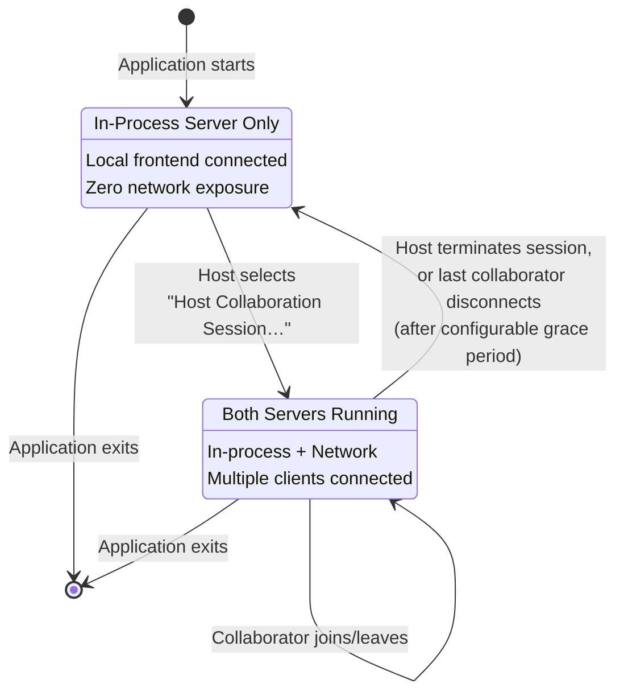
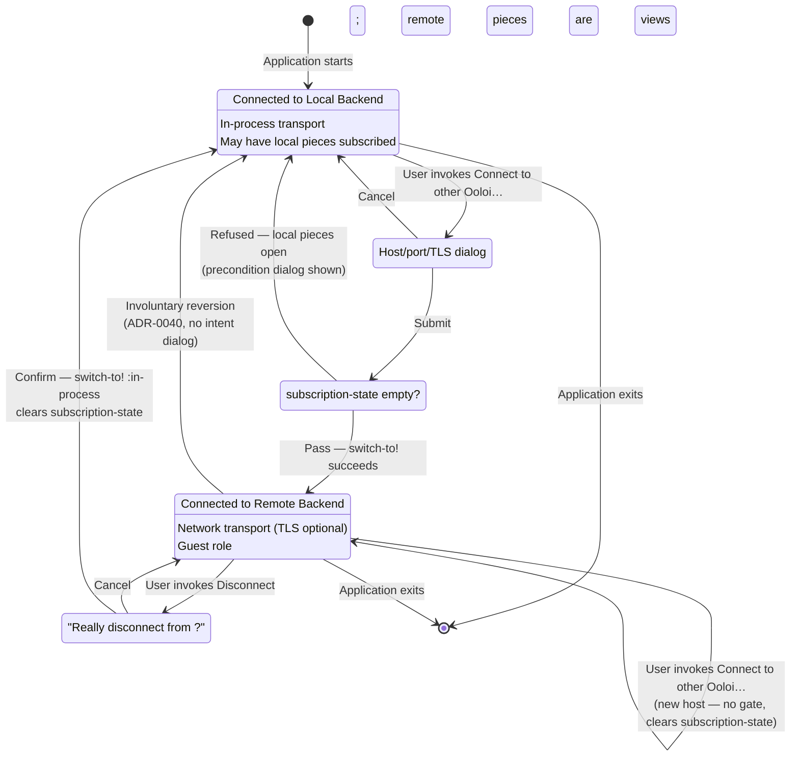
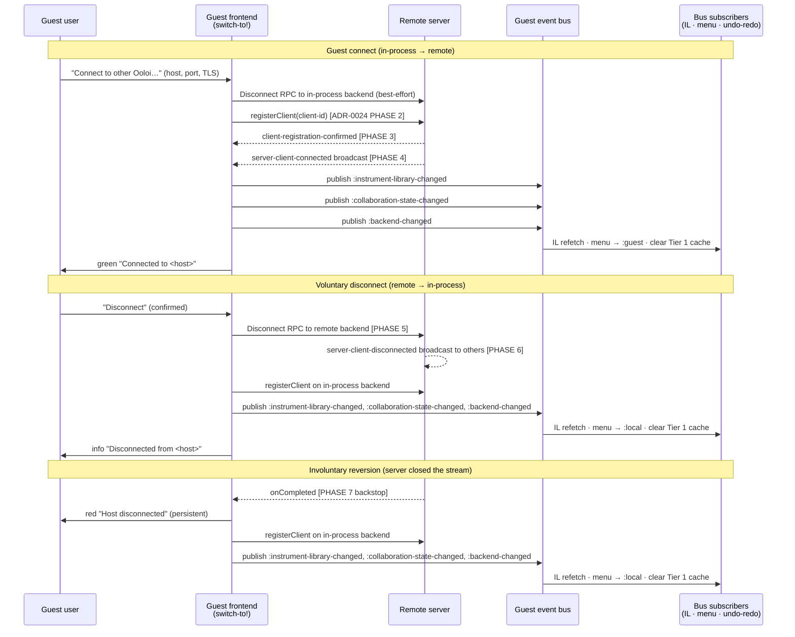

# ADR-0036: Collaborative Sessions and Hybrid Transport Architecture

## Status

Accepted

## Table of Contents

- [Context](#context)
- [Decision](#decision)
  - [Core Architectural Decisions](#core-architectural-decisions)
  - [Hybrid Transport Architecture](#hybrid-transport-architecture)
  - [Role-Based Permission System](#role-based-permission-system)
  - [Email-Based Invitation System](#email-based-invitation-system)
  - [Frontend Context Switching](#frontend-context-switching)
  - [Collaboration API](#collaboration-api)
  - [Deployment Scenarios](#deployment-scenarios)
- [Rationale](#rationale)
  - [Google Docs-Style Collaboration Model](#google-docs-style-collaboration-model)
  - [Why Hybrid Transport Architecture](#why-hybrid-transport-architecture)
  - [Why Role-Based Permissions](#why-role-based-permissions)
  - [Why Email-Based Invitations](#why-email-based-invitations)
  - [Why Frontend Context Switching](#why-frontend-context-switching)
  - [Integration with Existing Architecture](#integration-with-existing-architecture)
- [Consequences](#consequences)
  - [Positive](#positive)
  - [Negative](#negative)
  - [Mitigations](#mitigations)
  - [Security Considerations](#security-considerations)
  - [Performance Considerations](#performance-considerations)
  - [Network Configuration and NAT Traversal](#network-configuration-and-nat-traversal)
- [Alternatives Considered](#alternatives-considered)
  - [1. Static Deployment Modes Only](#1-static-deployment-modes-only)
  - [2. Always-On Network Server](#2-always-on-network-server)
  - [3. Peer-to-Peer Transport](#3-peer-to-peer-transport)
  - [4. Cloud-Only Collaboration](#4-cloud-only-collaboration)
  - [5. Uniform Permissions for All Clients](#5-uniform-permissions-for-all-clients)
- [References](#references)
  - [Related ADRs](#related-adrs)
  - [Technical References](#technical-references)
  - [Collaboration Patterns](#collaboration-patterns)
- [Notes](#notes)

## Context

Ooloi's frontend-backend separation (ADR-0001) supports multiple deployment modes: combined (in-process transport), distributed (network transport), and backend-only (server mode). While these modes serve their intended purposes, they present an inflexible boundary: users must choose either local standalone work OR remote collaboration, but not both dynamically.

Real-world collaboration scenarios require more fluid transitions:

- **Student working alone**: Uses combined app with in-process transport (maximum performance)
- **Student needs assistance**: Wants to invite teacher without closing application or losing work
- **Teacher helping student**: Connects to student's session, works on student's pieces, then disconnects to resume own work
- **Multiple collaborators**: String quartet working on bowing annotations, classroom instruction, composer-engraver workflows, film composer with orchestrator(s)
- **Institutional deployment**: Dedicated servers for 24/7 service with full authentication

Existing architectural foundations:

- **Authentication and Authorization** (ADR-0021): Established JWT-based authentication with user identity, role-based permissions, and authorization framework
- **Secure Transport** (ADR-0020): TLS infrastructure for network security
- **Multi-Client Concurrency** (ADR-0004): STM architecture supporting multiple simultaneous clients

Current architecture limitations:

1. **Static deployment mode**: Applications start as either combined or distributed, cannot switch
2. **No invitation mechanism**: No established pattern for initiating collaboration sessions
3. **Frontend backend binding**: Frontend connects to single backend for entire application lifetime

These limitations force users to plan collaboration in advance and restart applications to change modes.

## Decision

We will implement **hybrid transport architecture** enabling dynamic collaboration sessions where applications start in standalone mode (in-process transport) and dynamically accept external collaborators (network transport) without restart or mode switching.

**Design Philosophy**: The authentication and authorization model follows the **Google Docs pattern** - email-based identity, invitation-driven access, host-controlled permissions, and role-based collaboration. This provides a familiar, intuitive user experience that requires no special training or technical knowledge.

### Core Architectural Decisions

1. **Dual Server Architecture**: Applications can run both in-process and network gRPC servers simultaneously
2. **Dynamic Server Lifecycle**: Network server starts on-demand when hosting collaboration, stops when last collaborator disconnects
3. **Role-Based Permissions**: Clear distinction between host (session owner) and guests (invited collaborators)
4. **Email-Based Invitations**: Invitation system integrated with authentication architecture (ADR-0021)
5. **Frontend Context Switching**: Frontend clients can disconnect from local backend and reconnect to remote backend
6. **Shared Backend Services**: Multiple server instances share same piece manager, event manager, and backend components

### Hybrid Transport Architecture

**Component Architecture**:

Both gRPC servers — the in-process server (always active) and the network server (on-demand, TLS) — are coordinate transport surfaces over a single set of shared backend state. Shared state with lifecycle is its own Integrant component, depended on by every consumer; no server owns it. This keeps the dependency graph honest (each component depends on what it actually depends on), keeps lifecycles independent (halting one server does not invalidate state the other is still using), and makes shared state directly testable in isolation.

**Shared components** (one instance per JVM, both gRPC servers and `http-server` consume via dependency):
- Domain state: piece manager, instrument library, undo manager
- Connection registry: the single source of registered clients, iterated by every event broadcaster so a mutation on either transport reaches all clients regardless of how they joined
- Server statistics: a single set of counters, incremented by both servers' interceptors so the single HTTP statistics endpoint reports totality (requests per second, etc.) across all transports
- Health manager: the gRPC `HealthStatusManager` singleton consumed by both gRPC servers and by `http-server` directly — extracted from individual gRPC servers' component maps so the HTTP statistics endpoint isn't dependency-coupled to any specific gRPC server
- Thread pool: the shared pool used wherever off-thread dispatch is needed

After the shared-state extraction, **`http-server` no longer holds an `ig/ref` to any individual gRPC server.** Its handlers read connection registry, statistics, and health status from the three shared components directly. Halting the on-demand network gRPC server does not touch `http-server`; the HTTP `/health` endpoint continues to serve uninterrupted. See [INTEGRANT_COMPONENTS §2a — Component Design Principles](../guides/INTEGRANT_COMPONENTS.md#2a-component-design-principles) for the dependency-graph-visibility heuristic that motivated the extraction.

**Per-server state** (intentionally distinct):
- The gRPC `Server` instance, transport configuration (port, TLS), lifecycle timestamps, component status, and a per-server identifier (`:server-id`)

**Selective halt via `:server-id` stamping.** Because every server consumes the same connection-registry, `halt-key!` on one server must not close streaming observers or remove registry entries belonging to clients of another server. Each `grpc-server` component generates a fresh `:server-id` at `init-key` time. The interceptor that creates each client's registry entry stamps that entry with the originating server's `:server-id`. `halt-key!` then filters the shared registry by its own `:server-id`: it closes streaming observers and stops drainer executors only for matching entries, and `dissoc`s only those keys from the registry — leaving entries owned by other servers intact. Without this scoping, halting one server would clear every other server's clients' streaming observers and nil their `:api-connection-pool` atoms client-side, breaking the lifecycle-independence invariant above. (#211 Tests 22a/22b verify both halt and start cases.)

### Network Server Lifecycle

The network gRPC server is managed through standard Integrant lifecycle methods, started and stopped under explicit triggers — never running automatically at application boot.

**Menu items.** Two menu items in the application's File menu drive the network server lifecycle: **"Host Collaboration Session…"** (host action — starts the server) and **"Terminate Collaboration Session"** (host action — stops the server). Both menu items are handled in the combined application's `start-app!` action-handler map. The "Host Collaboration Session…" menu item is enabled whenever the network server is not running; the "Terminate Collaboration Session" menu item is enabled whenever it is.

**Start.** The host selects the **"Host Collaboration Session…"** menu item from the application's UI. This menu action calls the backend API which adds the `network-grpc-server` component to the running Integrant system via `ig/init-key`. The new component shares all backend state with the in-process server through Integrant refs to the shared components named in §Hybrid Transport Architecture above. Start and stop each publish `:collaboration-state-changed` on the frontend event bus so the menu-enablement seam re-evaluates (§Collaboration Menu Enablement); the full per-transition event flow is tabulated in §Connect / Disconnect Event Sequence.

**Stop.** The network server stops via `ig/halt-key!` under either of two triggers:

- **Manual termination**: the host selects the **"Terminate Collaboration Session"** menu item. If guests are currently connected, the host is presented with a confirmation dialog warning about the disconnection before the server is halted.
- **Automatic halt**: a configurable grace period after the last external collaborator disconnects. See §Auto-Halt Grace Period Setting below for the setting name, semantics, and defaults.

A new guest connection during the automatic-halt grace period cancels the pending halt — the server stays up.

**Lifecycle state diagram:**

```mermaid
stateDiagram-v2
    [*] --> Standalone: Application starts
    Standalone: In-Process Server Only
    Standalone: Local frontend connected
    Standalone: Zero network exposure

    Standalone --> CollaborationActive: Host selects<br/>"Host Collaboration Session…"

    CollaborationActive: Both Servers Running
    CollaborationActive: In-process + Network
    CollaborationActive: Multiple clients connected

    CollaborationActive --> CollaborationActive: Collaborator joins/leaves
    CollaborationActive --> Standalone: Host terminates session,<br/>or last collaborator disconnects<br/>(after configurable grace period)

    Standalone --> [*]: Application exits
    CollaborationActive --> [*]: Application exits
```

### Auto-Halt Grace Period

The auto-halt grace period controls how long the network gRPC server remains running after the last external guest disconnects.

**Type**: integer (seconds).

**Semantics**:
- **Non-negative N**: the network server halts N seconds after the last guest disconnects. A new guest connection during the grace period cancels the pending halt.
- **Negative**: auto-halt is disabled entirely. The server runs until the host manually terminates the session via the "Terminate Collaboration Session" menu action or the application exits.

**Default**: `-1` (auto-halt disabled).

**Configuration source**: launch-time only. CLI flag `--auto-halt-seconds`, environment variable `OOLOI_AUTO_HALT_SECONDS`, alongside other deployment configuration in `combined-cli-spec` / `combined-env-spec` (and the equivalents in the backend project). The value is read at process start and held for the process lifetime; changing it requires restarting the application.

This is deployment configuration rather than user preference: a teacher's laptop, an institutional server, and a personal demo machine all want different values, set per deployment scenario and rarely changed thereafter. Reactive mid-session adjustment via a frontend app setting (per ADR-0043) was rejected as introducing cross-layer coupling (backend reading frontend app state) without a justifying user scenario; the explicit "Terminate Collaboration Session" menu action covers the immediate-stop case.

### Role-Based Permission System

**Permission Model**:
- **Host permissions**: Full control including read, write, save, print, delete, invite, and permission management
- **Guest permissions**: Default read-only access; invitations can specify additional permissions (write, save, print, etc.) if the invitation token is encrypted in transit. Host can also grant or revoke permissions after connection.
- **Client registry**: Tracks email identity, role, granted permissions, connection timestamps, and session identifiers
- **Collaborator registry**: The host persists a collaborator registry (EDN) mapping each email to display name, last-used permissions, and list of accessible piece IDs. Re-inviting the same person defaults to their stored name and last-used permissions rather than read-only. The display name is provided with the initial invitation and reused automatically for subsequent invitations to the same email.
- **Collaboration log**: The host writes a text log of invitations, logins, disconnections, and (optionally) modifications made by each collaborator. The log is append-only and human-readable.
- **Piece access registry**: The host tracks which pieces each collaborator (by email) has been granted access to. This enables file choosers to filter the local piece library to only show pieces the connected guest is authorised to see. Essential for server deployments where the piece library may contain hundreds of scores belonging to different users.
- **Storage location**: All collaboration data (collaborator registry, logs, piece access mappings) is stored under the standard Ooloi platform storage folder, which also holds TLS certificates, translations, UI settings (dark/light mode, window state), and user identity (email):
  - **macOS/Linux**: `~/.ooloi/collaboration/`
  - **Windows**: `%APPDATA%/Ooloi/collaboration/`
- **Authorization enforcement**: gRPC interceptor validates permissions for each operation before execution

### Email-Based Invitation System

**Invitation Flow**:
1. Host creates invitation with guest name, email, and configurable expiration (1 hour for quick help, 24 hours default, 1 week for extended collaboration). The name is associated with the email and reused for future invitations to the same address.
2. Email sent with clickable link (`ooloi://join?token=...`) and connection details
3. Guest accepts invitation → validates token → receives JWT with guest role and permissions from invitation
4. Guest connects to host's network server using JWT authentication

**Authentication Integration** (ADR-0021):
- Invitation tokens are single-use, time-limited credentials
- Invitation tokens carry permission grants; these are encrypted in transit to prevent tampering
- Upon acceptance, system generates JWT token with guest claims: email identity, guest role, session ID, and granted permissions (read-only by default; invitation may specify additional permissions)
- JWT enables authorized access to collaboration session

### Frontend Context Switching

Context switching is **asymmetric** by design.

**Entering Collaboration** (in-process → remote, voluntary):
1. User invokes "Connect to other Ooloi…"; dialog collects host, port, TLS flag, optional display name.
2. **Outbound precondition gate**: if any piece is subscribed locally (non-empty Event Router `subscription-state`), `switch-to!` refuses and the UI surfaces a confirmation dialog explaining that local pieces must be closed first.
3. With no local pieces open, `switch-to!` sends a graceful `Disconnect` RPC to the current (in-process) backend with a bounded deadline (default 2000ms), then closes the in-process channels, opens network channels with JWT authentication, re-registers with the remote, and publishes the three switch events (`:instrument-library-changed`, `:collaboration-state-changed`, `:backend-changed` — see §Frontend Reconnection). The Disconnect call is best-effort: `:ok` / `:timeout` / `:error` are all treated identically — `switch-to!` always proceeds to channel teardown and re-registration. The identity-aware setOnCancelHandler backstop (ADR-0024 §Connection Lifecycle, PHASE 7) protects any subsequent late server-side cancel processing from wiping the new entry.
4. UI shows collaboration mode with host name and guest role.

**Exiting Collaboration** (remote → in-process, voluntary Disconnect):
1. User invokes "Disconnect".
2. **Intent confirmation**: dialog asks "really disconnect from <host>?" — confirming proceeds, cancelling leaves the frontend on the remote backend.
3. No precondition gate. `switch-to! :in-process` sends a graceful `Disconnect` RPC to the current (remote) backend with the same bounded deadline, closes the remote channels, drops any remote piece subscriptions, clears `subscription-state` defensively, re-registers with the local backend, and publishes the three switch events (`:instrument-library-changed`, `:collaboration-state-changed`, `:backend-changed` — see §Frontend Reconnection).
4. UI returns to standalone mode.

**Switching Between Remote Hosts** (network → network, voluntary):
1. User invokes "Connect to other Ooloi…" while already on a remote backend (e.g. currently a guest on Ooloi A, wants to join Ooloi B's session instead).
2. No precondition gate. The current subscriptions are remote views, not save-state-bearing local work — the gate's purpose does not apply.
3. `switch-to!` sends a graceful `Disconnect` RPC to the current remote backend, closes its channels, drops the prior backend's piece subscriptions, clears `subscription-state` defensively, opens network channels to the new remote, re-registers, and publishes the three switch events (`:instrument-library-changed`, `:collaboration-state-changed`, `:backend-changed` — see §Frontend Reconnection).
4. UI shows collaboration mode with the new host name and guest role.

**Involuntary Reversion** (remote → in-process, ADR-0040):
1. Remote connection is lost (server shutdown, network partition, etc.); the response-observer's `onCompleted` fires on the client.
2. The observer's `revert-fn` posts a persistent red "host disconnected" notification, then invokes `switch-to! :in-process` automatically. No intent confirmation; no gate.
3. The recursive `switch-to!` clears `subscription-state` and publishes the same three switch events as a voluntary Disconnect (`:instrument-library-changed`, `:collaboration-state-changed`, `:backend-changed` — see §Frontend Reconnection), so the collaboration menu reverts to `:local` enablement and the Tier 1 backend cache clears.
4. UI returns to standalone mode; the red notification persists until the user dismisses it.

**Rationale for the asymmetry.** The gate exists to protect the user's own work. Local pieces (those open against the in-process backend) are save-state-bearing and irreplaceable; silently leaving them when switching to a remote context is unacceptable, so the gate forces a deliberate close. Remote pieces, conversely, are the host's work; the guest holds only a view. Dropping that view on Disconnect (or when switching to another remote host) is exactly equivalent to closing a tab on a collaborative document, and adding a "close all remote pieces first" step would be friction without semantic value.

Concretely, the gate fires only when the *current* transport is `:in-process`. Switches that originate from a remote backend — whether back to in-process (voluntary Disconnect, involuntary reversion) or to another remote (switching hosts) — are never refused, and `subscription-state` is cleared defensively on every such switch because the piece-ids tracked there refer only to the backend that issued them. Voluntary Disconnect confirms *intent* rather than gating on *state*; involuntary reversion can do neither — the connection is already gone; switching between hosts proceeds directly through the same "Connect to other Ooloi…" flow without an extra confirmation, since the new host's connect dialog is itself the intent surface.

A *future option*, not part of the initial implementation: replace the outbound refusal with auto-close-with-save-if-dirty once piece-window UX (ADRs covering open/save flow) is in place. The call site for `switch-to!` is unchanged; only the precondition body is replaced.

**Frontend Context Switching State Diagram**:

```mermaid
stateDiagram-v2
    [*] --> LocalWork: Application starts
    LocalWork: Connected to Local Backend
    LocalWork: In-process transport
    LocalWork: May have local pieces subscribed

    LocalWork --> ConnectIntent: User invokes Connect to other Ooloi…
    ConnectIntent: Host/port/TLS dialog
    ConnectIntent --> LocalWork: Cancel

    ConnectIntent --> OutboundGate: Submit
    OutboundGate: subscription-state empty?

    OutboundGate --> LocalWork: Refused — local pieces open<br/>(precondition dialog shown)
    OutboundGate --> RemoteCollaboration: Pass — switch-to! succeeds

    RemoteCollaboration: Connected to Remote Backend
    RemoteCollaboration: Network transport (TLS optional)
    RemoteCollaboration: Guest role; remote pieces are views

    RemoteCollaboration --> DisconnectIntent: User invokes Disconnect
    DisconnectIntent: "Really disconnect from <host>?"
    DisconnectIntent --> RemoteCollaboration: Cancel

    DisconnectIntent --> LocalWork: Confirm — switch-to! :in-process<br/>clears subscription-state

    RemoteCollaboration --> LocalWork: Involuntary reversion<br/>(ADR-0040, no intent dialog)

    RemoteCollaboration --> RemoteCollaboration: User invokes Connect to other Ooloi…<br/>(new host — no gate, clears subscription-state)

    LocalWork --> [*]: Application exits
    RemoteCollaboration --> [*]: Application exits
```

This diagram shows the *states* and the user actions that move between them; the gRPC wire events, frontend event-bus publishes, and notifications fired on each transition are tabulated in §Connect / Disconnect Event Sequence.

### Frontend Reconnection: `switch-to!`

Transport switching from the frontend is mediated by a single named operation on the `grpc-clients` component: `switch-to!`. The operation atomically replaces the client's transport — closing the existing API pool and event-stream, opening new ones against the target, re-registering with the target backend, and clearing the Event Router's `subscription-state` (piece-ids are server-local and do not carry across backends). On every completed switch it publishes **three events** on the frontend event bus (ADR-0031 §Frontend Event Categories):

- `:instrument-library-changed` (category `:instrument-library`) — the IL handler refetches state from the new backend.
- `:collaboration-state-changed` (category `:collaboration`) — the menu-enablement seam re-evaluates (see §Collaboration Menu Enablement).
- `:backend-changed` (category `:backend`) — backend-scoped frontend caches invalidate; `undo-redo` subscribes to clear its Tier 1 backend undo cache, whose timestamps and descriptions belonged to the previous backend (ADR-0015 §Tier 1).

These are frontend-internal event-bus publishes that fire *after* the gRPC re-registration completes; they are distinct from the gRPC wire events of the connection handshake itself (ADR-0024 §Connection Lifecycle). The end-to-end client/server sequence for a guest connect and disconnect — wire handshake plus these frontend publishes plus the user notification — is shown in §Connect / Disconnect Event Sequence below.

ADR-0031 §Subscription State Management's resubscribe flow is for **single-backend reconnection** after a network blip (same backend, restored channel) — not for transport switching. The piece-ids tracked there are meaningful only against the backend that issued them.

**Targets**:

- `:in-process` — returns the frontend to its local always-running in-process backend. This is the default state, the reversion target when a remote connection drops (per ADR-0040), and what the "Disconnect" menu action invokes.
- A `{:host h :port p :tls? boolean}` map — opens a network transport against the specified remote backend. This is what the "Connect to other Ooloi…" dialog invokes after host/port/TLS input.

**Outbound precondition (in-process → remote).** `switch-to!` refuses when the *current* transport is `:in-process`, the target is a remote map, AND `subscription-state` is non-empty — local pieces are save-state-bearing and must be closed by the user before the context shift. The refusal mechanism at the component level is an implementation detail (exception, boolean return, error map — whichever fits cleanly); the UI surface is a confirmation dialog explaining the precondition, not a silent failure.

**Switches from a remote backend are never gated.** Remote pieces are views, not owned work. This covers three sub-cases:

- *Remote → in-process (voluntary Disconnect)*: surfaces an intent confirmation dialog ("really disconnect from <host>?") and then proceeds.
- *Remote → in-process (involuntary reversion, per ADR-0040)*: proceeds without dialog — the connection is already gone.
- *Remote → remote (switching hosts)*: proceeds directly. The "Connect to other Ooloi…" dialog for the new host is itself the intent surface; no separate confirmation is needed.

In all three sub-cases, `subscription-state` is cleared defensively before re-registration — the piece-ids tracked there refer only to the backend that issued them, and are meaningless against any other backend.

**Error handling.** `switch-to!` returning an error (target unreachable, TLS handshake failure, etc.) leaves the previous connection intact — the frontend never ends up in an unconnected state. If a remote connection is lost mid-session, the `grpc-clients` component invokes `switch-to! :in-process` automatically per ADR-0040's single-authority reversion model.

### Connect / Disconnect Event Sequence

Each collaboration transition produces a fixed sequence of gRPC wire events (the ADR-0024 §Connection Lifecycle handshake), frontend event-bus publishes (ADR-0031 §Frontend Event Categories), and a user notification (§Notification Model). The table is the per-transition summary; the sequence diagram below shows the guest-side ordering.

| Transition | gRPC wire events | Frontend event-bus publishes | Notification |
|---|---|---|---|
| Guest connect (in-process → remote) | `Disconnect`(in-process, best-effort); `registerClient`(remote); `client-registration-confirmed`; `server-client-connected` broadcast | `:instrument-library-changed`, `:collaboration-state-changed`, `:backend-changed` | green "Connected to <host>" (guest) |
| Switch hosts (remote → remote) | `Disconnect`(old remote); `registerClient`(new remote); `client-registration-confirmed`; `server-client-connected` broadcast | the same three | green "Connected to <host>" (guest) |
| Voluntary disconnect (remote → in-process) | `Disconnect`(remote); `server-client-disconnected` broadcast; `registerClient`(in-process) | the same three | info "Disconnected from <host>" (guest) |
| Involuntary reversion (remote → in-process) | `onCompleted` (server closed the stream); `registerClient`(in-process) | the same three | red "Host disconnected", persistent (guest) |
| Host start | none on the wire — `network-grpc-server` added to the running system | `:collaboration-state-changed` | green "Hosting at <host:port>", persistent (host) |
| Terminate / auto-halt | none on the wire — `network-grpc-server` removed | `:collaboration-state-changed` | green "Session stopped" (+ red ousted-guests, if any) (host) |

The three frontend publishes fire *after* the gRPC re-registration completes, on the guest's own event bus; their subscribers are the IL refetch handler, the collaboration menu-enablement seam, and the `undo-redo` Tier 1 cache clear. The `server-client-connected` / `server-client-disconnected` broadcasts are *network-only* and reach the **host's** event bus (driving the host-side guest joined/left notifications); the always-on in-process backend suppresses them (ADR-0040), so re-registering on the in-process backend produces no such broadcast.

```mermaid
sequenceDiagram
    participant U as Guest user
    participant FE as Guest frontend<br/>(switch-to!)
    participant SRV as Remote server
    participant BUS as Guest event bus
    participant SUB as Bus subscribers<br/>(IL · menu · undo-redo)

    Note over U,SUB: Guest connect (in-process → remote)
    U->>FE: "Connect to other Ooloi…" (host, port, TLS)
    FE->>SRV: Disconnect RPC to in-process backend (best-effort)
    FE->>SRV: registerClient(client-id)  [ADR-0024 PHASE 2]
    SRV-->>FE: client-registration-confirmed  [PHASE 3]
    SRV-->>FE: server-client-connected broadcast  [PHASE 4]
    FE->>BUS: publish :instrument-library-changed
    FE->>BUS: publish :collaboration-state-changed
    FE->>BUS: publish :backend-changed
    BUS->>SUB: IL refetch · menu → :guest · clear Tier 1 cache
    FE->>U: green "Connected to <host>"

    Note over U,SUB: Voluntary disconnect (remote → in-process)
    U->>FE: "Disconnect" (confirmed)
    FE->>SRV: Disconnect RPC to remote backend  [PHASE 5]
    SRV-->>SRV: server-client-disconnected broadcast to others  [PHASE 6]
    FE->>SRV: registerClient on in-process backend
    FE->>BUS: publish :instrument-library-changed, :collaboration-state-changed, :backend-changed
    BUS->>SUB: IL refetch · menu → :local · clear Tier 1 cache
    FE->>U: info "Disconnected from <host>"

    Note over U,SUB: Involuntary reversion (server closed the stream)
    SRV-->>FE: onCompleted  [PHASE 7 backstop]
    FE->>U: red "Host disconnected" (persistent)
    FE->>SRV: registerClient on in-process backend
    FE->>BUS: publish :instrument-library-changed, :collaboration-state-changed, :backend-changed
    BUS->>SUB: IL refetch · menu → :local · clear Tier 1 cache
```

### Collaboration Menu Enablement

The collaboration menu items — "Host Collaboration Session…", "Terminate Collaboration Session", "Connect to other Ooloi…", "Disconnect" — are state-aware: their `:enabled?` predicates (ADR-0042 §Command Descriptors) read a coarse collaboration state derived from the live system map — `:local`, `:hosting`, or `:guest`. That state has two independent sources: the frontend transport (set by `switch-to!`) distinguishes `:guest` from `:local`, and the presence of the on-demand `network-grpc-server` component (added by host-session start, removed by manual termination or auto-halt) distinguishes `:hosting`. The three states are mutually exclusive in practice — a host's frontend always talks to its own in-process backend — so a single coarse label suffices for menu enablement.

Enablement is kept current through **one reactive seam**, not a separate refresh call at each transition. Every collaboration state change announces `:collaboration-state-changed` on the `:collaboration` event-bus category (ADR-0031):

- `switch-to!` publishes it on every completed transport change — covering Connect, voluntary Disconnect, and the involuntary reversion's recursive switch to `:in-process`.
- The host-session start handler and the shared terminate path (manual termination and auto-halt expiry) publish it on every network-server add/remove.

A single subscriber, wired in `start-app!`, re-evaluates the `:enabled?` predicates against the live system map on each event. It re-reads the system atom at event time, so it observes the host/terminate `swap!` that produces a new map (the transport, by contrast, is mutated in place on an inner atom). Routing every transition through one seam is what guarantees the involuntary reversion — which has no menu action handler of its own, only the `switch-to!` revert path — refreshes enablement like every other transition. Earlier per-transition refresh calls scattered across the action handlers had left that one path stale, since the revert path is reached from inside `switch-to!` rather than from a menu action.

**Mid-flight cancellation (`on-cancellable`).** `switch-to!` and `register-with-server` take an optional `on-cancellable` callback, preserving their existing arities. When the in-flight channel is created, `register-with-server` hands `on-cancellable` a zero-arg channel-closer; `switch-to!` threads it through to the *target* registration only, never the rollback re-registration. Invoking the closer shuts the in-flight channel down, so the blocking registration fails and `switch-to!`'s existing rollback re-registers the previous backend — the cancellation surfaces through the ordinary error path, not a new error value. This is the seam an interruptible UI uses: a connect dialog runs `switch-to!` through the interruptible-background-work mechanism (`run-interruptible!`, [ADR-0042](0042-UI-Specification-Format.md)) and passes that mechanism's canceller as `on-cancellable`, so clicking Cancel aborts the attempt mid-flight and rolls back. Callers that omit `on-cancellable` are simply non-interruptible.

### Notification Model

Connect and disconnect events are surfaced to the user primarily through notifications, not through other UI surfaces. A future collaborators panel — listing currently connected guests with roles and permissions — is a separate, longer-lived view; it does not replace per-event notifications. Notifications fire unconditionally for every connect/disconnect transition so the user always knows what just happened, regardless of which windows or panels are open.

**Deployment scope.** The notification model below applies to the **combined desktop app** deployment, which is the only Ooloi deployment that includes a frontend. The **standalone backend server** deployment has no UI Manager and therefore no notifications — connection events on that deployment are observable through HTTP statistics and the server's own logs, not via toasts. Code paths that fire notifications must be gated on UI Manager presence so the standalone backend never attempts to call notification functions that don't exist there.

**Transport scope of the broadcasts.** The `:server-client-connected` and `:server-client-disconnected` events are *collaboration* broadcasts — emitted only by a **network** server. The always-on local in-process backend ([ADR-0040](0040-Single-Authority-State-Model.md)) serves a single local client, so a connect/disconnect broadcast there carries no collaboration meaning; the server suppresses both at the source (`register-client` and `broadcast-client-disconnected!` gate on `:network` transport) rather than relying on every consumer to filter by origin. The host-side joined/left subscriber below still filters defensively to network origin, but the in-process backend now never produces these events in the first place — so the local client's own startup registration, and the local re-registration after a failed remote connect (ADR-0040 reversion), are not mistaken for guest activity. The point-to-point PHASE 3 registration confirmation is unaffected; it fires on every registration, including the local client's, because `register-with-server` blocks on it.

| Event | Side | Severity | Persistence | Source |
|---|---|---|---|---|
| Network server started | Host | success (green) | persistent until the server stops | "Host Collaboration Session…" action handler |
| Network server stopped | Host | — | the persistent server-started notification is removed by UUID | "Terminate Collaboration Session" action / auto-halt expiry |
| Guest joined | Host | info | ephemeral (default auto-dismiss) | event-bus subscriber on `:server-client-connected` from the shared connection-registry |
| Guest left | Host | info | ephemeral | event-bus subscriber on `:server-client-disconnected` |
| Connected to remote | Guest | success (green) | ephemeral | `switch-to!` success branch when target is a remote map |
| Voluntary disconnect | Guest | info | ephemeral | "Disconnect" action handler after the intent confirmation completes the switch |
| Involuntary disconnect | Guest | error (red) | persistent until the user dismisses it | `switch-to!` revert-fn (response-observer `onCompleted` from the remote server) |

All notification text uses `tr` for i18n. Host-side joined/left notifications include the guest's display name (when supplied via the Connect dialog) or the remote IP/port as the fallback identifier. Connect/disconnect notifications on the guest side include the host:port the guest was connected to.

The persistent severity tier (host-server-started, guest-involuntary-disconnect) is reserved for states the user must acknowledge: a host running a network server is exposing local state, and an involuntary disconnect is a loss of work-context. Ephemeral notifications cover routine transitions where dismissal-by-time is acceptable.

### Per-Window Indicators and Collaboration Palette

Notifications fire on transitions. For *state* — "is this window participating in a collaboration session right now?", "is a session currently active?" — Ooloi uses two complementary surfaces that live alongside the notification model.

**Title-bar decoration.** Any window whose subject participates in a collaboration session prefixes its title with the `⇄` glyph (U+21C4) for the duration of session activity. The mechanism is the generic `:window/title-decorators` primitive defined in ADR-0042 §Metadata Keys, so opting in costs a window one spec entry and gains it the standard re-render-on-state-change behaviour. Cross-platform per-character title colouring is not possible without abandoning native chrome (ADR-0042 sanctions native chrome), so the glyph is monochrome. The colour signal for "active session" lives in the collaboration palette window described below, where styling is unrestricted.

The full glyph alphabet (`●` modified, `⇄` shared) and ordering (`●` first when both apply) is documented in ADR-0042 §"Established Usage Patterns: Window state glyph paradigm."

**When is a window "shared"?** The predicate that drives the `⇄` decoration is *domain-specific* — different window types apply different rules. Two perspectives combine in an OR:

| Window type | Guest-side (this user is a remote guest) | Host-side (this user is the host) |
|---|---|---|
| Instrument Library | Frontend is connected to a remote backend → IL is shared (the whole library belongs to the host) | Any network guest is connected → IL is shared (the library is the session's; no per-piece concept applies) |
| Piece window (future, #136 Phase 3) | Frontend is connected to a remote backend → piece is shared (all pieces I see are the host's) | At least one network guest has subscribed to *this piece* — registry entries' `:piece-subscriptions` set membership, filtered by `:server-id` matching the network server's id → piece (and all its layouts) is shared |

The OR composition means a remote guest sees all subjects (IL, pieces, layouts) as shared unconditionally; a host sees each subject as shared only when their guests have actually engaged with it.

**Helpers** (live in `shared/system.clj` alongside `wire-domain-subscriptions!`):

- **`frontend-on-network?`** — guest-side, shared across all window types. True when the combined-app's frontend grpc-clients is on `:transport :network` (after `switch-to!` to a remote backend). Read as: "am I a guest in someone else's session right now?"
- **`network-client-count`** — host-side, IL-applicable. Counts registry entries whose `:server-id` matches the network gRPC server's `:server-id`; returns `0` when no network server is running.
- **`il-shared?`** — IL composite: `(or (frontend-on-network? sys) (pos? (network-client-count sys)))`.

Piece-window helpers (added when piece windows land) follow the same pattern: `frontend-on-network?` (re-used) plus a new host-side helper `piece-subscribed-by-network?` taking `(sys piece-id)`, returning true iff any registry entry with `:server-id` matching the network server has `piece-id` in its `:piece-subscriptions`. The composite `piece-shared?` mirrors `il-shared?`: `(or (frontend-on-network? sys) (piece-subscribed-by-network? sys piece-id))`. Layout windows derive from their parent piece's predicate — a layout is shared iff its piece is.

The `:watches` declaration in each window's decorator narrows *what triggers re-evaluation* to the atoms whose changes can flip the predicate's result. For IL: the connection-registry atom (host-side changes) and the frontend's `api-connection-pool` atom (guest-side changes). For piece windows: the same two atoms. The predicate itself consults the live system map through the helpers — the watches and the predicate's reads are not the same set, by design (see ADR-0042 §Metadata Keys for the `:window/title-decorators` API).

**Collaboration palette window.** While at least one network guest is connected, Ooloi shows a small floating window — pill-shaped, always-on-top, transparent-styled, decoration-less — containing the `⇄` glyph in `-color-success-fg` on a `-color-success-subtle` background with `Styles/ELEVATED_2` elevation. The whole window breathes via a continuously-varying opacity cycle (per-cycle randomised duration and amplitude — no metronome cadence), gesturing at the project's organic aesthetic without consuming additional UI real estate. This is the first concrete instance of the *floating palette* UI category — a class of windows (tool palettes, inspectors, ambient indicators) that share a common spec-key profile; see ADR-0042 §"Established Usage Patterns: Floating windows" for the generic primitive.

Lifecycle: opens on the first network guest's `:server-client-connected` event (0→1 transition); closes on the last guest's `:server-client-disconnected` event (1→0, any cause — voluntary `Disconnect` RPC or channel close). This is deliberately decoupled from the host-session lifecycle: the host's persistent server-started notification (table row 1) tells the host "I have the door open"; the collaboration palette tells everyone in the session "someone is currently inside." A host whose collaboration session has no guests yet sees the persistent notification but not the collaboration palette.

The palette is built via the standard `show-window!` machinery — never bypassing the UI Manager — using the floating-window spec-key combination documented in ADR-0042 §"Established Usage Patterns: Floating windows." Three small extensions to `build-window!` / `show-window!` support this and any future floating palette (tool palettes, inspectors): `:window/always-on-top?`, `:window/preserve-previous-focus-on-open?`, and auto-transparent Scene fill inferred from `:window/style :transparent`. The focus-preservation key is the JavaFX-idiomatic workaround for the absence of `Window.setFocusable(false)`: a window opening must not steal focus from the user's current input context.

Clicking the palette body dispatches `:collaboration/show-collaborators` — the future view enumerated in the Collaboration API below. A small corner `×` (styled `-color-fg-muted`) dispatches `:collaboration/dismiss-floating-palette`. The dismissal contract is controlled by the user via a new app setting `:collaboration/floating-palette-dismiss-behaviour` with three modes: `:this-run` (closed until next app start), `:until-next-connection` (closed until the next 0→1 transition — the default), and `:always` (closed across app restarts; user re-enables via Settings).

Position memory inherits the standard `wire-geometry-listeners!` mechanism — geometry is persisted continuously (debounced) during the window's lifetime, so the palette reopens where it was, even across unclean app exits. All user-facing strings (the tooltip on the corner `×`, the body-click hint, the setting's label/description/choices) are tr-driven per ADR-0039.

**Code organisation.** The collaboration palette lives in `frontend/ui/app/collaboration_palette.clj` — `show-collaboration-palette!`, `close-collaboration-palette!`, and the cljfx content spec. The StackPane wrapper, drop-shadow elevation, and corner × dispatch are provided by the generic helper `palette-frame-spec` in `frontend/ui/core/palette.clj`; this namespace supplies only the collaboration-specific pieces (centre glyph, background colour, dismiss event, button id). Lifecycle wiring lives in `shared/system.clj` as `wire-collaboration-palette-lifecycle!` (the connection-registry atom watch). A future tool palette would be a sibling namespace `frontend/ui/app/<name>_palette.clj` reusing both the `palette-frame-spec` helper and the same generic floating-window spec keys; the *name* "floating palette" is the architectural category, not the file name.

### Collaboration API

New gRPC methods enable collaboration management:
- **InviteUser**: Send email invitation to collaborator
- **GrantPermission / RevokePermission**: Host controls guest permissions
- **ListConnectedUsers**: View active collaborators with roles and permissions

### Deployment Scenarios

**Standalone Mode (Default)**:
- Combined app starts with in-process server only
- Zero network exposure, maximum performance
- No authentication required
- Default mode for 99% of users

**Ad-Hoc Collaboration**:
- User initiates collaboration from UI
- Network server starts dynamically on user's machine
- Invitation sent via email to collaborators
- Collaborators connect with authentication
- Network server stops when last collaborator disconnects

**Dedicated Server**:
- Backend-only deployment with network server always active
- No in-process server component
- Full authentication and TLS required
- Supports institutional deployment, 24/7 availability

### Delivery Staging

The hybrid transport architecture, the permission model, and the invitation flow are independent layers and are delivered in stages. The stable surface — what every later layer builds on — is the dual-server transport infrastructure with its shared-state components and frontend reconnection. Authentication, authorisation, and invitation are layered on top of that surface, not woven into it.

**Stage 1 — Transport and lifecycle infrastructure**:
- Dual-server architecture with shared-state Integrant components per §Hybrid Transport Architecture
- Frontend reconnection between in-process and network backends (`switch-to!` operation on the client component, automatic reversion to the local backend per ADR-0040 when a remote connection is lost)
- Host UI to start and terminate the network server
- Guest UI to connect to and disconnect from a remote backend
- The authorisation interceptor is present in the form ADR-0021 specifies but is stubbed to permit every registered client; no role-based gating yet
- Cross-client propagation verified across both transports for the first non-piece authoritative entity (the instrument library, ADR-0045)

**Stage 2 — Authentication, authorisation, and invitation** (layered on Stage 1):
- JWT generation and validation per ADR-0021
- Role-based permission gating in the existing interceptor
- Email-based invitation flow with `ooloi://` deep links
- Piece-identity-as-access-key (piece-level UUID identity ratified as an amendment to ADR-0012; the access model itself is specified in this ADR and ADR-0021 — no separate identity ADR is written)
- Persistent collaborator registry and audit log

The Stage 1 stubbed interceptor is the exact surface that Stage 2 replaces with real permission logic; Stage 2 is decision logic layered into an existing interceptor pipeline, not a re-architecture of the transport.

## Rationale

### Google Docs-Style Collaboration Model

The entire authentication and authorization architecture follows the proven **Google Docs pattern**, chosen for its simplicity and universal familiarity:

**Core Principles**:
1. **Email as Identity**: Users identified by email addresses, no separate username/password to remember
2. **Invitation-Driven Access**: Share access by sending invitation to email address
3. **Owner-Controlled Permissions**: Document owner (host) grants specific permissions to collaborators
4. **Role-Based Collaboration**: Clear distinction between owner and collaborators (editor/viewer)
5. **No Technical Complexity**: Non-technical users can invite and manage collaborators without understanding servers, ports, or network configuration

**User Experience Benefits**:
- **Zero Learning Curve**: Everyone already understands how Google Docs sharing works
- **Intuitive Workflow**: "Click Invite → Enter email → Choose permissions" requires no documentation
- **Familiar Mental Model**: Musicians expect collaboration software to work like Google Docs, Figma, or Notion
- **No IT Knowledge Required**: Music teachers can host collaboration sessions without technical training

This design prioritizes **ease of use over technical sophistication** - the right choice for music notation software where users are musicians, not system administrators.

### Why Hybrid Transport Architecture

1. **Seamless Mode Switching**: Users don't think about "deployment modes" - they work locally and invite others when needed
2. **Performance Preservation**: Local work uses in-process transport (37.5-75x faster per ADR-0019) until collaboration needed
3. **Security Flexibility**: Network exposure only when actively hosting collaboration, not by default
4. **Resource Efficiency**: Network server overhead only when actually collaborating
5. **Architecture Reuse**: Same component infrastructure supports both transports simultaneously

### Why Role-Based Permissions

1. **Security Model**: Clear distinction between session owner (host) and participants (guests)
2. **Control Preservation**: Host retains authority over save/print operations and piece integrity
3. **Collaboration Safety**: Guests are read-only by default; write and save permissions require explicit grant
4. **Education Scenarios**: Teacher helps student without overwriting student's work
5. **Professional Workflows**: Engraver reviews composer's work without file system access

### Why Email-Based Invitations

1. **Identity Foundation**: Email as universal identifier integrates with ADR-0021 authentication
2. **Standard Pattern**: Familiar model from Google Docs, Figma, and other collaboration tools
3. **Out-of-Band Security**: Invitation delivery via separate channel (email) adds security layer
4. **Audit Trail**: Email records provide natural audit trail for compliance
5. **Cross-Organization**: Email works across organizational boundaries

### Why Frontend Context Switching

1. **Flexible Participation**: Users can help others without dedicated "client" vs "host" applications
2. **Session Preservation**: Save and restore local work when entering/exiting collaboration
3. **Clear Mental Model**: "I'm working on my pieces" vs "I'm helping Alice with her piece"
4. **Work Protection**: Requires explicit save/close before switching prevents accidental data loss
5. **Architecture Consistency**: Same frontend code works in both standalone and collaboration modes

### Integration with Existing Architecture

**gRPC Transport**: Leverages ADR-0002's gRPC infrastructure and ADR-0019's in-process optimization without modification.

**TLS Security**: Integrates with ADR-0020's TLS implementation; network server uses TLS while in-process server bypasses network layer entirely.

**Authentication**: Builds on ADR-0021's JWT architecture; invitation tokens generate JWT tokens with appropriate guest claims.

**Component Lifecycle**: Follows ADR-0017's Integrant patterns; both servers are managed components with proper initialization and cleanup.

**STM Concurrency**: ADR-0004's STM architecture already supports multiple clients; no changes required for hybrid transport.

## Consequences

### Positive

- **Seamless Collaboration**: Users invite others without application restart or mode switching
- **Performance Optimization**: In-process transport for solo work, network transport only when collaborating
- **Security Boundaries**: Clear host/guest distinction with granular permission control
- **Familiar Patterns**: Email-based invitations match existing collaboration tools
- **Flexible Participation**: Any user can host or join sessions dynamically
- **Architecture Reuse**: Leverages existing gRPC, authentication, and component infrastructure
- **Educational Scenarios**: Perfect for teacher-student, workshop, and classroom workflows
- **Professional Workflows**: Supports composer-engraver, conductor-orchestral librarian, film composer-orchestrator scenarios

### Negative

- **Complexity Increase**: More complex lifecycle management with two servers
- **State Management**: Frontend context switching requires careful state preservation
- **Testing Scope**: Additional test scenarios for dual server, permissions, invitations
- **NAT Traversal Limitation**: Most users cannot host peer-to-peer sessions due to NAT (firewalls, routers); only works for local networks, users with UPnP, or manual configuration capability (~20% of general users)
- **Email Dependency**: Invitation system requires email infrastructure
- **Permission Complexity**: Users must understand host/guest model and permission implications

### Mitigations

- **Intelligent Defaults**: Network server remains disabled by default; explicit user action required
- **Clear UI Feedback**: Collaboration mode prominently displayed; permission restrictions visible; NAT configuration status visible
- **Automatic Cleanup**: Network server auto-stops when collaboration ends; no manual management
- **Graceful Degradation**: Connection failures handled with clear error messages and recovery options
- **Multiple Deployment Options**: Production server (works for everyone), institutional server (IT-managed), local network (always works), internet peer-to-peer (works when network allows)
- **UPnP Auto-Configuration**: Automatic port forwarding for ~40-60% of home networks that support UPnP
- **Honest Documentation**: Clear guidance on when peer-to-peer hosting works, when to use production/institutional servers instead
- **Comprehensive Testing**: Test matrices covering all deployment and collaboration scenarios
- **Network Assistance**: UI provides connection diagnostics, UPnP status, and troubleshooting guidance with fallback to production server

### Security Considerations

**Network Exposure**:
- Network server only runs when user explicitly initiates collaboration
- TLS encryption required for all network server connections (ADR-0020)
- Automatic shutdown prevents inadvertent persistent network exposure

> **Known temporary limitation — peer-to-peer encryption.** "TLS required for all network connections" is the intended end state, but it is not yet achievable for *direct peer-to-peer* collaboration: a peer's auto-generated certificate is self-signed and cannot be validated through a trust chain, and the only accepter of a self-signed certificate — insecure-dev-mode — is a development-cycle convenience that is never shipped. Until a trust-on-first-use / automated certificate-distribution mechanism exists (see [ADR-0020](0020-TLS-Infrastructure-and-Deployment-Architecture.md) §"Known Temporary Limitation: Secure Peer-to-Peer Trust"), *direct peer-to-peer* sessions run **unencrypted** and are safe only on a trusted local network. Encryption-on is currently secure and effortless only against a **CA-signed** host — notably the shared Ooloi server (AWS Certificate Manager), which the connect dialog targets by default with TLS on. This is temporary — secure, effortless peer-to-peer encryption is planned future work.

**Authentication**:
- All network connections require valid JWT tokens (ADR-0021)
- Invitation tokens are single-use, time-limited credentials
- Email verification provides out-of-band authentication factor

**Authorization**:
- Default guest permissions are read-only; additional permissions (write, save, print) require explicit grant via invitation or host action after connection
- Host explicitly grants elevated permissions on per-guest basis
- All operations checked by authorization interceptor; client-side UI is convenience only

**Audit Trail**:
- Host writes an append-only text log of all invitations, logins, disconnections, and permission changes
- Optional modification logging: host can enable tracking of what each collaborator modifies (off by default for privacy)
- Collaborator registry (EDN) persisted across sessions — re-inviting a collaborator recalls their display name and previous permission assignments
- All collaboration data stored in platform-specific local storage (`~/.ooloi/collaboration/` on macOS/Linux, `%APPDATA%/Ooloi/collaboration/` on Windows)
- Integration with ADR-0021 authentication logging
- Compliance support for FERPA, GDPR audit requirements

### Performance Considerations

**Dual Server Overhead**:
- In-process server: negligible overhead (direct method calls)
- Network server: only active during collaboration, zero cost otherwise
- Shared backend services: single piece manager, event manager regardless of transport

**Connection Monitoring**:
- Efficient client registry queries for auto-shutdown detection
- Event-driven approach avoids polling
- Configurable grace period (launch-time `--auto-halt-seconds` / `OOLOI_AUTO_HALT_SECONDS`; integer seconds, with a negative value disabling auto-halt entirely) balances responsiveness and stability

**Context Switching**:
- Frontend reconnection requires brief UI pause (typically <500ms)
- Session state save/restore optimized for minimal data
- No server-side overhead; purely client-side operation

### Network Configuration and NAT Traversal

**The NAT Reality**:

Most home and institutional networks use **Network Address Translation (NAT)**, which prevents direct inbound connections to devices behind the NAT gateway. This creates practical limitations for peer-to-peer collaboration where users attempt to host sessions from their desktop applications.

**Network Scenarios and Hosting Viability**:

| Network Type | Can Host P2P? | Solution |
|--------------|---------------|----------|
| **Local network (LAN)** | ✅ Yes, always | Direct connection within network, no NAT traversal needed |
| **Home with public IP** | ✅ Yes, always | Direct connection to public IP (rare in modern deployments) |
| **Home with UPnP enabled** | ✅ Maybe | Automatic port forwarding via UPnP protocol (works ~40-60% of cases) |
| **Home, manual config** | ✅ Yes, if capable | User configures port forwarding in router (requires technical knowledge) |
| **School/institution** | ❌ Usually no | Firewall policies, NAT, restricted access (requires IT support) |
| **Coffee shop/public wifi** | ❌ No | No router access, transient network |
| **Corporate network** | ❌ No | Strict firewall policies, security restrictions |
| **Mobile hotspot** | ⚠️ Carrier-dependent | Carrier-grade NAT often blocks hosting |

**Realistic Deployment Model**:

Based on network realities, the architecture supports three deployment tiers with different hosting capabilities:

**Tier 1: Server-Based Collaboration** (Primary, works for 100% of users)
- **Production server**: Cloud-hosted, public IP, professional infrastructure
- **Institutional server**: School/conservatory/publisher deploys dedicated server with IT support
- **No NAT issues**: Clients connect to servers, servers have proper network configuration
- **This is how Google Docs works**: Central servers, not peer-to-peer hosting

**Tier 2: Local Network Peer-to-Peer** (Secondary, works within LAN)
- **String quartet at rehearsal space**: All devices on same local network, no NAT traversal needed
- **Classroom**: Teacher and students on school LAN, direct connections
- **Home studio**: Composer and orchestrator in same physical location
- **Works 100% within LAN**: No internet, no NAT, direct IP addressing

**Tier 3: Internet Peer-to-Peer** (Tertiary, works when network allows)
- **Home users with UPnP**: Automatic port forwarding (~40-60% success rate)
- **Technical users**: Manual port forwarding configuration (requires router access and knowledge)
- **Advanced scenarios**: IT-configured home offices, professional studios
- **Realistic assessment**: Works for <20% of general users, 80%+ of technical users

**Implementation Strategy**:
- Attempt UPnP automatic port forwarding when available
- If UPnP fails, present UI dialog offering: production server (recommended), manual configuration, or local-network-only mode
- Provide clear documentation about which network scenarios support peer-to-peer hosting

**Future Enhancement Options**:
- **STUN/TURN Infrastructure** (WebRTC-style NAT traversal) - complex, evaluate only if demonstrated need
- **Hybrid Relay** (graceful degradation to relay server) - ensures connectivity at cost of performance
- **Production Server as Default** (recommended) - server-centric with optional peer-to-peer

**Architectural Honesty**: NAT is a real constraint, not an implementation bug. The architecture supports multiple deployment models (production server, institutional server, local network peer-to-peer, internet peer-to-peer) without forcing a single solution. This maintains architectural integrity while being realistic about network constraints.

## Alternatives Considered

### 1. Static Deployment Modes Only

**Description**: Keep current architecture with distinct combined/distributed modes, require restart to switch.

**Rejected**: Creates friction for ad-hoc collaboration. Users must plan collaboration in advance and choose appropriate mode at startup. Doesn't support "I'm working alone, oh wait, I need help" workflow.

### 2. Always-On Network Server

**Description**: All combined apps run both servers from startup.

**Rejected**: Unnecessary network exposure and resource usage for users who never collaborate. Security principle of least privilege suggests network services should be disabled by default.

### 3. Peer-to-Peer Transport

**Description**: Direct client-to-client connections without server concept.

**Rejected**: Adds complexity for NAT traversal, firewall configuration, and synchronization. Doesn't provide clear authority model for piece ownership. Server architecture is simpler and provides natural host/guest distinction.

### 4. Cloud-Only Collaboration

**Description**: Collaboration requires cloud-hosted server; local apps can't host sessions.

**Rejected**: Creates vendor lock-in and requires external infrastructure for basic collaboration. Doesn't support educational scenarios in restricted networks or offline environments.

### 5. Uniform Permissions for All Clients

**Description**: No distinction between host and guests; all clients have equal permissions.

**Rejected**: Creates security and usability problems. Who controls save/print operations? What prevents guests from overwriting host's files? Lack of authority model leads to collaboration conflicts.

## References

### Related ADRs

- [ADR-0001: Frontend-Backend Separation](0001-Frontend-Backend-Separation.md) - Establishes deployment architecture this ADR extends
- [ADR-0002: gRPC Communication](0002-gRPC.md) - gRPC infrastructure supporting hybrid transport
- [ADR-0004: STM for Concurrency](0004-STM-for-concurrency.md) - Concurrency model supporting multiple simultaneous clients
- [ADR-0017: System Architecture](0017-System-Architecture.md) - Component lifecycle patterns for server management
- [ADR-0019: In-Process gRPC Transport](0019-In-Process-gRPC-Transport-Optimization.md) - In-process transport for local performance
- [ADR-0020: TLS Infrastructure](0020-TLS-Infrastructure-and-Deployment-Architecture.md) - Security foundation for network transport
- [ADR-0021: Authentication](0021-Authentication.md) - JWT-based authentication supporting email identity
- [ADR-0045: Instrument Library](0045-Instrument-Library.md) - First non-piece entity using this permission model; host has unconditional write access, guests are read-only by default, write access requires explicit grant; enforced by `create-api-authentication-interceptor`

### Technical References

- [gRPC Server Interceptors](https://grpc.io/docs/guides/interceptors/) - Authorization interceptor implementation
- [JWT Claims for Authorization](https://tools.ietf.org/html/rfc7519#section-4) - Token-based permission model
- [Integrant Component Lifecycle](https://github.com/weavejester/integrant) - Dynamic component initialization

### Collaboration Patterns

- [Google Docs Sharing Model](https://support.google.com/docs/answer/2494822) - Email-based invitation inspiration
- [Figma Real-Time Collaboration](https://www.figma.com/blog/how-figmas-multiplayer-technology-works/) - Multi-user editing architecture
- [VS Code Live Share](https://visualstudio.microsoft.com/services/live-share/) - Developer collaboration patterns

### Related ADRs

- [ADR-0001: Frontend-Backend Separation](0001-Frontend-Backend-Separation.md) - Separation architecture enabling hybrid transport
- [ADR-0002: gRPC Communication](0002-gRPC.md) - Communication protocol for both transports
- [ADR-0017: System Architecture](0017-System-Architecture.md) - Component lifecycle supporting dynamic server initialization
- [ADR-0020: TLS Infrastructure](0020-TLS-Infrastructure-and-Deployment-Architecture.md) - TLS certificate management for network transport
- [ADR-0021: Authentication](0021-Authentication.md) - JWT authentication for collaborative sessions
- [ADR-0040: Single-Authority State Model](0040-Single-Authority-State-Model.md) - Single-authority model with remote connections as additive layer

## Notes

This architecture maintains Ooloi's principle of "minimal defaults, maximum flexibility." The vast majority of users work in standalone mode with zero network exposure, zero authentication, and zero configuration. When collaboration is needed, the same application seamlessly becomes a host for real-time multi-user editing.

The email-based invitation model provides familiar, proven UX while integrating cleanly with the JWT authentication architecture. By following the Google Docs pattern explicitly, the system requires no user training - musicians already understand how to invite collaborators and manage permissions. The host/guest permission model prevents common collaboration conflicts (who can save? who controls file system access?) while maintaining flexibility through permission granting.

Implementation should prioritize the common case: solo work with occasional collaboration. The architecture supports everything from "student invites teacher for quick help" to "string quartet working on bowing" to "conservatory server with 50 simultaneous users," but the first scenario should require the least configuration and complexity.

The hybrid transport approach demonstrates how architectural flexibility at the component level (ADR-0017) enables sophisticated features without compromising simplicity. Two servers sharing the same backend services is architecturally straightforward when components are designed for composition.
