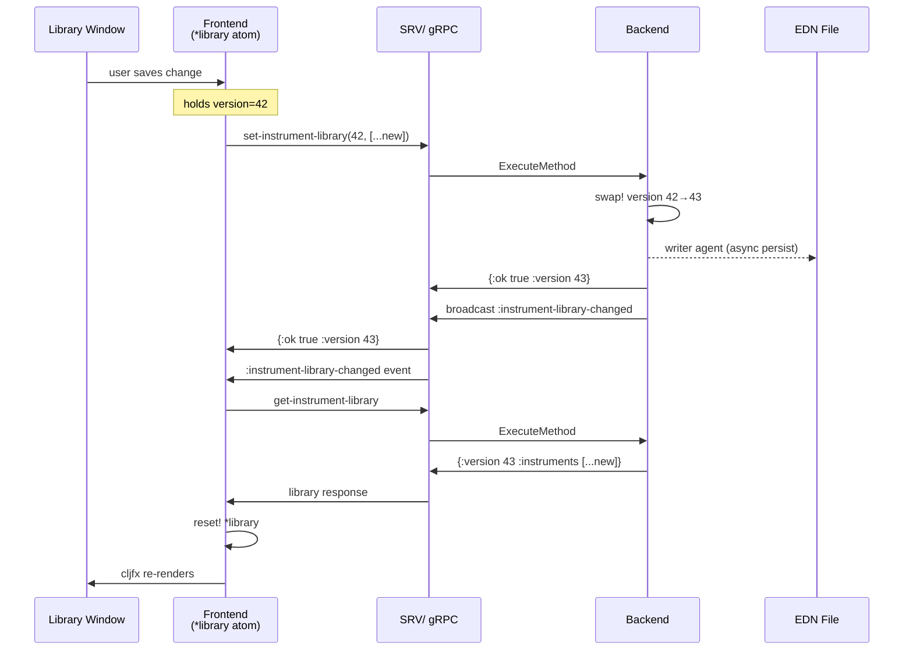
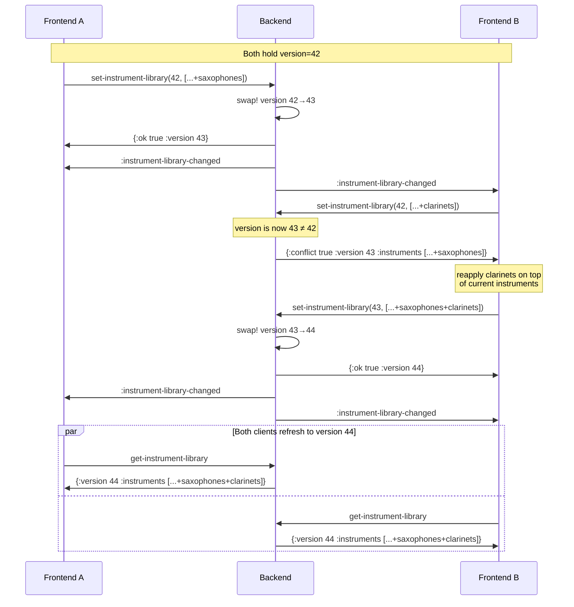
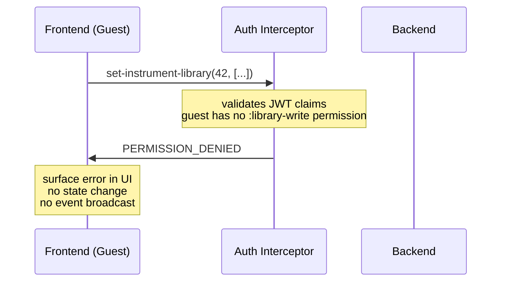

# ADR-0045: Instrument Library

## Status

Accepted

## Table of Contents

- [Context](#context)
- [Decision](#decision)
  - [Backend Component](#backend-component)
  - [API Surface](#api-surface)
  - [Instrument Record Format](#instrument-record-format)
  - [Optimistic Locking](#optimistic-locking)
  - [Frontend Caching Model](#frontend-caching-model)
  - [Event Architecture](#event-architecture)
  - [Authorization](#authorization)
  - [Frontend Window](#frontend-window)
  - [Selection Model](#selection-model)
  - [Editing Interactions](#editing-interactions)
  - [Undo/Redo](#undoredo)
  - [Default Library Contents](#default-library-contents)
- [Sequence Diagrams](#sequence-diagrams)
  - [Single Client: User Modifies Library](#single-client-user-modifies-library)
  - [Multiple Clients: Concurrent Window Refresh](#multiple-clients-concurrent-window-refresh)
  - [Concurrent Writes: Conflict and Retry](#concurrent-writes-conflict-and-retry)
  - [Authorization Gate: Guest Without Write Permission](#authorization-gate-guest-without-write-permission)
- [Rationale](#rationale)
- [Consequences](#consequences)
- [References](#references)

---

## Context

Ooloi requires a server-side registry of instrument definitions — names, families, and transposition
specifications — that the frontend uses when assigning instruments to musicians. This registry is the
**Instrument Library**.

The Instrument Library differs from every other data entity in the system:

- It is **global and singleton**: one library per backend, shared across all pieces and all clients.
  It is not scoped to any piece and carries no piece identifier.
- It holds **`Instrument` records**: the library stores real `Instrument` defrecords containing
  real `Staff` defrecords — the same types used in pieces. When a musician is assigned an instrument,
  the piece receives the library record. From that point the piece and the library are independent —
  renaming a library entry does not rename instruments already in pieces.
- It is **collaboratively editable**: in a shared session, the host and any guest granted write
  permission may modify the library simultaneously. Modifications must not silently overwrite each
  other. Instruments must never vanish due to a concurrent write.
- It is **persistently stored**: the library survives application restarts, stored as EDN in the
  platform-standard user data directory.

The Instrument Library is the first non-piece backend entity in Ooloi. It is implemented before the
Piece Preferences Window because it is self-contained: it has no dependency on piece identity,
piece windows, or the piece lifecycle. This makes it a clean specimen for validating the
**invalidate → fetch → replace** pattern that all backend-connected frontend state will follow.

---

## Decision

### Backend Component

The Instrument Library is an Integrant component with two internal members:

- **`library` atom** — holds `{:version <integer> :instruments <vector> :excluded <set>}`. An
  atom suffices because the library is a single container; no coordination with other refs is
  required. The atom's CAS semantics ensure that the version check and state replacement inside
  `swap!` are atomic — no concurrent writer can observe a partial update. Optimistic locking (see
  below) handles the separate concern of surfacing conflicting full-replace operations to callers.
  The `:excluded` set is part of the running atom so that write-time tombstone computation has
  access to the existing tombstones without disk I/O.
- **writer agent** — receives persist tasks asynchronously so that write operations return
  immediately without blocking on disk I/O.

The library is loaded from a bundled EDN file at component initialisation. User modifications are
persisted to the platform-specific user data directory, which takes precedence over the bundle on
subsequent starts.

### API Surface

Two operations are exposed, both declared with `^{:api true}` in `interfaces.clj` and exported
through `core.clj` → `api.clj` → `SRV/*`:

**`get-instrument-library`**
Returns the current library as a map:
```clojure
{:version     <integer>
 :instruments [<Instrument> ...]}
```
The instruments vector contains `Instrument` defrecords. Vector position determines display order
within each family group. No arguments. Safe to call from any client at any time.

**`set-instrument-library`**
Replaces the entire library. Takes the version the client last observed and the new instrument
vector:
```clojure
(set-instrument-library expected-version new-instruments)
```
Returns one of:
```clojure
{:ok true  :version <new-version>}                                  ; success
{:conflict true :version <current-version> :instruments <current>}  ; version mismatch
{:error :duplicate-ids :ids #{...}}                                 ; duplicate :id values in submitted vector
```
On success: increments the version counter, dispatches persistence to the writer agent, and
broadcasts `:instrument-library-changed` to all subscribed clients.
On conflict: returns the current library unchanged. The caller reapplies its pending change on top
of the returned state and retries.
On duplicate IDs: rejects the write without modifying state and returns the set of conflicting
`:id` values. The backend validates that every `:id` in the submitted instruments vector is unique
before accepting any write. Duplicate IDs would cause semantic corruption in the tombstone
mechanism, merge-on-load, and conflict-retry logic — all of which key on `:id` identity. This
check is O(n) and the library is bounded in size; the cost is negligible.

These are the only two API functions. All editing logic — add, remove, reorder, rename — lives
entirely in the frontend and is expressed as a transformation of the instrument vector before
calling `set-instrument-library`.

### Instrument Record Format

The library holds real `Instrument` defrecords containing real `Staff` defrecords — the same types
used in pieces. There is no separate "template" format and no template-to-defrecord conversion.
Assigning an instrument from the library to a piece uses the library record directly.

#### Instrument Fields

| Field | Type | Default | Description |
|---|---|---|---|
| `:id` | keyword | UUID-based | Unique identifier. **Bundled instruments** follow the convention `:instrument-name[-transposition-key][-notation-variant]-language`. Rules: (1) **Use full formal names** — `:violoncello-fr` not `:cello-fr`, `:tenor-trombone-en` not `:trombone-en`. (2) **Transposition key follows the instrument name** — `:clarinet-bb-de`, `:trumpet-bb-en`, `:horn-f-it`. Always include for keyed transposing instruments; omit for octave transpositions (xylophone, guitar, double bass). (3) **Include the notation variant** when multiple conventions exist — `:bass-clarinet-bb-german-it`, `:bass-clarinet-bb-french-it`. (4) **Disambiguate with a category suffix** when the base name collides across families — solo voices use `-voice`: `:soprano-voice-en`, `:bass-voice-de`, `:tenor-voice-fr`. (5) Non-transposing instruments with unambiguous names use the name directly: `:flute-en`, `:oboe-it`, `:violin-de`. **User-created instruments** receive a UUID-based keyword generated by the frontend at creation time, e.g. `:instrument-550e8400-e29b-41d4-a716-446655440000`. Users never see or interact with `:id` values; they are entirely internal identifiers. Must be unique across the entire instrument vector. |
| `:name` | string | `"Unnamed Instrument"` | Full display name, e.g. `"Clarinetto in Si♭"` |
| `:short-name` | string | `""` | Abbreviated name for score labels, e.g. `"Cl."` |
| `:number` | integer or nil | `nil` | Ordinal for numbered parts: 1, 2, 3. Renders as `short-name + " " + number` → `"Fl. 1"`, `"Fl. 2"`. `nil` means unnumbered. |
| `:language` | keyword or nil | `nil` | Language of name fields: `:it`, `:de`, `:fr`, `:en`, or any user-defined keyword. Open set — not limited to bundled languages. |
| `:family` | keyword or nil | `nil` | Instrument family: `:woodwind`, `:brass`, `:strings`, `:percussion`, `:keyboard`, `:plucked`, `:voice`, `:other` |
| `:transposition` | map or nil | `nil` | Unified transposition data. `nil` for non-transposing instruments. See **Transposition** below. |
| `:range` | map or nil | `nil` | Professional/full range: `{:low <pitch> :high <pitch>}`. Notes outside this range are coloured red in the frontend as a range warning. Uses ADR-0026 pitch strings. |
| `:amateur-range` | map or nil | `nil` | Non-professional range: `{:low <pitch> :high <pitch>}`. Notes outside this range but within `:range` are coloured yellow. `nil` means no amateur range distinction. |
| `:comment` | string or nil | `nil` | Explanatory note shown in the Instrument Library window to help the user choose between variants (e.g. `"Old notation"`). Never used in scores — score labels come from `:name` and `:short-name` only. |
| `:staves` | vector | `[]` | `Staff` defrecords; see **Staff Fields** below |
| `:next-id` | integer | `1` | Internal counter for voice ID generation |
| `:key-signature-overrides` | ChangeSet | empty | Overrides of piece-level key signatures. Hierarchically resolved by timewalk: staff overrides instrument overrides piece. |

**Display ordering**: instruments are displayed in the order they appear in the vector. Vector
position is the sort order. The full-replace API (`set-instrument-library` sends the complete
vector every time) means no separate sort-order field is needed — reordering is simply moving
an element in the vector and submitting the new vector.

#### Staff Fields

Every instrument must declare its staves. Each staff is a `Staff` defrecord:

| Field | Type | Default | Description |
|---|---|---|---|
| `:id` | keyword | UUID-based | Unique identifier for this staff |
| `:name` | string | `""` | Full display name for the staff, e.g. `"Mano destra"`. Empty for most single-staff instruments. |
| `:short-name` | string | `""` | Abbreviated name, e.g. `"M.d."` |
| `:clefs` | map | `{:sounding {:default-clef :treble} :written {:default-clef :treble}}` | Consolidated clef specification; see below |
| `:num-lines` | integer | `5` | Number of staff lines |
| `:measures` | vector | `[]` | Measure contents (empty in library instruments) |
| `:key-signature-overrides` | ChangeSet | empty | Overrides of instrument-level key signature overrides |
| `:clef-changes` | ChangeSet | empty | Clef changes over time within this staff |

The `:clefs` map is a consolidated specification of how pitches are read off the staff:

```clojure
;; Non-transposing, single clef (simplest case)
:clefs {:sounding {:default-clef :treble}
        :written  {:default-clef :treble}}

;; Transposing, different default clefs per display mode
:clefs {:sounding {:default-clef :bass}
        :written  {:default-clef :treble}}

;; With aux ranges (in written pitch — see convention below)
:clefs {:sounding   {:default-clef :bass}
        :written    {:default-clef :bass}
        :aux-ranges {:tenor {:low "C3" :high "B4"}}}
```

For non-transposing instruments `:sounding` and `:written` are identical. Both keys must be
present regardless.

**Clef keywords**: `:treble`, `:treble-8vb`, `:bass`, `:tenor`, `:alto`, `:soprano`,
`:mezzo-soprano`, `:baritone`, `:percussion`.

**`:aux-ranges`** is a map from clef keyword to a `{:low <pitch> :high <pitch>}` range, using
Ooloi's string-based pitch representation ([ADR-0026](0026-Pitch-Representation-and-Operations.md)).
The bounds are expressed in **written pitch** (clef switching is a notational decision — "switch
to tenor clef when the written note goes above X on the page"). The bounds are inclusive and soft:
they give the notation engine the information it needs to reason about automatic clef selection,
not hard cut-offs. When a passage falls within a clef's range, the engine prefers that clef over
the default. Only auxiliary clefs — those other than the `:default-clef` — are listed; the
default clef is implicitly preferred for everything else.

#### Transposition

The `:transposition` field on the `Instrument` record is a unified map that prevents impossible
states: separate fields would allow clef overrides on a non-transposing instrument, or a missing
base transposition with overrides present. The unified map makes these structurally impossible.

```clojure
;; Non-transposing instrument:
:transposition nil

;; Transposing, no clef overrides:
:transposition {:sounding->written [:up :perfect :fifth]}

;; Transposing with clef-dependent overrides (e.g. Horn in F, old notation):
:transposition {:sounding->written [:up :perfect :fifth]
                :clef-overrides {:bass {:sounding->written [:down :perfect :fourth]}}}
```

`(nil? (:transposition instrument))` definitively answers "is this instrument transposing?" — no
additional checks needed.

Transposition vectors are passed directly to `make-transposer` via `apply`, using any of the three
lanes defined in [ADR-0026](0026-Pitch-Representation-and-Operations.md). At the call site,
the active clef is checked against `:clef-overrides` first; the base transposition is used
as the fallback:

```clojure
(defn transposition-for-clef [transposition clef]
  (or (get-in transposition [:clef-overrides clef])
      transposition))
```

Most transposing instruments apply the same transposition regardless of which clef is active. For
these, `:sounding->written` inside the `:transposition` map is sufficient. The reverse direction
is derivable via `invert-transposition-direction`.

Some instruments deviate: the same clef symbol carries a different transposition depending on
notation convention. Historical natural horns are the canonical case — a Horn in F in treble clef
sounds a perfect fifth below written, but in bass clef (*old notation*) the same horn sounds a
perfect fourth *above* written. Both clefs may appear on the same staff; the transposition switches
with the clef. The `:clef-overrides` key within `:transposition` captures these deviations.

No functions are stored in the library atom or in persistence. Transposer functions are constructed
at the call site: `(apply make-transposer (:sounding->written (:transposition instrument)))`.

#### Examples

```clojure
;; Non-transposing, single staff — Italian copy
(create-instrument
  :id :flute-it :language :it
  :name "Flauto" :short-name "Fl."
  :family :woodwind
  :staves [(create-staff
             :clefs {:sounding {:default-clef :treble}
                     :written  {:default-clef :treble}})])

;; Transposing, single staff (sounds octave above written)
(create-instrument
  :id :piccolo-it :language :it
  :name "Flauto piccolo" :short-name "Fl. picc."
  :family :woodwind
  :transposition {:sounding->written [:down :perfect :octave]}
  :staves [(create-staff
             :clefs {:sounding {:default-clef :treble}
                     :written  {:default-clef :treble}})])

;; Non-transposing, two staves — Italian copy
(create-instrument
  :id :piano-it :language :it
  :name "Pianoforte" :short-name "Pf."
  :family :keyboard
  :staves [(create-staff
             :name "Mano destra" :short-name "M.d."
             :clefs {:sounding {:default-clef :treble}
                     :written  {:default-clef :treble}})
           (create-staff
             :name "Mano sinistra" :short-name "M.s."
             :clefs {:sounding {:default-clef :bass}
                     :written  {:default-clef :bass}})])

;; Transposing — Bb Clarinet
(create-instrument
  :id :clarinet-bb-it :language :it
  :name "Clarinetto in Si♭" :short-name "Cl."
  :family :woodwind
  :transposition {:sounding->written [:up :major :second]}
  :staves [(create-staff
             :clefs {:sounding {:default-clef :treble}
                     :written  {:default-clef :treble}})])

;; Transposing — fluid keywords with compound interval
;; Bass Clarinet: bass clef at concert pitch; treble (French notation) when transposing
(create-instrument
  :id :bass-clarinet-bb-french-it :language :it
  :name "Clarinetto basso in Si♭" :short-name "Cl. b."
  :family :woodwind
  :transposition {:sounding->written [:up :major :ninth]}
  :staves [(create-staff
             :clefs {:sounding {:default-clef :bass}
                     :written  {:default-clef :treble}})])

;; Modern Horn in F — no :clef-overrides; bass clef uses the same P5 transposition as treble
(create-instrument
  :id :horn-f-it :language :it
  :name "Corno in Fa" :short-name "Cor."
  :family :brass
  :transposition {:sounding->written [:up :perfect :fifth]}
  :range        {:low "B1" :high "F5"}
  :amateur-range {:low "E2" :high "C5"}
  :staves [(create-staff
             :clefs {:sounding {:default-clef :bass}
                     :written  {:default-clef :treble}})])

;; Historical Horn in F — :clef-overrides for old-notation bass clef transposition
;; Treble: sounds P5 below written. Bass (old notation): sounds P4 above written.
(create-instrument
  :id :horn-f-old-notation-it :language :it
  :name "Corno in Fa" :short-name "Cor."
  :family :brass
  :comment "Notazione antica"
  :transposition {:sounding->written [:up :perfect :fifth]
                  :clef-overrides {:bass {:sounding->written [:down :perfect :fourth]}}}
  :staves [(create-staff
             :clefs {:sounding {:default-clef :treble}
                     :written  {:default-clef :treble}
                     :aux-ranges {:bass {:low "B1" :high "E4"}}})])

;; Transposing with microtonal offset (fluid keywords + :cents)
;; Quarter-tone Bb Trumpet: pitched a quarter tone flat of Bb — sounds M2 + 50¢ below written
(create-instrument
  :id :quartertone-bb-tpt-en :language :en
  :name "Quarter-tone Trumpet in B♭" :short-name "Tpt."
  :family :brass
  :transposition {:sounding->written [:up :major :second :cents 50]}
  :staves [(create-staff
             :clefs {:sounding {:default-clef :treble}
                     :written  {:default-clef :treble}})])
```

#### Instrument Names and Language

Instrument names are plain strings. The library has no localisation infrastructure — there is no
language map per instrument and no automatic translation. Instead, the bundled EDN ships multiple
copies of each instrument, one per supported language, each carrying a `:language` keyword:

```clojure
{:id :flute-en :language :en :family :woodwind :name "Flute"  :short-name "Fl."  ...}
{:id :flute-it :language :it :family :woodwind :name "Flauto" :short-name "Fl."  ...}
{:id :flute-de :language :de :family :woodwind :name "Flöte"  :short-name "Fl."  ...}
{:id :flute-fr :language :fr :family :woodwind :name "Flûte"  :short-name "Fl."  ...}
```

The Instrument Library window filters by `:language`, showing only the entries the user wants to
work with. A composer using Italian conventions sees only Italian entries; the German, French, and
English copies are hidden unless explicitly included. This prevents the instrument picker from
becoming cluttered with four copies of every instrument.

**Supported languages in the bundled EDN:**

| Keyword | Language | Rationale |
|---|---|---|
| `:it` | Italian | Historical default for Western classical scores; opera tradition |
| `:de` | German | Standard for Austro-German repertoire and its major publishers |
| `:fr` | French | Standard for French repertoire and French publisher editions |
| `:en` | English | British/American repertoire; increasingly common in contemporary scores |

These four cover the entire range of internationally circulated orchestral scores. Other languages
(Dutch, Swedish, Czech, Russian, Spanish, etc.) are outside the bundled set. Users may add entries
in any language by editing their library; the `:language` keyword accepts any keyword value, not
only the four above.

A score written with Italian conventions uses the Italian copies; a German score uses the German
ones. Users who work in a single language never encounter language machinery. A user adding a
custom instrument adds one copy in their working language and optionally adds further copies for
other languages.

This approach is preferred over per-instrument language maps because: it requires no canonical
language registry, no multi-language input UI for new instruments, no lookup logic driven by piece
preference, and no changes to the Instrument record when a new language is needed. The library
remains a simple collection of Instrument records.

The Instrument Library window exposes a language filter dropdown that uses the `:language` keyword
for filtering. See [Frontend Window](#frontend-window) for the complete UI specification.

### Optimistic Locking

The library atom holds a version counter alongside the instrument vector. Every successful write
increments the counter. `set-instrument-library` requires the caller to supply the version it last
observed; the backend rejects writes based on stale versions.

This guarantees that no instrument can be silently overwritten or lost in a concurrent write
scenario. The conflict path is not an error to suppress — it is the defined protocol for concurrent
editing. A client that receives a conflict response:

1. Receives the current library (returned in the conflict response)
2. Reapplies its pending change on top of the current instruments
3. Retries `set-instrument-library` with the version from the conflict response

To reapply correctly, the client must track three values when it initiates a write: the base version it was editing from, the instruments vector at that version, and the new instruments vector it was submitting. The pending delta is the diff between the original and the new; that same delta is applied to the conflict-response instruments to produce the retry payload. This is the only way to merge concurrent adds, removes, or renames without losing either client's changes.

Because the event loop delivers `:instrument-library-changed` to all clients after every successful
write, the conflict window is narrow in practice: both clients would need to submit writes before
either has processed the other's event. Nonetheless, the protocol is correct regardless of timing.

### Frontend Caching Model

The frontend maintains a single atom `*instrument-library`. Its value is one of:

- `{:version n :instruments [...]}` — data is fresh and ready to use
- `nil` — data is stale; must be fetched before the window can render

**`nil` is the staleness marker.** No separate flag is needed. The atom starts as `nil`.

All gRPC calls are dispatched on the shared Claypoole thread pool (`cp/future`) — never on the
JAT. When the response arrives (still on the Claypoole thread), atom state is updated directly
(`reset!`). Any subsequent scene-graph mutation is delivered to the JAT via `fx/run-later!`.
This is the standard frontend threading rhythm: compute off-thread, materialise on-thread.

**When `:instrument-library-changed` arrives and the window is open**: `cp/future` calls
`SRV/get-instrument-library`, `reset!`s the atom with the response. cljfx diffs the
instrument vector and updates only changed items.

**When `:instrument-library-changed` arrives and the window is closed**: `reset!` the atom to
`nil`. No network call is made. The data will be fetched when the window opens.

**When the window opens**: check `(nil? @*instrument-library)`. If nil, `cp/future` calls
`SRV/get-instrument-library`, `reset!`s the atom when the response arrives, then renders.
If not nil, render immediately from the cached value.

**When the user saves edits**: `cp/future` calls `SRV/set-instrument-library` with the
expected version and new instruments vector. The response (success, conflict, or duplicate-IDs)
is handled on the Claypoole thread; any UI feedback (conflict dialog, error display) is
delivered to the JAT via `fx/run-later!`.

This means a client that never opens the Instrument Library window pays no fetch cost at all, even
if the library is modified repeatedly by other clients during the session. The cost is deferred
until the moment the data is actually needed.

The window reads from `*instrument-library` exclusively. It never holds a separate copy. All
in-progress editing state (e.g. an instrument the user is currently renaming) is local UI state,
separate from `*instrument-library`, and is resolved before `set-instrument-library` is called.

**The sending client also uses the event loop.** After a successful `set-instrument-library`, the
sender does not update `*instrument-library` from the `{:ok true :version n}` response. It waits
for the `:instrument-library-changed` event it will receive as a subscriber, then refetches like
any other client. This keeps a single code path for all state updates regardless of whether the
change originated locally or remotely.

**The frontend has no awareness of tombstones.** It holds no local record of which instruments
have been deleted, no `:excluded` set, and no deletion state of any kind. From the frontend's
perspective, the instrument library is simply a vector of Instrument records: it renders what is
there and submits what it wants to be there. The tombstone mechanism is entirely internal to the backend —
the frontend participates in it only by omitting an entry from the vector it submits.

### Event Architecture

**New backend event type**: `:instrument-library-changed`

Carries only `:timestamp`. No payload — clients fetch current state themselves via
`get-instrument-library`. This establishes the invalidate-only pattern that `:piece-structure-changed`
(Step 5 of the development sequence) will follow.

**New frontend bus category**: `:instrument-library`

The Event Router's `derive-category` function maps `:instrument-library-changed` to
`:instrument-library`. Any frontend component that needs the current library subscribes to this
category.

Both `:instrument-library-changed` and the `:instrument-library` bus category must be added to
[ADR-0018](0018-API-gRPC-Interface-and-Events.md) and [ADR-0031](0031-Frontend-Event-Driven-Architecture.md)
respectively when this component is implemented.

### Authorization

**Combined app (in-process transport)**: All library operations are permitted. No authentication is
required. This is the default mode for the vast majority of users.

**Collaborative session (network transport)**: The host has unconditional write access. Guest clients
are read-only by default. Write access requires explicit grant by the host, per the permission model
in [ADR-0036](0036-Collaborative-Sessions-and-Hybrid-Transport.md). The existing
`create-api-authentication-interceptor` in `backend/grpc/server.clj` enforces this at the gRPC
layer; no changes to the interceptor infrastructure are required.

**Development order**: The basic invalidate/fetch/replace mechanism is implemented and tested first,
without permission enforcement. Authorization is layered in through subsequent tests once the
foundation is stable.

### Frontend Window

The Instrument Library window is a full persistent window managed by the UI Manager
(`show-instrument-library!`). It has two filtering controls and a grouped instrument list.

The window follows the **mounted renderer pattern** required by the UI Architecture for all persistent windows: the window spec is a function of the current `*instrument-library` atom value, the `*il-selection` atom, the current locale, and the `:instrument-library/language-filter` app setting, evaluated inside the mounted renderer. This ensures that library updates, selection changes, locale changes, and language filter changes all cause a re-render automatically without any explicit listener wiring.

#### Language Filter

A dropdown control filters the visible entries by `:language`. The options are:

| Dropdown option | Translation key | UK English value |
|---|---|---|
| Label for the dropdown | `:instrument-library.language.label` | `"Language"` |
| Italian | `:instrument-library.language.italian` | `"Italian"` |
| German | `:instrument-library.language.german` | `"German"` |
| French | `:instrument-library.language.french` | `"French"` |
| English | `:instrument-library.language.english` | `"English"` |
| Other | `:instrument-library.language.other` | `"Other"` |
| All (show all) | `:instrument-library.language.all` | `"All"` |

Options are translated via `(tr key)` per [ADR-0039](0039-Localisation-Architecture.md). Keys
must be declared with `tr-declare`; no computed keys. All seven keys must be added to every `.po`
locale file in `resources/i18n/`.

Selecting a language shows only instruments whose `:language` value matches. Selecting **Other**
shows instruments whose `:language` value is not one of `:it`, `:de`, `:fr`, `:en`. Selecting
**All** removes language filtering entirely.

**The language filter selection is an app setting**, not ephemeral window state. It is declared
with `def-app-setting` per [ADR-0043](0043-Frontend-Settings.md):

```clojure
(def-app-setting :instrument-library/language-filter
  {:default :all
   :choices {:all   :instrument-library.language.all
             :it    :instrument-library.language.italian
             :de    :instrument-library.language.german
             :fr    :instrument-library.language.french
             :en    :instrument-library.language.english
             :other :instrument-library.language.other}})
```

The undo menu displays the setting name via the standard convention:
`:instrument-library/language-filter` → `:setting.instrument-library.language-filter.name`.
This key must be added to all locale files.

Consequences:

- The selected language persists across application restarts.
- Changing the filter calls `set-app-setting!`, which publishes a `:setting-changed` event to
  the `:app-settings` bus category. The undo/redo module records this automatically — no extra
  wiring is needed.
- The Settings window may surface `:instrument-library/language-filter` as an editable
  preference. If it does, changing the setting there updates the IL window's dropdown
  immediately, because the IL window subscribes to `:setting-changed` events on the
  `:app-settings` category and re-renders when this key changes.

#### Search

A text field filters the visible entries on every keypress. Filtering is:

- **Substring**: the search string must be contained anywhere in the name — not a prefix match.
  Typing `"Co"` shows all instruments whose `:name` contains `"Co"`: Corno, Contrabasso, Cor anglais, etc.
- **Case-insensitive**: `"cl"` matches `"Clarinetto"`, `"Cl."`, `"Bass Clarinet"`.
- **Both name fields**: filtering tests against both `:name` and `:short-name`. A search for
  `"Cl."` matches instruments whose short name is `"Cl."` even when the full name does not contain
  those characters.
- **No backend calls**: search is pure frontend state. The full instrument vector is already held
  in `*instrument-library`; filtering is a local predicate applied before rendering.

Language filter and search are applied conjunctively: the visible set is the intersection of
entries that match the language selection and entries that match the search string.

#### Instrument List

Instruments passing both filters are displayed grouped by `:family`, with each family in a
collapsible section in canonical score order: Woodwinds ▶, Brass ▶, Percussion ▶, Other ▶,
Keyboard ▶, Plucked ▶, Voice ▶, Strings ▶. Within each family, instruments appear in vector order. Instrument names
are rendered as rich text to display real ♭ (U+266D), ♮ (U+266E), and ♯ (U+266F).

Drag-to-reorder is available to clients with write permission. Reordering moves the element in
the instruments vector and submits the new vector via `set-instrument-library`. No separate
sort-order field is needed — the full-replace API means vector position is the sort order. If the
write conflicts (another client modified the library between the drag and the submit), the
conflict response returns the current vector; the frontend reapplies the move operation on the
returned vector and retries.

Editing controls (add, remove, reorder, rename instruments) appear only when the current client has
write permission. In a standalone session the local user always has write permission. In a
collaborative session, guests have write permission only if the host has granted it. See
[ADR-0036](0036-Collaborative-Sessions-and-Hybrid-Transport.md).

### Selection Model

Multi-select with standard platform conventions. Both instrument selection (`:selected`) and
staff selection (`:selected-staves`) use **vectors**, not sets — the first element is the
**anchor** for shift-click and shift-arrow range extension. Clojure sets are unordered, so
`(first set)` returns an arbitrary element; vectors preserve insertion order and provide a
stable anchor. Selection state is held in the window's view-state atom.

**Instrument selection** (`:selected` — vector of instrument `:id` keywords):

- **Click** selects one instrument, clearing previous selection and any staff selection.
- **Cmd/Ctrl-click** toggles an instrument in or out of the current selection.
- **Shift-click** extends selection to a contiguous range within the same family.
- **Cross-family Cmd/Ctrl-click** works — the selection can span multiple families.
- **Arrow up/down** moves instrument selection one step within visible (filtered) instruments.
- **Shift+arrow up/down** extends/contracts the selection range preserving the anchor.
- **Select All**: nothing selected → all instruments in all families; one or more instruments
  selected → all instruments in the families containing selected instruments.

**Staff selection** (`:selected-staves` — vector of staff `:id` keywords within one instrument):

- **Click on a staff** selects that staff, clearing instrument selection.
- **Cmd/Ctrl-click** toggles a staff in or out of the current staff selection.
- **Shift-click** extends to a contiguous range within the instrument's staves vector.
- **Arrow up/down** (when staff selection is active) moves within the instrument's staves.
- **Shift+arrow up/down** extends/contracts staff selection preserving the anchor.
- **Collapsing an instrument** clears its staff selection.

**Mutual exclusivity**: instrument selection and staff selection cannot both be non-empty
simultaneously. Selecting an instrument clears staff selection; selecting a staff clears
instrument selection.

**Keyboard navigation respects filters**: arrow key navigation operates on the visible
(language-filtered and search-filtered) instrument list, not the full library. This ensures
arrow keys only step through instruments the user can see.

Selection is frontend-only state. It is never sent to the backend and not persisted across window
close/reopen.

### Editing Interactions

All editing operations apply to the current selection. Write permission is required (see
[Authorization](#authorization)).

- **Delete**: removes selected instruments from the vector. Always shows a confirmation dialog
  before mutation; no change on cancel.
- **Duplicate**: creates copies of selected instruments with new UUID-based `:id` keywords and
  `" (copy)"` appended to `:name`. Copies are inserted immediately after the originals in vector
  order within each family.
- **Reorder (drag)**: moves selected instruments within their family. Relative order of dragged
  instruments is preserved. Instruments cannot be dragged across families.
- **Modifier-drag** (Option on macOS, Alt on other platforms): produces copies at the drop
  position instead of moving the originals. Same duplication semantics as Duplicate (new UUID `:id`,
  `" (copy)"` suffix).

All mutations are expressed as transformations of the instrument vector and submitted via
`set-instrument-library`. See [Optimistic Locking](#optimistic-locking) for conflict handling.

#### Staff Editing

Staff operations follow the same patterns as instrument operations, applied within an instrument's
`:staves` vector via `update-instrument-field`:

- **Delete**: removes selected staves. Last-staff protection prevents deleting an instrument's sole
  staff (confirmation dialog for multi-staff delete).
- **Reorder (drag within instrument)**: moves a staff to a new position within the same instrument's
  staves vector.
- **Modifier-drag within instrument**: duplicates the staff with a new UUID `:id`.
- **Plain drag to different instrument**: rejected — cross-instrument moves are not supported.
- **Modifier-drag to different instrument**: clones the staff with a new UUID `:id`, appended to
  the target instrument's staves. Source instrument is unmodified.

Staff selection is mutually exclusive with instrument selection — selecting a staff clears instrument
selection and vice versa. Shift-extend is constrained to the same instrument.

### Undo/Redo

IL editing operations (reorder, delete, duplicate, rename, add) are undoable. Because the IL is a
backend-managed shared resource using atom-based optimistic locking — not STM refs — its undo/redo
uses a lightweight backend-managed stack rather than the STM-based Tier 1 mechanism described in
[ADR-0015](0015-Undo-and-Redo.md). The frontend never maintains an undo stack for IL operations; it
requests undo/redo from the backend.

This is a Tier 1 variant: same frontend interaction pattern (frontend requests, backend owns the
stack), different backend implementation (atom CAS, not `dosync`). Other editor windows for
singleton backend resources (e.g. a future clef catalogue editor) will follow the same pattern. See
ADR-0015 §Notes for the full rationale.

Implementation follows the general undo/redo system and is staged — this section specifies the end
state.

### Default Library Contents

The bundled EDN ships Instrument records covering the full modern symphony orchestra and beyond,
including woodwinds, brass, strings, percussion, keyboards, plucked instruments, voices, choirs,
special-effect instruments, and a selection of historical instruments.

Each instrument appears in up to four language copies (`:it`, `:de`, `:fr`, `:en`). Instruments
whose names do not vary across these four languages (most percussion, some keyboards) carry
fewer copies. Every copy has a distinct `:id` (e.g. `:clarinet-bb-it`, `:clarinet-bb-de`).

The bundled library is a starting point, not a closed set. Any instrument not listed here —
whether a historical reconstruction, a microtonal variant, a folk instrument, or a newly
invented sound source — can be added by the user at any time through the Instrument Library
window and is saved permanently to the user's library file.

**Persistence format.** The user's library file is an EDN map with three keys:

```clojure
{:version   <integer>
 :instruments [<Instrument> ...]
 :excluded  #{<keyword> ...}}
```

Both the bundled EDN and the user file store instruments as **plain maps**, not as defrecord tagged literals. `load-bundle` and `load-user-library` construct real Instrument/Staff records from plain maps on load. `persist!` converts records back to plain maps before writing. This keeps EDN files human-readable, avoids coupling the serialization format to Clojure class names, and requires no custom EDN readers for round-trip.

`:excluded` is a set of **bundle** instrument `:id`s that the user has deleted. It exists to
make deletion permanent across application updates: bundle entries in `:excluded` are not
re-inserted by merge-on-load. Only bundle-format IDs (`:instrument-key-language`) are added
to `:excluded`; user-created UUID IDs (`:instrument-<UUID>`) are never added, because they
cannot match a bundle entry and would accumulate as dead weight.

**Merge-on-load.** At component initialisation, the backend merges the bundle with the user
file as follows:

1. Load the user file if it exists; otherwise start from an empty instruments vector and empty
   excluded set.
2. For each bundle entry, insert it into the instruments vector unless its `:id` is already
   present in `:instruments` (user has modified or renamed it) or its `:id` appears in
   `:excluded` (user has deleted it). Newly inserted bundle entries are appended to the instruments
   vector.
3. The merged instruments vector and the `:excluded` set become the initial atom state, together
   with the version from the user file (or 0 if no user file exists).

This means application updates that ship new bundle instruments deliver them automatically on
next startup. Previously deleted bundle instruments are not re-inserted — the excluded set
acts as a permanent tombstone. User-added instruments (whose `:id`s are not in the bundle) are
never affected by merging.

The frontend sends no explicit deletion signal. Deletions are implicit: the frontend submits a
new instruments vector with the deleted entry absent. On each successful `set-instrument-library`,
the backend computes the updated excluded set: any **bundle-format** `:id` present in the
previous instruments vector but absent from the new one is added to the existing excluded set.
User-created instruments (UUID-format `:id`s) are excluded from this computation — they can
never collide with bundle entries and would otherwise accumulate as tombstones that never match
anything. The updated atom state — incremented version, new instruments vector, and updated
excluded set — is then dispatched to the writer agent for persistence. The frontend never sees
or manages `:excluded`; it is entirely a backend concern.

For the complete listing of all bundled instruments — grouped by family with clefs, transpositions,
and notes — see the [Bundled Instrument Library Catalogue](../guides/INSTRUMENT_LIBRARY_CATALOGUE.md).

The [Examples](#examples) above show `create-instrument` constructor calls demonstrating the three transposer lanes. The following examples show the EDN persistence format — plain maps covering six structural variations:

**Non-transposing instrument** (Flute):

```clojure
{:id :flute-en
 :name "Flute" :short-name "Fl."
 :language :en :family :woodwind
 :transposition nil
 :staves [{:clefs {:sounding {:default-clef :treble}
                   :written  {:default-clef :treble}}}]}
```

`(nil? (:transposition instrument))` definitively answers "is this instrument transposing?" — no
additional checks needed.

**Simple transposing instrument** (Clarinet in B♭):

```clojure
{:id :clarinet-bb-en
 :name "Clarinet in B♭" :short-name "Cl. in B♭"
 :language :en :family :woodwind
 :transposition {:sounding->written [:up :major :second]}
 :staves [{:clefs {:sounding {:default-clef :treble}
                   :written  {:default-clef :treble}}}]}
```

Most transposing instruments apply the same transposition regardless of which clef is active. For
these, `:sounding->written` inside the `:transposition` map is sufficient. The reverse direction
is derivable via `invert-transposition-direction`.

**Clef-dependent transposition** (Horn in F, old notation):

```clojure
{:id :horn-f-old-notation-en
 :name "Horn in F" :short-name "Hn. in F"
 :language :en :family :brass
 :comment "Old notation"
 :transposition {:sounding->written [:up :perfect :fifth]
                 :clef-overrides {:bass {:sounding->written [:down :perfect :fourth]}}}
 :range         {:low "B1"  :high "F5"}
 :amateur-range {:low "C2"  :high "C5"}
 :staves [{:clefs {:sounding {:default-clef :treble}
                   :written  {:default-clef :treble}
                   :aux-ranges {:bass {:low "B1" :high "E4"}}}}]}
```

Natural horns in Classical and Romantic scores use *old notation* in bass clef: the written note
sounds one octave higher than under modern convention. Treble and bass clef therefore yield
different transposition intervals for the same instrument. The Horn in F sounds a perfect fifth
below written in treble clef but a perfect fourth *above* written in bass clef (old notation). The treble clef
transposition is the base `:sounding->written`; the bass clef transposition
is expressed as `:clef-overrides {:bass {...}}`. At the call site, the active clef is checked against
`:clef-overrides` first; the base transposition is used as the fallback:

```clojure
(defn transposition-for-clef [transposition clef]
  (or (get-in transposition [:clef-overrides clef])
      transposition))
```

**Multiple auxiliary clefs** (Violoncello):

```clojure
{:id :violoncello-en
 :name "Violoncello" :short-name "Vc."
 :language :en :family :strings
 :transposition nil
 :range         {:low "C2"  :high "C6"}
 :amateur-range {:low "C2"  :high "G5"}
 :staves [{:clefs {:sounding {:default-clef :bass}
                   :written  {:default-clef :bass}
                   :aux-ranges {:tenor  {:low "D4" :high "G5"}
                                :treble {:low "E5" :high "C6"}}}}]}
```

The cello's default clef is bass. When a passage rises into the tenor range, the notation engine
switches to tenor clef; when it goes higher still, to treble clef. The `:aux-ranges` map gives
the engine the information it needs: tenor clef is preferred for written pitches from D4 to G5,
treble clef from E5 to C6. The ranges overlap — the engine resolves ambiguity by preferring the
clef that avoids a clef change (i.e. staying in tenor when the passage briefly touches E5 before
returning to D4). Only auxiliary clefs appear in `:aux-ranges`; the default clef is implicitly
preferred for everything below the lowest auxiliary range.

**Sounding and written clefs differ** (Bass Clarinet, French notation):

```clojure
{:id :bass-clarinet-french-en
 :name "Bass Clarinet" :short-name "B.Cl."
 :language :en :family :woodwind
 :comment "French notation"
 :transposition {:sounding->written [:up :major :ninth]}
 :staves [{:clefs {:sounding {:default-clef :bass}
                   :written  {:default-clef :treble}}}]}
```

The Bass Clarinet in French notation is written in treble clef (transposing a major ninth) but
sounds in the bass register. The `:sounding` and `:written` maps carry different `:default-clef`
values so that the display engine knows which clef to show in each mode. The German notation
variant uses bass clef for both and transposes only a major second.

**Multi-staff instrument** (Piano):

```clojure
{:id :piano-en
 :name "Piano" :short-name "Pno."
 :language :en :family :keyboard
 :transposition nil
 :range {:low "A0" :high "C8"}
 :staves [{:name "Right hand" :short-name "R.H."
           :clefs {:sounding {:default-clef :treble}
                   :written  {:default-clef :treble}}}
          {:name "Left hand" :short-name "L.H."
           :clefs {:sounding {:default-clef :bass}
                   :written  {:default-clef :bass}}}]}
```

Multi-staff instruments declare one staff map per staff in the `:staves` vector. Each staff
carries its own `:name`, `:short-name`, and `:clefs`. The instrument-level `:range` covers
the entire instrument; individual staves do not carry separate ranges.

---

## Sequence Diagrams

### Single Client: User Modifies Library



### Multiple Clients: Concurrent Window Refresh

Both Client A and Client B have the Instrument Library window open. Client A modifies the library;
both windows update without any special coordination.


### Concurrent Writes: Conflict and Retry

Client A and Client B both hold version 42. Client A's write reaches the backend first. Client B
receives a conflict response, incorporates the current library, and retries successfully.



Both instruments survive. Neither client's change is lost.

### Authorization Gate: Guest Without Write Permission



---

## Rationale

### Why atom, not STM ref

Clojure offers two reference types for managing shared mutable state:

**Atoms** hold a single value and support atomic, compare-and-swap mutations via `swap!`. A
`swap!` function is applied to the current value; if no other thread has changed the atom in the
meantime, the result is stored atomically. If another thread changed it first, `swap!` retries
automatically with the new current value. Atoms are correct and efficient for single-reference
state that does not need to be coordinated with other state.

**STM refs** participate in Software Transactional Memory. Multiple refs can be read and written
together inside a `dosync` block, which commits atomically or retries the entire block on conflict.
STM is designed for coordinated multi-ref mutations — the canonical example in Ooloi is a VPD
operation that must update a measure, a voice, and a layout atomically, all within the piece's STM
ref. When multiple refs must change together and partial application would leave the system in an
inconsistent state, STM is the right tool.

The Instrument Library is a single container. No library mutation needs to be coordinated with a
mutation to any other ref in the same transaction. `swap!` is therefore correct and STM would add
`dosync`/retry overhead with no benefit.

The analogy within the codebase: the piece registry (map of piece-id → piece-ref) uses an atom as
its container, while the pieces themselves use STM refs for their content. The Instrument Library
is a container; atom is the correct tool.

Note that optimistic locking (the version counter checked inside `swap!`) sits *on top of* the
atom's CAS semantics. The atom ensures the version check and state update are themselves atomic;
optimistic locking ensures callers with stale versions learn about the conflict and can retry with
current data. The two mechanisms address different concerns and work together.

### Why two API functions, not individual operations

Individual operations — `add-instrument`, `remove-instrument`, `move-instrument-up`, etc. — would
require the backend to understand and implement editing semantics. With `get-instrument-library` and
`set-instrument-library`, all editing logic lives in the frontend and is expressed as a pure
transformation of a Clojure vector. The backend stores state and enforces consistency; it does not
participate in editing decisions.

This also means the API surface cannot grow as new editing operations are invented. The two
functions are final.

### Why full replace, not delta

The instrument library is bounded in size (hundreds of entries at most). A full fetch is trivial in
both latency and bandwidth. Delta tracking would require event payloads to describe operations,
introduce potential for desync if an event is missed, and duplicate in the protocol what the
frontend already knows. Full replace is simpler, safer, and correct at this data size.

### Why lazy fetch

A client that never opens the Instrument Library window has no need for the library data. Eagerly
fetching on every `:instrument-library-changed` event would waste a network round trip for every
modification made by any client, even on sessions where the library window is never opened. The
`nil`-as-staleness-marker pattern costs nothing: setting an atom to `nil` is instantaneous, and
the fetch is deferred until the moment the data is genuinely needed. For sessions where the window
is open, the behaviour is identical to eager fetch — the event triggers an immediate refetch.

### Why optimistic locking

Silent last-write-wins is not acceptable in a collaborative tool. If two users are editing the
library simultaneously and one user's changes vanish without warning, the software is unreliable.
Optimistic locking is the standard solution: cheap to implement (one integer), visible in the
protocol, and gives clients the information they need to recover without manual intervention.

The conflict path is narrow in practice because the event loop delivers `:instrument-library-changed`
after every successful write — clients refresh before they can plausibly issue another write. But
the protocol is correct regardless of timing, which is what matters.

---

## Consequences

**Positive**

- Instruments cannot be silently lost in concurrent edits.
- Backend component logic is minimal: store, version, persist, broadcast.
- All editing semantics are in the frontend, where they belong.
- The invalidate/fetch/replace pattern is validated on a clean, self-contained entity before being
  applied to piece-scoped data.
- New frontend components needing library data subscribe to `:instrument-library` on the event bus
  and call `get-instrument-library` — no additional infrastructure required.

**Negative**

- A client that receives a conflict must fetch, reapply, and retry. This adds one round trip in the
  (rare) concurrent-write case.
- The full library is fetched after every change, including changes made by other clients. For a
  library of typical size this is negligible.
- **The library is backend-global.** In a personal or small-group context this is natural — one
  composer, one library. In an institutional or multi-user deployment (a school, a publisher, a
  studio), all users sharing a backend share one library. There is no per-user library isolation.
  This is a deliberate constraint: the library is a shared organisational resource, not a personal
  preference file.
- **Persistence failures are non-fatal but visible.** If the writer agent fails to write the EDN
  file (disk full, permissions error, etc.), the in-memory atom remains correct — the session
  continues with the user's changes intact. The failure must be logged and surfaced as a non-fatal
  error in the UI. Changes made since the last successful write are lost on application restart.
- **Bundle corrections do not reach existing users automatically.** Merge-on-load skips any bundle
  entry whose `:id` is already present in the user's library — including entries the user has never
  modified but which were already present from a previous bundle. A correction to a bundled
  instrument's transposition or name will not reach users who already have that entry. Propagating
  a data correction requires a tombstone-and-replace strategy: deprecate the old `:id` by removing
  it from the bundle (which does not affect existing users) and introduce a new entry with a new
  `:id` carrying the corrected data.

---

## References

### Related ADRs

- [ADR-0002: gRPC Communication](0002-gRPC.md) — ExecuteMethod transport for both API functions
- [ADR-0004: STM for Concurrency](0004-STM-for-concurrency.md) — concurrency model; library uses atom, not STM ref
- [ADR-0015: Undo and Redo](0015-Undo-and-Redo.md) — three-tier undo/redo architecture; IL uses atom-based Tier 1 variant
- [ADR-0017: System Architecture](0017-System-Architecture.md) — Integrant component lifecycle
- [ADR-0018: API gRPC Interface and Events](0018-API-gRPC-Interface-and-Events.md) — event type taxonomy; `:instrument-library-changed` must be added
- [ADR-0021: Authentication](0021-Authentication.md) — JWT-based auth used in collaborative mode
- [ADR-0026: Pitch Representation and Operations](0026-Pitch-Representation-and-Operations.md) — three-lane `make-transposer` factory; transposition vectors in Instrument records
- [ADR-0031: Frontend Event-Driven Architecture](0031-Frontend-Event-Driven-Architecture.md) — event bus; `:instrument-library` category must be added to `derive-category`
- [ADR-0036: Collaborative Sessions and Hybrid Transport](0036-Collaborative-Sessions-and-Hybrid-Transport.md) — role-based permissions; host/guest write access model
- [ADR-0039: Localisation Architecture](0039-Localisation-Architecture.md) — `tr-declare`, `tr` for language filter dropdown labels
- [ADR-0040: Single-Authority State Model](0040-Single-Authority-State-Model.md) — backend authority; frontend caches, never owns
- [ADR-0043: Frontend Settings](0043-Frontend-Settings.md) — `def-app-setting` for language filter; undo/redo integration

### Guides

- [Bundled Instrument Library Catalogue](../guides/INSTRUMENT_LIBRARY_CATALOGUE.md) — complete listing of all bundled instruments with clefs, transpositions, and notes; user-facing reference

### External References

- [Dolmetsch Online — Sounding Ranges and Clefs](https://www.dolmetsch.com/musictheory26.htm) — systematic table of professional and amateur ranges, transposition intervals, and standard clefs for every orchestral instrument; primary reference for instrument data
