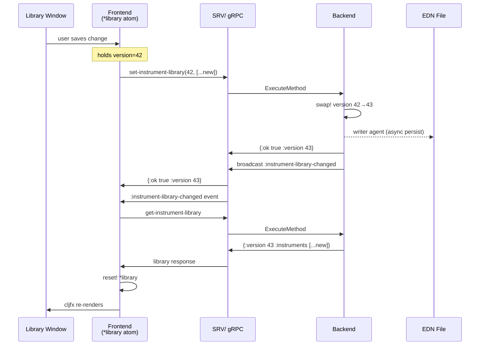
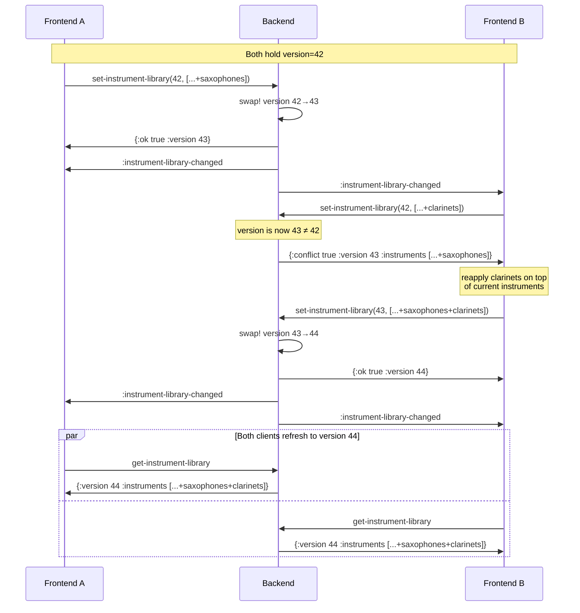
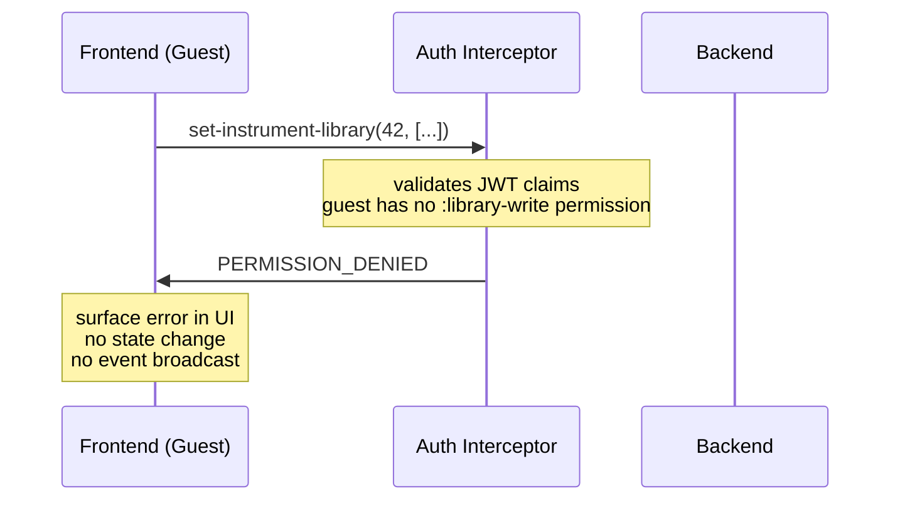

# ADR-0045: Instrument Library

## Status

Accepted

## Table of Contents

- [Context](#context)
- [Decision](#decision)
  - [Backend Component](#backend-component)
  - [API Surface](#api-surface)
  - [EDN Template Format](#edn-template-format)
  - [Optimistic Locking](#optimistic-locking)
  - [Frontend Caching Model](#frontend-caching-model)
  - [Event Architecture](#event-architecture)
  - [Authorization](#authorization)
  - [Frontend Window](#frontend-window)
  - [Default Library Contents](#default-library-contents)
- [Sequence Diagrams](#sequence-diagrams)
  - [Single Client: User Modifies Library](#single-client-user-modifies-library)
  - [Multiple Clients: Concurrent Window Refresh](#multiple-clients-concurrent-window-refresh)
  - [Concurrent Writes: Conflict and Retry](#concurrent-writes-conflict-and-retry)
  - [Authorization Gate: Guest Without Write Permission](#authorization-gate-guest-without-write-permission)
- [Rationale](#rationale)
- [Consequences](#consequences)
- [References](#references)

---

## Context

Ooloi requires a server-side registry of instrument definitions — names, families, and transposition
specifications — that the frontend uses when assigning instruments to musicians. This registry is the
**Instrument Library**.

The Instrument Library differs from every other data entity in the system:

- It is **global and singleton**: one library per backend, shared across all pieces and all clients.
  It is not scoped to any piece and carries no piece identifier.
- It holds **templates, not instances**: when a musician is assigned an instrument, the piece receives
  a copy of the template as an `Instrument` record. From that point the piece record and the library
  template are independent. Renaming a template does not rename instruments already in pieces.
- It is **collaboratively editable**: in a shared session, the host and any guest granted write
  permission may modify the library simultaneously. Modifications must not silently overwrite each
  other. Instruments must never vanish due to a concurrent write.
- It is **persistently stored**: the library survives application restarts, stored as EDN in the
  platform-standard user data directory.

The Instrument Library is the first non-piece backend entity in Ooloi. It is implemented before the
Piece Preferences Window because it is self-contained: it has no dependency on piece identity,
piece windows, or the piece lifecycle. This makes it a clean specimen for validating the
**invalidate → fetch → replace** pattern that all backend-connected frontend state will follow.

---

## Decision

### Backend Component

The Instrument Library is an Integrant component with two internal members:

- **`library` atom** — holds `{:version <integer> :instruments <vector> :excluded <set>}`. An
  atom suffices because the library is a single container; no coordination with other refs is
  required. The atom's CAS semantics ensure that the version check and state replacement inside
  `swap!` are atomic — no concurrent writer can observe a partial update. Optimistic locking (see
  below) handles the separate concern of surfacing conflicting full-replace operations to callers.
  The `:excluded` set is part of the running atom so that write-time tombstone computation has
  access to the existing tombstones without disk I/O.
- **writer agent** — receives persist tasks asynchronously so that write operations return
  immediately without blocking on disk I/O.

The library is loaded from a bundled EDN file at component initialisation. User modifications are
persisted to the platform-specific user data directory, which takes precedence over the bundle on
subsequent starts.

### API Surface

Two operations are exposed, both declared with `^{:api true}` in `interfaces.clj` and exported
through `core.clj` → `api.clj` → `SRV/*`:

**`get-instrument-library`**
Returns the current library as a map:
```clojure
{:version    <integer>
 :instruments [<instrument-template> ...]}
```
No arguments. Safe to call from any client at any time.

**`set-instrument-library`**
Replaces the entire library. Takes the version the client last observed and the new instrument
vector:
```clojure
(set-instrument-library expected-version new-instruments)
```
Returns one of:
```clojure
{:ok true  :version <new-version>}                                  ; success
{:conflict true :version <current-version> :instruments <current>}  ; version mismatch
```
On success: increments the version counter, dispatches persistence to the writer agent, and
broadcasts `:instrument-library-changed` to all subscribed clients.
On conflict: returns the current library unchanged. The caller reapplies its pending change on top
of the returned state and retries.

These are the only two API functions. All editing logic — add, remove, reorder, rename — lives
entirely in the frontend and is expressed as a transformation of the instrument vector before
calling `set-instrument-library`.

### EDN Template Format

Each instrument template is a map with the following fields:

| Field | Type | Required | Description |
|---|---|---|---|
| `:id` | keyword | always | Unique identifier for this template entry. **Bundled instruments** follow the convention `:instrument-name-language`, where the instrument name segment must include the transposition key for any instrument that exists in multiple keys or notation variants, e.g. `:horn-f-it`, `:horn-d-it`, `:bass-clarinet-french-it`, `:bass-clarinet-german-it`. Non-transposing instruments or instruments with a single unique transposition may omit the key: `:flute-en`, `:bb-clarinet-it`. **User-created instruments** receive a UUID-based keyword generated by the frontend at creation time, e.g. `:instrument-550e8400-e29b-41d4-a716-446655440000`. Users never see or interact with `:id` values; they are entirely internal identifiers. Must be unique across the entire instrument vector. |
| `:sort-order` | integer | always | Controls display order within a `:family` group. Bundled entries use multiples of 1000 (score order: `1000`, `2000`, `3000`, …). Drag-to-reorder assigns the midpoint between neighbours; if adjacent integers leave no midpoint, the frontend renumbers the entire family at 1000-spacing before persisting. User-added instruments default to `(max sort-order in family) + 1000`. |
| `:name` | string | always | Full display name, e.g. `"Clarinetto in Si♭"` |
| `:short-name` | string | always | Abbreviated name for score labels, e.g. `"Cl."` |
| `:language` | keyword | always | Language of the name fields; see supported values below |
| `:family` | keyword | always | Instrument family: `:woodwind`, `:brass`, `:strings`, `:percussion`, `:keyboard`, `:voice`, `:other` |
| `:transposing?` | boolean | always | `true` for transposing instruments |
| `:sounding->written` | vector | if transposing | Transposer args: sounding pitch → written pitch |
| `:written->sounding` | vector | if transposing | Transposer args: written pitch → sounding pitch |
| `:staves` | vector | always | One entry per staff; defines clefs for each display context |
| `:clef-overrides` | map | if clef-dependent transposition | Clef-to-transposition overrides for clefs whose transposition deviates from the instrument's top-level `:sounding->written`/`:written->sounding`; see **Clef-Dependent Transposition** below |

#### Staff Specifications

Every instrument must declare its staves. A staff without an explicit specification cannot be
created. Each staff entry has the following shape:

| Field | Type | Required | Description |
|---|---|---|---|
| `:name` | string | if multiple staves | Full display name for the staff, e.g. `"Right Hand"`. Omitted for single-staff instruments. |
| `:short-name` | string | if multiple staves | Abbreviated name used in score brackets and subsequent systems, e.g. `"RH"`. Omitted for single-staff instruments. |
| `:concert-pitch` | map | always | Clef specification when the score is displayed at concert pitch |
| `:written-pitch` | map | always | Clef specification when the score displays written (transposed) pitch |

Each clef specification map:

| Field | Type | Description |
|---|---|---|
| `:default-clef` | keyword | The clef assigned to this staff by default |

For non-transposing instruments `:concert-pitch` and `:written-pitch` are identical. Both keys must
be present regardless.

**Clef keywords**: `:treble`, `:treble-8vb`, `:bass`, `:tenor`, `:alto`, `:soprano`,
`:mezzo-soprano`, `:baritone`, `:percussion`.

#### Clef-Dependent Transposition

Most transposing instruments apply the same transposition regardless of which clef is active. For
these, `:sounding->written` and `:written->sounding` are sufficient and no override is needed.

Some instruments deviate: the same clef symbol carries a different transposition depending on
notation convention. Historical natural horns are the canonical case — a Horn in D in treble clef
sounds a minor seventh below written, but in bass clef (*old notation*) the same horn sounds a
major second *above* written. Both clefs may appear on the same staff; the transposition switches
with the clef.

The `:clef-overrides` field captures these deviations. It is a map from clef keyword to a
transposition specification, using the same `:sounding->written` / `:written->sounding` structure
as the top-level fields:

```clojure
:clef-overrides {:bass {:sounding->written [:down :major :second]
                        :written->sounding [:up :major :second]}}
```

When the active clef matches a key in `:clef-overrides`, the override transposition is used instead
of the top-level values. All other clefs use the top-level transposition. Absence of the field
means no overrides apply.

`:clef-overrides` is a general mechanism that applies to any instrument using multiple clefs where
one or more clefs deviate from the instrument's standard transposition — whether because an
alternative octave is implied, or because an old notation convention associates a clef with a
different interval. Historical natural horns are the canonical example, but the mechanism is not
limited to them.

Transposition vectors are passed directly to `make-transposer` via `apply`, using any of the three
lanes defined in [ADR-0026](0026-Pitch-Representation-and-Operations.md). At the call site,
the active clef is checked against `:clef-overrides` first; the top-level transposition is used
as the fallback:

```clojure
;; Non-transposing, single staff — Italian and English copies
{:id :piccolo-it :language :it
 :name "Flauto piccolo" :short-name "Fl. picc."
 :family :woodwind :transposing? false
 :staves [{:concert-pitch {:default-clef :treble}
           :written-pitch  {:default-clef :treble}}]}

{:id :piccolo-en :language :en
 :name "Piccolo" :short-name "Picc."
 :family :woodwind :transposing? false
 :staves [{:concert-pitch {:default-clef :treble}
           :written-pitch  {:default-clef :treble}}]}

;; Non-transposing, two staves — Italian copy
{:id :piano-it :language :it
 :name "Pianoforte" :short-name "Pf."
 :family :keyboard :transposing? false
 :staves [{:name "Mano destra" :short-name "M.d."
           :concert-pitch {:default-clef :treble}
           :written-pitch  {:default-clef :treble}}
          {:name "Mano sinistra" :short-name "M.s."
           :concert-pitch {:default-clef :bass}
           :written-pitch  {:default-clef :bass}}]}

;; Transposing, single staff — Lane 1 (interval string)
{:id :bb-clarinet-it :language :it
 :name "Clarinetto in Si♭" :short-name "Cl."
 :family :woodwind :transposing? true
 :sounding->written [:interval "M2+"]
 :written->sounding [:interval "M2-"]
 :staves [{:concert-pitch {:default-clef :treble}
           :written-pitch  {:default-clef :treble}}]}

;; Transposing — Lane 2 (fluid keywords)
;; Bass Clarinet: bass clef at concert pitch; treble (French) or bass (German) when transposing
{:id :bass-clarinet-french-it :language :it
 :name "Clarinetto basso in Si♭" :short-name "Cl. b."
 :family :woodwind :transposing? true
 :sounding->written [:up :major :ninth]
 :written->sounding [:down :major :ninth]
 :staves [{:concert-pitch {:default-clef :bass}
           :written-pitch  {:default-clef :treble}}]}

;; Modern Horn in F — no :clef-overrides; bass clef uses the same P5 transposition as treble
{:id :horn-f-it :language :it
 :name "Corno in Fa" :short-name "Cor."
 :family :brass :transposing? true
 :sounding->written [:up :perfect :fifth]
 :written->sounding [:down :perfect :fifth]
 :staves [{:concert-pitch {:default-clef :bass}
           :written-pitch  {:default-clef :treble}}]}

;; Historical Horn in D — :clef-overrides supplies the old-notation bass clef transposition
;; Treble: sounds minor 7th below written. Bass (old notation): sounds major 2nd above written.
{:id :horn-d-it :language :it
 :name "Corno in Re" :short-name "Cor."
 :family :brass :transposing? true
 :sounding->written [:up :minor :seventh]
 :written->sounding [:down :minor :seventh]
 :clef-overrides {:bass {:sounding->written [:down :major :second]
                         :written->sounding [:up :major :second]}}
 :staves [{:concert-pitch {:default-clef :bass}
           :written-pitch  {:default-clef :treble}}]}

;; Transposing — Lane 3 (chromatic with cents)
{:id :quartertone-tpt-en :language :en
 :name "Quarter-tone Trumpet" :short-name "Tpt."
 :family :brass :transposing? true
 :sounding->written [:chromatic 6 :cents 50]
 :written->sounding [:chromatic -6 :cents -50]
 :staves [{:concert-pitch {:default-clef :treble}
           :written-pitch  {:default-clef :treble}}]}
```

No functions are stored in the EDN or in the library atom. Transposer functions are constructed at
the call site: `(apply make-transposer (:sounding->written template))`.

#### Instrument Names and Language

Instrument names are plain strings. The library has no localisation infrastructure — there is no
language map per template and no automatic translation. Instead, the bundled EDN ships multiple
copies of each instrument, one per supported language, each carrying a `:language` keyword:

```clojure
{:id :flute-en :language :en :family :woodwind :name "Flute"  :short-name "Fl."  ...}
{:id :flute-it :language :it :family :woodwind :name "Flauto" :short-name "Fl."  ...}
{:id :flute-de :language :de :family :woodwind :name "Flöte"  :short-name "Fl."  ...}
{:id :flute-fr :language :fr :family :woodwind :name "Flûte"  :short-name "Fl."  ...}
```

The Instrument Library window filters by `:language`, showing only the entries the user wants to
work with. A composer using Italian conventions sees only Italian entries; the German, French, and
English copies are hidden unless explicitly included. This prevents the instrument picker from
becoming cluttered with four copies of every instrument.

**Supported languages in the bundled EDN:**

| Keyword | Language | Rationale |
|---|---|---|
| `:it` | Italian | Historical default for Western classical scores; opera tradition |
| `:de` | German | Standard for Austro-German repertoire and its major publishers |
| `:fr` | French | Standard for French repertoire and French publisher editions |
| `:en` | English | British/American repertoire; increasingly common in contemporary scores |

These four cover the entire range of internationally circulated orchestral scores. Other languages
(Dutch, Swedish, Czech, Russian, Spanish, etc.) are outside the bundled set. Users may add entries
in any language by editing their library; the `:language` keyword accepts any keyword value, not
only the four above.

A score written with Italian conventions uses the Italian copies; a German score uses the German
ones. Users who work in a single language never encounter language machinery. A user adding a
custom instrument adds one copy in their working language and optionally adds further copies for
other languages.

This approach is preferred over per-template language maps because: it requires no canonical
language registry, no multi-language input UI for new instruments, no lookup logic driven by piece
preference, and no changes to the template format when a new language is needed. The library
remains a simple collection of plain data maps.

The Instrument Library window exposes a language filter dropdown that uses the `:language` keyword
for filtering. See [Frontend Window](#frontend-window) for the complete UI specification.

### Optimistic Locking

The library atom holds a version counter alongside the instrument vector. Every successful write
increments the counter. `set-instrument-library` requires the caller to supply the version it last
observed; the backend rejects writes based on stale versions.

This guarantees that no instrument can be silently overwritten or lost in a concurrent write
scenario. The conflict path is not an error to suppress — it is the defined protocol for concurrent
editing. A client that receives a conflict response:

1. Receives the current library (returned in the conflict response)
2. Reapplies its pending change on top of the current instruments
3. Retries `set-instrument-library` with the version from the conflict response

Because the event loop delivers `:instrument-library-changed` to all clients after every successful
write, the conflict window is narrow in practice: both clients would need to submit writes before
either has processed the other's event. Nonetheless, the protocol is correct regardless of timing.

### Frontend Caching Model

The frontend maintains a single atom `*instrument-library`. Its value is one of:

- `{:version n :instruments [...]}` — data is fresh and ready to use
- `nil` — data is stale; must be fetched before the window can render

**`nil` is the staleness marker.** No separate flag is needed. The atom starts as `nil`.

**When `:instrument-library-changed` arrives and the window is open**: call
`SRV/get-instrument-library` immediately, `reset!` the atom with the response. cljfx diffs the
instrument vector and updates only changed items.

**When `:instrument-library-changed` arrives and the window is closed**: `reset!` the atom to
`nil`. No network call is made. The data will be fetched when the window opens.

**When the window opens**: check `(nil? @*instrument-library)`. If nil, call
`SRV/get-instrument-library` and `reset!` before rendering. If not nil, render immediately from
the cached value.

This means a client that never opens the Instrument Library window pays no fetch cost at all, even
if the library is modified repeatedly by other clients during the session. The cost is deferred
until the moment the data is actually needed.

The window reads from `*instrument-library` exclusively. It never holds a separate copy. All
in-progress editing state (e.g. an instrument the user is currently renaming) is local UI state,
separate from `*instrument-library`, and is resolved before `set-instrument-library` is called.

**The sending client also uses the event loop.** After a successful `set-instrument-library`, the
sender does not update `*instrument-library` from the `{:ok true :version n}` response. It waits
for the `:instrument-library-changed` event it will receive as a subscriber, then refetches like
any other client. This keeps a single code path for all state updates regardless of whether the
change originated locally or remotely.

**The frontend has no awareness of tombstones.** It holds no local record of which instruments
have been deleted, no `:excluded` set, and no deletion state of any kind. From the frontend's
perspective, the instrument library is simply a vector of templates: it renders what is there and
submits what it wants to be there. The tombstone mechanism is entirely internal to the backend —
the frontend participates in it only by omitting an entry from the vector it submits.

### Event Architecture

**New backend event type**: `:instrument-library-changed`

Carries only `:timestamp`. No payload — clients fetch current state themselves via
`get-instrument-library`. This establishes the invalidate-only pattern that `:piece-structure-changed`
(Step 5 of the development sequence) will follow.

**New frontend bus category**: `:instrument-library`

The Event Router's `derive-category` function maps `:instrument-library-changed` to
`:instrument-library`. Any frontend component that needs the current library subscribes to this
category.

Both `:instrument-library-changed` and the `:instrument-library` bus category must be added to
[ADR-0018](0018-API-gRPC-Interface-and-Events.md) and [ADR-0031](0031-Frontend-Event-Driven-Architecture.md)
respectively when this component is implemented.

### Authorization

**Combined app (in-process transport)**: All library operations are permitted. No authentication is
required. This is the default mode for the vast majority of users.

**Collaborative session (network transport)**: The host has unconditional write access. Guest clients
are read-only by default. Write access requires explicit grant by the host, per the permission model
in [ADR-0036](0036-Collaborative-Sessions-and-Hybrid-Transport.md). The existing
`create-api-authentication-interceptor` in `backend/grpc/server.clj` enforces this at the gRPC
layer; no changes to the interceptor infrastructure are required.

**Development order**: The basic invalidate/fetch/replace mechanism is implemented and tested first,
without permission enforcement. Authorization is layered in through subsequent tests once the
foundation is stable.

### Frontend Window

The Instrument Library window is a full persistent window managed by the UI Manager
(`show-instrument-library!`). It has two filtering controls and a grouped instrument list.

#### Language Filter

A dropdown control filters the visible entries by `:language`. The options are:

| Dropdown option | Translation key | UK English value |
|---|---|---|
| Label for the dropdown | `:instrument-library.language.label` | `"Language"` |
| Italian | `:instrument-library.language.italian` | `"Italian"` |
| German | `:instrument-library.language.german` | `"German"` |
| French | `:instrument-library.language.french` | `"French"` |
| English | `:instrument-library.language.english` | `"English"` |
| Other | `:instrument-library.language.other` | `"Other"` |
| All (show all) | `:instrument-library.language.all` | `"All"` |

Options are translated via `(tr key)` per [ADR-0039](0039-Localisation-Architecture.md). Keys
must be declared with `tr-declare`; no computed keys. All seven keys must be added to every `.po`
locale file in `resources/i18n/`.

Selecting a language shows only templates whose `:language` value matches. Selecting **Other**
shows templates whose `:language` value is not one of `:it`, `:de`, `:fr`, `:en`. Selecting
**All** removes language filtering entirely.

**The language filter selection is an app setting**, not ephemeral window state. It is declared
with `def-app-setting` per [ADR-0043](0043-Frontend-Settings.md):

```clojure
(def-app-setting :instrument-library/language-filter
  {:default :all
   :choices {:all   :instrument-library.language.all
             :it    :instrument-library.language.italian
             :de    :instrument-library.language.german
             :fr    :instrument-library.language.french
             :en    :instrument-library.language.english
             :other :instrument-library.language.other}})
```

The undo menu displays the setting name via the standard convention:
`:instrument-library/language-filter` → `:setting.instrument-library.language-filter.name`.
This key must be added to all locale files.

Consequences:

- The selected language persists across application restarts.
- Changing the filter calls `set-app-setting!`, which publishes a `:setting-changed` event to
  the `:app-settings` bus category. The undo/redo module records this automatically — no extra
  wiring is needed.
- The Settings window may surface `:instrument-library/language-filter` as an editable
  preference. If it does, changing the setting there updates the IL window's dropdown
  immediately, because the IL window subscribes to `:setting-changed` events on the
  `:app-settings` category and re-renders when this key changes.

#### Search

A text field filters the visible entries on every keypress. Filtering is:

- **Substring**: the search string must be contained anywhere in the name — not a prefix match.
  Typing `"Co"` shows all templates whose `:name` contains `"Co"`: Corno, Contrabasso, Cor anglais, etc.
- **Case-insensitive**: `"cl"` matches `"Clarinetto"`, `"Cl."`, `"Bass Clarinet"`.
- **Both name fields**: filtering tests against both `:name` and `:short-name`. A search for
  `"Cl."` matches templates whose short name is `"Cl."` even when the full name does not contain
  those characters.
- **No backend calls**: search is pure frontend state. The full instrument vector is already held
  in `*instrument-library`; filtering is a local predicate applied before rendering.

Language filter and search are applied conjunctively: the visible set is the intersection of
entries that match the language selection and entries that match the search string.

#### Instrument List

Instruments passing both filters are displayed grouped by `:family`, with each family in a
collapsible section: Woodwinds ▶, Brass ▶, Strings ▶, Keyboard ▶, Percussion ▶, Voice ▶,
Other ▶. Within each family, instruments are sorted ascending by `:sort-order`. Instrument names
are rendered as rich text to display real ♭ (U+266D), ♮ (U+266E), and ♯ (U+266F).

Drag-to-reorder is available to clients with write permission. Dropping instrument A between
instruments B and C assigns A a new `:sort-order` of `(sort-order(B) + sort-order(C)) / 2`. If
B and C are already adjacent integers, the frontend renumbers the entire family at 1000-spacing
before computing the midpoint. The reordered instruments vector is then submitted via
`set-instrument-library`.

Editing controls (add, remove, reorder, rename templates) appear only when the current client has
write permission. In a standalone session the local user always has write permission. In a
collaborative session, guests have write permission only if the host has granted it. See
[ADR-0036](0036-Collaborative-Sessions-and-Hybrid-Transport.md).

### Default Library Contents

The bundled EDN ships instrument templates covering the full modern symphony orchestra and beyond,
including woodwinds, brass, strings, percussion, keyboards, plucked instruments, voices, choirs,
special-effect instruments, and a selection of historical instruments.

Each instrument appears in up to four language copies (`:it`, `:de`, `:fr`, `:en`). Instruments
whose names do not vary across these four languages (most percussion, some keyboards) carry
fewer copies. Every copy has a distinct `:id` (e.g. `:bb-clarinet-it`, `:bb-clarinet-de`).

The bundled library is a starting point, not a closed set. Any instrument not listed here —
whether a historical reconstruction, a microtonal variant, a folk instrument, or a newly
invented sound source — can be added by the user at any time through the Instrument Library
window and is saved permanently to the user's library file.

**Persistence format.** The user's library file is an EDN map with three keys:

```clojure
{:version   <integer>
 :instruments [<template> ...]
 :excluded  #{<keyword> ...}}
```

`:excluded` is a set of instrument `:id`s that the user has deleted. It exists to make
deletion permanent across application updates: bundle entries in `:excluded` are not
re-inserted by merge-on-load.

**Merge-on-load.** At component initialisation, the backend merges the bundle with the user
file as follows:

1. Load the user file if it exists; otherwise start from an empty instruments vector and empty
   excluded set.
2. For each bundle entry, insert it into the instruments vector unless its `:id` is already
   present in `:instruments` (user has modified or renamed it) or its `:id` appears in
   `:excluded` (user has deleted it). Newly inserted bundle entries carry their own `:sort-order`
   and will therefore appear at the correct position within the family when the window renders.
3. The merged instruments vector and the `:excluded` set become the initial atom state, together
   with the version from the user file (or 0 if no user file exists).

This means application updates that ship new bundle instruments deliver them automatically on
next startup. Previously deleted bundle instruments are not re-inserted — the excluded set
acts as a permanent tombstone. User-added instruments (whose `:id`s are not in the bundle) are
never affected by merging.

The frontend sends no explicit deletion signal. Deletions are implicit: the frontend submits a
new instruments vector with the deleted entry absent. On each successful `set-instrument-library`,
the backend computes the updated excluded set: any `:id` present in the previous instruments
vector but absent from the new one is added to the existing excluded set. The updated atom state
— incremented version, new instruments vector, and updated excluded set — is then dispatched to
the writer agent for persistence. The frontend never sees or manages `:excluded`; it is entirely
a backend concern.

#### Woodwinds (`:family :woodwind`)

**Flutes**

| Instrument | Clef(s) | Transposition | Notes |
|---|---|---|---|
| Piccolo | treble | Octave above written | |
| Flute | treble | — | |
| Alto Flute in G | treble | Perfect fourth below written | |
| Bass Flute in C | treble | Octave below written | |
| Traverso | treble | — | Baroque transverse flute |

**Recorders**

| Instrument | Clef(s) | Transposition | Notes |
|---|---|---|---|
| Garklein Recorder in C | treble | — | Sopranissimo |
| Sopranino Recorder in F | treble | — | |
| Soprano Recorder in C | treble | — | Descant |
| Alto Recorder in F | treble | — | Treble |
| Tenor Recorder in C | treble | — | |
| Bass Recorder in F | treble | — | |
| Contrabass Recorder in C | treble | — | |

**Double reeds**

| Instrument | Clef(s) | Transposition | Notes |
|---|---|---|---|
| Oboe | treble | — | |
| Oboe d'amore in A | treble | Minor third below written | |
| English Horn in F | treble | Perfect fifth below written | Cor anglais |
| Oboe da caccia in F | treble | Perfect fifth below written | Curved-body Baroque oboe; distinct from English horn |
| Bass Oboe | bass; tenor | — | |
| Heckelphone | treble | Octave below written | |

**Clarinets**

| Instrument | Clef(s) | Transposition | Notes |
|---|---|---|---|
| Sopranino Clarinet in E♭ | treble | Minor third above written | |
| Clarinet in C | treble | — | |
| Clarinet in B♭ | treble | Major second below written | |
| Clarinet in A | treble | Minor third below written | |
| Basset Horn in F | treble | Perfect fifth below written | |
| Bass Clarinet — French notation | treble | Major ninth below written | See notation variants below |
| Bass Clarinet — German notation | bass | Major second below written | See notation variants below |
| Contrabass Clarinet — French notation | treble | Two octaves + major second below written | |
| Contrabass Clarinet — German notation | bass | Major ninth below written | Bass clef absorbs one octave |
| Chalumeau | treble | — | Baroque predecessor to the clarinet |

**Notation variants for Bass Clarinet and Contrabass Clarinet**

Two professional notations coexist in the published literature, differing in transposition
interval and default clef. Both variants must be present.

| Variant | Default clef | Transposition |
|---|---|---|
| Bass Clarinet — French notation | `:treble` | Major ninth below written |
| Bass Clarinet — German notation | `:bass` | Major second below written |
| Contrabass Clarinet — French notation | `:treble` | Two octaves + major second below written |
| Contrabass Clarinet — German notation | `:bass` | Major ninth below written |

**Bassoons**

| Instrument | Clef(s) | Transposition | Notes |
|---|---|---|---|
| Bassoon | bass; tenor | — | |
| Contrabassoon | bass | Octave below written | |

#### Brass (`:family :brass`)

**Modern Horns**

| Instrument | Clef(s) | Transposition | Notes |
|---|---|---|---|
| Horn in F | treble; bass | Perfect fifth below written | Modern standard; bass clef uses same transposition as treble |
| Wagner Tuba in B♭ | treble | Major second below written | Tenortuba; played by horn players |
| Wagner Tuba in F | treble | Perfect fifth below written | Basstuba; played by horn players |

**Historical Horns (Old Notation)**

Natural horns in various keys appear in Classical and Romantic scores. The bass clef follows
*old notation*: the written note sounds one octave higher than under modern convention, which
is equivalent to adding an octave to the treble transposition. Treble and bass clef therefore
yield different transposition intervals for the same instrument. In the EDN template, the treble
clef transposition is the instrument's top-level `:sounding->written`/`:written->sounding`; the
bass clef transposition is expressed as `:clef-overrides {:bass {...}}`.

| Instrument | Treble clef | Bass clef (old notation) |
|---|---|---|
| Horn in C | Octave below written | Concert pitch |
| Horn in D | Minor 7th below written | Major 2nd above written |
| Horn in E♭ | Minor 6th below written | Major 3rd above written |
| Horn in E | Major 6th below written | Minor 3rd above written |
| Horn in G | Perfect 4th below written | Perfect 5th above written |
| Horn in A | Minor 3rd below written | Major 6th above written |
| Horn in B♭ alto | Major 2nd below written | Minor 7th above written |
| Horn in B♭ basso | Minor 9th below written | Minor 2nd below written |

**Trumpets**

| Instrument | Clef(s) | Transposition | Notes |
|---|---|---|---|
| Trumpet in C | treble | — | Modern standard |
| Trumpet in D | treble | Major second above written | |
| Trumpet in E♭ | treble | Minor third above written | |
| Trumpet in E | treble | Major third above written | |
| Trumpet in F | treble | Perfect fourth above written | |
| Trumpet in G | treble | Perfect fifth above written | |
| Trumpet in A | treble | Major sixth above written | |
| Trumpet in B♭ | treble | Major second below written | Modern standard |
| Piccolo Trumpet in B♭ | treble | Major second below written | High register; one octave above standard B♭ |
| Cornet in B♭ | treble | Major second below written | Separate entry from trumpet |
| Bass Trumpet in C | treble; bass; tenor | treble: octave below written; bass/tenor: concert pitch | Treble clef notation (trumpet players) transposes an octave; bass/tenor clef (trombone players) is at concert pitch |

**Trombones**

| Instrument | Clef(s) | Transposition | Notes |
|---|---|---|---|
| Alto Trombone | alto; treble | — | |
| Tenor Trombone | bass; tenor | — | |
| Bass Trombone | bass | — | |
| Contrabass Trombone | bass | — | |

**Tubas**

| Instrument | Clef(s) | Transposition | Notes |
|---|---|---|---|
| Euphonium / Tenor Tuba in B♭ | bass; treble | treble: major ninth below written; bass: concert pitch | British brass band treble clef notation transposes a major ninth; orchestral bass clef is at concert pitch |
| Bass Tuba | bass | — | |
| Contrabass Tuba | bass | — | |

#### Strings (`:family :strings`)

String instruments appear in **section** and **solo** variants. Section instruments additionally
appear in two-, three-, and four-part divisi configurations.

**Sections and solos**

| Instrument | Clef(s) | Transposition | Notes |
|---|---|---|---|
| Violin I | treble | — | Section |
| Violin II | treble | — | Section |
| Violin | treble | — | Solo |
| Viola | alto; treble | — | Section; alto clef default |
| Viola | alto; treble | — | Solo; alto clef default |
| Violoncello | bass; tenor; treble | — | Section |
| Violoncello | bass; tenor; treble | — | Solo |
| Double Bass | bass; tenor; treble | Octave below written | Section |
| Double Bass | bass; tenor; treble | Octave below written | Solo |

**Divisi** (section instruments only)

| Instrument | Staves |
|---|---|
| Violin div. 2 | 2 |
| Violin div. 3 | 3 |
| Violin div. 4 | 4 |
| Violin div. 6 | 6 |
| Viola div. 2 | 2 |
| Viola div. 3 | 3 |
| Viola div. 4 | 4 |
| Viola div. 6 | 6 |
| Violoncello div. 2 | 2 |
| Violoncello div. 3 | 3 |
| Violoncello div. 4 | 4 |
| Violoncello div. 6 | 6 |
| Double Bass div. 2 | 2 |
| Double Bass div. 3 | 3 |
| Double Bass div. 4 | 4 |
| Double Bass div. 6 | 6 |

#### Percussion (`:family :percussion`)

**Timpani**

| Instrument | Clef(s) | Notes |
|---|---|---|
| Timpani | percussion | Standard orchestral timpani; single staff |
| Timpano piccolo | percussion | Small timpani; higher pitch range |

**Mallet — pitched**

| Instrument | Clef(s) | Transposition | Notes |
|---|---|---|---|
| Glockenspiel | treble | Two octaves above written | |
| Xylophone | treble | Octave above written | |
| Marimba | bass; treble | — | |
| Vibraphone | treble | — | |
| Tubular Bells | treble | — | Chimes / Röhrenglocken |
| Crotales | treble | Two octaves above written | Antique Cymbals |
| Crotale | treble | Two octaves above written | Single instrument, specific pitch |

**Unpitched drums**

| Instrument | Notes |
|---|---|
| Bass Drum | |
| Snare Drum | Side Drum |
| Tenor Drum | |
| Military Drum | |
| Tom-tom | |

**Cymbals and gongs**

| Instrument | Notes |
|---|---|
| Crash Cymbals | |
| Suspended Cymbal | |
| Chinese Cymbal | |
| Tam-tam | |

**Small and hand percussion**

| Instrument | Notes |
|---|---|
| Triangle | |
| Tambourine | |
| Castanets | |
| Claves | |
| Wood Block | |
| Temple Blocks | |
| Guiro | |
| Maracas | |
| Rute | Birch-switch bundle |

**Special-effect instruments** (`:family :other`)

| Instrument | Notes |
|---|---|
| Wind Machine | Windmaschine / Machine à vent; rotating ribbed cylinder |
| Thunder Machine | Donnermaschine / Machine à tonnerre; large drum or metal sheet |
| Cowbells | Herdenglocken / Cloches de vache; multiple pitched cowbells |
| Whip | Peitsche / Fouet; two flat boards |
| Ratchet | Ratsche / Crécelle; notched rotating wheel |

#### Keyboards and Plucked (`:family :keyboard`)

| Instrument | Staves | Transposition | Notes |
|---|---|---|---|
| Piano | 2 | — | |
| Organ (2 staves) | 2 | — | Manuals only |
| Organ (3 staves) | 3 | — | Two manuals + pedal |
| Harpsichord (1 manual) | 2 | — | |
| Harpsichord (2 manuals) | 2 | — | Two-manual instrument |
| Celesta | 2 | Two octaves above written | |
| Harmonium | 1–2 | — | Reed organ |
| Accordion | 1 | — | |
| Ondes Martenot | 1 | — | Electronic monophonic; keyboard or ribbon controller |
| Theremin | 1 | — | Electronic; no physical contact; continuous pitch |
| Harp | 2 | — | Double-action |
| Guitar | 1 | Octave below written | Classical guitar |
| Electric Guitar | 1 | — | Lead / rhythm |
| Electric Guitar (7-string) | 1 | — | Extended range |
| Electric Bass Guitar | 1 | Octave below written | 4-string |
| Electric Bass Guitar (5-string) | 1 | Octave below written | Extended lower range |
| Electric Bass Guitar (6-string) | 1 | Octave below written | Extended upper and lower range |
| Synthesizer | 1–2 | — | Keyboard-based; concert pitch |
| Mandolin | 1 | — | |

#### Voices and Choirs

**Solo voices** (`:family :voice`)

| Voice | Clef(s) | Notes |
|---|---|---|
| Soprano | treble | |
| Mezzo-Soprano | treble | |
| Contralto | treble | |
| Counter-tenor | treble | |
| Tenor | treble | Sounds octave below written |
| Baritone | bass | |
| Bass-Baritone | bass | |
| Bass | bass | |
| Basso profondo | bass | Lowest bass voice |

**Choirs** (`:family :voice`)

Choirs are single instruments in the Ooloi model — a choir is a group of singers on a unified
set of staves, exactly as a string section is a group of players on a single staff.

| Template | Staves | Notes |
|---|---|---|
| SATB Choir | 4 | Standard mixed chorus |
| SSAATTBB Choir | 8 | Eight-part single chorus (2S, 2A, 2T, 2B) |
| SA Choir | 2 | Women's or children's two-part |
| SSAA Choir | 4 | Two soprano + two alto parts |
| TTBB Choir | 4 | Two tenor + two bass parts |
| Knabenchor | 2 | Boys' choir (SS) |

#### Historical Instruments

Historical instruments carry their correct `:family` value — viols are `:strings`, sackbuts
are `:brass`, traverso and chalumeau are `:woodwind`, clavichord and lautenwerk are `:keyboard`.
This section is a documentation grouping only; there is no `:historical` family keyword.

**Renaissance and early Baroque winds**

| Instrument | Family | Clef(s) | Transposition | Notes |
|---|---|---|---|---|
| Cornettino | `:woodwind` | treble | Perfect fourth above treble cornett | Sopranino of the cornett family |
| Treble Cornett | `:woodwind` | treble | — | Standard Zink (Cornetto) |
| Mute Cornett | `:woodwind` | treble | — | Cornetto muto; integral mouthpiece |
| Tenor Cornett (Lizard) | `:woodwind` | treble | — | S-curved body |
| Serpent | `:brass` | bass | — | Bass of the cornett family |
| Sackbut | `:brass` | bass; tenor | — | Renaissance/Baroque trombone |

**Baroque strings**

| Instrument | Clef(s) | Transposition | Notes |
|---|---|---|---|
| Violino piccolo | treble | Minor/major third above standard tuning | Small violin; higher tuning |
| Viola d'amore | treble; alto | — | Six or seven strings + sympathetic strings |
| Violoncello piccolo | bass; tenor; treble | — | Five-string cello |
| Treble Viol | treble | — | |
| Tenor Viol | alto | — | |
| Bass Viol | bass; tenor | — | Viola da gamba |
| Violone | bass | Octave below written | Baroque string bass |

**Baroque brass**

| Instrument | Clef(s) | Transposition | Notes |
|---|---|---|---|
| Corno da caccia in C | treble | — | Natural hunting horn |
| Corno da caccia in D | treble | Major second above written | |
| Corno da caccia in F | treble | Perfect fourth above written | |
| Corno da caccia in G | treble | Perfect fifth above written | |
| Tromba da tirarsi | treble | Major second above written | Baroque slide trumpet |

**Baroque keyboards and plucked**

| Instrument | Staves | Transposition | Notes |
|---|---|---|---|
| Clavichord | 2 | — | |
| Lute | 1 | Octave below written | Various configurations |
| Theorbo / Chitarrone | 1 | — | Long-neck continuo lute |
| Lautenwerk | 2 | — | Harpsichord with gut strings |

---

## Sequence Diagrams

### Single Client: User Modifies Library



### Multiple Clients: Concurrent Window Refresh

Both Client A and Client B have the Instrument Library window open. Client A modifies the library;
both windows update without any special coordination.


### Concurrent Writes: Conflict and Retry

Client A and Client B both hold version 42. Client A's write reaches the backend first. Client B
receives a conflict response, incorporates the current library, and retries successfully.



Both instruments survive. Neither client's change is lost.

### Authorization Gate: Guest Without Write Permission



---

## Rationale

### Why atom, not STM ref

Clojure offers two reference types for managing shared mutable state:

**Atoms** hold a single value and support atomic, compare-and-swap mutations via `swap!`. A
`swap!` function is applied to the current value; if no other thread has changed the atom in the
meantime, the result is stored atomically. If another thread changed it first, `swap!` retries
automatically with the new current value. Atoms are correct and efficient for single-reference
state that does not need to be coordinated with other state.

**STM refs** participate in Software Transactional Memory. Multiple refs can be read and written
together inside a `dosync` block, which commits atomically or retries the entire block on conflict.
STM is designed for coordinated multi-ref mutations — the canonical example in Ooloi is a VPD
operation that must update a measure, a voice, and a layout atomically, all within the piece's STM
ref. When multiple refs must change together and partial application would leave the system in an
inconsistent state, STM is the right tool.

The Instrument Library is a single container. No library mutation needs to be coordinated with a
mutation to any other ref in the same transaction. `swap!` is therefore correct and STM would add
`dosync`/retry overhead with no benefit.

The analogy within the codebase: the piece registry (map of piece-id → piece-ref) uses an atom as
its container, while the pieces themselves use STM refs for their content. The Instrument Library
is a container; atom is the correct tool.

Note that optimistic locking (the version counter checked inside `swap!`) sits *on top of* the
atom's CAS semantics. The atom ensures the version check and state update are themselves atomic;
optimistic locking ensures callers with stale versions learn about the conflict and can retry with
current data. The two mechanisms address different concerns and work together.

### Why two API functions, not individual operations

Individual operations — `add-instrument`, `remove-instrument`, `move-instrument-up`, etc. — would
require the backend to understand and implement editing semantics. With `get-instrument-library` and
`set-instrument-library`, all editing logic lives in the frontend and is expressed as a pure
transformation of a Clojure vector. The backend stores state and enforces consistency; it does not
participate in editing decisions.

This also means the API surface cannot grow as new editing operations are invented. The two
functions are final.

### Why full replace, not delta

The instrument library is bounded in size (hundreds of entries at most). A full fetch is trivial in
both latency and bandwidth. Delta tracking would require event payloads to describe operations,
introduce potential for desync if an event is missed, and duplicate in the protocol what the
frontend already knows. Full replace is simpler, safer, and correct at this data size.

### Why lazy fetch

A client that never opens the Instrument Library window has no need for the library data. Eagerly
fetching on every `:instrument-library-changed` event would waste a network round trip for every
modification made by any client, even on sessions where the library window is never opened. The
`nil`-as-staleness-marker pattern costs nothing: setting an atom to `nil` is instantaneous, and
the fetch is deferred until the moment the data is genuinely needed. For sessions where the window
is open, the behaviour is identical to eager fetch — the event triggers an immediate refetch.

### Why optimistic locking

Silent last-write-wins is not acceptable in a collaborative tool. If two users are editing the
library simultaneously and one user's changes vanish without warning, the software is unreliable.
Optimistic locking is the standard solution: cheap to implement (one integer), visible in the
protocol, and gives clients the information they need to recover without manual intervention.

The conflict path is narrow in practice because the event loop delivers `:instrument-library-changed`
after every successful write — clients refresh before they can plausibly issue another write. But
the protocol is correct regardless of timing, which is what matters.

---

## Consequences

**Positive**

- Instruments cannot be silently lost in concurrent edits.
- Backend component logic is minimal: store, version, persist, broadcast.
- All editing semantics are in the frontend, where they belong.
- The invalidate/fetch/replace pattern is validated on a clean, self-contained entity before being
  applied to piece-scoped data.
- New frontend components needing library data subscribe to `:instrument-library` on the event bus
  and call `get-instrument-library` — no additional infrastructure required.

**Negative**

- A client that receives a conflict must fetch, reapply, and retry. This adds one round trip in the
  (rare) concurrent-write case.
- The full library is fetched after every change, including changes made by other clients. For a
  library of typical size this is negligible.

---

## References

### Related ADRs

- [ADR-0002: gRPC Communication](0002-gRPC.md) — ExecuteMethod transport for both API functions
- [ADR-0004: STM for Concurrency](0004-STM-for-concurrency.md) — concurrency model; library uses atom, not STM ref
- [ADR-0017: System Architecture](0017-System-Architecture.md) — Integrant component lifecycle
- [ADR-0018: API gRPC Interface and Events](0018-API-gRPC-Interface-and-Events.md) — event type taxonomy; `:instrument-library-changed` must be added
- [ADR-0021: Authentication](0021-Authentication.md) — JWT-based auth used in collaborative mode
- [ADR-0026: Pitch Representation and Operations](0026-Pitch-Representation-and-Operations.md) — three-lane `make-transposer` factory; transposition vectors in EDN templates
- [ADR-0031: Frontend Event-Driven Architecture](0031-Frontend-Event-Driven-Architecture.md) — event bus; `:instrument-library` category must be added to `derive-category`
- [ADR-0036: Collaborative Sessions and Hybrid Transport](0036-Collaborative-Sessions-and-Hybrid-Transport.md) — role-based permissions; host/guest write access model
- [ADR-0040: Single-Authority State Model](0040-Single-Authority-State-Model.md) — backend authority; frontend caches, never owns
