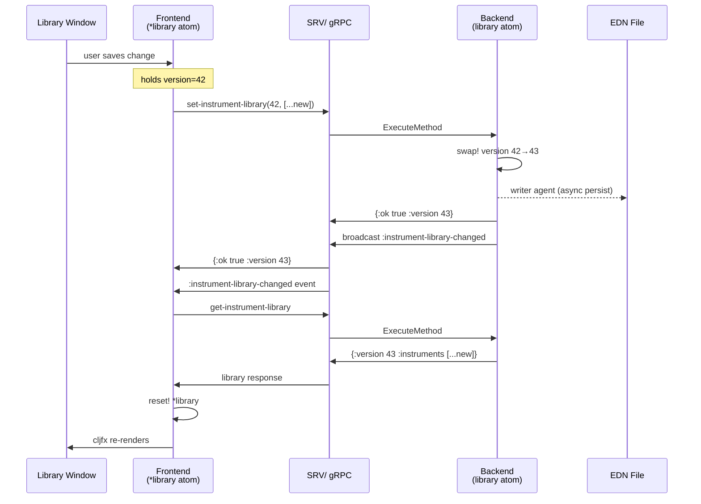
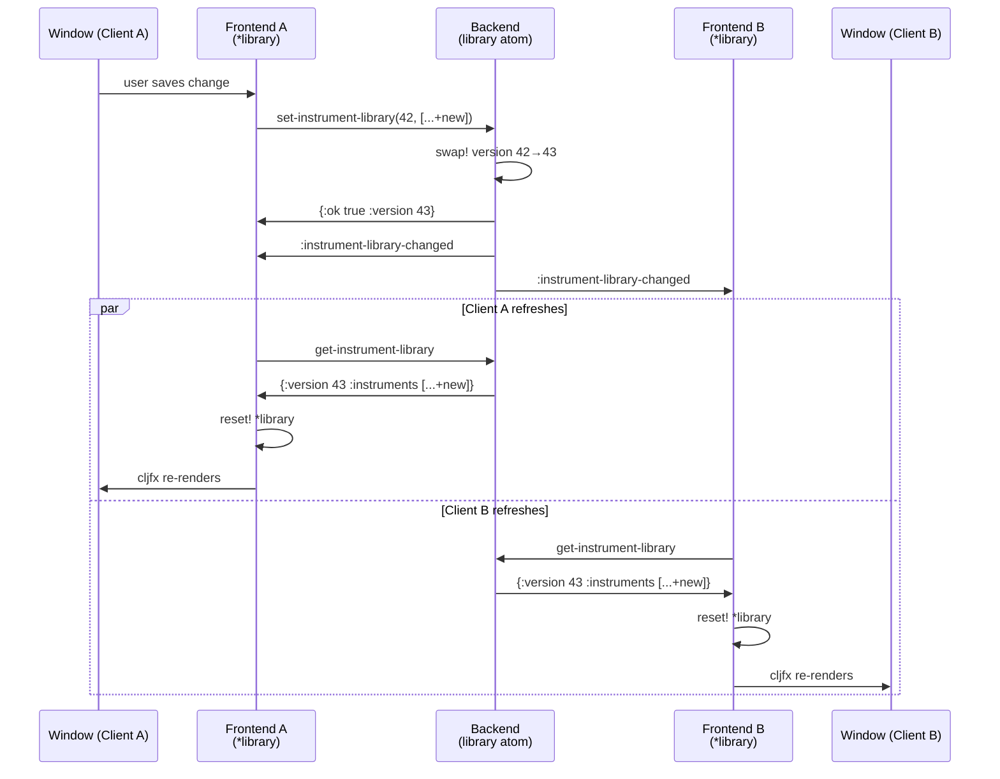
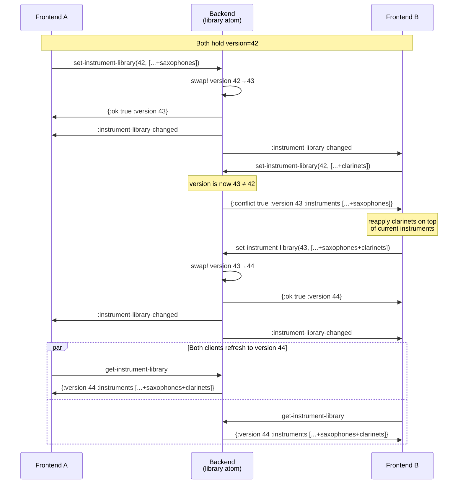
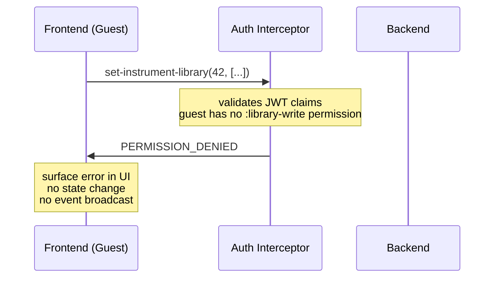

# ADR-0045: Instrument Library

## Status

Accepted

## Table of Contents

- [Context](#context)
- [Decision](#decision)
  - [Backend Component](#backend-component)
  - [API Surface](#api-surface)
  - [EDN Template Format](#edn-template-format)
  - [Optimistic Locking](#optimistic-locking)
  - [Frontend Caching Model](#frontend-caching-model)
  - [Event Architecture](#event-architecture)
  - [Authorization](#authorization)
  - [Frontend Window](#frontend-window)
  - [Default Library Contents](#default-library-contents)
- [Sequence Diagrams](#sequence-diagrams)
  - [Single Client: User Modifies Library](#single-client-user-modifies-library)
  - [Multiple Clients: Concurrent Window Refresh](#multiple-clients-concurrent-window-refresh)
  - [Concurrent Writes: Conflict and Retry](#concurrent-writes-conflict-and-retry)
  - [Authorization Gate: Guest Without Write Permission](#authorization-gate-guest-without-write-permission)
- [Rationale](#rationale)
- [Consequences](#consequences)
- [References](#references)

---

## Context

Ooloi requires a server-side registry of instrument definitions — names, families, and transposition
specifications — that the frontend uses when assigning instruments to musicians. This registry is the
**Instrument Library**.

The Instrument Library differs from every other data entity in the system:

- It is **global and singleton**: one library per backend, shared across all pieces and all clients.
  It is not scoped to any piece and carries no piece identifier.
- It holds **templates, not instances**: when a musician is assigned an instrument, the piece receives
  a copy of the template as an `Instrument` record. From that point the piece record and the library
  template are independent. Renaming a template does not rename instruments already in pieces.
- It is **collaboratively editable**: in a shared session, the host and any guest granted write
  permission may modify the library simultaneously. Modifications must not silently overwrite each
  other. Instruments must never vanish due to a concurrent write.
- It is **persistently stored**: the library survives application restarts, stored as EDN in the
  platform-standard user data directory.

The Instrument Library is the first non-piece backend entity in Ooloi. It is implemented before the
Piece Preferences Window because it is self-contained: it has no dependency on piece identity,
piece windows, or the piece lifecycle. This makes it a clean specimen for validating the
**invalidate → fetch → replace** pattern that all backend-connected frontend state will follow.

---

## Decision

### Backend Component

The Instrument Library is an Integrant component with two internal members:

- **`library` atom** — holds `{:version <integer> :instruments <vector>}`. An atom suffices because
  the library is a single container; no coordination with other refs is required. The atom's CAS
  semantics ensure that the version check and state replacement inside `swap!` are atomic — no
  concurrent writer can observe a partial update. Optimistic locking (see below) handles the
  separate concern of surfacing conflicting full-replace operations to callers. Note: the atom
  holds only `:version` and `:instruments`; the `:excluded` set (see Persistence below) is a
  file-level concern and is not carried in the running atom.
- **bundle ID set** — the set of all `:id` values present in the bundled EDN, retained in memory
  for the lifetime of the component. Used at write time to compute the updated `:excluded` set:
  `excluded = (bundle-ids − ids-present-in-new-instruments) ∪ existing-excluded`. This ensures
  that when a client submits a new instruments vector with bundle entries absent, those `:id`s are
  automatically tombstoned without any explicit deletion signal in the API.
- **writer agent** — receives persist tasks asynchronously so that write operations return
  immediately without blocking on disk I/O.

The library is loaded from a bundled EDN file at component initialisation. User modifications are
persisted to the platform-specific user data directory, which takes precedence over the bundle on
subsequent starts.

### API Surface

Two operations are exposed, both declared with `^{:api true}` in `interfaces.clj` and exported
through `core.clj` → `api.clj` → `SRV/*`:

**`get-instrument-library`**
Returns the current library as a map:
```clojure
{:version    <integer>
 :instruments [<instrument-template> ...]}
```
No arguments. Safe to call from any client at any time.

**`set-instrument-library`**
Replaces the entire library. Takes the version the client last observed and the new instrument
vector:
```clojure
(set-instrument-library expected-version new-instruments)
```
Returns one of:
```clojure
{:ok true  :version <new-version>}                                  ; success
{:conflict true :version <current-version> :instruments <current>}  ; version mismatch
```
On success: increments the version counter, dispatches persistence to the writer agent, and
broadcasts `:instrument-library-changed` to all subscribed clients.
On conflict: returns the current library unchanged. The caller reapplies its pending change on top
of the returned state and retries.

These are the only two API functions. All editing logic — add, remove, reorder, rename — lives
entirely in the frontend and is expressed as a transformation of the instrument vector before
calling `set-instrument-library`.

### EDN Template Format

Each instrument template is a map with the following fields:

| Field | Type | Required | Description |
|---|---|---|---|
| `:id` | keyword | always | Unique identifier for this template entry. Convention: `:instrument-key-language`, e.g. `:bb-clarinet-it`. Must be unique across the entire instrument vector. |
| `:name` | string | always | Full display name, e.g. `"Clarinetto in Si♭"` |
| `:short-name` | string | always | Abbreviated name for score labels, e.g. `"Cl."` |
| `:language` | keyword | always | Language of the name fields; see supported values below |
| `:family` | keyword | always | Instrument family: `:woodwind`, `:brass`, `:strings`, `:percussion`, `:keyboard`, `:voice`, `:other` |
| `:transposing?` | boolean | always | `true` for transposing instruments |
| `:sounding->written` | vector | if transposing | Transposer args: sounding pitch → written pitch |
| `:written->sounding` | vector | if transposing | Transposer args: written pitch → sounding pitch |
| `:staves` | vector | always | One entry per staff; defines clefs for each display context |

#### Staff Specifications

Every instrument must declare its staves. A staff without an explicit specification cannot be
created. Each staff entry has the following shape:

| Field | Type | Required | Description |
|---|---|---|---|
| `:name` | string | if multiple staves | Full display name for the staff, e.g. `"Right Hand"`. Omitted for single-staff instruments. |
| `:short-name` | string | if multiple staves | Abbreviated name used in score brackets and subsequent systems, e.g. `"RH"`. Omitted for single-staff instruments. |
| `:concert-pitch` | map | always | Clef specification when the score is displayed at concert pitch |
| `:written-pitch` | map | always | Clef specification when the score displays written (transposed) pitch |

Each clef specification map:

| Field | Type | Description |
|---|---|---|
| `:default-clef` | keyword | The clef assigned to this staff by default |
| `:clefs` | vector | All clefs permissible for this staff |

For non-transposing instruments `:concert-pitch` and `:written-pitch` are identical. Both keys must
be present regardless.

**Clef keywords**: `:treble`, `:treble-8vb`, `:bass`, `:tenor`, `:alto`, `:soprano`,
`:mezzo-soprano`, `:baritone`, `:percussion`.

Transposition vectors are passed directly to `make-transposer` via `apply`, using any of the three
lanes defined in [ADR-0026](0026-Pitch-Representation-and-Operations.md):

```clojure
;; Non-transposing, single staff — Italian and English copies
{:id :piccolo-it :language :it
 :name "Flauto piccolo" :short-name "Fl. picc."
 :family :woodwind :transposing? false
 :staves [{:concert-pitch {:default-clef :treble :clefs [:treble]}
           :written-pitch  {:default-clef :treble :clefs [:treble]}}]}

{:id :piccolo-en :language :en
 :name "Piccolo" :short-name "Picc."
 :family :woodwind :transposing? false
 :staves [{:concert-pitch {:default-clef :treble :clefs [:treble]}
           :written-pitch  {:default-clef :treble :clefs [:treble]}}]}

;; Non-transposing, two staves — Italian copy
{:id :piano-it :language :it
 :name "Pianoforte" :short-name "Pf."
 :family :keyboard :transposing? false
 :staves [{:name "Mano destra" :short-name "M.d."
           :concert-pitch {:default-clef :treble :clefs [:treble :bass]}
           :written-pitch  {:default-clef :treble :clefs [:treble :bass]}}
          {:name "Mano sinistra" :short-name "M.s."
           :concert-pitch {:default-clef :bass :clefs [:bass :treble]}
           :written-pitch  {:default-clef :bass :clefs [:bass :treble]}}]}

;; Transposing, single staff — Lane 1 (interval string)
{:id :bb-clarinet-it :language :it
 :name "Clarinetto in Si♭" :short-name "Cl."
 :family :woodwind :transposing? true
 :sounding->written [:interval "M2+"]
 :written->sounding [:interval "M2-"]
 :staves [{:concert-pitch {:default-clef :treble :clefs [:treble]}
           :written-pitch  {:default-clef :treble :clefs [:treble]}}]}

;; Transposing — Lane 2 (fluid keywords)
;; Bass Clarinet: bass clef at concert pitch; treble (French) or bass (German) when transposing
{:id :bass-clarinet-it :language :it
 :name "Clarinetto basso in Si♭" :short-name "Cl. b."
 :family :woodwind :transposing? true
 :sounding->written [:up :major :ninth]
 :written->sounding [:down :major :ninth]
 :staves [{:concert-pitch {:default-clef :bass   :clefs [:bass :tenor]}
           :written-pitch  {:default-clef :treble :clefs [:treble :bass]}}]}

{:id :horn-it :language :it
 :name "Corno in Fa" :short-name "Cor."
 :family :brass :transposing? true
 :sounding->written [:up :perfect :fifth]
 :written->sounding [:down :perfect :fifth]
 :staves [{:concert-pitch {:default-clef :bass   :clefs [:treble :bass]}
           :written-pitch  {:default-clef :treble :clefs [:treble]}}]}

;; Transposing — Lane 3 (chromatic with cents)
{:id :quartertone-tpt-en :language :en
 :name "Quarter-tone Trumpet" :short-name "Tpt."
 :family :brass :transposing? true
 :sounding->written [:chromatic 6 :cents 50]
 :written->sounding [:chromatic -6 :cents -50]
 :staves [{:concert-pitch {:default-clef :treble :clefs [:treble]}
           :written-pitch  {:default-clef :treble :clefs [:treble]}}]}
```

No functions are stored in the EDN or in the library atom. Transposer functions are constructed at
the call site: `(apply make-transposer (:sounding->written template))`.

#### Instrument Names and Language

Instrument names are plain strings. The library has no localisation infrastructure — there is no
language map per template and no automatic translation. Instead, the bundled EDN ships multiple
copies of each instrument, one per supported language, each carrying a `:language` keyword:

```clojure
{:id :flute-en :language :en :family :woodwind :name "Flute"  :short-name "Fl."  ...}
{:id :flute-it :language :it :family :woodwind :name "Flauto" :short-name "Fl."  ...}
{:id :flute-de :language :de :family :woodwind :name "Flöte"  :short-name "Fl."  ...}
{:id :flute-fr :language :fr :family :woodwind :name "Flûte"  :short-name "Fl."  ...}
```

The Instrument Library window filters by `:language`, showing only the entries the user wants to
work with. A composer using Italian conventions sees only Italian entries; the German, French, and
English copies are hidden unless explicitly included. This prevents the instrument picker from
becoming cluttered with four copies of every instrument.

**Supported languages in the bundled EDN:**

| Keyword | Language | Rationale |
|---|---|---|
| `:it` | Italian | Historical default for Western classical scores; opera tradition |
| `:de` | German | Standard for Austro-German repertoire and its major publishers |
| `:fr` | French | Standard for French repertoire and French publisher editions |
| `:en` | English | British/American repertoire; increasingly common in contemporary scores |

These four cover the entire range of internationally circulated orchestral scores. Other languages
(Dutch, Swedish, Czech, Russian, Spanish, etc.) are outside the bundled set. Users may add entries
in any language by editing their library; the `:language` keyword accepts any keyword value, not
only the four above.

A score written with Italian conventions uses the Italian copies; a German score uses the German
ones. Users who work in a single language never encounter language machinery. A user adding a
custom instrument adds one copy in their working language and optionally adds further copies for
other languages.

This approach is preferred over per-template language maps because: it requires no canonical
language registry, no multi-language input UI for new instruments, no lookup logic driven by piece
preference, and no changes to the template format when a new language is needed. The library
remains a simple collection of plain data maps.

The Instrument Library window exposes a language filter dropdown that uses the `:language` keyword
for filtering. See [Frontend Window](#frontend-window) for the complete UI specification.

### Optimistic Locking

The library atom holds a version counter alongside the instrument vector. Every successful write
increments the counter. `set-instrument-library` requires the caller to supply the version it last
observed; the backend rejects writes based on stale versions.

This guarantees that no instrument can be silently overwritten or lost in a concurrent write
scenario. The conflict path is not an error to suppress — it is the defined protocol for concurrent
editing. A client that receives a conflict response:

1. Receives the current library (returned in the conflict response)
2. Reapplies its pending change on top of the current instruments
3. Retries `set-instrument-library` with the version from the conflict response

Because the event loop delivers `:instrument-library-changed` to all clients after every successful
write, the conflict window is narrow in practice: both clients would need to submit writes before
either has processed the other's event. Nonetheless, the protocol is correct regardless of timing.

### Frontend Caching Model

The frontend maintains a single atom `*instrument-library`. Its value is one of:

- `{:version n :instruments [...]}` — data is fresh and ready to use
- `nil` — data is stale; must be fetched before the window can render

**`nil` is the staleness marker.** No separate flag is needed. The atom starts as `nil`.

**When `:instrument-library-changed` arrives and the window is open**: call
`SRV/get-instrument-library` immediately, `reset!` the atom with the response. cljfx diffs the
instrument vector and updates only changed items.

**When `:instrument-library-changed` arrives and the window is closed**: `reset!` the atom to
`nil`. No network call is made. The data will be fetched when the window opens.

**When the window opens**: check `(nil? @*instrument-library)`. If nil, call
`SRV/get-instrument-library` and `reset!` before rendering. If not nil, render immediately from
the cached value.

This means a client that never opens the Instrument Library window pays no fetch cost at all, even
if the library is modified repeatedly by other clients during the session. The cost is deferred
until the moment the data is actually needed.

The window reads from `*instrument-library` exclusively. It never holds a separate copy. All
in-progress editing state (e.g. an instrument the user is currently renaming) is local UI state,
separate from `*instrument-library`, and is resolved before `set-instrument-library` is called.

**The sending client also uses the event loop.** After a successful `set-instrument-library`, the
sender does not update `*instrument-library` from the `{:ok true :version n}` response. It waits
for the `:instrument-library-changed` event it will receive as a subscriber, then refetches like
any other client. This keeps a single code path for all state updates regardless of whether the
change originated locally or remotely.

### Event Architecture

**New backend event type**: `:instrument-library-changed`

Carries only `:timestamp`. No payload — clients fetch current state themselves via
`get-instrument-library`. This establishes the invalidate-only pattern that `:piece-structure-changed`
(Step 5 of the development sequence) will follow.

**New frontend bus category**: `:instrument-library`

The Event Router's `derive-category` function maps `:instrument-library-changed` to
`:instrument-library`. Any frontend component that needs the current library subscribes to this
category.

Both `:instrument-library-changed` and the `:instrument-library` bus category must be added to
[ADR-0018](0018-API-gRPC-Interface-and-Events.md) and [ADR-0031](0031-Frontend-Event-Driven-Architecture.md)
respectively when this component is implemented.

### Authorization

**Combined app (in-process transport)**: All library operations are permitted. No authentication is
required. This is the default mode for the vast majority of users.

**Collaborative session (network transport)**: The host has unconditional write access. Guest clients
are read-only by default. Write access requires explicit grant by the host, per the permission model
in [ADR-0036](0036-Collaborative-Sessions-and-Hybrid-Transport.md). The existing
`create-api-authentication-interceptor` in `backend/grpc/server.clj` enforces this at the gRPC
layer; no changes to the interceptor infrastructure are required.

**Development order**: The basic invalidate/fetch/replace mechanism is implemented and tested first,
without permission enforcement. Authorization is layered in through subsequent tests once the
foundation is stable.

### Frontend Window

The Instrument Library window is a full persistent window managed by the UI Manager
(`show-instrument-library!`). It has two filtering controls and a grouped instrument list.

#### Language Filter

A dropdown control filters the visible entries by `:language`. The options are:

| Dropdown option | Translation key | UK English value |
|---|---|---|
| Label for the dropdown | `:instrument-library.language.label` | `"Language"` |
| Italian | `:instrument-library.language.italian` | `"Italian"` |
| German | `:instrument-library.language.german` | `"German"` |
| French | `:instrument-library.language.french` | `"French"` |
| English | `:instrument-library.language.english` | `"English"` |
| Other | `:instrument-library.language.other` | `"Other"` |
| All (show all) | `:instrument-library.language.all` | `"All"` |

Options are translated via `(tr key)` per [ADR-0039](0039-Localisation-Architecture.md). Keys
must be declared with `tr-declare`; no computed keys. All seven keys must be added to every `.po`
locale file in `resources/i18n/`.

Selecting a language shows only templates whose `:language` value matches. Selecting **Other**
shows templates whose `:language` value is not one of `:it`, `:de`, `:fr`, `:en`. A "show all"
option must also be available — when selected, no filtering on language is applied.

#### Search

A text field filters the visible entries on every keypress. Filtering is:

- **Substring**: the search string must be contained anywhere in the name — not a prefix match.
  Typing `"Co"` shows all templates whose `:name` contains `"Co"`: Corno, Contrabasso, Cor anglais, etc.
- **Case-insensitive**: `"cl"` matches `"Clarinetto"`, `"Cl."`, `"Bass Clarinet"`.
- **Both name fields**: filtering tests against both `:name` and `:short-name`. A search for
  `"Cl."` matches templates whose short name is `"Cl."` even when the full name does not contain
  those characters.
- **No backend calls**: search is pure frontend state. The full instrument vector is already held
  in `*instrument-library`; filtering is a local predicate applied before rendering.

Language filter and search are applied conjunctively: the visible set is the intersection of
entries that match the language selection and entries that match the search string.

#### Instrument List

Instruments passing both filters are displayed grouped by `:family`, with each family in a
collapsible section: Woodwinds ▶, Brass ▶, Strings ▶, Keyboard ▶, Percussion ▶, Voice ▶,
Other ▶. Instrument names are rendered as rich text to display real ♭ (U+266D), ♮ (U+266E),
and ♯ (U+266F).

Editing controls (add, remove, reorder, rename templates) appear only when the current client has
write permission. In a standalone session the local user always has write permission. In a
collaborative session, guests have write permission only if the host has granted it. See
[ADR-0036](0036-Collaborative-Sessions-and-Hybrid-Transport.md).

### Default Library Contents

The bundled EDN ships instrument templates covering the full modern symphony orchestra and
beyond — every instrument required by works at the extreme end of orchestral forces, including
Strauss's *Elektra* and *Alpensinfonie*, Mahler's Eighth, Holst's *Planets*, Messiaen's
*Turangalîla*, and Berg's *Wozzeck* — plus keyboards, harp, recorders, historical instruments,
choirs, solo voices, and special-effect instruments.

Each instrument appears in up to four language copies (`:it`, `:de`, `:fr`, `:en`). Instruments
whose names do not vary across these four languages (most percussion, some keyboards) carry
fewer copies. Every copy has a distinct `:id` (e.g. `:bb-clarinet-it`, `:bb-clarinet-de`).

The bundled library is a starting point, not a closed set. Any instrument not listed here —
whether a historical reconstruction, a microtonal variant, a folk instrument, or a newly
invented sound source — can be added by the user at any time through the Instrument Library
window and is saved permanently to the user's library file.

**Persistence format.** The user's library file is an EDN map with three keys:

```clojure
{:version   <integer>
 :instruments [<template> ...]
 :excluded  #{<keyword> ...}}
```

`:excluded` is a set of bundle `:id`s the user has explicitly deleted. It exists to make
deletion permanent across application updates.

**Merge-on-load.** At component initialisation, the backend merges the bundle with the user
file as follows:

1. Load the user file if it exists; otherwise start from an empty instruments vector and empty
   excluded set.
2. For each bundle entry, insert it into the instruments vector unless its `:id` is already
   present in `:instruments` (user has modified or renamed it) or its `:id` appears in
   `:excluded` (user has deleted it).
3. The merged result becomes the initial atom state.

This means application updates that ship new bundle instruments deliver them automatically on
next startup. Previously deleted bundle instruments are not re-inserted — the excluded set
acts as a permanent tombstone. User-added instruments (whose `:id`s are not in the bundle) are
never affected by merging.

The frontend sends no explicit deletion signal. Deletions are implicit: the frontend submits a
new instruments vector with the deleted entry absent. On each successful `set-instrument-library`,
the backend computes the updated excluded set — bundle IDs absent from the new instruments vector
are added to the existing excluded set — and dispatches both the instruments and the updated
excluded set to the writer agent. The frontend never sees or manages `:excluded`; it is entirely
a backend persistence concern.

#### Woodwinds (`:family :woodwind`)

**Flutes**: Piccolo; Flute; Alto Flute in G (sounds a perfect fourth below written, treble clef;
labelled "Bass Flute in G" in Holst's editions); Traverso (Flauto traverso) — the Baroque
transverse flute, non-transposing; Bach labels his flute parts "Traverso" to distinguish them
from the recorder "Flauto".

**Recorders (Blockflöten)**: Garklein Recorder in C (sopranissimo); Sopranino Recorder in F;
Soprano Recorder in C (Descant); Alto Recorder in F (Treble); Tenor Recorder in C; Bass Recorder
in F; Contrabass Recorder in C. Recorders are concert-pitch instruments notated in treble clef.

**Double reeds**: Oboe; Oboe d'amore in A (sounds a minor third below written, treble clef);
English Horn (Cor anglais) in F (sounds a perfect fifth below written, treble clef); Oboe da
caccia in F (the specific curved-body instrument Bach uses throughout the cantatas, St Matthew
Passion, Mass in B minor, and elsewhere; same transposition as English horn — sounds a perfect
fifth below written treble clef — but a distinct instrument with different bore, bell, and
timbre; modern performances use cor anglais or oboe da caccia reconstruction); Bass Oboe;
Heckelphone (C instrument, sounds an octave below the written treble-clef pitch; required by
Strauss's *Elektra* and *Alpensinfonie*).

**Clarinets**: Sopranino Clarinet in E♭; Clarinet in C; Clarinet in B♭; Clarinet in A;
Basset Horn in F (sounds a perfect fifth below written, treble clef; required by Strauss's
*Elektra* with two players); Bass Clarinet in B♭ (two notation variants — see below);
Contrabass Clarinet in B♭ (two notation variants — see below); Chalumeau — predecessor to
the clarinet (Baroque; non-transposing; Bach uses it in BWV 1040 and several cantatas; the
chalumeau register is the lower, breathy register that became the clarinet's characteristic
low register).

**Notation variants for Bass Clarinet and Contrabass Clarinet**: Two professional notations
coexist in the published literature. They differ in both transposition interval and default clef,
which must be reflected in the `:default-clef` and `:clefs` fields of the EDN template:

| Variant | Default clef | Alternative clefs | Transposition | Tradition |
|---|---|---|---|---|
| Bass Clarinet — French notation | `:treble` | — | Sounds a major ninth below written (written C5 → B♭3) | French, Belgian, some British editions |
| Bass Clarinet — German notation | `:bass` | `:tenor` | Sounds a major second below written (written C4 → B♭3) | German, Austrian, some American editions |
| Contrabass Clarinet — French notation | `:treble` | — | Sounds two octaves + major second below written | French/modern editions |
| Contrabass Clarinet — German notation | `:bass` | `:tenor` | Sounds a major second below written (two octaves lower register than equivalent French notation) | Older German editions |

Both variants must be present. Composers specify which convention they follow; importing a part
into a different convention requires re-transposition.

**Bassoons**: Bassoon; Contrabassoon.

#### Brass (`:family :brass`)

**Horns**: The modern orchestral horn is in F, but the entire Classical and Romantic repertoire
requires horns in many keys — scores specify the crook, and the part is written in C with the
key determining the transposition interval. Required keys for the complete standard repertoire:
Horn in C (non-transposing when written in bass clef; or sounds an octave below treble-clef
written C); Horn in D (sounds a minor seventh below written); Horn in E♭ (sounds a minor sixth
below written); Horn in E (sounds a major sixth below written); Horn in F (sounds a perfect
fifth below written — the modern standard); Horn in G (sounds a perfect fourth below written);
Horn in A (sounds a minor third below written); Horn in B♭ alto (sounds a major second below
written); Horn in B♭ basso (sounds a minor ninth below written). Wagner Tuba in B♭ (Tenortuba
in B — sounds a major second below written; played by horn players 5–6 in Strauss); Wagner
Tuba in F (Basstuba in F — sounds a perfect fifth below written; played by horn players 7–8
in Strauss).

**Trumpets**: The modern standard is Trumpet in C (non-transposing) or B♭ (sounds a major
second below written), but Classical and Baroque scores specify many crooking keys. Required
keys for the complete standard repertoire: Trumpet in C; Trumpet in D (sounds a major second
above written — Beethoven, Bach, Handel, Haydn); Trumpet in E♭ (sounds a minor third above);
Trumpet in E (sounds a major third above); Trumpet in F (sounds a perfect fourth above);
Trumpet in G (sounds a perfect fifth above; Bach's *Brandenburg Concerto No. 2*); Trumpet in
A (sounds a major sixth above); Trumpet in B♭ (sounds a major second below — modern standard
alongside C); Piccolo Trumpet in B♭ (sounds a major second below, one octave higher register
than standard); Cornet in B♭ (sounds a major second below written; separate entry —
Messiaen's *Turangalîla* distinguishes cornet from trumpet); Bass Trumpet in C.

**Trombones**: Alto Trombone (non-transposing; archaically scored by Berg in *Wozzeck*); Tenor
Trombone; Bass Trombone; Contrabass Trombone (non-transposing; required by Strauss's *Elektra* —
one of the first definitive orchestral uses of the instrument).

**Tubas**: Euphonium / Tenor Tuba in B♭ (sounds a major second below written; the "tenor tuba"
of Holst's *Planets*); Bass Tuba; Contrabass Tuba (required by Strauss's *Elektra*).

#### Strings (`:family :strings`)

String instruments appear in **section** and **solo** variants. A section instrument represents
an entire orchestral string section (multiple players, one staff per part); a solo instrument
represents a single player with the same clef specification.

**Sections and solos**: Violin I (section); Violin II (section); Violin (solo); Viola (section);
Viola (solo); Violoncello (section); Violoncello (solo); Double Bass (section); Double Bass (solo).

**Default clefs**: Violin instruments use treble clef. Viola instruments use **alto clef**
(`:alto`) as their default — the only orchestral instrument whose default is a C clef on the
middle line; treble clef is the alternative for high passages. Violoncello uses bass clef as
default, with tenor clef for the upper register and treble clef for solo passages. Double Bass
uses bass clef; the instrument sounds an octave below the written pitch (`:transposing? true`,
`:sounding->written [:down :perfect :octave]`). Contrabassoon likewise sounds an octave below
written and requires the same transposition entry.

**Divisi**: Section instruments additionally appear in two-part, three-part, and four-part divisi
configurations. A two-part divisi template has two staves; three-part has three staves; four-part
has four staves. This covers:
- Standard *div.* and *div. in 2* markings (two staves)
- Strauss's three-section writing: three violin sections, three viola sections in *Elektra* and
  *Alpensinfonie* (three-stave templates)
- Four-part divisi common in Mahler and Ligeti (four-stave templates)

Example IDs: `:violin-section-it`, `:violin-solo-it`, `:violin-div2-it`, `:violin-div3-it`,
`:violin-div4-it`.

#### Percussion (`:family :percussion`)

**Timpani**: Orchestral Timpani (single drum, pitched); Timpani Set (4 drums, 4 staves).

**Mallet — pitched**: Glockenspiel; Xylophone; Marimba; Vibraphone; Tubular Bells (Chimes /
Röhrenglocken); Crotales (Antique Cymbals); Crotale (single, specific pitch).

**Drums**: Bass Drum; Snare Drum (Side Drum); Tenor Drum; Military Drum; Tom-tom.

**Cymbals and gongs**: Crash Cymbals; Suspended Cymbal; Chinese Cymbal; Tam-tam.

**Small and hand percussion**: Triangle; Tambourine; Castanets; Claves; Wood Block; Temple
Blocks; Guiro; Maracas; Rute (birch-switch bundle struck against drum head — used by Strauss in
*Elektra* and Berg in *Wozzeck*).

**Special-effect instruments** (`:family :other`):
- **Wind Machine (Windmaschine / Machine à vent)**: A rotating ribbed cylinder against which
  cloth is held; produces a whooshing wind sound. Requires one player with both hands. Used in
  Strauss's *Alpensinfonie* (the thunderstorm) and *Don Quixote*.
- **Thunder Machine (Donnermaschine / Machine à tonnerre)**: A large drum or thin metal sheet
  shaken or rolled with heavy balls; produces sustained deep rumbling. Used in Strauss's
  *Alpensinfonie*.
- **Cowbells (Herdenglocken / Cloches de vache)**: Multiple pitched cowbells. Used in Mahler's
  symphonies and Strauss's *Alpensinfonie* (the Alpine pasture passage).
- **Whip (Peitsche / Fouet)**: Two flat wooden boards slapped sharply together.
- **Ratchet (Ratsche / Crécelle)**: Notched rotating wheel against a flexible tongue.

#### Keyboards and Plucked (`:family :keyboard`)

- **Piano**: Standard 2-stave grand piano.
- **Organ (2 staves)**: Manuals only; for chamber organ and continuo contexts.
- **Organ (3 staves)**: Two manuals + pedal; full concert organ as required by Mahler's Eighth,
  Strauss's *Alpensinfonie*, and Holst's *Planets*.
- **Harpsichord (1 manual)**: 2 staves (treble + bass), single manual.
- **Harpsichord (2 manuals)**: 2 staves; two-manual instrument for registrations.
- **Celesta**: 2 staves (treble + bass); sounds two octaves above the written pitch.
- **Harmonium**: 1 or 2 staves; reed organ used by Mahler in the Eighth Symphony.
- **Accordion**: 1 staff; required by Berg's *Wozzeck* (tavern band) and many 20th-century scores.
- **Ondes Martenot**: 1 staff; electronic monophonic instrument invented 1928 by Maurice Martenot.
  Indispensable for Messiaen's *Turangalîla*, Honegger, Koechlin, Varèse. Produces a single
  gliding pitch via keyboard or ribbon controller; non-transposing, notated at concert pitch.
- **Harp**: Standard orchestral double-action harp; 2 staves (treble + bass); non-transposing.
- **Guitar**: Classical guitar; 1 staff; sounds an octave below the written treble-clef pitch.
- **Electric Guitar**: 1 staff; sounds at written pitch (modern convention).
- **Mandolin**: 1 staff; non-transposing; required by Mahler's Eighth and Seventh, Schoenberg,
  and numerous 20th-century works.

#### Voices and Choirs

**Solo voices** (`:family :voice`): Soprano; Mezzo-Soprano; Contralto; Tenor; Baritone;
Bass-Baritone; Bass; Counter-tenor. Each has a single staff with appropriate clef.

**Choirs** (`:family :voice`): Choirs are single instruments in the Ooloi model — a choir
is a group of singers performing from a unified set of staves, exactly as a string section is
a group of players on a single staff. The SATB template has four staves; SSAATTBB has eight.

| Template | Staves | Description |
|---|---|---|
| SATB Choir | 4 | Standard mixed chorus (S, A, T, B) |
| SSAATTBB Choir | 8 | Eight-part single chorus (2S, 2A, 2T, 2B); Monteverdi's *Vespro della Beata Vergine*, Mahler's Eighth |
| SA Choir | 2 | Women's or children's two-part chorus |
| SSAA Choir | 4 | Two soprano parts + two alto parts |
| TTBB Choir | 4 | Two tenor parts + two bass parts |
| Knabenchor | 2 | Boys' choir (SS); required by Mahler's Eighth (*Selige Knaben*), Bach cantatas, and sacred repertoire |

#### Historical Instruments

Historical instruments carry their correct `:family` value — viols are `:strings`, sackbuts
are `:brass`, traverso and chalumeau are `:woodwind`, clavichord and lautenwerk are `:keyboard`.
This section is a documentation grouping only; there is no `:historical` family keyword.

**Renaissance and early Baroque winds**:
- **Cornett (Zink / Zinke / Cornetto)**: Hybrid wind instrument; cup mouthpiece on a finger-hole
  body of curved wood wrapped in black leather. Notated at concert pitch in treble clef;
  non-transposing. Family: Cornettino (sopranino, a fourth above treble); Treble Cornett
  (standard Zink, range G3–A5); Mute Cornett (Stiller Zink / Cornetto muto — integral
  mouthpiece, softer tone); Tenor Cornett (Lizard, S-curved). Used by Schütz, Monteverdi,
  Gabrieli.
- **Serpent**: Bass of the cornett family; S-shaped wooden instrument with cup mouthpiece and
  finger holes; sounds approximately an octave below the treble cornett; bass clef.
- **Sackbut (Zugposaune — historical)**: Renaissance/Baroque trombone; non-transposing; default
  bass clef, alternative tenor clef.

**Baroque string instruments**:
- **Violino piccolo**: Small violin tuned a minor third or major third higher than the standard
  violin (depending on period and source); treble clef; Bach uses it as a solo instrument in
  Brandenburg Concerto No. 1 and several cantatas.
- **Viola d'amore**: Six or seven bowed strings with an equal number of sympathetic (resonating)
  strings beneath; treble or alto clef; non-transposing; its characteristic tone arises from
  the sympathetic strings ringing in the overtones of the bowed strings; Bach uses it
  extensively in the St John Passion and BWV 1–2 (cantatas).
- **Violoncello piccolo (Cello piccolo)**: Small five-string cello with an added upper string
  (typically tuned to E5); default bass clef, tenor and treble clef for higher passages; Bach
  specifies it in several cantatas (BWV 49, 85, 115, 180) and the Sixth Suite BWV 1012.
- **Viola da gamba**: The viol family in multiple sizes. The **bass viola da gamba** (Gambe,
  Viola da gamba bassa) is the instrument Bach uses as a solo obbligato (BWV 76, 152, 1027–1029);
  written in bass clef with tenor clef for upper passages; non-transposing. Template entries:
  Treble Viol; Tenor Viol; Bass Viol (Viola da gamba); Violone (see below).
- **Violone**: The large baroque string bass; in Bach's usage typically a 16-foot (double-octave)
  instrument sounding an octave below written pitch; bass clef; distinct from the modern double
  bass in construction and tuning conventions.

**Baroque brass**:
- **Corno da caccia**: Natural hunting horn; in Bach's scores the label used for the high,
  agile horn parts requiring clarino-register technique (Mass in B minor, St Matthew Passion,
  cantatas); notated in C, transposing to the specified key. Templates cover the keys most
  used by Bach: Corno da caccia in D, in G, in F, in C.
- **Tromba da tirarsi**: A slide trumpet in D used by Bach in a small number of cantatas
  (BWV 20, 46, 67, 162, and others) to play chorale melodies; the "da tirarsi" (to be pulled)
  indicates the slide mechanism; sounds a major second above written (or notated at concert
  pitch depending on editorial convention); treble clef.

**Baroque keyboards and plucked**:
- **Clavichord**: The softest keyboard instrument; 2 staves like piano; the only keyboard
  instrument capable of true dynamic nuance through key-pressure variation (Bebung — a subtle
  vibrato unique to the clavichord); non-transposing; used throughout the Baroque and Classical
  periods as a practice and chamber instrument.
- **Lute**: Various plucked-string configurations; typically 1 staff; sounds an octave below
  written pitch (guitar convention applies).
- **Theorbo / Chitarrone**: Long-neck plucked lute for continuo; 1 staff.
- **Lautenwerk (Lute-harpsichord)**: A harpsichord with gut strings, designed to approximate
  lute tone; Bach owned two and composed specifically for the instrument (BWV 995–1000); 2 staves.

---

## Sequence Diagrams

### Single Client: User Modifies Library



### Multiple Clients: Concurrent Window Refresh

Both Client A and Client B have the Instrument Library window open. Client A modifies the library;
both windows update without any special coordination.



### Concurrent Writes: Conflict and Retry

Client A and Client B both hold version 42. Client A's write reaches the backend first. Client B
receives a conflict response, incorporates the current library, and retries successfully.



Both instruments survive. Neither client's change is lost.

### Authorization Gate: Guest Without Write Permission



---

## Rationale

### Why atom, not STM ref

Clojure offers two reference types for managing shared mutable state:

**Atoms** hold a single value and support atomic, compare-and-swap mutations via `swap!`. A
`swap!` function is applied to the current value; if no other thread has changed the atom in the
meantime, the result is stored atomically. If another thread changed it first, `swap!` retries
automatically with the new current value. Atoms are correct and efficient for single-reference
state that does not need to be coordinated with other state.

**STM refs** participate in Software Transactional Memory. Multiple refs can be read and written
together inside a `dosync` block, which commits atomically or retries the entire block on conflict.
STM is designed for coordinated multi-ref mutations — the canonical example in Ooloi is a VPD
operation that must update a measure, a voice, and a layout atomically, all within the piece's STM
ref. When multiple refs must change together and partial application would leave the system in an
inconsistent state, STM is the right tool.

The Instrument Library is a single container. No library mutation needs to be coordinated with a
mutation to any other ref in the same transaction. `swap!` is therefore correct and STM would add
`dosync`/retry overhead with no benefit.

The analogy within the codebase: the piece registry (map of piece-id → piece-ref) uses an atom as
its container, while the pieces themselves use STM refs for their content. The Instrument Library
is a container; atom is the correct tool.

Note that optimistic locking (the version counter checked inside `swap!`) sits *on top of* the
atom's CAS semantics. The atom ensures the version check and state update are themselves atomic;
optimistic locking ensures callers with stale versions learn about the conflict and can retry with
current data. The two mechanisms address different concerns and work together.

### Why two API functions, not individual operations

Individual operations — `add-instrument`, `remove-instrument`, `move-instrument-up`, etc. — would
require the backend to understand and implement editing semantics. With `get-instrument-library` and
`set-instrument-library`, all editing logic lives in the frontend and is expressed as a pure
transformation of a Clojure vector. The backend stores state and enforces consistency; it does not
participate in editing decisions.

This also means the API surface cannot grow as new editing operations are invented. The two
functions are final.

### Why full replace, not delta

The instrument library is bounded in size (hundreds of entries at most). A full fetch is trivial in
both latency and bandwidth. Delta tracking would require event payloads to describe operations,
introduce potential for desync if an event is missed, and duplicate in the protocol what the
frontend already knows. Full replace is simpler, safer, and correct at this data size.

### Why lazy fetch

A client that never opens the Instrument Library window has no need for the library data. Eagerly
fetching on every `:instrument-library-changed` event would waste a network round trip for every
modification made by any client, even on sessions where the library window is never opened. The
`nil`-as-staleness-marker pattern costs nothing: setting an atom to `nil` is instantaneous, and
the fetch is deferred until the moment the data is genuinely needed. For sessions where the window
is open, the behaviour is identical to eager fetch — the event triggers an immediate refetch.

### Why optimistic locking

Silent last-write-wins is not acceptable in a collaborative tool. If two users are editing the
library simultaneously and one user's changes vanish without warning, the software is unreliable.
Optimistic locking is the standard solution: cheap to implement (one integer), visible in the
protocol, and gives clients the information they need to recover without manual intervention.

The conflict path is narrow in practice because the event loop delivers `:instrument-library-changed`
after every successful write — clients refresh before they can plausibly issue another write. But
the protocol is correct regardless of timing, which is what matters.

---

## Consequences

**Positive**

- Instruments cannot be silently lost in concurrent edits.
- Backend component logic is minimal: store, version, persist, broadcast.
- All editing semantics are in the frontend, where they belong.
- The invalidate/fetch/replace pattern is validated on a clean, self-contained entity before being
  applied to piece-scoped data.
- New frontend components needing library data subscribe to `:instrument-library` on the event bus
  and call `get-instrument-library` — no additional infrastructure required.

**Negative**

- A client that receives a conflict must fetch, reapply, and retry. This adds one round trip in the
  (rare) concurrent-write case.
- The full library is fetched after every change, including changes made by other clients. For a
  library of typical size this is negligible.

---

## References

### Related ADRs

- [ADR-0002: gRPC Communication](0002-gRPC.md) — ExecuteMethod transport for both API functions
- [ADR-0004: STM for Concurrency](0004-STM-for-concurrency.md) — concurrency model; library uses atom, not STM ref
- [ADR-0017: System Architecture](0017-System-Architecture.md) — Integrant component lifecycle
- [ADR-0018: API gRPC Interface and Events](0018-API-gRPC-Interface-and-Events.md) — event type taxonomy; `:instrument-library-changed` must be added
- [ADR-0021: Authentication](0021-Authentication.md) — JWT-based auth used in collaborative mode
- [ADR-0026: Pitch Representation and Operations](0026-Pitch-Representation-and-Operations.md) — three-lane `make-transposer` factory; transposition vectors in EDN templates
- [ADR-0031: Frontend Event-Driven Architecture](0031-Frontend-Event-Driven-Architecture.md) — event bus; `:instrument-library` category must be added to `derive-category`
- [ADR-0036: Collaborative Sessions and Hybrid Transport](0036-Collaborative-Sessions-and-Hybrid-Transport.md) — role-based permissions; host/guest write access model
- [ADR-0040: Single-Authority State Model](0040-Single-Authority-State-Model.md) — backend authority; frontend caches, never owns

### GitHub

- Issue [#186](https://github.com/PeterBengtson/Ooloi/issues/186) — Instrument Library: Backend, Window, and API Integration
