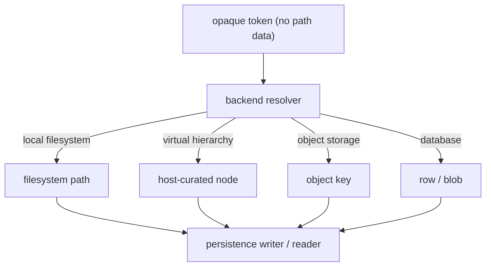
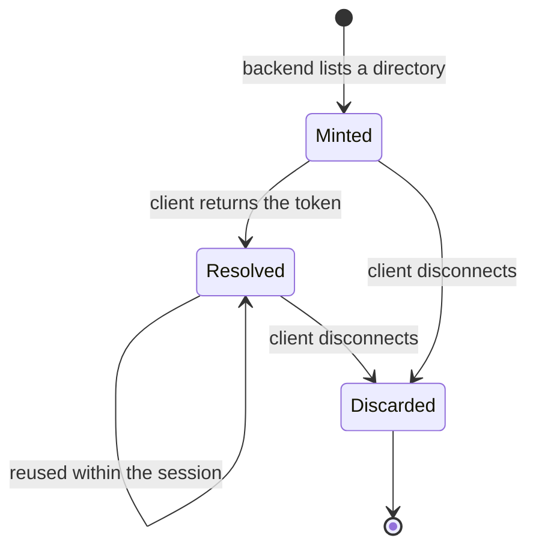
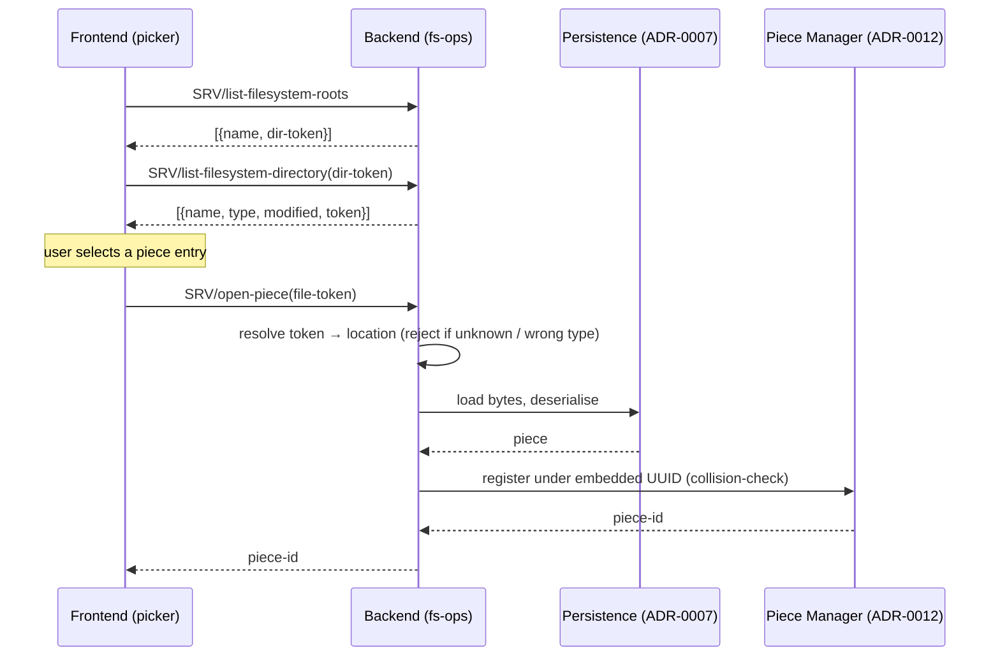
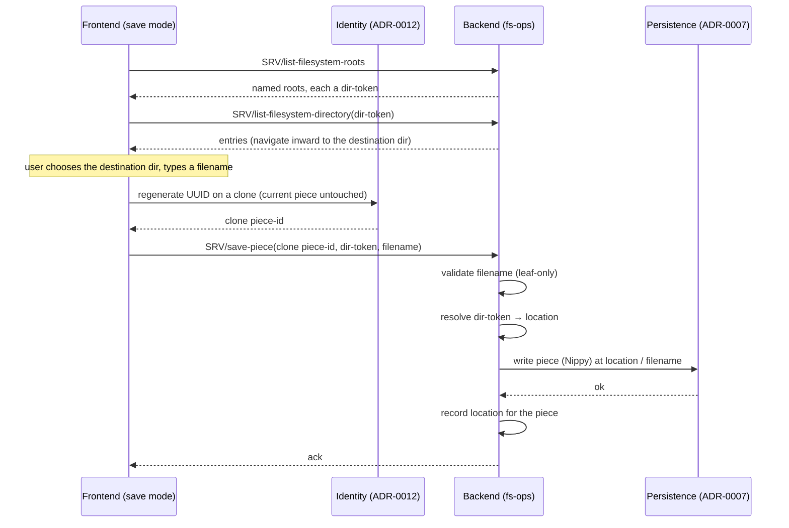

# ADR-0051: Filesystem Operations — Real and Virtual

## Status

Accepted

## Table of Contents

- [Context](#context)
- [Decision](#decision)
- [Detailed Design](#detailed-design)
  - [1. The Boundary: No Path Crosses It](#1-the-boundary-no-path-crosses-it)
  - [2. Opaque Tokens](#2-opaque-tokens)
  - [3. The Operations](#3-the-operations)
  - [4. Real and Virtual: One Contract](#4-real-and-virtual-one-contract)
  - [5. Security Invariants](#5-security-invariants)
  - [6. Token Lifetime and the Connection Registry](#6-token-lifetime-and-the-connection-registry)
  - [7. Transport Transparency and Errors](#7-transport-transparency-and-errors)
  - [8. The Seams](#8-the-seams)
  - [9. Authorisation Classes and How the Owner Assigns Them](#9-authorisation-classes-and-how-the-owner-assigns-them)
- [Rationale](#rationale)
- [Consequences](#consequences)
- [Related Decisions](#related-decisions)
- [Implementation Notes](#implementation-notes)
- [Future Considerations](#future-considerations)

## Context

Ooloi's frontend never browses a backend's storage directly. Under the single-authority model ([ADR-0040](0040-Single-Authority-State-Model.md)) pieces exist only on a backend and change only through accepted operations; under frontend/backend separation ([ADR-0001](0001-Frontend-Backend-Separation.md)) that backend may be in the same process or on another machine entirely. A frontend that read directories, resolved paths, or opened files directly would assume a local filesystem that may not exist — and, when connected to a remote backend, would expose that machine's storage layout across the wire.

Yet the application must let users find, open, and save pieces, and must let other subsystems rely on the same operations: administering a backend's storage, and the collaboration access model that shows each user a different catalogue — regardless of whether that backend is in-process or remote, since the backend is the same either way. (Import, Upload, and Export are related but distinct — they stream a file's content between client and backend rather than browsing storage; see §1.) Today there is no architectural home for *how* those operations work. The piece persistence layer ([ADR-0012](0012-Persisting-Pieces.md), [ADR-0007](0007-Nippy.md)) reads and writes pieces at explicit paths; it knows nothing of navigation, of remote backends, or of who may see what. The custom piece picker, and the File-menu operations New, Open, Save, and Save As, all need a single consistent contract beneath them — and that contract must hold identically whether the storage behind it is a local filesystem, a virtual hierarchy a host presents to a guest, or, later, object storage or a database.

This ADR defines that contract: the operations, the identifiers they exchange, the security boundary they enforce, and the seams at which identity, access, serialisation, and transport plug in. It is deliberately not a "picker" decision — the picker is one consumer among several.

Foundations this builds on:

- **[ADR-0040](0040-Single-Authority-State-Model.md)** — the frontend observes and operates on backend state and reads no resource directly.
- **[ADR-0001](0001-Frontend-Backend-Separation.md)** — two deployment shapes: a combined application (in-process backend, able to host or join over the network) and a standalone backend server. Frontend-only deployment is obsolete; a backend is always present.
- **[ADR-0018](0018-API-gRPC-Interface-and-Events.md)** — the universal `ExecuteMethod` endpoint carries every API call; new server operations need no `.proto` change.
- **[ADR-0046](0046-Reference-Passing-In-Process-Transport.md)** — in-process calls pass Clojure values by reference, network calls serialise, and the handler is identical across both.
- **[ADR-0012](0012-Persisting-Pieces.md) / [ADR-0007](0007-Nippy.md)** — a piece's identity (an embedded string UUID) and its serialised byte format.
- **[ADR-0036](0036-Collaborative-Sessions-and-Hybrid-Transport.md) / [ADR-0021](0021-Authentication.md)** — who a caller is, and which pieces they may reach.

## Decision

We define a **backend filesystem-operations contract** addressed entirely through **opaque tokens**, identical across real and virtual storage:

1. **No path crosses the boundary.** The frontend never sends or receives an operating-system path. Directories are named by opaque tokens the backend mints; files are opened by opaque tokens; a file is written by naming a destination directory token and a leaf filename (§1–2).
2. **A small operation set:** `list-filesystem-roots`, `list-filesystem-directory`, `open-piece`, `save-piece`, `delete-piece`, and — defined but deferred (see Future Considerations) — `move-piece` (§3).
3. **One contract, real or virtual.** The same operations and tokens serve a local filesystem, a virtual hierarchy, and future object or database backends; only the backend's token resolution differs (§4).
4. **Security is structural.** Opaque tokens make path disclosure and path traversal impossible by construction; filename inputs are validated to leaf names; the backend's chosen roots are the navigable ceiling (§5).
5. **Tokens are session-scoped backend state**, held on the calling client's connection-registry entry and discarded when that client disconnects (§6).
6. **The contract is transport-blind and reports failure as data** (§7).
7. **Identity, access, serialisation, and transport are seams, not contents.** This ADR owns the operation contract; it delegates piece identity to ADR-0012, authorisation to ADR-0036/0021, byte format to ADR-0007, and transport to ADR-0046 (§8).

## Detailed Design

### 1. The Boundary: No Path Crosses It

The frontend's relationship to storage is interrogative, never direct: it asks the backend *"what is here?"* and renders the answer. It does not enumerate directories, resolve paths, or read bytes itself. This is the single-authority principle (ADR-0040) applied to the filesystem, and it is what makes a remote backend indistinguishable from a local one: the same question is asked of both, and only the answer's content — and its boundaries — differ.

The boundary is the gRPC call, in-process or networked alike. A value that crosses it is exposed: it can be read from client memory, logs, or the wire. Therefore **no operating-system path is ever placed in any value that crosses the boundary** — not as an argument, not in a result, not encoded inside a token. This holds in-process as strictly as over the network, because the in-process backend is the same code that, the moment a network server is enabled, begins answering remote callers. A contract that admitted paths in-process would leak them the instant the application hosted a session.

One clarification, because the rule is about the *backend's* storage, not every filesystem everywhere. **Reading or writing a file on the client's *own* machine — Import and Upload inbound, Export outbound — is a separate path, and not part of this contract.** Import and Upload read a local file and stream its *content* to the backend, which creates the piece; Export is the mirror — the backend produces the content, streams it to the frontend, and the frontend saves it to a local file with full local-filesystem access. A native file dialog is appropriate at these ends: it is the *client's* filesystem, not a backend's. No path crosses the boundary in any of them; bytes do. All are ordinary frontend↔backend streaming — the same transport-blind pattern as events and playback (ADR-0046) — and the backend at the other end is identical whether in-process or remote, so none of it is remote-only or tied to any deployment. What this contract forbids is the frontend *browsing or reading a backend's storage*; it never forbids the client reading or writing its own file.

### 2. Opaque Tokens

Two kinds of identifier travel across the boundary, both opaque to the frontend:

- A **dir-token** denotes a directory (a container). It is the argument to `list-filesystem-directory` (navigate into it) and the destination for `save-piece` (write into it).
- A **file-token** denotes an existing file. It is the argument to `open-piece`, `delete-piece`, and `move-piece`.

A token is a string the backend mints and the frontend round-trips without interpretation. Its only verbs, from the frontend's side, are *send it back*. The frontend never constructs a token, never parses one, never infers structure from one. The backend holds the mapping from token to real location; the token itself carries no path information of any kind.

Filenames are different from tokens, and the asymmetry is deliberate: a leaf filename (`symphony.ooloi`) is safe to display and safe for a user to type, and `save-piece` accepts one directly. You **reference an existing thing by its token** (it was listed, so a token exists for it); you **create a new thing by naming it** within a directory token (it does not yet exist, so there is no token to round-trip). A file's identity to the user is its name; its identity to the contract is its token.

### 3. The Operations

| Operation | Input | Returns | Authorisation | Notes |
|---|---|---|---|---|
| `list-filesystem-roots` | — | `[{:name :token}]` | read | Backend-curated entry points; the navigable ceiling |
| `list-filesystem-directory` | dir-token | `[{:name :type :modified? :token}]` | read | Lazy, per-directory; result is disposable cache |
| `open-piece` | file-token | piece-id | read | Resolve → load → deserialise, register, collision-check per ADR-0012 |
| `save-piece` | piece-id, dir-token, filename | ack | save | Validate filename (leaf-only) → resolve → write (Nippy, ADR-0007); record location |
| `delete-piece` | file-token | ack | delete | Internal; no File-menu item initially |
| `move-piece` | file-token, dest-dir-token | ack | administrative | See [Future Considerations](#future-considerations); defined, deferred |

**A note on operation names.** Only the two listing operations carry `filesystem` in their names, because navigating storage structure is their purpose — they are the one place this contract makes the filesystem visible. The operations that act on a piece (`open-piece`, `save-piece`, `delete-piece`, `move-piece`) name the piece, not the filesystem: under [ADR-0012](0012-Persisting-Pieces.md) a piece is not a file, the filesystem is the abstracted backing, and naming it on every operation would foreground exactly what the architecture abstracts away.

`list-filesystem-roots` bootstraps navigation. `list-filesystem-directory` needs a dir-token to act on, and `list-filesystem-roots` is the only source of the first one; without it the frontend would have nothing to navigate from. Each entry's `:type` (`:directory`, `:piece`, `:other`) tells the frontend which operation applies, and the backend re-checks the resolved target's type on use (`open-piece` rejects a dir-token, and so on). Listings carry **no UUID**: a piece's UUID lives inside its file, on the same serialised path as everything else (ADR-0012), so it is unknowable without deserialising — and listing a directory must not deserialise every piece in it.

**`open-piece` is one-directional: token in, piece-id out.** Because the UUID is inside the file, you cannot open *by* UUID from a cold browse — the UUID does not exist as a known value until the file has been read. The backend resolves the file-token to a location, loads and deserialises the piece, registers it under its embedded UUID (detecting collisions per ADR-0012), and returns the piece-id. The UUID is a *product* of opening, not an input to it.

**`save-piece` writes a piece to a named destination.** The destination is always a dir-token the user navigated to plus a leaf filename — never a path, never a UUID (a UUID is identity, not a location). `save-piece` is identity-agnostic: it writes the piece's bytes at the resolved location. The two File-menu variants differ only in what the identity layer does *before* the write:

- **Save** writes the current piece to its recorded location (or, if it has none, prompts through the picker in save mode, keeping its UUID).
- **Save As** is *export a copy*: the identity layer clones the piece with a fresh UUID (ADR-0012), the clone is written to the chosen destination, and the current in-memory piece is left untouched. The fs-ops `save-piece` itself does not distinguish the two — the regeneration is an identity operation that happens before the call.

**New (`new-piece`) is not a filesystem operation.** It mints an in-memory piece with a fresh UUID (ADR-0012); the piece touches storage only at its first Save (`save-piece`).

### 4. Real and Virtual: One Contract

The operations above do not change with the storage behind them. Only the backend's resolution of a token changes:

On a local backend the resolver maps a token to a real path, and the abstraction is thin enough that browsing looks like browsing your own disk. On a remote backend the resolver maps a token to whatever virtual hierarchy the host chooses to present — not its directory tree, but the slice it offers the caller. Object storage and a database are the same shape again: a different resolver, the same tokens and operations. The frontend cannot tell which is behind a token, and does not need to.

This is why building the contract opaque from the start, in-process included, is not premature generality: it is what lets a new storage backend be a backend-only change, with no frontend branch and no protocol change. The persistence layer already abstracts its sinks and sources (file, in-memory buffer, network socket) behind a writer/reader pair; resolution simply produces the appropriate one.

**The structure itself.** What `list-filesystem-roots` and `list-filesystem-directory` expose is a *virtual structure* — virtual directories mapped to real storage. Every backend has one, because the combined application's in-process backend and a dedicated server run the *same* backend components (ADR-0001); the only difference is whether a frontend is attached. So a combined app that hosts a session presents this structure to the clients that connect, and what they meet is exactly that: virtual directories containing real files. This is not a server-product feature added later — it is a property of the backend, present from the start.

Locally it can be a thin pass-through: the user browsing their own machine sees the operating system's own hierarchy — the Finder-style sidebar — and defines nothing. A *curated* structure matters when the backend hosts: the host shapes what guests see, decoupled from the real layout on disk.

**Virtual directories carry stable identities, distinct from session tokens.** A token is ephemeral (§6); a virtual directory's identity is durable. That distinction is what makes "open where I last saved", favourites, and bookmarks possible at all — you cannot remember a token, but you can remember a stable directory identity and have the backend resolve it to a fresh listing on demand.

**Structure and access are orthogonal, and compose.** The structure is server-wide and administrator-defined; access (ADR-0036) is per-user. A given caller's `list-filesystem-roots` / `list-filesystem-directory` is the structure *filtered by* that caller's grants — the same backend yielding different worlds to different people. In-process single-user has neither a curated structure nor a filter: just the OS pass-through, everything permitted. Defining and administering the structure is the host or administrator's responsibility, its mechanics deferred (see [Future Considerations](#future-considerations)).

### 5. Security Invariants

Three properties follow structurally from the token model:

- **No disclosure.** A token carries no path, so a leaked token reveals nothing about the server's storage layout — no home-directory usernames, no neighbouring users' locations, no tree above the caller's view.
- **No traversal.** A caller can submit only tokens the backend minted, each already bound to a vetted location; there is no path to manipulate into `../../`. The one place client-supplied text reaches the filesystem is the `save-piece` filename, which is therefore **validated to a leaf name** — separators, `..`, and absolute markers rejected.
- **Sandbox by roots.** The caller holds only tokens the backend handed out — roots from `list-filesystem-roots`, children from `list-filesystem-directory`. There is no token for the parent of a root, so the backend's chosen roots are the navigable ceiling. The sandbox is the absence of an upward token, not a check that can be forgotten.

### 6. Token Lifetime and the Connection Registry

Navigation tokens are per-client backend state. They are minted as the backend lists a directory and held on that client's entry in the shared connection registry (ADR-0036 / ADR-0024) under a `:nav-tokens` key, beside the existing `:piece-subscriptions`. The calling client is identified by the client-id the authentication interceptor places in the gRPC context (ADR-0021); an operation reads that id, consults that client's tokens, and resolves only tokens it minted for that client. One client therefore cannot resolve another's tokens, and a guessed or forged token simply misses.

Token lifetime is the connection's lifetime: when the client disconnects, gracefully or by the cancel-handler backstop, its registry entry is removed and its tokens vanish with it — the same cleanup path that already discards its subscriptions and event queue. No separate store and no eviction policy are introduced; a browsing session mints a bounded number of tokens and they are reclaimed with the connection. A token therefore does not survive reconnection. Persistent references — to a piece, or to a location for favourites and "last saved" — are the business of stable identities (the piece's UUID, a virtual directory's stable id) resolved through the catalogue (§[Future Considerations](#future-considerations)), never of tokens. The frontend keeps no token cache: navigation is always a live query — cheap, because in-process calls are reference-passed (ADR-0046) and listings are small and fetched lazily per directory.

### 7. Transport Transparency and Errors

The operations are ordinary API calls over the universal `ExecuteMethod` endpoint (ADR-0018), so they require no `.proto` change. Under ADR-0046 the in-process transport passes the call's Clojure values by reference and the network transport serialises them, but the handler is identical in both cases; tokens and filenames are plain strings that cross either way unchanged. The contract is thus transport-blind: the opacity discipline is a property of the handler, not of whether bytes were produced.

Failures travel as data on both transports. The server catches the operation's `Throwable`, records statistics, and returns `{:success false :error "<message>" :result nil}`; it does not rethrow, so the message is never truncated into a gRPC status. The client-side `SRV/*` wrapper inspects `:success` and throws `ex-info` carrying the server's exact message. A not-found, a denial, and a rejected traversal are each reported this way, each carrying its own error code — they are detected on different paths and are not conflated. Whether an unauthorised caller is *shown* a uniform message, so it cannot learn which pieces exist, is a presentation decision for the access model (ADR-0036), not a property of this contract.

### 8. The Seams

This ADR owns the operation contract and nothing else. Everything adjacent plugs in at a defined seam:

| Concern | Owner | How it plugs in |
|---|---|---|
| Caller identity | ADR-0021 | client-id from the authenticated gRPC context |
| Authorisation | ADR-0036 | interceptor enforces each operation's class; the access registry filters `list-*` results before they leave the backend; the frontend gates visually |
| Piece identity | ADR-0012 | `open-piece` registers and collision-checks by embedded UUID; Save As regenerates the UUID before the write |
| Byte format | ADR-0007 | `open-piece`/`save-piece` delegate (de)serialisation to the persistence writer/reader |
| Transport | ADR-0046 | reference-passing vs serialisation; identical handler |
| Governed by | ADR-0040 / ADR-0001 | single authority; separation; a backend is always present |

The composition is clearest in the two canonical flows.

**Open:**

`open-piece` ends at the returned piece-id. A client does not begin receiving that piece's change events as part of opening it: subscription is a separate seam ([ADR-0031](0031-Frontend-Event-Driven-Architecture.md)), performed by the windowing layer through the Event Router when it opens the piece window and unwound when the window closes. The same holds for a freshly minted `new-piece`. This contract neither subscribes nor unsubscribes.

**Save As (export a copy):**

### 9. Authorisation Classes and How the Owner Assigns Them

Every operation carries an authorisation class — `read` for `list-filesystem-roots`/`list-filesystem-directory`/`open-piece`, `save` for `save-piece`, `delete` for `delete-piece`, and an administrative class for `move-piece`. These are the same classes ADR-0036 already defines for collaboration (a host holds read, write, save, print, delete, and management; a guest holds a granted subset). This ADR does **not** invent a parallel permission system and does **not** introduce a distinct "create" capability: writing a new file is a `save`, gated like any other.

Assignment is ADR-0036's, not this ADR's. The host or administrator holds every class and grants subsets to others by email; the gRPC interceptor enforces each call before it executes; the frontend mirrors the grants as visual gating only (the backend remains the sole enforcer). The two halves meet at `list-*`: the access registry filters listings so a guest sees only the slice granted to them, while the host sees the full catalogue — the same dialog against the same backend yielding different worlds.

Until the collaboration access model is built, the backend runs free-for-all: every class is permitted, and the local user implicitly holds all of them. The contract is built permission-agnostic from the start, exactly so that access-filtering of listings and per-operation enforcement can layer on later without changing any operation's shape.

## Rationale

**Why opaque tokens, and not paths, UUIDs, or OS file identifiers.** Paths disclose and invite traversal. UUIDs are identity, not location, and are unknowable before a file is read, so they cannot drive a cold browse. Operating-system file identifiers (the inode on macOS and Linux, the NTFS File ID on Windows) are volume-scoped, reused after deletion, absent from virtual and object backends, and unevenly exposed on the JVM (the standard library returns no file key on Windows) — they re-couple the contract to a local filesystem, the precise coupling being removed. An opaque token is the only identifier that is simultaneously path-free, location-bearing, and backend-agnostic. Where a stable file identity is genuinely wanted, it belongs server-side, behind the token, never on the wire.

**Why one contract for real and virtual.** Building it opaque from the start makes a remote backend a change of *answers*, not of *interface*. Object and database storage then extend token resolution alone — a backend-only change; the frontend and the operation shapes never learn they exist.

**Why session-scoped tokens on the registry.** Navigation is a session activity, and the connection registry already holds per-client state with exactly the right lifecycle. Placing `:nav-tokens` there reuses the existing cleanup and the existing caller-identity seam, rather than inventing a store that would have to be reaped separately.

## Consequences

### Positive

- One contract serves the picker, New/Open/Save/Save As, administering a backend's storage, and remote, object, and database storage. (Import, Upload, and Export are the separate ingestion/egress path — §1 — not consumers of this contract.)
- Path disclosure and path traversal are impossible by construction, not by vigilance.
- No frontend branches on deployment; remote is identical in shape to local.
- A new storage backend is a backend-only resolver change — no protocol change, no frontend change.

### Negative / Costs

- Tokens do not survive reconnection. Persistent references (recent files, bookmarks, session restore) must key on a stable identity — a piece's UUID, or a virtual directory's stable id — and resolve through a catalogue, not on tokens.
- The backend carries per-client navigation state. It is bounded and reclaimed on disconnect, but it is state.
- Filename input must be validated at the boundary; a missed validation re-opens traversal through the one client-supplied string.

### Neutral

- Recent files and bookmarks are per-user state keyed by UUID — whether they live in frontend settings (ADR-0043) or per-user on the backend is deferred (see Future Considerations) — resolved through the catalogue when it exists. They consume this contract but are not part of it.
- The picker is a consumer: it renders `list-*` results and round-trips tokens. Its presentation is out of scope here.

## Related Decisions

- [ADR-0040: Single Authority State Model](0040-Single-Authority-State-Model.md) — the frontend reads no resource directly.
- [ADR-0001: Frontend-Backend Separation](0001-Frontend-Backend-Separation.md) — the backend may be local or remote; one is always present.
- [ADR-0018: API, gRPC Interface and Events](0018-API-gRPC-Interface-and-Events.md) — the `ExecuteMethod` surface these operations ride.
- [ADR-0046: Reference-Passing In-Process Transport](0046-Reference-Passing-In-Process-Transport.md) — transport-blind handler; errors as data.
- [ADR-0012: Persisting Pieces](0012-Persisting-Pieces.md) / [ADR-0007: Nippy](0007-Nippy.md) — piece identity and byte format at the seam.
- [ADR-0036: Collaborative Sessions and Hybrid Transport](0036-Collaborative-Sessions-and-Hybrid-Transport.md) / [ADR-0021: Authentication](0021-Authentication.md) — caller identity and authorisation.
- [ADR-0022: Lazy Frontend-Backend Architecture](0022-Lazy-Frontend-Backend-Architecture.md) — listings are fetched per-directory on demand and are disposable.

## Implementation Notes

- The operations are non-VPD server functions, implemented in a `shared/ops/` namespace and reached on the backend through the `*server-component*` map (which carries `:connection-registry`), with the caller's client-id read from the gRPC context. This is the established per-client server-operation pattern; the event-subscription operations are the canonical model. The frontend calls them as `SRV/list-filesystem-directory`, `SRV/open-piece`, and so on, with no `.proto` change.
- `open-piece` and `save-piece` delegate (de)serialisation to the existing persistence writer/reader abstraction; token resolution produces the appropriate writer or reader — a file path today, an object key or database row later.
- The frontend treats every token as opaque: it is only ever stored and returned, never parsed. A debug or test build must not introduce path-bearing tokens, even in-process, as that would normalise a leak.

## Future Considerations

- **Move (investigation outcome).** A `move-piece(file-token, dest-dir-token)` belongs in the contract conceptually: it is opaque-token-clean, and because a piece's identity is its embedded UUID, moving the file changes no identity — references resolve correctly once the catalogue re-resolves the UUID to its new location. It is a storage-administration operation for the host or administrator, not a File-menu action, and is therefore **defined now but deferred**: it has no consumer until storage administration and the catalogue are built — both backend features, regardless of how the backend is deployed. Recording it here keeps the contract whole and prevents it being bolted on later as an exception.
- **Delete (`delete-piece`)** is part of the contract and is needed internally — overwrite, cleanup, and administration — but carries no File-menu item initially.
- **The persistent catalogue** (embedded UUID → storage location and metadata) is the deferred companion to this contract. It is what lets a persistent reference, or a recent-files entry, resolve a piece that has moved. Until it exists, persistent references degrade gracefully to a last-known location. Its first consumer is single-user session restore; per-user access over it comes with the collaboration access model. It is backend state — the same whether the backend runs with a frontend or headless.
- **Alternative storage backends.** Where a backend keeps its pieces — a local filesystem, an SQL database, an object store, or anything else a writer/reader can target — is *general backend configuration*: neither cloud-specific nor deployment-specific. A combined-app user can point their own backend at a database or a local object store on their own machine, exactly as a dedicated server can. It extends token resolution only, is built when that storage is needed, and is never tied to how or where the backend runs.
- **Access-filtered listings** — the per-user "shared with me" slice — layer onto `list-filesystem-roots`/`list-filesystem-directory` when the collaboration access model lands, filtering results by the access registry before they leave the backend.
- **Virtual-structure administration.** On any backend that hosts, the roots and directories are an administrator-defined virtual structure mapping virtual directories to real storage (§4). Defining and editing that structure — and who holds the right to — is administration by the host or administrator, persisted as EDN under the platform storage folder alongside the collaborator and piece-access registries (ADR-0036, `~/.ooloi/…`). It is **not** a standalone-server feature: the in-process backend needs it the moment it hosts. Its mechanics — the management surface (the *Collaborators* window administers the access half; a structure surface administers the namespace), the persistence format, and fine-grained administrative permissions — are deferred to the collaboration / hosting work and require no new ADR: identity is ADR-0021, the persisted registries and storage location are ADR-0036, and the window contract is ADR-0042. This ADR only requires that `list-filesystem-roots` / `list-filesystem-directory` resolve whatever structure and grants the backend holds.
- **Recent files, favourites, and "last saved".** These are persistent *per-user* state, not session state — so they live neither in the ephemeral connection registry nor as tokens, but as stable identities (a piece UUID, a virtual directory's stable id). Whether they are frontend state (ADR-0043, per installation) or backend per-user state (the ADR-0036 collaborator registry, following the user across clients in the Google Docs manner) is deferred; the latter fits the hosted model better. Either way the backend resolves the stored identity to a fresh listing — the frontend still queries, and never caches tokens.
