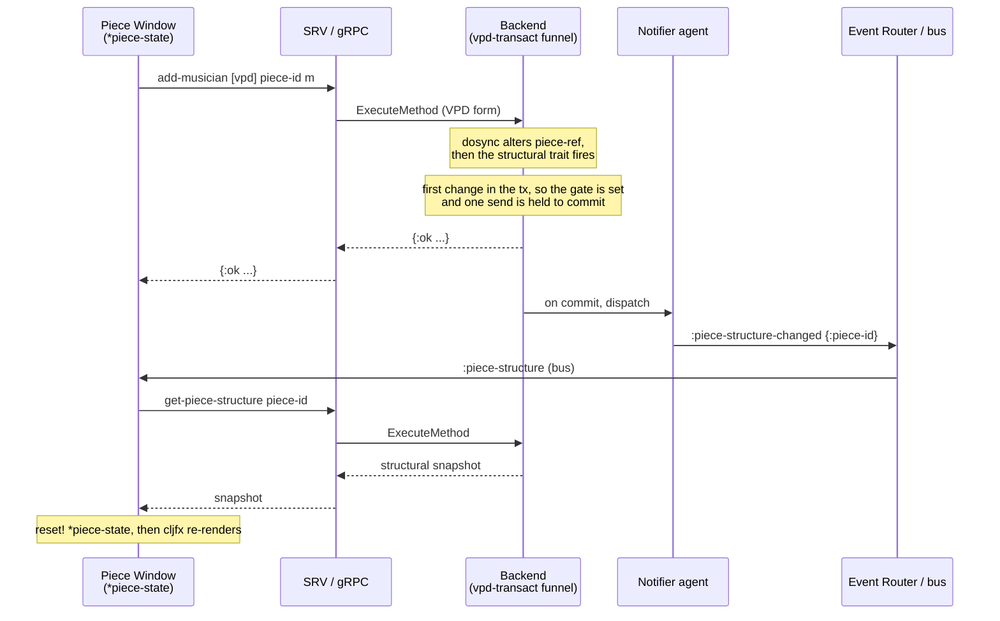
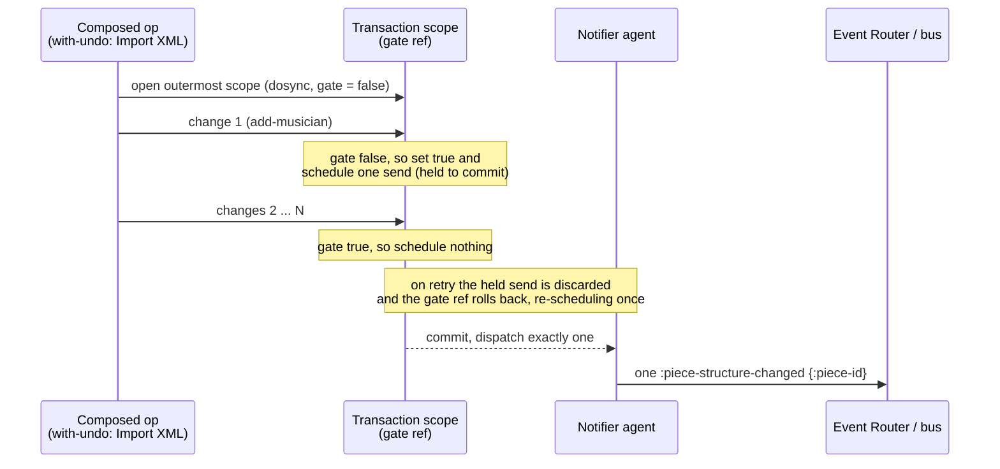

# ADR-0052: Change Detection and Event Generation

## Status

Accepted. Living: this ADR is prescriptive about the architecture as decided, and is revised as implementation proceeds and we learn more. The prose is normative; any code shown is illustrative — one realisation of the requirements, never the contract (cf. [ADR-0015](0015-Undo-and-Redo.md)).

## Table of Contents

- [Context](#context)
- [Decision](#decision)
  - [1. One detection point](#1-one-detection-point)
  - [2. Detection keys on the VPD shape](#2-detection-keys-on-the-vpd-shape)
  - [3. Structural change emits `:piece-structure-changed`](#3-structural-change-emits-piece-structure-changed)
  - [4. Exactly one event per outermost transaction](#4-exactly-one-event-per-outermost-transaction)
  - [5. The dirty flag](#5-the-dirty-flag)
  - [6. Two emission regimes](#6-two-emission-regimes)
  - [7. Formatting-pipeline invalidations (future consumer)](#7-formatting-pipeline-invalidations-future-consumer)
- [Sequence Diagrams](#sequence-diagrams)
- [Rationale](#rationale)
- [Consequences](#consequences)
- [Related Decisions](#related-decisions)

## Context

Pieces exist only on a backend and change only through accepted API operations ([ADR-0040](0040-Single-Authority-State-Model.md)). The frontend holds no authoritative piece state; it reacts to change by invalidate → refetch ([ADR-0022](0022-Lazy-Frontend-Backend-Architecture.md), [ADR-0031](0031-Frontend-Event-Driven-Architecture.md)), and an event names what is now stale rather than carrying a delta.

What no decision has yet fixed is the step before delivery: *how a backend mutation becomes an event at all.* The event registry ([ADR-0018](0018-API-gRPC-Interface-and-Events.md)) and the frontend bus ([ADR-0031](0031-Frontend-Event-Driven-Architecture.md)) define what an event is and where it goes; they do not define how the backend decides to emit one, how many, or once per what. Left unspecified, that decision is reinvented per feature, drifts between call sites, and becomes the natural home of the failure where the mechanism exists but production never invokes it.

This ADR fixes that mechanism: where change is detected, what shape of mutation it keys on, how a structural change becomes the `:piece-structure-changed` event, how multiple changes in one transaction collapse to a single event, how a piece's unsaved state is tracked, and how the same mechanism will later feed the formatting pipeline. It is foundational: the piece window, collaboration, undo/redo, and eventually rendering all stand on it.

Foundations this builds on:

- **[ADR-0040](0040-Single-Authority-State-Model.md)** — single authority; the frontend observes, the backend owns and mutates.
- **[ADR-0022](0022-Lazy-Frontend-Backend-Architecture.md)** — invalidation is staleness, not structure; events carry identifiers of what changed, not the change itself.
- **[ADR-0018](0018-API-gRPC-Interface-and-Events.md) / [ADR-0031](0031-Frontend-Event-Driven-Architecture.md)** — the event registry and the frontend bus categories an emitted event flows through.
- **[ADR-0015](0015-Undo-and-Redo.md)** — undo/redo, whose mutation sites and replay reuse this mechanism; and the normative-prose / illustrative-code register this ADR follows.

## Decision

### 1. One detection point

Change is detected at the single backend write funnel through which every VPD mutation passes — adders, removers, setters, movers, sequence writes and attribute writes alike. Detection lives there and nowhere else; no downstream layer re-derives what changed by diffing state. That funnel is the only place that holds the prior and the resulting piece value together, and it is the transaction boundary at which emission and undo capture are correct.

A property the rest of this decision depends on follows directly: because detection is at one funnel, a newly added mutation cannot silently escape it, and a change cannot be reported twice by two layers that disagree.

### 2. Detection keys on the VPD shape

Every mutator has two dispatch shapes. The **VPD form** — `(op [vpd] piece-or-id args)` — is the form every client and the frontend use, because VPDs serialise across the wire and object pointers do not. The **object form** operates on a value in hand and is used by local construction and internal composition.

Detection keys on the VPD form. The object form is out of band: constructing a piece, or internally assembling a value before it is stored, must not emit invalidations or mark anything dirty — there is no subscriber and no user edit there, only the VPD path represents an accepted operation on live, observable state.

### 3. Structural change emits `:piece-structure-changed`

The structural entities — Piece, Musician, Instrument, Staff, Layout — carry a trait that emits `:piece-structure-changed` for the affected piece when one of them is mutated through the VPD path. The trait is conferred declaratively: an entity participates by deriving the structural tag, so a new structural entity — including one defined by a plugin — opts in with a single derivation and no change to the funnel.

The event is the standard invalidation: it names the piece and reports its structure stale; it carries no structural payload, and the frontend responds by refetching the structural snapshot. The set of mutations the trait covers is exactly the set that changes what `get-piece-structure` projects — membership, ordering, identity, naming, and staff participation across those five entities — and the covered set and the projection are kept in agreement by construction.

The event type `:piece-structure-changed` and its `:piece-structure` bus category are registered as amendments to [ADR-0018](0018-API-gRPC-Interface-and-Events.md) and [ADR-0031](0031-Frontend-Event-Driven-Architecture.md). The name is `:piece-structure-changed` throughout; the earlier `:piece-structure-invalidated` is retired.

### 4. Exactly one event per outermost transaction

Emission is deferred to commit by dispatching through an agent: an action dispatched inside a transaction is held until that transaction commits and is discarded if it retries. Emission therefore never fires from an uncommitted or replayed attempt, and never from inside the `dosync` itself.

Deferral fixes timing, not multiplicity: N changes that each dispatch would commit N events. A composed transaction — several mutations grouped for atomicity, up to an import of thousands of items — must produce **exactly one** structural event, not one per inner change. This is achieved with a transaction-scoped gate: the first structural change in the outermost transaction schedules the single emission and records that it has done so; later changes in the same transaction see the gate set and add nothing.

The gate is held in a **ref**, so that it rolls back in lockstep with the discarded dispatch when the transaction retries. A non-transactional flag would survive a retry while its dispatch was discarded, and the committed transaction would then emit nothing. The gate lives **outside the piece** — it is transaction coordination, not musical content — and is fresh per outermost transaction.

The scope that establishes the gate is a single primitive that also opens the transaction and names the operation for undo. A lone operation is the degenerate case: it opens that scope itself and is the n = 1 transaction — one change, one event — with no separate path. Composition therefore goes through that scope rather than a bare `dosync`; a bare `dosync` gives atomicity but binds no gate, and its inner operations would each emit.

### 5. The dirty flag

A piece is dirty when it has changed since it was last saved. Dirtiness is **OR-accumulated**: any VPD change whose resulting value is not identical to the prior value sets the flag; a change that leaves the value untouched leaves the flag as it was, so a no-op never masks earlier unsaved changes. The flag is cleared only by a successful save, and **restored — not set —** by undo and redo, which return it to the value the restored state carried.

The dirty flag is held by the Piece Manager, beside the piece, and **never inside the piece value**. Were it a field of the piece, setting it would itself be a change the detector would see and undo/redo would capture, and a save could not clear it without mutating content. It is read through a reader and set through the manager's own function: session state about a piece, not part of the piece's identity or content.

### 6. Two emission regimes

One detection mechanism feeds two regimes that differ in granularity, and the difference is deliberate:

- **Structure** is coarse. A structural change emits a single `:piece-structure-changed` per transaction and the frontend refetches the whole structural snapshot. That snapshot is light, so over-signalling costs only a cheap refetch the renderer diffs to nothing; there is no need for finer structural events.
- **Formatting / content** is fine. A content change can require more than one invalidation (see §7).

Both regimes honour the same principle: an event carries identifiers of what is stale, not a delta ([ADR-0022](0022-Lazy-Frontend-Backend-Architecture.md)). The single-event-per-transaction rule of §4 is **specific to structure** and must not be read as governing formatting.

### 7. Formatting-pipeline invalidations (future consumer)

When content changes, the formatting engine must run and the resulting invalidations must be generated. This regime is a **future consumer** of the detection mechanism of §1–§2; it is described here only to the extent presently known, and its engine is **not specified by this ADR**:

- A single change may produce **more than one** invalidation, at **different levels of the visual hierarchy** — layout, page, system, staff, measure (the levels [ADR-0022](0022-Lazy-Frontend-Backend-Architecture.md) enumerates).
- *Which* levels and *how many* are the **formatting engine's** decision, not the detector's.
- The invalidation sequence **may be optimised by subsumption** — a containing invalidation absorbing the finer ones it covers. Where that collapsing lives — the engine, the Event Router, or the emit layer — is left open.

These invalidations are forward staleness signals out of formatting; they do not let the renderer renegotiate semantic or layout decisions — the rendering boundary holds. How the engine derives them belongs to a later decision, taken when the formatting pipeline exists and can be driven by tests.

## Sequence Diagrams

### From a structural change to the refetched window

A single structural mutation — here, adding a musician — detected at the funnel, emitted once on commit, and consumed by the piece window as invalidate → refetch.

### One event per outermost transaction

A composed transaction with many structural changes yields exactly one event; the gate is set once, and because it is a ref it rolls back with the transaction so a retry still emits exactly once.

## Rationale

- **One funnel** makes detection both unforgettable and unambiguous: a new mutator cannot escape it, and two layers cannot disagree about what changed.
- **Keying on the VPD shape** is not an implementation accident but the boundary of accepted, observable operations — exactly the set that should notify, and the only set a remote client can express.
- **Agent deferral plus a ref gate** is the one combination correct under both retry and composition; deferral alone multiplies events, and a non-transactional flag drops them on retry.
- **A declarative trait** keeps the structural set honest and extends to plugin-defined entities without touching the funnel.
- **Dirty outside the piece** keeps undo/redo and save clean and follows the same separation as every other piece-adjacent piece of session state.
- **Coarse structure, fine formatting** lets the cheap central structural signal stay simple while leaving the formatting regime the multiplicity it genuinely needs.

## Consequences

- The structural slice — the trait, the agent-deferred emit, and the single-event coalescing including its retry behaviour — is built first, alongside the introduction of `:piece-structure-changed` and the piece window's real backend connection.
- The transaction scope of §4 is reused: undo/redo grouping names the same scope, so a composed operation is one named undo step *and* one event by the same boundary.
- The dirty flag is built when a piece window can display it; capturing and restoring dirty within undo/redo snapshots arrives with piece-content undo/redo.
- Composition is written with the scope primitive, not a bare `dosync`, wherever a single event — or a single named undo step — is wanted.
- Detecting content changes for automatic undo labelling, and the formatting-pipeline invalidations of §7, are later consumers that extend this mechanism without changing §1–§4.

## Related Decisions

- [ADR-0040: Single Authority State Model](0040-Single-Authority-State-Model.md)
- [ADR-0022: Lazy Frontend-Backend Architecture](0022-Lazy-Frontend-Backend-Architecture.md)
- [ADR-0018: API, gRPC Interface and Events](0018-API-gRPC-Interface-and-Events.md)
- [ADR-0031: Frontend Event-Driven Architecture](0031-Frontend-Event-Driven-Architecture.md)
- [ADR-0015: Undo and Redo](0015-Undo-and-Redo.md)
