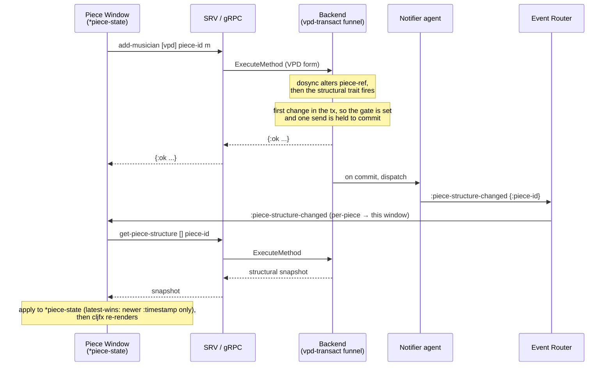
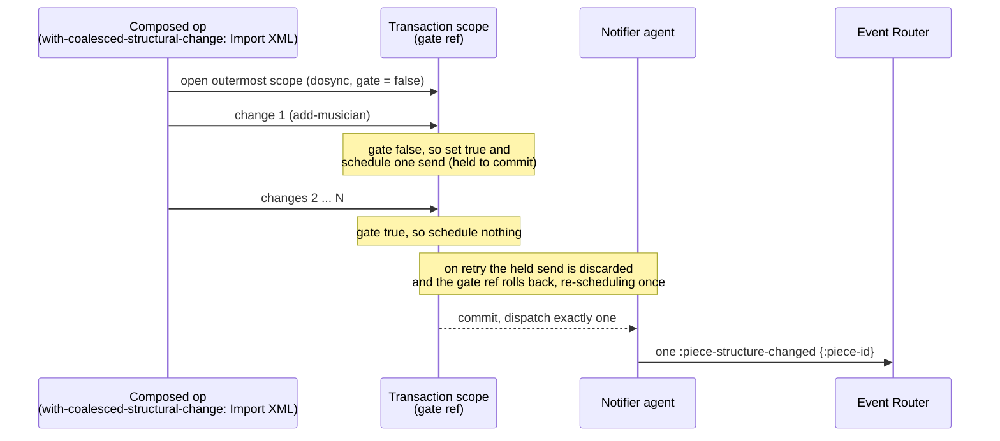

# ADR-0052: Change Detection and Event Generation

## Status

Implemented

## Table of Contents

- [Context](#context)
- [Decision](#decision)
  - [1. One detection point](#1-one-detection-point)
  - [2. Detection keys on the VPD shape](#2-detection-keys-on-the-vpd-shape)
  - [3. Structural change emits `:piece-structure-changed`](#3-structural-change-emits-piece-structure-changed)
  - [3a. The structural projection: `get-piece-structure`](#3a-the-structural-projection-get-piece-structure)
  - [3b. Detection: the slot flag](#3b-detection-the-slot-flag)
  - [4. Exactly one event per outermost transaction](#4-exactly-one-event-per-outermost-transaction)
  - [5. The dirty flag](#5-the-dirty-flag)
  - [6. Two emission regimes](#6-two-emission-regimes)
  - [7. Formatting-pipeline invalidations (future consumer)](#7-formatting-pipeline-invalidations-future-consumer)
- [Sequence Diagrams](#sequence-diagrams)
- [Rationale](#rationale)
- [Consequences](#consequences)
- [Related Decisions](#related-decisions)

## Context

Pieces exist only on a backend and change only through accepted API operations ([ADR-0040](0040-Single-Authority-State-Model.md)). The frontend holds no authoritative piece state; it reacts to change by invalidate → refetch ([ADR-0022](0022-Lazy-Frontend-Backend-Architecture.md), [ADR-0031](0031-Frontend-Event-Driven-Architecture.md)), and an event names what is now stale rather than carrying a delta.

What no decision has yet fixed is the step before delivery: *how a backend mutation becomes an event at all.* The event registry ([ADR-0018](0018-API-gRPC-Interface-and-Events.md)) and the frontend bus ([ADR-0031](0031-Frontend-Event-Driven-Architecture.md)) define what an event is and where it goes; they do not define how the backend decides to emit one, how many, or once per what. Left unspecified, that decision is reinvented per feature, drifts between call sites, and becomes the natural home of the failure where the mechanism exists but production never invokes it.

This ADR fixes that mechanism: where change is detected, what shape of mutation it keys on, how a structural change becomes the `:piece-structure-changed` event, how multiple changes in one transaction collapse to a single event, how a piece's unsaved state is tracked, and how the same mechanism will later feed the formatting pipeline. It is foundational: the piece window, collaboration, undo/redo, and eventually rendering all stand on it.

Foundations this builds on:

- **[ADR-0040](0040-Single-Authority-State-Model.md)** — single authority; the frontend observes, the backend owns and mutates.
- **[ADR-0022](0022-Lazy-Frontend-Backend-Architecture.md)** — invalidation is staleness, not structure; events carry identifiers of what changed, not the change itself.
- **[ADR-0018](0018-API-gRPC-Interface-and-Events.md) / [ADR-0031](0031-Frontend-Event-Driven-Architecture.md)** — the event registry and the frontend bus categories an emitted event flows through.
- **[ADR-0015](0015-Undo-and-Redo.md)** — undo/redo, whose mutation sites and replay reuse this mechanism; and the normative-prose / illustrative-code register this ADR follows.

## Decision

### 1. One detection point

Change is detected at the single backend write funnel through which every VPD mutation passes — adders, removers, setters, movers, sequence writes, attribute writes, and the `individuate` self-transform alike. Detection lives there and nowhere else; no downstream layer re-derives what changed by diffing state. That funnel is the only place that holds the prior and the resulting piece value together, and it is the transaction boundary at which emission is correct and at which piece undo capture is taken — the latter in the backend gRPC handler (§4; [ADR-0015](0015-Undo-and-Redo.md)).

A property the rest of this decision depends on follows directly: because detection is at one funnel, a newly added mutation cannot silently escape it, and a change cannot be reported twice by two layers that disagree.

### 2. Detection keys on the VPD shape

Every mutator has two dispatch shapes. The **VPD form** — `(op [vpd] piece-or-id args)` — is the form every client and the frontend use, because VPDs serialise across the wire and object pointers do not. The **object form** operates on a value in hand and is used by local construction and internal composition.

Detection keys on the VPD form. The object form is out of band: constructing a piece, or internally assembling a value before it is stored, must not emit invalidations or mark anything dirty — there is no subscriber and no user edit there, only the VPD path represents an accepted operation on live, observable state.

The same out-of-band property governs *maintenance*, not only detection. An `:around` hung on the object form — a referential-integrity prune, a structural invariant — does not fire for a client either, because the funnel applies the VPD form's raw slot op and never dispatches the object method. An object-form-only `:around` therefore upholds its invariant for internal, value-in-hand callers while silently skipping every client (frontend, gRPC) — a latent bug no object-form unit test can see. So any such obligation must ride the VPD form, wired as two `:around` twins (object-form and VPD-form); see [ADR-0053](0053-Piece-Window-and-Piece-Preferences.md) §4, the reference-maintenance family.

### 3. Structural change emits `:piece-structure-changed`

The structural entities — Piece, Musician, Instrument, Staff, Layout — carry the `::h/Structural` trait (`hierarchy.clj`) and emit `:piece-structure-changed` for the affected piece when one of them is mutated through the VPD path. Membership is the trait, tested with the `structural?` predicate (`predicates.clj`); each structural entity additionally declares, co-located with its model, the `non-structural-fields` set the projection uses (§3a). A new structural entity — including one defined by a plugin — opts in by deriving `::h/Structural` and declaring its `non-structural-fields`, with no change to the funnel.

The event is the standard invalidation: it names the piece and reports its structure stale; it carries no structural payload, and the frontend responds by refetching the structural snapshot. The set of mutations the trait covers is exactly the set that changes what `get-piece-structure` projects — membership, ordering, identity, naming, and staff participation across those five entities — and the covered set and the projection are kept in agreement by construction (§3b states the detection rule).

The event type `:piece-structure-changed` is registered as an amendment to [ADR-0018](0018-API-gRPC-Interface-and-Events.md). It is a **piece event**: `send-piece-event` delivers it only to clients subscribed to that piece, and [ADR-0031 §Per-Piece Event Routing](0031-Frontend-Event-Driven-Architecture.md#per-piece-event-routing) routes it per-piece to that piece's window through the piece subscription (`subscribe-to-piece-events`) — **not** through a shared bus category. That section is the canonical account of how every `:piece-*` event is routed. The name is `:piece-structure-changed` throughout; the earlier `:piece-structure-invalidated` is retired.

### 3a. The structural projection: `get-piece-structure`

**"Structural" here is a GUI scope, not the general term.** It means the *makeup* of a piece as shown and rearranged in the **Piece Window** — its Musicians, their Instruments, those Instruments' Staves, and the piece's Layouts (rooted at the Piece): the entities a user manipulates there by drag-and-drop. The Structural trait exists to serve that window — what it displays (`get-piece-structure`) and what a structural change notifies it to refetch (`:piece-structure-changed`) — and has no consumer outside it. It is not the computer-science sense of "structural", and it is not the musical content. Everything below follows from that scope.

The snapshot the frontend refetches is produced by `get-piece-structure`, which returns the piece reduced to its **structural fields**, recursively. It is a *keep-the-structural, drop-the-non-structural* projection, not an allowlist of named fields: every editable definitional field (transposition, ranges, `:clefs`, family, short-names, …) is kept automatically, and a new structural slot added later is kept for free. Dropped at every level are the large or content-bearing fields — measures, voices and items; the per-level change-sets; the layout visual hierarchy; internal counters; and `:settings`, which travels on its own `:piece-setting-changed` channel and would otherwise read stale here. These dropped fields are permanent piece content, not transient: the axis is *structural vs non-structural*, never *permanent vs temporary*.

Membership in the structural set is the `::h/Structural` trait (`hierarchy.clj`), tested with the `structural?` predicate; each structural entity additionally declares the set of fields the projection drops via a `non-structural-fields` `defmethod`, co-located with its model. The **same** `non-structural-fields` set is read by both the projection (which strips it) and the detection (§3b, which fires on a write to a slot outside it), so the kept fields and the covered set cannot drift. A new structural entity — core or plugin — opts in by deriving `::h/Structural` and declaring its `non-structural-fields`, with no central map and no change to the funnel or the projection. The recursive `structural-fields` helper keeps each node's structural fields and recurses into the structural children it retains.

**Structural fields kept / non-structural fields dropped, per entity:**

| Entity | non-structural (dropped) | structural (kept) |
|---|---|---|
| every node | `:settings` | — |
| Piece | `:time-signatures` `:key-signatures` `:tempos` | `:id` `:title` `:musicians` `:layouts` |
| Musician | `:instrument-changes` | `:id` `:name` `:short-name` `:number` `:instruments` |
| Instrument | `:key-signature-overrides` `:next-id` | `:id` `:name` `:short-name` `:number` `:language` `:family` `:transposition` `:range` `:amateur-range` `:comment` `:staves` |
| Staff | `:measures` `:key-signature-overrides` `:clef-changes` | `:id` `:name` `:short-name` `:clefs` `:num-lines` |
| Layout | `:page-views` `:stack-formatters` | `:id` `:name` `:musician-uuids` |

A Layout's `:musician-uuids` is the ordered vector of musician references that determines which musicians the layout renders, and so whether it is a score or a part ([ADR-0053](0053-Piece-Window-and-Piece-Preferences.md)). It is structural: changing which musicians a layout lists, or their order, changes the makeup shown in the Piece Window, so the projection keeps it and a write to it fires the event (§3b).

**Naming.** Entity naming is `:name` (with `:short-name` only where a score abbreviates the label — Instrument, Staff, Musician), read and written through `get-name`/`set-name`. The piece's human label is `:title` (no short name), through a separate `get-title`/`set-title` family — the head of a title-block family (subtitle, composer, arranger, … added later). Musician `:name` (initial value derived from its instruments) and Layout `:name` (initial value derived from its musicians) are user-overridable slots; the initial-value derivations are out of scope here. The filename is never piece *data* — it is external catalogue state ([ADR-0012](0012-Persisting-Pieces.md) provenance) — but it **is** surfaced in the projection as a **virtual `:filename` field**: conj'd at projection time from the piece's recorded provenance (the leaf only, never the path — [ADR-0051](0051-Filesystem-Operations-Real-and-Virtual.md)), looked up in the Piece Manager by the piece's own id rather than read from the piece. It is one of a small family of **virtual session/catalogue fields** the projection surfaces this way — conj'd from Piece-Manager (or session) state, looked up by the piece's id, never stored in the piece and so never captured by undo/redo. The window title's two decorators ride the same pattern: `:dirty` (the dirty flag of §5) drives the `●`, and — host-side — `:shared` (true when a network guest has this piece subscribed) drives the `⇄`; both are conj'd per piece exactly as `:filename` is, and the one reactive title watch reads all three from each refetched projection (see [ADR-0053](0053-Piece-Window-and-Piece-Preferences.md) §5). Unlike the recorded location — which is *both* projected (as `:filename`) *and* separately queried (`piece-location`, for the Save-vs-picker decision, [ADR-0051](0051-Filesystem-Operations-Real-and-Virtual.md)) — `:dirty` reaches the frontend through the projection **only**: Save enablement (`active-piece-dirty?`) and the close decision (`piece-window-dirty?`) both read the projected `:dirty` off the refetched `*piece-state`, never a direct query. `piece-dirty?` is a server-side reader — the projection conj's through it and `save-piece` clears through it — never called from the frontend. Reading `:dirty` only off the projection the window already holds is the whole point of surfacing it as a virtual field. A piece with no recorded location has no `:filename`. The window title derives from `:title`, falling back to that filename with its `.ooloi`/`.ool` extension stripped, then to "Untitled" via `tr` on the frontend.

### 3b. Detection: the slot flag

Detection is a single O(1) test at the funnel, never a diff. Every VPD write arrives with the entity it mutates and the **slot** it writes — the attribute or collection key. A write emits `:piece-structure-changed` iff **the entity is structural and the written slot is not one of its non-structural fields**: `(and (structural? entity) (not (contains? (non-structural-fields entity) slot)))`. A non-structural entity fails `structural?` and never emits; a write to a non-structural slot of a structural entity — content, a change-set, `:settings` — is silent.

This reuses the §3a multimethod unchanged: the *same* set the projection strips is the set whose complement, on a structural entity, fires the event. Projection and detection read one declaration and cannot drift. There is no projection consed before and after, and no value comparison — only set membership on the slot being written, so the cost is constant regardless of piece size.

Because the test keys on the *slot* and not merely the entity, it is precise where a coarser entity-only rule would over-signal: `Staff` and `Layout` are structural, but `:measures` and `:page-views` are content, so adding a measure or a page-view is silent — while renaming that same `Staff` fires. A coarser entity-only rule would emit on those content writes; the slot flag spends nothing on them and emits nothing.

| VPD write | entity | slot | non-structural? | emits |
|---|---|---|---|---|
| add / remove / set / move-up / move-down / set-vector musician | Piece | `:musicians` | no | **yes** |
| … layout | Piece | `:layouts` | no | **yes** |
| … instrument | Musician | `:instruments` | no | **yes** |
| … staff | Instrument | `:staves` | no | **yes** |
| add / remove / move a musician in a layout | Layout | `:musician-uuids` | no | **yes** |
| `set-name` / `set-title` | Musician / Instrument / Staff / Layout / Piece | `:name` / `:title` | no | **yes** |
| `individuate` (re-id a structural entity in place) | Musician / Instrument / Staff / Layout | `:id` | no | **yes** |
| `add-measure` | Staff | `:measures` | yes | no |
| `add-page-view` | Layout | `:page-views` | yes | no |
| `add-voice` / `add-item` | Measure / Voice | `:voices` / `:items` | not a structural entity | no |
| any object-form op | — | — | — | no (§2) |

**One row replaces a whole entity rather than writing a slot: `individuate`.** Every other structural write above sets a single slot; `individuate` (ADR-0053 — the copy-with-fresh-ids step of a clone gesture) instead swaps the addressed structural entity for a re-id'd clone of itself and its children. The slot it *reports* to the funnel is the one it regenerates — `:id` — so, `:id` being structural on every entity, it emits like any structural-slot write and coalesces (§4) with the `add` it is composed with.

**One non-VPD op emits deliberately: `save-piece`.** The projection carries a virtual `:filename` (§3a), so recording a new location *does* change what `get-piece-structure` returns even though no piece slot was written. After a full save records provenance, `save-piece` therefore calls the emission seam directly — one `:piece-structure-changed` for the piece — so a subscribed piece window refetches and retitles. It runs outside any transaction, so no coalescing gate (§4) is involved; it is the single deliberate exception to the object-form silence of §2, made because it alters a projected field. A plain re-save to the already-recorded path changes no projected field and stays silent.

### 4. Exactly one event per outermost transaction

Emission is deferred to commit by dispatching through an agent: an action dispatched inside a transaction is held until that transaction commits and is discarded if it retries. Emission therefore never fires from an uncommitted or replayed attempt, and never from inside the `dosync` itself.

Deferral fixes timing, not multiplicity: N changes that each dispatch would commit N events. A composed transaction — several mutations grouped for atomicity, up to an import of thousands of items — must produce **exactly one** structural event, not one per inner change. This is achieved with a transaction-scoped gate, bound by the coalescing scope below: the first structural change within the scope schedules the single emission and records that it has done so; later changes in the same transaction see the gate set and add nothing.

The gate is held in a **ref**, so that it rolls back in lockstep with the discarded dispatch when the transaction retries — the STM rollback-on-retry semantics ([ADR-0004](0004-STM-for-concurrency.md)) that an atom would not give. A non-transactional flag would survive a retry while its dispatch was discarded, and the committed transaction would then emit nothing. The gate lives **outside the piece** — it is transaction coordination, not musical content — and is fresh per outermost transaction.

The coalescing scope is the macro `with-coalesced-structural-change`: it binds a fresh gate ref and opens the transaction, so the structural changes within it collapse to one event. It is needed only for composition. A **lone** mutation outside any scope is the degenerate case — no gate is bound, so it emits directly (its one change, its one event), paying none of the gate's overhead on the engine's hot path. A bare `dosync` is *not* a coalescing scope: it gives atomicity but binds no gate, so its inner operations each emit — composition that must collapse to a single event goes through `with-coalesced-structural-change`, never a bare `dosync`.

**Where this lives, and the seam.** The gate, the scope, and the slot test (§3b) are the change-detection system, and they live in a dedicated home (`ops/change-detection.clj`) — so the write funnel's location is unchanged while the detection system has room to grow the content and formatting regimes (§6–§7). Emission crosses the shared→backend boundary by **dependency inversion**: the funnel names the operation — *a structural change occurred for this piece* — through a protocol declared in the shared tier and implemented in the backend, which broadcasts on the event stream. This is the seam `PieceResolver` already uses, not a runtime lookup of a server component. A context with no backend implementation — a pure-shared test, a frontend-local value manipulation — has no subscriber and emits nothing, which is the §2 object-form exclusion seen from the other side.

**Undo capture stands beside the gate.** `with-coalesced-structural-change` exists for the structural gate alone. Piece undo capture keys on the *same* outermost-transaction boundary — one gesture, one transaction, one undo step — but does not extend this primitive: the backend gRPC handler that owns the transaction (`execute-atomic-operations` for an `SRV/atomic` batch; the single-method handler, wrapped as a batch of one, for a lone call) reads the piece value before and after that boundary and pushes one undo entry ([ADR-0015](0015-Undo-and-Redo.md)). The gate stays structural-coalescing only; undo capture sits beside it, spanning content as well as structure, and is taken only on the client-facing `SRV/` surface — a backend-internal `api/` mutation registers no undo step. Its label is derived from the operation at the boundary, not named at the mutation site.

### 5. The dirty flag

A piece is dirty when it has changed since it was last saved. Dirtiness is **OR-accumulated**: any VPD change whose resulting value is not identical to the prior value sets the flag; a change that leaves the value untouched leaves the flag as it was, so a no-op never masks earlier unsaved changes. This test is broader than the structural one of §3b: it reads the funnel's identity comparison *above* the structural-slot narrowing, so a change that emits no `:piece-structure-changed` — an added measure, a new time signature, a changed piece setting — still marks the piece dirty. Structure names the subset the Piece Window refetches; dirtiness spans every unsaved change, structural or not, and the two sets do not coincide. The flag is cleared only by a successful save, and **restored — not set —** by undo and redo, which return it to the value the restored state carried.

The dirty flag is held by the Piece Manager, beside the piece, and **never inside the piece value**. Were it a field of the piece, setting it would itself be a change the detector would see and undo/redo would capture, and a save could not clear it without mutating content. It is read through a reader and set through the manager's own function: session state about a piece, not part of the piece's identity or content.

**How the flag reaches the frontend.** The reader is `piece-dirty?`, a `PieceManagerOps` seam op read only server-side; the `get-piece-structure` projection conj's its value as the virtual `:dirty` field (§3a), so the frontend learns dirtiness from the projection it already refetches — never a direct query. Each *flip* emits a per-piece `:piece-dirty-changed` through the shared `PieceChangeNotifier` seam (`notify-piece-change! [piece-id event-type]` — the same seam `:piece-structure-changed` uses, parameterised by type): `mark-piece-dirty!` on the funnel's `false→true` (deferred to commit, §4), `clear-piece-dirty!` on `save-piece`'s `true→false` (a direct emit, outside any transaction). Only the transition fires — an already-dirty mark or already-clean clear is silent, so ~two events per save cycle. The subscribed window refetches on the event, so `:dirty` updates and the title's `●` ([ADR-0053](0053-Piece-Window-and-Piece-Preferences.md) §5), Save enablement, and the close decision all follow. `:piece-dirty-changed` is catalogued in [ADR-0031](0031-Frontend-Event-Driven-Architecture.md).

**Identity preservation — the requirement this flag and the detector both rest on.** The "not identical to the prior value" test above, and the change detector's no-op gate at the write funnel (`(not (identical? before after))`, §3b), only suppress a no-op write if that write actually returns the *identical* structure. The VPD set mutators (`set-vector-item`, `set-vector`, `set-attribute`, and their `vpd-` forms) therefore return the identical value when written the value already present — compared with `identical?`, never `=` (an `=` deep-compare would be O(n) and would torpedo the write path). A no-op write thus yields an identical result: the detector emits nothing and the dirty flag is left as it was. The same contract binds any operation that can be a *semantic* no-op, not only the generic set mutators: `add-musician-reference` — the `:around` that records a musician in a layout's `:musician-uuids` — returns the layout, and so the piece, identically when the musician is already listed, so a duplicating add fires no event and never dirties the piece. That is how the model enforces "a musician appears at most once in a score or part" ([ADR-0053](0053-Piece-Window-and-Piece-Preferences.md)) without an exception: duplication is absorbed as a no-op, and the identity gate does the rest.

**Two write funnels, one identity test.** A VPD mutation reaches the piece through one of two funnels, and dirty reads the same `(not (identical? before after))` at each. The general funnel carries the adders, removers, movers, sequence writes, attribute writes and the `individuate` self-transform; its set mutators are the ones above, gating on `identical?` and never `=`, because the value they carry is arbitrary — a whole `:measures` vector, a subtree — where an `=` compare would be the O(n) cost the write path cannot bear. Piece settings travel through a separate funnel, `vpd-mutate-setting`, which observes the same no-op-returns-identical invariant through its own gate: `identical?` first, then `=`, on the setting value. Here `=` is admissible because a setting is a small scalar, and it is needed because a setting arriving over the wire may be a fresh object — `=` to the stored value but not `identical?` to it (a non-cached number, a string) — so an `identical?`-only gate would rebuild the piece and mark a genuine no-op as dirty. (`=` short-circuits on identity within `Util/equiv`, so the leading `identical?` reads for clarity and mirrors the general funnel's gate rather than earning any speed.) A settings write whose value differs marks the piece dirty; it emits no `:piece-structure-changed`, since `:settings` is non-structural (§3a).

### 6. Two emission regimes

One detection mechanism feeds two regimes that differ in granularity, and the difference is deliberate:

- **Structure** is coarse-grained: a structural change emits a single `:piece-structure-changed` per transaction, and the subscribed window refetches the whole structural snapshot — no delta, no finer-grained structural events ([ADR-0040](0040-Single-Authority-State-Model.md): the frontend refetches canonical state). The event reaches only that piece's subscribers — per-piece, never broadcast (§3; [ADR-0031](0031-Frontend-Event-Driven-Architecture.md)).
- **Formatting / content** is fine. A content change can require more than one invalidation (see §7).

Both regimes honour the same principle: an event carries identifiers of what is stale, not a delta ([ADR-0022](0022-Lazy-Frontend-Backend-Architecture.md)). The single-event-per-transaction rule of §4 is **specific to structure** and must not be read as governing formatting.

### 7. Formatting-pipeline invalidations (future consumer)

When content changes, the formatting engine must run and the resulting invalidations must be generated. This regime is a **future consumer** of the detection mechanism of §1–§2; it is described here only to the extent presently known, and its engine is **not specified by this ADR**:

- A single change may produce **more than one** invalidation, at **different levels of the visual hierarchy** — layout, page, system, staff, measure (the levels [ADR-0022](0022-Lazy-Frontend-Backend-Architecture.md) enumerates).
- *Which* levels and *how many* are the **formatting engine's** decision, not the detector's.
- The invalidation sequence **may be optimised by subsumption** — a containing invalidation absorbing the finer ones it covers. Where that collapsing lives — the engine, the Event Router, or the emit layer — is left open.

These invalidations are forward staleness signals out of formatting; they do not let the renderer renegotiate semantic or layout decisions — the rendering boundary holds. How the engine derives them belongs to a later decision, taken when the formatting pipeline exists and can be driven by tests.

## Sequence Diagrams

### From a structural change to the refetched window

A single structural mutation — here, adding a musician — detected at the funnel, emitted once on commit, and consumed by the piece window as invalidate → refetch.



### One event per outermost transaction

A composed transaction with many structural changes yields exactly one event; the gate is set once, and because it is a ref it rolls back with the transaction so a retry still emits exactly once.



### From a Save to the retitled window

A full save records new provenance and emits one event — not a VPD mutation, but a change to the projection's virtual `:filename` (§3a). The window refetches, and the title watch retitles from the new filename with its extension stripped.

```mermaid
sequenceDiagram
    participant FE as Piece Window<br/>(*piece-state, title watch)
    participant SRV as SRV / gRPC
    participant BE as Backend<br/>(save-piece)
    participant PM as Piece Manager<br/>(provenance)
    participant ER as Event Router

    FE->>SRV: save-piece piece-id dir-token leaf
    SRV->>BE: ExecuteMethod
    Note over BE: append .ooloi unless .ool/.ooloi,<br/>write the file
    BE->>PM: record-piece-provenance {:path :modified}
    BE->>ER: :piece-structure-changed {:piece-id} (direct emit)
    BE-->>SRV: true
    SRV-->>FE: true
    ER->>FE: :piece-structure-changed (per-piece → this window)
    FE->>SRV: get-piece-structure [] piece-id
    SRV->>BE: ExecuteMethod
    Note over BE,PM: project the piece, conj :filename<br/>= provenance leaf (extension intact)
    BE-->>SRV: snapshot {..., :filename "score.ooloi"}
    SRV-->>FE: snapshot
    Note over FE: apply to *piece-state; the title watch sees<br/>:filename change → set-window-title! "score"<br/>(.ooloi/.ool stripped)
```

## Rationale

- **One funnel** makes detection both unforgettable and unambiguous: a new mutator cannot escape it, and two layers cannot disagree about what changed.
- **Keying on the VPD shape** is not an implementation accident but the boundary of accepted, observable operations — exactly the set that should notify, and the only set a remote client can express.
- **Agent deferral plus a ref gate** is the one combination correct under both retry and composition; deferral alone multiplies events, and a non-transactional flag drops them on retry.
- **A declarative trait** keeps the structural set honest and extends to plugin-defined entities without touching the funnel.
- **Dirty outside the piece** keeps undo/redo and save clean and follows the same separation as every other piece-adjacent piece of session state.
- **Coarse structure, fine formatting** lets the cheap central structural signal stay simple while leaving the formatting regime the multiplicity it genuinely needs.

## Consequences

- The structural slice — the trait, the agent-deferred emit, and the single-event coalescing including its retry behaviour — is built first, alongside the introduction of `:piece-structure-changed` and the piece window's real backend connection.
- The transaction scope of §4 is reused: undo/redo grouping names the same scope, so a composed operation is one named undo step *and* one event by the same boundary.
- The dirty flag is built when a piece window can display it; capturing and restoring dirty within undo/redo snapshots arrives with piece-content undo/redo.
- Composition is written with the scope primitive, not a bare `dosync`, wherever a single event — or a single named undo step — is wanted.
- Detecting content changes for automatic undo labelling, and the formatting-pipeline invalidations of §7, are later consumers that extend this mechanism without changing §1–§4.

## Related Decisions

- [ADR-0040: Single Authority State Model](0040-Single-Authority-State-Model.md)
- [ADR-0022: Lazy Frontend-Backend Architecture](0022-Lazy-Frontend-Backend-Architecture.md)
- [ADR-0018: API, gRPC Interface and Events](0018-API-gRPC-Interface-and-Events.md)
- [ADR-0031: Frontend Event-Driven Architecture](0031-Frontend-Event-Driven-Architecture.md)
- [ADR-0015: Undo and Redo](0015-Undo-and-Redo.md)
- [ADR-0053: The Piece Window and Piece Preferences](0053-Piece-Window-and-Piece-Preferences.md)
