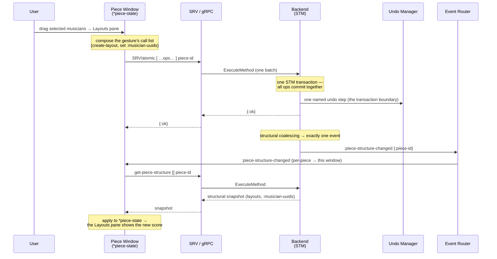
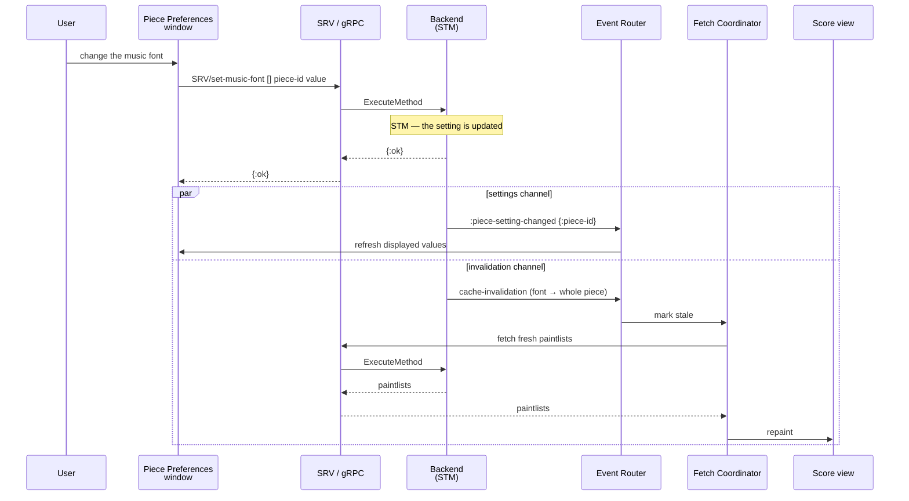

# ADR-0053: The Piece Window and Piece Preferences

## Status

Accepted

## Table of Contents

- [Context](#context)
- [Decision](#decision)
  - [1. The window is the piece's manifestation](#1-the-window-is-the-pieces-manifestation)
  - [2. Direct manipulation, not modes or dialogs](#2-direct-manipulation-not-modes-or-dialogs)
  - [3. Anatomy: the two panes](#3-anatomy-the-two-panes)
  - [4. Drag-and-drop across the workspace](#4-drag-and-drop-across-the-workspace)
  - [5. The window title](#5-the-window-title)
  - [6. Piece Settings: the Piece Preferences window](#6-piece-settings-the-piece-preferences-window)
  - [7. Everything under undo/redo](#7-everything-under-undoredo)
- [Sequence Diagrams](#sequence-diagrams)
- [Rationale](#rationale)
- [Consequences](#consequences)
- [Related Decisions](#related-decisions)

## Context

The Piece Window is Ooloi's central workspace: the place where a piece is assembled, where its musicians and layouts are arranged, and from which its scores and parts are opened. Most of a working session happens here. Yet the window has had no single architectural home — its behaviour was implied across a dozen decisions, each contributing a fragment (the pieces' structure, undo, settings, collaboration, the rendering boundary, the UI specification format, change detection) without any one of them describing the window whole.

This ADR is that description. It states what the window *is*, what it shows, how each gesture within it reaches the backend, how its title behaves, how a piece's own settings are edited, and how everything done in it is undoable. The window is specified here as the destination — the finished workspace — in the present tense, as invariants, not as a sequence of steps towards it.

Foundations this builds on:

- **[ADR-0040](0040-Single-Authority-State-Model.md)** / **[ADR-0038](0038-Backend-Authoritative-Rendering-and-Terminal-Frontend-Execution.md)** — the piece exists only on the backend and the frontend is terminal; the window shows and manipulates state it does not own.
- **[ADR-0022](0022-Lazy-Frontend-Backend-Architecture.md)** / **[ADR-0031](0031-Frontend-Event-Driven-Architecture.md)** — an event names what is stale, not a delta; per-piece events are routed to the piece's window.
- **[ADR-0052](0052-Change-Detection-and-Event-Generation.md)** — how a backend mutation becomes the single `:piece-structure-changed` event the window consumes, and the structural projection it refetches.
- **[ADR-0042](0042-UI-Specification-Format.md)** — the UI specification format, the declarative window pipeline, and the title-decorator and modal machinery the window is built from.
- **[ADR-0016](0016-Settings.md)** / **[ADR-0043](0043-Frontend-Settings.md)** — piece settings, and the frontend settings window whose interface the Piece Preferences window mirrors.
- **[ADR-0015](0015-Undo-and-Redo.md)** — backend undo/redo, one stack per piece.
- **[ADR-0011](0011-Shared-Structure.md)** / **[ADR-0012](0012-Persisting-Pieces.md)** — the piece as a pure tree of musicians and layouts, and its UUID identity.

## Decision

### 1. The window is the piece's manifestation

A Piece Window is a live view of, and a workspace over, one piece. The piece exists only on the backend ([ADR-0040](0040-Single-Authority-State-Model.md)); the window holds no authoritative piece state of its own. What it shows is a projection of backend state — the structural snapshot ([ADR-0052](0052-Change-Detection-and-Event-Generation.md) §3a) for its panes, paintlists ([ADR-0038](0038-Backend-Authoritative-Rendering-and-Terminal-Frontend-Execution.md)) for the scores and parts opened from it — refetched whenever the backend reports that projection stale. Every edit the user makes is an accepted operation submitted to the backend, never a local mutation the backend later reconciles: there is nothing to reconcile, because the window never held a competing copy.

The litmus test of [ADR-0038](0038-Backend-Authoritative-Rendering-and-Terminal-Frontend-Execution.md) governs the window as it governs rendering — discard the window entirely, rebuild it from backend state, and the result is identical. The window is fully recomputable from model and layout and introduces no semantic state of its own. It decides nothing about the piece; it presents what the backend has decided, and turns the user's gestures into operations the backend will decide upon.

### 2. Direct manipulation, not modes or dialogs

The window is operated by direct manipulation: the user drags, drops, clicks, and edits in place. It has no application modes — no state in which the same gesture means different things — and it opens a modal dialog only to confirm an irreversible loss, never to gather routine input.

This is a deliberate reversal of the older style in which arranging a score means working through a nested sequence of modal dialogs, and in which the meaning of a click depends on which tool or mode happens to be active. That style pushes the program's state machine onto the user, who must hold it in the head; it is the source of mode errors, where the correct gesture in the wrong mode does the wrong thing; and each dialog interrupts the work to ask a question out of its context. Direct manipulation removes that burden. Assembling a piece — adding a musician, giving it an instrument, placing it in a score, extracting its part — is a matter of dragging visible things onto visible places and seeing the result at once. The structure is edited where it is shown, in the panes that show it.

Inline editing displaces the settings-dialog habit as well: a musician's or a staff's definitional fields are edited in the pane, in place, rather than in a window that opens over the work and must be dismissed before the work resumes. The only dialogs the window raises are the confirmations of destructive acts (§4) and the Piece Preferences window (§6), and the latter is a calm, non-blocking surface rather than a modal interruption.

### 3. Anatomy: the two panes

A Piece Window is a `BorderPane`: a `SplitPane` fills its centre and a button bar sits along the bottom. The split pane holds the window's two panes — **Musicians** on the left, **Layouts** on the right.

The window is built from a pure spec function and the declarative window pipeline ([ADR-0042](0042-UI-Specification-Format.md)). `piece-window-spec` is a pure function of the window's state returning the cljfx description of the BorderPane, its two panes, and the button bar; `show-piece-window!` publishes one `:window-open-requested` event carrying that spec function, the window's event handler, and its state atom, and the UI Manager's pipeline does the rest — renderer, mounting, registration, locale and theme reactivity, geometry persistence, and teardown. Each call opens an independent window with isolated state, so any number of pieces are open at once. The window's lifecycle hooks carry what the declarative keys cannot express: `:window/on-open` and `:window/on-close` subscribe and unsubscribe it from its piece's backend events ([ADR-0031](0031-Frontend-Event-Driven-Architecture.md)), and `:window/on-close-request` intervenes when the window is closed over an unsaved, unnamed piece, so the close can prompt to save and be cancelled.

**The Musicians pane** shows the piece's musicians, top to bottom, each an openable pane over its instruments and their staves. A musician, an instrument, or a staff is edited in place: opening it reveals its definitional fields — name, short name, transposition, ranges, clefs — edited inline (§2), never in a separate dialog.

**The Layouts pane** shows the piece's layouts, its scores and parts. Each Layout carries **`:musician-uuids`**, an ordered vector of the UUIDs of the musicians it renders; the pane reads that vector to draw each layout's contents in order. A layout listing many musicians is a score; a layout listing one is a part; the distinction is the length of the vector, not a separate kind of thing. Clicking a musician shown within a layout selects that musician and flips open its editor in the Musicians pane — the same select-and-open interaction the Instrument Library uses for its instruments, over the shared selection model (§4). The Layouts pane is a second, layout-oriented view onto the same musicians the Musicians pane shows; it never holds a copy of them.

**The button bar** carries the window's actions, among them the button that opens this piece's Preferences window (§6).

### 4. Drag-and-drop across the workspace

Every structural edit in the window is a drag, a drop, or a deletion. The gestures form a small, uniform grammar; what a drop does is determined by what is dragged and where it lands.

| Drag | Onto | Result |
|---|---|---|
| An Instrument Library instrument | empty space in the Musicians pane | A new Musician is created, wrapping a copy of the instrument |
| An Instrument Library instrument | an existing Musician | The instrument is added to that Musician as a doubling |
| An instrument dragged out of a Musician, with the clone modifier held | empty space in the Musicians pane | A new Musician is created, wrapping a copy of that instrument |
| A Musician, with the clone modifier held | the Musicians pane | The whole Musician is cloned — a second musician with the same instruments and freshly regenerated structural ids |
| A Musician | elsewhere within the Musicians pane | The musician is reordered |
| One or more Musicians | empty space in the Layouts pane | A new Layout is created whose `:musician-uuids` are exactly the dragged musicians — many make a score, one makes a part |
| A Musician | a position within an existing Layout | The musician's uuid is inserted into that layout's `:musician-uuids` at the drop position |
| _(double-click)_ | a Layout | The layout's own window opens, showing its score or part |

**Move and copy.** The transfer mode follows the platform convention, carried by JavaFX's `TransferMode/COPY_OR_MOVE` so the operating system supplies the drag cursor that distinguishes the two. A plain drag **moves**: it reorders within a pane, or assigns a musician to a layout — the musician stays where it is and the layout gains a reference to it. A drag with the clone modifier held (⌥ on macOS, Ctrl elsewhere) **copies**: it clones the dragged entity, regenerating the structural ids of the copy. The one drag that is always a copy, whatever the modifier, is a drag out of the Instrument Library: the library is global and authoritative ([ADR-0045](0045-Instrument-Library.md)), a catalogue the piece copies from rather than a container it draws from, so dropping a library instrument always leaves a fresh copy in the piece and never depletes the library.

**Shared selection and drag infrastructure.** Selection and drag-and-drop are shared infrastructure, not per-pane code. The Instrument Library and both piece-window panes use the same openable-pane component — its drag-over event filter and its selection support — and the same selection model, so a multi-selection is assembled in a pane and dragged as a unit (all of a piece's musicians selected and dragged to the Layouts pane at once), and clicking a selectable entity anywhere selects it and opens its editor in place. Selection-on-drag holds throughout: beginning a drag on an unselected entity selects it first.

**References, not copies.** Because a layout holds `:musician-uuids` — references at musician granularity, never copies — the two panes cannot diverge. Adding an instrument to a musician, a doubling, appears in every score and part that lists that musician with no further edit, and renaming a musician renames it wherever it appears; reordering within one layout, by contrast, touches only that layout's vector. The Musicians pane owns the musicians; the Layouts pane composes them by reference.

**One gesture is one transaction.** Every gesture above is a single atomic operation on the piece. The window does not stream a gesture to the backend as separate edits and leave the backend to infer their grouping; it composes the gesture itself into an explicit list of backend calls and submits that list as one `SRV/atomic` batch — a vector of `{:method-name :vpd :piece-id :parameters}` operations executed inside one backend STM transaction. Dragging several musicians onto the Layouts pane to make a score is therefore not several operations but one: the window builds the call list (create the layout, set its `:musician-uuids`), submits it once, and the backend commits it once. This differs from how the Instrument Library edits its catalogue, where the backend derives the effective change from a submitted new version ([ADR-0045](0045-Instrument-Library.md)); the Piece Window knows the calls a gesture comprises and groups them itself.

That single transaction yields, by [ADR-0052](0052-Change-Detection-and-Event-Generation.md), exactly one `:piece-structure-changed` event for the piece — its structural coalescing scope collapses the transaction's changes to one event — delivered per-piece to this window, which refetches the structural snapshot and re-renders. And by [ADR-0015](0015-Undo-and-Redo.md) the same transaction boundary is one named undo step. One gesture is one transaction, one event, one refetch, and one entry on the piece's undo stack.

**Destructive gestures are guarded.** Deletion is the one gesture that can lose work, and it alone is confirmed. Deleting a Layout, an Instrument, or a Musician that contains music raises a confirmation — the blocking OK/Cancel dialog `show-confirmation!` ([ADR-0042](0042-UI-Specification-Format.md), "Modal dialogs: one core, two entry points") — before the operation is composed; deleting one that contains no music, a freshly created musician or an empty layout, proceeds without a prompt. "Contains music" means there is musical content — measures with notes or rests — in the staves the entity owns, or, for a layout, in the staves of the musicians it references. The check itself is cheap: it is a bounded timewalk ([ADR-0014](0014-Timewalk.md)) over those staves whose transducer halts at the first musical item it discovers — a note, a rest, or anything else — so an entity that holds any content is settled by that first item rather than by traversing the rest. This early exit is inherent to the mechanism: the timewalker is a true push transducer, driving the reducing function as each item is discovered and stopping the traversal itself the moment that function returns `reduced`. Once confirmed, a deletion is an ordinary structural operation: one `SRV/atomic` batch, one event, one undo step, undoable like any other.

**A gesture is a network-transparent ACID transaction.** Because a gesture is one `SRV/atomic` batch, it is atomic, consistent, isolated, and durable — and it stays so across the network. When the window is a remote guest's, connected over gRPC to another Ooloi's backend ([ADR-0036](0036-Collaborative-Sessions-and-Hybrid-Transport.md)), the batch is still one transaction, executed on the host backend's STM exactly as a local batch is ([ADR-0046](0046-Reference-Passing-In-Process-Transport.md): the handler is identical across in-process and network transport). It is **not** two-phase-committed across machines, because there is nothing to commit across: Ooloi's backend is the single authority and its STM the single serialisation point ([ADR-0004](0004-STM-for-concurrency.md), [ADR-0040](0040-Single-Authority-State-Model.md)). What is distributed is the clients, not the state. No collaborator ever observes a partial gesture — half a score, or a musician added to a layout but not yet to the piece — and there is no last-write-wins reconciliation, because writes serialise through one STM rather than racing across many. This is the concrete editing surface of the model in which a piece is a database with a permanent identity ([ADR-0012](0012-Persisting-Pieces.md)) and distributed ACID access: a guest's drag-and-drop gesture is a transaction on that database, carried over gRPC and serialised with everyone else's.

### 5. The window title

A Piece Window's title is the piece's **display name**, prefixed to show two pieces of session state.

The display name tracks the piece. It is the piece's `:title` when the piece has one, set as raw text and identical in every locale — a piece named "Sonata" reads "Sonata" under any interface language, because the name is user data rather than a translatable interface string ([ADR-0039](0039-Localisation-Architecture.md)). Failing a title, it is the piece's recorded **filename** with its `.ooloi`/`.ool` extension stripped — the filename is external catalogue state surfaced into the structural projection as a virtual `:filename` field ([ADR-0052](0052-Change-Detection-and-Event-Generation.md) §3a). Failing both — a piece with neither a name nor a saved location — it is the localised fallback "Untitled". A watch on the window's state re-applies the title on open and on every `:piece-structure-changed` refetch, so setting the piece's title, or a first Save that records a filename, retitles the window live: an untitled piece becomes its filename stem the moment it is first saved.

The two prefix glyphs are applied through the generic `:window/title-decorators` mechanism ([ADR-0042](0042-UI-Specification-Format.md)): `●` when the piece is dirty, having unsaved changes (the dirty flag of [ADR-0052](0052-Change-Detection-and-Event-Generation.md) §5), and `⇄` when the piece is shared. When both apply, `●` comes first. A piece window is **shared** when the user is a remote guest — their frontend is connected to another Ooloi's backend, so every piece they see is the host's — or when the user is a host and at least one network guest has subscribed to this piece; a layout window is shared exactly when its piece is. This is the `piece-shared?` predicate — the reused guest-side `frontend-on-network?` test, or the host-side `piece-subscribed-by-network?` (a network guest carrying this piece in its subscriptions) — composing on the general `⇄` mechanism of [ADR-0036](0036-Collaborative-Sessions-and-Hybrid-Transport.md).

### 6. Piece Settings: the Piece Preferences window

Each piece carries its own settings — the configuration that travels with the piece: accidental behaviour, staff spacing, the music font, notehead mappings, and the rest. These are **piece settings** ([ADR-0016](0016-Settings.md)): declared on the backend with `defsetting`, held in the piece's STM-managed state, and — because the frontend reads no piece data directly ([ADR-0040](0040-Single-Authority-State-Model.md)) — reached only through the polymorphic API over gRPC. Piece settings live on the Piece, so their VPD is always `[]`:

```clojure
(SRV/get-keyless-accidentals [] piece-id)
(SRV/set-keyless-accidentals [] piece-id :all-except-repeated)
```

The **Piece Preferences window** presents these settings for one piece. At the level of interface it works exactly as the frontend application-settings window ([ADR-0043](0043-Frontend-Settings.md)) — the same declarative fields, the same reset-to-default affordances, the same inline validation and error styling — but where the app-settings window reads and writes a frontend atom, the Preferences window reads and writes the backend over `SRV/`. It is a normal managed window, not a modal interruption.

Two independent event flows keep the window and the score correct, and their separation is deliberate:

- When a piece setting changes on the backend, a **`:piece-setting-changed`** event is delivered to the piece's subscribers. An open Preferences window for that piece reacts by refreshing its displayed values, so a collaborator editing the same setting does not leave this window showing a stale one. This event, in itself, never triggers paintlist fetching.
- The **visual consequence** of a setting change travels separately, as ordinary cache-invalidation. Having changed the setting, the backend issues the invalidations the change entails, and those flow through the normal Fetch Coordinator pipeline ([ADR-0038](0038-Backend-Authoritative-Rendering-and-Terminal-Frontend-Execution.md), [ADR-0031](0031-Frontend-Event-Driven-Architecture.md)): changing the music font invalidates the whole piece and the score is recomputed, while changing one notehead mapping invalidates only the affected noteheads. The granularity is the backend's decision, carried as identifiers of what is stale, not as a delta ([ADR-0022](0022-Lazy-Frontend-Backend-Architecture.md)).

The settings event refreshes the settings *window*; the invalidation events refresh the *score*. Neither does the other's work.

### 7. Everything under undo/redo

Every edit made in the window is undoable, and undo belongs to the backend, not to the window. Piece undo/redo is Tier 1 backend undo ([ADR-0015](0015-Undo-and-Redo.md)): the backend keeps one undo/redo stack per piece, shared across every client subscribed to that piece, and broadcasts lightweight `:undo-state-changed` notifications when a stack changes. The window consumes undo state — it enables and labels its Undo and Redo affordances from those notifications — but it neither owns nor stores history.

Because a gesture is one transaction (§4), it is one undo step. The structural coalescing scope of [ADR-0052](0052-Change-Detection-and-Event-Generation.md) §4 and the undo grouping of [ADR-0015](0015-Undo-and-Redo.md) key on the same outermost-transaction boundary, so the multi-musician score of §4 is a single entry on the piece's undo stack, exactly as it is a single `:piece-structure-changed` event; undoing it removes the score in one step. Structural and content edits alike are grouped by that boundary, so "one gesture, one undo step" holds across the whole window.

## Sequence Diagrams

### A drag-and-drop gesture: one batch, one event, one undo step

Several musicians are dragged onto the Layouts pane to make a score. The window composes the gesture's backend calls, submits them as one `SRV/atomic` batch, and the transaction yields exactly one event and one undo step.



### A settings change: two channels, one for the window and one for the score

Changing the music font in the Piece Preferences window refreshes the settings window over one channel and recomputes the score over another, entirely separate one.



## Rationale

- **One manifestation, no local state.** Because the window owns no piece state, it inherits the stability of single authority: there is no reconciliation to get wrong, and the two panes cannot drift, since the Layouts pane references the musicians rather than copying them.
- **Direct manipulation over modes and dialogs.** Editing where things are shown removes the state machine the user would otherwise have to hold, and with it the class of mode errors; a modal appears only to confirm a loss.
- **One gesture, one transaction.** The window composing each gesture's call list and submitting it as one `SRV/atomic` batch is what makes a gesture atomic, undoable in a single step, and observed whole by every collaborator.
- **References at musician granularity.** Holding `:musician-uuids` on the layout, keyed to the musician and not to its instruments, is what makes a doubling or a rename propagate to every score and part for free.
- **Two channels for a setting.** Separating the settings-window refresh from the score's cache-invalidation keeps each event simple, and stops a settings change from being mistaken for a rendering fetch.

## Consequences

- Introducing `:musician-uuids` makes it a **structural** field of the Layout: it is kept by the structural projection and a write to it emits `:piece-structure-changed`, so the Layouts pane refetches when a musician is added to, removed from, or reordered within a layout ([ADR-0052](0052-Change-Detection-and-Event-Generation.md) §3a and §3b list it among the Layout's structural slots).
- Because layouts reference musicians by uuid, cloning a piece — Save As ([ADR-0051](0051-Filesystem-Operations-Real-and-Virtual.md)), which regenerates every structural identifier ([ADR-0012](0012-Persisting-Pieces.md)) — must **remap** each layout's `:musician-uuids` from the original musician ids to the regenerated ones, and deleting a musician must **prune** its uuid from every layout's vector. Both are maintenance obligations on the reference, specified at those operations and cross-referenced here.
- The Piece Preferences window and the application-settings window share their interface vocabulary ([ADR-0043](0043-Frontend-Settings.md)); the only difference is where the values live.
- Several piece and layout windows may be open over one piece at once; each subscribes to the same per-piece events and reads the same per-piece undo stack, and they stay consistent by refetching, never by messaging one another.

## Related Decisions

- [ADR-0004: STM for Concurrency](0004-STM-for-concurrency.md)
- [ADR-0011: Shared Structure](0011-Shared-Structure.md)
- [ADR-0012: Persisting Pieces](0012-Persisting-Pieces.md)
- [ADR-0014: Timewalk](0014-Timewalk.md)
- [ADR-0015: Undo and Redo](0015-Undo-and-Redo.md)
- [ADR-0016: Settings](0016-Settings.md)
- [ADR-0022: Lazy Frontend-Backend Architecture](0022-Lazy-Frontend-Backend-Architecture.md)
- [ADR-0031: Frontend Event-Driven Architecture](0031-Frontend-Event-Driven-Architecture.md)
- [ADR-0036: Collaborative Sessions and Hybrid Transport](0036-Collaborative-Sessions-and-Hybrid-Transport.md)
- [ADR-0038: Backend-Authoritative Rendering and Terminal Frontend Execution](0038-Backend-Authoritative-Rendering-and-Terminal-Frontend-Execution.md)
- [ADR-0040: Single Authority State Model](0040-Single-Authority-State-Model.md)
- [ADR-0042: UI Specification Format](0042-UI-Specification-Format.md)
- [ADR-0043: Frontend Settings](0043-Frontend-Settings.md)
- [ADR-0045: Instrument Library](0045-Instrument-Library.md)
- [ADR-0046: Reference-Passing In-Process Transport](0046-Reference-Passing-In-Process-Transport.md)
- [ADR-0051: Filesystem Operations, Real and Virtual](0051-Filesystem-Operations-Real-and-Virtual.md)
- [ADR-0052: Change Detection and Event Generation](0052-Change-Detection-and-Event-Generation.md)
