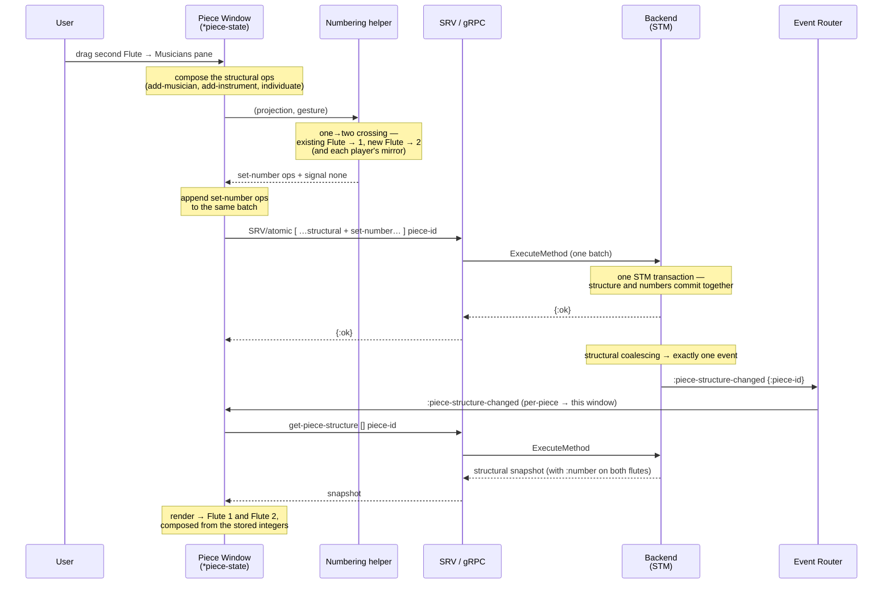

# ADR-0054: Automatic Semantic Numbering of Musicians and Instruments

## Status

Under implementation

## Table of Contents

- [Context](#context)
- [Decision](#decision)
  - [1. Numbering is automatic, and it stays out of the way](#1-numbering-is-automatic-and-it-stays-out-of-the-way)
  - [2. Two dimensions: the instrument axis and the musician axis](#2-two-dimensions-the-instrument-axis-and-the-musician-axis)
  - [3. When a number appears, and when it goes: the crossings and the freeze](#3-when-a-number-appears-and-when-it-goes-the-crossings-and-the-freeze)
  - [4. Discontinuities never block: fill the gap and say so](#4-discontinuities-never-block-fill-the-gap-and-say-so)
  - [5. Numbers are model state; the displayed name is composed](#5-numbers-are-model-state-the-displayed-name-is-composed)
  - [6. Numerals: three piece settings](#6-numerals-three-piece-settings)
  - [7. The doubling annotation](#7-the-doubling-annotation)
  - [8. Where it plugs in: the helper and the gestures](#8-where-it-plugs-in-the-helper-and-the-gestures)
- [Sequence Diagrams](#sequence-diagrams)
- [Rationale](#rationale)
- [Consequences](#consequences)
- [Related Decisions](#related-decisions)

## Context

Orchestral parts are numbered. There are two flutes and they are Flute 1 and Flute 2; there are eight horns and they run I to VIII. A player often plays more than one instrument — a *doubling* — and the doublings are numbered too, on a count of their own: a piece with a dedicated piccolo player and three flutes, the first of whom also plays piccolo, has **two** piccolos in it, and they are Piccolo 1 (the dedicated player) and Piccolo 2 (the first flautist's doubling). The number a player carries on one instrument does not predict the number they carry on another: the first flautist is Flute 1 and Piccolo 2 at once. This is not an edge case or an inconsistency to be tidied away — it is how scores have been numbered for as long as players have doubled, and it encodes real information about who plays what.

Setting this up by hand is tedious, and in the conventional workflow it is worse than tedious: numbering an instrument, renumbering a section when a player is added, keeping the doubling counts straight — these are spread across dialogs, property panels, and modes, and the burden of keeping them consistent falls on the user. It is exactly the kind of clerical bookkeeping that the Piece Window ([ADR-0053](0053-Piece-Window-and-Piece-Preferences.md)) is built to abolish: assembling a piece is dragging visible things onto visible places and seeing the result at once, not working through nested dialogs to tell the program what it could have worked out itself.

The Musician and Instrument models already carry the two fields this needs — a `:number` (a nilable positive integer) and a `:short-name` — on both records. What has been missing is the behaviour that fills `:number` in: nothing writes it yet. This ADR specifies that behaviour. It is deliberately *not* part of [ADR-0053](0053-Piece-Window-and-Piece-Preferences.md): that ADR describes the window, which "introduces no semantic state of its own" and "decides nothing about the piece," whereas numbering *does* decide something about the piece — it computes and writes each entity's number. Numbering is a semantic behaviour that the window's gestures *trigger*, and it belongs in its own decision.

## Decision

### 1. Numbering is automatic, and it stays out of the way

As the user assembles a piece by drag-and-drop — dragging an instrument from the Instrument Library, cloning a musician, dropping a doubling into a player — Ooloi numbers the musicians and instruments for them. The user writes no numbers, opens no numbering dialog, and enters no mode. The numbers simply appear, correct, as a consequence of the structural gesture the user already made, and the user goes on thinking about the music.

This is a frontend behaviour, not a backend one. **The API never renumbers anything of its own accord.** The polymorphic operations set and read `:number` when asked and do nothing more; a script, a plugin, or a collaborator writing through the API directly changes no numbers as a side effect. Numbering is what the Piece Window's *gestures* do — the frontend, having composed the structural edit a drop entails, also composes the `set-number` calls that edit's numbering entails, and submits them together. Everything downstream — the Piece Window's own panes, the engraved score, extracted parts — reads the numbers the gesture wrote; nothing recomputes them behind the user's back.

The governing principle is [ADR-0053 §2](0053-Piece-Window-and-Piece-Preferences.md)'s: direct manipulation, no modes, and no dialog raised "to gather routine input." Numbering is the same idea carried one step further — not merely *edited* without a dialog but *computed* without one, so that the correct numbers are a property of the drop rather than a task the drop leaves behind. It is domain knowledge doing the user's clerical work: musical all the way down, and quiet.

### 2. Two dimensions: the instrument axis and the musician axis

Numbering runs on two independent axes.

**The instrument axis is piece-wide, by name.** Every instrument that shares a `:name` is counted together across the whole piece, wherever it sits — a player's main instrument and another player's doubling of the same instrument are the same kind and share one count. Three flutes anywhere in the piece are Flute 1, 2, 3; the two piccolos of the introductory example — one a main instrument, one a doubling — are Piccolo 1 and Piccolo 2. The count is by the exact `:name`, and since an instrument's transposition lives *in* its name (the bundled library stores `"Horn in F"`, `"Horn in E♭"`, and so on as distinct names, [ADR-0045](0045-Instrument-Library.md)), a Horn in F and a Horn in D are different kinds and are never numbered together — which is the correct notational behaviour, obtained for free.

**The musician axis mirrors the main instrument.** A musician's displayed number is the number of its **main instrument** — the first (top) instrument in its `:instruments` vector, the one the following instruments are doublings of. It is not an independent count of same-named players. The dedicated piccolo player of the example is the *only* player whose main instrument is a piccolo, yet it is numbered Piccolo 1 — because there are two piccolo *instruments* in the piece and its main instrument is the first of them. So the musician follows its main instrument, and the two axes need not agree: the first flautist is the musician **Flute 1** (its main instrument is Flute 1) whose doubling is **Piccolo 2** (the second piccolo in the piece). The numbers in one dimension do not map onto the other, and the model does not force them to.

In the diagrams that follow, `>` marks a musician — its header line — and `-` an instrument within it. Each entity carries the number the automation assigns; how that number is composed into the visible label — Arabic or Roman, before or after the name — is the presentation concern of §6, so by default `Flute 1` is shown on screen as `1. Flute`. A dedicated piccolo player, with two flutes the first of which also plays piccolo, stands as:

```
> Piccolo 1
  - Piccolo 1
> Flute 1 (also Picc. 2)
  - Flute 1
  - Piccolo 2
> Flute 2
  - Flute 2
```

The piece holds two piccolos — one a main instrument, one a doubling — so they are Piccolo 1 and Piccolo 2. The first flautist is Flute 1 on its own axis while doubling Picc. 2 on the other, because the dedicated player already holds Piccolo 1: the two counts are independent, and neither predicts the other.

A kind that appears only once takes no number: a lone flute is "Flute", a single cor anglais is "Cor anglais", each with `:number` nil. Numbering is what distinguishes members of a set of like instruments; with only one, there is nothing to distinguish.

### 3. When a number appears, and when it goes: the crossings and the freeze

The whole of numbering is governed by one invariant and two crossings.

**The invariant: a number, once set, is never silently changed.** Automatic numbering only ever writes a number onto something that had none — it assigns to `nil`. It never rewrites an existing non-nil number to a different value, whether that number was placed by the automation or by the user's own hand. There is no lock and no record of who set a number; the protection is simply that the automation writes to `nil` and nowhere else. This is what lets the user override any number and trust it to stand.

**The first crossing — one becomes two — is the only time an existing object is numbered.** Adding a second instrument of a name where exactly one existed, unnumbered, numbers *both*: the pre-existing one takes 1, the newcomer takes 2. Before, there was one of a kind and nothing to distinguish; after, there are two, and both must be told apart. This is a first assignment to each (each was `nil`), not a rewrite, so the invariant holds. Every later addition to an already-numbered kind touches nothing existing — the newcomer alone takes a number (§4).

A lone flute carries no number:

```
> Flute
  - Flute
```

Drag in a second, and the crossing numbers both — the one already there takes 1, the newcomer 2:

```
> Flute 1
  - Flute 1
> Flute 2
  - Flute 2
```

**The second crossing — two becomes one — is the only time a number is removed.** Removing an instrument so that exactly one of its name remains clears that survivor's number back to `nil`: the lone survivor of a section reverts to the bare name. This is the mirror of the first crossing, and it is the sole exception to the invariant — the one case in which the automation changes an existing number, and it changes it only to `nil`. Removing an instrument that leaves *two or more* of its name renumbers nothing: the remaining numbers stand exactly as they were, holes and all.

The reverse empties a section back out. Delete one of those two flutes and a single flute remains, which loses its number and reverts to the bare name:

```
> Flute
  - Flute
```

The musician axis follows from the instrument axis by the mirror of §2: whenever a crossing sets or clears the number of an instrument that is some musician's *main* instrument, that musician's number is set or cleared to match. A doubling's number never moves its player's number — the player mirrors only its first instrument.

Because these are the only writes numbering makes, it is inherently self-limiting. It assigns to the unnumbered and clears the last survivor, and between those two events it leaves every number alone.

**What the gesture creates enters unnumbered.** The freeze draws its line at the gesture's edge: it protects what existed *before* the gesture, never what the gesture itself makes. An entity a gesture creates — an instrument dropped from the library, or a cloned musician or instrument — carries no number into the pass. The drop and clone composers set its `:number` to `nil` at creation, just as a clone copies its `:name` once rather than binding it. So a cloned `Flute 1` enters the pass unnumbered and the pass assigns it the next free number, rather than carrying a second `1` that the freeze could then never repair; and a library instrument a user happened to number does not smuggle that number into the piece. What existed is frozen; what is created is the pass's to number, and the invariant's "writes only to `nil`" stays literally true.

### 4. Discontinuities never block: fill the gap and say so

Freezing existing numbers means the numbering can become discontinuous — delete Flute 2 from a section of three and 1 and 3 remain, with a hole at 2. The automation neither closes such holes by renumbering (the invariant forbids it) nor stops to ask the user what to do. It acts deterministically and *tells* the user what happened, through the ordinary notification surface ([ADR-0043](0043-Frontend-Settings.md)) — never a modal, never a question that blocks the gesture.

**On an addition, the newcomer takes the smallest available number.** Not "the next number" — the smallest positive integer not currently in use for that name. Adding a flute to a section numbered 1, 3 gives the newcomer **2**, closing the hole; adding one to a section numbered 1, 4 also gives **2**, leaving the hole at 3 still open. The gesture always produces a valid, deterministic result, and existing numbers are never touched — only the newcomer fills the slot.

**A notification reports the outcome, coloured by it.** The notification is not a nag on every drop; it fires only when the numbering was non-standard, and its colour is the news:

- **A green notification** when an addition closes the last remaining hole, leaving the kind fully consecutive again — 1, 3 becomes 1, 2, 3. The numbering is whole once more, and the user is told so.
- **A warning notification** when the kind is left or made discontinuous — its numbers no longer exactly 1..n. An addition that fills one hole but leaves another (1, 4 becomes 1, 2, 4); a deletion that opens an interior hole (1, 2, 3 becomes 1, 3); or a deletion of the lowest, so the run no longer starts at 1 (1, 2, 3 becomes 2, 3).
- **Silence** when nothing is notable — a plain append onto a kind already 1..n, a deletion of the *highest* that leaves the rest exactly 1..n (1, 2, 3 becomes 1, 2), and the two-becomes-one clearing (which leaves a single unnumbered instrument, not a hole).

Green comes only from a gap-closing addition; a deletion can never produce it, because a deletion never renumbers and so can never close a hole. A kind is *consecutive* precisely when its numbered instruments are exactly 1..n (n their count); a kind with no numbers at all is trivially so, which is why first numbering a section — one becoming two — is silent rather than green. "Closed" means *fully* consecutive: an addition that closes one hole while another remains is a warning, not a green, because the kind is still discontinuous.

**A gesture can touch more than one kind** — a musician cloned with its doublings, a multi-selection deleted across kinds — and it still raises **one** notification, never one per kind. The per-kind signals combine by severity, `open` outranking `closed` outranking `none`: if any affected kind is left discontinuous the gesture warns; failing that, if any was made whole it is green; failing both, it is silent. The message names each kind that contributed a non-`none` signal — *"Piccolo numbering has a gap; Flute numbering is complete again"* — so one line reports the whole gesture. A twelve-musician delete is one notification, not twelve.

### 5. Numbers are model state; the displayed name is composed

The `:number` a musician or instrument carries is authoritative model state, held on the record and written by `set-number`. It is emphatically **not** a display value derived on the fly in one window. Both `:number` and `:short-name` are structural slots of their (structural) records, so writing one emits `:piece-structure-changed` and appears in the structural projection ([ADR-0052 §3](0052-Change-Detection-and-Event-Generation.md)) — which is precisely why a gesture's `set-number` calls reach the Piece Window's panes at all, through the ordinary change-detection-then-refetch cycle, with nothing decorated onto the projection by hand.

Storing the number in the model, rather than deriving it for one view, is what lets *every* consumer read the same number. The Piece Window renders it in its tree; the engraved score renders it in staff labels and part titles — and the score is composed by the backend into authoritative paintlists ([ADR-0038](0038-Backend-Authoritative-Rendering-and-Terminal-Frontend-Execution.md)), where "engraving logic lives in one place only" and the frontend never reinterprets. Pages and systems draw the number from the model; they do not, and must not, depend on a string some editor happened to build. A number that lived only in a Piece Window derivation would be invisible to the very output the piece exists to produce.

The **displayed name** — "1. Flute", "3. Trompete in B♭" — is not stored anywhere. It is composed on demand from the integer, the entity's name, and the numeral settings (§6), by a single pure function that every surface calls: the Piece Window for its tree, the backend for its paintlists, so the two cannot diverge. This obeys the rendering litmus of [ADR-0038](0038-Backend-Authoritative-Rendering-and-Terminal-Frontend-Execution.md): discard every composed name, recompute from the stored integers and names, and the result is identical. The model holds numbers; the surfaces render strings.

### 6. Numerals: three piece settings

How a number joins its name to make a displayed label is governed by three piece settings ([ADR-0016](0016-Settings.md)), declared with `defsetting` and read over the polymorphic API like any other piece setting. They control presentation only — the stored `:number` is always a plain integer.

- **Numeral form** — Arabic or Roman. Default Arabic.
- **Placement** — the numeral precedes or follows the name. Default precede.
- **Arabic period** — whether an Arabic numeral is followed by a full stop and a space. Applies to Arabic only (Roman numerals take no period). Default on.

The numeral wraps the **whole** name, transposition qualifier included — never the middle of it. With the defaults (Arabic, precede, period on) a third trumpet in B♭ is `3. Trompete in B♭`; set to Roman and follow it is `Trompete in B♭ III`; Roman and precede gives `III Trompete in B♭`. The full stop is the Arabic-precede convention alone; every other combination separates numeral and name with a single space.

Which name the numeral wraps depends on where the label appears, and this is fixed, not a setting: the **main instrument** — the musician's header, its own row — is always shown in **full** form, from `:name`; the **doublings list** (§7) is always shown in **short** form, from `:short-name`, for compactness. So the same third trumpet reads `3. Trompete in B♭` where it is a main instrument and `3. Tr. in B♭` where it appears as another player's doubling. The numeral settings apply identically to both; only the choice of name string differs.

Counting and identity always key on `:name`, never on the composed string or the short name: `:name` groups a kind and counts it (§2), while `:short-name` and the numeral settings only decide how the resulting number is shown.

### 7. The doubling annotation

A musician that plays more than one instrument is shown, in the Piece Window, with a muted parenthetical after its name naming what it doubles on, in short-name form — a flautist who also plays piccolo reads `Flute (also Picc.)`:

```
> Flute (also Picc.)
  - Flute
  - Piccolo
```

Where the instruments are numbered, the annotation carries their numbers too — `Flute 1 (also Picc. 2)`. The list is not a stored field — it *is* the musician's instruments after the first, `(rest (:instruments musician))`, rendered in short-name form through the same composer as everything else, so the doubling numbers (`Picc. 2`, `Tr. in B♭ 3`) fall out with no special handling. It is styled like an instrument's comment — quiet, secondary to the name — and it never touches `:name`, which stays clean for the identity comparison that numbering depends on.

The connector word is short and localised. In English it is **also** — "Flute 1 (also Piccolo 2)" — chosen over a longer phrase for compactness, and it reads naturally in every language: Italian *anche*, German *auch*, Swedish *även*, and so on. It is an ordinary interface string, a `tr` key translated across all of Ooloi's interface locales, and it is **not** confined to the four languages the instrument library ships names in ([ADR-0045](0045-Instrument-Library.md)). The connector therefore follows the *interface* language while the instrument names follow the *score* language, and the two need not agree — a Swedish interface over Italian instrument names reads `Flauto (även Ott.)`. That mixture is acceptable because the annotation is a Piece Window editing convenience; the engraved score expresses doublings in its own way (instrument-change indications in the music, the front-of-score instrumentation list), not by this header suffix.

### 8. Where it plugs in: the helper and the gestures

Numbering is a small amount of code reached from a few places. One shared helper computes it; the gestures that change instrumentation call it.

**The helper is a pure function of the projection and the gesture.** Given the piece's current structural projection and the structural edit about to be made, it returns the `set-number` operations that edit implies — integers assigned, and `nil`s cleared, across the affected instruments and their players' main-instrument mirror — together with the discontinuity signal for the notification: none, closed (green), or open (warning). **The pass is scoped to the *affected kinds*** — the `:name`s the gesture inserts or removes — and touches nothing outside that set: an instrument of an untouched kind is never read or written, whatever its number, and the mirror is set only for a musician whose main instrument's number this pass changed *and whose main the gesture did not replace* (the note on a new main, below). This scoping, not any after-the-fact diff, is what upholds the §3 freeze: a lone instrument a user numbered by hand, or an unnumbered pair a script assembled, survives a gesture on another kind untouched. It returns *only* number operations; it builds no names, because names are composed downstream by the surfaces (§5). Keeping it one function is deliberate: numbering must not be reimplemented per gesture.

**The gestures append its output to their own atomic batch.** The Piece Window already composes each structural gesture into a single `SRV/atomic` batch of operations submitted as one backend transaction ([ADR-0053 §4](0053-Piece-Window-and-Piece-Preferences.md)). The numbering `set-number` operations ride in that same batch. The handlers that add, clone, or delete instruments and musicians — `handle-il-drop!`, `handle-instruments-clone!`, `handle-musicians-clone!`, and `handle-delete!`, through the composers they already call (`il-drop-on-musicians-whitespace->atomic-ops`, `add-instruments-to-musician->atomic-ops`, `pw-instruments-drop-on-musicians-whitespace->atomic-ops`, `copy-musicians->atomic-ops`, `delete-instruments->atomic-ops`, `delete-musicians->atomic-ops`) — call the helper and fold its operations in before submitting. Gestures that change no instrumentation — reordering musicians or instruments, layout edits, staff edits — do not call it.

Because the numbering rides the gesture's batch, it inherits every property of that batch: one transaction, one `:piece-structure-changed` event, one undo step ([ADR-0053 §4](0053-Piece-Window-and-Piece-Preferences.md), [ADR-0052 §4](0052-Change-Detection-and-Event-Generation.md)). Undoing a drop undoes its numbering in the same step; there is no second transaction and no separate history entry. And because the numbers are written *by* the gesture and only *read* back through the refetch, the display never writes — there is no reactive path from projection to `set-number`, and so no possibility of the feedback loop a projection-driven renumbering would risk.

One consequence of the mirror being one-directional (a musician follows its main instrument, §2): reordering a musician's instruments so that a *different* one becomes the main instrument does **not** re-derive the musician's number — reorder is not a numbering gesture. The musician's number, like its name, was set when it was made and stands until the user changes it. This matches the existing behaviour by which a musician's `:name` is copied from its first instrument at creation and not re-copied on reorder.

**Installing a new main never moves the musician's number.** The same holds for any gesture that puts a *different* instrument at the top of a musician's list — a doubling dropped at index 0, or a deletion that promotes a doubling to main. The mirror propagates a number change on a musician's *existing* main only; a main newly installed over a previous one does not move the musician's number, just as it does not move its name — otherwise a drop at the top that happened to cross one→two on the new kind would overwrite a user-set musician number, the freeze leaking back through a side door. A newly created musician is not an exception: its main replaces nothing, so it mirrors its main, which is how a new player is numbered in the first place. The helper tells the two apart by identity — it mirrors a musician when the gesture left its main the *same* instrument (or the musician is new) and this pass changed that instrument's number.

## Sequence Diagrams

### Dropping a second flute: numbering rides the gesture

A piece holds one flute, unnumbered. The user drags a second flute from the Instrument Library onto empty space in the Musicians pane. The gesture creates the new musician *and* crosses one-into-two, so the helper returns the number operations that number both flutes, and they ride the same batch. One transaction, one event, one refetch.



## Rationale

- **The hard work belongs to the software.** Numbering musicians, instruments, and doublings correctly — across the two axes, honouring the freeze — is exactly the clerical labour that the tool should absorb so that the user does not. Doing it automatically during the drop the user already made is the least intrusive place to do it, and the most musical.
- **Quiet by default, and never boxed in.** The feature adds no mode, no dialog, and no question that blocks the work. In the common case it is silent; in the rare discontinuous case it acts deterministically and reports through a non-blocking notification. This is [ADR-0053 §2](0053-Piece-Window-and-Piece-Preferences.md)'s direct-manipulation principle extended from editing to computation — the software recedes so the user can attend to the music, not to bookkeeping.
- **Computed on the input side, so it is atomic and cannot loop.** Composing the `set-number` operations into the gesture's own batch makes numbering part of one transaction, one event, and one undo step, and leaves the display a pure reader of the result. A projection-driven renumbering would instead write in reaction to the very event a write produces, and would have to be proven convergent to avoid an unbounded loop; the input-side design has no such path.
- **Stored in the model, so every surface agrees.** The number is real state, not a view's derivation, because the engraved score and extracted parts must render it as surely as the Piece Window does, and they read the model. One shared composer turns the stored integer into the shown label everywhere, so the tree and the page cannot disagree.
- **Freezing respects the user.** Because the automation only ever numbers the unnumbered and clears the last survivor, a number the user sets by hand is safe — the automation has no authority to overwrite it. Numbering assists; it does not seize control.

## Consequences

- **Three new piece settings** — numeral form, placement, and the Arabic period — are added with `defsetting` ([ADR-0016](0016-Settings.md)) and, being user-visible, carry translated labels across every interface locale. Their defaults render `3. Trompete in B♭`.
- **The numbering helper is a new shared function**, and the composed-name function it feeds is shared between the Piece Window and the backend's paintlist generation, so both render numbers identically. Neither introduces a stored composed string; both derive from the model.
- **The Piece Window's add, clone, and delete handlers gain a call to the helper** and fold its operations into their existing `SRV/atomic` batch. No new event, transaction, or undo boundary is created — numbering reuses the gesture's.
- **The `:number` and `:short-name` fields already exist** on both Musician and Instrument as structural slots, so their writes are detected and projected by construction ([ADR-0052 §3](0052-Change-Detection-and-Event-Generation.md)); no model or change-detection change is required.
- **Numbering is a property of Piece Window gestures, not of the model.** A piece edited through the API alone — by a script, a plugin, or a collaborator not driving these gestures — is not renumbered, consistent with the API never renumbering of its own accord. Numbers written by a gesture are, of course, shared with every collaborator through the ordinary projection, like any other structural state.
- **The doubling connector is a normal interface string**, translated across all interface locales and independent of the instrument-name languages, so an interface language and a score language that differ produce a mixed but acceptable annotation in the Piece Window only.
- **No modal is introduced.** The discontinuity case is handled by a deterministic result and a non-blocking notification, so [ADR-0053 §2](0053-Piece-Window-and-Piece-Preferences.md)'s policy — modals only to confirm an irreversible loss — stands unamended.
- **A concurrent same-kind drop can duplicate a number — a documented consequence, not a bug to code around.** When two collaborators add the same kind at the same moment, each computes its number against a pre-transaction state that lacks the other's addition, so both can land the same value. The freeze forbids the self-healing global renumber that would repair this automatically — it would rewrite user-set numbers — so the duplicate is left for a user to correct, protected like any other number once set. This is the price of the override guarantee, and a small one: simultaneous same-kind drops on one piece are rare, and the outcome is a visible, correctable duplicate, never lost or corrupted state.

## Related Decisions

- [ADR-0012: Persisting Pieces](0012-Persisting-Pieces.md)
- [ADR-0016: Settings](0016-Settings.md)
- [ADR-0023: Shared Model Contracts](0023-Shared-Model-Contracts.md)
- [ADR-0031: Frontend Event-Driven Architecture](0031-Frontend-Event-Driven-Architecture.md)
- [ADR-0038: Backend-Authoritative Rendering and Terminal Frontend Execution](0038-Backend-Authoritative-Rendering-and-Terminal-Frontend-Execution.md)
- [ADR-0039: Localisation Architecture](0039-Localisation-Architecture.md)
- [ADR-0040: Single Authority State Model](0040-Single-Authority-State-Model.md)
- [ADR-0042: UI Specification Format](0042-UI-Specification-Format.md)
- [ADR-0043: Frontend Settings](0043-Frontend-Settings.md)
- [ADR-0045: Instrument Library](0045-Instrument-Library.md)
- [ADR-0052: Change Detection and Event Generation](0052-Change-Detection-and-Event-Generation.md)
- [ADR-0053: The Piece Window and Piece Preferences](0053-Piece-Window-and-Piece-Preferences.md)
