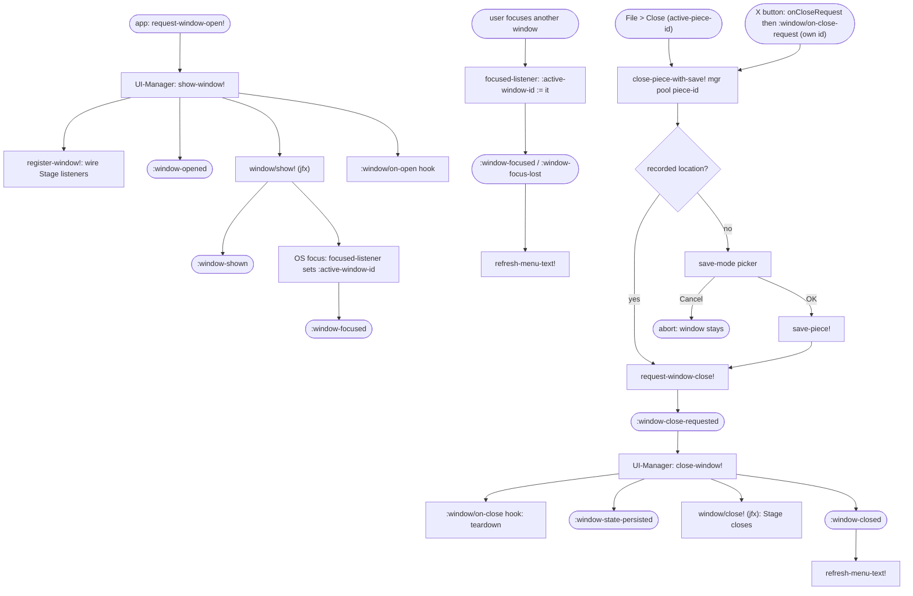

# Ooloi Frontend Architecture Guide

> Together with the [Polymorphic API Guide](POLYMORPHIC_API_GUIDE.md) and the [Timewalking Guide](TIMEWALKING_GUIDE.md), this document forms a central gateway into Ooloi's architecture. The Polymorphic API Guide explains how musical structures are exposed and manipulated through Ooloi's polymorphic command surface. The Timewalking Guide explains how musical structure is traversed and transformed. This guide explains how those structures become an interactive, distributed, GPU‑accelerated application.
>
> This guide walks through the Ooloi frontend architecture: its principles, boundaries, event flow, rendering model, window lifecycle, settings system, localisation discipline, and collaboration context handling.
>
> It is written for architects and experienced developers — including those who are not Clojure programmers — who genuinely want to understand how Ooloi works from the inside. It assumes technical maturity and does not dilute architectural ideas, but it also does not retreat into abstraction. The aim is clarity without distance, and precision without coldness.
>
> This guide is a structural and conceptual exploration of the frontend architecture. It complements the formal ADRs and plugin documentation by focusing on how the pieces fit together, how they behave in practice, and what kind of discipline makes them cohere. Low‑level details are defined formally in the relevant ADRs, which are linked throughout; here we stay at the structural level and examine how those formal decisions become a working, coherent system.

---

## Table of Contents

1. [The Frontend Is Not a Viewer](#1-the-frontend-is-not-a-viewer)
2. [Opening a Window (Minimal Example)](#2-opening-a-window-minimal-example)
3. [The Window Lifecycle Invariant](#3-the-window-lifecycle-invariant)
4. [Pure Builders and Materialisation](#4-pure-builders-and-materialisation)
   - [4.1 Two-Level Abstraction](#41-two-level-abstraction)
   - [4.2 Why This Separation Exists](#42-why-this-separation-exists)
   - [4.3 cljfx Spec Over Java Interop](#43-cljfx-spec-over-java-interop)
   - [4.4 Custom cljfx Component Functions](#44-custom-cljfx-component-functions)
   - [4.5 Per-Window Reactive Renderer](#45-per-window-reactive-renderer)
   - [4.6 Style Classes — The setAll() Trap](#46-style-classes--the-setall-trap)
5. [Event Architecture](#5-event-architecture)
6. [The JAT Boundary](#6-the-jat-boundary)
7. [Rendering Pipeline](#7-rendering-pipeline)
8. [Fetch Coordination and Viewport Logic](#8-fetch-coordination-and-viewport-logic)
9. [Localisation Architecture](#9-localisation-architecture)
10. [Settings System](#10-settings-system)
11. [Collaboration and Transport Switching](#11-collaboration-and-transport-switching)
12. [Testing Model](#12-testing-model)
    - [12.5 Test Isolation Infrastructure](#125-test-isolation-infrastructure)
13. [Architectural Invariants](#13-architectural-invariants)
14. [Concluding Perspective](#14-concluding-perspective)

---

## 1. The Frontend Is Not a Viewer

In architectural terms, this type of frontend is sometimes called “terminal.” That word can sound dismissive, as if the frontend were merely a thin wrapper around something more important. That is not what it means here.

Terminal means that the frontend stands at the end of a decision pipeline whose authority resides elsewhere.

Ooloi’s backend is the single semantic authority for musical state. It owns pitch representation, time signatures, key signatures, remembered alterations, layout computation, and the full rendering pipeline. When a piece changes, the backend determines what that change *means* and how it affects the structure of the score.

The frontend executes those decisions — and execution in this context is serious work.

The frontend is a computationally strong system in its own right. It:

* Maintains multi‑layer caches of rendering data.
* Builds GPU command buffers for complex vector graphics.
* Performs parallel computation for picture construction and data preparation.
* Transforms UI gestures into granular backend API calls.
* Manages distributed event streams and collaboration state.

It may process vast amounts of data. It may parallelise aggressively. It may prioritise, batch, and schedule work. None of this makes it authoritative — but it does make it powerful.

Authority, in Ooloi, is defined by who decides the shape of musical truth.

The frontend does **not** hold semantic authority.

It may construct local copies of musical data, transform them, prepare command payloads, and batch mutations in order to interact smoothly with the backend. It may mutate these local representations freely. But those mutations are provisional and have no authoritative status.

Only the backend decides whether a mutation becomes part of musical truth.

If the frontend is discarded entirely and rebuilt from backend state, the musical result must be identical. This is the litmus test that governs the entire architecture (see [ADR‑0038](../ADRs/0038-Backend-Authoritative-Rendering-and-Terminal-Frontend-Execution.md)).

The distinction is subtle but central:

* The backend decides.
* The frontend computes, executes, renders, and interacts.

That separation makes determinism, distributed collaboration, and multi‑mode transport possible without architectural compromise. It ensures that rendering, caching, and interaction complexity never erodes semantic closure.

The remainder of this guide explores how that principle is made real — through lifecycle control, event architecture, rendering boundaries, threading discipline, localisation invariants, and transport independence.

### A Note for Frontend Framework Developers

Developers coming from frameworks such as React, Vue, or other DOM‑centric systems may initially experience this architecture as unusually disciplined, even rigid. Modern web frameworks often encourage local component state, cascading updates, and implicit call chains through a hierarchy. Over time, that flexibility can drift into entangled state flows that are difficult to reason about.

Ooloi deliberately chooses a different balance.

The goal is not to demote the frontend or constrain frontend developers. It is to make large‑scale musical determinism possible. Scores are not ephemeral UI state; they are structured, interdependent semantic systems. A single pitch change can affect accidentals, key context, layout, spacing, and engraving decisions across large regions.

Allowing arbitrary local mutation in the UI would compromise reproducibility and distributed collaboration. Instead, Ooloi channels all semantic change through a single authoritative backend, while giving the frontend significant computational responsibility for rendering, caching, scheduling, and interaction.

If anything, this increases the frontend's architectural importance. It must remain disciplined precisely because it is powerful.

There is a further reason for this discipline that is easy to overlook: **plugins are first‑class citizens in Ooloi.**

A backend plugin — running in the server process, potentially across a network — must be able to declare that it has an associated window, settings panel, or toolbar contribution. It must be able to describe the contents of that UI, its validation rules, its localisation keys, and its event subscriptions. And it must do all of this without ever touching a JavaFX object.

This is why UI structure is expressed as pure data (cljfx specs, setting declarations, command descriptors, localisation keys). Data can travel across the wire. Data can be validated, composed, and projected by infrastructure that the plugin author never sees. An imperative widget API cannot do any of this safely.

The same principle ripples through the entire frontend:

* A plugin declares settings via `def-app-setting` — they appear automatically in the Settings window, validated and localised.
* A plugin declares commands via data descriptors — they appear in menus with correct keyboard shortcuts and localisation.
* A plugin declares event subscriptions by category — they receive events through the same bus as core code.
* A plugin describes a window as a cljfx spec — it is materialised, lifecycle‑managed, and geometry‑persisted by the same UI Manager.

None of this requires the plugin to import JavaFX classes, manipulate scene graphs, or manage threads. The frontend infrastructure handles materialisation. The plugin speaks in data.

To make this possible, Java interop is confined to a minimal set of infrastructure files along two axes. **Window content** — the widgets and formatting inside a window — carries the only content-level interop, in `cljfx.clj` (the `ooloi-*` component internals: event filters, property listeners, style mirroring, drag-over handlers); everything else describing window content is pure cljfx data. **Window creation and management** — Stage/Scene construction, modality, geometry, lifecycle, and the window registry — is the materialisation layer, in `window.clj` (Stage/Scene building) and `ui_manager.clj` (Stage lifecycle, owner chain, registry). Every window module, event handler, and spec function outside these files operates exclusively on Clojure data. Specs compose freely from standard cljfx types (`:h-box`, `:v-box`, `:region`, `:label`, etc.) for layout and static content, plus `ooloi-*` component functions for responsive, interactive components that require JavaFX interop underneath. This vocabulary, together with the map-form event dispatch pipeline, is the complete interface between the application layer and JavaFX. Everything above it is data — generatable, testable, and portable across all transport modes. See [UI Architecture §1](../research/UI_ARCHITECTURE.md) for the full specification.

This is what the apparent rigidity protects. It is not rigidity for its own sake. It is the structural precondition for a plugin system where third‑party extensions operate at the same level of architectural integrity as core code — across process boundaries, across network boundaries, and across trust boundaries.

The result is a system where:

* Semantic truth is centralised and deterministic.
* Rendering and interaction are high‑performance and parallel.
* Collaboration modes do not alter structural guarantees.
* Plugins participate as peers, not as guests.

This architecture preserves clarity at scale.

---

## 2. Opening a Window (Minimal Example)

Architectural discussions are clearer when grounded in something concrete. So we will begin with the simplest visible act a frontend can perform: opening a window.

In Ooloi, even this small step reflects several invariants: lifecycle authority, localisation discipline, and separation between pure description and materialisation.

### 2.1 Localisation First

There are no hardcoded user-facing strings in the frontend. This is not a stylistic preference; it is an architectural rule defined in [ADR‑0039](../ADRs/0039-Localisation-Architecture.md). The full localisation architecture is described in Section 9; here we introduce only what is needed to read the first example.

Every visible string is declared and resolved through translation keys.

In many places keys appear *indirectly* (e.g. window specs, command descriptors, notification specs). To keep build-time verification strict even when static analysis cannot “see” the eventual `tr` call site, the frontend uses `tr-declare` — a no-op key declaration function consumed by the verification tooling.

```clojure
(tr-declare
  {:hello.window/title "Hello"
   :hello.label/text  "Hello, Ooloi"})
```

The UI does not embed literal text. It references keys.

### 2.2 A Minimal Window via the UI Manager

Before looking at the example, one architectural point must be absolutely clear:

Ooloi uses **cljfx specifications** to describe UI structure.

UI content is not constructed imperatively and not mutated through widget references. It is expressed as immutable Clojure data using cljfx’s declarative model (`:fx/type`, `:children`, `:style-class`, `:text-key`, etc.). That data is then materialised into real JavaFX objects on the JavaFX Application Thread.

This is not an aesthetic choice. It is foundational to the architecture:

* It keeps UI description pure and testable.
* It allows structural reasoning about UI state.
* It keeps localisation, settings, and plugin-driven composition uniform.
* It prevents hidden state drift through ad-hoc widget mutation.

Window lifecycle is handled by the UI Manager, but window *content* is described using cljfx specs.

One detail matters for correctness: the UI Manager owns window lifecycle. Frontend code supplies a **plain map with `:window/*` metadata and a materialised content node** as an event; it does not construct `Stage` or `Scene` directly, and it does not call `show-window!` directly ([ADR‑0042](../ADRs/0042-UI-Specification-Format.md)).

A minimal example illustrates the pattern:

```clojure
(tr-declare
  {:hello.window/title "Hello"
   :hello.label/text  "Hello, Ooloi"})

(defn- hello-content-spec []
  {:fx/type :v-box
   :children [{:fx/type :label
               :text-key :hello.label/text}]})

(defn show-hello! [ui-manager]
  (eb/publish! (:event-bus ui-manager) :window-requests
    [{:type             :window-open-requested
      :window/id        :hello
      :window/title-key :hello.window/title
      :window/content   (cljfx/instance
                          (cljfx/create-component
                            (hello-content-spec)))}]))
```

This shows the intended layering:

1. Window identity and lifecycle metadata are `:window/*` keys.
2. Content is a pure cljfx description produced by a private spec function.
3. `cljfx/create-component` + `cljfx/instance` materialise the description into a JavaFX Node before it is placed in the event.
4. The event is published to `:window-requests`; the UI Manager subscriber handles Stage creation.
5. User-facing strings are translation keys (resolved at materialisation time by the i18n layer, per [ADR‑0039](../ADRs/0039-Localisation-Architecture.md)).

The pattern is consistent whether a window is simple or complex. For windows that need imperative wiring — an action handler on a specific button, a focus request after construction — the private spec function may use `ext-on-instance-lifecycle` to attach behaviour at node creation time ([ADR‑0042](../ADRs/0042-UI-Specification-Format.md)). Section 4 covers this in full.

### 2.3 What Happens Internally

When `:window-open-requested` arrives at the UI Manager's `:window-requests` subscriber, it calls `show-window!` internally. That triggers a concrete, disciplined sequence:

1. **Singleton behaviour**: if a matching window already exists (as defined by `window-id-match?`), the existing `Stage` is brought to the front and returned.
2. **Geometry restoration**: if the window participates in persistence (`:window/persist?` not false), any persisted geometry is merged into the spec, overriding default `:x`, `:y`, `:width`, `:height`, and `:scale` when applicable (and also scroll position, if applicable).
3. **Window construction**: `register-window!` builds the `Stage` from the spec.
4. **macOS ownership**: on macOS, if a menu-bar host stage exists, the new window is owned by it so the system menu bar is inherited.
5. **Lifecycle wiring**:

   * Native close requests (the window “X”) are intercepted; a window may run its own `:window/on-close-request` hook first (a piece window prompts to save an unnamed piece — §3.3), otherwise the close routes straight through `close-window!`.
   * Geometry listeners are attached and debounced persistence is scheduled after move/resize.
   * The stage is registered under `:window/id`.
6. **Showing**: unless `:ui-mode` is `:headless`, the stage is shown.
7. **Event publication**: a `:window-opened` event is published to the `:window-lifecycle` category.

Even this minimal path demonstrates three recurring principles:

* Lifecycle authority is centralised.
* UI structure is declared as data.
* Visible strings are represented as localisation keys.

From here, we can expand the example — adding interaction, backend calls, and rendering — while preserving these invariants.

### 2.4 Confirmation and Custom Components

Windows are the general lifecycle mechanism. Three other pieces complete the common interaction vocabulary.

**Confirmation dialogs.** `show-confirmation!` in `ooloi.frontend.ui.core.confirmation-dialog` is the blocking yes/no helper. It takes the UI Manager and a message, builds a message + OK/Cancel `ooloi-button-bar` spec, and shows it through the blocking entry point `show-modal!`; it blocks synchronously on the JAT via `.showAndWait` and returns `true` on OK or `false` on Cancel/Esc/close. The dialog is a transient application-modal `Stage` (not registered, no ongoing lifecycle); the former cljfx `:alert` / `Dialog` path is gone.

**Modal dialogs in general.** A modal is a window with `:window/modality :application-modal`, built by the same core as any window. There are two entry points, distinguished by **control flow, not by modality**: `show-window!` for a registered, non-blocking modal (the normal path — e.g. the connect dialog), and `show-modal!` for a transient, blocking one (`.showAndWait`, synchronous return — used only by `show-confirmation!`). There is one modal node type, a `Stage`. Every modal is owned, on **every** platform, via `select-owner-stage` (focused managed window → macOS menu-bar-host → Windows/Linux showing non-always-on-top window); an ownerless `APPLICATION_MODAL` blocks input but loses stay-on-top-of-parent and iconify-with-parent and can render behind another window. Always-on-top decorations (the collaboration palette) never qualify as a modal's owner. *(Naming note: the operative axis is blocking-vs-async, not window-vs-modal — `show-window!` already shows modals — so `show-modal!` may be renamed to a blocking-dialog name in future.)* See [ADR‑0042](../ADRs/0042-UI-Specification-Format.md) §"Modal dialogs: one core, two entry points".

**Notifications.** The UI Manager provides a non-blocking notification overlay through convenience functions: `show-info-notification!`, `show-warning-notification!`, `show-error-notification!`, and `show-success-notification!`. Notifications auto-dismiss after a configurable delay, stack vertically in a corner of the screen, and are backed by AtlantaFX `Notification` controls materialised via the `ooloi-notification` custom component function. Application code calls the convenience wrappers; the overlay lifecycle is managed entirely by the UI Manager.

**Custom cljfx component functions.** Buttons, labels, scroll panes, menus, and notifications are expressed as custom cljfx component functions in `ooloi.frontend.ui.core.cljfx` (`ooloi-button`, `ooloi-ok-button`, `ooloi-cancel-button`, `ooloi-button-bar`, etc.). These are pure functions from props maps to cljfx description maps — not imperative builders. They handle localisation key resolution internally. Section 4.4 describes the full inventory and the architectural reason this mechanism exists.

The pattern is the same throughout: specs are pure data, materialisation happens at a controlled boundary, and every user-facing string resolves through a localisation key ([ADR‑0039](../ADRs/0039-Localisation-Architecture.md)).

---

## 3. The Window Lifecycle Invariant

The window lifecycle sits at the structural core of the frontend. It is a quiet agreement the system makes with itself about how windows come into being, how they behave, and how they disappear.

In Ooloi, window creation, showing, hiding, and closing are centralised in the UI Manager. The intention is simple: geometry persistence, event publication, macOS ownership rules, and headless compatibility should happen automatically, without each developer having to remember them every time. By gathering lifecycle responsibilities in one place, the system takes care of these details quietly and consistently.

The invariant can be stated precisely ([ADR‑0042](../ADRs/0042-UI-Specification-Format.md)):

1. **Never construct `Stage` directly in application code.**
2. **Never close a window by calling `.close` on a `Stage`.**
3. **All window open and close requests are published to `:window-requests` on the frontend event bus.** The UI Manager is the sole performer of the actual lifecycle operations.
4. **Headless mode must behave identically at the lifecycle level.**

This discipline exists so that:

* Geometry persistence (position, size, scale) is merged and stored automatically.
* Native close requests are intercepted and normalised.
* Window lifecycle events (`:window-opened`, etc.) are published consistently.
* On macOS, ownership is attached correctly so the system menu bar behaves as expected.

Centralising lifecycle control ensures that window behaviour remains deterministic, testable, and transport‑independent. Geometry persistence, event publication, macOS ownership rules, and headless compatibility happen automatically and consistently, so developers can focus on intent rather than remembering infrastructure rules.

When lifecycle control is centralised, the rest of the system can reason about windows structurally rather than defensively. That makes the frontend calmer, not stricter.

### 3.1 Compact Reference: Window Lifecycle and Custom Components

This is not a full API reference, but the most commonly used frontend entry points are:

**Window lifecycle** — application code asks the UI Manager to open or close a window through the `ooloi.frontend.ui.core.window-request` facade, which publishes to `:window-requests` on the frontend event bus (the UI Manager is the sole performer of the actual operation):

```clojure
(require '[ooloi.frontend.ui.core.window-request :as wr])

(wr/request-window-open!  manager {:window/id :my-window :window/spec-fn … :window/state …})
(wr/request-window-close! manager :my-window)
```

The facade supplies the `:type` (`:window-open-requested` / `:window-close-requested`) itself — forced last, so a caller's spec can't override it — so call sites never hand-write the event map or the raw publish:

```clojure
;; equivalent raw form the facade wraps — prefer the facade
(eb/publish! (:event-bus manager) :window-requests
  [{:type :window-open-requested :window/id :my-window …}])
(eb/publish! (:event-bus manager) :window-requests
  [{:type :window-close-requested :window/id :my-window}])
```

**Modal dialogs (UI Manager)**

* `show-window!` — the normal path for any managed window, modal or not (`:window/modality :application-modal`): registered, non-blocking, owned. Use for async modals (e.g. the connect dialog).
* `show-modal!` `[manager spec]` — the blocking entry point: builds a *transient* modal `Stage` from a declarative spec, shows it via `.showAndWait`, and returns the outcome. Used only by `show-confirmation!`. (The real distinction from `show-window!` is blocking-vs-async, not window-vs-modal — see ADR‑0042.)
* `run-interruptible!` (`ooloi.frontend.ui.core.modal-window`) — runs cancellable background work for an async modal: off-JAT pool run, `:in-flight?` flag, Cancel→registered-canceller, raw-result / `:on-cancelled`.

**Confirmation dialogs**

* `show-confirmation!` `[manager message]` (`ooloi.frontend.ui.core.confirmation-dialog`) — builds a message + OK/Cancel button-bar spec, shows it through `show-modal!`, blocks on the JAT via `.showAndWait`, and returns `true` if the user confirmed.

**Notifications (UI Manager)**

* `show-info-notification!`
* `show-warning-notification!`
* `show-error-notification!`
* `show-success-notification!`

**Custom cljfx component functions** — see Section 4.4 for the full inventory.

**Common window spec keys**

The recognised `:window/*` keys for `:window-open-requested` events:

| Key | Purpose |
|-----|---------|
| `:window/id` | Unique identifier for registry tracking and geometry persistence |
| `:window/content` | Materialised JavaFX Node for the window's main content |
| `:window/menu-bar` | JavaFX MenuBar to attach above the content |
| `:window/title-key` | i18n key resolved into the Stage title (use instead of raw `:title`) |
| `:window/style` | Stage style: `:decorated` (default), `:undecorated`, `:transparent`, `:utility` |
| `:window/persist?` | Whether to save and restore window geometry across sessions (default `true`) |
| `:window/resizable?` | Whether the window can be resized by the user (default `true`) |
| `:window/modality` | `:none` (default) or `:application-modal`; a modal also defaults to non-persist + non-resizable and is owned via the owner chain |
| `:window/draggable?` | Chrome-less windows only (default `true`): synthesised whole-body window drag, unless `false` (e.g. the splash) |

A piece window's title is **dynamic**, not the static `:window/title-key` above: it tracks the piece's display name — the raw `:title` when set (locale-independent), else the recorded **filename** with its `.ooloi`/`.ool` extension stripped, else the tr'd "Untitled" fallback (locale-reactive) — re-applied via `ui-manager/set-window-title!` on every structure refetch, so a first Save retitles the window from "Untitled" to the filename stem. See [ADR-0042](../ADRs/0042-UI-Specification-Format.md) §"Dynamic window titles".

`:window/menu-bar` is **platform-split**: macOS has one global system menu bar shared by every window, so piece windows attach none; Windows/Linux have no global menu, so `open-piece-window!` builds a `MenuBar` per piece window and `refresh-menu-text!` fans out across all of them. See [ADR-0042](../ADRs/0042-UI-Specification-Format.md) §"Platform-split menus".

**Declarative window pipeline keys** — when `:window/spec-fn` is present, the UI Manager builds a cljfx renderer with full lifecycle management (see §4.5):

| Key | Purpose |
|-----|---------|
| `:window/spec-fn` | Pure function `(state → cljfx-description)` — the renderer's `:middleware` via `wrap-map-desc` |
| `:window/handler` | Event handler function — passed as `:fx.opt/map-event-handler` |
| `:window/state` | The state atom the renderer watches — `swap!` triggers reactive re-render |
| `:window/co-effects` | Map of `{key → atom}` — each atom derefed and injected into the event before the handler |
| `:window/effects` | Map of `{key → atom}` — effect consumers that `reset!` atoms from the handler's return map |
| `:window/subscriptions` | Vector of `{:topic kw :handler fn}` — event bus subscriptions auto-subscribed on open, auto-unsubscribed on close |
| `:window/watches` | Vector of `{:ref atom :key kw :fn watch-fn}` — atom watches auto-added on open, auto-removed on close |
| `:window/stylesheets` | Vector of CSS resource path strings — auto-loaded on the scene after window opens |
| `:window/on-open` | Lifecycle hook `(fn [ctx])` — invoked with `{:window/id :window/state :stage}` after the window is shown, registered, and wired (the last open step) |
| `:window/on-close` | Lifecycle hook `(fn [ctx])` — invoked with `{:window/id :window/state :stage}` as the first close step, before unsubscribe/unwatch/unmount and before the Stage closes |

All four renderer windows (About, Piece, Settings, Instrument Library) use this pipeline. The complete lifecycle — renderer creation, mounting, registration, bus subscriptions, atom watches, stylesheet loading, and all cleanup — is fully automatic. No window module subscribes to `:window-lifecycle` directly or manages its own teardown.

Unknown `:window/*` keys throw at construction time. Non-`:window/*` keys (`:width`, `:height`, etc.) pass through to the Stage directly.

All of these respect localisation ([ADR‑0039](../ADRs/0039-Localisation-Architecture.md)), lifecycle invariants, and JAT constraints.

If you are reaching for raw JavaFX constructs in application code, you are probably bypassing an existing abstraction.

### 3.2 Active-Window Tracking

The UI Manager tracks the **foremost window** — the one that most recently gained OS focus — as its own state, in an `:active-window-id` atom. This is fundamental windowing state: any menu item or action keyed on "the window the user is working in" reads it as a *value*, deterministically, rather than sampling live focus at an arbitrary moment.

Every managed Stage carries a `focused-listener` on its `focusedProperty` (attached in `register-window!`); on focus-gain it resets `:active-window-id` and publishes `:window-focused`. Because focus-gain is a settled event, the atom always holds the last window the OS actually focused — never a mid-transition transient.

`active-piece-id` (in `ui.core.active-window`) is one consumer: it resolves the **piece the foremost window belongs to** — a piece window's `:window/id`, a layout window's `:window/piece-id`, else `nil` — by reading the atom and looking the id up in the window registry (so a closed id self-corrects to `nil`). File-menu piece items read it: `File > Close` is enabled when the foremost window is piece-derivable, and the menu re-evaluates on `:window-focused`. Reading a *settled* value avoids the race a live-focus read hits when a *window* event (such as a close) triggers the refresh mid-transition. See [UI Architecture — Active-Window Tracking](../research/UI_ARCHITECTURE.md) for the full model, the focus→enablement sequence diagram, and the window-lifecycle event emitter/consumer catalogue.

### 3.3 The Full Lifecycle in One View

Open, focus, and close as a single flow. **Open** fans out — one request yields `:window-opened`, `:window-shown`, and `:window-focused`. A **focus switch** re-points the active-window atom and refreshes menu enablement. **Close** is the butterfly: `File > Close` and the native window "X" fan **in** to one shared save-on-close — `close-piece-with-save!`, which records a location for an unnamed piece first and aborts on cancel — then pass through the single real close (`request-window-close!` → `close-window!`) and fan **out** to teardown, geometry persistence, and `:window-closed`. The "X" reaches that shared path through the window's optional `:window/on-close-request` hook, so the menu item and the "X" are identical. Stadium nodes are events; the diamond is the save decision.



---

## 4. Pure Builders and Materialisation

Section 2 showed the basic pattern: a private spec function returns a cljfx description map, a public `show-*!` function materialises it and hands the Node to `show-window!`. This section examines why that pattern exists, how it extends to the full range of UI construction, and where its firm boundaries lie.

### 4.1 Two-Level Abstraction

The architecture's essential abstraction is not “builder function versus inline map.” It is:

1. Declarative UI specification (pure data).
2. Materialisation on the JavaFX Application Thread.

Whether the specification is produced inline or by a dedicated private function is an implementation choice. In practice, the established convention is a private `*-spec` function that returns a cljfx description map, with a public `show-*!` function that materialises it via `cljfx/create-component` + `cljfx/instance` and hands the Node to `show-window!`. This convention enables testing in the majority of cases and keeps complex specifications manageable — but the architecture's invariant is the spec-to-materialisation boundary, not the presence of a function.

### 4.2 Why This Separation Exists

The separation between declarative specification and materialisation is one of the quiet structural pillars of the frontend.

At first glance it can look like a stylistic preference: describe UI as data, then build it later. In Ooloi it is far more consequential than that. It is what allows the frontend to remain deterministic, testable, plugin‑compatible, and transport‑independent while still being computationally strong.

**Testing.**
When UI structure is expressed as pure data, most of it can be constructed and inspected without launching JavaFX at all. Builder functions can be evaluated in isolation. Specs can be validated. Structural invariants can be asserted. Around 80% of frontend logic becomes ordinary functional code, not thread‑bound widget manipulation. The JavaFX Application Thread (JAT) is only required at the final step: materialising nodes and attaching them to a scene.

**JAT discipline.**
JavaFX enforces a single UI thread. By keeping specification pure and deferring all object creation to clearly defined materialisation boundaries — `cljfx/create-component` + `cljfx/instance` for content, `show-window!` for lifecycle — the architecture makes the JAT boundary explicit. There is one production bridge (`fx/run-later!`, see Section 6), and it is visible. This clarity prevents accidental blocking, hidden cross‑thread mutation, and subtle race conditions.

**Backend‑authoritative rendering ([ADR‑0038](../ADRs/0038-Backend-Authoritative-Rendering-and-Terminal-Frontend-Execution.md)).**
The backend produces authoritative paintlists. The frontend turns those into GPU pictures. Because UI description and rendering preparation are separated from semantic authority, the frontend can aggressively cache, batch, parallelise, and discard derived state without risking semantic drift. If all frontend state is dropped and reconstructed from backend data, the visible result must be identical. The spec → materialisation model reinforces that guarantee.

**Plugin compatibility.**
Plugins operate at the same declarative level as core code. They contribute specs, commands, settings, and UI fragments as data. They do not receive privileged access to mutable widget graphs. This keeps extension boundaries clean. A plugin can describe what it wants; the frontend infrastructure decides how and when that description becomes concrete JavaFX objects. Crucially, because specs are pure data, a backend plugin running in a remote server process can describe a window to the frontend across the wire — the spec is serialised, transmitted, and materialised without the plugin ever importing a JavaFX class. An imperative widget API would make this impossible. The declarative model is therefore not a stylistic choice; it is the structural foundation of Ooloi's plugin architecture.

**Transport independence.**
Whether the backend runs in‑process, over gRPC to a local server, or across a network to a collaboration host ([ADR‑0036](../ADRs/0036-Collaborative-Sessions-and-Hybrid-Transport.md)), the frontend’s responsibility is the same: render what it receives, express user intent as API calls, and react to invalidation events. Because semantic authority is never embedded in widget state, switching transport modes does not require architectural reinterpretation.

Taken together, this separation produces a frontend that is both powerful and calm. It can mutate local copies, prepare payloads, and manage large rendering caches — yet its structural contract remains simple: describe, materialise, execute, discard, regenerate. The musical truth remains elsewhere, and that clarity keeps the whole system coherent.

### 4.3 cljfx Spec Over Java Interop

The declarative separation described above has a corollary rule codified in [ADR‑0042](../ADRs/0042-UI-Specification-Format.md): **always prefer cljfx spec to Java interop.**

cljfx specs are pure Clojure data — maps and keywords. They compose naturally, test without a running JavaFX toolkit, and follow the single consistent materialisation path described in this section. Java interop bypasses all of this: it is imperative, JavaFX Application Thread-bound, untestable as data, and adds noise that obscures intent.

The rule is concrete: if a layout property — size, padding, alignment, spacing, max-width, style — can be expressed as a cljfx spec key, it must be. Only reach for interop when cljfx has no equivalent.

```clojure
;; ❌ Wrong — interop for a property cljfx handles declaratively
{:fx/type cljfx/ext-on-instance-lifecycle
 :on-created (fn [node] (.setMaxWidth node 500.0))
 :desc {:fx/type :v-box ...}}

;; ✅ Correct — pure spec, testable without JavaFX
{:fx/type :v-box
 :max-width 500.0
 :children [...]}
```

**Where interop is legitimate** — two narrow cases:

* `ext-on-instance-lifecycle :on-created` for one-time property bindings that have no cljfx spec equivalent (e.g. JavaFX property bindings with `.bind`).
* Wiring action handlers on pre-existing JavaFX nodes that the renderer cannot manage (e.g. `setOnAction` on a materialised control referenced by a variable).

The windowing infrastructure itself (`window.clj`, `ui_manager.clj`) necessarily creates Stages and Scenes — that is not interop in the sense of this rule; it is the materialisation layer itself.

Everything else is spec.

### 4.4 Custom cljfx Component Functions

The plugin architecture described in Section 1 requires that UI descriptions remain pure data, portable across process and network boundaries. [ADR‑0042](../ADRs/0042-UI-Specification-Format.md) specifies the mechanism. This creates a specific challenge: how does a backend plugin specify a button with a localised label when `tr` (the translation function) lives on the frontend?

The answer is a library of **custom cljfx component functions** in `ooloi.frontend.ui.core.cljfx`.

cljfx supports functions as `:fx/type` values. Each Ooloi custom component function receives an enriched props map containing Ooloi-specific keys such as `:text-key` that are not part of cljfx's standard vocabulary. It strips those keys, resolves them to standard cljfx values — calling `tr` for text keys — passes all other props through unchanged, and returns a standard cljfx description map.

```clojure
;; The function is a pure map → map transformation
(defn ooloi-button [{:keys [text-key] :as props}]
  (-> (dissoc props :text-key)
      (assoc :fx/type :button
             :text    (tr text-key)
             :min-width 90.0)))

;; Non-reactive: :text-key resolved at materialisation (for gRPC plugins, static content)
{:fx/type ooloi-button
 :text-key :common.save}

;; Reactive (leaf): :raw-text (tr key) resolved at spec-construction time
{:fx/type ooloi-button
 :raw-text (tr :piece-window.piece-settings-button)
 :on-action {:ooloi/event :ui/show-piece-settings}}

;; Reactive (nested): :locale cache-buster for components that call tr internally
;; — cljfx skips re-invoking functions with identical keyword props; passing
;;   @tr/current-locale as :locale forces re-invocation on locale change
{:fx/type ooloi-transposition-controls
 :tokens  [:up :major :second]
 :locale  @tr/current-locale}
```

Resolution happens at render time on the frontend, where the locale is known. The spec author — whether frontend code or a backend plugin — writes `:text-key :some.key`. The infrastructure calls `tr` at materialisation.

**Why this matters architecturally.** This is the mechanism that makes the plugin claim in Section 1 concrete. A backend plugin can include `{:fx/type 'ooloi.frontend.ui.core.cljfx/ooloi-button :text-key :common.save}` in a cljfx spec sent over gRPC. The symbol resolves on the frontend; `tr` runs on the frontend. The plugin itself never imports JavaFX or i18n infrastructure.

**Custom components are pure and testable.** Because they are ordinary functions from maps to maps, they can be evaluated and inspected without launching JavaFX:

```clojure
(ooloi-button {:text-key :button.ok})
;; => {:fx/type :button :text "OK" :min-width 90.0}
```

**Atomic components** handle a single element with Ooloi-enriched keys:

| Component | Ooloi keys | Output |
|-----------|-----------|--------|
| `ooloi-button` | `:text-key` | `:button` with min-width 90px |
| `ooloi-ok-button` | `:text-key` (default `:button.ok`) | `:button` with `:default-button true` |
| `ooloi-cancel-button` | `:text-key` (default `:button.cancel`) | `:button` with `:cancel-button true` |
| `ooloi-label` | `:text-key` | `:label` |
| `ooloi-checkbox` | `:text-key`, `:locale` (cache-buster) | `:check-box`; the one-method boolean control. Resolves `:text-key` via `tr`; omits `:text` when none given (label via `ooloi-labelled-field`); `:selected`/`:on-selected-changed` pass through |
| `ooloi-menu-item` | `:text-key` | `:menu-item` |
| `ooloi-menu` | `:text-key` | `:menu` |
| `ooloi-command-item` | `:descriptor`, `:state` | `:menu-item` with resolved text and `:disable` |
| `ooloi-dense-combo-box` | `:choices` (optional), `:locale` (optional cache-buster) | Dense `:combo-box` with AtlantaFX base style-classes and ordered lifecycle (items-before-value); with `:choices`, uses cljfx cell factory pattern — items stay as keywords, `:fx/event` delivers keywords; `:locale` forces re-render so cell factories capture current `tr` |
| `ooloi-openable-pane` | `:expanded`, `:on-expanded-changed`, `:arrow-only-expand`, `:lazy-content`, `:on-drag-over`, `:on-collapsed`, `:extra-style-classes`, `:locale` | Universal primitive for all openable/closable panes. Dense TitledPane; header via cljfx-native `:text` (title) and `:graphic` (header node); content built by default, with opt-in `:lazy-content` substituting an empty VBox when collapsed (see §Declarative Convergence). Arrow-only mode wires MOUSE_CLICKED/MOUSE_PRESSED filters and style mirroring via `ext-on-instance-lifecycle`. Used by family panes, instrument editors, staff editors, and settings tiles |
| `ooloi-dense-text-field` | `:on-commit` (optional) | Dense `:text-field` with AtlantaFX base style-classes. With `:on-commit`: fires `(on-commit text-string)` on Enter and focus loss. Without: all props pass through |
| `ooloi-dense-spinner` | `:min`, `:max`, `:value` | Dense `:spinner` with integer value factory; non-editable (small numeric ranges) |
| `ooloi-search-field` | `:text`, `:on-text-changed` | AtlantaFX `CustomTextField` with muted magnifying glass icon (visible only when empty); `ext-instance-factory` with `["text-input" "text-field" "custom-text-field" Styles/DENSE]` |
| `ooloi-icon-button` | `:icon-literal` | Flat `:button` with `FontIcon` graphic; encapsulates `Styles/FLAT` and `ext-instance-factory` |
| `ooloi-notification` | `:text-key`, `:raw-text`, `:type`, `:icon`, `:opacity`, `:min-height` | AtlantaFX `Notification` node |
**Composite components** encode Ooloi's layout conventions, not just atomic elements:

| Component | Encapsulated layout |
|-----------|---------------------|
| `ooloi-button-bar` | Right-aligned HBox with a spacer Region; consistent button padding |
| `ooloi-vscroll-pane` | Optionally titled ScrollPane with a muted border; title style via `TITLE_4` |
| `ooloi-labelled-field` | HBox label + control; with optional `:description`, label + VBox[control, muted wrapped description] (tri-partite). Control-agnostic; reusable in editors and dialogs |
| `ooloi-range-field` | HBox with label, low/high sub-labels and text fields |
| `ooloi-transposition-controls` | HBox with direction/quality/interval combo-boxes and octave spinner; accepts `:locale` cache-buster |
| `ooloi-transposition-field` | nil → unchecked checkbox; non-nil → VBox with transposition controls and clef override rows; accepts `:locale` |
| `ooloi-clef-selector-field` | Clef selector: label + clef combo-box using `ooloi-labelled-field`. Uses `clef-choices` derived from `staff/valid-clefs`. Accepts `:label`, `:value`, `:locale`, `:on-value-changed`, `:disable` |
| `ooloi-written-clef` | Written clef section: clef selector row + `[+]` button + aux-range rows (one per `:aux-ranges` entry). Aux-range clef combos exclude default written clef and sibling aux clefs. Accepts `:clefs`, `:label`, `:id`, `:instrument-id`, `:locale`, `:editable?` |
| `ooloi-sounding-clef` | Sounding clef selector (transposing instruments only). Accepts `:clefs`, `:label`, `:id`, `:instrument-id`, `:locale`, `:editable?` |
| `ooloi-aux-range-row` | Single aux-range row: clef combo + low/high text fields + `[-]` button. Fires `:staff-aux-clef-changed`, `:staff-aux-text-changed`, `:staff-aux-commit`, `:staff-aux-remove` events. Accepts `:clef`, `:aux-range`, `:available-clefs`, `:id`, `:instrument-id`, `:locale`, `:editable?` |
| `ooloi-instrument-editor` | Instrument editor built on `ooloi-openable-pane` with `:arrow-only-expand true`. HBox graphic (name, comment, spacer, language); content VBox with labelled fields and staff editors. Passes `(permissions/allowed? :edit-staff)` as `:editable?` to each staff editor. Accepts `:instrument`, `:locale`, `:editable?`, `:selected-staves`, `:on-staff-clicked`, `:on-staff-drag-detected` (3-arity fn wrapped in per-staff closure), `:on-collapsed`, `:on-expanded-changed`. `:on-drag-over` accepts staff drags when expanded, rejects when collapsed |
| `ooloi-staff-editor` | Staff editor built on `ooloi-openable-pane` with `:arrow-only-expand true`. HBox graphic with staff name and translated written default-clef. Content VBox with name/short-name text fields, num-lines spinner, written-clef (with aux-ranges), sounding-clef (when transposing). All controls respect `:editable?`. Accepts `:staff`, `:locale`, `:editable?`, `:transposing?`, `:instrument-id`, `:selected`, `:on-mouse-clicked`. `:on-drag-over` sets `:target-instrument-id` and `:target-staff-id` (the latter used by copy; the reorder position comes from the shared drop-target scan) |

These ensure consistent spatial rhythm throughout the application without repeating layout logic in every module.

**Utility helpers** in `cljfx.clj` — not component functions, but shared imperative helpers used across UI modules:

| Function | Signature | Purpose |
|----------|-----------|---------|
| `action-handler` | `[f]` | Returns a `javafx.event.EventHandler` that calls `(f)`, ignoring the event. Use instead of inline `reify javafx.event.EventHandler` for `.setOnAction` and similar no-arg wiring |

### 4.5 Per-Window Reactive Renderer

Every application window uses a **per-window reactive renderer** ([ADR‑0042](../ADRs/0042-UI-Specification-Format.md)). The renderer manages the content Node reactively; the UI Manager manages the Stage. These two responsibilities are absolute and never overlap. One-time `cljfx/create-component` + `cljfx/instance` materialisation without a renderer is reserved exclusively for `show-confirmation!`, which materialises a message + OK/Cancel button-bar spec, shows it through the blocking `show-modal!`, and returns a boolean synchronously via `.showAndWait`. Confirmation dialogs are transient (not registered) and have no lifecycle after dismissal. All other windows use `cljfx/mount-renderer`.

The architecture divides responsibility clearly:

* The **UI Manager** manages the Stage: creation, registry, geometry persistence, lifecycle events.
* A **cljfx renderer** manages the content Node: reactive diffs and patches driven by a private state atom.

These two responsibilities never overlap.

```
  fresh state atom (allocated per call)
       │
       │  cljfx/mount-renderer watches
       ▼
  cljfx renderer
       │  :middleware — wrap-map-desc (atom value → spec)
       │  :fx.opt/map-event-handler — dispatch-fn
       │
       │  cljfx/instance
       ▼
  JavaFX Node
       │  :window/content in :window-open-requested event
       ▼
  UI Manager (:window-requests subscriber)
  Stage → window-registry
```

Each `show-piece-window!` call publishes a fresh event with a fresh state atom, so any number of piece windows can be open simultaneously — each has fully isolated state, its own renderer, and its own lifecycle. The declarative pipeline handles renderer registration (for locale and theme reactivity) on open, and unmounts the renderer automatically on close. No window module subscribes to `:window-lifecycle` directly or manages its own cleanup.

The renderer is created with two configurations:

* **`:middleware`** — `cljfx/wrap-map-desc` transforms each new atom value into a cljfx description by calling the window's spec function with the current state.
* **`:fx.opt/map-event-handler`** — routes all map-form `:on-action` events through a single dispatcher. When a cljfx element carries `{:on-action {:ooloi/event :some-command}}` (a map, not a function), cljfx appends the JavaFX event object and calls this handler on the JAT.

After initialisation, `cljfx/mount-renderer` keeps the renderer watching the atom. `cljfx/instance` extracts the JavaFX Node, which is published as `:window/content` in a `:window-open-requested` event. From that point, `swap!`ing the state atom causes the renderer to diff and patch the live scene graph without recreating the Stage.

**Two-tier event routing.** Map-form events are pure data — serialisable, inspectable, loggable. The `:fx.opt/map-event-handler` dispatcher routes them:

* **Module-internal events** (navigation, selection, drag-and-drop reactions, backend data updates) are handled entirely within the window module.
* **Application-level commands** (quit, show another window) bubble out through an injected `dispatch-fn` to `system.clj`'s action handlers. The `dispatch-fn` is injected by the caller — the window module holds no direct reference to application state or action tables. This keeps each window module independently testable.

#### Declarative Event Dispatch Pipeline

The UI Manager provides a **declarative event dispatch pipeline** for interactive windows. Rather than manually constructing a renderer and wiring event handlers, a window declares its needs in the `:window-open-requested` event:

```clojure
(eb/publish! (:event-bus mgr) :window-requests
  [{:type              :window-open-requested
    :window/id         :instrument-library
    :window/spec-fn    instrument-library-spec      ;; state → cljfx description
    :window/handler    il-event-handler             ;; event → effects map (pure)
    :window/co-effects {:state *il-state}           ;; atoms derefed into event
    :window/effects    {:state *il-state}           ;; atoms reset from effects map
    :window/state      *il-state                    ;; atom the renderer watches
    :window/title-key  :menu.window.instrument-library}])
```

The UI Manager composes the handler with `cljfx/wrap-co-effects` and `cljfx/wrap-effects`, creates the renderer, mounts it on the state atom, and extracts the JavaFX Node for `show-window!`. The handler is pure: receives an event map with co-effect values merged in, returns an effects map. No side effects in the handler body.

This is the standard path for all interactive windows going forward. The manual approach (creating the renderer within the window module) remains available for windows that need custom lifecycle management. See [ADR-0042](../ADRs/0042-UI-Specification-Format.md) §Event Dispatch Pipeline for the full specification.

#### Declarative Convergence

Every window type in Ooloi converges on the same fully declarative pattern: a single `eb/publish!` call with a data map that declares intent — spec function, event handler, state atom, subscriptions, watches, and stylesheets. The UI Manager's pipeline handles all lifecycle plumbing: renderer creation, mounting, registration, event bus subscriptions, atom watches, stylesheet loading, and cleanup on close. No window module subscribes to `:window-lifecycle` directly, calls `register-renderer!`, calls `cljfx/unmount-renderer`, or manages its own cleanup. All four renderer windows (About, Piece, Settings, Instrument Library) use this pipeline.

`ooloi-openable-pane` provides two properties that carry forward to all future window types: opt-in lazy content (`:lazy-content`) and built-in drag-and-drop support (`:on-drag-over` event filter). The Piece window is the next consumer: instruments dragged from the Instrument Library window create Musicians and auxiliary instruments in the piece; Musicians dragged within the Piece window assign to Layouts, creating scores and parts for musicians playing instruments. The same `ooloi-openable-pane` with `:arrow-only-expand`, `:on-drag-over`, and `:on-expanded-changed` serves the Musicians and Layouts panels without new infrastructure. The Piece window as a whole — its two panes, drag-and-drop gestures, title, piece settings, and undo — is specified in [ADR-0053](../ADRs/0053-Piece-Window-and-Piece-Preferences.md).

Lazy content is **opt-in** (`:lazy-content true`, default off), because it carries two constraints the default avoids. First, it defers node *materialisation*, not description *construction*: the pane substitutes an empty VBox for `:content` after the caller has already built the content description, so cljfx never materialises the real nodes — but the description was still constructed. Content that is expensive to *construct* (the Instrument Library's family panes build one spec per instrument) must therefore guard construction at the call site — `:children (if expanded (specs) [])` — not via `:lazy-content`, which would build and discard every spec on each render. This is deliberate two-tier laziness: a spec-level guard for the large-list tier, `:lazy-content` for the moderate tier. Second, lazy content carries a re-render obligation: a collapsed pane shows its content only once the description is rebuilt with `:expanded true`, which only the renderer's state owner can trigger, so a `:lazy-content` consumer must bump its render state in `:on-expanded-changed` or the pane expands to an empty body. The default (`:lazy-content false`) builds content always and lets the TitledPane show/hide it — safe for naive consumers (settings tiles, and the future Piece and piece-settings panes). **Future direction:** a single always-efficient mechanism — deferring both construction and materialisation behind one opt-in and folding in the re-render trigger, likely by passing content as a thunk evaluated only on expand — would remove the consumer's choice between a spec-level guard and `:lazy-content` and the hand-rolled re-render wiring; it is deliberately deferred until a consumer makes the cost concrete.

New windows follow a single step: publish a `:window-open-requested` event with a data map declaring `:window/spec-fn`, `:window/handler`, `:window/state`, and optionally `:window/subscriptions`, `:window/watches`, `:window/stylesheets`, and the lifecycle hooks `:window/on-open` / `:window/on-close`. The pipeline builds the renderer, mounts it, registers it, wires all declared subscriptions and watches, loads stylesheets on the scene, runs `:window/on-open` last, and handles all cleanup on close (running `:window/on-close` first). Locale reactivity, theme reactivity, geometry persistence, and lifecycle management are automatic.

#### Shared interaction capabilities — the parity matrix

The Instrument Library window, the Musicians pane, and the Layouts pane are three incarnations of **one**
shared selection / expansion / drag-and-drop model, so their user-facing capabilities are kept in **parity**.
This matrix is the coordination point: when a capability is added or changed in one consumer, the matrix is
updated and the others reconciled — parity is easy to break silently otherwise. It is a thin index; the
per-consumer mechanics live in the sections below. `✓` present · `◻` planned · `—` not applicable.

| Capability | Instrument Library | Musicians pane | Layouts pane |
|---|---|---|---|
| Single-click select (`sel/select-one`, gated on `ofx/selection-click?`) | ✓ | ✓ | ✓ |
| Cmd/Shift multi-select (`sel/toggle-selection` / `sel/extend-selection`) | ✓ | ✓ | ✓ |
| Arrow-key navigation (`sel/move-selection`; a click grants focus) | ✓ | ✓ | ✓ |
| Context-scoped highlight (`:selection {:context …}`) | — one context | ✓ `:musicians` | ✓ `:layouts` / `[:layout id]` |
| Click empty space clears the selection (a row click consumes its own event) | — | ✓ | ✓ |
| Selection survives the refetch (keyed by structural id) | ✓ | ✓ | ✓ |
| Selection-on-drag (a drag on an unselected item selects it first) | ✓ | ✓ | ✓ |
| Reorder within a parent — drag (`reorder-<elem>`, shared drop-target scan) | ✓ | ✓ | ✓ |
| Copy within a parent (`SRV/atomic [copy-<elem>, individuate]`) | ✓ | ◻ clone | ◻ clone |
| Copy cross-parent (staff→instrument; instrument→musician) | ✓ | ◻ clone | ◻ clone |
| Cross-parent *move* — deliberately **rejected**, use copy | — | — | — |
| Collapsed-container drop-reject (only an expanded container accepts) | ✓ | ◻ | — |
| Multi-item drag (one `SRV/atomic` for the whole selection) | ✓ | ✓ | ✓ |
| Guarded delete — one shared guard, a single neutral confirmation iff it contains music | —¹ | ✓ | ✓ |
| Inline field-edit (field-commit → `SRV/set-*` on the entity's address) | ✓ | ◻ | ◻ layout name |
| Double-click to open / navigate | — (`>` opens) | — (`>` opens) | ✓ musician → Musicians pane |
| **Backend submission** | **en-bloc** `set-instrument-library` (full-replace + conflict-retry) | **per-gesture** `SRV/atomic` granular operations | **per-gesture** `SRV/atomic` granular operations |

¹ Instrument-Library entities are content-free **templates**, so removal needs no music-content confirmation
and no by-reference sourcing — a copy legitimately carries the value. The panes hold real piece content,
which is why their copies source **by reference** on the server: the client sends only the source's VPD,
and `add-<elem>` / `add-item` accepts that VPD as its item and resolves it to the referenced element
server-side (content never crosses the wire, resolved from the client-side structural projection the
window already holds — see [Polymorphic API Guide](POLYMORPHIC_API_GUIDE.md#the-item-can-be-a-reference-too--a-vpd-as-the-thing-to-add)) and their deletes are guarded.

**The one load-bearing difference is the last row.** The library submits the whole (small, content-free)
catalogue en bloc; the panes compose one `SRV/atomic` batch of granular operations per gesture against the
large, music-bearing piece. Everything else is intended to match.

#### The Piece Window's Panes — the shared model, second incarnation

The Instrument Library window was the first consumer of Ooloi's shared selection / expansion / drag-and-drop core; the **Piece window's Musicians pane is the second**, and its Layouts pane is the third. All three are the *same* small model in different clothes — a new pane is a re-parameterisation, not new infrastructure. The window holds its state in a per-window `*piece-state` atom, the same atom the invalidation/refetch cycle writes the piece's structural projection into; every gesture is either an internal state mutation or a composed backend call.

- **One internal dispatcher.** The window installs a single event handler as its `:window/handler`; cljfx routes every spec-emitted map event through it. It is a *self-contained dispatch world* ([ADR-0042](../ADRs/0042-UI-Specification-Format.md)): piece-internal events — a click that selects, an arrow that toggles a pane open, a key that moves the selection — mutate `*piece-state` in place; only an application-level command bubbles out to the injected dispatch function. A pane never reaches past the window.

- **Selection is one flat map with a context** — a context (which pane a selection was made in, and which layout for a musician shown inside one), a level (`:musician` / `:instrument` / `:staff`, and `:layout` in the Layouts pane), and a single anchor-first id-vector. The context matters because the same musician appears in the Musicians pane and inside every layout that lists it: tagging the selection with where the click came from confines the highlight to that occurrence rather than lighting up every copy of that musician. Mutual exclusivity is structural: there is only ever one selection. The type-agnostic selection primitives (plain / toggle / extend / arrow-move) operate on the id-vector, each caller supplying its context's ordered sibling ids — for a musician selected inside a layout, that layout's own musician order; the render derives every pane's highlight from the map, so multi-selection needs no extra rendering. The selection **survives the refetch** — the refetch replaces only the structural projection, never the selection, and its ids keep resolving to the (possibly reordered) entities, so a reorder leaves the very same entities selected. And **clicking empty pane space clears the selection**; a row click consumes its own event so it never reaches that deselect, keeping the selection (and multi-select) intact.

- **Expansion is one flat map with per-level defaults** — keyed by each entity's stable structural id so a toggle survives the projection refetch. It is a *map, not a set*, so the render can distinguish "the user collapsed a pane that opens by default" from "untouched" — a Musician opens by default, instruments and staves rest closed — without seeding every new id on each refetch.

- **A drag-and-drop gesture composes one backend transaction.** A drop reads what was dragged and where it landed, composes the corresponding backend calls, submits them as one atomic batch, and trusts the invalidation/refetch cycle to redraw — never an optimistic local mutation. Every *copy* — a clone, held with the platform's copy modifier — is an ordinary insert followed by a re-identify step in the same transaction, so the copy stops sharing identity with its source before anything observes it: a duplicate-in-place then a fresh-id pass when source and copy share a container, an insert-by-reference then a fresh-id pass when the copy lands in a different one. And a gesture may be *refused*: dropping a musician onto a layout that already lists it composes nothing — the first refused drop in the workspace, because no musician appears twice in one score or part. The refusal is meant to be signalled with the operating system's no-drop cursor; on macOS that cursor does not yet appear during the refused drag-over, though the drop is refused regardless.

- **A layout references its musicians, and the API hides that entirely.** A Layout does not nest Musicians; it holds a flat vector of musician *references* — its `:musician-uuids` — so a doubling or a rename propagates to every score and part for free, and the two panes can never diverge. Yet the drop handler, and any other caller — a script, a plugin, backend code — assigns, reorders, and removes musicians in a layout with the *ordinary* musician verbs (`add-musician`, `reorder-musician`, `remove-musician`); an `:around` on each recognises a Layout target and redirects the write to reference maintenance, so no code ever needs to know the representation differs from a container that owns its musicians. The reference model is real, load-bearing, and invisible to everyone above it.

- **Deletion is guarded, uniformly.** Deleting a Musician, Instrument, Staff, or Layout routes through one guard: off the render thread it asks the backend whether *any* selected entity contains music, and only if so raises a single blocking confirmation before composing the delete — otherwise the delete proceeds with no prompt. The prompt is deliberately **neutral** — *"The selection contains music. Delete it anyway?"* — rather than naming each entity or counting them: a counted message would mislead on a mixed selection, since the whole selection is removed, not only the music-bearing part, and one uniform prompt is less for the user to parse. A layout owns no music, so its guard asks about the musicians the layout *references* — deleting a layout loses no notes, but the confirmation still protects a populated score or part from being discarded.

- **Focus is explicit, and the pane filters are shared.** Because the openable pane consumes the mouse-press that would otherwise focus it, keyboard navigation needs a deliberate focus grant on click — guarded so it never steals focus from an editor's text field or combo box. The click filters that grant focus, dispatch delete and arrow keys, accept drops, and clear the selection on an empty-space click are installed by a single shared routine that both the Musicians and Layouts panes call, parameterised by each pane's own drag handlers — the obviously-shareable wiring is shared even while the higher-level "tree pane" abstraction stays deferred. The focus grant is the kind of interaction only a real windowing test, driving genuine OS focus, can verify.

The Layouts pane is built by **replicating** this realisation — the same dispatcher, the same flat selection map at a new level, a separate per-pane expansion map, the same drop-composes-a-transaction shape — rather than by sharing a common abstraction. Extracting a shared "selectable, expandable tree pane" is deliberately deferred until the shape has stopped moving: replicate now, extract later — where what is replicated is the *pane wiring*. The lower-level pieces are shared the moment a second consumer needs them: the selection primitives, and the **drag drop-target resolution** — one geometry scan that every reorder in both windows uses, so a drop lands the same way whether it is released on a row, in a gap, or in the whitespace below the last row; the enclosing scroll-pane accepts across its whole area, the scan reports the insert-after position, and the handler composes the reorder as one transaction. The Piece window as a whole is specified in [ADR-0053](../ADRs/0053-Piece-Window-and-Piece-Preferences.md).

The Layouts pane renders a layout's ordered musician references: each layout an openable pane, the musicians it lists as openable-but-**empty** panes — the Layouts pane shows musicians, never their staves; a different, simpler editor than the Musicians pane's. A layout with no name derives its header from what it lists — a part for one musician, a score for many, and an empty score for none — through the translation layer. Its expansion is tracked in a **separate map from the Musicians pane's**: a musician can appear in a layout and in the Musicians pane at once, and the two views open and close independently.

A Musicians selection dragged onto the Layouts pane composes one backend transaction — a new layout, then each dragged musician added to it — and the frontend never writes the reference vector itself: it hands the backend the musicians and the backend records the references. That add-side operation surfaced a subtlety in the value-path API. The generated vector-mutation family, given a path descriptor, writes the slot named by the operation on whatever node the path resolves to, rather than dispatching a type-specific method — so adding a musician *to a layout* is not simply the layout-typed method of the same op; it needs a path-form wrapper that redirects the write to the layout's reference vector.

One frontend rule the piece window makes concrete: **the frontend holds projections, not domain records.** The structural snapshot it renders is a reduced, plain-map projection of the backend piece — it is not composed of the piece's record types. So any backend operation the frontend feeds one of these projected entities must read its identity by plain field access, never by a record-type accessor that dispatches on the concrete class: the projection is a map, and the accessor has no method for it. A test that constructs real records instead of driving the real projected shape can pass while the running application fails on the first gesture — the data shape under test must be the one production produces, not a convenient stand-in.

### 4.6 Style Classes — The setAll() Trap

cljfx maps `:style-class` to `Node.getStyleClass().setAll(...)`. **setAll replaces the entire style class list** — it does not append. JavaFX controls set their own defaults in their constructors, including base-class names inherited from their superclass hierarchy. AtlantaFX's CSS targets those base-class selectors for borders and backgrounds. Strip a base class and the control renders without visible borders — it looks like a plain label.

The two controls most commonly affected in settings and form UIs:

| Control | ❌ Dangerous | ✅ Correct |
|---------|-------------|-----------|
| `ComboBox` | `["combo-box" "dense"]` | `["combo-box" "combo-box-base" "dense"]` |
| `TextField` | `["text-field" "dense"]` | `["text-input" "text-field" "dense"]` |

AtlantaFX's border and background CSS for `ComboBox` is on `.combo-box-base`; for `TextField` it is on `.text-input`. Strip either and the control becomes invisible against the window surface.

**The rule:** Before writing a custom `:style-class` list, look up the cljfx default for that node type. Defaults are declared in the cljfx source as `:default` on the `:style-class` prop (e.g. `cljfx.fx.combo-box`, `cljfx.fx.text-field`). Every class in the default must appear in your custom list.

**Formatter functions eliminate the risk.** The `ooloi-dense-combo-box`, `ooloi-dense-text-field`, and `ooloi-search-field` formatters in `ooloi.frontend.ui.core.cljfx` embed the correct `:style-class` lists internally. Application code using these as `:fx/type` values cannot accidentally strip a base class.

**`ooloi-dense-combo-box` with `:choices`** is the standard pattern for keyword-based dropdowns. When `:choices` is provided (a map of `keyword → tr-key-or-string`), the formatter uses cljfx's **cell factory pattern**: `:button-cell` controls how the selected value displays, `:cell-factory` `{:fx/cell-type :list-cell :describe fn}` controls how dropdown items display. Items remain as keywords throughout — no string translation, no reverse lookup. The `:on-value-changed` handler receives the keyword directly as `:fx/event`, preserving map event handler dispatch. The `:locale` cache-buster works because re-render creates new cell factory functions that capture the current `tr`. Without `:choices`, props pass through unchanged. All new dropdown menus with named options should use `:choices`.

**Tempting shortcut — do not use:** using `ext-on-instance-lifecycle :on-created` to call `.add` on the style class list avoids having to look up the defaults — but the result is not pure data, cannot be serialised over gRPC, and is inconsistent with ADR-0042. Write the complete `:style-class` list in the spec, or use the appropriate formatter.

**CSS child selectors on themed parent nodes.** Adding a custom class to a `TitledPane` — for example `"setting-tile"` — means that CSS child selectors now match TitledPane's internal structure. `.setting-tile > .content` matches the collapsible body pane. Setting any solid background colour on that pane (including `-color-bg-subtle`) can make all controls nested inside it appear borderless, because AtlantaFX simulates borders via multi-stop `-fx-background-color` layers whose outer stop blends into the parent surface. Use `transparent` for TitledPane content backgrounds when controls are placed inside.

### 4.6 Nested TitledPane Event Handling

When TitledPanes are nested (e.g. instrument editors containing staff editors), `Node.lookup(selector)` returns ambiguous results — depth-first search may return the inner pane's `.title` instead of the outer's. This breaks MOUSE_PRESSED consumption, causes title clicks to toggle expand, arrow clicks to double-toggle (appearing dead), and style mirroring to target wrong nodes.

**Production code uses three helper functions** (in `cljfx.clj`):

| Function | Replaces | Purpose |
|---|---|---|
| `in-own-title?` | `.lookup pane ".title"` | Walks from node to find `.title` class, verifies first TitledPane ancestor is `pane` |
| `event-for-this-pane?` | N/A | Checks event target's first TitledPane ancestor is `pane` |
| `own-lookup` | `.lookup` | Uses `.lookupAll` + ancestry filter |

**Rule**: Never use `.lookup` on a TitledPane that contains (or may contain) nested TitledPanes. Use `in-own-title?`, `event-for-this-pane?`, or `own-lookup` instead.

**Post-D&D MOUSE_CLICKED trap**: after a drag-and-drop gesture ends, JavaFX may synthesise a MOUSE_CLICKED event if press and release targets overlap. In nested TitledPane structures, this MOUSE_CLICKED bubbles from a child pane to the parent, triggering the parent's selection handler and destroying the selection set by the drag handler. **Fix**: all MOUSE_CLICKED selection handlers in D&D containers gate on `ofx/selection-click?`, which combines the interactive-control guard with `(.isStillSincePress event)` — `isStillSincePress` returns `false` after a drag gesture. This bug is invisible in Robot-based tests because Robot suppresses MOUSE_CLICKED after D&D; use handler-level tests with synthetic `MouseEvent(stillSincePress=false)` instead. See [UI Architecture §Staff D&D](../research/UI_ARCHITECTURE.md) for the full pattern.

**`:fx/key` for identity-based reconciliation**: when nested TitledPanes support D&D reordering, child specs must include `:fx/key` with a stable identity (e.g., `:fx/key (:id staff)`). Without it, cljfx matches by vector position after reorder — `:on-created` closures that capture the item identity for DRAG_OVER target tracking become stale. See [UI Architecture §Staff D&D](../research/UI_ARCHITECTURE.md).

**Regression tests**: `cljfx_event_test.clj` — synthetic `Event.fireEvent()` through real filter chains on the core editor components, covering nested-pane event isolation (expand/collapse, selection passthrough, modifier passthrough, drag initiation, selection highlight). `event_wiring_test.clj` — the IL-specific scroll-pane DRAG_OVER/DROPPED dispatch (`:reorder-staves`/`:copy-staff` routing, `:on-staff-drag-detected` wiring, the reorder resolving through the shared drop-target scan, `:target-staff-id`/`:target-id-copy` for COPY, expanded/collapsed acceptance). `selection_test.clj` / `dnd_test.clj` — IL selection and D&D wiring. `robot_drag_test.clj` — Robot-based integration tests verifying the full D&D pipeline with production renderer, plus handler-level `isStillSincePress` tests.

---

## 5. Event Architecture

If lifecycle defines how UI elements come into existence, the event architecture defines how the system moves.

Ooloi’s frontend does not rely on implicit callback chains or cascading component updates. It uses explicit event publication, invalidation signals, and pull-based refresh. The result is a system that can scale from a single local window to a distributed collaborative session without changing its structural guarantees.

### 5.1 Three Event Systems

There are three distinct event layers, each with a different responsibility.

**1. JavaFX input events.**
Mouse movement, key presses, window resize events — these originate in JavaFX. They are immediate, local, and imperative. They are converted into frontend intents as quickly as possible.

**2. Backend Event Router ([ADR‑0031](../ADRs/0031-Frontend-Event-Driven-Architecture.md)).**
Semantic mutations do not propagate through UI state. They are sent to the backend through the polymorphic API. The backend processes them and publishes structured events describing what became stale. These are not UI instructions; they are invalidation signals.

**3. Frontend Event Bus.**
The frontend event bus is a category-based pub/sub mechanism. All frontend coordination travels through it: window lifecycle requests and results, settings changes, app lifecycle signals, collaboration status, and backend invalidations. Application code publishes requests; the UI Manager subscribes, performs the work, and publishes results. No subsystem reaches sideways into another through direct function calls on the UI Manager — the bus is the interface. The declarative window pipeline handles all lifecycle management automatically — renderer registration, event bus subscriptions, atom watches, and cleanup on close. No window module subscribes to `:window-lifecycle` directly. Settings-driven reactivity — locale changes in particular — is mediated entirely by the UI Manager, which calls `tr/set-locale!` synchronously then posts `(fx/run-later! ...)` to `swap!` all registered renderer atoms. Windows that need to react to specific settings (like the IL window reacting to language filter changes) declare `:window/subscriptions` in their open event — the pipeline subscribes on open and unsubscribes on close.

The separation is deliberate. Input, semantic mutation, and UI reaction are not collapsed into one mechanism. Each layer speaks in its own vocabulary.

```
  ┌─────────────────────────────────────┐
  │  1. JavaFX Input Events             │
  │     gestures, keys, resize          │
  │     vocabulary: user intent         │
  └──────────────┬──────────────────────┘
                 │
  ┌──────────────▼──────────────────────┐
  │  2. Backend Event Router            │
  │     semantic processing             │
  │     vocabulary: VPD staleness       │
  └──────────────┬──────────────────────┘
                 │
  ┌──────────────▼──────────────────────┐
  │  3. Frontend Event Bus              │
  │     lifecycle, settings, rendering  │
  │     vocabulary: categories          │
  └─────────────────────────────────────┘
```

### 5.2 Invalidation-Based Synchronisation

A key principle is that events signal *staleness*, not structure.

When something changes — a pitch is altered, a measure is inserted, layout recomputed — the backend does not send a pre-rendered UI delta. It emits an event that tells the frontend which VPD region (Vector Path Descriptor hierarchy) is now invalid.

The frontend reacts by pulling fresh authoritative data.

This pull-based model has several consequences:

* The frontend never trusts cached semantic structure beyond its validity scope.
* Multiple invalidations can be coalesced before repaint.
* Refetches are latest-wins: a consumer that refetches applies a result only if it is newer than the last applied, so a stale refetch landing out of order is dropped and the view settles on the freshest authoritative state.
* Collaboration becomes a transport concern, not an architectural fork.
* Determinism is preserved because rendering is always derived from authoritative state.

The pattern is simple but powerful:

1. Something changes.
2. An invalidation event is published.
3. The frontend marks affected regions stale.
4. Fresh data is fetched.
5. Rendering data is regenerated.

No component assumes it “knows” the final structure based on partial updates.

The backend side of this contract — where a change is detected and how it becomes an invalidation event — is specified in [ADR-0052: Change Detection and Event Generation](../ADRs/0052-Change-Detection-and-Event-Generation.md): detection at the single VPD write funnel, structural changes emitting `:piece-structure-changed`, and emission coalesced to one event per outermost transaction.

### 5.3 Example Flow

Consider a concrete interaction: the user changes a pitch.

1. **User interaction.**
   A key press is captured by JavaFX and translated into a frontend command.

2. **Backend mutation.**
   The command is sent through the polymorphic API. The backend applies semantic rules: accidentals, key signature context, remembered alterations, layout consequences.

3. **Invalidation event.**
   The backend publishes an event describing which structural regions are stale.

4. **Frontend reaction.**
   The Rendering Data Manager marks corresponding paintlists invalid and schedules a fetch.

5. **Fetch and repaint.**
   Fresh paintlists are requested. GPU pictures are regenerated from authoritative data. The viewport repaints.

```
  Key press ──▶ Command ──▶ Polymorphic API
                                  │
                    ┌─────────────▼──────────────┐
                    │   BACKEND (authority)       │
                    │   Semantic rules applied    │
                    │   (accidentals, key context,│
                    │    layout consequences)     │
                    └─────────────┬──────────────┘
                                  │ invalidation
                    ┌─────────────▼──────────────┐
                    │   FRONTEND                  │
                    │   RDM: mark stale           │
                    │     → fetch paintlists      │
                    │     → regen GPU pictures    │
                    │     → repaint (JAT)         │
                    └────────────────────────────┘
```

At no point does the frontend attempt to predict engraving side effects. It performs heavy computation — caching, picture generation, parallel batching — but the semantic decision has already been made upstream.

Because events are explicit and category-based, the same mechanism works when the mutation originates from another collaborator across the network. The frontend does not distinguish between local and remote invalidation. The transport layer changes; the architectural contract does not.

The event system therefore acts as connective tissue. It keeps subsystems decoupled, makes invalidation explicit, and allows rendering to remain a pure derivation of authoritative state.

---

## 6. The JAT Boundary

JavaFX has a simple rule: all UI object creation and mutation must happen on a single thread — the JavaFX Application Thread (JAT). **This applies to reads as well as writes.** On macOS, reading scene graph properties from a non-JAT thread is often tolerated; on Windows it reliably returns stale or nil data. Any code that traverses or inspects a live scene graph — including test code — must do so on the JAT.

Ooloi does not fight this rule. It makes it visible.

Rather than letting thread boundaries leak unpredictably into application code, the frontend architecture draws a clear line between pure computation and UI materialisation. Almost everything can happen off the JAT. The final step — touching JavaFX objects — happens in one controlled place.

### 6.1 The Sole Production Bridge: `fx/run-later!`

The primary bridge between background work and UI execution is `fx/run-later!`, a thin wrapper around `Platform/runLater`.

Its presence is intentional. When you see `fx/run-later!`, you know two things immediately:

1. Work is crossing into the UI thread.
2. Whatever happens inside must be fast and non-blocking.

There are no hidden crossings. No implicit UI mutations from worker pools. No accidental background writes into scene graphs. The bridge is explicit.

All public functions that must run on the JAT enforce this at runtime using `fx/assert-fx-thread!`. A call from a background thread throws an `AssertionError` immediately, making violations visible at the point of the call rather than at a later scene graph mutation.

This design has a psychological benefit as well as a technical one: it keeps developers aware of when they are touching real UI state. The JAT is not a background detail. It is a boundary with meaning.

### 6.2 What Never Runs on the JAT

The JAT is for materialisation and short-lived UI updates. It is not for computation.

Heavy work runs elsewhere:

* Backend communication (including gRPC calls in collaborative mode).
* Rendering data preparation and picture construction.
* Cache management and invalidation bookkeeping.
* File I/O and persistence.
* Layout recalculation triggered by backend invalidation.

When invalidation events arrive (Section 5), the frontend may perform substantial parallel processing before repaint. None of that blocks the JAT. Only the final step — attaching new pictures to the scene graph — crosses the boundary.

The effect is a UI that remains responsive even while large orchestral scores are being recomputed or streamed from a remote backend.

`SRV/*` — the polymorphic API over gRPC — enforces this directly: it is **hard-guarded** and throws immediately if invoked on the JavaFX Application Thread, directing the caller to dispatch on a background pool. So a backend call made from a JAT context — for example a window lifecycle hook, which runs on the JAT — fails loudly and at once rather than silently freezing the UI. The remedy is always the same: run the call on a background thread (the Claypoole pool), and if a result must touch the scene graph, return it to the JAT via `fx/run-later!`. This mirrors `fx/assert-fx-thread!` (§6.1), which throws when JAT-only work is attempted off the thread; together the two guards make the boundary visible from both sides.

A third guard completes the family, on a different axis: where the first two make the *boundary* visible, this one makes *failure* visible. Off-thread work carries a quiet hazard, in that a future whose body throws captures the exception and never re-throws it unless the result is awaited — and the UI never awaits it. An uncaught failure on a background thread would therefore disappear without trace: no freeze and no crash, merely a window that silently fails to do what was asked. The shared thread pool removes this by construction, recovering any uncaught exception from a completed task and handing it to a per-pool error handler, so that nothing at the call site has to remember to catch — the coverage lives in the pool. In the combined application that handler raises an error notification, and an unexpected off-thread failure reaches the user instead of vanishing; a standalone backend, having no UI, keeps a handler that only logs. The net is a backstop for the unexpected: a failure one can anticipate, such as an unreadable file, belongs caught at its source and surfaced as typed data the application presents deliberately, well before it could arrive here as a raw exception.

### 6.3 Threading Model in Practice

Putting the pieces together:

1. **User input** occurs on the JAT.
2. The intent is converted into a backend API call.
3. Backend work happens off the UI thread.
4. Invalidation events are published.
5. Rendering data is recomputed in worker pools.
6. `fx/run-later!` schedules the minimal UI update required.

This rhythm — compute off-thread, materialise on-thread — is steady throughout the system.

Because UI structure is described as data (Section 4), most frontend logic can execute without touching JavaFX at all. The JAT becomes a thin materialisation layer rather than a central execution engine.

The result is a frontend that feels immediate while remaining architecturally composed. Threading follows a consistent, system-wide pattern rather than being redefined by each subsystem. Once that pattern is understood, it fades into the background and simply supports the work.

---

## 7. Rendering Pipeline

Rendering is where Ooloi’s frontend does some of its heaviest work.

The backend decides what the score *is*. The frontend decides how to turn that decision into pixels — efficiently, incrementally, and at scale.

The rendering pipeline is therefore not decorative. It is a disciplined transformation layer that converts authoritative structural descriptions into GPU-ready pictures.

### 7.1 Backend Paintlist Authority

The backend produces **paintlists** — structured, hierarchical drawing instructions derived from semantic state ([ADR‑0038](../ADRs/0038-Backend-Authoritative-Rendering-and-Terminal-Frontend-Execution.md)).

A paintlist is not a bitmap and not a UI fragment. It is a deterministic description of what must be drawn:

* Glyph placements
* Staff lines
* Beams and slurs
* Accidental symbols
* Layout-derived spacing
* Structural groupings

These paintlists are authoritative. They represent the backend’s engraving decisions.

The frontend does not reinterpret them. It does not reflow spacing. It does not “fix” layout heuristically. It consumes them.

This separation is crucial: engraving logic lives in one place only.

### 7.2 The Rendering Data Manager

Between paintlists and the screen sits the **Rendering Data Manager (RDM)**.

The RDM has one responsibility: manage derived rendering state.

It:

* Tracks which VPD regions are valid or stale.
* Maintains caches of paintlists and GPU pictures.
* Coordinates background recomputation.
* Schedules minimal UI updates.

When invalidation events arrive (Section 5), the RDM does not immediately redraw everything. It marks affected regions stale and determines what needs to be fetched or regenerated.

This is where parallelism becomes practical. Large orchestral scores can be split into regions. Only what is visible — or about to become visible — is prioritised. Work is batched and scheduled off the JAT.

The RDM is computationally intense but semantically humble. It derives everything from backend authority.

### 7.3 Two-Level Cache

Rendering uses two distinct cache layers:

1. **Paintlists (authoritative input)**
   Cached as structured drawing instructions received from the backend.

2. **GPU pictures (derived output)**
   Cached as Skia/JavaFX picture objects ready for fast redraw.

The distinction matters.

Paintlists represent engraving decisions. GPU pictures represent a performance optimisation.

If GPU pictures are discarded, they can be regenerated from paintlists. If paintlists are invalidated, they are refetched from the backend. At no point does the frontend invent structural data.

This layered caching enables:

* Fast scrolling
* Zoom-level independence
* Incremental redraw
* Memory proportional to viewport, not score size

The frontend may hold large caches, but every layer is derived and therefore disposable.

```
                    Rendering Data Manager
  ┌─────────┐   ┌─────────────┐   ┌─────────────┐   ┌──────────┐
  │         │   │ Paintlists  │   │     GPU     │   │          │
  │ Backend │──▶│  (cache 1)  │──▶│   Pictures  │──▶│ Viewport │
  │         │   │             │   │  (cache 2)  │   │          │
  └─────────┘   └──────┬──────┘   └──────┬──────┘   └──────────┘
                       │                 │
                  authoritative      derived,
                  refetch from       disposable,
                  backend if         regenerate
                  invalidated        from cache 1
```

### 7.4 The Litmus Test

A simple test governs the rendering pipeline:

> If all frontend rendering state is discarded and rebuilt from backend state, the visible result must be identical.

This is not theoretical. It is a practical invariant.

Because paintlists are authoritative and GPU pictures are derived, the frontend can:

* Drop caches aggressively under memory pressure.
* Switch transport modes (local ↔ remote) without reinterpretation.
* Reconstruct state after collaboration merges.

Determinism is preserved because rendering is always a pure transformation of authoritative data.

The rendering pipeline therefore embodies the frontend’s role precisely:

* It is powerful.
* It is parallel.
* It is performance-critical.
* And it never becomes the source of musical truth.

---

## 8. Fetch Coordination and Viewport Logic

Rendering and invalidation describe *what* must be redrawn. Fetch coordination and viewport logic decide *when* and *how much* of the score is actually brought into memory and prepared for display.

Large orchestral scores are not small documents. A full piece may contain thousands of measures, multiple staves per system, and deep structural hierarchies. Treating the score as a single monolithic drawable surface would quickly exhaust memory and destroy responsiveness.

Ooloi instead treats the score as a structured, navigable space.

### 8.1 VPD Hierarchy as Address Space

The Vector Path Descriptor (VPD) hierarchy functions as an address system for rendering regions.

A VPD does not merely identify an object; it locates a region within the musical structure. Systems, measures, staves, voices, and graphical groupings all live within this hierarchical coordinate system.

When the backend publishes an invalidation event (Section 5), it does so in terms of VPD regions. The frontend does not receive a pixel rectangle to repaint. It receives a structural address that describes which musical region has changed.

This allows fetch coordination to remain semantic rather than geometric.

* A single note change invalidates the smallest containing region.
* A layout recomputation may invalidate entire systems.
* A global change (e.g. key signature) may invalidate large swathes.

Because invalidation is structural, the frontend can reason about scope precisely.

### 8.2 Lazy Fetch and Priority

The frontend does not eagerly fetch every invalid region.

Instead, it maintains a prioritised queue driven by viewport relevance:

1. Regions currently visible on screen.
2. Regions just outside the viewport (anticipatory fetch).
3. Distant regions (background priority).

When the user scrolls, zooms, or jumps to another location, priority shifts accordingly.

This design ensures that:

* Visible content is always prepared first.
* Scrolling remains smooth.
* Memory consumption remains proportional to what the user can actually see.

The backend may be capable of describing the entire score at once. The frontend chooses not to materialise it all simultaneously.

### 8.3 Viewport-Proportional Memory

Memory usage scales with the viewport, not with total score size.

This principle has practical consequences:

* GPU pictures for off-screen regions can be evicted.
* Paintlists for distant regions can be dropped or deprioritised.
* Re-fetching is cheaper than retaining everything indefinitely.

Because all rendering state is derived (Section 7), eviction is safe. The frontend can always reconstruct what it needs from backend authority.

The combination of VPD-based addressing and viewport-driven prioritisation means that even extremely large scores behave like local, bounded scenes.

### 8.4 Scroll, Zoom, and Recomposition

Viewport changes — scroll position, zoom level, window resize — do not mutate semantic structure. They change perspective.

The frontend reacts by:

* Determining which VPD regions are newly visible.
* Scheduling fetches for missing paintlists.
* Regenerating GPU pictures at the appropriate scale.

Zoom independence is particularly important. A zoom change may require regeneration of GPU pictures (because scale affects picture resolution), but it does not require semantic recomputation in the backend. The two concerns remain separate.

This reinforces a recurring architectural theme:

* Semantic change originates in the backend.
* Perspective change originates in the frontend.
* Rendering bridges the two without collapsing them.

### 8.5 Collaboration Context

In collaborative mode ([ADR‑0036](../ADRs/0036-Collaborative-Sessions-and-Hybrid-Transport.md)), fetch coordination behaves the same way. Invalidation events may originate from remote mutations, but they still arrive as structural VPD addresses.

The frontend does not care whether a region became stale because of a local edit or a collaborator’s action. It marks it stale, reprioritises if necessary, and fetches authoritative data.

Transport switching therefore does not require a second fetch model. The same coordination logic applies whether the backend is in-process or remote.

The result is a frontend that scales in three dimensions simultaneously:

* Large documents.
* High zoom levels.
* Distributed collaboration.

Fetch coordination and viewport logic make that scaling predictable rather than accidental.

---

## 9. Localisation Architecture

Localisation is part of the frontend's structural discipline.

The rule is simple and strict: **no hardcoded user-facing strings**. Every visible string is represented by a translation key and resolved through the localisation subsystem ([ADR‑0039](../ADRs/0039-Localisation-Architecture.md)).

This is not primarily about translating the UI later. It is about keeping the UI describable, verifiable, and composable — especially once plugins and generated UI (such as the Settings window) enter the picture.

### 9.1 Translation API: `tr` and `tr-declare`

The translation function is `tr`. It takes a keyword and returns the current-locale string.

Some keys are referenced indirectly (inside specs, command descriptors, notification specs, settings metadata). To keep build-time verification strict even when static analysis cannot see a direct `tr` call, the frontend uses `tr-declare`.

`tr-declare` is intentionally a no-op at runtime. Its role is to make the set of expected keys explicit to the verification tooling.

There is another important advantage: `tr-declare` allows the developer to provide the canonical UK English string directly alongside the code. Static analysis of `(tr ...)` call sites cannot recover the intended source-language text; it can only detect the key. By declaring keys with their real strings, the authoritative wording stays close to the implementation.

Even though the localisation pipeline can generate TODO entries in `.po` files automatically, keeping the intended English text next to the code has practical benefits:

* The developer sees the real wording immediately.
* Review and refactoring remain contextual rather than file-driven.
* The `.po` file is not the only place where meaning lives.

For this reason, it is increasingly good practice to declare keys explicitly even when they are also referenced directly through `tr`. The build tooling will handle undeclared keys, but disciplined declaration keeps language and intent structurally aligned with the code.

```clojure
(tr-declare
  {:button.ok           "OK"
   :button.cancel       "Cancel"
   :dialog.confirm.title "Confirm"})
```

### 9.2 Where Keys Appear

Localisation keys show up in several places that matter architecturally.

**Window titles.**
Window specs carry `:window/title-key`. The window subsystem resolves it through `tr` when building the JavaFX stage.

**Window titles and button labels.**
Windows follow the same principle: the window subsystem resolves `:window/title-key` for the title, and button helpers resolve OK/Cancel keys consistently (with declared defaults).

**Notifications and status UI.**
Notifications accept either raw text or a `:text-key`. When a key is provided, it is resolved through `tr` and combined with any dynamic details.

**Generated UI (Settings window).**
The Settings window is derived from the settings registry ([ADR‑0043](../ADRs/0043-Frontend-Settings.md)). That registry carries localisation keys for category names, setting descriptions, and choice labels. Because the UI is generated, key discipline is what prevents "surprise English" from leaking into the application.

The essential idea is that every string has a stable identity, whether translated immediately or not.

### 9.3 Runtime Initialisation

Localisation is initialised during frontend startup by the UI Manager.

In broad strokes:

* locales are initialised,
* a locale is selected (typically based on OS locale),
* translation resources are loaded and cached.

Because this happens before windows are shown, window titles and early startup UI (including the splash label and menu items) can be resolved through the same mechanism from the first frame.

### 9.4 GNU gettext and the `.po` Ecosystem

Ooloi uses the GNU gettext model and standard `.po` files for translations.

This is not an invention. It is a mature, widely adopted standard with decades of tooling behind it. Translators are already familiar with it. Established tools such as Poedit, Weblate, Transifex, Crowdin, Lokalise, POEditor, and OmegaT all understand `.po` files natively.

That choice has architectural implications.

* Translation files are plain text and diff‑friendly.
* The workflow is compatible with existing translator pipelines.
* No proprietary format or custom editor is required.
* Plugins can ship their own `.po` resources using the same mechanism.

Because `.po` is an externalised, standard format, localisation remains a first‑class concern without becoming a custom subsystem that Ooloi must maintain indefinitely.

### 9.5 Build-Time Verification

[ADR‑0039](../ADRs/0039-Localisation-Architecture.md) defines the verification model.

At build time, the tooling checks that:

* every referenced key exists in the translation files,
* no keys are misspelled or orphaned,
* declared keys (`tr-declare`) match what the UI expects.

This is what makes the "no hardcoded strings" invariant enforceable.

Localisation is therefore not a convention maintained by habit. It is a property upheld by tooling.

### 9.6 Default Language and Locale Model

Ooloi's source language is **UK English**. The strings provided in `tr-declare` are written in UK English and form the canonical wording of the application.

This has a structural consequence: American English is treated as a translation, just like German, French, or Swedish. There is no special case for US spelling or phrasing. If the locale is `en_US`, it resolves through the same `.po` mechanism as any other locale.

This keeps the model conceptually clean:

* There is one authoritative source language in the codebase.
* All other language variants — including American English — are translations.
* Locale switching never changes architectural behaviour; it only changes resolved strings.

Because the canonical wording lives alongside the code (via `tr-declare`), the source language remains visible during development rather than being buried in translation files.

### 9.7 Practical Guidance

A few habits make localisation frictionless:

* Introduce keys early, even for temporary UI.
* Use `tr-declare` for keys that are only referenced indirectly.
* Prefer key-based UI specs (`:window/title-key`, dialog button keys, notification keys) rather than embedding literals.

Once you work this way for a little while, it becomes natural. The benefit is that UI composition remains clean, build verification remains strict, and the system can generate UI without accidentally hardcoding language.

### 9.8 Locale Reactivity and the Renderer Boundary

When the locale changes, `tr` immediately returns strings from the new catalog. The UI does not update itself automatically — something must cause each renderer to re-evaluate its spec function.

The UI Manager is that something. When it receives a `:setting-changed` event for `:ui/locale`, it calls `tr/set-locale!` synchronously on the event bus thread, then posts `(fx/run-later! ...)` to the JavaFX Application Thread to call `(swap! *state identity)` on every renderer atom held in the window registry. The `swap! identity` changes nothing in the atom — it triggers the renderer to re-evaluate the spec function with the same state. The spec function calls `tr` for every visible string; those calls now return the new locale's text. cljfx diffs the new spec against the current scene graph and patches only what changed.

**The locale change cascade in sequence:**

1. User changes locale in the Settings window.
2. UI Manager receives `:setting-changed {:key :ui/locale}`.
3. `tr/set-locale!` is called — the active catalog is switched.
4. Menu bar item texts are refreshed via `refresh-dynamic-items!`, using `::menu-name-key` and `::static-text-key` properties stored on JavaFX menu nodes.
5. macOS application menu items are refreshed if running on macOS.
6. `(fx/run-later! (fn [] (swap! *state identity)))` is posted for every registered renderer atom.
7. Each renderer re-evaluates, calling `tr` per visible string. cljfx patches only changed labels.
8. Stage titles are refreshed from `:window/title-key` stored in the window registry.

**The renderer spec is the locale-reactivity boundary.** Only content the renderer re-evaluates on `swap!` gets updated. Content built by one-time `cljfx/create-component` + `cljfx/instance` at window creation time — without `cljfx/mount-renderer` watching it — is constructed once and never revisited. This is the correct choice for truly static content (confirmation dialogs, the splash screen). For any window with locale-sensitive strings, all visible content must be returned by the spec function that the renderer's `:middleware` evaluates. Button labels, section headings, and field prompts built outside the renderer spec will silently display the locale active at window-open time and will not respond to locale changes.

**The `:locale` cache-buster for nested custom components.** The `swap! *state identity` cascade re-evaluates the top-level spec function, but cljfx's delta computation skips re-invoking nested custom component functions when their props are identical between renders. A component receiving only keyword props (e.g. `{:fx/type ooloi-transposition-controls :tokens [:up :major :second]}`) will not be re-invoked on locale change — cljfx sees identical props and reuses the old output.

The solution is to pass `@tr/current-locale` as a `:locale` prop through the formatter chain. When the locale changes, cljfx sees a different `:locale` value, re-invokes the component function, and the `tr` calls inside produce updated strings. Each component `dissoc`s `:locale` from its output and passes it to child custom components that also call `tr`. See the component table in Section 4.4 for which components accept `:locale`.

**Choosing `:text-key` + `:locale` vs `:raw-text` — a three-way decision driven by what the string *is*:** (1) **Static keyed label** → pass `:text-key`, resolved internally, with `:locale @tr/current-locale` as the cache-buster — the standard for both leaf atomics (`ooloi-checkbox`) and composites; #195 migrates the rest onto it. (2) **Static keyed label, legacy leaf** (`ooloi-button`, `ooloi-label`) → still accept `:raw-text (tr :key)`; coexists pending #195. (3) **Dynamic / parameterised / runtime string** — `(tr :k {:n n})`, a `host:port`, a piece name, a notification/confirmation message → **must** use `:raw-text`; `:locale` only re-resolves a *static* keyword key and cannot carry a computed string, so `:raw-text` is **not vestigial** (notifications, confirmation dialogs, tests, one-shot materialisation). In short: `:locale` for keyed labels, `:raw-text` for strings that aren't keys.

---

## 10. Settings System

Application settings in Ooloi are not an afterthought and not a collection of ad-hoc preference reads scattered across the UI. They form two independent systems serving different scopes:

* **Frontend app settings** — global application preferences (theme, UI language, editor preferences). Declared on the frontend with `def-app-setting`, stored in an EDN file, accessed directly through an in-process atom API. Described in full below.
* **Piece settings** — configuration that travels with piece data (beam thickness, staff spacing, accidental behaviour). Declared on the backend with `defsetting`, stored in STM-managed piece state, accessed exclusively through the polymorphic API over gRPC. The frontend reads and writes piece settings via `SRV/` calls — no direct access.

These two systems are architecturally independent. Piece settings concern musical semantics and belong to the backend. Frontend app settings concern application behaviour and belong to the frontend. Mixing the two would compromise the backend-authoritative invariant (Section 13.1).

The remainder of this section covers frontend app settings, governed by [ADR‑0043](../ADRs/0043-Frontend-Settings.md). The central idea: settings are declared once, validated centrally, stored consistently, and exposed through a uniform API. UI surfaces for editing those settings are derived from that declaration rather than hand-crafted repeatedly.

### 10.1 `def-app-setting`

Settings are defined declaratively using `def-app-setting`.

A setting definition includes:

* A key (e.g. `:ui/theme`).
* A default value.
* Validation rules.
* Optional metadata (category, description key, choice map, etc.).

This does several important things at once.

First, defaults are structural, not implicit. The system always knows what the baseline configuration is, even before any persisted user configuration is loaded.

Second, validation is explicit. A setting can define strict validation (reject invalid values), permissive modes, or transformation logic. Invalid state is not allowed to drift silently into the application.

Third, all settings are registered in a central registry. This registry is what allows automatic Settings window generation (see below), uniform persistence, and event publication when settings change.

The frontend reads settings through a small API (`get-app-setting`, etc.) rather than directly touching storage. Mutation flows through a controlled path so that validation and event publication happen consistently.

### 10.2 Automatic Settings Window

Because settings are declared structurally, the Settings window does not need to be manually assembled field by field.

Instead:

* Settings are grouped by category.
* Categories map to tabs in the window.
* Choice maps become ComboBoxes.
* Boolean settings become checkboxes.
* Text and validated settings become TextFields.

The settings window (`settings_window.clj`) follows the content builder pattern ([ADR‑0042](../ADRs/0042-UI-Specification-Format.md)). `show-settings!` manages lifecycle through the UI Manager; `show-window!` ensures the window is a singleton — opening it twice brings the existing instance to the front. Internally, the window is a TabPane with one tab per settings category namespace, each tab holding a ScrollPane of setting rows. Controls derive from registry metadata: a `:choices` entry becomes a ComboBox inside an AtlantaFX Tile; a validator-equipped text setting becomes a TextField that commits on Enter or focus loss. Each field has a per-field reset button; a "Reset All to Defaults" button at the bottom resets every setting in the active tab category after confirmation.

Each setting tile renders the translated description as a Label with `:wrap-text true` and `:max-width 480.0`. Long descriptions — a sentence or two — break to multiple lines instead of stretching the row beyond the scroll-pane viewport, and the cap keeps the tile column visually consistent even when the user resizes the window wide. In choice tiles the description Label also takes `:h-box/hgrow :always` so it claims horizontal space ahead of the control block on the right (no spacer needed); in text rows the surrounding VBox already provides the width constraint. New settings must keep this pattern — a Label without `:wrap-text` widens the row to its single-line preferred width and defeats the scroll-pane's `:fit-to-width true` constraint, surprising the user with horizontal scroll or a stretched window.

The result is a window that is consistent by construction:

* Every visible string is a localisation key (Section 9).
* Validation logic lives with the setting definition.
* New settings appear automatically when declared.

There is no duplication between "settings storage" and "settings UI." The window is a projection of the registry.

### 10.3 Validation Feedback

When a user enters an invalid value, the system provides immediate visual feedback through two mechanisms:

1. **Field styling** — the control receives `:error? true`, applying `error-style` (a Category 1 lookup variable cascade that redefines AtlantaFX's danger tokens on the field's subtree).
2. **Error notification** — a persistent error notification displays a human-readable message explaining what is wrong. Error notifications do not auto-dismiss.

Both are driven by a uniform validation closure: `(fn [value] → nil | error-message-string)`. The closure wraps whatever validation backend applies — the app settings registry predicate, a `clojure.spec` check for domain records like instruments and staves, or any future validation system. The form field formatter calls the closure without knowing what is behind it.

For spec-validated domain records, the closure extracts structured failure data from `s/explain-data` and humanises it via a translatable predicate lookup table (e.g. `pos-int?` → "Must be a positive integer"). The table grows incrementally; unknown predicates fall back to `(str pred)`.

This architecture is specified in [ADR-0043 § Validation Feedback Architecture](../ADRs/0043-Frontend-Settings.md#validation-feedback-architecture).

### 10.4 Settings Events and Live Updates

When a setting changes, the system publishes an event through the frontend event bus (Section 5).

This allows subsystems to react declaratively.

For example:

* Changing `:ui/theme` triggers a theme reapplication across all windows.
* Notification positioning can be recalculated.
* Rendering parameters can be adjusted.

The UI Manager already exposes operations such as `apply-theme-to-all!` and `refresh-menu-text!`. These are invoked in response to structured events rather than direct cross-component calls.

This reinforces the broader architectural pattern:

* State change is explicit.
* Effects are triggered via event subscription.
* No subsystem reaches sideways to mutate another's internals.

### 10.5 Persistence and Scope

Settings persistence is handled centrally.

On startup:

* Defaults are established.
* Persisted values are loaded.
* Validation ensures that only acceptable values enter runtime state.

When settings are mutated:

* The new value is validated.
* The registry is updated.
* An event is published.
* Persistence is updated.

The backend does not own application settings. It owns piece data. This boundary is intentional. Settings concern application behaviour (theme, UI preferences, notification placement), not musical semantics.

Keeping this separation clean avoids a subtle but common architectural drift where UI configuration becomes entangled with domain state.

### 10.6 Architectural Role

The settings system may appear modest compared to rendering or collaboration, but it plays a stabilising role.

It ensures that:

* Configuration is predictable.
* UI generation is systematic.
* Validation is centralised.
* Changes propagate cleanly through the event system.

In a system that emphasises determinism and explicit structure, settings follow the same discipline. They are declared, validated, projected, and reacted to — never improvised.

---

## 11. Collaboration and Transport Switching

Collaboration in Ooloi grows directly out of the same architectural core ([ADR‑0036](../ADRs/0036-Collaborative-Sessions-and-Hybrid-Transport.md)). It is expressed through a stable frontend–backend contract that remains consistent across deployment topologies.

The guiding principle is straightforward: transport may vary, but architectural discipline does not.

Whether the backend runs:

* in-process (standalone desktop mode),
* as a local server instance, or
* remotely across the network in a collaborative session,

the frontend’s structural responsibilities remain the same.

### 11.1 Hybrid Transport Model ([ADR‑0036](../ADRs/0036-Collaborative-Sessions-and-Hybrid-Transport.md))

[ADR‑0036](../ADRs/0036-Collaborative-Sessions-and-Hybrid-Transport.md) defines a hybrid transport architecture in which the frontend communicates with the backend through a stable API surface, regardless of deployment topology.

From the frontend’s perspective, a backend exposes the polymorphic API, emits invalidation events, and returns authoritative paintlists. The transport layer may be:

* direct function calls (in-process), or
* gRPC over loopback or network.

The frontend architecture remains unchanged across these forms.

This continuity has immediate consequences:

* Collaboration uses the same rendering path as standalone editing.
* Event handling remains unified.
* Fetch coordination (Section 8) behaves identically.
* Caching and invalidation rules remain intact.

Transport becomes a deployment property, while the architectural contract remains stable.

### 11.2 Dynamic Server Lifecycle

In collaborative scenarios, a backend server may be started, connected to, disconnected from, or replaced during runtime.

The UI Manager and transport layer handle these transitions explicitly:

* Establishing secure connections.
* Switching transport adapters.
* Updating collaboration state indicators.
* Publishing connection lifecycle events on the frontend event bus.

Throughout these transitions, the frontend continues to operate under the same structural guarantees.

Windows behave the same way.
Invalidation remains pull-based.
Rendering continues to derive from authoritative paintlists.
Settings remain local application configuration.

Collaboration introduces additional UI elements — presence indicators, connection status, and related affordances — but these extend the interface without altering its core structure.

### 11.3 UI Invariance Across Modes

A useful architectural test is this:

> If a user ignored the status indicators, would editing and navigation feel structurally different between standalone and collaborative sessions?

They should not.

Editing, rendering, scrolling, zooming, and settings follow the same rules. Only the physical location of semantic authority changes.

This invariance is what makes the hybrid model coherent.

Because:

* semantic authority is centralised in the backend,
* invalidation is structural and explicit,
* rendering is purely derived,

switching between local and remote backends does not require reinterpretation of frontend state.

The frontend continues to perform the same role: a computationally strong execution layer at the end of a deterministic decision pipeline.

Where that pipeline runs may vary. The discipline of the frontend remains constant.

### 11.3 Frontend Permission Gating

**File:** `frontend/src/main/clojure/ooloi/frontend/permissions.clj`

The frontend uses a permission gating system to control which UI operations are available to the current user. This is **visual feedback only** — the backend is the real enforcer via gRPC interceptors (ADR-0036). The frontend gates at the handler level, not the gesture level, so all invocation paths (keyboard, menu, drag-and-drop) are covered by a single `allowed?` check per operation.

**Transport-aware stub.** The `allowed?` function checks the transport type of the current gRPC connection via `srv-client/*srv-client*`:

- **`:in-process`** (local desktop): always `true` — the user is the host
- **`:network`** (remote server): always `false` — real permission delivery not yet implemented
- **`nil`** (tests, early init): `true`

**Operation keywords** follow a `verb-noun` convention. Staff and instrument permissions are independent — an admin can control each separately per role or person:

| Category | Keywords |
|----------|----------|
| Instrument | `:edit-instrument`, `:delete-instrument`, `:copy-instrument`, `:reorder-instrument` |
| Staff | `:edit-staff`, `:delete-staff`, `:copy-staff`, `:reorder-staff` |

**Handler gating** — mutation handlers wrap their body in `(when (permissions/allowed? :keyword) ...)`. **Editor disable gating** — `ooloi-instrument-editor` passes `(permissions/allowed? :edit-staff)` as `:editable?` to each staff editor; when `false`, all interactive controls have `:disable true`.

When collaborative sessions are implemented, `allowed?` will check against a set of granted operations populated from the gRPC session handshake. The handler-level gating pattern and keyword vocabulary are permanent — only the implementation of `allowed?` will change.

---

## 12. Testing Model

The frontend architecture is deliberately structured so that most of it can be tested without launching a graphical application.

This is not an afterthought. It follows directly from the separation between pure specification and materialisation (Section 4), and from the explicit JAT boundary (Section 6).

Testing in Ooloi’s frontend happens at several distinct layers.

### 12.1 Headless Mode

The UI Manager supports a `:headless` mode. In this mode:

* `show-window!` does not display real JavaFX stages.
* Lifecycle events are still published.
* Geometry persistence logic still executes.
* Registration and deregistration still occur.

This allows lifecycle behaviour to be exercised in tests without requiring a visible UI. The same structural invariants apply; only the materialisation side effect is suppressed.

Headless mode ensures that window management, event publication, and persistence logic are not coupled to a running desktop environment.

### 12.2 Pure Builder Testing

Because UI structure is expressed as data (cljfx specs), most builder functions can be evaluated as ordinary pure functions.

You can:

* Construct a window spec.
* Inspect its structure.
* Assert the presence of required `:window/*` keys.
* Verify that translation keys are used instead of literals.
* Check that settings-derived UI fragments are generated correctly.

None of this requires the JavaFX Application Thread.

In practice, a large proportion of frontend logic — often around 80% — lives in this pure layer. It can be tested with standard Clojure tooling, without mocks of scene graphs or synthetic UI drivers.

### 12.3 Integration Testing

Integration tests operate at the boundary between pure description and materialisation.

These tests:

* Cross the JAT boundary intentionally.
* Materialise real stages.
* Simulate user interaction where necessary.
* Verify event publication and lifecycle wiring.

Because lifecycle entry points are centralised (`show-window!`, `close-window!`, `show-modal!`, `show-confirmation!`), integration testing can focus on those choke points rather than attempting to observe arbitrary widget state.

The explicit boundaries make integration testing narrower and more predictable.

**Cross the dispatch seam for any user-facing claim.** A test may carry a user-facing name — "Cancel closes the window", "clicking a root lists its directory" — only if it enters through the production seam and reaches the observable effect through the real wiring: fire the real node (`.fire()` on a `Button`, a synthesised `MouseEvent` through `Event/fireEvent`) or dispatch through the renderer's installed `:fx.opt/map-event-handler`. A test that calls the event-handler function directly tests the handler in isolation and is blind to the seam — the wiring between gesture and handler — which is exactly where "the mechanism exists but production never invokes it" hides; such a direct-call test may carry only the handler's name. A window whose spec emits map-form `:event/type` events must declare `:window/handler` for this seam to exist at all — without it the `:fx.opt/map-event-handler` is nil and every event is dropped. This is why `event_wiring_test.clj` fires synthetic events through real filter chains rather than calling helpers: the `.lookup`-based regressions it guards were invisible to helper-only unit tests. The litmus check before naming a test: list the links the behaviour traverses — the button, the `MouseEvent`, the `map-event-handler` / `:window/handler` — and confirm the test crosses each one its name claims.

**Cross-platform scene graph traversal.** When an integration test navigates a live scene graph (for example, walking VBox → MenuBar → Menu → MenuItem to find and fire a menu item), all of that traversal must happen inside `run-on-fx-thread-sync!`. This is not a convenience — it is a correctness requirement. On Windows, scene graph reads from the test thread return stale or nil data and produce NPE. The fix is always to move the traversal onto the JAT, never to add nil-guards in production code. When matching menu items by text, use `(tr/tr :translation-key)` rather than a hardcoded English string: `start-app!` sets the locale to the machine locale, so hardcoded strings break on non-English machines.

### 12.4 Invariants as Tests

Some of the most important guarantees in the frontend are architectural invariants rather than behavioural details.

These include:

* All user-facing strings resolve through localisation keys ([ADR‑0039](../ADRs/0039-Localisation-Architecture.md)).
* No JavaFX mutation occurs outside the JAT boundary.
* All window lifecycle operations pass through the UI Manager.
* Rendering is always derived from authoritative backend state ([ADR‑0038](../ADRs/0038-Backend-Authoritative-Rendering-and-Terminal-Frontend-Execution.md)).
* Invalidation is pull-based rather than push-structural ([ADR‑0031](../ADRs/0031-Frontend-Event-Driven-Architecture.md)).

Many of these are enforced structurally (through centralised entry points and build-time verification). Others are expressed as explicit tests.

The goal is not to achieve exhaustive UI automation. It is to make architectural drift difficult.

When structure is clear, testing becomes calmer. You test pure functions where possible, integration points where necessary, and invariants continuously.

### 12.5 Test Isolation Infrastructure

Frontend tests that touch app settings, the platform directory, locale, or JavaFX stages share a common isolation namespace: `frontend/test/clojure/util/frontend.clj` (namespace `util.frontend`). Requiring it initialises JavaFX automatically — no explicit init call needed.

The namespace exposes a layered set of isolation macros. For any test that needs a UI Manager, the standard setup is `with-ui-manager`, optionally combined with `with-test-config` for settings/locale isolation:

```clojure
;; UI Manager only — no settings isolation needed
(th/with-ui-manager [mgr]
  ...)

;; Settings isolation + UI Manager
(with-test-config {:ui/theme :nord-dark}
  (th/with-ui-manager [mgr]
    (tr/set-locale! :en-GB)   ; must set after UI Manager init
    ...))
```

`with-ui-manager` creates a thread pool, event bus, and UI Manager; flushes outstanding JAT callbacks; then halts everything in the correct order. It prevents `RejectedExecutionException` teardown races from `run-later!` callbacks that fire after the pool is terminated. Access the event bus via `(:event-bus mgr)`. **Never write manual `ig/init-key`/`ig/halt-key!` boilerplate for UI Manager tests.**

`with-test-config` handles settings isolation. Pass `{}` to use all registry defaults with no overrides. The override map is merged onto `(default-settings)`, which derives defaults from the live registry — so new settings added via `def-app-setting` appear automatically in every test without changes to test setup.

Additional macros for specific situations:

- **`with-event-bus`** — wrap inside `with-test-config` when the test calls `set-app-setting!` and needs the `:setting-changed` event to actually publish
- **`with-zero-animation-times`** — for notification lifecycle tests; sets all animation durations to zero so state transitions complete instantly
- **`with-stage`** — creates a JavaFX Stage on the JAT for lightweight tests that need a real Stage but not a full UI Manager
- **Visual testing modes** (`OOLOI_UI_VISUAL`, `OOLOI_UI_VISUAL_INTERACTIVE`) — show real windows during test runs for screenshot capture or manual inspection; call `(visual-pause)` at inspection points (no-op in headless mode)

Full API documentation and decision rules are in [UI_ARCHITECTURE.md §13](../research/UI_ARCHITECTURE.md).

For the complete treatment of Integrant lifecycle, the `with-combined-system` macro, and how Integrant components are wired across all three projects, see the [INTEGRANT_COMPONENTS.md](INTEGRANT_COMPONENTS.md) guide.

#### Testing Wired Component Behaviour Without a Stage

When a test needs to verify production event listener behaviour wired into a component tree by a builder function — validation logic, CSS class changes, settings commits — the test does not need a Stage, Scene, or OS-level window focus:

```clojure
;; Settings window tests use a mounted renderer — show-app-settings!
;; opens the window and wires the reactive update cycle.
(th/with-test-config {:ui/theme :nord-light}
  (th/with-ui-manager [mgr]
    (th/await-window-event mgr :window-opened :app-settings
      (fn [] (th/run-on-fx-thread-sync!
               (fn [] (app-settings-window/show-app-settings! mgr (fn [_]))))))
    (let [stage    (:stage (get @(:window-registry mgr) :app-settings))
          outer    (first (.getChildren (.getRoot (.getScene stage))))
          tab-pane (first (.getChildren outer))
          ...]
      ;; Trigger a setting change — the renderer re-renders automatically
      (th/run-on-fx-thread-sync! (fn [] (.fire reset-btn)))
      (Thread/sleep 400)
      ;; Assert that the DOM reflects the change
      ...)
    (th/run-on-fx-thread-sync!
      (fn [] (um/close-window! mgr :app-settings)))))
```

The `with-ui-manager` macro wires the event bus (required for `set-app-setting!` to publish `:setting-changed` events). `show-app-settings!` creates a mounted renderer and subscribes to `(:event-bus mgr)` for setting changes. After a setting change, `Thread/sleep 400` allows the renderer cycle to complete. Private production functions are callable directly via `(#'ns/fn ...)`.

**`Node.focusedProperty` is drivable in tests only under Robot.** In test processes initialised via `Platform/startup`, the OS grants focus to no Stage by default — so `requestFocus()` has no effect, `focusedProperty` never changes, and its ChangeListeners never fire. That is because focus is never *granted*, not because the listeners are inert: a `javafx.scene.robot.Robot` click on a **shown** Stage grants real OS focus, and the listeners fire normally (this is how `:active-window-id` and `active-piece-id` are tested). The `ooloi-dense-text-field` `:on-commit` callback fires on both Enter and focus loss; to verify a focus-loss commit *without* Robot, call the listener's target function directly rather than expecting `requestFocus()` to simulate focus transfer.

**The one exception is `javafx.scene.robot.Robot`.** A Robot click on a *shown* Stage generates real toolkit input and grants genuine OS focus — the only mechanism that does. Focus-driven behaviour is therefore tested with Robot, not `requestFocus`. The canonical case is `active-piece-id` (in `ui.core.active-window`), which resolves the piece the foremost window belongs to (a piece window's `:window/id` is its piece-id; a layout window's `:window/piece-id` names its parent piece, #241), returning `nil` when no piece-derivable window is foremost — the query the File-menu piece actions (Save / Save As / Close) and Close enablement target. It reads the `:active-window-id` atom, which the per-Stage `focused-listener` updates on real focus; `active_window_test` shows a real piece window and a real non-piece window, `robot-click!`s each with the shared `util.robot` helpers, and asserts `active-piece-id` follows focus.

**Shutdown race — JAT flush before pool halt.** `run-later!` callbacks queued during `show-window!` or `attach-notification-widget!` may still be pending on the JAT when the pool is halted, causing `RejectedExecutionException`. Drain the JAT queue with a no-op `run-on-fx-thread-sync!` before halting the pool. `with-ui-manager` performs this automatically. Never write manual pool/bus/manager boilerplate in tests.

#### Waiting for Window Lifecycle Events

Window opens and closes are asynchronous: `show-window!` / `close-window!` (or the `window-request` facade) publish to `:window-requests`, the UI Manager performs the operation on the JAT, and only then publishes `:window-opened` / `:window-closed` on `:window-lifecycle`. A *close* is doubly deferred — `close-window!` runs the fade-out animation first and removes the window from the registry (and publishes `:window-closed`) only in the fade's `on-complete`. A test that reads the registry immediately after triggering a show or close races that pipeline.

There are three distinct shapes, and choosing the wrong one is a common source of flakiness:

1. **Trigger-based wait — `await-window-event`.** The test itself triggers the open or close. This is the common case (any `with-ui-manager` test that shows or closes a window). The helper subscribes to `:window-lifecycle` *before* running the trigger (avoiding the race where the event fires before the subscription is in place), then blocks for the matching `(event-type, window-id)` event:

   ```clojure
   (th/await-window-event mgr :window-opened :my-window
     (fn [] (th/run-on-fx-thread-sync! #(my-window/show-my-window! mgr)))) => truthy

   ;; close — pair with with-zero-animation-times so the fade-out is instant
   (th/with-zero-animation-times
     (th/with-ui-manager [mgr]
       (th/await-window-event mgr :window-closed :my-window
         (fn [] (th/run-on-fx-thread-sync! #(um/close-window! mgr :my-window)))) => truthy
       (get @(:window-registry mgr) :my-window) => nil))   ; registry cleared in the fade's on-complete
   ```

   Because the registry entry is removed in the fade's `on-complete`, a `:window-closed` test must run under `with-zero-animation-times` (or redefine `window-transitions/fade-out!` to call `on-complete` immediately) — otherwise the assertion races the ~2-second fade.

2. **Autonomous-startup wait.** The window opens on its own during `start-app!`, with no test-triggered action. `await-window-event` does not fit — there is no trigger to pass. Subscribe to `:window-lifecycle` *and* pre-check the registry for the already-open case — see Combined System Tests below.

3. **Capture, not wait.** Some tests subscribe to `:window-lifecycle` to *assert that an event fired* — testing that `show-window!` / `close-window!` publish correctly — accumulating events into an atom and asserting their content. That is a capture, not a synchronisation: leave it as an explicit subscribe; do not replace it with `await-window-event`.

**Suite-vs-isolation caveat.** Some window and menu tests behave differently run alone versus in the full suite, because the global macOS system menu bar (NSMenuFX) and JavaFX `Popup` overlays are process-global, order-dependent state. A locale-switching menu test can pass in the suite but crash in isolation (the menu host is established by an earlier test); a `Popup` timing test can pass in isolation but flake in the suite. When a single namespace fails where the suite passes (or the reverse), suspect this before suspecting the change under test.

#### Combined System Tests (`start-app!`)

Tests in `shared/test/app/clojure/ooloi/shared/system_test.clj` exercise the full combined application lifecycle via `start-app!`. These differ from `with-ui-manager` and `with-combined-system` tests in one critical way: **`start-app!` returns before the piece window is registered**. The startup sequence — splash display, startup work, splash fade-out, piece window open — is fully asynchronous. Halting the system before the piece window is registered causes `register-window!` to run against an already-terminated pool, wiring focus-change `ChangeListener`s that throw `RejectedExecutionException` into every subsequent test.

**Six rules for all `start-app!` tests:**

1. **Always wrap with `with-test-config {}`** — prevents platform directory contamination and settings atom bleed between tests.

2. **Always wrap with `with-zero-animation-times`** — splash fade-out is ~2 seconds by default. Without this, any test that halts before the animation completes leaves the piece window unregistered at halt time.

3. **Wait for startup readiness before halting** — call `th/await-app-ready`. It blocks until `:app-ready`, which `start-app!` publishes only after the whole startup window-set has opened and registered ([ADR-0031](../ADRs/0031-Frontend-Event-Driven-Architecture.md)), so no pending listener registration exists when `ig/halt!` runs. The startup window is keyed by its **piece UUID**, not a fixed id — reach it through `th/startup-piece-window` (which looks it up by kind), never `(get @(:window-registry mgr) :untitled-piece)`:

   ```clojure
   (let [mgr (:ooloi.frontend.components/ui-manager sys)]
     (th/await-app-ready mgr)                          ; blocks until :app-ready (race-safe)
     (let [entry        (th/startup-piece-window mgr)  ; the startup window's registry entry, by kind
           *piece-state (:*state entry)]
       ...))
   ```

4. **Double flush before `ig/halt!`** — two sequential `(th/run-on-fx-thread-sync! (fn []))` calls. When a window is explicitly closed before system halt, one flush drains the close callbacks; a second flush drains any callbacks those callbacks enqueued.

5. **Platform guard for macOS-specific features** — tests that read `@(:macos-menu-items mgr)` must be wrapped in `(when (platform/macos?) (fact ...))`. This atom is populated by NSMenuFX and is only available on actual macOS. Mocking `platform/macos?` with `with-redefs` makes the system *behave* as if on macOS but does not populate the NSMenuFX atoms. Tests for Linux and Windows embedded menu bars do not need a guard — they access standard JavaFX structures and run correctly on any platform.

6. **Force `:ui-mode :headless`** — wrap the config in `th/force-headless`: `(system/start-app! (th/force-headless (system/combined-config)))`. Unlike `with-ui-manager` and `with-combined-system`, which default to headless, a direct `start-app!` on `combined-config` inherits production's `:graphical` default — so without this, every test shows a real splash and piece window on screen, flashing windows and stealing keyboard focus during runs. `th/force-headless` sets `[:ooloi.frontend.components/ui-manager :ui-mode] :headless`, which suppresses only `window/show!`; registration, scene assembly, menu wiring, and lifecycle events are unchanged. **Exception — tests that genuinely require a real, shown window stay graphical:** modal-gating tests (the application-modal dialog's owner is the piece-window Stage, which must be shown for the gate to engage) and robot tests (`javafx.scene.robot.Robot` needs real on-screen input). On-screen visibility verification belongs in the `OOLOI_UI_VISUAL` path, not the default suite. Note that `th/force-headless` does **not** suppress notification toasts — the notification overlay is a `Popup`, not `:ui-mode`-gated.

A complete `start-app!` test skeleton:

```clojure
(th/with-zero-animation-times
  (th/with-test-config {}
    (with-redefs [platform/macos?   (constantly true)
                  platform/windows? (constantly false)
                  platform/linux?   (constantly false)]
      (let [sys (system/start-app! (th/force-headless (system/combined-config)))
            mgr (:ooloi.frontend.components/ui-manager sys)]
        (try
          ;; Block until the startup window-set is open and registered, before assertions or halt
          (th/await-app-ready mgr)
          ;; Reach the startup window by kind, not a fixed id: (th/startup-piece-window mgr)
          ;; ... assertions ...
          (finally
            (th/run-on-fx-thread-sync! (fn []))   ; first flush
            (th/run-on-fx-thread-sync! (fn []))   ; second flush
            (ig/halt! sys)))))))
```

**The startup untitled window counts as an open piece.** Startup always opens the untitled New window ([ADR-0042](../ADRs/0042-UI-Specification-Format.md) untitled fallback), and opening a piece window subscribes its piece — so `subscription-state` is non-empty from launch. A `start-app!` test that exercises the collaboration **connect / switch-to-remote** path therefore trips the outbound open-pieces gate ([ADR-0036](../ADRs/0036-Collaborative-Sessions-and-Hybrid-Transport.md): `switch-to!` refuses with `{:refused :open-pieces}` while any local piece is subscribed) unless it first clears that window. `th/close-startup-piece-window! mgr` does so: it waits for the window's initial `get-piece-structure` read to land (closing the window removes the piece via close-on-last-release, and an in-flight fetch would otherwise fail "not found" and fire a spurious error notification), then closes it on the JAT; the test then waits for `subscription-state` to empty before connecting. It is a test-only stand-in for the user-facing close-without-save (discard) gesture, which is not yet built.

If a test explicitly closes a window before halt, close it on the JAT first, then apply both flushes:

```clojure
(finally
  (let [mgr (:ooloi.frontend.components/ui-manager sys)]
    (th/run-on-fx-thread-sync! #(um/close-window! mgr :app-settings)))
  (th/run-on-fx-thread-sync! (fn []))
  (th/run-on-fx-thread-sync! (fn []))
  (ig/halt! sys))
```

#### Mocking `tr` in Tests: Multi-Arity Recursion Trap

When testing locale-sensitive rendering, you may need `tr` to return controlled strings for specific keys. `with-redefs` on `tr/tr` works, but has a non-obvious trap: `tr`'s 1-arity body calls the 2-arity **through the var**:

```clojure
([key] (tr key {}))   ; var lookup — affected by with-redefs
```

If you use `(tr k)` or `(original-tr k)` as a fallback, the 1-arity re-enters the redefed function → **stack overflow**. This applies even when `original-tr` is captured beforehand, because calling it with one argument still hits the 1-arity.

**Always call the 2-arity directly:**

```clojure
(let [original-tr tr/tr]
  (with-redefs [tr/tr (fn [k & args]
                        (case k
                          :my.specific.key "Controlled string"
                          (original-tr k (or (first args) {}))))]  ; ← 2-arity, safe
    ...))
```

---

## 13. Architectural Invariants

Architectural invariants are the quiet rules that allow the frontend to remain powerful without becoming unstable. They are not slogans, and they are not aesthetic preferences. They are structural commitments that make large‑scale determinism, collaboration, and rendering performance coexist without friction.

Each of the following invariants appears throughout this guide. Gathered together, they form the backbone of the frontend.

### 13.1 Backend Authority

All musical truth lives in the backend.

The frontend may prepare mutations, transform local copies, and batch API calls — but only the backend decides what a change *means*. Rendering, layout, accidentals, spacing, and structural relationships are never inferred in the UI.

If the frontend is destroyed and rebuilt from backend state, the musical result must be identical.

This is the anchor that makes everything else possible.

### 13.2 Terminal Rendering

The frontend is the execution layer at the end of the decision pipeline.

It performs heavy computation: caching, picture construction, viewport coordination, GPU submission, parallel preparation. None of that grants semantic authority. Rendering is always a transformation of authoritative paintlists ([ADR‑0038](../ADRs/0038-Backend-Authoritative-Rendering-and-Terminal-Frontend-Execution.md)).

The frontend may be computationally strong. It remains structurally subordinate to backend semantics.

### 13.3 Pull-Based Invalidation

Events signal staleness, not structure.

When something changes, the backend emits invalidation events describing which structural regions are affected ([ADR‑0031](../ADRs/0031-Frontend-Event-Driven-Architecture.md)). The frontend marks those regions stale and pulls fresh authoritative data.

This keeps update flow explicit, coalescible, and transport-independent. It prevents hidden semantic drift through partial UI updates.

### 13.4 Explicit JAT Boundary

All JavaFX object creation and mutation occur on the JavaFX Application Thread.

Heavy computation does not.

The bridge between background work and UI materialisation is explicit (`fx/run-later!`). Because the boundary is visible, threading remains predictable. Rendering preparation, backend communication, and cache management happen off-thread. Materialisation happens deliberately.

Responsiveness emerges from that discipline.

### 13.5 UI Manager Owns Lifecycle

Window creation, closing, geometry persistence, and lifecycle event publication pass through the UI Manager.

Application code does not construct `Stage` directly. It does not close windows by reaching into JavaFX objects. It expresses intent by publishing to `:window-requests` on the frontend event bus; the UI Manager subscribes, performs the structured work, and publishes the result to `:window-lifecycle`.

This centralisation ensures:

* Geometry persistence (position, size, scale, scroll state) is consistent.
* macOS ownership rules are respected automatically.
* Headless mode behaves identically at the lifecycle level.
* Lifecycle events are always published.

Windows behave predictably because their lifecycle is not fragmented.

### 13.6 Pure Specification → Materialisation

UI structure is described as immutable cljfx data.

Materialisation into JavaFX objects happens at a controlled boundary.

This separation enables:

* Pure functional testing of most frontend logic.
* Plugin composition without privileged widget access.
* Clear transport switching between local and remote backends ([ADR‑0036](../ADRs/0036-Collaborative-Sessions-and-Hybrid-Transport.md)).
* Structural reasoning about UI state.

The declarative layer remains inspectable. The imperative layer remains contained.

### 13.7 Derived Caches

All frontend caches are derived.

Paintlists are authoritative input. GPU pictures are derived output. Viewport-specific state is derived perspective.

Because nothing in the frontend is the origin of musical truth, caches can be evicted, recomputed, and reprioritised safely. Memory scales with viewport rather than score size. Collaboration does not require reinterpretation.

Derived state can always be discarded and rebuilt without loss.

### 13.8 No Hardcoded User-Facing Strings

Every visible string is represented by a localisation key and resolved through the localisation subsystem ([ADR‑0039](../ADRs/0039-Localisation-Architecture.md)).

Keys are declared (`tr-declare`) and verified at build time. UK English is the canonical source language. All other locales — including American English — are translations resolved through standard GNU gettext `.po` files.

This keeps UI generation consistent, plugin contributions safe, and language visible alongside code rather than hidden in resource files.

### 13.9 No Hardcoded Colours

All colours in the frontend use AtlantaFX semantic tokens or `Styles` constants. Literal hex values, `rgb()`/`rgba()` functions, and JavaFX `Color` constants are prohibited in theme-dependent UI code.

```clojure
;; ✅ Correct — semantic token adapts to light and dark themes
{:fx/type :label :style "-fx-text-fill: -color-fg-muted;"}

;; ❌ Wrong — breaks in one theme
{:fx/type :label :style "-fx-text-fill: #888888;"}
```

The reason is architectural, not cosmetic. UI specifications are pure data that cross boundaries — plugins send cljfx specs over gRPC. A hardcoded colour survives transport but breaks under theme switching. A semantic token survives both because it resolves at render time against the active theme's stylesheet.

AtlantaFX follows the GitHub Primer semantic colour model. Tokens describe purpose, not appearance: `-color-fg-muted` is "de-emphasised foreground text," not "medium grey." The same token resolves to different concrete values in dark and light mode automatically.

Two narrow exceptions exist: pre-theme rendering (the splash screen, which displays before any AtlantaFX stylesheet is loaded) and theme-aware transparency overlays whose blending cannot be expressed as a single semantic token. Both are documented explicitly and not imitable by general UI code.

### 13.10 Renderer Spec Is the Locale-Reactivity Boundary

All locale-sensitive content — button labels, section headings, field prompts, window subtitles — must live inside the renderer spec.

The locale change cascade (`swap! *state identity` on all registered renderer atoms) only updates content that the renderer re-evaluates. Content materialised once by `cljfx/create-component` + `cljfx/instance` at window creation time is built once and never revisited. It silently displays the locale that was active when the window opened.

**Invariant:** If a window module uses a standalone `cljfx/create-component` call at window-creation time for content that contains user-visible strings, those strings will not update on locale change.

The correct model: the renderer's `:middleware` function returns a spec that includes all visible content. `cljfx/instance @(renderer @*state)` extracts the initial JavaFX Node. `cljfx/mount-renderer` keeps the renderer watching the atom. All subsequent re-renders flow through the same spec function.

For nested custom component functions that call `tr` internally on keyword props, the `:locale` cache-buster pattern (see §9.8) must be used — `swap! identity` alone is not sufficient because cljfx skips re-invoking components whose props are identical.

One-time materialisation (`cljfx/create-component` + `cljfx/instance` without a mounted renderer) is reserved for `show-confirmation!` — a blocking modal that returns synchronously via `.showAndWait` and has no ongoing lifecycle. No other window uses it.

---

Taken together, these invariants create a frontend that is simultaneously:

* Deterministic.
* High-performance.
* Testable.
* Transport-independent.
* Extensible.

None of them exists in isolation. Each reinforces the others. Backend authority makes pull-based invalidation meaningful. Declarative specification makes JAT discipline practical. Derived caches make collaboration scalable. Localisation keys make generated UI predictable. Semantic colour tokens make theme switching transparent.

The result is coherence rather than rigidity.

When these invariants are respected, the frontend remains calm even as the musical structures it renders become large, distributed, and complex.

## 14. Concluding Perspective

A frontend like this does not emerge from taste alone. It grows out of constraints: musical determinism, distributed collaboration, GPU‑accelerated rendering, transport switching, plugin composition, localisation discipline. Each constraint could have been handled locally. Instead, they were gathered into a single structural idea: clarity of authority and clarity of boundaries.

What you have seen in this guide is a set of agreements rather than a collection of isolated tricks.

* The backend decides what music *is*.
* The frontend renders, computes, schedules, and interacts.
* Invalidation is explicit.
* Rendering is derived.
* Lifecycle is centralised.
* Strings have identity.
* Colours are semantic.
* UI is specified as data, not built as objects.
* Transport does not alter structure.

Individually, none of these ideas is revolutionary. Together, they create a system that remains calm under scale — large scores, high zoom levels, parallel rendering, remote collaborators.

If you are an architect, you may recognise a familiar pattern: authority placed deliberately in one layer, computation distributed elsewhere, and boundaries made visible rather than implicit. If you are a frontend developer, you may notice that this model asks for discipline — but it also offers something in return: predictability at scale.

The frontend is structured because it is strong; its discipline exists to support its computational weight. It performs substantial work — rendering, caching, batching, coordination — precisely because semantic truth has already been decided upstream.

And perhaps that is the deeper theme of Ooloi’s frontend architecture.

It trusts structure.

It trusts that clarity at the boundary produces freedom inside the layer.

When those boundaries are respected, the frontend can be ambitious without becoming entangled. It can scale without becoming fragile. It can collaborate without splitting into modes.

That is the spirit in which this guide should be read.

If you continue into the ADRs, you will find the colder, formal articulation of each rule. Here, the intention has been to show how those rules live together — how they become a working, coherent system.

---

For deeper formal detail, see:

* [ADR‑0031: Frontend Event‑Driven Architecture](../ADRs/0031-Frontend-Event-Driven-Architecture.md)
* [ADR‑0036: Collaborative Sessions and Hybrid Transport](../ADRs/0036-Collaborative-Sessions-and-Hybrid-Transport.md)
* [ADR‑0038: Backend‑Authoritative Rendering](../ADRs/0038-Backend-Authoritative-Rendering-and-Terminal-Frontend-Execution.md)
* [ADR‑0039: Localisation Architecture](../ADRs/0039-Localisation-Architecture.md)
* [ADR‑0042: UI Specification Format](../ADRs/0042-UI-Specification-Format.md)
* [ADR‑0043: Frontend Settings](../ADRs/0043-Frontend-Settings.md)

## Related Guides

* **[Polymorphic API Guide](POLYMORPHIC_API_GUIDE.md)** — How musical structures are exposed and manipulated through Ooloi's polymorphic command surface
* **[Timewalking Guide](TIMEWALKING_GUIDE.md)** — How musical structure is traversed and transformed
* **[gRPC Communication and Flow Control](GRPC_COMMUNICATION_AND_FLOW_CONTROL.md)** — Frontend–backend communication patterns
* **[MIDI in Ooloi](MIDI_IN_OOLOI.md)** — MIDI input for note entry, why the core produces no MIDI output, and how MIDI events flow through the frontend event bus to Flow Mode
* **[Server Architectural Guide](OOLOI_SERVER_ARCHITECTURAL_GUIDE.md)** — Complementary server architecture that the frontend executes against
* **[VPDs](VPDs.md)** — The address system used for rendering regions and invalidation

---
