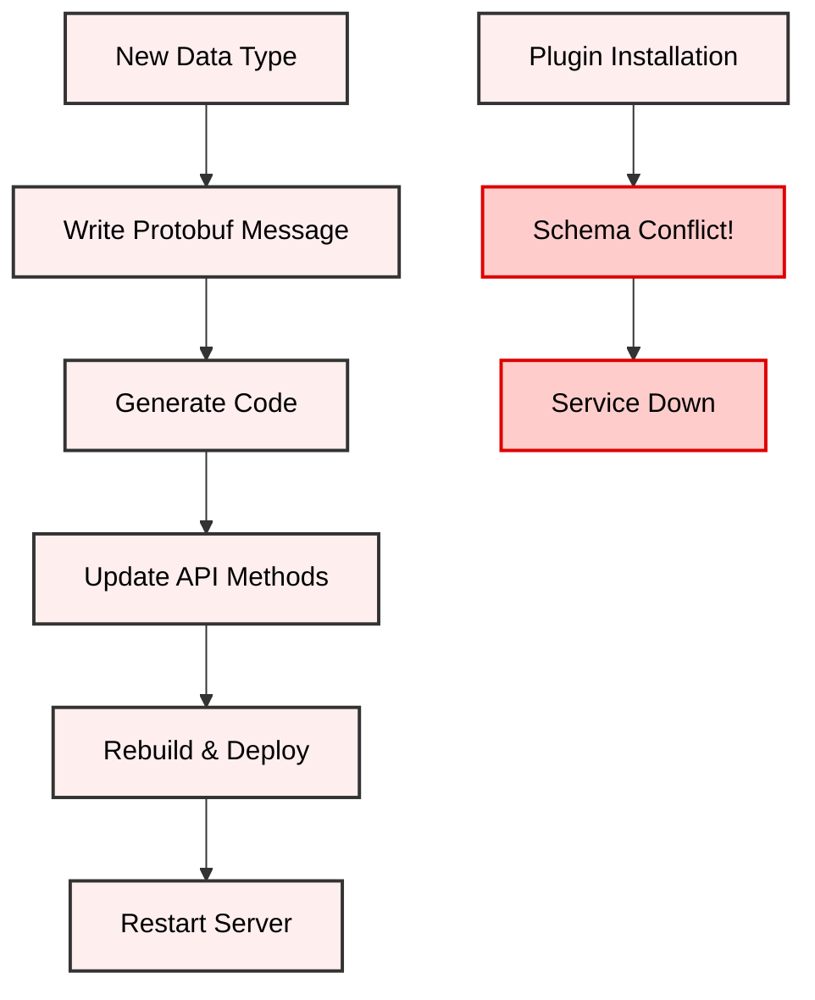
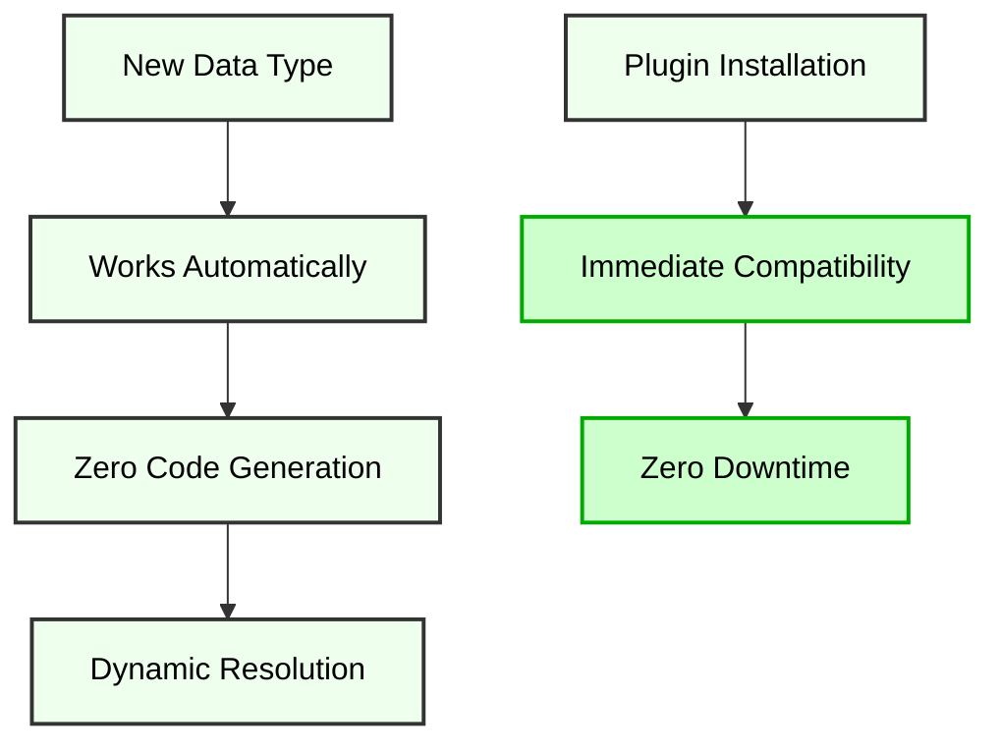
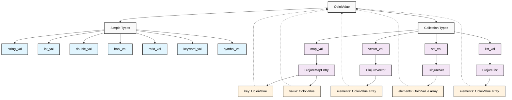
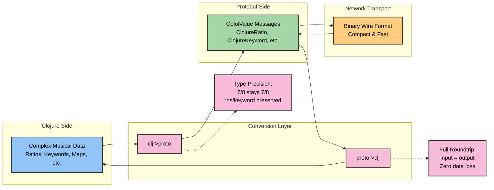
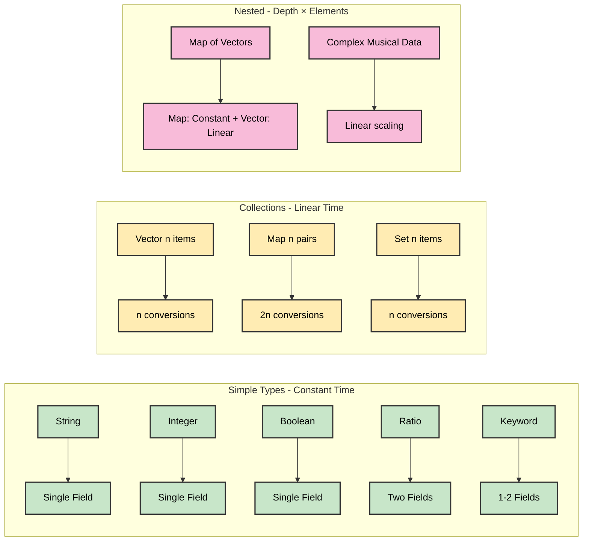
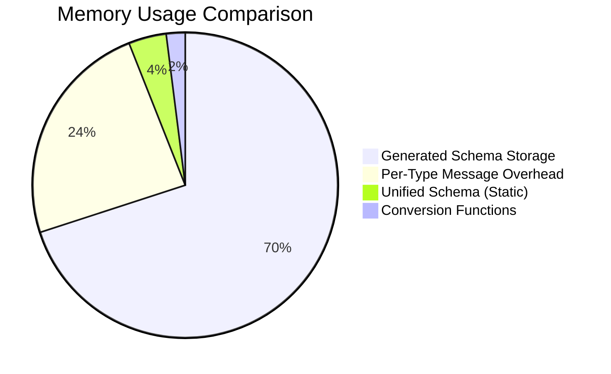
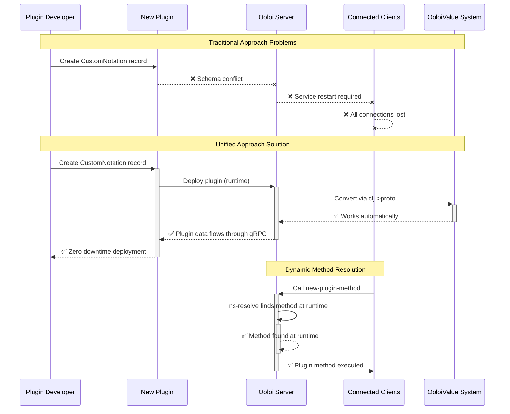
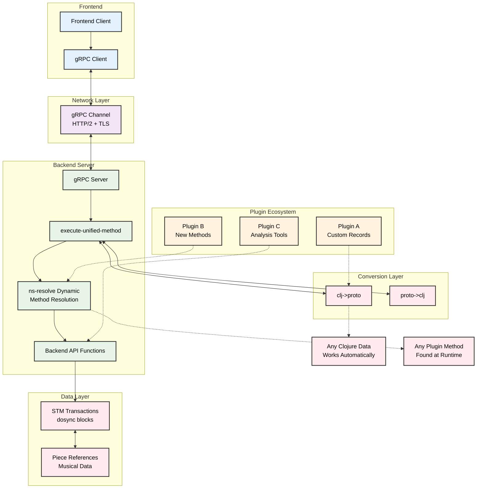

# Unified Clojure-Aware gRPC Architecture - Deep Technical Implementation Guide

## Table of Contents

- [Executive Summary](#executive-summary)
- [Part 1: Unified Architecture Fundamentals](#part-1-unified-architecture-fundamentals)
  - [The Unified Approach](#the-unified-approach)
  - [OoloiValue Schema Design](#ooloivalue-schema-design)
  - [Why Unified Beats Generated](#why-unified-beats-generated)
- [Part 2: Type Fidelity](#part-2-type-fidelity)
  - [Clojure Type Mapping](#clojure-type-mapping)
  - [Round-Trip Conversion Examples](#round-trip-conversion-examples)
  - [Performance Characteristics](#performance-characteristics)
- [Part 3: Hot Plugin Installation Architecture](#part-3-hot-plugin-installation-architecture)
  - [Zero-Downtime Plugin Deployment](#zero-downtime-plugin-deployment)
  - [Dynamic API Method Resolution](#dynamic-api-method-resolution)
  - [Plugin Data Type Support](#plugin-data-type-support)
- [Part 4: Implementation Details](#part-4-implementation-details)
  - [Unified Protobuf Schema](#unified-protobuf-schema)
  - [Conversion Functions](#conversion-functions)
  - [Server Implementation](#server-implementation)
  - [Client Integration](#client-integration)
- [Part 5: Production Considerations](#part-5-production-considerations)
  - [Performance Optimization](#performance-optimization)
  - [Error Handling](#error-handling)
  - [Monitoring and Observability](#monitoring-and-observability)
- [Communication Patterns and Flow Control](#communication-patterns-and-flow-control)
- [Summary: Unified gRPC Architecture for Music Notation](#summary-unified-grpc-architecture-for-music-notation)

## Executive Summary

Ooloi implements a **universal Clojure-aware gRPC architecture** that avoids complex schema generation while preserving Clojure's semantic richness and enabling **hot plugin installation** with **type fidelity**.

**Key characteristics**:
- **Unified OoloiValue Schema**: Single protobuf message handles all Clojure data types
- **Zero Code Generation**: No API introspection, reflection, or build-time complexity
- **Hot Plugin Installation**: Plugins deploy without server restarts or schema changes
- **Type Fidelity**: Ratios stay ratios, keywords preserve namespaces
- **Dynamic Extensibility**: Any plugin data structure automatically supported

**Approach**: This simplifies gRPC from a complex schema-generation system into a type-preserving communication layer that scales with the plugin ecosystem while maintaining Clojure's semantic richness.

**Historical Context**: For the chronological development narrative and phase-by-phase implementation timeline that led to this architecture, see [MASTER_PLAN.md](MASTER_PLAN.md) - particularly Phase 3: Communication Layer.

**Scope**: This document focuses on the deep technical implementation of the unified architecture. For communication patterns, concurrency analysis, and flow control design, see [ADR-0024: gRPC Concurrency and Flow Control Architecture](ADRs/0024-gRPC-Concurrency-and-Flow-Control-Architecture.md) and the [gRPC Communication and Flow Control Guide](guides/GRPC_COMMUNICATION_AND_FLOW_CONTROL.md).

## Part 1: Unified Architecture Fundamentals

### The Unified Approach

Traditional gRPC requires **one protobuf message per data structure**. Ooloi uses **one universal message for all data structures**.

**Traditional Approach Problems**:
```protobuf
// Traditional: 85+ specific message types
message Pitch { string note = 1; string duration = 2; /* ... */ }
message Rest { string duration = 1; /* ... */ }
message Chord { repeated Pitch pitches = 1; /* ... */ }
// + 82 more message types...
```

**Unified Approach Solution**:
```protobuf
// Unified: Single message handles everything
message OoloiValue {
  oneof value_type {
    string string_val = 1;
    int64 int_val = 2;
    double double_val = 3;
    bool bool_val = 4;
    ClojureRatio ratio_val = 5;
    ClojureKeyword keyword_val = 6;
    ClojureSymbol symbol_val = 7;
    ClojureMap map_val = 8;
    ClojureVector vector_val = 9;
    ClojureSet set_val = 10;
    ClojureList list_val = 11;
  }
}
```

#### Traditional vs Unified Architecture Comparison

**Traditional Approach:**


**Unified Approach:**


### OoloiValue Schema Design

**Recursive Structure**: OoloiValue messages can contain other OoloiValue messages, enabling arbitrary nesting:

```protobuf
message ClojureMap {
  repeated ClojureMapEntry entries = 1;
}

message ClojureMapEntry {
  OoloiValue key = 1;    // Any Clojure type as key
  OoloiValue value = 2;  // Any Clojure type as value
}

message ClojureVector {
  repeated OoloiValue elements = 1;  // Vector of any types
}
```

#### OoloiValue Recursive Structure



**Key Insight**: This recursive structure enables **infinite nesting depth** - any collection can contain other collections or simple types, all through the same OoloiValue interface.

**Type-Specific Messages**: Each Clojure type gets precise representation:

```protobuf
message ClojureRatio {
  int64 numerator = 1;
  int64 denominator = 2;    // Preserves exact rational arithmetic
}

message ClojureKeyword {
  optional string namespace = 1;  // Preserves namespace
  string name = 2;
}
```

### Why Unified Beats Generated

**Complexity Elimination**:
- **Generated Approach**: 85+ message types, 165+ service methods, complex build pipeline
- **Unified Approach**: 11 core types, 2 service methods, static schema

**Plugin Compatibility**:
- **Generated Approach**: New plugin types break schema, require regeneration
- **Unified Approach**: Any plugin data works immediately

**Development Experience**:
- **Generated Approach**: API changes trigger complex build cycles
- **Unified Approach**: New API methods work instantly

## Part 2: Type Fidelity

### Clojure Type Mapping

The universal schema preserves **exact Clojure semantics** across the network:

#### Type Fidelity Conversion Flow



```clojure
;; Musical data with complex Clojure types
(def musical-data
  {:tempo 120
   :time-signature 3/4           ; Ratio preserved exactly
   :key-signature :Eb-major      ; Keyword with namespace
   :dynamics [:pp :mp :forte]    ; Vector of keywords  
   :articulations #{:staccato :accent}  ; Set of unique values
   :custom-plugin-data {...}})   ; Plugin data works automatically

;; Round-trip: Clojure → Protobuf → Clojure
(= musical-data 
   (-> musical-data
       clj->proto
       proto->clj))  ; => true (full fidelity)
```

### Round-Trip Conversion Examples

**Ratio Preservation**:
```clojure
;; Input: Musical time signature
(def time-sig 7/8)

;; Protobuf representation
{:ratio-val {:numerator 7 :denominator 8}}

;; Output: Exact ratio (not decimal approximation)
7/8  ; Perfect mathematical precision maintained
```

**Keyword Namespace Preservation**:
```clojure
;; Input: Namespaced musical concepts
(def articulation :ooloi.musical/staccato)

;; Protobuf representation  
{:keyword-val {:namespace "ooloi.musical" :name "staccato"}}

;; Output: Exact keyword with namespace
:ooloi.musical/staccato
```

**Complex Nested Structures**:
```clojure
;; Input: Complete musical measure
(def measure
  {:items [{:type :pitch :note "C4" :duration 1/4}
           {:type :rest :duration 1/8}
           {:type :chord :pitches ["C4" "E4" "G4"] :duration 1/2}]
   :time-signature 4/4
   :key-signature :C-major
   :settings {:dynamics :mf 
             :articulations #{:legato}
             :plugin-data {:custom-notation {...}}}})

;; Unified conversion handles arbitrary nesting automatically
;; All ratios, keywords, sets, vectors preserved exactly
```

### Performance Characteristics

#### Conversion Complexity Analysis



**Conversion Efficiency**:
- **Simple types**: Single protobuf field assignment (O(1))
- **Collections**: Recursive conversion (O(n) where n = element count)
- **Nested structures**: Depth-first traversal with linear complexity

**Memory Advantages**:



**Memory Usage**:
- **No schema storage**: Unified schema is static, no per-type overhead
- **Lazy conversion**: Convert only when crossing network boundary
- **Connection reuse**: Single persistent gRPC channel for all operations

**Network Efficiency**:
- **Binary protobuf encoding**: Compact wire format
- **HTTP/2 multiplexing**: Multiple concurrent operations over single connection
- **Streaming support**: Large data structures can be streamed incrementally

## Part 3: Hot Plugin Installation Architecture

### Zero-Downtime Plugin Deployment

#### Hot Plugin Architecture Flow



**Traditional gRPC Plugin Problem**:
```clojure
;; Plugin defines new model
(defrecord CustomNotation [microtones glyphs timing-data])

;; Traditional approach breaks:
;; 1. Hardcoded protobuf generation fails (no CustomNotation message)
;; 2. Server restart required (reload generated classes)  
;; 3. All clients disconnected (service unavailable)
;; 4. Complex regeneration pipeline (minutes of downtime)
```

**Unified Architecture Solution**:
```clojure
;; Plugin defines new model
(defrecord CustomNotation [microtones glyphs timing-data])

;; Unified approach works immediately:
(def plugin-data (->CustomNotation [440.5 441.2] {...} {...}))

;; Automatic conversion with zero infrastructure changes
(clj->proto plugin-data)
;; => {:map-val {:entries [[:microtones {:vector-val ...}]
;;                        [:glyphs {:map-val ...}]
;;                        [:timing-data {:map-val ...}]]}}
```

### Dynamic API Method Resolution

**Runtime Method Discovery**:
```clojure
(defn execute-method
  "Unified method executor for any API call."
  [request response-observer]
  (let [method-name (keyword (:method request))
        params (conv/proto->clj (:params request))
        
        ;; Dynamic resolution - finds any API function at runtime
        api-fn (ns-resolve 'ooloi.backend.api (symbol method-name))]
    
    ;; Call resolved function with converted parameters
    (if (vector? params)
      (apply api-fn params)      ; VPD methods: multiple arguments
      (api-fn params))))         ; Constructor methods: parameter map
```

**Plugin Method Registration**:
```clojure
;; Plugin adds new API methods
(defn analyze-microtonal-harmony [vpd piece-id analysis-params]
  "Plugin-provided analysis function"
  ;; Complex harmonic analysis logic
  )

;; Method immediately available via gRPC:
;; Client calls: ExecuteMethod("analyze-microtonal-harmony", params)
;; Server resolves: (ns-resolve 'ooloi.backend.api 'analyze-microtonal-harmony)
;; Result: Plugin method called with full parameter fidelity
```

### Plugin Data Type Support

**Streaming Data Types**:
```clojure
;; MIDI plugin streaming real-time events
(def midi-stream
  {:events [{:timestamp 1001 :note-on {:pitch 60 :velocity 0.8}}
            {:timestamp 1125 :note-off {:pitch 60}}]
   :timing {:resolution 480 :bpm 120.5}
   :metadata {:plugin-version "2.1.0"
             :license-key "..."
             :custom-params {...}}})

;; Unified conversion preserves all streaming semantics
;; Ratios (timing), keywords (events), nested maps (metadata)
```

**Custom Notation Systems**:
```clojure
;; Plugin for Byzantine chant notation
(defrecord NeumeName [base-shape modifiers direction])
(defrecord ByzantineNote [neume-name pitch-indication duration-class])

;; Automatically works through universal conversion - no schema changes needed
;; Plugin data flows through gRPC with full fidelity
```

**Real-Time Audio Analysis**:
```clojure
;; Audio analysis plugin with complex numerical data
(def analysis-result
  {:fundamental-freq 440.0
   :harmonics {2 0.6, 3 0.4, 4 0.2, 5 0.1}     ; Harmonic ratios
   :spectral-envelope [0.1 0.3 0.8 1.0 0.7]    ; Vector of amplitudes
   :features #{:vibrato :tremolo}               ; Set of detected features
   :confidence-scores {:pitch 0.95 :harmony 0.87}})

;; All numerical precision, collections, and semantics preserved
```

## Part 4: Implementation Details

### System Integration Overview

#### Complete Architecture Flow



### Unified Protobuf Schema

**Complete Unified Schema**:
```protobuf
syntax = "proto3";
package ooloi;

// Unified Clojure value representation
message OoloiValue {
  oneof value_type {
    string string_val = 1;
    int64 int_val = 2;
    double double_val = 3;
    bool bool_val = 4;
    ClojureRatio ratio_val = 5;
    ClojureKeyword keyword_val = 6;
    ClojureSymbol symbol_val = 7;
    ClojureMap map_val = 8;
    ClojureVector vector_val = 9;
    ClojureSet set_val = 10;
    ClojureList list_val = 11;
  }
}

message ClojureRatio {
  int64 numerator = 1;
  int64 denominator = 2;
}

message ClojureKeyword {
  optional string namespace = 1;
  string name = 2;
}

message ClojureSymbol {
  optional string namespace = 1;
  string name = 2;
}

message ClojureMap {
  repeated ClojureMapEntry entries = 1;
}

message ClojureMapEntry {
  OoloiValue key = 1;
  OoloiValue value = 2;
}

message ClojureVector {
  repeated OoloiValue elements = 1;
}

message ClojureSet {
  repeated OoloiValue elements = 1;
}

message ClojureList {
  repeated OoloiValue elements = 1;
}

// Simplified gRPC service
message OoloiRequest {
  string method = 1;
  OoloiValue params = 2;
}

message OoloiResponse {
  bool success = 1;
  optional string error = 2;
  optional OoloiValue result = 3;
}

service OoloiService {
  rpc ExecuteMethod(OoloiRequest) returns (OoloiResponse);
  rpc ExecuteBatch(stream OoloiRequest) returns (OoloiResponse);
  rpc SubscribeToEvents(EventSubscriptionRequest) returns (stream PieceEvent);
}
```

### Conversion Functions

**Core Conversion Implementation**:
```clojure
(ns ooloi.shared.grpc.clojure-conversion
  "Unified Clojure ↔ Protobuf conversion functions.")

(defn clj->proto
  "Converts any Clojure value to OoloiValue protobuf message."
  [obj]
  (cond
    (nil? obj) nil
    
    (string? obj) {:string-val obj}
    (integer? obj) {:int-val (long obj)}
    (float? obj) {:double-val (double obj)}
    (boolean? obj) {:bool-val obj}
    
    ;; Perfect ratio preservation
    (ratio? obj) 
    {:ratio-val {:numerator (numerator obj) 
                 :denominator (denominator obj)}}
    
    ;; Keyword namespace preservation
    (keyword? obj) 
    {:keyword-val (cond-> {:name (name obj)}
                    (namespace obj) (assoc :namespace (namespace obj)))}
    
    ;; Symbol preservation
    (symbol? obj) 
    {:symbol-val (cond-> {:name (name obj)}
                   (namespace obj) (assoc :namespace (namespace obj)))}
    
    ;; Recursive collection handling
    (map? obj) 
    {:map-val {:entries (map (fn [[k v]] 
                               {:key (clj->proto k) 
                                :value (clj->proto v)}) 
                             obj)}}
    
    (vector? obj) 
    {:vector-val {:elements (map clj->proto obj)}}
    
    (set? obj) 
    {:set-val {:elements (map clj->proto obj)}}
    
    (list? obj) 
    {:list-val {:elements (map clj->proto obj)}}
    
    ;; Defrecord support (plugin compatibility)
    (record? obj)
    (clj->proto (into {} obj))
    
    ;; Fallback: convert to string
    :else {:string-val (str obj)}))

(defn proto->clj
  "Converts OoloiValue protobuf message back to native Clojure value."
  [proto-value]
  (when proto-value
    (cond
      (:string-val proto-value) (:string-val proto-value)
      (:int-val proto-value) (:int-val proto-value)
      (:double-val proto-value) (:double-val proto-value)
      (:bool-val proto-value) (:bool-val proto-value)
      
      ;; Perfect ratio reconstruction
      (:ratio-val proto-value) 
      (let [{:keys [numerator denominator]} (:ratio-val proto-value)]
        (/ numerator denominator))
      
      ;; Keyword namespace reconstruction
      (:keyword-val proto-value)
      (let [{:keys [namespace name]} (:keyword-val proto-value)]
        (if namespace 
          (keyword namespace name)
          (keyword name)))
      
      ;; Symbol reconstruction
      (:symbol-val proto-value)
      (let [{:keys [namespace name]} (:symbol-val proto-value)]
        (if namespace 
          (symbol namespace name)
          (symbol name)))
      
      ;; Recursive collection reconstruction
      (:map-val proto-value)
      (into {} (map (fn [{:keys [key value]}]
                      [(proto->clj key) 
                       (proto->clj value)])
                    (:entries (:map-val proto-value))))
      
      (:vector-val proto-value)
      (mapv proto->clj (:elements (:vector-val proto-value)))
      
      (:set-val proto-value)
      (into #{} (map proto->clj (:elements (:set-val proto-value))))
      
      (:list-val proto-value)
      (map proto->clj (:elements (:list-val proto-value)))
      
      :else nil)))
```

### Server Implementation

**Simplified Unified Server**:
```clojure
(ns ooloi.backend.grpc.server
  "Unified gRPC server implementation."
  (:require [ooloi.shared.grpc.clojure-conversion :as conv]
            [ooloi.backend.api :as api])
  (:import [io.grpc Status]
           [io.grpc.stub StreamObserver]))

(defn execute-method
  "Unified method executor for any API call."
  [request response-observer]
  (try
    (let [method-name (keyword (:method request))
          params (conv/proto->clj (:params request))
          
          ;; Dynamically resolve API function
          api-fn (ns-resolve 'ooloi.backend.api (symbol method-name))
          
          ;; Call the API function with converted parameters
          result (if (vector? params)
                   (apply api-fn params)  ; VPD methods take multiple args
                   (api-fn params))       ; Constructor methods take param map
          
          ;; Build response
          response {:success true
                   :error ""
                   :result (conv/clj->proto result)}]
      
      (.onNext response-observer response)
      (.onCompleted response-observer))
    
    (catch Exception e
      (let [error-response {:success false
                           :error (.getMessage e)
                           :result nil}]
        (.onNext response-observer error-response)
        (.onCompleted response-observer)))))

(defn create-ooloi-service
  "Creates the universal gRPC service implementation."
  []
  (proxy [OoloiServiceGrpc$OoloiServiceImplBase] []
    (executeMethod [request response-observer]
      (execute-method request response-observer))
    
    (executeBatch [response-observer]
      ;; Return StreamObserver for batch processing
      (reify StreamObserver
        (onNext [this request]
          ;; Collect requests for batch processing
          )
        (onError [this error]
          (.onError response-observer error))
        (onCompleted [this]
          ;; Execute batch within STM transaction
          )))))
```

### Client Integration

**Unified Client Calls**:
```clojure
;; Frontend client using universal approach
(defn call-backend-api
  "Unified client function for any backend API call."
  [method-name & params]
  (let [request (-> (OoloiRequest/newBuilder)
                    (.setMethod (name method-name))
                    (.setParams (conv/clj->proto (vec params)))
                    .build)
        response (.executeMethod grpc-stub request)]
    
    (if (.getSuccess response)
      (conv/proto->clj (.getResult response))
      (throw (ex-info (.getError response) {:grpc-error true})))))

;; Usage: Identical to local API calls
(call-backend-api :add-articulation 
                  [:musicians 0 :instruments 0 :staves 0 :voices 0 :measures 1 :items 2]
                  "piece-123" 
                  :staccato)

;; Plugin method calls work automatically
(call-backend-api :analyze-microtonal-harmony
                  [:musicians 0]
                  "piece-456"
                  {:analysis-type :spectral :precision :high})
```

## Part 5: Production Considerations

### Performance Optimization

**Conversion Optimization Strategies**:
```clojure
;; Memoization for frequently converted data structures
(def conversion-cache (atom {}))

(defn cached-clj->proto [obj]
  (if-let [cached (get @conversion-cache obj)]
    cached
    (let [result (clj->proto obj)]
      (swap! conversion-cache assoc obj result)
      result)))

;; Connection pooling
(defonce grpc-channel-pool
  (delay (create-channel-pool {:max-connections 10
                              :keep-alive-time 30000
                              :keep-alive-timeout 5000})))
```

**Memory Management**:
```clojure
;; Streaming for large data structures
(defn stream-large-piece [piece-data]
  "Stream large pieces in chunks to avoid memory issues."
  (->> piece-data
       (partition 100)  ; Process in chunks
       (map conv/clj->proto)
       (stream-to-client)))
```

### Error Handling

**Comprehensive Error Mapping**:
```clojure
(defn handle-api-error [error]
  "Map Clojure exceptions to gRPC status codes."
  (let [error-data (ex-data error)]
    (case (:type error-data)
      :validation-error Status/INVALID_ARGUMENT
      :not-found Status/NOT_FOUND
      :permission-denied Status/PERMISSION_DENIED
      :timeout Status/DEADLINE_EXCEEDED
      :conflict Status/ABORTED
      Status/INTERNAL)))  ; Default for unknown errors
```

### Monitoring and Observability

**Metrics Collection**:
```clojure
(def metrics (atom {:conversions-total 0
                   :conversion-errors 0
                   :method-calls-total 0
                   :batch-operations-total 0}))

(defn record-conversion-metric [success?]
  (swap! metrics update 
    (if success? :conversions-total :conversion-errors) 
    inc))

(defn record-method-call [method-name duration-ms]
  (swap! metrics update :method-calls-total inc)
  ;; Send to monitoring system
  (send-metric "api.method.duration" duration-ms {:method method-name}))
```

## Communication Patterns and Flow Control

The unified architecture described above supports sophisticated communication patterns and flow control mechanisms. For comprehensive coverage of these topics, see:

### **Architectural Decision Record**
**[ADR-0024: gRPC Concurrency and Flow Control Architecture](ADRs/0024-gRPC-Concurrency-and-Flow-Control-Architecture.md)**
- Technical rationale for flow control decisions
- Analysis of API requests vs event streaming patterns
- STM integration with gRPC concurrency model
- Performance implications and architectural trade-offs

### **User-Focused Guide**
**[gRPC Communication and Flow Control Guide](guides/GRPC_COMMUNICATION_AND_FLOW_CONTROL.md)**
- Practical examples of communication patterns
- Real-world collaboration scenarios
- Queue-based event delivery architecture
- Client implementation guidance

### **Key Integration Points**

The unified OoloiValue architecture enables:

**STM-gRPC Batch Integration**: STM transaction boundaries align with gRPC batch boundaries for distributed ACID transactions, supporting atomic collaborative edits.

**Real-Time Event Streaming**: Server-to-client event notifications use OoloiValue for type fidelity in collaborative updates, with flow control ensuring reliable delivery regardless of individual client performance.

**Bidirectional Type Preservation**: Both API requests and event streams maintain exact Clojure semantics through the unified conversion system.

## Summary: Unified gRPC Architecture for Music Notation

### Architectural Characteristics

Ooloi's universal Clojure-aware gRPC architecture has several characteristics for collaborative music notation systems:

**Traditional Approach**:
- Static schema binding requires regeneration for new types
- Complex build pipelines with API introspection  
- Plugin installation requires server restarts
- Type fidelity lost through conversion approximations
- Many generated methods requiring maintenance

**Unified Approach**:
- **Dynamic type support**: Any Clojure data structure works immediately
- **Simplified build**: No code generation or API introspection
- **Hot plugin installation**: Zero-downtime plugin deployment
- **Type fidelity**: Mathematical precision and semantic preservation
- **Scalable method handling**: Single method handles API growth

### Music Notation Domain Characteristics

**Notable characteristics for music notation systems**:
- **Distributed ACID transactions** for collaborative editing via STM-gRPC batch alignment
- **Hot plugin architecture** without service interruption for extensible notation systems
- **Type preservation** for musical ratios and domain-specific data types
- **Unified data representation** avoiding complex schema maintenance

### Implementation Notes

**Complexity reduction**: ~3,500 lines of reflection, introspection, and generation code replaced with ~200 lines of simple conversion functions.

**Plugin Ecosystem Enablement**: Any plugin can define arbitrary data structures and API methods that work immediately through the universal architecture.

**Collaborative Music Notation**: Real-time multi-user editing with STM-guaranteed consistency and event-driven synchronization.

**Production Characteristics**: Simple, testable architecture that scales with Ooloi's growth while maintaining reliability and performance.

This architecture provides Ooloi with a collaborative music notation platform with extensibility and plugin development capabilities.