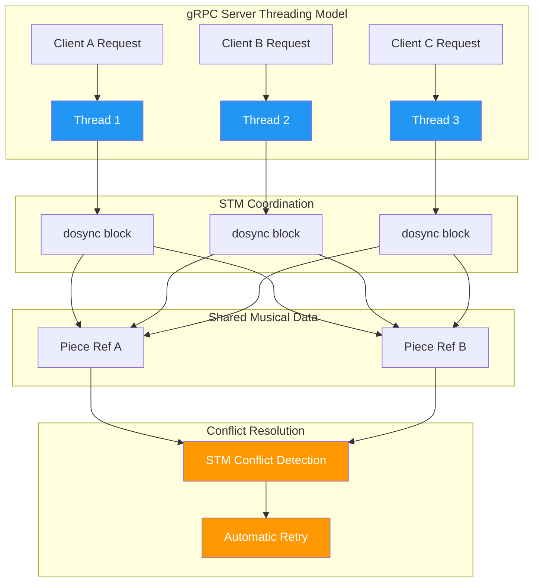
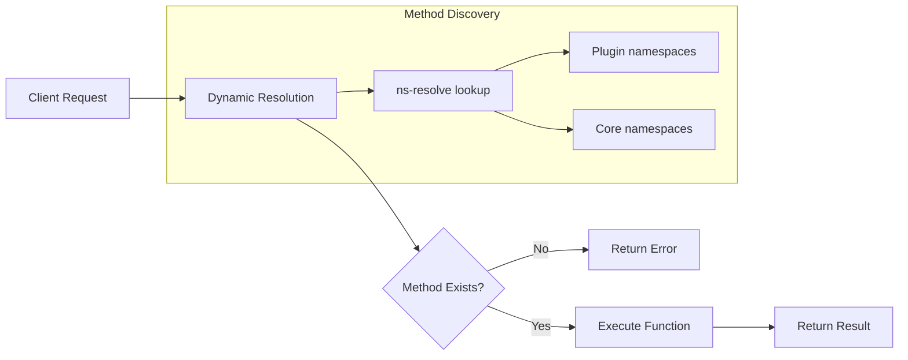
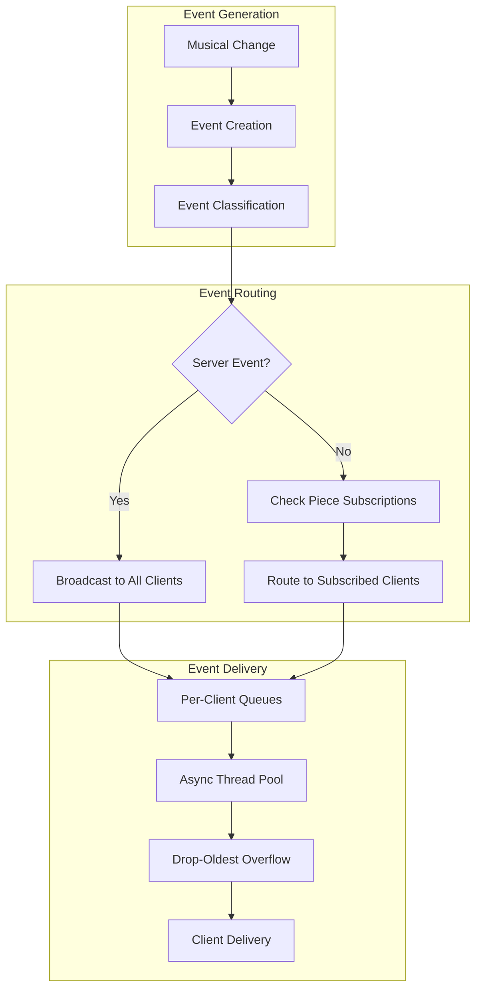

# 🔵 Ooloi Server Architectural Guide: Enterprise-Grade Concurrent Music System

Distributed systems for complex domains like music notation face unique challenges in balancing semantic precision with concurrent access patterns. Ooloi's backend server explores how Clojure's functional programming strengths can combine with gRPC to address these challenges through asynchronous concurrency management.

This comprehensive architectural analysis examines a server design that:
- Handles concurrent access from multiple sources: collaborative users, background threads, file conversion plugins, and automated processes
- Provides ACID transactions within the authoritative server process, atomic across batched operations within a request
- Allows plugins to be loaded without restarting, running with equal speed and parity as core functionality
- Preserves perfect type fidelity for complex musical data across network boundaries
- Eliminates traditional protocol buffer complexity through unified message design
- Maintains enterprise reliability through architectural simplicity

Topics covered:
- **Unified Protocol Architecture**: Single message type eliminating traditional gRPC schema complexity
- **STM-gRPC Integration**: Server-local transactions and asynchronous conflict resolution
- **Real-Time Event Streaming**: High-performance hierarchical event delivery for concurrent operations
- **Enterprise Comparison**: Technical analysis comparing Ooloi with traditional enterprise patterns
- **Production Characteristics**: Reliability, scalability, and operational qualities

This guide serves as both architectural documentation and a case study in applying functional programming principles to concurrent distributed system requirements.

## Table of Contents

- [Overview](#overview)
- [Deployment Scenarios](#deployment-scenarios)
- [Core Architecture](#core-architecture)
  - [Unified Protocol Buffer Design](#unified-protocol-buffer-design)
  - [Perfect Type Fidelity](#perfect-type-fidelity)
  - [Software Transactional Memory Integration](#software-transactional-memory-integration)
    - [Performance Characteristics](#performance-characteristics)
  - [Dynamic API Method Resolution](#dynamic-api-method-resolution)
- [Real-Time Event Streaming](#real-time-event-streaming)
  - [Two-Tier Event System](#two-tier-event-system)
  - [High-Performance Event Architecture](#high-performance-event-architecture)
  - [Performance Optimizations](#performance-optimizations)
- [Connection Management](#connection-management)
  - [Connection Registry Architecture](#connection-registry-architecture)
  - [Client Validation Security](#client-validation-security)
  - [Lifecycle Management](#lifecycle-management)
- [Error Handling](#error-handling)
  - [Comprehensive gRPC Status Mapping](#comprehensive-grpc-status-mapping)
  - [Distributed Error Propagation](#distributed-error-propagation)
- [Enterprise Architecture Comparison](#enterprise-architecture-comparison)
  - [Traditional Enterprise gRPC Challenges](#traditional-enterprise-grpc-challenges)
  - [Ooloi's Architectural Advantages](#oolois-architectural-advantages)
- [Production Characteristics](#production-characteristics)
- [Related Documentation](#related-documentation)

## Overview

The Ooloi backend server represents a specialized approach to concurrent distributed systems, combining the strengths of functional programming, asynchronous processing, and domain-specific design. Built for complex music notation operations, it demonstrates how Clojure's Software Transactional Memory (STM) can integrate with unified protocol buffers and real-time event streaming to create a server architecture optimized for concurrent access patterns—whether from collaborative users, background processing threads, file conversion plugins, or automated analysis tools.

## Deployment Scenarios

The STM-gRPC architecture scales naturally across deployment contexts without architectural changes, adapting concurrency patterns to match usage requirements:

### Single-User Combined Deployment
- **Configuration**: Frontend and backend in same process, in-process gRPC transport
- **STM concurrency**: Background operations (auto-save, layout), plugin processing, file import/export
- **Typical use**: Individual composer/arranger working on scores

### Local Network Collaboration  
- **Configuration**: Backend on teacher's laptop, students connect via local network
- **STM concurrency**: Manual edits from ~30 users, real-time collaborative updates, shared piece access
- **Typical use**: Classroom instruction, small ensemble rehearsals

### Enterprise Local Server
- **Configuration**: Dedicated server within institution network  
- **STM concurrency**: Hundreds of users across multiple pieces, department-level collaboration
- **Typical use**: Music schools, conservatories, large performing organizations

### Cloud SaaS Multi-Tenant
- **Configuration**: Cloud deployment with authentication/authorization isolation
- **STM concurrency**: Multi-tenant piece isolation, granular permissions, enterprise-scale concurrent access
- **Typical use**: Global music education platforms, professional publishing workflows

The same STM coordination mechanisms handle all deployment scenarios transparently, from single-user background processing to enterprise-scale collaborative editing, without requiring different concurrency models or performance tuning.

## Core Architecture

### Unified Protocol Buffer Design

Unlike typical gRPC services that generate dozens or hundreds of message types for different operations, Ooloi uses a **single unified message type**: `OoloiValue`. This approach eliminates the traditional gRPC complexity of:

- Complex schema generation pipelines
- Schema versioning conflicts during plugin installation
- Type fidelity loss across network boundaries
- Reflection-based introspection systems

```
Traditional gRPC:
├── UserMessage
├── NoteMessage  
├── ChordMessage
├── ArticulationMessage
├── StaffMessage
└── ... (85+ message types)

Ooloi gRPC:
└── OoloiValue (handles all data types)
```

### Perfect Type Fidelity

The server preserves complete Clojure semantic fidelity across the network boundary:

- **Mathematical ratios** remain ratios (not converted to decimals)
- **Namespaced keywords** preserve their namespaces
- **Nested data structures** maintain their exact shape
- **Plugin-defined record types** work automatically without schema changes

This is achieved through a specialized conversion layer that maps Clojure types to protobuf representations:

```clojure
;; Example: Complex musical data preserved exactly
{:type :chord
 :duration 3/4          ; Ratio preserved
 :pitches #{::pitch/C4  ; Namespaced keywords preserved
            ::pitch/E4
            ::pitch/G4}
 :dynamics [:p :cresc]} ; Nested structures preserved
```

### Software Transactional Memory Integration

The server integrates Clojure's STM directly with gRPC operations, enabling **ACID transactions within the server process**. This synergy works because **gRPC uses HTTP/2 with request multiplexing**, allowing multiple requests to arrive simultaneously over the same connection, with **each incoming gRPC request getting its own thread**. This provides the multi-threaded environment that STM is designed to coordinate:

- **HTTP/2 multiplexing**: Multiple requests arrive simultaneously over the same connection
- **Per-request threading**: Each gRPC call executes on its own server thread
- **Concurrent STM access**: Multiple threads can safely access the same STM refs simultaneously
- **Automatic conflict resolution**: STM detects and resolves conflicts between concurrent transactions
- **Atomic batch operations**: Multiple musical modifications succeed or fail together
- **Consistency guarantees**: Musical scores never enter invalid intermediate states
- **Isolation**: Concurrent operations don't see partial modifications



```clojure
;; Example: Atomic multi-staff transposition
;; Each gRPC request runs this in its own thread
(dosync
  (alter-piece piece-id transpose-staff :violin-1 :up-major-third)
  (alter-piece piece-id transpose-staff :violin-2 :up-major-third)
  (alter-piece piece-id update-key-signature :E-major))
```

#### Performance Characteristics

Benchmarking demonstrates **100,000+ contending transactions per second** on modest 2017 hardware. This capacity far exceeds music-notation workload requirements:

* **Manual user operations**: 1–100 ops/sec across all human users
* **Automated operations**: plugin mutations, background saves/loads, file imports, layout calculations
* **System bottlenecks**: network latency (1–200 ms), file I/O (10–1000 ms), rendering operations
* **STM coordination**: microseconds per transaction

**STM Overhead in Context**

Industry literature often cites a **4–5× overhead** for Software Transactional Memory compared to fine-grained locks, largely due to commit-time instrumentation and conflict retries. This criticism is valid for long, mutation-heavy transactions under high contention, and explains why STM has not seen broad uptake outside research.

Clojure's STM, however, is **tighter than most implementations**:
* **MVCC snapshot isolation** ensures transactions see a consistent view.
* **Immutable data structures** make retries cheap—no rollback of in-place mutation.
* **Commutative operations** (`commute`) reduce conflicts on common structures.
* **Validators and watchers** let invariants be enforced without manual locks.

For Ooloi's workload—**short batched edits, human-paced concurrency, and many more observers than writers**—STM overhead is below the noise floor. Microsecond-scale coordination costs vanish next to network hops, rendering, or I/O. The architecture provides ample capacity for any realistic deployment scenario.

**Distributed Deployment Scaling**
* **Theoretical capacity**: thousands of concurrent clients (though unrealistic for music notation)
* **Memory overhead**: ~500 MB for 1000 clients (1000 events × 500 bytes per queue)
* **Event filtering**: piece-based subscriptions prevent broadcast multiplication
* **Load distribution**: mostly observers, with relatively few active editors per piece
* **Practical deployment**: architecture provides more than enough capacity for all realistic notation scenarios

### Dynamic API Method Resolution

Instead of generating static service interfaces, the server uses **runtime method discovery**:

- API methods are defined as regular Clojure functions
- `ns-resolve` discovers methods at runtime
- Plugin methods work immediately without server restarts
- Zero code generation complexity



## Real-Time Event Streaming

### Two-Tier Event System

The server implements a sophisticated event notification system for collaborative editing:

**Server Events**: Global notifications (maintenance, shutdowns, connections)
- Broadcast to all connected clients
- Used for system-wide coordination

**Piece Events**: Musical content notifications with hierarchical targeting
- `piece-layout-invalidated`: Entire score reformatted
- `piece-page-invalidated`: Page layout changes  
- `piece-system-invalidated`: Staff grouping changes
- `piece-staff-invalidated`: Individual staff changes
- `piece-measures-invalidated`: Note content changes

### High-Performance Event Architecture



### Performance Optimizations

**Asynchronous Delivery**: Events are delivered via dedicated thread pools, ensuring slow clients never block fast clients or server operations.

**Queue-Based Flow Control**: Each client has an independent bounded queue (default 1000 events) with drop-oldest overflow handling.

**Burst Traffic Handling**: The system maintains stability under high-volume event bursts (tested with 2000+ rapid events).

**Subscription Filtering**: Events are only delivered to clients that have explicitly subscribed to specific pieces, reducing unnecessary network traffic.

## Connection Management

### Connection Registry Architecture

The server maintains a concurrent connection registry using atoms for O(1) client lookup:

```clojure
;; Registry structure
{client-id {:observer stream-observer
           :metadata {:connected-at timestamp
                      :client-ip "127.0.0.1"
                      :client-port 54321}
           :client-statistics {;; 33 client statistics fields
                              :api-calls-total 0
                              :events-sent 0
                              :queue-size-current 0
                              ;; ... (see ADR-0025 for complete structure)
                              }
           :piece-subscriptions #{piece-id-1 piece-id-2}
           :event-queue bounded-queue
           :consumer-thread thread-ref}}
```

### Client Validation Security

The connection establishment implements comprehensive client-id validation as a security gate:

**Validation Rules**:
- **Format Enforcement**: Client-ids must match `^[a-zA-Z0-9_-]{3,64}$` pattern
- **Length Limits**: 3-64 characters inclusive to prevent memory exhaustion
- **Character Restrictions**: Only alphanumeric, dashes, underscores (prevents injection attacks)
- **Uniqueness Check**: Server-side registry prevents duplicate client connections

**Security Benefits**:
- **Protocol Injection Prevention**: Restricted character set blocks malicious payloads
- **Resource Protection**: Length limits prevent unbounded memory allocation
- **Connection Integrity**: Unique client-ids ensure proper resource tracking and cleanup

**Error Responses**:
- **`ALREADY_EXISTS`**: Returned for duplicate client-id attempts
- **`INVALID_ARGUMENT`**: Returned for format/length violations
- **Statistics Integration**: Failed validations increment `:clients-disconnected-error`
- **Resource Cleanup**: Failed registrations properly release allocated gRPC channels

### Lifecycle Management

- **Connection Validation**: Client-id validation occurs before registry entry creation
- **Automatic server subscriptions**: Clients receive server events upon successful connection
- **Manual piece subscriptions**: API methods for piece-specific event subscriptions  
- **Graceful cleanup**: Disconnected clients are automatically removed from all registries
- **Resource management**: Event queues and consumer threads are properly cleaned up

## Error Handling

### Comprehensive gRPC Status Mapping

The server maps Clojure exceptions to appropriate gRPC status codes:

- `IllegalArgumentException` → `INVALID_ARGUMENT`
- `SecurityException` → `PERMISSION_DENIED`  
- `UnsupportedOperationException` → `UNIMPLEMENTED`
- `TimeoutException` → `DEADLINE_EXCEEDED`
- Generic exceptions → `INTERNAL`

### Distributed Error Propagation

Errors in STM transactions or musical operations are properly propagated across the gRPC boundary with structured error information and context.

## Enterprise Architecture Comparison

### Traditional Enterprise gRPC Challenges

Most enterprise gRPC services follow conventional patterns that create significant operational complexity:

**Schema Management Burden**
- Hundreds of protobuf message types requiring coordination across teams
- Breaking changes necessitate careful versioning strategies
- Schema evolution often requires synchronized client-server deployments
- Plugin or extension installation breaks existing schemas

**Type System Limitations**
- Loss of semantic precision (ratios become floating point approximations)
- Complex custom types require extensive serialization logic
- Domain-specific data structures need manual conversion layers
- Cross-language type mappings introduce subtle bugs

**Infrastructure Dependencies**
- ACID guarantees typically require external coordination services (e.g., Apache Kafka, database transactions)
- Event streaming often requires additional infrastructure (Apache Pulsar, RabbitMQ)
- Multi-step operations often lack atomicity across service boundaries
- Performance optimization requires extensive configuration and monitoring

### Ooloi's Architectural Advantages

**Musical Domain Specialization**
- **VPD addressing**: Hierarchical addressing system optimized for musical elements
- **Perfect type preservation**: Mathematical ratios, intervals, and musical constructs maintain semantic meaning
- **Concurrent access patterns**: Purpose-built for multiple simultaneous operations on complex musical data

**Unified Protocol Design**
- **Single message type**: `OoloiValue` eliminates schema versioning challenges entirely
- **Plugin-friendly**: New musical notation systems work immediately without server restarts
- **Dynamic API discovery**: Plugin methods are available via runtime resolution with zero configuration

**Integrated Transaction & Event Architecture**
- **STM-gRPC integration**: ACID transactions within the server process without external coordination services
- **Built-in event streaming**: Real-time hierarchical event delivery integrated directly into service architecture
- **Automatic conflict resolution**: Concurrent operations from any source handled transparently with STM managing conflicts

## Production Characteristics

**Reliability & Performance**
- **Comprehensive test coverage**: Extensive test suite with disciplined TDD practices
- **Async processing**: Prevents client performance issues from cascading
- **Bounded resource usage**: Queues and thread pools protect against runaway consumption
- **Stress tested**: Validated under high-load conditions with realistic network scenarios

**Operational Simplicity**
- **Self-contained**: Single service boundary with no external coordination dependencies
- **Plugin extensibility**: New functionality added without modifying core server code
- **Resource efficiency**: Proper cleanup prevents memory leaks in long-running concurrent operations
- **Graceful degradation**: System remains stable under burst traffic and various client access patterns

The Ooloi backend server represents a specialized approach to concurrent distributed systems, combining the strengths of functional programming, asynchronous processing, and domain-specific design to create a robust platform for complex musical data operations. Through STM's conflict resolution capabilities, collaborative editing becomes simply a matter of authentication and authorization—the system's asynchronous concurrency foundation handles the complexity.

## Related Documentation

### Architectural Decision Records
- **[ADR-0002: gRPC Architecture](../ADRs/0002-gRPC.md)** - Java interop approach and deployment models
- **[ADR-0024: gRPC Concurrency and Flow Control Architecture](../ADRs/0024-gRPC-Concurrency-and-Flow-Control-Architecture.md)** - Communication patterns and flow control design
- **[ADR-0025: Server Statistics Architecture](../ADRs/0025-Server-Statistics-Architecture.md)** - Production monitoring, health endpoints, and performance analytics
- **[ADR-0031: Frontend Event-Driven Architecture](../ADRs/0031-Frontend-Event-Driven-Architecture.md)** - Event Router, Rendering Data Manager, and Fetch Coordinator architecture
- **[ADR-0038: Backend-Authoritative Rendering and Terminal Frontend Execution](../ADRs/0038-Backend-Authoritative-Rendering-and-Terminal-Frontend-Execution.md)** - Backend-authoritative rendering with GPU-accelerated frontend execution

### Implementation Guides
- **[FRONTEND_ARCHITECTURE_GUIDE.md](FRONTEND_ARCHITECTURE_GUIDE.md)** - Frontend execution layer that renders and interacts with server decisions
- **[GRPC_COMMUNICATION_AND_FLOW_CONTROL.md](GRPC_COMMUNICATION_AND_FLOW_CONTROL.md)** - Practical gRPC usage patterns and collaborative scenarios
- **[POLYMORPHIC_API_GUIDE.md](POLYMORPHIC_API_GUIDE.md)** - Type system foundations underlying the server's API design
- **[ADVANCED_CONCURRENCY_PATTERNS.md](ADVANCED_CONCURRENCY_PATTERNS.md)** - STM coordination patterns used in the server
- **[PIECE_MANAGER_GUIDE.md](PIECE_MANAGER_GUIDE.md)** - Storage and lifecycle management that the server coordinates

### Technical Documentation
- **[gRPC Streaming & Threading Guide](GRPC_STREAMING_THREADING_GUIDE.md)** - Advanced streaming implementation patterns

### Development Resources
- **Backend gRPC Server Implementation**: `backend/src/main/clojure/ooloi/backend/components/grpc_server.clj`
- **Service Logic**: `backend/src/main/clojure/ooloi/backend/grpc/server.clj`
- **Protocol Definitions**: `shared/src/main/proto/ooloi_service.proto`
- **Type Conversion Layer**: `shared/src/main/clojure/ooloi/shared/grpc/clojure_conversion.clj`
- **Event Client Implementation**: `frontend/src/main/clojure/ooloi/frontend/grpc/event_client.clj`