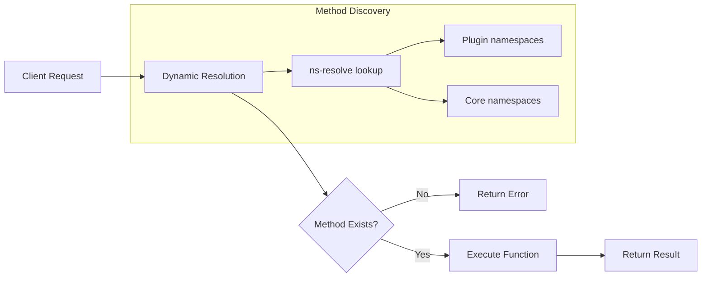
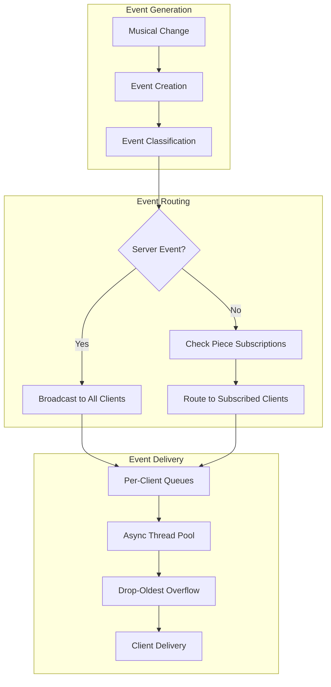

# Ooloi Server Architectural Guide: Enterprise-Grade Collaborative Music Editing

## Why This Guide Matters

Most collaborative editing systems compromise on either semantic precision or operational complexity. Ooloi's backend server demonstrates that sophisticated musical applications can achieve both enterprise-grade reliability and architectural elegance.

This comprehensive architectural analysis examines how Clojure's functional programming strengths combine with gRPC to create a server that:
- Preserves perfect type fidelity for complex musical data across network boundaries
- Eliminates traditional protocol buffer complexity through unified message design
- Provides distributed ACID transactions without external coordination services  
- Delivers real-time collaborative editing with hierarchical event targeting
- Achieves enterprise reliability while maintaining operational simplicity

Topics covered:
- **Unified Protocol Architecture**: Single message type eliminating traditional gRPC schema complexity
- **STM-gRPC Integration**: Distributed transactions and collaborative conflict resolution
- **Real-Time Event Streaming**: High-performance hierarchical event delivery for musical collaboration
- **Enterprise Comparison**: Technical analysis comparing Ooloi with traditional enterprise patterns
- **Production Characteristics**: Reliability, scalability, and operational qualities

This guide serves as both architectural documentation and a case study in applying functional programming principles to demanding distributed system requirements.

## Table of Contents

- [Overview](#overview)
- [Core Architecture](#core-architecture)
  - [Unified Protocol Buffer Design](#unified-protocol-buffer-design)
  - [Perfect Type Fidelity](#perfect-type-fidelity)
  - [Software Transactional Memory Integration](#software-transactional-memory-integration)
  - [Dynamic API Method Resolution](#dynamic-api-method-resolution)
- [Real-Time Event Streaming](#real-time-event-streaming)
  - [Two-Tier Event System](#two-tier-event-system)
  - [High-Performance Event Architecture](#high-performance-event-architecture)
  - [Performance Optimizations](#performance-optimizations)
- [Connection Management](#connection-management)
  - [Connection Registry Architecture](#connection-registry-architecture)
  - [Lifecycle Management](#lifecycle-management)
- [Error Handling](#error-handling)
  - [Comprehensive gRPC Status Mapping](#comprehensive-grpc-status-mapping)
  - [Distributed Error Propagation](#distributed-error-propagation)
- [Key Differentiators](#key-differentiators)
- [Comparison with Enterprise Solutions](#comparison-with-enterprise-solutions)
  - [Traditional Enterprise gRPC Architecture](#traditional-enterprise-grpc-architecture)
  - [Ooloi's Architectural Advantages](#oolois-architectural-advantages)
  - [Enterprise-Grade Qualities](#enterprise-grade-qualities)
- [Production Characteristics](#production-characteristics)
  - [Reliability](#reliability)
  - [Scalability](#scalability)
  - [Maintainability](#maintainability)
- [Related Documentation](#related-documentation)

## Overview

The Ooloi backend server represents a specialized approach to collaborative editing servers, combining the strengths of functional programming, distributed systems, and domain-specific design. Built specifically for collaborative music notation editing, it demonstrates how Clojure's Software Transactional Memory (STM) can integrate with unified protocol buffers and real-time event streaming to create a server architecture optimized for complex musical data manipulation and multi-user collaboration.

## Core Architecture

### Unified Protocol Buffer Design

Unlike typical gRPC services that generate dozens or hundreds of message types for different operations, Ooloi uses a **single unified message type**: `OoloiValue`. This approach eliminates the traditional gRPC complexity of:

- Complex schema generation pipelines
- Schema versioning conflicts during plugin installation
- Type fidelity loss across network boundaries
- Reflection-based introspection systems

```
Traditional gRPC:
├── UserMessage
├── NoteMessage  
├── ChordMessage
├── ArticulationMessage
├── StaffMessage
└── ... (85+ message types)

Ooloi gRPC:
└── OoloiValue (handles all data types)
```

### Perfect Type Fidelity

The server preserves complete Clojure semantic fidelity across the network boundary:

- **Mathematical ratios** remain ratios (not converted to decimals)
- **Namespaced keywords** preserve their namespaces
- **Nested data structures** maintain their exact shape
- **Plugin-defined record types** work automatically without schema changes

This is achieved through a specialized conversion layer that maps Clojure types to protobuf representations:

```clojure
;; Example: Complex musical data preserved exactly
{:type :chord
 :duration 3/4          ; Ratio preserved
 :pitches #{::pitch/C4  ; Namespaced keywords preserved
            ::pitch/E4
            ::pitch/G4}
 :dynamics [:p :cresc]} ; Nested structures preserved
```

### Software Transactional Memory Integration

The server integrates Clojure's STM directly with gRPC operations, enabling **distributed ACID transactions**:

- **Atomic batch operations**: Multiple musical modifications succeed or fail together
- **Conflict resolution**: STM handles concurrent edits automatically  
- **Consistency guarantees**: Musical scores never enter invalid intermediate states
- **Isolation**: Concurrent users don't see partial modifications

```clojure
;; Example: Atomic multi-staff transposition
(dosync
  (alter-piece piece-id transpose-staff :violin-1 :up-major-third)
  (alter-piece piece-id transpose-staff :violin-2 :up-major-third)
  (alter-piece piece-id update-key-signature :E-major))
```

### Dynamic API Method Resolution

Instead of generating static service interfaces, the server uses **runtime method discovery**:

- API methods are defined as regular Clojure functions
- `ns-resolve` discovers methods at runtime
- Plugin methods work immediately without server restarts
- Zero code generation complexity


```mermaid
graph LR
    A[Client Request] --> B[Dynamic Resolution]
    B --> C{Method Exists?}
    C -->|Yes| D[Execute Function]
    C -->|No| E[Return Error]
    D --> F[Return Result]
    
    subgraph "Method Discovery"
    B --> G[ns-resolve lookup]
    G --> H[Plugin namespaces]
    G --> I[Core namespaces]
    end
```

## Real-Time Event Streaming

### Two-Tier Event System

The server implements a sophisticated event notification system for collaborative editing:

**Server Events**: Global notifications (maintenance, shutdowns, connections)
- Broadcast to all connected clients
- Used for system-wide coordination

**Piece Events**: Musical content notifications with hierarchical targeting
- `piece-layout-invalidated`: Entire score reformatted
- `piece-page-invalidated`: Page layout changes  
- `piece-system-invalidated`: Staff grouping changes
- `piece-staff-invalidated`: Individual staff changes
- `piece-measures-invalidated`: Note content changes

### High-Performance Event Architecture


```mermaid
graph TB
    subgraph "Event Generation"
    A[Musical Change] --> B[Event Creation]
    B --> C[Event Classification]
    end
    
    subgraph "Event Routing"
    C --> D{Server Event?}
    D -->|Yes| E[Broadcast to All Clients]
    D -->|No| F[Check Piece Subscriptions]
    F --> G[Route to Subscribed Clients]
    end
    
    subgraph "Event Delivery"
    E --> H[Per-Client Queues]
    G --> H
    H --> I[Async Thread Pool]
    I --> J[Drop-Oldest Overflow]
    J --> K[Client Delivery]
    end
```

### Performance Optimizations

**Asynchronous Delivery**: Events are delivered via dedicated thread pools, ensuring slow clients never block fast clients or server operations.

**Queue-Based Flow Control**: Each client has an independent bounded queue (default 1000 events) with drop-oldest overflow handling.

**Burst Traffic Handling**: The system maintains stability under high-volume event bursts (tested with 2000+ rapid events).

**Subscription Filtering**: Events are only delivered to clients that have explicitly subscribed to specific pieces, reducing unnecessary network traffic.

## Connection Management

### Connection Registry Architecture

The server maintains a concurrent connection registry using atoms for O(1) client lookup:

```clojure
;; Registry structure
{client-id {:observer stream-observer
           :metadata {:connected-at timestamp}
           :piece-subscriptions #{piece-id-1 piece-id-2}
           :event-queue bounded-queue
           :consumer-thread thread-ref}}
```

### Lifecycle Management

- **Automatic server subscriptions**: Clients receive server events upon connection
- **Manual piece subscriptions**: API methods for piece-specific event subscriptions  
- **Graceful cleanup**: Disconnected clients are automatically removed from all registries
- **Resource management**: Event queues and consumer threads are properly cleaned up

## Error Handling

### Comprehensive gRPC Status Mapping

The server maps Clojure exceptions to appropriate gRPC status codes:

- `IllegalArgumentException` → `INVALID_ARGUMENT`
- `SecurityException` → `PERMISSION_DENIED`  
- `UnsupportedOperationException` → `UNIMPLEMENTED`
- `TimeoutException` → `DEADLINE_EXCEEDED`
- Generic exceptions → `INTERNAL`

### Distributed Error Propagation

Errors in STM transactions or musical operations are properly propagated across the gRPC boundary with structured error information and context.

## Key Differentiators

### 1. Musical Domain Specialization

Unlike general-purpose servers, Ooloi is designed specifically for musical data:

- **VPD (Visual-Physical-Dispositional) addressing**: Hierarchical addressing system for musical elements
- **Musical type preservation**: Ratios, intervals, and musical constructs maintain their semantic meaning
- **Collaborative editing patterns**: Built for real-time multi-user music editing workflows

### 2. Plugin-Friendly Architecture

- **Zero-downtime plugin deployment**: New musical notation systems can be added without server restarts
- **Automatic API discovery**: Plugin methods are immediately available via dynamic resolution
- **Type compatibility**: Any plugin data structures work automatically through the unified protocol

### 3. Distributed ACID Guarantees

- **STM-gRPC integration**: True ACID transactions across network boundaries
- **Conflict-free collaboration**: Multiple users can edit simultaneously with automatic conflict resolution
- **Consistency preservation**: Musical scores cannot enter semantically invalid states

### 4. Performance-First Design

- **Built for speed**: Event streaming and flow control designed for high-performance from day one
- **Scalable architecture**: Async processing and bounded queues prevent resource exhaustion  
- **Burst handling**: System remains stable under intense load conditions
- **Resource efficiency**: Proper cleanup prevents memory leaks in long-running collaborative sessions

### 5. Type System Integration

- **Clojure-native**: Leverages Clojure's strengths (STM, immutability, dynamic typing) rather than fighting them
- **Protocol buffer adaptation**: Uses protobuf as a transport layer while preserving high-level semantics
- **Cross-language compatibility**: Can interoperate with other JVM languages while maintaining type fidelity

## Comparison with Enterprise Solutions

### Traditional Enterprise gRPC Architecture

Most enterprise gRPC services follow conventional patterns that create significant operational complexity:

**Schema Management Burden**
- Hundreds of protobuf message types requiring coordination across teams
- Breaking changes necessitate careful versioning strategies
- Schema evolution often requires synchronized client-server deployments
- Plugin or extension installation breaks existing schemas

**Type System Limitations**
- Loss of semantic precision (ratios become floating point approximations)
- Complex custom types require extensive serialization logic
- Domain-specific data structures need manual conversion layers
- Cross-language type mappings introduce subtle bugs

**Transactional Complexity**
- ACID guarantees typically require external coordination services (e.g., Apache Kafka, database transactions)
- Multi-step operations often lack atomicity across service boundaries  
- Conflict resolution usually implemented as application-level logic
- Distributed state consistency requires complex orchestration patterns

**Event Architecture Challenges**
- Event streaming often requires additional infrastructure (Apache Pulsar, RabbitMQ)
- Message ordering and delivery guarantees need external systems
- Client subscription management becomes a separate service concern
- Performance optimization requires extensive configuration and monitoring

### Ooloi's Architectural Advantages

**Simplified Operational Model**
- Single protocol eliminates schema versioning challenges entirely
- Plugin deployment requires zero server configuration changes
- Dynamic method resolution means new APIs work immediately
- No external coordination services required for transactional operations

**Superior Type Fidelity**
- Mathematical precision preserved (crucial for musical intervals and timing)
- Domain objects maintain their semantic meaning across network boundaries
- Complex nested structures require no special handling
- Plugin-defined types work automatically without manual conversion

**Integrated Transaction Management**
- STM provides ACID guarantees without external coordination services
- Conflict resolution handled automatically by the runtime
- Multi-user collaborative operations maintain consistency natively
- No complex orchestration patterns required for distributed state

**Built-in Event Infrastructure**
- Real-time streaming integrated directly into the service architecture
- Hierarchical event targeting eliminates unnecessary message routing
- Performance optimizations (queuing, flow control) built into the core design
- Client subscription management handled within the same service boundary

### Enterprise-Grade Qualities

The Ooloi server achieves enterprise-level reliability and performance through:

**Rigorous Engineering Practices**
- Test-driven development with comprehensive coverage (18,000+ tests and growing)
- Disciplined RED-GREEN-REFACTOR cycles ensuring code quality
- Production stress testing under realistic network conditions
- Systematic resource leak prevention and cleanup

**Production-Ready Architecture**
- Async processing prevents client performance issues from cascading
- Bounded resource usage protects against runaway consumption
- Graceful degradation under high load conditions
- Comprehensive error handling with proper status propagation

**Operational Simplicity**
- Single service boundary reduces deployment complexity
- Self-contained transaction management eliminates external dependencies
- Integrated monitoring and health checking capabilities
- Plugin architecture supports extension without operational overhead

This combination of architectural sophistication with operational simplicity positions the Ooloi server as a robust foundation for demanding collaborative applications, particularly those requiring semantic precision and real-time coordination.

## Production Characteristics

### Reliability

- **Comprehensive test coverage**: To date 18,000+ tests and growing
- **Resource leak prevention**: Proper cleanup of threads, connections, and memory
- **Error recovery**: Graceful handling of client disconnections and server errors
- **Stress tested**: Validated under high-load conditions with real network scenarios

### Scalability

- **Concurrent client support**: Atom-based registries support high client concurrency
- **Efficient event routing**: O(1) client lookup and subscription-based filtering
- **Thread pool management**: Dedicated pools for API processing and event delivery
- **Memory management**: Bounded queues prevent runaway resource consumption

### Maintainability

- **Simplified architecture**: Single protocol eliminates complex generation systems
- **Test-driven development**: All functionality implemented through disciplined TDD cycles
- **Clear separation of concerns**: API layer, event system, and STM integration are cleanly separated
- **Plugin extensibility**: New functionality can be added without modifying core server code

The Ooloi backend server represents a specialized approach to collaborative editing servers, combining the strengths of functional programming, distributed systems, and domain-specific design to create a robust platform for real-time musical collaboration.

## Related Documentation

### Architectural Decision Records
- **[ADR-0002: gRPC Architecture](../ADRs/0002-gRPC.md)** - Java interop approach and deployment models
- **[ADR-0019: STM-gRPC Batch Transactions](../ADRs/0019-STM-gRPC-Batch-Transactions.md)** - Atomic operation implementation  
- **[ADR-0024: gRPC Concurrency and Flow Control Architecture](../ADRs/0024-gRPC-Concurrency-and-Flow-Control-Architecture.md)** - Communication patterns and flow control design

### Implementation Guides
- **[GRPC_COMMUNICATION_AND_FLOW_CONTROL.md](GRPC_COMMUNICATION_AND_FLOW_CONTROL.md)** - Practical gRPC usage patterns and collaborative scenarios
- **[POLYMORPHIC_API_GUIDE.md](POLYMORPHIC_API_GUIDE.md)** - Type system foundations underlying the server's API design
- **[ADVANCED_CONCURRENCY_PATTERNS.md](ADVANCED_CONCURRENCY_PATTERNS.md)** - STM coordination patterns used in the server
- **[PIECE_MANAGER_GUIDE.md](PIECE_MANAGER_GUIDE.md)** - Storage and lifecycle management that the server coordinates

### Technical Documentation  
- **[OOLOI_ARCHITECTURE_DEEPDIVE.md](../OOLOI_ARCHITECTURE_DEEPDIVE.md)** - Complete technical implementation details
- **[DEV_PLAN.md](../DEV_PLAN.md)** - Current development status and implementation roadmap

### Development Resources
- **Backend gRPC Server Implementation**: `backend/src/main/clojure/ooloi/backend/components/grpc_server.clj`
- **Service Logic**: `backend/src/main/clojure/ooloi/backend/grpc/server.clj`
- **Protocol Definitions**: `shared/src/main/proto/ooloi_service.proto`
- **Type Conversion Layer**: `shared/src/main/clojure/ooloi/shared/grpc/clojure_conversion.clj`
- **Event Client Implementation**: `frontend/src/main/clojure/ooloi/frontend/grpc/event_client.clj`