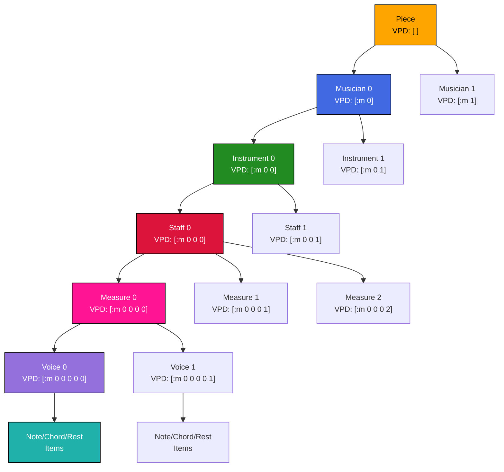
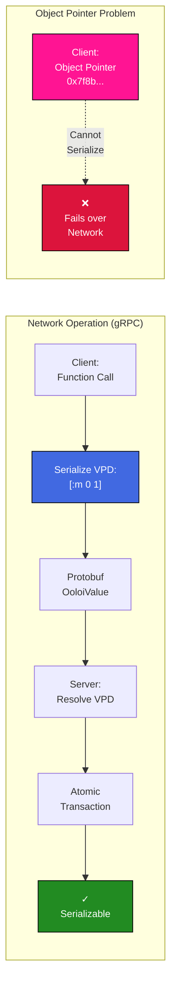
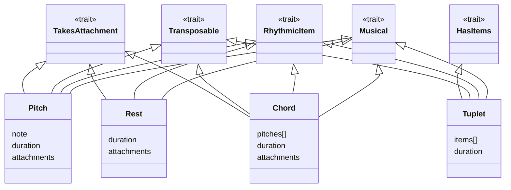
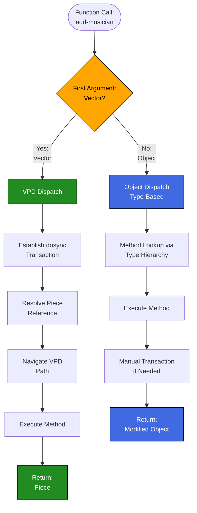

# Polymorphic API Guide: Talking to Ooloi

## Table of Contents

- [The Proof of the Pudding](#the-proof-of-the-pudding)
- [One Verb, Every Level](#one-verb-every-level)
- [Understanding the Mechanics](#understanding-the-mechanics)
- [Understanding Polymorphism in Ooloi](#understanding-polymorphism-in-ooloi)
  - [The Piece Reference Contract](#the-piece-reference-contract)
- [API Convenience: Why Use VPD Operations?](#api-convenience-why-use-vpd-operations)
  - [What You Get for Free with VPD Operations](#what-you-get-for-free-with-vpd-operations)
  - [When You Do Want STM: Easy Composition](#when-you-do-want-stm-easy-composition)
  - [Remote Atomic Operations: `SRV/atomic`](#remote-atomic-operations-srvatomic)
- [Type System Foundations](#type-system-foundations)
- [The Canonical Example: VPD vs Object Dispatch](#the-canonical-example-vpd-vs-object-dispatch)
- [Basic Polymorphic Operations](#basic-polymorphic-operations)
- [Cross-References](#cross-references)
- [Summary](#summary)
- [Related Documentation](#related-documentation)

## The Proof of the Pudding

Most musical software forces musicians to adapt to developer abstractions. Ooloi's API lets you think musically. Here's building "Twinkle, Twinkle Little Star" from scratch:

```clojure
(require '[ooloi.shared.api :as api])

(dosync
  (let [;; Create piece with musical context
        piece (api/create-piece :title "Twinkle, Twinkle Little Star")
        c-major (api/create-key-signature :mode :major :tonic "C")
        four-four (api/create-time-signature :descriptor "4/4")
        piece (api/set-key-signature [] piece 0 c-major)
        piece (api/set-time-signature [] piece 0 four-four)
        piece (api/set-tempo [] piece 0 {:bpm 120 :beat-unit 1/4})

        ;; Add musician with instrument
        soprano (api/create-musician :name "Soprano")
        piece (api/add-musician [] piece soprano)

        voice-inst (api/create-instrument :name "Voice")
        piece (api/add-instrument [:m 0] piece voice-inst)

        ;; Add staff with treble clef
        piece (api/add-staff [:m 0 0] piece (api/create-staff :name "Soprano" :default-clef "G"))

        ;; Add two measures to soprano staff
        piece (api/add-measure [:m 0 0 0] piece (api/create-measure))
        piece (api/add-measure [:m 0 0 0] piece (api/create-measure))

        ;; Add voices to soprano measures
        piece (api/add-voice [:m 0 0 0 0] piece (api/create-voice))
        piece (api/add-voice [:m 0 0 0 1] piece (api/create-voice))

        ;; First measure: "Twin-kle twin-kle" (4 quarter notes)
        piece (api/add-item [:m 0 0 0 0 0] piece (api/create-pitch :note "C4" :duration 1/4))
        piece (api/add-item [:m 0 0 0 0 0] piece (api/create-pitch :note "C4" :duration 1/4))
        piece (api/add-item [:m 0 0 0 0 0] piece (api/create-pitch :note "G4" :duration 1/4))
        piece (api/add-item [:m 0 0 0 0 0] piece (api/create-pitch :note "G4" :duration 1/4))

        ;; Second measure: "lit-tle star" (2 quarters + 1 half)
        piece (api/add-item [:m 0 0 0 1 0] piece (api/create-pitch :note "A4" :duration 1/4))
        piece (api/add-item [:m 0 0 0 1 0] piece (api/create-pitch :note "A4" :duration 1/4))
        piece (api/add-item [:m 0 0 0 1 0] piece (api/create-pitch :note "G4" :duration 1/2))

        ;; Add slur across the entire phrase (first note to last note)
        piece (api/add-attachment [:m 0 0 0 0 0 :items 0] piece :slur [:m 0 0 0 1 0 :items 2])]

    piece))  ; Transaction ensures all operations succeed atomically
```

Notice the vocabulary: `add-musician`, `add-staff`, `add-item`, `add-attachment :slur`. The code reads like musical instructions. The VPD paths like `[:m 0 0 0 0 0]` navigate the hierarchy: musician → instrument → staff → measure → voice → items. The `dosync` ensures all operations succeed or none do - atomic piece construction.

This same pattern - create structures, set properties, add items hierarchically - applies to anything building musical content: MusicXML importers, notation software plugins, algorithmic composition tools.

## One Verb, Every Level

The power: same operation works at any hierarchy depth. Traditional APIs require different functions for each level:

```clojure
;; Traditional approach
(add-musician-to-piece piece musician)
(add-instrument-to-musician musician instrument)
(add-staff-to-instrument instrument staff)
(add-voice-to-measure measure voice)

;; Ooloi: ONE function works at ANY level
(api/add-musician [] piece-id musician)
(api/add-instrument [:m 0] piece-id instrument)
(api/add-staff [:m 0 0] piece-id staff)
(api/add-measure [:m 0 0 0] piece-id measure)
```

Same verb, different depths:

```clojure
;; Piece level
(api/add-musician    []              piece-id musician)
(api/set-tempo       []              piece-id 0 tempo)

;; Musician level
(api/add-instrument  [:m 0]          piece-id instrument)
(api/set-name        [:m 0]          piece-id "Violin I")

;; Instrument level
(api/add-staff       [:m 0 0]        piece-id staff)
(api/set-clef        [:m 0 0]        piece-id :treble)

;; Staff level
(api/add-measure     [:m 0 0 0]      piece-id measure)

;; Measure level
(api/add-voice       [:m 0 0 0 0]    piece-id voice)

;; Voice level
(api/add-item        [:m 0 0 0 0 0]  piece-id note)

;; Pattern: api/add-* always means "add this thing to that place"
;; The VPD specifies "that place", the verb remains constant
```

The verb stays the same, only the VPD depth changes. This is the architectural benefit: learn one pattern, use it everywhere.

## Understanding the Mechanics

The polymorphic mechanism: first argument determines operation mode.

```clojure
(require '[ooloi.shared.api :as api])

;; VPD-based operations
(api/add-musician [] piece-id new-musician)       ; VPD path, then piece reference
(api/get-measure [:m 0 0 0] piece-id 5)          ; Navigate with VPD

;; Direct object operations
(api/add-musician piece-object new-musician)      ; Direct object operation
(api/get-measure voice-object 5)                  ; Direct object access

;; Same operation name, different dispatch based on first argument type
;; VPD = [:path] → requires piece reference as second argument
;; Object = direct → operates on object directly

;; Type-based dispatch enables musical operations:
(api/get-duration pitch-item)     ; Dispatches to Pitch implementation
(api/get-duration chord-item)     ; Dispatches to Chord implementation
(api/get-duration rest-item)      ; Dispatches to Rest implementation
```

VPDs serialize across gRPC; object pointers don't. This dual-mode design enables both local efficiency and network transparency.

## Understanding Polymorphism in Ooloi

First argument determines operation mode:

```clojure
;; VPD-based operation
(api/add-musician [] piece-reference musician)

;; Direct object operation
(api/add-musician piece-object musician)

;; Same function name, different dispatch based on first argument type
```

### The Piece Reference Contract

**VPD operations accept three forms of piece reference as the second argument:**

```clojure
;; 1. Piece value (the data structure itself)
(api/add-musician [] piece musician)

;; 2. Piece ID (string identifier)
(api/add-musician [] "piece-uuid-123" musician)

;; 3. Piece STM ref (Clojure ref to piece)
(api/add-musician [] piece-ref musician)
```

**The rule:** The second argument to any VPD operation may be a piece value, a piece-id string, or a piece STM ref. All three forms work identically - the VPD system resolves them to the piece automatically.

**Why three forms?**
- **Piece value**: Direct local operations on piece data
- **Piece ID**: Network operations via gRPC, lookup from piece manager
- **Piece STM ref**: Concurrent modifications using Clojure's STM

Throughout this guide, you'll see examples mixing `piece` and `piece-id`. Both are valid - choose based on your context.

### Piece Hierarchy and VPD Navigation



Each level adds one index: `[]` → `[:m 0]` → `[:m 0 0]` → `[:m 0 0 0 0 0]`.

### gRPC Serialization Compatibility

Object pointers don't serialize over networks. VPDs do:

```clojure
;; VPD operations serialize perfectly over gRPC
{:operation :add-musician
 :vpd []
 :piece-id "symphony-uuid"  
 :data {...}}  ; ✓ All data, no pointers

;; Object pointer operations cannot serialize
{:operation :add-musician
 :object #<Object 0x7f8b...>  ; ✗ Pointer useless over network
 :data {...}}

;; CRUCIAL: gRPC calls always use VPD pattern → always wrapped in transactions
;; This ensures atomicity and consistency across network boundaries
(grpc/add-musician [] "piece-id" musician)  ; Automatic transaction on remote server
```

**Visual comparison: Why VPDs work over gRPC while object pointers fail:**



VPDs are values (serializable paths), not pointers (memory addresses).

### Automatic Transaction Management
```clojure
;; VPD first argument → automatic STM transaction establishment
(api/add-musician [] piece-id musician)         ; Automatic dosync + piece resolution + path navigation

;; Object first argument → direct operation (manual transaction management)  
(dosync                                          ; Manual transaction required
  (api/add-musician piece-object musician))     ; Direct object operation

;; VPD pattern provides convenience AND composability
(dosync
  (api/add-musician [] piece-id musician1)      ; All VPD operations participate
  (api/add-instrument [:m 0] piece-id instrument)  ; in the same transaction
  (api/set-tempo [] piece-id 0 new-tempo))      ; atomically
```

#### **How to Require the API**

Both `api/` and `core/` work the same way in backend and frontend:

```clojure
;; Standard: require core with :refer :all
(require '[ooloi.shared.core :refer :all])
(add-musician [] piece-id musician)
(set-tempo [] piece-id 0 tempo)
;; :refer :all on core gives you the entire engine plus predicates

;; Standard: require api with alias
(require '[ooloi.shared.api :as api])
(api/add-musician [] piece-id musician)
(api/set-tempo [] piece-id 0 tempo)
```

**Frontend usage:** `SRV/` provides remote operations to the server:

```clojure
(require '[ooloi.frontend.server :as SRV])
(SRV/add-musician [] piece-id musician)
```

### The Three Pillars of Ooloi's Polymorphism

1. **First Argument Polymorphism**: Operations dispatch on VPD vs object
2. **Musical Type Polymorphism**: Operations dispatch based on musical element types (pitches, chords, rests)  
3. **Universal Hierarchy Access**: Same operation works at any level through VPD addressing

## API Convenience: Why Use VPD Operations?

Direct use of `alter`, `ref`, and low-level STM operations remains available, but the VPD API provides a higher-level abstraction that handles STM complexity automatically.

Compare:

```clojure
;; Low-level approach: Manual STM management (implementation focus)
(let [piece-ref (api/get-piece-ref piece-id)]
  (dosync
    (alter piece-ref assoc-in [:musicians 0 :instruments 0 :staves 0 :measures 5] new-measure)))
;; Developer thinks about: refs, transactions, verbose paths, error handling
;; Note: assoc-in requires verbose form - compact VPDs don't work here

;; Platform approach: VPD operations (musical focus)
(api/set-measure [:m 0 0 0] piece-id 5 new-measure)
;; Developer thinks about: "set measure 5 in the first staff"
;; Compact VPDs work with Ooloi's API - another advantage of the platform approach

;; The VPD API abstracts away implementation complexity while providing musical clarity
```

### What You Get for Free with VPD Operations

- **Automatic transactions**: No need to manage `dosync` coordination yourself
- **gRPC compatibility**: Operations serialize across network boundaries seamlessly
- **Runtime validation**: Built-in validation and helpful error messages
- **Future-proofing**: Implementation can evolve without breaking your code
- **Consistency**: All operations follow identical patterns throughout the system

### When You Do Want STM: Easy Composition

```clojure
;; Compose multiple VPD operations in one transaction
(dosync
  (api/add-musician [] piece-id musician1)
  (api/add-instrument [:m 0] piece-id instrument)
  (api/set-tempo [] piece-id 0 new-tempo))
;; Atomic composition without managing STM complexity
```

Use `dosync` for atomic composition; VPD operations handle individual transactions automatically.

### Remote Atomic Operations: `SRV/atomic`

When the frontend needs to execute multiple operations atomically on the server, use `SRV/atomic`:

```clojure
;; Frontend: Execute multiple operations atomically on the server
(SRV/atomic [{:method-name :set-name
              :vpd [:m 0]
              :piece-id "symphony-1"
              :parameters ["Violin I"]}
             {:method-name :set-key-signature
              :vpd [:m 0 0 0 0 0]
              :piece-id "symphony-1"
              :parameters ["G major"]}])
```

**When to use `SRV/atomic`:**
- **Remote atomic batches**: Frontend needs multiple operations to execute atomically on the server
- **Batch imports**: MusicXML/MIDI import operations that must succeed or fail atomically
- **Collaborative editing**: Multiple user operations that must be coordinated atomically
- **Undo/redo chains**: Complex operation sequences that form logical units

**Backend usage note:**
Backend code should use `dosync` directly instead of `api/atomic`. This provides the same transactional guarantees with less overhead.

**Operation format:**
Each operation in the collection requires:
- `:method-name` (keyword) - The VPD API method to call (e.g., `:set-name`, `:add-measure`)
- `:vpd` (vector) - Vector Path Descriptor targeting the musical element
- `:piece-id` (string) - Identifier of the piece to modify  
- `:parameters` (vector) - Arguments to pass to the method

**ACID behavior:**
- **Atomicity**: All operations succeed together or all fail together
- **Consistency**: Piece remains in valid state throughout
- **Isolation**: Concurrent operations don't see partial state
- **Durability**: Changes are persisted once transaction completes

This function integrates with Ooloi's STM-gRPC system to provide remote atomic batch execution for musical notation operations.

### Platform Abstraction: What the API Brings vs. How It Does It

Ooloi's API operates as a platform by hiding implementation complexity while exposing musical capability:

**What the API Brings (Musical Focus):**
- Operations that mirror musical thinking: `add-musician`, `(make-transposer :down :perfect :fifth)`, `set-tempo`
- Universal hierarchy navigation: same functions work at any structural level
- Type-safe musical reasoning: `pitch?`, `rhythmic-item?`, `transposable?`
- Automatic temporal coordination through timewalk
- Seamless local/remote operation compatibility

**What the API Hides (Implementation Details):**
- Complex metadata-driven method dispatch with nine-category system
- STM transaction coordination and conflict resolution
- VPD-to-object resolution and path validation
- Network serialization and gRPC protocol handling
- Memory optimization through lazy settings and structural sharing

**Example of Platform Abstraction Success:**
```clojure
;; Musical intent: "Add forte marking to third beat of measure 5"
(add-attachment [:m 0 0 0 0 4 :items 2] piece-id (create-dynamic :forte))

;; Hidden complexity: VPD resolution, STM transaction, type validation,
;; attachment lifecycle, piece modification, change propagation, network sync
```

This demonstrates how domain expertise can translate directly to programming capability.

**For more advanced patterns, see [Advanced Concurrency Patterns](ADVANCED_CONCURRENCY_PATTERNS.md#-critical-development-principle-never-use-alter).**

## Type System Foundations

### Musical Traits and What They Mean

Ooloi organizes musical elements using **traits** - capabilities that determine what operations work with each type. Understanding these traits helps you know which API operations are available for each musical element.

**The five core traits:**

| Trait | Meaning | Example Operations |
|-------|---------|-------------------|
| **Musical** | Basic musical element | All core musical operations |
| **RhythmicItem** | Has duration | `get-duration`, `set-duration` |
| **Transposable** | Can change pitch | `transpose-element` |
| **TakesAttachment** | Can have attachments | `add-attachment` (slurs, dynamics) |
| **HasItems** | Contains other elements | `add-item`, `get-items` |

**Musical Type Capability Matrix:**

```clojure
;;                    Musical  Rhythmic  Transposable  TakesAttachment  HasItems
;; Pitch              ✓        ✓         ✓             ✓                ✗
;; Chord              ✓        ✓         ✓             ✓                ✗
;; Rest               ✓        ✓         ✗             ✓                ✗
;; Tuplet             ✓        ✓         ✓             ✗                ✓
;; Tremolando         ✓        ✓         ✓             ✗                ✓
```

**Key insights:**
- **Pitch** has duration, can be transposed, and can have attachments (slurs, dynamics)
- **Rest** has duration and can have attachments, but cannot be transposed (you can't transpose silence)
- **Tuplet** contains other items and can be transposed as a group
- **Chord** has all the same capabilities as Pitch (duration, transposable, takes attachments)

**Visual representation:**



### Using Traits in Your Code

Ooloi provides predicate functions to filter elements by their capabilities:

```clojure
;; Filter by trait using predicate functions
(filter rhythmic-item? musical-elements)      ; All elements with duration
(filter transposable? musical-elements)       ; Elements that can be transposed
(filter takes-attachment? musical-elements)   ; Elements that can have slurs, dynamics

;; Practical example: transpose only transposable elements
(defn transpose-elements [elements transposer]
  "Transpose only elements that support transposition."
  (->> elements
       (filter transposable?)              ; Pitches, chords, tuplets (not rests)
       (map transposer)))                  ; Apply transposition

;; Mixed collection - only some elements get transposed
(def mixed-elements [pitch1 chord1 rest1 tuplet1])
(transpose-elements mixed-elements (make-transposer :chromatic 4))
;; => Only pitch1, chord1, tuplet1 affected (rest1 skipped)
```

This trait system determines which polymorphic operations work with each musical element type.

## The Canonical Example: VPD vs Object Dispatch

### The First Argument Pattern

> **Dispatch Resolution Decision Tree**:



The **VPD vs object dispatch** is the foundation of Ooloi's polymorphic architecture:

```clojure
;; THE POLYMORPHIC MECHANISM: Same function name, different dispatch

;; VPD-based dispatch (vector first argument)
(m/defmethod add-musician clojure.lang.PersistentVector
  [vpd piece-reference musician]
  (let [piece-ref (pm/get-piece-ref piece-reference)]    ; Automatic piece resolution
    (dosync                                              ; Automatic transaction
      (alter piece-ref update-in vpd conj musician))))   ; VPD navigation

;; Object-based dispatch (object first argument)  
(m/defmethod add-musician ::h/Piece  
  [piece musician]
  ;; Direct operation, no automatic transaction
  (update piece :musicians conj musician))

;; Same function name → different implementations based on first argument type
```

**Location**: VPD operations generated automatically by macro system. Interfaces defined in `shared/interfaces.clj`, backend implementations in `backend/models/core.clj`

### Why This Pattern is Important

```clojure
;; ONE FUNCTION WORKS AT EVERY LEVEL:

;; Set key signature at piece level
(api/set-key-signature [] piece-id 0 c-major)

;; Set key signature at musician level
(api/set-key-signature [:m 0] piece-id 0 d-major)

;; Set key signature at instrument level
(api/set-key-signature [:m 0 0] piece-id 0 e-major)

;; Set key signature at staff level
(api/set-key-signature [:m 0 0 0] piece-id 0 f-major)

;; Traditional APIs would need different functions for each level
```

### Automatic Transaction Management

```clojure
;; VPD pattern automatically handles STM coordination:
(api/add-musician [] piece-id musician1)              ; Automatic dosync
(api/add-instrument [:m 0] piece-id inst)     ; Automatic dosync  
(api/set-tempo [] piece-id 0 new-tempo)               ; Automatic dosync

;; Multiple VPD operations compose in outer transaction:
(dosync
  (api/add-musician [] piece-id musician1)            ; All participate in
  (api/add-instrument [:m 0] piece-id inst)   ; same atomic transaction
  (api/set-tempo [] piece-id 0 new-tempo))            ; automatically
```

### gRPC Network Compatibility

```clojure
;; VPD operations serialize perfectly for remote calls:
{:operation "add-musician"
 :vpd []                          ; ✓ Pure data - serializes
 :piece-id "symphony-uuid"        ; ✓ String ID - serializes  
 :musician {...}}                 ; ✓ Data map - serializes

;; Object operations cannot work over network:
{:operation "add-musician"  
 :piece #<Object 0x7f8b...>}      ; ✗ Object pointer - cannot serialize

;; Result: All gRPC calls use VPD pattern → automatic transactions across network
```

## Basic Polymorphic Operations

### Understanding Return Values

VPD operations ALWAYS return the piece:

```clojure
;; VPD form guarantees piece return
(let [piece (api/add-musician [] piece-id musician)]     ; Returns piece
      piece (api/set-tempo [] piece 0 {:bpm 120})]      ; Returns piece
  piece)  ; Guaranteed to be the updated piece
```

**Object operations return what was changed:**

```clojure
;; Object form returns the modified object
(let [musician (api/add-instrument musician instrument)]  ; Returns modified musician (not piece)
      instrument (api/add-staff instrument staff)]        ; Returns modified instrument (not piece)
  ...)

;; Exception: Settings operations that modify the piece
(let [piece (api/set-tempo piece 0 {:bpm 120})]         ; Returns piece (tempo stored ON piece)
  piece)  ; Works because tempo is a piece-level setting
```

**Why this matters:**

| Form | Returns | Use Case | Threading |
|------|---------|----------|-----------|
| **VPD** | Always piece | Modifying piece structure | ✓ Safe with let rebinding |
| **Object** | Modified object | Direct object manipulation | ⚠️ May not return piece |

**Golden Rule:** When threading multiple piece modifications, **always use VPD form** for guaranteed piece return.

### Duration Operations Across Types

```clojure
;; Duration operations work polymorphically across musical elements:
(require '[ooloi.shared.api :as api])

;; Different types, same operation
(api/get-duration pitch-object)     ; => 1/4 (quarter note)
(api/get-duration chord-object)     ; => 1/2 (half note)  
(api/get-duration rest-object)      ; => 1/8 (eighth rest)

;; Setting duration works the same way
(api/set-duration pitch-object 1/16)   ; Creates sixteenth note
(api/set-duration chord-object 1)      ; Creates whole note chord
(api/set-duration rest-object 1/2)     ; Creates half rest
```

### Expressive Attachment API

Compare adding a slur:

```clojure
;; Traditional approach: Manual ID management
(def slur (new Slur()))
(.setStartNote slur start-note)
(.setEndNote slur end-note)
(.setStartId slur (getId start-note))
(.setEndId slur (getId end-note))
(.addToScore score slur)

;; Ooloi: Musical intent
(add-attachment start-vpd piece "slur" end-vpd)
```

**Musical Expression Through Direct Terminology:**

```clojure
;; Local operations – direct object manipulation
(add-attachment pitch "staccato")        ; "Make this note staccato"
(add-attachment pitch "f")                ; "Make this note forte"
(add-attachment chord "accent")           ; "Accent this chord"

;; VPD operations – navigation + action in one expression
(add-attachment [:m 0 0 0 2 0 :items 3] piece "tenuto")         ; "Third note: tenuto"
(add-attachment [:m 0 0 0 2 0 :items 0] piece "slur"            ; "Slur from first note
                [:m 0 0 0 2 0 :items 5])                        ;  to sixth note"

;; Span attachments – start and end points clearly expressed
(add-attachment start-vpd piece "cresc" end-vpd)  ; "Crescendo from here to there"
(add-attachment start-vpd piece "8va" end-vpd)    ; "Play octave higher from here to there"
(add-attachment start-vpd piece "tie" end-vpd)    ; "Tie these two notes"
```

**Abstraction in Practice – Building Musical Phrases:**

```clojure
;; The developer focuses on musical intent (using VPD form with let rebinding)
(let [piece (add-attachment [:m 0 0 0 0 0 :items 0] piece "p")              ; Piano dynamic
      piece (add-attachment [:m 0 0 0 0 0 :items 0] piece "slur"            ; Opening slur
                            [:m 0 0 0 0 0 :items 3])
      piece (add-attachment [:m 0 0 0 0 0 :items 2] piece "accent")         ; Accent second note
      piece (add-attachment [:m 0 0 0 0 0 :items 4] piece "cresc"           ; Crescendo to end
                            [:m 0 0 0 0 0 :items 7])
      piece (add-attachment [:m 0 0 0 0 0 :items 7] piece "f")]             ; Forte at climax
  piece)

;; No endpoint IDs, no graph wiring, no object lifecycle management
;; The API handles all implementation mechanics automatically
```

**Flexible Input Forms** (keywords, symbols, or strings):

```clojure
;; All three forms work identically – use what reads best in context
(add-attachment pitch "staccato")   ; String – clear and explicit
(add-attachment pitch :f)           ; Keyword – concise for short markings
(add-attachment pitch 'tenuto)      ; Symbol – alternative style
```

**Available Musical Vocabulary:**

The API provides 200+ operations and will continue to grow as development proceeds:
- **Articulations**: `staccato`, `tenuto`, `marcato`, `accent`
- **Dynamics**: `ffff` through `pppp`, sforzando combinations (`sf`, `sfz`, `sfp`)
- **Hairpins**: Any combination of `<` and `>` symbols (e.g., `cresc`, `dim`, `<>`, `<><`, `><>`)
- **Span markings**: `slur`, `tie`, `glissando`
- **Octave shifts**: `15ma`, `8va`, `8vb`, `15mb`

For specialized cases not covered by shortcuts, use constructor functions directly:

```clojure
(def custom-marking (create-dynamic :name "custom" :velocity 85))
(add-attachment pitch custom-marking)
```

### Attachment Operations with Type Constraints

```clojure
;; Attachments work only with elements that support them:
(api/add-attachment pitch-object "staccato")    ; ✓ Works (Pitch implements TakesAttachment)
(api/add-attachment chord-object "f")           ; ✓ Works (Chord implements TakesAttachment)
(api/add-attachment rest-object "tenuto")       ; ✓ Works (Rest implements TakesAttachment)

;; Type-safe filtering before operations
(defn add-marking-to-compatible [elements marking]
  "Add marking only to elements that can take attachments."
  (->> elements
       (filter takes-attachment?)                          ; Type-safe filtering
       (map #(api/add-attachment % marking))))             ; Safe operation

;; Usage with mixed elements
(def mixed [pitch1 chord1 rest1 tuplet1])
(add-marking-to-compatible mixed "staccato")  ; Only pitch1, chord1, rest1 get marking
```

### Collection Operations with HasItems

```clojure
;; HasItems trait enables collection operations:
(api/get-items tuplet-object)        ; Returns vector of items in tuplet (can be anything, nest arbitrarily)
(api/add-item tuplet-object pitch)   ; Adds pitch to tuplet
(api/get-item tuplet-object 2)       ; Gets third item in tuplet

(api/get-items measure-object)       ; Returns vector of voices
(api/add-item measure-object chord)  ; Adds chord to measure

;; Use standard predicate from core

(filter has-items? [pitch1 tuplet1 measure1])          ; => [tuplet1 measure1]
```

**Note:** For filtering specific musical element types like pitches and chords, use the [timewalker](TIMEWALKING_GUIDE.md) which provides powerful traversal and filtering capabilities.

### Full Piece Roundtrip with SRV

The ultimate demonstration of the polymorphic API's power:

```clojure
;; Frontend can download the entire piece
(require '[ooloi.frontend.server :as SRV])
(def piece (SRV/get-piece [] piece-id))

;; Modify locally with full API access
(let [piece (api/set-tempo [] piece 0 {:bpm 140})
      piece (api/add-musician [] piece musician)
      piece (api/set-key-signature [:m 0] piece 0 f-major)]

  ;; Write back with full roundtrip identity
  (SRV/set-piece [] piece-id piece))
```

**Roundtrip identity applies to all data structures** - defrecord instances, maps, everything handled by the SRV API and api namespace. Any musical element can be read from the server, modified locally using api/ functions, and set back on the server using SRV/:

```clojure
;; Works for any element, not just pieces
(def musician (SRV/get-musician [:m 0] piece-id))
(def updated-musician (api/set-name musician "First Violin"))
(SRV/set-musician [:m 0] piece-id updated-musician)
```

## Cross-References

### **Implementation Details**
- **Type system implementation**: See `shared/src/main/clojure/ooloi/shared/hierarchy.clj` for complete type definitions
- **Shared interfaces**: See `shared/src/main/clojure/ooloi/shared/interfaces.clj` for multimethod definitions
- **Backend implementations**: See `backend/src/main/clojure/ooloi/backend/models/` for backend-specific multimethod implementations  

### **Related Guides**
- **VPD integration**: See [VPDs Guide](VPDs.md) for path-based operation patterns
- **Piece management**: See [Piece Manager Guide](PIECE_MANAGER_GUIDE.md) for `get-piece-ref` usage patterns
- **Musical traversal**: See [Timewalking Guide](TIMEWALKING_GUIDE.md) for type-aware traversal examples

### **Architectural Foundations**
- **Tree structure**: See [ADR-0010: Pure Trees](../ADRs/0010-Pure-Trees.md) for the hierarchical structure that VPD navigation operates on
- **VPD system**: See [ADR-0008: VPDs](../ADRs/0008-VPDs.md) for the architectural decision behind Vector Path Descriptors used throughout the polymorphic API
- **gRPC compatibility**: See [ADR-0002: gRPC](../ADRs/0002-gRPC.md) for why VPD serialization enables frontend-backend communication
- **Language foundations**: See [ADR-0000: Clojure](../ADRs/0000-Clojure.md) for the language choice enabling multimethod polymorphism

## Summary

> **Architectural Achievement**: Ooloi demonstrates how functional programming enables domain expertise to become the programming model - not the other way around.

Ooloi's polymorphic API represents type-driven architecture that achieves flexibility while maintaining safety and performance:

**Key insights:**
1. **Trait-based types** define which operations work with each musical element
2. **Dual-mode dispatch** provides VPD and object operation modes
3. **VPD operations** enable universal hierarchy access and automatic transactions
4. **Musical predicates** enable filtering and type-aware operations
5. **Consistent patterns** make the API predictable and easy to use

**Architectural advantages:**
- **Developer experience**: Simple, consistent APIs that match musical thinking
- **Type safety**: Trait system ensures operations only work with compatible elements
- **Network compatibility**: VPD operations serialize across gRPC automatically
- **Transaction guarantees**: Automatic atomicity for piece modifications
- **Maintainability**: Centralized type definitions and consistent operation patterns

This polymorphic foundation enables all the APIs demonstrated throughout Ooloi's other architectural guides. Understanding these patterns improves your ability to work with Ooloi's musical type system.

## Related Documentation

### Next Steps in Learning
- **[VPDs.md](VPDs.md)** - Deep dive into Vector Path Descriptors and addressing patterns
- **[PIECE_MANAGER_GUIDE.md](PIECE_MANAGER_GUIDE.md)** - STM-based storage operations using the type system
- **[TIMEWALKING_GUIDE.md](TIMEWALKING_GUIDE.md)** - Temporal traversal patterns leveraging polymorphic dispatch

### Advanced Applications
- **[FRONTEND_ARCHITECTURE_GUIDE.md](FRONTEND_ARCHITECTURE_GUIDE.md)** - How the frontend renders, caches, and interacts with typed musical structures
- **[GRPC_COMMUNICATION_AND_FLOW_CONTROL.md](GRPC_COMMUNICATION_AND_FLOW_CONTROL.md)** - How the type system enables seamless network serialization
- **[OOLOI_SERVER_ARCHITECTURAL_GUIDE.md](OOLOI_SERVER_ARCHITECTURAL_GUIDE.md)** - Server architecture built on these polymorphic foundations
- **[ADVANCED_CONCURRENCY_PATTERNS.md](ADVANCED_CONCURRENCY_PATTERNS.md)** - Complex STM coordination using type-driven operations