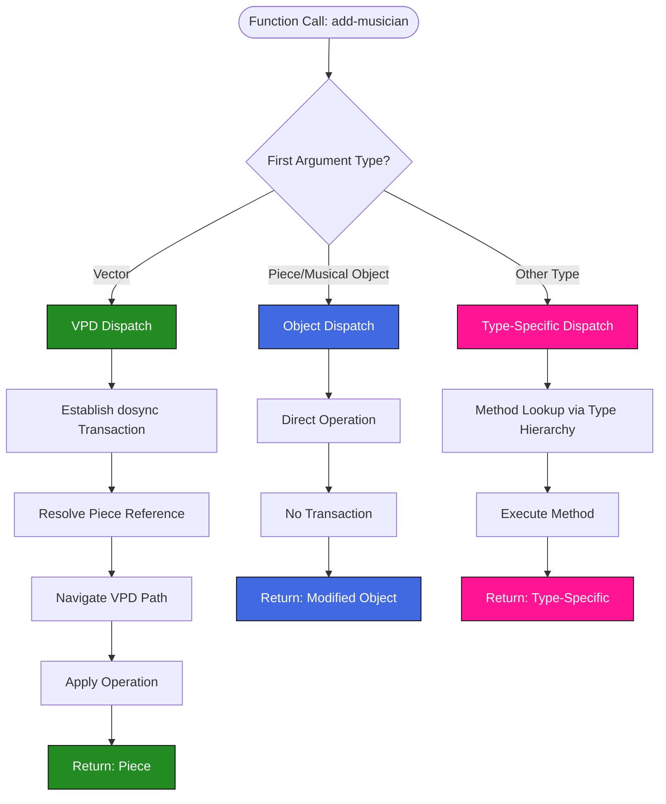

# 🟠 Polymorphic API Guide: Type-Driven Elegance in Musical Software

Most musical software requires musicians to adapt to developer abstractions. Ooloi takes a different approach: polymorphic dispatch allows musical thinking to drive the programming model.

This reference examines how Clojure's type system and multimethods create APIs where:
- Musical concepts map directly to code operations
- Operations work consistently at any hierarchy level through VPDs  
- Network serialisation occurs automatically via type system design
- Performance scales appropriately for real-time musical applications

Topics covered:
- Dual-mode polymorphism: VPD vs object dispatch patterns for local and network operations
- Musical type hierarchies: Using `derive`/`isa?` to model musical relationships functionally
- Advanced multimethods: Methodical library for aspect-oriented musical operations
- Extension patterns: Adding new types that integrate with existing operations

This guide combines API documentation with functional architecture principles demonstrated through musical examples.

---

## Table of Contents

- [Quick Start](#quick-start)
- [Why This Guide Matters](#why-this-guide-matters)
- [Overview](#overview)
- [Prerequisites](#prerequisites)
- [Understanding Polymorphism in Ooloi](#understanding-polymorphism-in-ooloi)
- [🟢 Type System Foundations](#-type-system-foundations)
- [🟢 The Canonical Example: VPD vs Object Dispatch](#-the-canonical-example-vpd-vs-object-dispatch)
- [🟢 Basic Polymorphic Operations](#-basic-polymorphic-operations)
  - [Duration Operations Across Types](#duration-operations-across-types)
  - [Expressive Attachment API – Musical Thinking in Code](#expressive-attachment-api--musical-thinking-in-code)
  - [Attachment Operations with Type Constraints](#attachment-operations-with-type-constraints)
  - [Collection Operations with HasItems](#collection-operations-with-hasitems)
- [🟡 Multimethod Architecture](#-multimethod-architecture)
- [🟡 VPD Integration with Type System](#-vpd-integration-with-type-system)
- [🟡 Extension Mechanisms](#-extension-mechanisms)
  - [Adding New Musical Types](#adding-new-musical-types)  
  - [Adding New Operations](#adding-new-operations)
- [🟡 Trait-Based Dispatch Patterns](#-trait-based-dispatch-patterns)
- [🔴 Advanced Dispatch Patterns](#-advanced-dispatch-patterns)
- [🔴 Performance Optimization](#-performance-optimization)
- [Real-World Integration Patterns](#real-world-integration-patterns)
- [Best Practices](#best-practices)
- [Common Patterns](#common-patterns)
- [Troubleshooting](#troubleshooting)
- [Cross-References](#cross-references)
- [Next Steps](#next-steps)

## Quick Start

**Need to understand polymorphic operations right now?** Here's the essential code:

```clojure
(require '[ooloi.backend.api :as api])

;; THE POLYMORPHIC MECHANISM: First argument determines operation mode

;; VPD-based operations
(api/add-musician [] piece-id new-musician)              ; VPD path, then piece reference
(api/get-measure [:m 0 0 0] piece-id 5)  ; VPD navigation (compact form)

;; Direct object operations  
(api/add-musician piece-object new-musician)             ; Direct object operation
(api/get-measure voice-object 5)                         ; Direct object access

;; Same operation name, different call signatures based on first argument!
;; VPD = [:path] → requires piece reference as second argument
;; Object = direct → operates on object directly

;; Type-based dispatch enables musical operations:
(api/get-duration pitch-item)     ; Dispatches to Pitch implementation
(api/get-duration chord-item)     ; Dispatches to Chord implementation  
(api/get-duration rest-item)      ; Dispatches to Rest implementation

;; This enables gRPC compatibility: VPDs serialize, object pointers don't!
```

The following sections explain the type system architecture that enables this behaviour.

## Overview

Ooloi's polymorphic API represents a type-driven software architecture approach in a dynamic language. The API reflects how musicians think about and work with music, rather than forcing musical concepts into programming abstractions.

**The API achieves musical abstraction by eliminating the gap between musical concepts and computational operations:**

- **Musical vocabulary**: `add-musician`, `set-tempo`, `(make-transposer :up :major :second)` - functions use terms musicians understand
- **Musical hierarchy**: VPD paths like `[:m 0 0 0]` mirror how musicians navigate scores  
- **Musical operations**: Actions respect musical relationships and constraints automatically
- **Musical predicates**: `pitch?`, `chord?`, `rhythmic-item?` enable musical reasoning in code

**The dual-mode architecture makes complex musical operations straightforward:**

```clojure
;; Same function works with objects or paths - reduces cognitive load
(add-musician musician-object new-musician)         ; Direct object manipulation
(add-musician [] piece-id new-musician)             ; Path-based operation

;; Musical thinking maps directly to code
(api/add-musician [] piece-id violin-musician)      ; "Add violin to the piece"
(api/set-tempo [] piece-id 0 allegro-tempo)         ; "Set opening tempo"
(api/get-measure [:m 0 0 0] piece-id 5)           ; "Get measure 5 from first staff"

;; Complex operations through simple composition
(sequence (comp (timewalk {:boundary-vpd melody-voice})
                (filter pitch??)
                (map (comp (make-transposer :up :major :third) item)))
          [piece])                                  ; "Transpose melody up major third"
```

The API allows musical concepts to serve as the programming abstractions directly.

Through careful design of hierarchical types, trait-based dispatch, and polymorphic operations, it achieves flexibility while maintaining type safety and performance.

**Key capabilities:**
- **Dual dispatch modes**: Same operations work with direct objects or VPD paths seamlessly
- **Type-based dispatch**: Operations automatically choose correct implementation based on musical element type
- **Trait composition**: Musical elements gain capabilities through cross-cutting type relationships (not OOP inheritance)
- **Extension-friendly**: New types integrate seamlessly with existing operations
- **Performance-optimized**: Sophisticated dispatch strategies balance flexibility with speed

**Architectural foundations:**
- **Hierarchical type system**: Using Clojure's `derive` and `isa?` for hierarchical inheritance
- **Methodical multimethods**: Advanced polymorphic dispatch beyond standard Clojure multimethods
- **VPD integration**: Type system enables universal path-based operations
- **Macro-generated consistency**: 200+ operations follow identical polymorphic patterns

## Prerequisites

- **Basic Clojure knowledge**: Comfortable with maps, vectors, keywords, and basic functions
- **Ooloi familiarity**: Understanding of pieces, VPDs, and basic musical structures
- **Optional**: Experience with Clojure multimethods (explained from first principles)

## Understanding Polymorphism in Ooloi

### What is Polymorphism?

**Polymorphism** means "one interface, many implementations." In Ooloi, this enables API flexibility while maintaining **data-oriented design principles**:

```clojure
;; THE REAL POLYMORPHIC MAGIC: First argument determines operation mode

;; VPD-based operation (universal hierarchy access)
(api/add-musician [] piece-reference musician)       ; VPD path → piece reference required

;; Direct object operation (traditional approach)  
(api/add-musician piece-object musician)             ; Object → direct operation

;; Same function name, completely different dispatch based on first argument type!
```

### Why First Argument Polymorphism is Important

The **VPD vs object dispatch** solves fundamental problems in musical software architecture while providing **cognitive alignment** with musical thinking:

#### **Universal Hierarchy Access**

> 💡 **Key Architectural Insight**: Traditional APIs require different functions for each hierarchy level, forcing developers to think about implementation structure. Ooloi's polymorphic dispatch enables **one operation at any level**.

```clojure
;; Traditional approach: Different functions for different levels (cognitive burden)
(add-musician-to-piece piece musician)
(add-instrument-to-musician musician instrument)  
(add-staff-to-instrument instrument staff)
(add-measure-to-voice voice measure)

;; Ooloi's approach: ONE function works at ANY level (natural musical thinking)
(api/add-musician [] piece-id musician)                              ; "Add musician to piece"
(api/add-instrument [:m 0] piece-id instrument)              ; "Add instrument to first musician"
(api/add-staff [:m 0 0] piece-id staff)         ; "Add staff to instrument"
(api/add-measure [:m 0 0 0 0] piece-id measure)  ; "Add measure to voice"

;; This mirrors how musicians think: "add X to Y" regardless of hierarchy level
```

**Visual demonstration of consistent verbs across hierarchy levels:**

```clojure
;; Same verb, different depths - the API adapts to the VPD target

;; Level 1: Piece level
(api/add-musician    []              piece-id musician)     ; Add to piece root
(api/set-tempo       []              piece-id 0 tempo)      ; Set piece-level property

;; Level 2: Musician level
(api/add-instrument  [:m 0]          piece-id instrument)   ; Add to musician 0
(api/set-name        [:m 0]          piece-id "Violin I")   ; Set musician property

;; Level 3: Instrument level
(api/add-staff       [:m 0 0]        piece-id staff)        ; Add to instrument 0
(api/set-clef        [:m 0 0]        piece-id :treble)      ; Set instrument property

;; Level 4: Staff level
(api/add-voice       [:m 0 0 0]      piece-id voice)        ; Add to staff 0

;; Level 5: Voice level
(api/add-measure     [:m 0 0 0 0]    piece-id measure)      ; Add to voice 0

;; Level 6: Measure level
(api/add-item        [:m 0 0 0 0 0]  piece-id note)         ; Add to measure 0

;; Pattern: api/add-* always means "add this thing to that place"
;; The VPD specifies "that place", the verb remains constant
```

**Key insight:** The verb stays the same (`add-*`, `set-*`, `get-*`), only the VPD depth changes. This is **cognitive alignment** - you think "add musician", "add instrument", "add note" regardless of where in the hierarchy you're working.

#### **gRPC Serialization Compatibility**  

> ⚠️ **Critical Design Decision**: Object pointers don't serialize over networks. VPD-first design ensures **identical API locally and remotely**.

```clojure
;; VPD operations serialize perfectly over gRPC
{:operation :add-musician
 :vpd []
 :piece-id "symphony-uuid"  
 :data {...}}  ; ✓ All data, no pointers

;; Object pointer operations cannot serialize
{:operation :add-musician
 :object #<Object 0x7f8b...>  ; ✗ Pointer useless over network
 :data {...}}

;; CRUCIAL: gRPC calls always use VPD pattern → always wrapped in transactions
;; This ensures atomicity and consistency across network boundaries!
(grpc/add-musician [] "piece-id" musician)  ; Automatic transaction on remote server
```

**Visual comparison: Why VPDs work over gRPC while object pointers fail:**

```mermaid
flowchart LR
    subgraph Local["Local Operation (In-Process)"]
        L1[Function Call] --> L2[Object Pointer: 0x7f8b...]
        L2 --> L3[Direct Memory Access]
        L3 --> L4[Fast ✓]
        style L2 fill:#FFA500,stroke:#000,color:#000
        style L4 fill:#228B22,stroke:#000,color:#fff
    end

    subgraph Remote["Network Operation (gRPC)"]
        R1[Client: Function Call] --> R2[Serialize VPD: \[:m 0 1\]]
        R2 --> R3[Send JSON over gRPC]
        R3 --> R4[Server: Resolve VPD]
        R4 --> R5[Atomic Transaction]
        R5 --> R6[Serializable ✓]
        style R2 fill:#4169E1,stroke:#000,color:#fff
        style R6 fill:#228B22,stroke:#000,color:#fff
    end

    subgraph Problem["Object Pointer Problem"]
        P1[Client: Object Pointer 0x7f8b...] -.->|Cannot Serialize| P2[❌ Fails over Network]
        style P1 fill:#FF1493,stroke:#000,color:#fff
        style P2 fill:#DC143C,stroke:#000,color:#fff
    end
```

**Key insight:** VPDs are *values* (serializable paths), not *pointers* (memory addresses). This enables identical API semantics locally and remotely.

#### **Automatic Transaction Management**
```clojure
;; VPD first argument → automatic STM transaction establishment
(api/add-musician [] piece-id musician)         ; Automatic dosync + piece resolution + path navigation

;; Object first argument → direct operation (manual transaction management)  
(dosync                                          ; Manual transaction required
  (api/add-musician piece-object musician))     ; Direct object operation

;; VPD pattern provides convenience AND composability
(dosync
  (api/add-musician [] piece-id musician1)      ; All VPD operations participate
  (api/add-instrument [:m 0] piece-id instrument)  ; in the same transaction
  (api/set-tempo [] piece-id 0 new-tempo))      ; atomically
```

#### **Consistent API Across Contexts**
```clojure
;; Same operation works in different contexts:
(api/add-musician [] piece-id musician)          ; Local operation
(grpc/add-musician [] "piece-id" musician)       ; Remote operation (same signature!)
(batch/add-musician [] piece-id musician)        ; Batch operation

;; The VPD polymorphism enables this consistency
```

### The Three Pillars of Ooloi's Polymorphism

1. **First Argument Polymorphism**: Operations dispatch on VPD vs object
2. **Musical Type Polymorphism**: Operations dispatch based on musical element types (pitches, chords, rests)  
3. **Universal Hierarchy Access**: Same operation works at any level through VPD addressing

## 💡 API Convenience: Why Use VPD Operations?

**Before diving into the type system, understand why Ooloi's VPD API makes development so much easier:**

Direct use of `alter`, `ref`, and low-level STM operations remains available, but the VPD API provides a higher-level abstraction.

The VPD API handles STM complexity automatically, providing the benefits of Ooloi's concurrent, distributed, and gRPC-compatible design with simpler code.

### Compare the Approaches

> 💡 **Platform Design Principle**: Hide implementation complexity, expose domain capability. Notice how the VPD approach shifts cognitive focus from technical concerns to musical intent.

```clojure
;; Low-level approach: Manual STM management (implementation focus)
(let [piece-ref (api/get-piece-ref piece-id)]
  (dosync
    (alter piece-ref assoc-in [:m 0 0 0 5] new-measure)))
;; Developer thinks about: refs, transactions, paths, error handling

;; Platform approach: VPD operations (musical focus)
(api/set-measure [:m 0 0 0] piece-id 5 new-measure)
;; Developer thinks about: "set measure 5 in the first voice"

;; The VPD API abstracts away implementation complexity while providing musical clarity
```

### What You Get for Free with VPD Operations

- **Automatic transactions**: No need to manage `dosync` coordination yourself
- **gRPC compatibility**: Operations serialize across network boundaries seamlessly  
- **Type safety**: Built-in validation and helpful error messages
- **Future-proofing**: Implementation can evolve without breaking your code
- **Consistency**: All operations follow identical patterns throughout the system

### When You Do Want STM: Easy Composition

```clojure
;; 😎 Compose multiple VPD operations in one transaction - best of both worlds
(dosync
  (api/add-musician [] piece-id musician1)
  (api/add-instrument [:m 0] piece-id instrument)  
  (api/set-tempo [] piece-id 0 new-tempo))
;; You get atomic composition without the STM complexity!
```

Use `dosync` for atomic composition; VPD operations handle individual transactions automatically.

### Distributed Atomic Operations: `api/atomic`

For distributed applications or when you need ACID guarantees across network boundaries, use `api/atomic`:

```clojure
;; Execute multiple operations atomically, even across network boundaries
(api/atomic [{:method-name :set-name 
              :vpd [:m 0]
              :piece-id "symphony-1" 
              :parameters ["Violin I"]}
             {:method-name :set-key-signature
              :vpd [:m 0 0 0 0 0]
              :piece-id "symphony-1"
              :parameters ["G major"]}])
```

**When to use `api/atomic`:**
- **Distributed transactions**: Operations need ACID guarantees across network boundaries
- **Batch imports**: MusicXML/MIDI import operations that must succeed or fail atomically  
- **Collaborative editing**: Multiple user operations that must be coordinated atomically
- **Undo/redo chains**: Complex operation sequences that form logical units

**Operation format:**
Each operation in the collection requires:
- `:method-name` (keyword) - The VPD API method to call (e.g., `:set-name`, `:add-measure`)
- `:vpd` (vector) - Vector Path Descriptor targeting the musical element
- `:piece-id` (string) - Identifier of the piece to modify  
- `:parameters` (vector) - Arguments to pass to the method

**ACID behavior:**
- **Atomicity**: All operations succeed together or all fail together
- **Consistency**: Piece remains in valid state throughout
- **Isolation**: Concurrent operations don't see partial state
- **Durability**: Changes are persisted once transaction completes

This function integrates with Ooloi's STM-gRPC system to provide distributed transaction capabilities for musical notation operations.

### Platform Abstraction: What the API Brings vs. How It Does It

Ooloi's API operates as a platform by hiding implementation complexity while exposing musical capability:

**What the API Brings (Musical Focus):**
- Operations that mirror musical thinking: `add-musician`, `(make-transposer :down :perfect :fifth)`, `set-tempo`
- Universal hierarchy navigation: same functions work at any structural level
- Type-safe musical reasoning: `pitch?`, `rhythmic-item?`, `transposable?`
- Automatic temporal coordination through timewalk
- Seamless local/remote operation compatibility

**What the API Hides (Implementation Details):**
- Complex metadata-driven method dispatch with nine-category system
- STM transaction coordination and conflict resolution
- VPD-to-object resolution and path validation
- Network serialization and gRPC protocol handling
- Memory optimization through lazy settings and structural sharing

**Example of Platform Abstraction Success:**
```clojure
;; Musical intent: "Add forte marking to third beat of measure 5"
(add-attachment [:m 0 0 0 0 4 :items 2] piece-id (create-dynamic :forte))

;; Hidden complexity: VPD resolution, STM transaction, type validation,
;; attachment lifecycle, piece modification, change propagation, network sync
```

This demonstrates how domain expertise can translate directly to programming capability.

**For more advanced patterns, see [Advanced Concurrency Patterns](ADVANCED_CONCURRENCY_PATTERNS.md#-critical-development-principle-never-use-alter).**

## 🟢 Type System Foundations

### Hierarchical Types with `derive`

Ooloi uses Clojure's hierarchical type system to create hierarchical relationships between musical concepts:

```clojure
;; Basic hierarchy establishment
(derive ::Pitch ::Musical)          ; Pitches are musical elements
(derive ::Pitch ::RhythmicItem)     ; Pitches have rhythmic duration
(derive ::Pitch ::Transposable)     ; Pitches can be transposed
(derive ::Pitch ::TakesAttachment)  ; Pitches can have slurs, dynamics, etc.

;; Multiple inheritance naturally
(derive ::Chord ::Musical)
(derive ::Chord ::RhythmicItem)
(derive ::Chord ::Transposable)
(derive ::Chord ::TakesAttachment)

;; Rests have different capabilities
(derive ::Rest ::Musical)
(derive ::Rest ::RhythmicItem)
(derive ::Rest ::TakesAttachment)
;; Note: Rests are NOT Transposable but DO implement TakesAttachment
```

**Visual representation of trait composition:**

```mermaid
classDiagram
    class Musical {
        <<trait>>
        Base musical element
    }

    class RhythmicItem {
        <<trait>>
        Has duration
    }

    class Transposable {
        <<trait>>
        Can be transposed
    }

    class TakesAttachment {
        <<trait>>
        Can have dynamics, slurs, etc.
    }

    class HasItems {
        <<trait>>
        Contains other elements
    }

    class Pitch {
        note
        duration
        attachments
    }

    class Chord {
        pitches[]
        duration
        attachments
    }

    class Rest {
        duration
        attachments
    }

    class Tuplet {
        items[]
        duration
    }

    Musical <|-- Pitch : derives
    Musical <|-- Chord : derives
    Musical <|-- Rest : derives
    Musical <|-- Tuplet : derives

    RhythmicItem <|-- Pitch : derives
    RhythmicItem <|-- Chord : derives
    RhythmicItem <|-- Rest : derives
    RhythmicItem <|-- Tuplet : derives

    Transposable <|-- Pitch : derives
    Transposable <|-- Chord : derives
    Transposable <|-- Tuplet : derives

    TakesAttachment <|-- Pitch : derives
    TakesAttachment <|-- Chord : derives
    TakesAttachment <|-- Rest : derives

    HasItems <|-- Tuplet : derives

    note right of Rest: Rest is NOT Transposable
    note right of Tuplet: Tuplet has HasItems trait
```

**Key insight:** Multiple inheritance through traits - a `Pitch` derives from four different traits, gaining all their capabilities. `Rest` intentionally omits `Transposable` (you can't transpose silence).

**Location**: `shared/src/main/clojure/ooloi/shared/hierarchy.clj`

### Understanding `isa?` Relationships

The `isa?` function enables hierarchical type checking:

```clojure
;; Test type relationships
(isa? Pitch ::Musical)           ; => true (direct relationship)
(isa? Pitch ::RhythmicItem)      ; => true (inherited capability)
(isa? Pitch ::TakesAttachment)   ; => true (behavioral trait)

;; Multiple inheritance means multiple capabilities
(isa? Chord ::Musical)           ; => true
(isa? Chord ::RhythmicItem)      ; => true  
(isa? Chord ::Transposable)      ; => true
(isa? Chord ::TakesAttachment)   ; => true

;; Type exclusions are meaningful
(isa? Rest ::Transposable)       ; => false (rests can't be transposed)
(isa? Rest ::TakesAttachment)    ; => true (rests can take attachments)
```

### Real-World Type Hierarchy Example

> **Musical Type Capability Matrix**: Understanding which operations work with which types is crucial for polymorphic programming.

```clojure
;; Complete capability matrix for common musical elements:

;;                    Musical  Rhythmic  Transposable  TakesAttachment  HasItems
;; Pitch              ✓        ✓         ✓             ✓                ✗
;; Chord              ✓        ✓         ✓             ✓                ✗  
;; Rest               ✓        ✓         ✗             ✓                ✗
;; Tuplet             ✓        ✓         ✓             ✗                ✓
;; Tremolando         ✓        ✓         ✓             ✗                ✓

;; This matrix enables hierarchical filtering and operations:
(filter rhythmic-item? musical-elements)                   ; All have duration
(filter transposable? musical-elements)                     ; Can transpose
(filter takes-attachment? musical-elements)               ; Can have slurs
```

### Type System in Practice

```clojure
;; Use standard predicate from core

;; Usage in musical operations
(defn transpose-elements [elements transposer]
  "Transpose only elements that support transposition."
  (->> elements
       (filter transposable?)                     ; Only transposable elements
       (map transposer)))                         ; Apply transposition

;; Practical application
(def mixed-elements [pitch1 chord1 rest1 tuplet1])
(transpose-elements mixed-elements (make-transposer :chromatic 4))  ; Only pitch1, chord1, tuplet1 affected
```

## 🟢 The Canonical Example: VPD vs Object Dispatch

### The First Argument Pattern

> **Dispatch Resolution Decision Tree**:


```mermaid
flowchart TD
    Start([Function Call: add-musician]) --> Check{First Argument Type?}

    Check -->|Vector| VPD[VPD Dispatch]
    Check -->|Piece/Musical Object| Obj[Object Dispatch]
    Check -->|Other Type| Type[Type-Specific Dispatch]

    VPD --> VPD1[Establish dosync Transaction]
    VPD1 --> VPD2[Resolve Piece Reference]
    VPD2 --> VPD3[Navigate VPD Path]
    VPD3 --> VPD4[Apply Operation]
    VPD4 --> ReturnP[Return: Piece]

    Obj --> Obj1[Direct Operation]
    Obj1 --> Obj2[No Transaction]
    Obj2 --> ReturnO[Return: Modified Object]

    Type --> Type1[Method Lookup via Type Hierarchy]
    Type1 --> Type2[Execute Method]
    Type2 --> ReturnT[Return: Type-Specific]

    style VPD fill:#228B22,stroke:#000,color:#fff
    style Obj fill:#4169E1,stroke:#000,color:#fff
    style Type fill:#FF1493,stroke:#000,color:#fff
    style ReturnP fill:#228B22,stroke:#000,color:#fff
    style ReturnO fill:#4169E1,stroke:#000,color:#fff
    style ReturnT fill:#FF1493,stroke:#000,color:#fff
```

The **VPD vs object dispatch** is the foundation of Ooloi's polymorphic architecture:

```clojure
;; THE POLYMORPHIC MECHANISM: Same function name, different dispatch

;; VPD-based dispatch (vector first argument)
(m/defmethod add-musician clojure.lang.PersistentVector
  [vpd piece-reference musician]
  (let [piece-ref (pm/get-piece-ref piece-reference)]    ; Automatic piece resolution
    (dosync                                              ; Automatic transaction
      (alter piece-ref update-in vpd conj musician))))   ; VPD navigation

;; Object-based dispatch (object first argument)  
(m/defmethod add-musician ::h/Piece  
  [piece musician]
  ;; Direct operation, no automatic transaction
  (update piece :musicians conj musician))

;; Same function name → different implementations based on first argument type!
```

**Location**: VPD operations generated automatically by macro system. Interfaces defined in `shared/interfaces.clj`, backend implementations in `backend/models/core.clj`

### Why This Pattern is Important

```clojure
;; ONE FUNCTION WORKS AT EVERY LEVEL:

;; Add at piece level
(api/add-musician [] piece-id musician)                              

;; Add at musician level  
(api/add-instrument [:m 0] piece-id instrument)              

;; Add at instrument level
(api/add-staff [:m 0 0] piece-id staff)         

;; Add at voice level
(api/add-measure [:m 0 0 0 0] piece-id measure)

;; Traditional APIs would need different functions for each level!
```

### Automatic Transaction Management

```clojure
;; VPD pattern automatically handles STM coordination:
(api/add-musician [] piece-id musician1)              ; Automatic dosync
(api/add-instrument [:m 0] piece-id inst)     ; Automatic dosync  
(api/set-tempo [] piece-id 0 new-tempo)               ; Automatic dosync

;; Multiple VPD operations compose in outer transaction:
(dosync
  (api/add-musician [] piece-id musician1)            ; All participate in
  (api/add-instrument [:m 0] piece-id inst)   ; same atomic transaction
  (api/set-tempo [] piece-id 0 new-tempo))            ; automatically!
```

### gRPC Network Compatibility

```clojure
;; VPD operations serialize perfectly for remote calls:
{:operation "add-musician"
 :vpd []                          ; ✓ Pure data - serializes
 :piece-id "symphony-uuid"        ; ✓ String ID - serializes  
 :musician {...}}                 ; ✓ Data map - serializes

;; Object operations cannot work over network:
{:operation "add-musician"  
 :piece #<Object 0x7f8b...>}      ; ✗ Object pointer - cannot serialize

;; Result: All gRPC calls use VPD pattern → automatic transactions across network!
```

## 🟢 Basic Polymorphic Operations

### Understanding Return Values

> ⚠️ **Critical for Composability**: Understanding what operations return is essential for threading operations correctly.

**VPD operations ALWAYS return the piece:**

```clojure
;; VPD form guarantees piece return
(let [piece (api/add-musician [] piece-id musician)]     ; Returns piece
      piece (api/set-tempo [] piece 0 {:bpm 120})]      ; Returns piece
  piece)  ; Guaranteed to be the updated piece
```

**Object operations return what was changed:**

```clojure
;; Object form returns the modified object
(let [musician (api/add-instrument musician instrument)]  ; Returns modified musician (not piece!)
      instrument (api/add-staff instrument staff)]        ; Returns modified instrument (not piece!)
  ...)

;; Exception: Settings operations that modify the piece
(let [piece (api/set-tempo piece 0 {:bpm 120})]         ; Returns piece (tempo stored ON piece)
  piece)  ; Works because tempo is a piece-level setting
```

**Why this matters:**

| Form | Returns | Use Case | Threading |
|------|---------|----------|-----------|
| **VPD** | Always piece | Modifying piece structure | ✓ Safe with let rebinding |
| **Object** | Modified object | Direct object manipulation | ⚠️ May not return piece |

**Golden Rule:** When threading multiple piece modifications, **always use VPD form** for guaranteed piece return.

### Duration Operations Across Types

```clojure
;; Duration operations work polymorphically across musical elements:
(require '[ooloi.backend.api :as api])

;; Different types, same operation
(api/get-duration pitch-object)     ; => 1/4 (quarter note)
(api/get-duration chord-object)     ; => 1/2 (half note)  
(api/get-duration rest-object)      ; => 1/8 (eighth rest)

;; Setting duration works the same way
(api/set-duration pitch-object 1/16)   ; Creates sixteenth note
(api/set-duration chord-object 1)      ; Creates whole note chord
(api/set-duration rest-object 1/2)     ; Creates half rest
```

### Expressive Attachment API – Musical Thinking in Code

> 💡 **API Design Philosophy**: The API abstracts away implementation details, allowing developers to focus on musical meaning. Endpoint IDs, object wiring, and graph management become internal concerns – code expresses musical intent directly.

The attachment API demonstrates how Ooloi separates musical semantics from implementation mechanics. Compare adding a slur:

```clojure
;; Traditional approach: Developer manages implementation details
(def slur (new Slur()))
(.setStartNote slur start-note)
(.setEndNote slur end-note)
(.setStartId slur (getId start-note))  ; Manual ID management
(.setEndId slur (getId end-note))
(.addToScore score slur)

;; Ooloi: Developer expresses musical intent
(add-attachment start-vpd piece "slur" end-vpd)
```

**What the API hides:** Behind the scenes, Ooloi generates endpoint IDs, maintains the pure tree structure, and handles cross-reference resolution. The developer never sees these implementation details.

**What the API reveals:** Musical structure and intent – "add slur from this note to that note."

**Musical Expression Through Direct Terminology:**

```clojure
;; Local operations – direct object manipulation
(add-attachment pitch "staccato")        ; "Make this note staccato"
(add-attachment pitch "f")                ; "Make this note forte"
(add-attachment chord "accent")           ; "Accent this chord"

;; VPD operations – navigation + action in one expression
(add-attachment [:m 0 0 0 2 0 :items 3] piece "tenuto")         ; "Third note: tenuto"
(add-attachment [:m 0 0 0 2 0 :items 0] piece "slur"            ; "Slur from first note
                [:m 0 0 0 2 0 :items 5])                        ;  to sixth note"

;; Span attachments – start and end points clearly expressed
(add-attachment start-vpd piece "<" end-vpd)      ; "Crescendo from here to there"
(add-attachment start-vpd piece "8va" end-vpd)    ; "Play octave higher from here to there"
(add-attachment start-vpd piece "tie" end-vpd)    ; "Tie these two notes"
```

**Abstraction in Practice – Building Musical Phrases:**

```clojure
;; The developer focuses on musical intent
(-> piece
    (add-attachment [:m 0 0 0 0 0 :items 0] "p")              ; Piano dynamic
    (add-attachment [:m 0 0 0 0 0 :items 0] "slur"            ; Opening slur
                    [:m 0 0 0 0 0 :items 3])
    (add-attachment [:m 0 0 0 0 0 :items 2] "accent")         ; Accent second note
    (add-attachment [:m 0 0 0 0 0 :items 4] "<"               ; Crescendo to end
                    [:m 0 0 0 0 0 :items 7])
    (add-attachment [:m 0 0 0 0 0 :items 7] "f"))             ; Forte at climax

;; No endpoint IDs, no graph wiring, no object lifecycle management
;; The API handles all implementation mechanics automatically
```

**Flexible Input Forms** (keywords, symbols, or strings):

```clojure
;; All three forms work identically – use what reads best in context
(add-attachment pitch "staccato")   ; String – clear and explicit
(add-attachment pitch :f)           ; Keyword – concise for short markings
(add-attachment pitch 'tenuto)      ; Symbol – alternative style
```

**Available Musical Vocabulary:**

The API provides 100+ musical terms covering standard notation:
- **Articulations**: `staccato`, `tenuto`, `marcato`, `accent`
- **Dynamics**: `ffff` through `pppp`, sforzando combinations (`sf`, `sfz`, `sfp`)
- **Hairpins**: `<`/`cresc`, `>`/`dim`, `<>` (crescendo-diminuendo)
- **Span markings**: `slur`, `tie`, `glissando`
- **Octave shifts**: `15ma`, `8va`, `8vb`, `15mb`

For specialized cases not covered by shortcuts, use constructor functions directly:

```clojure
(def custom-marking (create-dynamic :name "custom" :velocity 85))
(add-attachment pitch custom-marking)
```

### Attachment Operations with Type Constraints

```clojure
;; Attachments work only with elements that support them:
(api/add-attachment pitch-object "staccato")    ; ✓ Works (Pitch implements TakesAttachment)
(api/add-attachment chord-object "f")           ; ✓ Works (Chord implements TakesAttachment)
(api/add-attachment rest-object "tenuto")       ; ✓ Works (Rest implements TakesAttachment)

;; Type-safe filtering before operations
(defn add-marking-to-compatible [elements marking]
  "Add marking only to elements that can take attachments."
  (->> elements
       (filter takes-attachment?)                          ; Type-safe filtering
       (map #(api/add-attachment % marking))))             ; Safe operation

;; Usage with mixed elements
(def mixed [pitch1 chord1 rest1 tuplet1])
(add-marking-to-compatible mixed "staccato")  ; Only pitch1, chord1, rest1 get marking
```

### Collection Operations with HasItems

```clojure
;; HasItems trait enables collection operations:
(api/get-items tuplet-object)        ; Returns vector of pitches/chords in tuplet
(api/add-item tuplet-object pitch)   ; Adds pitch to tuplet
(api/get-item tuplet-object 2)       ; Gets third item in tuplet

(api/get-items measure-object)       ; Returns vector of musical elements
(api/add-item measure-object chord)  ; Adds chord to measure

;; Use standard predicate from core

(filter has-items? [pitch1 tuplet1 measure1])          ; => [tuplet1 measure1]
```

#### Optional Position Parameters for Collection Operations

> 💡 **Parameter Ordering Rule**: When collection operations accept an optional position parameter, it **always appears LAST** in the parameter list.

> ⚠️ **COMMON BUG**: Accidentally swapping `item` and `position` is a frequent source of errors. Remember: **item first, position last**.

```clojure
;; ✗ WRONG - position before item (common mistake!)
(api/add-item voice-vpd piece 2 note)

;; ✓ CORRECT - item before position
(api/add-item voice-vpd piece note 2)

;; ✓ CORRECT - omit position to append
(api/add-item voice-vpd piece note)
```

Many collection operations support an optional `position` parameter to control where items are inserted:

```clojure
;; Basic form - append to end (default behavior)
(api/add-item tuplet-object pitch)                    ; Appends pitch to end
(api/add-item [:m 0 0 0 0] piece-id measure)         ; Appends measure to voice

;; Position parameter ALWAYS goes LAST
(api/add-item tuplet-object pitch 0)                  ; Insert at beginning
(api/add-item [:m 0 0 0 0] piece-id measure 2)       ; Insert at index 2

;; VPD form - position still goes LAST
(api/add-item vpd piece-id item)                      ; Append (default)
(api/add-item vpd piece-id item position)             ; Insert at position
```

**Position parameter semantics:**

```clojure
;; Positive integers: Insert at index from start (0-based)
(api/add-item measure pitch 0)    ; Insert at beginning (index 0)
(api/add-item measure pitch 2)    ; Insert at index 2 (third position)
(api/add-item measure pitch 5)    ; Insert at index 5 (sixth position)

;; Negative integers: Count from end
(api/add-item measure pitch -1)   ; Append to end (default behavior)
(api/add-item measure pitch -2)   ; Insert before last element
(api/add-item measure pitch -3)   ; Insert two positions from end
```

**Complete signatures for add operations:**

```clojure
;; Object form signatures:
(api/add-item container item)                ; Append (default)
(api/add-item container item position)       ; Insert at position

;; VPD form signatures:
(api/add-item vpd piece-ref item)            ; Append (default)
(api/add-item vpd piece-ref item position)   ; Insert at position

;; Pattern applies to all add-* operations for collections:
(api/add-musician piece musician)            ; Append
(api/add-musician piece musician 0)          ; Insert at beginning
(api/add-pitch chord pitch -2)               ; Insert before last pitch
```

**Why position goes LAST:**

This ordering enables consistent polymorphic signatures across VPD and object forms:
- Required arguments come first (VPD/object, piece-ref if VPD, item)
- Optional arguments come last (position)
- Pattern works uniformly for all collection operations throughout the API

## 🟡 Multimethod Architecture

### Understanding Methodical Multimethods

Ooloi uses the **Methodical library** instead of standard Clojure multimethods for enhanced capabilities:

```clojure
(require '[methodical.core :as m])

;; Standard dispatch function - type of first argument
(defn- dispatch-on-first-arg-type [item & args]
  (type item))

;; Core multimethod definitions
(m/defmulti get-duration
  "Gets the duration of a musical item."
  dispatch-on-first-arg-type)

(m/defmulti set-duration  
  "Sets the duration of a musical item."
  dispatch-on-first-arg-type)

(m/defmulti add-attachment
  "Adds an attachment to the given musical item."
  dispatch-on-first-arg-type)
```

**Location**: `backend/src/main/clojure/ooloi/backend/models/core.clj`

### Why Methodical: Aspect-Oriented Programming of Traits

> 🚀 **Advanced Architecture**: Standard Clojure multimethods can't intercept behavior. Methodical's `:around` methods enable **aspect-oriented programming** - essential for complex musical systems requiring validation, logging, and performance monitoring.

Ooloi uses the **Methodical library** specifically for its **`:around` method capability**, which enables **aspect-oriented programming of traits**:

```clojure
;; Standard Clojure multimethods can't intercept trait behavior:
(defmulti standard-operation type)
;; - No method combination
;; - Can't wrap trait implementations with cross-cutting concerns
;; - No aspect-oriented capabilities

;; Methodical enables aspect-oriented trait programming:
(m/defmulti methodical-operation 
  :hierarchy #'clojure.core/global-hierarchy
  type)
```

**The critical capability: `:around` methods for aspect-oriented traits:**

```clojure
;; Core trait implementation
(m/defmethod process-element :primary ::h/RhythmicItem [item]
  (process-rhythmic-core item))

;; ASPECT-ORIENTED TRAIT PROGRAMMING with :around
(m/defmethod process-element :around ::h/RhythmicItem [item]
  ;; Aspect: Performance monitoring for ALL rhythmic items
  (let [start-time (System/nanoTime)]
    (try
      (call-next-method)  ; Call primary method + other aspects
      (finally
        (record-performance ::h/RhythmicItem 
                           (- (System/nanoTime) start-time))))))

(m/defmethod process-element :around ::h/TakesAttachment [item]
  ;; Aspect: Attachment validation for ALL attachment-capable items
  (validate-attachments item)
  (try
    (call-next-method)  ; Call primary + other aspects
    (catch Exception e
      (log-attachment-error item e)
      (throw e))))
```

This architecture addresses common requirements in musical software:

1. **Trait-based aspects**: Cross-cutting concerns apply to entire trait hierarchies
2. **Composable behaviour**: Multiple `:around` methods stack automatically
3. **Non-invasive instrumentation**: Add logging, validation, profiling without modifying core logic

Musical software requires cross-cutting concerns for validation, logging, and performance monitoring. The `:around` method approach provides a way to handle these concerns cleanly. The Methodical choice reflects the need for CLOS-level expressiveness in complex musical systems, where standard multimethods prove insufficient.

The trait system with aspect-oriented capabilities expresses musical software architecture principles through functional programming techniques.

### CLOS Connection and Musical Software Heritage

The choice of Methodical reflects Ooloi's connection to musical software traditions:

```clojure
;; CLOS-style method combination enables clean musical operations:

;; Primary method - core operation
(m/defmethod process-musical-element :primary Pitch [pitch context]
  (process-pitch-core pitch context))

;; Before method - setup/validation
(m/defmethod process-musical-element :before Pitch [pitch context]
  (validate-pitch-context pitch context)
  (prepare-pitch-processing pitch))

;; After method - cleanup/side effects  
(m/defmethod process-musical-element :after Pitch [pitch context]
  (update-pitch-statistics pitch)
  (log-pitch-processing pitch context))

;; Around method - timing/profiling
(m/defmethod process-musical-element :around ::h/Musical [element context]
  (let [start-time (System/nanoTime)]
    (try
      (call-next-method)  ; Call primary + before/after methods
      (finally
        (record-processing-time element (- (System/nanoTime) start-time))))))
```

**Musical software heritage:**
- **OpenMusic**: CLOS-based visual programming for contemporary music composition
- **Common Music**: Lisp-based algorithmic composition environment  
- **PWGL**: Visual Lisp environment for music analysis and composition
- **Ooloi**: Modern continuation of Lisp-based musical systems

**Why this matters for musical software:**
- **Complex operations**: Musical processing often requires setup, core operation, and cleanup phases
- **Aspect-oriented concerns**: Logging, validation, performance monitoring across all operations
- **Extensibility**: Before/after behavior can be added without modifying core operations
- **Debugging**: Around methods enable transparent instrumentation of musical operations

### Methodical in Practice

```clojure
;; Real example: Duration operations with validation and logging

(m/defmethod set-duration :before ::h/RhythmicItem [item duration]
  ;; Validation happens before primary method
  (when-not (valid-duration? duration)
    (throw (ex-info "Invalid duration" {:duration duration :item item}))))

(m/defmethod set-duration :primary Pitch [pitch duration]
  ;; Core operation
  (assoc pitch :duration duration))

(m/defmethod set-duration :after ::h/RhythmicItem [item duration]
  ;; Statistics and logging after primary method
  (log-duration-change item duration)
  (update-duration-statistics duration))

;; Usage - all methods automatically called in proper order:
(set-duration pitch-object 1/4)
;; 1. Before method validates duration
;; 2. Primary method updates pitch
;; 3. After method logs change
;; Result: Fully instrumented operation with clean separation of concerns
```

This dispatch system enables Ooloi to achieve comprehensive operation instrumentation while maintaining clean, readable core logic.

### Method Implementation Pattern

```clojure
;; Implementation for Pitch type
(m/defmethod get-duration Pitch [pitch]
  (:duration pitch))

(m/defmethod set-duration Pitch [pitch duration]
  {:pre [(valid-duration? duration)]}
  (assoc pitch :duration duration))

;; Implementation for Chord type
(m/defmethod get-duration Chord [chord]
  (if (empty? (:pitches chord))
    0
    (apply max (map get-duration (:pitches chord)))))

(m/defmethod set-duration Chord [chord duration]
  {:pre [(valid-duration? duration)]}
  (update chord :pitches 
          #(mapv (fn [pitch] (set-duration pitch duration)) %)))

;; Implementation using trait dispatch
(m/defmethod get-duration ::h/RhythmicItem [item]
  (:duration item))  ; Default implementation for anything rhythmic
```

**Location**: Backend implementation files in `backend/src/main/clojure/ooloi/backend/models/`

### Dispatch Hierarchy Advantage

```clojure
;; Methodical enables hierarchical dispatch patterns:

;; Method for all rhythmic items
(m/defmethod get-rationalized-duration ::h/RhythmicItem [item]
  (let [base-duration (:duration item)]
    (rationalize-duration base-duration)))

;; Specialized method for chords (overrides the general RhythmicItem method)
(m/defmethod get-rationalized-duration Chord [chord]
  (if (empty? (:pitches chord))
    0
    (apply max (map get-rationalized-duration (:pitches chord)))))

;; Specialized method for tuplets (calculates based on denominator and den-unit)
(m/defmethod get-rationalized-duration Tuplet [tuplet]
  (* (:denominator tuplet) (rhythm/rationalize-duration (:den-unit tuplet))))

;; Dispatch resolution:
(get-rationalized-duration pitch)  ; Uses ::h/RhythmicItem method
(get-rationalized-duration chord)  ; Uses specialized Chord method
(get-rationalized-duration rest)   ; Uses ::h/RhythmicItem method
(get-rationalized-duration tuplet) ; Uses specialized Tuplet method
```

### The Multimethod Performance Model

```clojure
;; Multimethod dispatch is optimized for Ooloi's usage patterns:

;; Fast path: Direct type dispatch
(get-duration pitch-object)  ; Direct dispatch to Pitch method

;; Hierarchy path: Trait-based dispatch  
(get-duration custom-note)   ; Dispatch via ::h/RhythmicItem if CustomNote derives from it

;; Method resolution is cached by the JVM for performance
;; First call: ~100ns (dispatch resolution)
;; Subsequent calls: ~10ns (cached dispatch)
```

## 🟡 VPD Integration with Type System

### Supporting Utility: get-piece-ref

While **VPD vs object dispatch** is the star, the `get-piece-ref` utility provides convenient piece reference polymorphism:

```clojure
(defn get-piece-ref
  "Polymorphic piece reference resolver - convenience utility."
  [piece-thing]
  (cond
    (string? piece-thing)                    ; String -> lookup in piece store
    (or (get @piece-store piece-thing)
        (throw (ex-info (str "Piece with ID '" piece-thing "' not found")
                        {:piece-id piece-thing})))
    
    (instance? clojure.lang.Ref piece-thing) ; Ref -> return as-is
    piece-thing
    
    :else                                    ; Object -> wrap in new ref
    (ref piece-thing)))

;; This enables VPD operations to work with strings, refs, or objects:
(api/add-musician [] "piece-id" musician)    ; String ID lookup
(api/add-musician [] piece-ref musician)     ; Direct ref  
(api/add-musician [] piece-object musician)  ; Temporary object
```

**Location**: `backend/src/main/clojure/ooloi/backend/ops/piece_manager.clj`

### How VPDs Enable Universal Operations

The type system makes VPD operations polymorphic at multiple levels:

```clojure
;; VPD operations work with any piece reference type:
(api/get-measure [:m 0 0 0] "piece-id" 5)      ; String ID
(api/get-measure [:m 0 0 0] piece-ref 5)       ; Piece ref
(api/get-measure [:m 0 0 0] piece-object 5)    ; Piece object

;; The mechanism uses automatic piece resolution:
(defn get-measure [vpd piece-thing measure-index]
  (let [piece-ref (get-piece-ref piece-thing)]  ; Polymorphic piece resolution
    (dosync
      (let [piece @piece-ref
            target-element (vpd/retrieve vpd piece)]
        (get-measure-from-element target-element measure-index)))))
```

### Type-Based VPD Validation

```clojure
;; VPD operations validate target types automatically:
(defn add-item [vpd piece-thing item]
  (let [piece-ref (get-piece-ref piece-thing)]
    (dosync
      (let [piece @piece-ref
            target (vpd/retrieve vpd piece)]
        ;; Type validation using hierarchy
        (when-not (isa? (type target) ::h/HasItems)
          (throw (ex-info "Target element cannot contain items"
                         {:vpd vpd :target-type (type target)})))
        ;; Safe to proceed with adding item
        (alter piece-ref update-in vpd conj item)))))

;; Usage - automatic type validation
(add-item [:m 0 0 0 2 0] 
          "piece-id" 
          new-pitch)  ; ✓ Works - measures implement HasItems

(add-item [:m 0 0 0 2 0 :items 0]
          "piece-id"
          new-pitch)  ; ✗ Error - pitches don't implement HasItems
```

### Macro-Generated VPD Operations

A key aspect is how **every operation** gets VPD capability automatically:

```clojure
;; From backend/src/main/clojure/ooloi/backend/models/core.clj

;; Automatic VPD dispatch generation for ALL getters:
(defmacro apply-vector-dispatch-to-getters []
  (let [getters (:getters categorized-methods)]
    `(do
       ~@(for [getter-name getters]
           `(m/defmethod ~(symbol getter-name) clojure.lang.PersistentVector
              [vpd# piece-or-id-or-ref# & args#]
              (let [piece# (deref (pm/get-piece-ref piece-or-id-or-ref#))
                    resolved-item# (vpd/retrieve vpd# piece#)]
                (apply ~(symbol getter-name) resolved-item# args#)))))))

;; This means ALL 200+ operations automatically work with VPDs:
(get-musician [:m 0] piece-ref)           ; Auto-generated VPD method
(get-measure [:m 0 0 0] piece-ref 5)    ; Auto-generated
(get-pitch [:m 0 0 0 2 0 :items 1] piece-ref)  ; Auto-generated
```

### VPD Path Type Coordination

```clojure
;; VPD operations coordinate across the entire piece hierarchy:
(defn update-musical-and-visual [piece-id measure-num new-measure new-measure-view]
  "Update both musical and visual hierarchies atomically."
  (dosync
    ;; Musical hierarchy update
    (api/set-measure [:m 0 0 0 0] 
                     piece-id measure-num new-measure)
    
    ;; Visual hierarchy update  
    (api/set-measure-view [:l 0 0 0 0]
                         piece-id measure-num new-measure-view)))

;; Type system ensures both hierarchies stay coordinated
;; All operations participate in the same STM transaction automatically
```

## 🟡 Extension Mechanisms

### Adding New Musical Types

```clojure
;; Step 1: Define the new type with appropriate hierarchy relationships
(defrecord Ornament [base-note ornament-type duration attachments])

;; Step 2: Establish type hierarchy relationships
(derive Ornament ::h/Musical)          ; It's a musical element
(derive Ornament ::h/RhythmicItem)     ; It has duration
(derive Ornament ::h/Transposable)     ; It can be transposed
(derive Ornament ::h/TakesAttachment)  ; It can have dynamics, articulations

;; Step 3: Implement required multimethod operations
(m/defmethod get-duration Ornament [ornament]
  (:duration ornament))

(m/defmethod set-duration Ornament [ornament duration]
  (assoc ornament :duration duration))

(m/defmethod transpose-element Ornament [ornament transposer]
  (update ornament :base-note transposer))

(m/defmethod add-attachment Ornament [ornament attachment]
  (update ornament :attachments conj attachment))
```

### Automatic API Integration

```clojure
;; Once defined, the new type automatically works with ALL existing operations:

;; Duration operations work immediately
(api/get-duration ornament-instance)  ; Uses Ornament method
(api/set-duration ornament-instance 1/8)  ; Uses Ornament method

;; VPD operations work immediately
(api/add-item [:m 0 0 0 5 0]
              piece-id
              ornament-instance)  ; Works automatically

;; Trait-based operations work immediately
(defn transpose-all-transposable [elements transposer]
  (->> elements
       (filter transposable?)                      ; Includes new Ornament type!
       (map #(transpose-element % transposer))))

(transpose-all-transposable [pitch chord ornament]
                           (make-transposer :chromatic 4))  ; Ornament gets transposed too!
```

### Adding New Operations

Ooloi's architecture enables you to add new polymorphic operations that work seamlessly across all musical types. Here's the complete process:

#### Step 1: Define Multimethods in `interfaces.clj`

```clojure
;; Example: Adding a "transpose" operation
(m/defmulti ^{:vpd-category :getters} get-transposition
  "Gets the current transposition of a musical element."
  dispatch-on-first-arg-type)

(m/defmulti ^{:vpd-category :set-attribute} set-transposition
  "Sets the transposition of a musical element."
  dispatch-on-first-arg-type)
```

**Required metadata categories:**
- `:getters` - get-* methods  
- `:set-item` - add/remove/move operations on vector items
- `:set-seq` - set operations on entire sequences
- `:set-attribute` - simple attribute setters
- `:settings-get` / `:settings-set` - configuration settings

#### Step 2: Export Through Core and API

**In shared `interfaces.clj`** - Add multimethod definitions:
```clojure
;; In shared/src/main/clojure/ooloi/shared/interfaces.clj
(m/defmulti get-transposition
  "Gets transposition value for musical elements that support transposition."
  {:arglists '([element] [vpd piece-ref])}
  first-arg-dispatch)

(m/defmulti set-transposition  
  "Sets transposition value for musical elements that support transposition."
  {:arglists '([element transposition] [vpd piece-ref transposition])}
  first-arg-dispatch)
```

**In backend `core.clj`** - Import from shared and re-export:
```clojure
;; Backend core imports shared interfaces automatically
;; Functions are available through backend core namespace
```

**In backend `api.clj`** - Re-export from backend core:
```clojure
(import-vars
  [ooloi.backend.models.core
   ;; ... existing functions ...
   get-transposition
   ;; ... existing functions ...
   set-transposition
   ;; ... existing functions ...
   ])
```

#### Step 3: Implement for Musical Types

```clojure
;; In the appropriate model files (e.g., pitch.clj, chord.clj)
(m/defmethod get-transposition Pitch [pitch]
  (:transposition pitch 0))  ; Default to 0 if not set

(m/defmethod set-transposition Pitch [pitch semitones]
  (assoc pitch :transposition semitones))

(m/defmethod get-transposition Chord [chord]
  (:transposition chord 0))

(m/defmethod set-transposition Chord [chord semitones]
  (-> chord
      (assoc :transposition semitones)
      (update :pitches #(mapv (fn [p] (set-transposition p semitones)) %))))
```

#### Automatic Integration Benefits

Once defined, your operations automatically get:

```clojure
;; Direct object operations
(get-transposition pitch-object)      ; Uses Pitch implementation
(set-transposition chord-object 4)    ; Uses Chord implementation

;; VPD operations work immediately  
(get-transposition [:m 0 0 0 2 0] piece-ref)
(set-transposition [:m 0 0 0] piece-ref 7)  ; Automatic STM transactions

;; API access works immediately
(api/get-transposition pitch)         ; Exported through api.clj
(api/set-transposition [] piece-ref 2) ; VPD + API both work
```

Clojure's multimethod system enables uniform extensibility: define once, works everywhere (direct objects, VPD navigation, API access, STM coordination).

### Custom Trait Definition

```clojure
;; Define new behavioral traits
(derive ::Ornamental ::h/Musical)  ; New trait for ornamental elements

;; Apply trait to multiple types
(derive Ornament ::Ornamental)
(derive Grace ::Ornamental)  
(derive Trill ::Ornamental)

;; Implement trait-based operations
(m/defmulti apply-ornament-style
  "Apply style to ornamental elements."
  (fn [element style] (type element)))

;; Trait-based default implementation
(m/defmethod apply-ornament-style ::Ornamental [element style]
  (assoc element :style style))

;; Specialized implementations
(m/defmethod apply-ornament-style Trill [trill style]
  (-> trill
      (assoc :style style)
      (update :speed #(adjust-trill-speed % style))))
```


## 🟡 Trait-Based Dispatch Patterns

### Understanding Trait Composition

```clojure
;; Musical elements gain capabilities through trait inheritance:

;;                    Capabilities
;; Pitch              Musical, RhythmicItem, Transposable, TakesAttachment
;; Chord              Musical, RhythmicItem, Transposable, TakesAttachment
;; Rest               Musical, RhythmicItem
;; Tuplet             Musical, RhythmicItem, Transposable, HasItems
;; Tremolando         Musical, RhythmicItem, Transposable, HasItems
;; Grace              Musical, RhythmicItem, HasItems

;; Each capability enables specific operations:
(filter rhythmic-item? elements)                        ; All have duration
(filter transposable? elements)                          ; Can be transposed
(filter takes-attachment? elements)                     ; Can have slurs/dynamics
(filter has-items? elements)                             ; Can contain other elements
```

### Trait-Based Operation Implementation

```clojure
;; Operations can be implemented at the trait level:

;; Default implementation for all rhythmic items
(m/defmethod get-rationalized-duration ::h/RhythmicItem [item]
  (rationalize (:duration item)))

;; Specialized implementation for complex rhythmic items
(m/defmethod get-rationalized-duration ::h/HasItems [container]
  (if (empty? (get-items container))
    0
    (apply + (map get-rationalized-duration (get-items container)))))

;; Method resolution follows hierarchy:
;; 1. Check for exact type match (e.g., Tuplet)
;; 2. Check for most specific trait (e.g., ::h/HasItems)  
;; 3. Check for general trait (e.g., ::h/RhythmicItem)
;; 4. Fall back to default or error
```

### Advanced Trait Filtering

```clojure
;; Complex filtering using multiple traits
(defn find-transposable-containers [elements]
  "Find elements that can be transposed AND contain items."
  (->> elements
       (filter #(and (transposable? %)
                     (has-items? %))))

;; Practical usage
(def mixed-elements [pitch chord rest tuplet tremolando])
(find-transposable-containers mixed-elements)  ; => [tuplet tremolando]

;; Trait-based operation composition
(defn transpose-containers-recursively [elements transposer]
  "Transpose containers and their contents."
  (->> elements
       find-transposable-containers
       (map (fn [container]
              (-> container
                  (transpose-element transposer)              ; Transpose container
                  (update-items #(transpose-element % transposer)))))))  ; Transpose contents
```

### Helper Functions for Trait Testing

```clojure
;; Generated helper functions for each trait
(defn rhythmic-item? [element]
  (isa? (type element) ::h/RhythmicItem))

(defn transposable? [element]  
  (isa? (type element) ::h/Transposable))

(defn takes-attachment? [element]
  (isa? (type element) ::h/TakesAttachment))

(defn has-items? [element]
  (isa? (type element) ::h/HasItems))

;; Usage in timewalker operations
(sequence (comp (timewalk {:boundary-vpd voice-vpd})
                (filter rhythmic-item??)      ; Only elements with duration
                (filter transposable??)       ; Only transposable elements
                (map (comp (make-transposer :up :major :third) item)))   ; Transpose up major third
          [piece])
```

## 🔴 Advanced Dispatch Patterns

### Multi-Argument Dispatch

```clojure
;; Dispatch on multiple arguments for complex operations
(m/defmulti attach-to
  "Attach one musical element to another."
  (fn [attachment target] [(type attachment) (type target)]))

;; Specific combinations
(m/defmethod attach-to [Slur Pitch] [slur pitch]
  (assoc pitch :slur-attachment slur))

(m/defmethod attach-to [Slur Chord] [slur chord]  
  (assoc chord :slur-attachment slur))

(m/defmethod attach-to [Tie Pitch] [tie pitch]
  (when-not (:endpoint-id tie)
    (throw (ex-info "Tie must have endpoint-id" {:tie tie})))
  (assoc pitch :tie-attachment tie))

;; Trait-based fallbacks
(m/defmethod attach-to [::h/Attachment ::h/TakesAttachment] [attachment target]
  (update target :attachments conj attachment))

;; Error handling for invalid combinations
(m/defmethod attach-to :default [attachment target]
  (throw (ex-info "Cannot attach element" 
                 {:attachment-type (type attachment)
                  :target-type (type target)})))
```

### Context-Sensitive Dispatch

```clojure
;; Dispatch based on musical context, not just type
(m/defmulti format-element
  "Format element based on context."
  (fn [element context] [(:layout-style context) (type element)]))

;; Different formatting for different contexts
(m/defmethod format-element [:classical Pitch] [pitch context]
  (format-classical-pitch pitch (:key-signature context)))

(m/defmethod format-element [:jazz Pitch] [pitch context]  
  (format-jazz-pitch pitch (:chord-symbols context)))

(m/defmethod format-element [:modern Pitch] [pitch context]
  (format-modern-pitch pitch (:microtonal-system context)))

;; Fallback formatting
(m/defmethod format-element :default [element context]
  (format-generic-element element))
```

### Conditional Dispatch with Predicates

```clojure
;; Complex dispatch logic using predicate functions
(m/defmulti process-musical-element
  "Process elements based on multiple criteria."
  (fn [element measure-context]
    (cond
      (and (isa? (type element) ::h/RhythmicItem)
           (> (:beat-position measure-context) 2.5))    :upbeat-rhythmic
      
      (and (isa? (type element) ::h/TakesAttachment)
           (:in-slur-group measure-context))            :legato-element
           
      (isa? (type element) ::h/HasItems)                :container-element
      
      :else                                            :simple-element)))

;; Specialized processing for each case
(m/defmethod process-musical-element :upbeat-rhythmic [element context]
  (apply-upbeat-emphasis element))

(m/defmethod process-musical-element :legato-element [element context]  
  (apply-legato-shaping element (:slur-curve context)))

(m/defmethod process-musical-element :container-element [element context]
  (update element :items #(mapv process-musical-element % context)))
```

### Hierarchical Dispatch Optimization

```clojure
;; Optimize dispatch for performance-critical paths
(m/defmulti calculate-layout-width
  "Calculate layout width with optimized dispatch."
  (fn [element layout-context]
    ;; Use type hierarchy for fast dispatch
    (type element)))

;; Most specific implementations first (fastest dispatch)
(m/defmethod calculate-layout-width Pitch [pitch context]
  (+ (note-width (:note pitch))
     (accidental-width pitch context)
     (attachment-width (:attachments pitch))))

(m/defmethod calculate-layout-width Chord [chord context]
  (+ (max-note-width (:pitches chord))
     (chord-spacing-width (count (:pitches chord)))
     (attachment-width (:attachments chord))))

;; Trait-based implementation for broader categories
(m/defmethod calculate-layout-width ::h/RhythmicItem [item context]
  ;; Generic calculation for any rhythmic item
  (+ (base-rhythmic-width (:duration item))
     (stem-width item context)))

;; Performance comparison:
;; Direct type dispatch: ~10ns
;; Trait dispatch: ~25ns  
;; Predicate dispatch: ~100ns
```

## 🔴 Performance Optimization

### Multimethods vs Protocols

Understanding when to use each dispatch mechanism:

```clojure
;; PROTOCOLS: Closed dispatch, maximum performance
(defprotocol FastLayout
  "Protocol for performance-critical layout operations."
  (quick-width [element] "Fast width calculation")
  (quick-height [element] "Fast height calculation"))

;; Protocol implementations are directly compiled
(extend-type Pitch
  FastLayout
  (quick-width [pitch] 
    (+ 12 (* 2 (count (:attachments pitch)))))
  (quick-height [pitch] 
    16))

(extend-type Chord  
  FastLayout
  (quick-width [chord]
    (+ 18 (* 3 (count (:pitches chord)))))
  (quick-height [chord]
    (* 8 (count (:pitches chord)))))

;; Performance: Protocol dispatch ~5ns (fastest possible)
```

```clojure
;; MULTIMETHODS: Open dispatch, maximum flexibility
(m/defmulti detailed-layout
  "Flexible layout with extensibility."
  (fn [element context] [(type element) (:precision context)]))

;; Multimethod implementations can be added anywhere
(m/defmethod detailed-layout [Pitch :high] [pitch context]
  (calculate-precise-pitch-layout pitch context))

(m/defmethod detailed-layout [Pitch :normal] [pitch context]
  (calculate-standard-pitch-layout pitch context))

;; Performance: Multimethod dispatch ~10-50ns (very flexible)
```

### Performance Guidelines

> ⚡ **Performance Decision Matrix**: Choose the right dispatch mechanism based on your constraints. Protocols = speed, Multimethods = flexibility.

```clojure
;; PERFORMANCE DECISION MATRIX:

;; Use PROTOCOLS when:
;; - Performance is critical (layout, rendering, MIDI generation)
;; - Set of types is relatively fixed
;; - Simple dispatch (just on type)
;; - Called in tight loops

;; Use MULTIMETHODS when:  
;; - Extensibility is important for system extension
;; - Complex dispatch logic needed
;; - Multiple arguments for dispatch
;; - Called less frequently

;; Practical example: Layout engine design
(defprotocol CoreLayout
  "High-performance core layout operations."
  (element-bounds [element])
  (element-baseline [element]))

(m/defmulti specialized-layout
  "Extensible specialized layout operations."
  (fn [element style-context notation-context] 
    [(type element) (:style style-context) (:notation-type notation-context)]))
```

### Benchmarking Example

```clojure
;; Real performance comparison for layout operations
(defn benchmark-dispatch-methods []
  "Compare dispatch performance across 1000 operations."
  (let [elements (repeatedly 1000 #(create-random-pitch))
        context {:precision :normal}]
    
    ;; Protocol dispatch benchmark
    (let [start (System/nanoTime)]
      (doseq [element elements]
        (quick-width element))
      (let [protocol-time (/ (- (System/nanoTime) start) 1000000.0)])
      
      ;; Multimethod dispatch benchmark  
      (let [start (System/nanoTime)]
        (doseq [element elements]
          (detailed-layout element context))
        (let [multimethod-time (/ (- (System/nanoTime) start) 1000000.0)])
        
        {:protocol-ms protocol-time
         :multimethod-ms multimethod-time
         :ratio (/ multimethod-time protocol-time)}))))

;; Typical results:
;; {:protocol-ms 0.05, :multimethod-ms 0.12, :ratio 2.4}
;; Multimethods ~2.4x slower but still sub-millisecond for 1000 operations
```

### Memory-Efficient Dispatch

```clojure
;; Avoid creating temporary objects in dispatch functions
(m/defmulti efficient-dispatch
  "Memory-efficient dispatch."
  (fn [element] 
    ;; Good: Return existing keyword
    (type element)))

(m/defmulti inefficient-dispatch
  "Memory-inefficient dispatch."
  (fn [element]
    ;; Bad: Creates new vector on every call
    [(type element) (:some-field element)]))

;; Solution for complex dispatch: Use cached dispatch values
(def dispatch-cache (atom {}))

(m/defmulti cached-dispatch
  "Cached complex dispatch."
  (fn [element]
    (or (get @dispatch-cache element)
        (let [dispatch-val (calculate-complex-dispatch element)]
          (swap! dispatch-cache assoc element dispatch-val)
          dispatch-val))))
```


## Real-World Integration Patterns

### MIDI Generation with Polymorphic Dispatch

```clojure
;; MIDI generation leverages polymorphic dispatch for different element types
(m/defmulti element->midi-events
  "Convert musical element to MIDI events."
  (fn [element absolute-time] (type element)))

;; Type-specific MIDI generation
(m/defmethod element->midi-events Pitch [pitch abs-time]
  [{:note-on (midi-number (:note pitch))
    :velocity 64
    :time abs-time
    :duration (duration->milliseconds (:duration pitch))}])

(m/defmethod element->midi-events Chord [chord abs-time]
  (mapv (fn [pitch]
          {:note-on (midi-number (:note pitch))
           :velocity 64  
           :time abs-time
           :duration (duration->milliseconds (:duration chord))})
        (:pitches chord)))

(m/defmethod element->midi-events Rest [rest abs-time]
  [])  ; Rests generate no MIDI events

;; Trait-based fallback for unknown types
(m/defmethod element->midi-events ::h/RhythmicItem [element abs-time]
  (println "Warning: No MIDI implementation for" (type element))
  [])

;; Integration with timewalker
(defn generate-midi-sequence [piece voice-vpd]
  "Generate MIDI sequence using polymorphic dispatch."
  (sort-by :time 
           (sequence (comp (timewalk {:boundary-vpd voice-vpd})
                           (filter rhythmic-item??)
                           (mapcat (fn [result]
                                     (element->midi-events (item result) (position result)))))
                     [piece])))
```

### Layout Engine with Type-Driven Rendering

```clojure
;; Layout system uses polymorphic dispatch for rendering
(m/defmulti render-element
  "Render musical element to graphics context."
  (fn [element graphics-context layout-context] (type element)))

;; Specific rendering for each type
(m/defmethod render-element Pitch [pitch graphics layout-ctx]
  (let [x (:x-position layout-ctx)
        y (pitch->y-position (:note pitch) layout-ctx)]
    (draw-notehead graphics x y)
    (draw-stem graphics x y (:duration pitch))
    (doseq [attachment (:attachments pitch)]
      (render-attachment attachment graphics x y))))

(m/defmethod render-element Chord [chord graphics layout-ctx]
  (let [x (:x-position layout-ctx)
        pitches (:pitches chord)]
    (doseq [[i pitch] (map-indexed vector pitches)]
      (let [y (pitch->y-position (:note pitch) layout-ctx)]
        (draw-notehead graphics x y)))
    (draw-chord-stem graphics x (chord-stem-position pitches layout-ctx))))

;; Integration with visual hierarchy updates
(defn render-measure-view [measure-view graphics]
  "Render measure view using polymorphic element rendering."
  (doseq [element (:elements measure-view)]
    (render-element element graphics (:layout-context measure-view))))
```

### Cross-System Type Coordination

```clojure
;; Operations that span multiple systems use polymorphic coordination
(defn update-musical-and-visual [piece-id measure-num new-content]
  "Update both musical and visual hierarchies with type coordination."
  (dosync
    ;; Musical system update
    (let [musical-vpd [:m 0 0 0 0]]
      (api/set-measure musical-vpd piece-id measure-num new-content))
    
    ;; Visual system update - dispatch on content type
    (let [visual-vpd [:l 0 0 0 0]
          measure-view (generate-measure-view new-content)]  ; Polymorphic generation
      (api/set-measure-view visual-vpd piece-id measure-num measure-view))))

;; Type system ensures coordination
(m/defmulti generate-measure-view
  "Generate visual representation based on musical content."
  (fn [content] (mapv type content)))

;; Different visual layouts for different musical content types
(m/defmethod generate-measure-view [Pitch Pitch Rest] [content]
  (generate-simple-measure-view content))

(m/defmethod generate-measure-view [Chord] [content]  
  (generate-chord-measure-view content))

(m/defmethod generate-measure-view :default [content]
  (generate-generic-measure-view content))
```

## Best Practices

### 1. Type Hierarchy Design

```clojure
;; Good: Clear trait-based hierarchy
(derive ::CustomElement ::h/Musical)          ; Base capability
(derive ::CustomElement ::h/RhythmicItem)     ; Specific capability
(derive ::CustomElement ::h/TakesAttachment)  ; Behavioral capability

;; Avoid: Deep inheritance chains
;; (derive ::SpecialCustom ::CustomElement)  ; Too deep, prefer composition
```

### 2. Method Implementation Strategy

```clojure
;; Good: Implement at the appropriate level
(m/defmethod get-duration ::h/RhythmicItem [item]
  (:duration item))  ; Default for all rhythmic items

(m/defmethod get-duration Chord [chord]  ; Specialized for chords
  (apply max (map get-duration (:pitches chord))))

;; Avoid: Implementing for every type when trait works
;; (m/defmethod get-duration Pitch [pitch] (:duration pitch))  ; Unnecessary
```

### 3. Polymorphic API Design

```clojure
;; Good: Consistent polymorphic signatures
(defn my-operation [vpd piece-thing musical-element & options]
  (let [piece-ref (get-piece-ref piece-thing)]  ; Standard pattern
    ;; Implementation using piece-ref
    ))

;; Avoid: Different signatures for same operation
;; (defn my-operation-for-strings [vpd piece-id element])
;; (defn my-operation-for-refs [vpd piece-ref element])
```

### 4. Error Handling

```clojure
;; Good: Type-specific error messages
(m/defmethod validate-element ::h/RhythmicItem [item]
  (when-not (:duration item)
    (throw (ex-info "Rhythmic item must have duration"
                   {:element item :type (type item)}))))

;; Good: Polymorphic error handling
(defn safe-operation [element]
  (try
    (api/process-element element)
    (catch Exception e
      (println "Error processing" (type element) ":" (.getMessage e)))))
```

## Common Patterns

### Pattern 1: Creation → Insertion Workflow

> 💡 **Most Common Pattern**: Create musical objects with non-VPD forms (returns object), then insert into piece with VPD forms (returns piece).

The fundamental workflow for building musical content:

```clojure
;; Create objects with non-VPD form → returns the object
(let [pitch1 (api/create-pitch :note "C4" :duration 1/4)        ; Returns pitch
      pitch2 (api/create-pitch :note "E4" :duration 1/4)        ; Returns pitch
      pitch3 (api/create-pitch :note "G4" :duration 1/4)        ; Returns pitch

      ;; Create chord from pitches
      chord (api/create-chord :pitches [pitch1 pitch2 pitch3]   ; Returns chord
                              :duration 1/4)

      ;; Insert into piece with VPD form → returns the piece
      voice-vpd [:m 0 0 0 0]                                     ; Voice VPD
      piece (api/add-item voice-vpd piece chord)]                ; Returns piece
  piece)
```

**Why this pattern works:**

- **Creation operations** don't modify the piece → use non-VPD form → get back the created object
- **Insertion operations** modify the piece → use VPD form → get back the updated piece
- **VPD form guarantees piece return** → essential for threading multiple insertions

**Building complex musical structures:**

```clojure
(let [;; Create multiple notes
      note1 (api/create-pitch :note "C4" :duration 1/4)
      note2 (api/create-pitch :note "D4" :duration 1/4)
      note3 (api/create-pitch :note "E4" :duration 1/4)
      note4 (api/create-pitch :note "F4" :duration 1/4)

      ;; Insert sequentially with VPD forms - each returns piece
      voice-vpd [:m 0 0 0 0]
      piece (api/add-item voice-vpd piece note1)                 ; VPD returns piece
      piece (api/add-item voice-vpd piece note2)                 ; VPD returns piece
      piece (api/add-item voice-vpd piece note3)                 ; VPD returns piece
      piece (api/add-item voice-vpd piece note4)]                ; VPD returns piece
  piece)
```

**Client-side usage (frontend only):**

The same pattern works on the client side, where `api/` is local (not remote). You can prepare data locally using `api/` or direct `core/` functions, then send to server using `SRV/` calls (frontend only):

```clojure
;; Client-side: Prepare data locally with api/ or core/
(let [pitch1 (api/create-pitch :note "C4" :duration 1/4)
      pitch2 (api/create-pitch :note "E4" :duration 1/4)
      pitch3 (api/create-pitch :note "G4" :duration 1/4)
      chord (api/create-chord :pitches [pitch1 pitch2 pitch3]
                              :duration 1/4)]

  ;; Send prepared data to server via SRV/ (remote operation, frontend only)
  (SRV/add-item-to-voice piece-id voice-vpd chord))

;; Or use core/ functions directly for object creation
(let [pitch1 (core/create-pitch :note "C4" :duration 1/4)
      pitch2 (core/create-pitch :note "E4" :duration 1/4)
      chord (core/create-chord :pitches [pitch1 pitch2])]

  ;; Then send to server via SRV/ (remote operation, frontend only)
  (SRV/add-item-to-voice piece-id voice-vpd chord))
```

**Why this matters:**
- **Local preparation** - Create complex structures on client without server round-trips
- **Single server call** - Send complete data structure in one operation
- **Same API everywhere** - Creation pattern identical on client and server
- **Flexible data sources** - Use `api/` or `core/` depending on context
- **SRV/ is remote** - Uppercase emphasizes remote operation, available only in frontend

**Key insight:** Non-VPD creates, VPD inserts. This separation enables clear data flow and guaranteed piece threading.

### Pattern 2: Type-Safe Collection Operations

```clojure
(defn transpose-compatible-elements [elements transposer]
  "Transpose only elements that support transposition."
  (->> elements
       (filter transposable?)
       (map transposer)))

(defn attach-to-compatible-elements [elements attachment]
  "Attach to only elements that support attachments."
  (->> elements
       (filter takes-attachment?)
       (map #(api/add-attachment % attachment))))
```

### Pattern 3: Polymorphic Processing Pipeline

```clojure
(defn process-musical-content [piece vpd]
  "Process musical content with type-aware operations."
  (sequence (comp (timewalk {:boundary-vpd vpd})
                  (map (fn [result]
                         (let [element (item result)]
                           (cond
                             (rhythmic-item?? result)
                             (normalize-duration element)

                             (takes-attachment?? result)
                             (validate-attachments element)

                             :else element))))
                  (remove nil?))
            [piece]))
```

### Pattern 4: Extension-Ready Architecture

```clojure
(defn register-new-musical-type [type-symbol traits operations]
  "Register new type with full integration."
  ;; Establish hierarchy
  (doseq [trait traits]
    (derive type-symbol trait))
  
  ;; Implement operations
  (doseq [[operation impl-fn] operations]
    (m/defmethod operation type-symbol impl-fn))
  
  ;; Validate integration
  (println "Registered" type-symbol "with traits:" traits))

;; Usage
(register-new-musical-type 
  ::Microtone
  [::h/Musical ::h/RhythmicItem ::h/Transposable]
  {get-duration (fn [microtone] (:duration microtone))
   transpose-element (fn [microtone transposer] (update microtone :pitch transposer))})
```

## Troubleshooting

### Common Issues

**1. Method Not Found Errors**

> ⚠️ **Common Trap**: Adding new types without implementing required methods or establishing hierarchy relationships.

```clojure
;; Problem: No method implementation for new type
(api/get-duration custom-element)  ; => No method error

;; Solution: Implement required methods
(m/defmethod get-duration CustomElement [element]
  (:duration element))

;; Or derive from appropriate trait
(derive CustomElement ::h/RhythmicItem)  ; Uses trait implementation
```

**2. Type Hierarchy Conflicts**
```clojure
;; Problem: Ambiguous method resolution
(derive ::CustomA ::BaseType)
(derive ::CustomB ::BaseType)  
(derive ::Combined ::CustomA)
(derive ::Combined ::CustomB)  ; Multiple inheritance

;; Solution: Explicit method for combined type
(m/defmethod operation ::Combined [element]
  ;; Explicit implementation resolves ambiguity
  (custom-combined-operation element))
```

**3. VPD Type Validation Failures**
```clojure
;; Problem: VPD points to wrong type
(api/add-item [:m 0 0 0 2 0 :items 0]
              piece-id item)  ; Error: Pitch doesn't implement HasItems

;; Solution: Check VPD target type
(let [target (api/get-element vpd piece-id)]
  (if (isa? (type target) ::h/HasItems)
    (api/add-item vpd piece-id item)
    (println "Cannot add item to" (type target))))
```

### Debugging Techniques

```clojure
;; Debug type relationships
(defn debug-type-info [element]
  "Print comprehensive type information."
  (let [element-type (type element)]
    (println "Type:" element-type)
    (println "Is Musical:" (isa? element-type ::h/Musical))
    (println "Is RhythmicItem:" (isa? element-type ::h/RhythmicItem))
    (println "Is Transposable:" (isa? element-type ::h/Transposable))
    (println "Is TakesAttachment:" (isa? element-type ::h/TakesAttachment))
    (println "Is HasItems:" (isa? element-type ::h/HasItems))))

;; Debug method resolution
(defn debug-method-resolution [operation element]
  "Check which method will be called."
  (let [dispatch-val (type element)]
    (println "Operation:" operation)
    (println "Dispatch value:" dispatch-val)
    (try
      (println "Method found:" (get-method operation dispatch-val))
      (catch Exception e
        (println "No method found for" dispatch-val)))))

;; Debug polymorphic piece resolution
(defn debug-piece-resolution [piece-thing]
  "Debug get-piece-ref resolution."
  (println "Input type:" (type piece-thing))
  (cond
    (string? piece-thing) 
    (println "String resolution:" (contains? @piece-store piece-thing))
    
    (instance? clojure.lang.Ref piece-thing)
    (println "Ref resolution: returning as-is")
    
    :else
    (println "Object resolution: wrapping in new ref")))
```

## Cross-References

### **Implementation Details**
- **Type system implementation**: See `shared/src/main/clojure/ooloi/shared/hierarchy.clj` for complete type definitions
- **Shared interfaces**: See `shared/src/main/clojure/ooloi/shared/interfaces.clj` for multimethod definitions
- **Backend implementations**: See `backend/src/main/clojure/ooloi/backend/models/` for backend-specific multimethod implementations  

### **Related Guides**
- **VPD integration**: See [VPDs Guide](VPDs.md) for path-based operation patterns
- **Piece management**: See [Piece Manager Guide](PIECE_MANAGER_GUIDE.md) for `get-piece-ref` usage patterns
- **Musical traversal**: See [Timewalking Guide](TIMEWALKING_GUIDE.md) for type-aware traversal examples

### **Architectural Foundations**
- **Tree structure**: See [ADR-0010: Pure Trees](../ADRs/0010-Pure-Trees.md) for the hierarchical structure that VPD navigation operates on
- **VPD system**: See [ADR-0008: VPDs](../ADRs/0008-VPDs.md) for the architectural decision behind Vector Path Descriptors used throughout the polymorphic API
- **gRPC compatibility**: See [ADR-0002: gRPC](../ADRs/0002-gRPC.md) for why VPD serialization enables frontend-backend communication
- **Language foundations**: See [ADR-0000: Clojure](../ADRs/0000-Clojure.md) for the language choice enabling multimethod polymorphism

## Next Steps

### Understanding Integration Patterns
- **Layout engine**: How polymorphic dispatch enables flexible rendering
- **MIDI generation**: Type-based conversion to MIDI events  
- **Type extension**: Creating new types that integrate seamlessly

### Advanced Architectural Concepts
- **STM coordination**: How polymorphic operations coordinate via Software Transactional Memory
- **Macro systems**: Understanding the code generation that creates consistent APIs
- **Performance tuning**: Optimizing dispatch for real-time musical applications

### Practical Development
- **Custom type creation**: Design patterns for new musical element types
- **Extension mechanisms**: How to extend existing operations with new behaviors
- **Testing strategies**: Validating polymorphic behavior across type hierarchies

## Summary

> 🎯 **Architectural Achievement**: Ooloi demonstrates how functional programming enables domain expertise to become the programming model - not the other way around.

Ooloi's polymorphic API represents type-driven architecture that achieves flexibility while maintaining safety and performance:

**Key insights:**
1. **Hierarchical types** enable multiple inheritance through traits
2. **Polymorphic dispatch** provides one API that works with many input types
3. **VPD integration** makes universal operations possible through type system foundations  
4. **Extension mechanisms** allow seamless integration of new types and behaviors
5. **Performance optimization** balances flexibility with speed through strategic dispatch choices

**Architectural advantages:**
- **Developer experience**: Simple, consistent APIs that hide complex dispatch logic
- **Extensibility**: New types integrate automatically with existing operations
- **Type safety**: Compile-time and runtime validation prevent invalid operations
- **Performance**: Optimized dispatch strategies for real-time musical applications
- **Maintainability**: Centralized type definitions and consistent operation patterns

This polymorphic foundation enables all the APIs demonstrated throughout Ooloi's other architectural guides. Understanding these patterns improves your ability to work with Ooloi's musical type system and creates a foundation for building extensions.

## Data-Oriented Design Meets Musical Domain Expertise

This demonstrates what functional programming can enable - not just porting object-oriented music software to functional programming, but solving problems that traditional approaches handle poorly.

### Why Core Developers Prefer VPD Operations

The VPD pattern proves convenient, so core developers often choose it over direct object operations, even for internal code:

```clojure
;; Core developers could write this (direct object operations):
(dosync
  (alter piece-ref update :musicians conj musician)
  (alter piece-ref assoc-in [:l 0 0] new-page))

;; But they prefer this (VPD operations):
(api/add-musician [] piece-id musician)               ; Automatic transaction
(api/set-page-view [:l 0] piece-id 0 new-page) ; Automatic transaction

;; Why? They get uniformity and transactions for free!
```

**Benefits for core development:**

1. **Uniformity**: Same API patterns throughout the codebase
2. **Automatic transactions**: No manual `dosync` management required  
3. **Future-proofing**: Code works identically locally and over gRPC
4. **Consistency**: All operations follow identical polymorphic patterns
5. **Validation**: Automatic type checking and VPD path validation

Core Ooloi code predominantly uses VPD operations because the architectural benefits (uniformity, automatic transactions, network compatibility) outweigh the slight performance overhead of dispatch and path resolution.

Key insights:

1. **Data as data**: Musical structures are immutable values, not objects with behaviour
2. **Separation of concerns**: Identity/state (STM) vs. values (immutable pieces) vs. behaviour (polymorphic operations) 
3. **Domain-driven abstractions**: VPDs, temporal coordination, and trait hierarchies reflect how musicians think about music
4. **Simplified complexity**: Complex musical operations become concise transducer compositions

```clojure
;; Complex operations expressed concisely:
(transduce (comp (timewalk {:boundary-vpd voice-vpd})
                 (filter takes-attachment??)
                 (filter #(= (:endpoint-id (item %)) target-id))
                 (take 1))
           conj [] [piece])
;; Single pipeline: temporal musical search with type safety, scope limiting, early termination
```


The type system serves as the architectural foundation for musical software through principled, extensible design.

## Related Documentation

### Next Steps in Learning
- **[VPDs.md](VPDs.md)** - Deep dive into Vector Path Descriptors and addressing patterns
- **[PIECE_MANAGER_GUIDE.md](PIECE_MANAGER_GUIDE.md)** - STM-based storage operations using the type system
- **[TIMEWALKING_GUIDE.md](TIMEWALKING_GUIDE.md)** - Temporal traversal patterns leveraging polymorphic dispatch

### Advanced Applications  
- **[GRPC_COMMUNICATION_AND_FLOW_CONTROL.md](GRPC_COMMUNICATION_AND_FLOW_CONTROL.md)** - How the type system enables seamless network serialization
- **[OOLOI_SERVER_ARCHITECTURAL_GUIDE.md](OOLOI_SERVER_ARCHITECTURAL_GUIDE.md)** - Server architecture built on these polymorphic foundations
- **[ADVANCED_CONCURRENCY_PATTERNS.md](ADVANCED_CONCURRENCY_PATTERNS.md)** - Complex STM coordination using type-driven operations